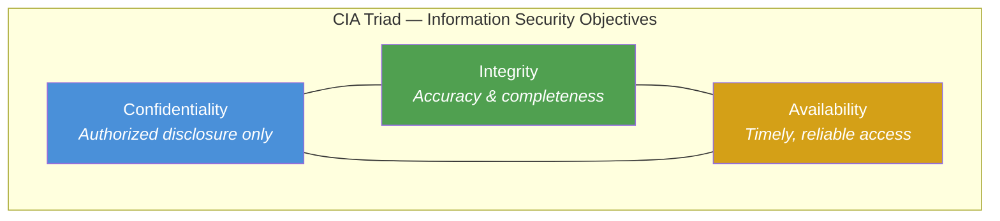

# CIA Triad

The **CIA triad** is the foundational model for information security. Each vertex represents a security objective; controls typically strengthen one or more vertices while trading off against others.

## Relationships and trade-offs

| Objective | Primary threat | Example control | Trade-off |
|-----------|----------------|-----------------|-----------|
| **Confidentiality** | Unauthorized disclosure | Encryption, access control, NDAs | Strong encryption can slow availability during key recovery |
| **Integrity** | Unauthorized modification | Hashing, digital signatures, change management | Strict integrity checks can reduce operational agility |
| **Availability** | Denial of service, outage | Redundancy, DR, load balancing | High availability duplicates data, affecting confidentiality surface |

## Extended models

Modern courses extend the triad with **Authenticity** (verifying identity of parties), **Accountability** (audit trails), and **Non-repudiation** (proof of origin). These support governance, risk, and compliance (GRC) frameworks discussed in Lectures 7–9.
