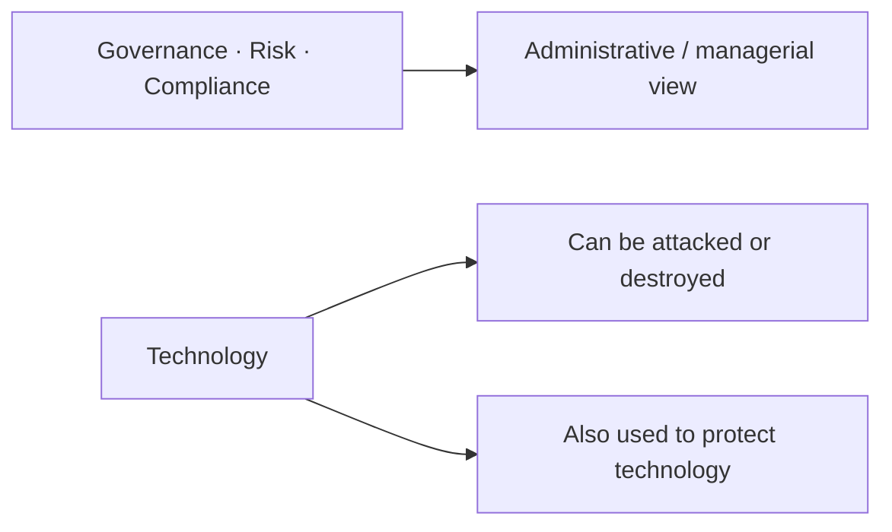
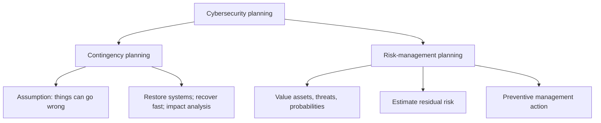
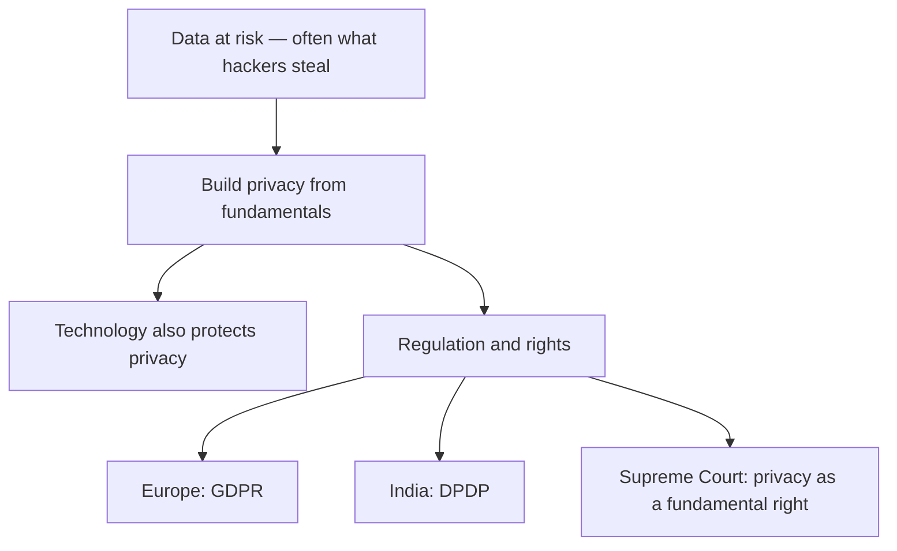

# Lecture T01: Course Welcome

**Playlist index:** 01  
**Transcript:** [01-introduction-course-welcome.md](../../transcripts/markdown/01-introduction-course-welcome.md)  
**Video:** https://www.youtube.com/watch?v=OYsY5B9pqYU  
**Week / theme:** Introduction — why this course exists (managerial welcome)

## Learning objectives

- State why the course treats the cyber world as having a bright side and a dark side.
- Explain why cybersecurity is a management and governance issue, not a technology issue alone.
- Name the two kinds of cybersecurity planning this course will teach: contingency planning and risk-management planning.
- Trace the path from cybersecurity into information privacy, including why data, regulation, and stakeholders matter.

## What this lecture actually teaches

### The dark side of a useful digital world

The course is about **the dark side of the cyber world**. Digital technologies have emerged extensively; people use them as individuals, in groups, in organizations, and in government. Technology eases life and raises efficiency and effectiveness of work. At the same time, as adoption grows, so do the challenges from what the instructor calls the dark world.

Hackers update themselves on new technologies. They try to disrupt, attack, and cause damage for various reasons. Unless you secure technology and digital assets, an entire business or organization may collapse if it is highly dependent on digital technologies. Recent incidents show the potential of cyber attacks to disrupt and destroy the digital world.

The lecture flags **drones** as a current example: they destroy not only physical assets but even human beings. Other kinds of cyber attacks and threats are also increasing. That is the motivational frame for the whole course.

### Two purposes of the course

The purpose is manifold:

1. **Awareness** of the dark side of the digital world, especially for **practicing managers** and **cybersecurity professionals**. They need to understand the cybersecurity challenges.
2. **Not technology alone.** The course treats cybersecurity and privacy as a **management issue** and a **governance issue**.

From a managerial perspective, three words are critical: **governance, risk, and compliance (GRC)**. The course takes an administrative or managerial perspective. It also looks at technology that can be challenged or destroyed, and at technology as a source for **protecting** technologies. That is the **twofold role of technology** promised in this welcome (later lectures expand it to a triple role).

### Cybersecurity as management of cyber assets

A third strand is **pure management of cyber assets** and the work of securing them. That takes the course back to a fundamental lesson of management: **planning**. Cybersecurity planning is taught from two perspectives.

**Contingency planning.** The basic assumption is that things can go wrong. Incidents can happen. A cyber attack can happen. Someone can take control of a machine and ask for money — **ransomware**, which the instructor says is growing. When an attack happens, how can an organization restore technology to a normal condition, and how fast can it recover? That bundle includes contingency planning and **impact analysis**.

**Risk-management planning.** Here cyber assets are treated as assets to be protected. You evaluate the value of each asset, the potential threats, and the probabilities, and you arrive at a quantitative or qualitative estimate of **residual risk**. Then you plan management action for each asset. This is **not** an assumption that something has already happened. It is not reactive; it is **preventive**.

The course deals with **both** aspects of cybersecurity planning, and it covers **standards** that are useful in implementing such plans.

### Protection technologies, then privacy

Subsequently the course deals with **cybersecurity technologies**, especially from a **protection** point of view: what technologies exist to protect cyber assets. In that context it will discuss **cryptography** and recent developments, and it will bring in an **industry expert** to share current technologies in use.

Alongside that track, the course moves from cybersecurity to **information privacy**. Often what is at risk is **data**: that is what hackers often steal. Individual data has value. The course builds privacy from fundamentals: what is privacy, what is information privacy, and what current developments worldwide are related to it.

### Regulation, rights, and who should take the course

As individuals, organizations, and governments use more IT, **regulations** are being enacted in different parts of the world. In India, the lecture points to an expected **Digital Personal Data Protection Act (DPDP)**, which the instructor describes as waiting to become law. The Indian government is conscious of individuals' information privacy. The **Supreme Court of India** has upheld privacy as a **fundamental right**.

As technology becomes pervasive, vulnerability of individuals grows, and it becomes a **government responsibility** to protect it. How do you protect privacy? **Using technology.** So a role of cybersecurity is also to protect information privacy. The course then asks who is responsible, who the **stakeholders** are, and what regulation does in different parts of the world — from Europe's **GDPR** to India's **DPDP**.

It also looks at cybersecurity and technology from **managerial, economic, and strategy** perspectives.

**Who should take the course?** Those who **use** technology, those who are **responsible** for technology, and those who **over-use** technology today.

## Cases and examples from the lecture

- **Drones** used to destroy physical assets and even human beings — cited as a current form of cyber-related threat, not as a full incident write-up.
- **Ransomware** as the running example of an attack that takes control of a machine and demands money; this is the hook for contingency planning (restore and recover).
- **India's DPDP** (then pending) and **Europe's GDPR** as the regulatory pair the privacy half of the course will use.
- **Supreme Court of India** holding privacy to be a fundamental right.

No named corporate breach (Target, AIIMS, Aramco) is taught in this welcome video; those appear in later introduction and foundations lectures.

## Key terms

| Term | Meaning in this lecture |
|------|-------------------------|
| Dark side / dark world | The growing set of attacks, disruptions, and damages that travel with digital adoption |
| Digital assets | The technology and data on which a business or organization may wholly depend |
| GRC | Governance, risk, and compliance — the managerial frame for cybersecurity |
| Twofold role of technology | Technology can be attacked or destroyed; technology is also a source of protection |
| Contingency planning | Planning that assumes incidents (including ransomware) can happen, then restore and recover |
| Residual risk | The quantitative or qualitative leftover risk after valuing assets, threats, and probabilities |
| Risk-management planning | Preventive planning of management action per asset; not an assumption that harm has already occurred |
| DPDP | Digital Personal Data Protection Act — India's then-pending privacy law |
| GDPR | European data-protection regulation, named as a global counterpart to DPDP |

## Formulas / frameworks (if any)

- **GRC triad (managerial):** governance + risk + compliance.
- **Two-track planning:** contingency (reactive recovery after incidents) versus risk management (preventive residual-risk action).
- **Course arc:** awareness → GRC/planning/standards → protection technologies (including cryptography and a guest practitioner) → information privacy (fundamentals, stakeholders, GDPR/DPDP, managerial–economic–strategy view).

## Distinctions the instructor insists on

- Technology's usefulness (ease, efficiency, effectiveness) is not the whole story; **adoption and dark-world challenges grow together**.
- This is **not** a technology-only course. Cybersecurity is also administration: GRC.
- Contingency planning **assumes something can already have gone wrong**; risk-management planning **does not** assume an incident has happened — it is preventive.
- Privacy is not a side topic bolted on at the end: **data is often what is at risk**, and cybersecurity technology is also a tool for protecting information privacy.

## Exam-oriented recap

- Course thesis: digital technology eases work **and** creates a dark side that can collapse a digitally dependent organization.
- Audience: practicing managers and cybersecurity professionals; anyone who uses or is responsible for technology.
- Managerial core: GRC; planning of two kinds (contingency / residual-risk); standards.
- Technology: both target and protection; later, cryptography plus an industry guest.
- Privacy track: data value → fundamentals of privacy → DPDP, GDPR, Supreme Court right to privacy → stakeholders and strategy.
