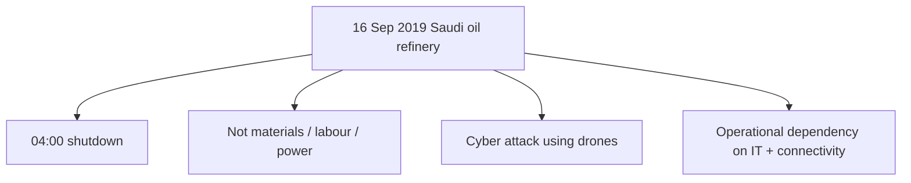
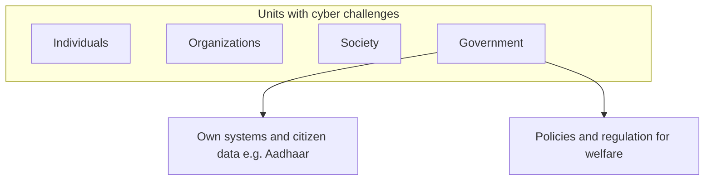
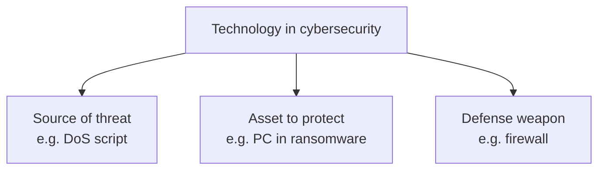

# Lecture T03: Introduction — Part 02

**Playlist index:** 03  
**Transcript:** [03-introduction-part-02.md](../../transcripts/markdown/03-introduction-part-02.md)  
**Video:** https://www.youtube.com/watch?v=nadHKp3egDY  
**Week / theme:** Introduction — digital dependency, drones/IoT, stakeholder units, technology's triple role

## Learning objectives

- Explain how internet-connected cars, IoT sensors, and drones move cyber risk from "lost data" to **halted systems and harm to people**.
- State the instructor's basic principle: **any device connected to the internet is not safe**.
- List the **units** cybersecurity affects: individuals, organizations, society, and government — including government's dual role.
- Articulate technology's **triple role**: source of threat, asset to protect, and defense weapon.

## What this lecture actually teaches

This session continues the motivation that ended Part 01 on **transportation**.

### Internet-connected cars: updates and takeover

Suppose you are riding a **digital car** at high speed, with speed itself computer-controlled. Cars are now internet-connected; they get updates through the internet. **Tesla** is the example: you wake up, enter the car, and it may already be newer than yesterday. That is the exciting digital world.

The dark scenario: a hacker takes control of **your** car at high speed — and not just one car, **the whole traffic**. These are potential future scenarios in transportation. That is why the **International Centre for Automotive Technology (ICAT)**, which tests cars before they are released, has made **cybersecurity testing much more stringent**. Every car is tested for cybersecurity because damage can be not just to the car but to **human life**.

The digital world can **enable** human life and also **destroy** it. It is no longer only a computer attack where you lose some data; it can bring systems to a halt and **damage people**.

### Saudi oil refinery, 16 September 2019 — drones

On **16 September 2019** the instructor recalls faculty stopping on an evening walk to talk about an attack on a **Saudi oil refinery** (he names it **Ramco**). It happened at **4 a.m.** The company was **going public**. The refinery shut down — not for lack of raw materials, not because workers failed to report, not because of power failure, not for any commonly understood cause of shutdown, but because of a **cyber attack**. The tool: **drones**. The seriousness is the point.

IIT Madras, he jokes, can still teach if power and digital support fail. **By and large**, industry and government are **overly dependent on computers** for day-to-day operations, especially with **ERP systems**. Long ago **Citibank** said it was a **branchless bank**: it runs on computers, networked computers, and ERP. If software or the computer network stops, **the bank stops**, even if people are present. Criticality of information systems — and of **internet connectivity** — is very high. That is what the Saudi refinery illustrates.

### IoT and the unsafe-if-connected principle

A further development: **smart connected devices**. **IoT (Internet of Things)** is the example. These are devices other than ordinary PCs/laptops: computers with processing units that **connect to the internet and transmit data**.

Example: a **temperature sensor** in a refinery — maybe no display, cabled or wireless — sensing and transmitting temperature. Experts' **basic principle** in this lecture: **any device, any system that is internet-connected is not safe**. If an IoT sensor of a process-control parameter is hacked, imagine temperature actually **500°C** reported as **5°C**: the wrong signal can **totally damage the system**.

**Manufacturing 4.0** is the bright side: high-end / smart connected devices, hyped in literature and trade magazines. The instructor's own past: **ten years in process control** with mostly **analog** technologies. A sensor was **wired** to a controller; a standard signal ran between them; there was **no way** for someone to access and manipulate it remotely in the same way. The same sensor, once **digital and internet-connected**, raises the potential for unauthorized access. When the world relies on internet-connected digital technologies, incidents like the refinery become **eye-openers** about a vulnerable world.

### Drones after the refinery: Soleimani

After the Saudi attack there was politics: the US said **Iran** was behind it. A few months later, a **US drone strike on Baghdad airport** killed **Qasem Soleimani**, described here as a commander highly respected in Iran. He was not killed by a soldier or a gunshot; **a drone** killed a military leader. **Drones have come into the picture of the cyber world.** That is a starting point for this course.

### From information security to cybersecurity

Cybersecurity used to be called **information security**; the two topics still sit side by side. Cybersecurity is the **more recent** term for security of computer systems in the modern world. The older belief: what matters most in computer systems is **data**. Information systems **create, store, transmit, process, and present** data (data → information → knowledge), plus process automation.

The **scope is widening**: from security of information to security of **infrastructure** and security of **people**. What has become more insecure is not just machines and data but **people**. The potential to cause damage to people is **real**, not science fiction. It has actually happened.

### Embarrassment cases: Air India, Twitter, TCS

From the instructor's collection:

- **Air India's data breach** (a few years before the lecture) caused huge embarrassment.
- **Twitter**, a technology company, came under cyber attack. Celebrity handles (**Bill Gates**; a **US election contestant**) were hacked. Twitter had to explain **in public**. You do not expect a tech firm to be outsmarted; when you work for a reputed technology organization, that public explanation is part of the risk.
- **TCS** website was hacked years ago. Newspapers treated it as a headline joke: an IT company's website hacked. TCS had to explain that **it does not maintain its own website; it is outsourced**.

The instructor says he is **not** going to teach a catalogue of incidents, politics, or popular media. The purpose was an **overview of cybersecurity in the current world**.

### Four summary points (motivation)

**1. Current and serious.** Cybersecurity is happening. **More digital invites more cybersecurity problems.** Newspapers of the 1950s–60s did not talk about cyber attack or information security; there was probably no such course. With more adoption, concern grows about protecting technology against the dark world.

**2. Pervasiveness.** All of us use digital technology daily. How often do you look at your phone? Scholars say **frequent information is a need**; use is not necessarily addiction, even if elders scold. The world is **not walking back** to the 1950s–60s. We have to **learn to manage the cyber threats we live with**.

Cars can have accidents. Solution one: **stop using cars**. Solution two: **increase safety**. Route two is sensible. We cannot throw away phones or stop using the internet (some people do: IT faculty who refuse WhatsApp, households without television, people with no social-media accounts). That is one way to protect yourself, but **to protect yourself you lose something**. Generally people are **not willing to lose the privileges** of the digital world. Autonomous cars may make transport efficient and personalized; it comes at a cost, and **safety should not be compromised**. **Due attention** to cybersecurity at different levels.

**3. Different units, different domains.** Cybersecurity affects **individuals** (your bank account or individual data — not only because you are an employee), **organizations**, **society**, and **government**. The landscape is wide. Healthcare versus manufacturing have **different implications**. It is not restricted to one domain.

Government should be concerned in **two ways**:

- Government **systems can be attacked** and **government data can be leaked**. Government possesses a lot of data. **Aadhaar** will be a case study later: a load of personal data; if it goes to the wrong hands, **people's privacy** is compromised.
- Government's role is **safety and welfare of citizens**, so it must **formulate policies and regulations**, regulate the cyber world so the country is safe, progresses, and taps digital technologies **without compromising security**. That is a big order, a challenge every government faces. No government wants to discontinue digital technologies; India is described as tech-savvy, which is good, but there are huge **privacy and data-protection** challenges — a **close cousin of cybersecurity**. The two are interrelated and getting national attention. Later: regulation across the globe, developed countries and India. Related to technology, privacy, **and politics**. The instructor will try to stay **government / political-party neutral**; parties change their stance from opposition to ruling, but **privacy is an important issue of the day**.

**4. Technology's triple role.** The instructor's articulation: technology plays **three** roles in cybersecurity.

1. **Source of threat.** Example already raised in class: **denial of service** — an attack on a network or computer **using another computer**; a script on one machine stalls another. Technology used for cyber attack. Scripts are **available in public** if someone wants to try DoS.
2. **Asset to be protected.** Data centers, databases, important devices. In ransomware, **the computer is the asset** that gets attacked.
3. **Defense weapon.** Protection mechanisms predominantly **deploy technology**. Example: **firewall** technology to defend or protect assets.

When you use the word "technology" in cybersecurity, keep in mind **which** of the three you mean. People generally think "cybersecurity technologies" means **protection** technologies. **Not necessarily.** You need the nuances.

## Cases and examples from the lecture

- **Tesla / internet-connected cars** and **ICAT** tightening cybersecurity tests because life is at stake.
- **16 September 2019 Saudi oil refinery** (named Ramco): 4 a.m. shutdown, drones, company going public.
- **IoT temperature sensor**: 500°C vs 5°C; analog wired control vs internet-connected digital sensors; **Manufacturing 4.0** as the bright side.
- **US drone strike** killing **Qasem Soleimani** at Baghdad airport — drone as the killing instrument, not a soldier's gun.
- **Air India** data breach (embarrassment).
- **Twitter** celebrity-handle hacks (Bill Gates; election contestant) and public explanation.
- **TCS** website hack; newspapers as "fun" headline; defense that the site was **outsourced**.
- **Citibank** "branchless bank" as extreme IT dependency.
- **Aadhaar** flagged as a coming case of government-held personal data.

## Key terms

| Term | Meaning in this lecture |
|------|-------------------------|
| Smart connected devices / IoT | Devices with processing that connect to the internet and transmit data, not only PCs |
| "Any internet-connected device is not safe" | The basic principle stated for IoT / connected systems |
| Manufacturing 4.0 | New generation of digital / smart manufacturing — taught as the bright side of the same sensors |
| Information security vs cybersecurity | Older focus on data in IS; cybersecurity is the more recent, wider term |
| Scope widening | From information → infrastructure → people; damage to people is real |
| Units | Individuals, organizations, society, government — all have cyber challenges |
| Government's dual concern | Protect own systems/data **and** regulate for citizen welfare |
| Privacy as close cousin | Privacy / data protection interrelated with cybersecurity |
| Triple role of technology | Threat source, asset, defense weapon |

## Formulas / frameworks (if any)

- **Cars analogy:** do not ban the useful technology; **increase safety** (same logic as not abandoning digital tools).
- **Trade of privileges:** refusing WhatsApp / TV / social media can reduce exposure, but you **lose** digital privileges; most people will not take that path.
- **Triple-role test:** whenever "technology" is mentioned in a cybersecurity sentence, name whether it is the **attack tool**, the **asset**, or the **control**.

## Distinctions the instructor insists on

- Losing data on a computer is **not** the ceiling of harm; connected cars, refineries, and drones show **halted operations and harm to people**.
- Analog wired sensors were hard to manipulate remotely; **digital + internet** is what opens unauthorized access.
- Cybersecurity is **not** just a new name for information security; **people and infrastructure** are in scope.
- A hacked **IT company** (Twitter, TCS) is taught as **embarrassment and public explanation**, including the outsourcing excuse — not as proof that "tech firms cannot be hacked."
- "Cybersecurity technologies" **does not automatically mean defensive products**.
- Government is both a **potential victim** (Aadhaar-scale data) and a **regulator**; privacy will be discussed with a claim of party-neutrality.

## Exam-oriented recap

- Connected cars + ICAT: cybersecurity testing because lives can be destroyed, not only data lost.
- Saudi refinery 16 Sep 2019, 4 a.m., drones; Citibank/ERP as "if IT stops, the organization stops."
- IoT principle: internet-connected ⇒ not safe; false temperature can wreck process control.
- Drones also kill (Soleimani); people are now in the security perimeter.
- Units: individual / organization / society / government; government = own systems + regulation.
- Technology = threat + asset + defense; DoS scripts and firewalls are both "technology."
