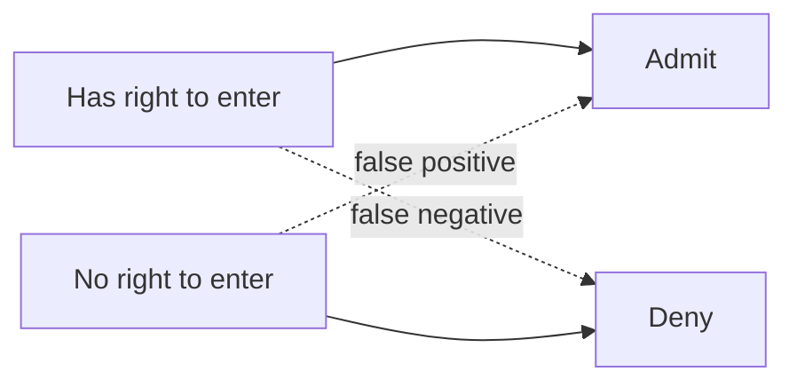
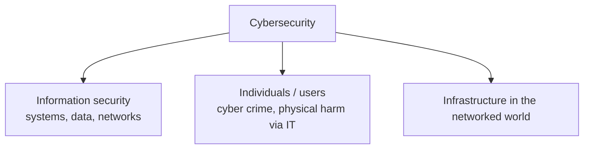
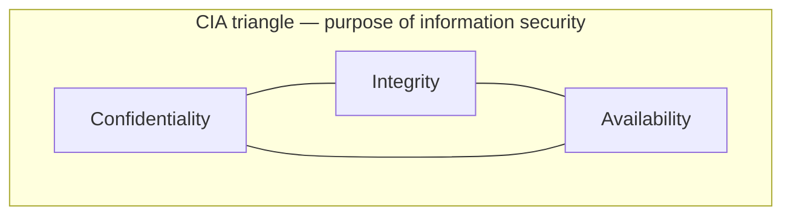
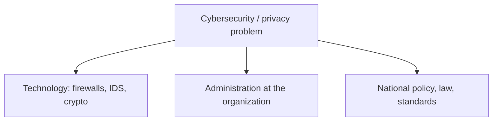
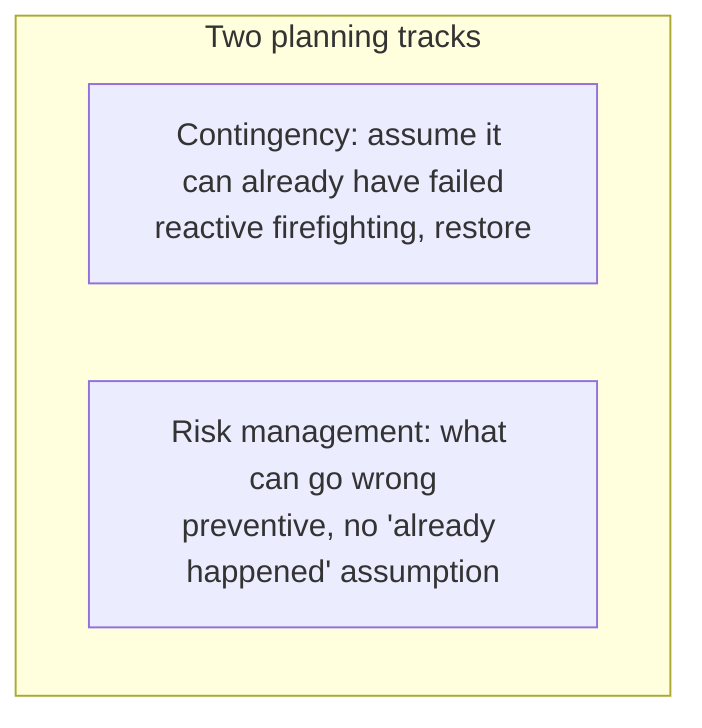

# Lecture T04: Introduction — Part 03

**Playlist index:** 04  
**Transcript:** [04-introduction-part-03.md](../../transcripts/markdown/04-introduction-part-03.md)  
**Video:** https://www.youtube.com/watch?v=ZmCtYgj9kSo  
**Week / theme:** Introduction — what "security" and "cyber" mean, CIA preview, course philosophy

## Learning objectives

- Define **security** as a state (and a psychological sense) of being safe, then scale it from the individual to the organization.
- Distinguish **information security** from the wider **cybersecurity**, including the ITU 2008 definition and the spelling conventions.
- State the **CIA** triangle as the three elements cybersecurity/information security seeks to ensure, and quote the Whitman and Mattord definition of information security.
- Explain why this course is **management and governance first**, with technology in a threefold role, and preview GRC, two kinds of planning, Target/Sony, and privacy regulation.

## What this lecture actually teaches

### What "security" means before "cyber"

The instructor opens with a plain question: what do you mean by **security**, leaving "cyber" aside? Class answers include protection from threats and protecting what is important. He also wants the **general** meaning: when do you **feel** secure?

He includes **physical security**, not only information security. Security is a **psychological sense** as well. Information security also has an **emotional dimension**, but as a student pointed out, it is a **quality or state**. In a general sense, security is a **state of being safe** or a **state of feeling secure**: no miscreants trying to attack, intrude, or damage your property, assets, information, or yourself.

These are constant concerns for **survival**. Change the unit from **individual** to **organization** and organizations also have assets to protect.

- **Individual:** the most important asset is **my body / my life**; next is **information I carry in my mind**.
- **Organization:** plenty of assets — **physical** and **informational**. That used to be the scope of cybersecurity / information security in the past.

### Information security versus cybersecurity

When people said cybersecurity, the **general understanding** was: securing **information**, **computers**, **computer networks** — nothing beyond that. Today the scope is also about securing **what is added**.

**Information security:** protect information as an asset — data and information. Example: **AIIMS** database servers — people got access; that should not happen; it is a **data breach**, hence information security.

**Cybersecurity:** information security is **a part of** cybersecurity, but cyber adds much more. Organizational security includes **physical security** of infrastructure, **personal** security, **operations**, **communications**, **network**, **information**, and so on.

**IIT Madras gate.** Before you enter, there is a **security gate** and personnel **24×7**. The institute invested in the gate to ensure security of organizational assets. What does that security **do**? It ensures that people who enter are **authorized**: those who have the right to enter **only** enter, and others do not — and conversely, those who have the right **should be able to enter** (they should not be denied). **False positives and false negatives** can happen. To do this they must know **who is who** — **verification**. How cybersecurity is ensured will be treated more systematically later.

### How to write the words "cyber" and "security"

Three written forms: **cyber security** (space), **cyber-security** (hyphen), **cybersecurity** (one word). **All three are correct**, with one condition: **pick a convention and follow it consistently** in the same paper.

- **Europe:** typically two words — `cyber security`.
- **United States:** one word — `cybersecurity`.
- **India:** a **compromise** — hyphen `cyber-security`, so as not to displease anyone.

Journals from the US will show one word; European writing will show two.

### Where "cyber" comes from

From the **1990s** onward, **cyber** became associated with computers, networked computers, predominantly the **internet** — the cyber world. It is a prefix: **cyberspace**, **cyber coolie**, **cyber world**.

The word comes from **cybernetics**, a **Greek** word. Cybernetics means someone **steering a ship or vehicle** — the **steersman**, someone in **control**. Cybernetics means **control**. Someone pulled **cyber** out to represent the internet. **Internet-connected world / systems** = cyber systems / cyber world. **Cybersecurity** then denotes security of the **computer-networked / internet world**. That is the word-meaning basis for differentiating it from information security.

### ITU 2008 definition (all-inclusive, "kilometre long")

The **International Telecommunication Union (ITU)**, a global body for telecommunications and digital technologies, gave a definition of cybersecurity in **2008** (not from a textbook). It tries to include every aspect of computing: **tools, policies, security concepts, security safeguards, guidelines, risk management approaches, actions, training, best practices, assurance, technologies**. Many items correlate; **definitional clarity is an issue**, but cybersecurity is **all-inclusive** — security of everything under the cyber world.

Therefore cybersecurity **involves users / human beings**, not just information. On **Facebook**, keeping a profile free of unauthorized access is an **information-security** concern. There are **other** concerns: **your own security in the cyber world**. There are cyber attacks on individuals, bullying, **cyber crimes** (the TA Binod's research is related to cyber crimes). Criminals can cause **physical damage** through these channels. Security of individuals from cyber crimes is part of cybersecurity; it **may not** be information security — **bigger scope**.

The instructor's definitional slogan: **cybersecurity is information security plus individuals**. Drone example: the drone has surveyed premises (intelligence / leak of information) but it can **attack and kill me**. **My safety through the use of information technology** is under cybersecurity. Cybersecurity covers **users and systems**. Information security is more about **systems** and their security.

Because this is emerging, the course **borrows concepts from information security**, where the literature is well developed. The **textbook is titled Information Security** (predominantly that field); other aspects of cybersecurity come through **extra reading materials**.

### CIA triangle (preview; details next class)

Cybersecurity seeks to ensure three aspects, generally known as **CIA**, the **CIA triangle**: **confidentiality, integrity, availability**. Three dimensions of **information** security: confidentiality, integrity, and availability **of information**. That is the purpose of **information security management**. Parsing of each term is promised for the next class.

**Whitman and Mattord definition of information security** (2018 textbook — a leading text in information security **management**):

> the protection of information and its critical elements, including the systems and hardware that use, store and transmit that information.

### This course is not a CS cryptography course

**Caution on expectations.** Information security can be taught as a **technology / computer-science** course, or from a **managerial / management and governance** perspective, where technology is **one** aspect. We need to understand technology's role in cybersecurity management, but **it is not a study of technology**. Cybersecurity is **much more than cybersecurity technologies**.

The 2018 textbook covers **management and governance**: what managers should know about security of **information assets** and **other assets including people**. That is the predominant focus.

**Cryptography example.** A CS course may dwell on cryptography for many sessions because it is an underlying technology for **confidentiality**: information from node A to node B should be read only by the intended person. You **cannot always prevent access**. Classroom analogy: everyone **hears** the lecture because of a **shared language** (words + grammar). If the instructor spoke **Greek**, students still have **access** (they are listening) but **do not understand**. In computer transmission there is no body language — only the information. **Encryption** is that other language: even if you gain access, you cannot understand ("deep encryption" in his phrasing). Important as technology, but this course takes the **application** perspective: **what encryption does**, not **how encryption algorithms work**.

### Technology problem or administrative problem?

He will use a case next class to make this sharp. Quick class views: **both**; or **more administrative**; or (because technology is attacked and used to attack) **focus on technology**; or administration as the **overarching framework that deploys techies**.

A counter-view **techies** may like: movement toward **zero trust** — **no trust in human beings, trust none**. Deploy technology so you are not dependent on anyone's credibility; humans become less important, technology more important. He flags this as a **debate** to revisit, and has articles on it.

Big **data-breach cases** will show a **more complex problem**: not only technology issues but **huge administrative issues** and **regulatory implications**. Government wakes up after breaches. If data protection is **not regulated**, there is no one to question you — why would a company invest so much? **Law of the land** matters. India was then **debating a personal data protection** law/bill (politics included). **GDPR** is named; students have heard of it. The issue has gone **beyond administration to policy and regulation at national levels**.

Seeing cybersecurity as **narrowly** putting up **firewalls** or **intrusion detection systems** is an important **element**, but there also need to be **administrative and government systems and standards**, and **policies and regulation** to govern at country level. **That is what cybersecurity and privacy today are.**

### Course philosophy, CLO1, and the map of topics

(Platform logistics — Moodle posting, extra videos as files — are omitted.) The **philosophy** is what he outlines. **Four** course learning objectives; he fully states the first:

**CLO1.** Recognize cybersecurity from **technological and administrative** perspectives. See that it is **both**. He will not ignore technology or make it "just a management talk." Technology will be covered as **threat, asset, and protection** — the **threefold role**. He is **not** the expert on protection mechanisms in depth; that needs technical knowledge and experience. **Pedagogy:** a **guest from industry**, a practitioner; technical doubts should go to that guest.

**Session map he actually walks through:**

- **Foundations** of cybersecurity, information security, and related concepts (textbook + research articles).
- **Principles of information security management:** confidentiality, integrity, availability — **next session**.
- **Case: Target Corporation** — a defining breach (he also places **Sony** around **2014**; the two together shook industry **and government**). Target is the representative case they will analyze. (He also says 2016 alongside Sony in passing; the Target discussion in later lectures is dated **2013**.)
- **Security management, GRC** — frameworks, an **ISO** standard, GRC as a practice rather than buying technology in bits and pieces; becoming **compliant** with standards.
- **Two types of planning** (management = planning and managing resources):
  - **Contingency planning:** despite all protective steps, **things can go wrong**. Human brains cannot predict the future completely. **Reactive / firefighting**; restore to normal operation.
  - **Risk management:** no assumption that something **has** gone wrong; what **can** go wrong, and how do you protect against that. **Proactive / preventive.**
- **Cybersecurity policy** as a top reference document for priority and resources.
- **Technologies:** guest lecture; one session on **cryptography** from a **confidentiality** point of view; **passive defense versus active defense**. Passive = building walls to protect. "Offense is the best defense" — can you attack hackers? **Active defense** goes beyond walls to "shooting." **Legal sides** are not trivial.
- Then the course **moves to privacy**: information-privacy landscape and **regulation** in **North America, Europe, and India**, with several cases.

## Cases and examples from the lecture

- **AIIMS servers** as the information-security (data-breach) illustration while defining the narrower term.
- **IIT Madras security gate:** authorized entry, false positives/negatives, verification.
- **Facebook profile:** unauthorized access = information security; bullying / cyber crime / physical harm = the extra cybersecurity layer.
- **Drone** that can kill after surveying premises — users, not only systems.
- **Encryption as Greek:** access without understanding.
- **Zero trust** named as a technology-heavy counter-argument to "administration first."
- **Target** (representative case next) and **Sony (c. 2014)** as world-shaking breaches.
- **GDPR** and India's then-debated personal data protection bill as evidence that the problem is **regulatory**, not only local admin or firewalls.

## Key terms

| Term | Meaning in this lecture |
|------|-------------------------|
| Security (general) | A state of being safe / feeling secure; also psychological / emotional |
| Information security | Protect information as an asset (data, databases, systems that use/store/transmit it) |
| Cybersecurity | Information security **plus** individuals (and the networked world's users and systems); ITU 2008 is all-inclusive |
| Cybernetics | Greek origin: steersman / control; source of the prefix "cyber" |
| CIA triangle | Confidentiality, integrity, availability of information |
| False positive / false negative | Wrongly admitting someone without right, or wrongly denying someone with right (gate analogy) |
| Zero trust | "Trust none" — reduce dependence on human credibility |
| Contingency vs risk planning | Reactive restoration after failure vs preventive treatment of what *can* go wrong |
| Passive vs active defense | Walls / protection vs going beyond, including "shooting" / offending attackers (legal issues flagged) |

## Formulas / frameworks (if any)

- **Spelling rule:** any of the three written forms, **one convention per document**.
- **Whitman & Mattord (2018):** protection of information **and its critical elements**, including systems and hardware that **use, store, and transmit** that information.
- **ITU (2008):** long list (tools, policies, concepts, safeguards, guidelines, risk-management approaches, actions, training, best practices, assurance, technologies) — taught as **breadth**, not as a definition to memorize word-for-word.
- **Course stack:** foundations / CIA → Target (and Sony as twin shock) → GRC/ISO → contingency + risk → policy → crypto & defense (guest) → privacy regulation (NA, EU, India).

## Distinctions the instructor insists on

- Feeling secure is real, but organizational security is about **authorized vs unauthorized** entry and **verification**, including gate errors.
- **Information security ⊂ cybersecurity.** Adding "cyber" is not a synonym swap; **people** (cyber crime, drones, safety) enter the scope.
- US vs European **spelling** is a consistency issue, not a meaning issue.
- This course studies **what encryption does**, not **how the algorithms work**.
- Firewalls/IDS are **an** element; without **administration, standards, and national regulation**, investment incentives collapse.
- Contingency planning is **firefighting after failure**; risk management is **preventive** and does **not** assume the incident has already happened.
- Active defense is **not** a casual suggestion — **legal sides** matter.

## Exam-oriented recap

- Security = state of safety (and a feeling); orgs protect physical + informational assets; gates implement authorized access with possible false +/−.
- Cyber from cybernetics (control / steersman) → internet-connected world.
- Cybersecurity = IS + individuals; ITU 2008 is deliberately all-inclusive.
- CIA is the purpose of information security management; Whitman–Mattord 2018 is the textbook definition.
- Managerial course: GRC, two planning types, policy, Target/Sony cases, guest on protection tech, then privacy law (GDPR and India).
- Technology's threefold role remains in force; "cybersecurity technologies" ≠ only products you buy to defend.
