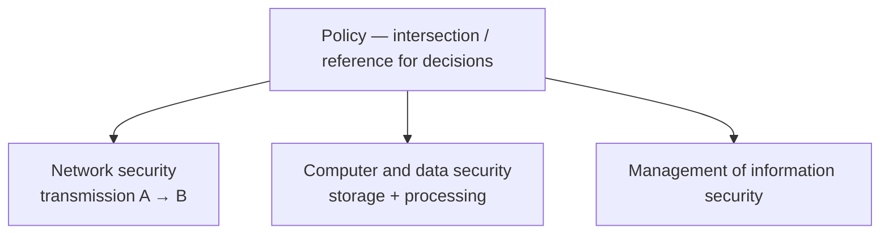
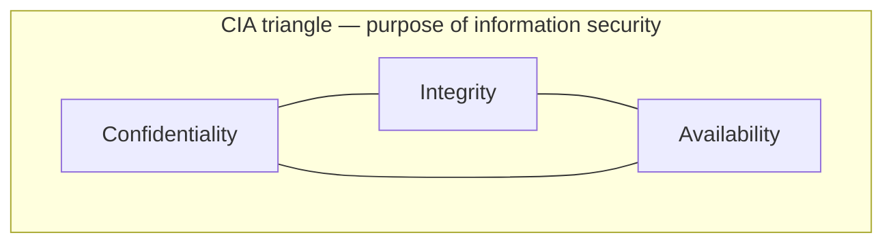
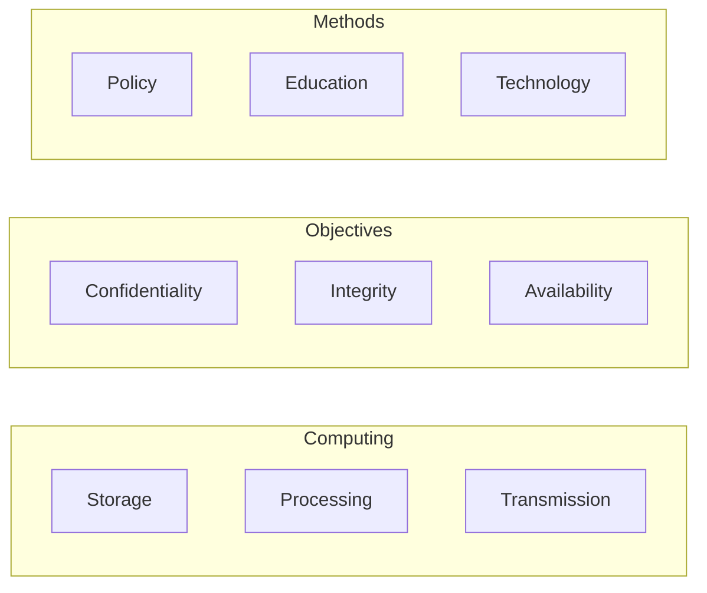
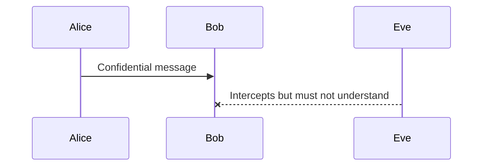
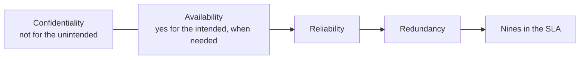

# Lecture T05: Foundations — Part 01

**Playlist index:** 05  
**Transcript:** [05-foundations-part-01.md](../../transcripts/markdown/05-foundations-part-01.md)  
**Video:** https://www.youtube.com/watch?v=WAImfXGwhOs  
**Week / theme:** Foundations — information-security dimensions, McCumber cube, CIA in detail

## Learning objectives

- Read information security as three constituents (**network; computer and data; management**) with **policy** at the intersection, mapped onto storage, processing, and transmission.
- Use the **McCumber cube** (NSTISSC / John McCumber) so that no cell of cybersecurity is missed.
- Define **confidentiality, integrity, and availability** the way this lecture defines them, with the Alice–Bob–Eve, CV, and IRCTC examples.
- Recall CIA as the **purpose** of information security even if everything else is forgotten.

## What this lecture actually teaches

Privacy as a full topic waits until several cybersecurity sessions are done; connections to data privacy come later. This session is **foundation for cybersecurity**, with the course still treating cybersecurity as an **administrative issue**: managers administer human, technological, tangible, and intangible resources. It is not a technological issue alone; it is governance and management. Frameworks and **standards** for cybersecurity management in practice were promised earlier.

Technology is still seen in **three dimensions**: **source of threat**, **asset to be protected**, and **tool / firewall** for protecting cyber assets. Challenges are emerging (previous class).

### A holistic diagram: three constituents plus policy

One diagram is titled **information security**. Cybersecurity and information security are closely related; **information security is a part of cybersecurity** and "the most important part." Three **concentric circles** / constituents:

1. **Network security**
2. **Computer and data security**
3. **Management of information security**

A **shaded intersection**, from the management perspective, is **policy**. Policy is the **reference** for security-related practice and decisions — for example, **how much an organization should invest**. Today's case (developed in the next parts) is an organization that invested **as much as the Pentagon** invests in security. Policies **differ** by organization with the **criticality of cyber assets** and other choices. Organizations **make choices** on cybersecurity investments. Policy **guides decisions**.

Another way to slice the same idea: in data and information there are three computing aspects —

- **data storage**
- **data transmission**
- **data processing**

Computer and data security covers **data, databases**, and **computers as processing** (applications that process data) — storage and processing. **Network security** is about data moving **from node A to node B**, where breach / unauthorized access can occur. All three need protection.

To do that you need **management practices and policies**: human resources, protection technology, and decisions on **how much to protect and how much to leave** — management may **not over-invest**. That is the administrative dimension. Cybersecurity is **not one thing**; it is an **integrated effort** to protect cyber assets.

### CIA triangle: the purpose of cybersecurity

Any cybersecurity course — technology or management — shares three fundamental concepts: **Confidentiality, Integrity, Availability**, often called the **CIA triangle**. One way to understand it: CIA is the **purpose** of cybersecurity. What does cybersecurity **do**? It ensures that confidentiality, integrity, and availability of information are secured. That is the aim for information in the cyber world.

The cyber world **goes beyond information** today; those aspects will be integrated slowly. At a fundamental level, the purpose of information security is these three, which matter for **secured storage, processing, and transmission**. Related concepts exist (example named: **accountability**); they will be discussed one by one. For now he uses cybersecurity and information security **synonymously**.

### McCumber cube (NSTISSC security model)

Also known as the **McCumber cube**; **John McCumber** proposed it. It makes understanding **holistic** so a practitioner **does not miss any aspect**. Three dimensions in cubical form:

| Dimension | The three cells |
|-----------|-----------------|
| **Computing** | Storage, processing, transmission — where information/data reside; the devices involved |
| **Objectives / purpose** | Confidentiality, integrity, availability |
| **Methods to ensure security** | **Policy**, **education**, **technology** |

When systems store, process, and transmit, they should be secure — meaning CIA. How? Policy, education, and technology, applied to CIA for storage, processing, and transmission.

**Lesson of a single cell.** Example: an **application** (data **processing**). For that cell, look at all three dimensions. Processing **integrity** must be ensured **with respect to policy, education, and technology**. Count: **3 × 3 × 3** cells. Each cell is holistic. Practicing managers can ask: have **all cells** been considered? Due attention across all three dimensions?

### Confidentiality

Office joke: if you want gossip, stamp a document **confidential** and give it to a clerk — it will be the talk of the town. The word makes people **curious**. People tap data that is not theirs for malice, evil, fun, or **mistake** (human error).

**Definition in this lecture:** if person A sends information to person B and wants it read **only by B, not by any C**, the system must ensure that transmission is confidential.

**Alice, Bob, and Eve.** Rivest, Shamir, and Adleman — entrepreneurs as well as names you will meet in encryption — published in **1978** in **IBM Systems Journal** a diagram: **Alice** sends a confidential message to **Bob**; evil **Eve** wants to intercept and know what is going on. Confidential data should be read **only by the intended recipient**.

Applications: who accesses your **private information**, **credits**, **academic performance**. The institute can grant access to those who should have it; others must not. Best example: **Aadhaar** — biometric, personal identity; the country must ensure it is not accessed by just anyone. "**It is my data.**" That is where **privacy** enters. When I share it, the **data processor** should use it only for those I have **permission / consent** to share with. There is always a **consent** between **data collector / data processor** and **data subject**. That **contract** should be maintained.

**Confidentiality is the responsibility of the data collector** to ensure data is shared only with intended recipients, not unintended ones.

**How to ensure it:** **information classification**. Example: **salary data** in HR — accessible maybe to certain superiors, **not** to peers or subordinates. Policy must be implemented in database access. Classification (including US military **top secret**) comes later. Documents need secured storage; security policies applied; **people trained**.

Even if jealous Eve **intersects** the data, she should not make it out. **Caesar cipher:** Caesar communicated with commanders through someone; if a messenger on the way reads it, they understand nothing. That is **encryption** (details later).

### Integrity

Class associations: **completeness**, **purity**, **no compromise on quality**. Of people we say high or low integrity: **whole / full**; if part is missing (good at the job but into malpractices), integrity is questionable.

**In data:** information transmitted from A to B is whole at A; at B **part is missing**, or it is **changed**.

**CV example.** You share a complete CV with placement; someone jealous **removes work experience**, or changes **10 years to 2 years**. Data is passed but **integrity** is the problem: stolen, missing, or **manipulated**. When data goes A to B it should reach B **intact** — no damage, manipulation, or change.

**Practical / privacy-linked integrity.** If an employer will not let you access your stored bio-data, you cannot **update** a new certificate. **By regulation**, when a subject shares data with a controller/collector, the **subject should have access** wherever it is stored and should be able to **make changes** — "it is my data." That is a **privacy right** and also about integrity (data otherwise incomplete).

**Date of birth** entered as **2010** instead of **2000**: promotions and more can be affected. The **user** is the affected party and must have access. So: **who has access** (confidentiality) and **protecting data without damage** (integrity).

### Availability

**The other side of confidentiality.** Data should **not** be available to the unintended audience, **but should be available when required by the intended party**. Accessible **as per contract**. Critical in some business contexts.

**IRCTC / airline ticket.** You log in, about to reserve, or you want past reservations — **database down**. You have signed in; you have the privilege; it is **your** data (still inside confidentiality); the system should allow access **when you need it**. Reservation time with no data is an **availability** problem.

Cybersecurity management must make **provisions** so intended recipients can get the data. Availability is related to **reliability**: reliable systems are available. In computer systems, **reliability engineering** uses **redundancy**: if one system is down, processing/access continues from others. **Availability by redundancy.**

**How much:** the **number of nines** after the decimal (**99.9999…**) is a sort of **contract** in B2B IT, via **service level agreements**. More availability ⇒ more investment in redundancy ⇒ **higher cost**. You can ask for **100%** availability; **100% comes at a sometimes infinite cost**.

### Straight recall

Even if you forget everything else, **CIA should be by heart**. Woken in the middle of the night: what is cybersecurity doing? **Confidentiality, integrity, and availability.**

The lecture then puts up a **retinal / biometric eye-scan** image (Aadhaar identification) as the bridge into the next part — identification as a first step toward confidentiality.

## Cases and examples from the lecture

- Organization investing in security **on the scale of the Pentagon** (the Target-level investment teaser).
- **Alice–Bob–Eve** (Rivest, Shamir, Adleman, 1978, *IBM Systems Journal*).
- **Aadhaar** as confidentiality / consent / "my data."
- **HR salary** classification: superiors vs peers/subordinates.
- **Caesar cipher** as encryption the messenger cannot read.
- **CV** stripped or altered in transit — integrity.
- Wrong **date of birth** in an employee database — integrity plus the right to access and correct.
- **IRCTC / airline booking** outage after a valid login — availability.
- **Biometric / retinal scan** image as the lead-in to identification (developed in Part 02).

## Key terms

| Term | Meaning in this lecture |
|------|-------------------------|
| Policy (in the diagram) | Intersection/reference that guides security practice and investment decisions |
| Storage / processing / transmission | The three computing aspects that must be secured |
| CIA triangle | Purpose of information security: confidentiality, integrity, availability |
| McCumber cube | 3×3×3 model: computing × CIA × (policy, education, technology) |
| Confidentiality | Intended recipient only (A→B, not C); data collector's duty given consent |
| Integrity | Data arrives intact: whole, unmanipulated; includes subject's ability to keep it complete/correct |
| Availability | Intended party can access when needed, as per contract; other side of confidentiality |
| Redundancy | Extra systems so availability survives a failure |
| Nines | Contractual availability target (e.g. 99.9999…); more nines cost more |

## Formulas / frameworks (if any)

- **McCumber cells = 3 × 3 × 3.** A manager's checklist: for each combination of (storage|processing|transmission) × (C|I|A), are policy, education, **and** technology in place?
- **Availability vs cost:** higher contracted nines ⇒ more redundancy ⇒ higher cost; **100% ≈ unbounded cost**.
- **Consent chain:** data subject ↔ collector/processor; confidentiality = honour that contract about **who** may see the data.

## Distinctions the instructor insists on

- Information security is **part of** cybersecurity but, in this foundations block, the two terms are used **synonymously** while CIA is taught.
- Policy is not a poster on the wall: it is the **decision reference** for **how much to invest** and **how much to leave unprotected**.
- Confidentiality is **not** "hide everything"; it is **intended vs unintended** readers, including after interception (encryption).
- Integrity is **not** only "no hacker edited it"; missing updates and **wrong data entry** (DOB) are integrity failures, tied to **access rights of the subject**.
- Availability is **the other side of confidentiality**, not a third unrelated slogan. Unauthorized people must **not** see it; authorized people **must** be able to.
- Reliability engineering's contribution here is specifically **redundancy**, not a new CIA letter.

## Exam-oriented recap

- Three constituents of IS: network, computer/data, management; **policy** at the centre; map onto store / process / transmit.
- McCumber cube: computing × CIA × (policy, education, technology); do not miss a cell.
- Confidentiality: Alice–Bob–Eve; Aadhaar/consent; classification; encryption so intercept ≠ understand.
- Integrity: intact, complete, unaltered; CV and DOB; subject access to correct "my data."
- Availability: IRCTC; redundancy; SLA nines; 100% can be infinitely expensive.
- Midnight recall: cybersecurity does **CIA**.
