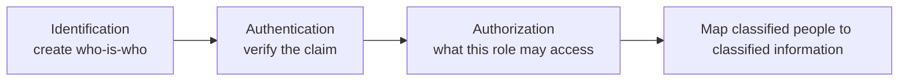
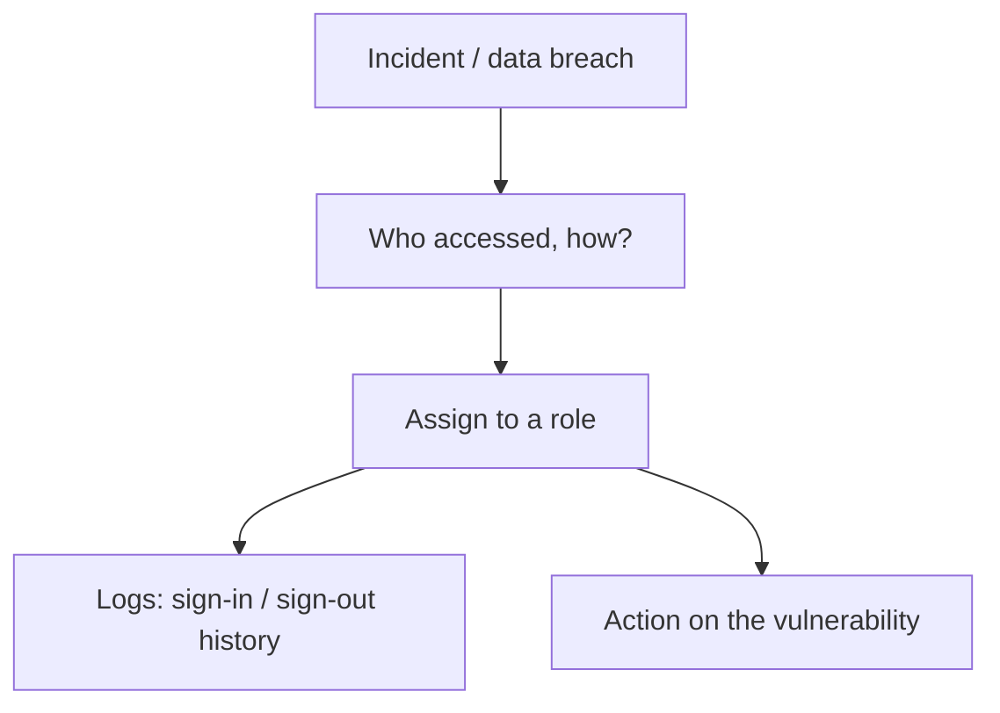
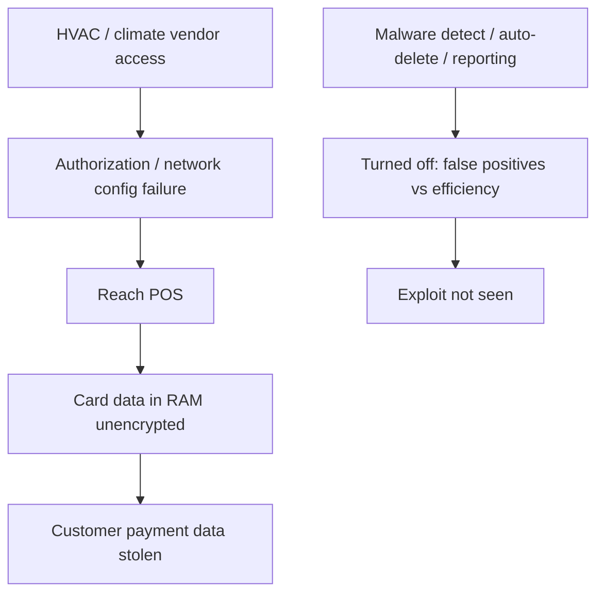

# Lecture T06: Foundations — Part 02

**Playlist index:** 06  
**Transcript:** [06-foundations-part-02.md](../../transcripts/markdown/06-foundations-part-02.md)  
**Video:** https://www.youtube.com/watch?v=9oQb5DIuNKg  
**Week / theme:** Foundations — identification / authentication / authorization / accountability; Target case (what happened and why)

## Learning objectives

- Sequence **identification → authentication → authorization**, and place **accountability** when incidents happen.
- Explain why confidentiality needs a **credible identity** before access rights can mean anything (gate, Aadhaar, SIM, email).
- Tell the **Target** story (US retail, Thanksgiving/Christmas **2013**, HVAC vendor, POS) without jumping to solutions.
- Separate **technological** from **managerial** vulnerabilities, then show why the case **ties them together** (authorization, turned-off malware tools, false positives, efficiency vs security).

## What this lecture actually teaches

The session continues straight from the CIA recap and the **biometric / retinal** image.

### Identification: first step toward confidentiality

To ensure confidentiality, one of the first steps is **identification**. Back to the **security gate**: staff decide who may enter, but they cannot decide by smile, dress, or face alone. There must be a **credible mechanism**.

**Without identity, you cannot ensure confidentiality.** "Who is who?" Whether someone has a right to access is based on identification. In government or organizational data collection, the **first step is to create identity**.

**IIT Madras enrollment:** you provide data and supporting documents; administration runs processes; you receive an **identity card**. At the gate: "here is my identity." A student card identifies a **student**; the instructor's card identifies a **faculty** member — **different role**. **Dates matter** (not an old card). Without an ID card, the gate cannot decide.

**Identification** is the process of creating **credible identity** for individuals who can access computing resources.

**Aadhaar** is the national-scale illustration. The most difficult stage is identification. Government used **vendors**, verified their credibility, **outsourced** collection of identity information, and finally assigned an **Aadhaar number**. Creating an **employee ID**, **roll number**, **Aadhaar number**, or **account number** is all identification. **First step in security: who is who?**

### Authentication: verification of the claim

After identification comes **authentication**. Only if you have **valid identities** will authentication work.

**SIM card / passport.** A telecom operator (Airtel, Jio, anyone) must, by **government regulation**, identify you. An **IIT ID card is not a valid ID** for that purpose. They need proof you are a **citizen of India** with a unique government number. You may **claim** to be Saji; they **want to verify** that claim. **Authentication is nothing but verification.**

At the IIT gate you claim to be a student; **evidence** is the already-created ID card. At a passport office or telecom counter they ask for **fingerprints**. Biometric data stored in **Aadhaar** is checked against the person who claims to be X. If biometrics match the record for X, authentication is done: you claim to be X and you **are** X.

**Authentication** is verification ensuring a person is **who he or she claims to be**. It is the **gateway / entry** into a computing system or organization. Show the ID, you are in. **Creating** the ID was identification; **producing** it at need is authentication.

**Email login.** Two fields: **user ID** (e.g. `saji@iitm.ac.in`) is the **claim**. Anyone could claim to be the instructor to read mail. Then **password**: tell me something **only I am supposed to know**. **Password** is a long-standing authentication method — **something I know**. **Biometric** is **something I have**. Secrecy of the password is the point. The system cross-checks; you are authenticated. If the password has **leaked**, someone can become you — a weakness, hence **multi-factor authentication** (promised later). Authentication tightness tracks the **criticality** of the service.

### Authorization: level of access after you are in

Together, three key concepts **particularly for confidentiality**: identification, authentication, **authorization**.

**Authorization** defines **the level of access** — what you can and cannot access. A student may go to an allotted **hostel room** but **not** a **faculty room**. On **Moodle**: student login vs faculty login — different **authority** to access information, by **role**.

After authentication, the system provides resources based on **access rights**. For authorization to work, those rights must be **predefined**: roles and rights.

**Summary of the management job:** (1) **classify information**, (2) **classify people**, (3) **map** people to information. That mapping is the level of authority. Standard practices in industry and **military** come in later sessions.

### Accountability: after something goes wrong

**Accountability** is related to **incidents**. Example: someone who is not student/faculty/staff enters the **ladies hostel** at night — **no authority**; a problem of **authentication** (the person who should not enter, entered). Then: **what action to take?** Who is to be **held responsible**? Who was on the security post — sleeping? How did the person get in? **Who is responsible for breaches** must be ascertained **in order to take action**. That is accountability.

Any data breach: **who accessed** and **how** should be assigned to **someone / some role**. If nobody takes responsibility, it will happen again. Administration must act on the **vulnerability**. Therefore **sign-in and log data** must be maintained strictly: complete history of who signed in and out, **for accountability**.

### Target Corporation — reading R3, three questions

The class then spends 15–20 minutes on the case (slide still said R4; instructor corrects: **R3**). He calls it **major** because it had implications for **industry and government**. Government is responsible for **welfare**; large incidents that affect many people may reflect missing **regulations, laws, and enforcement**.

Three questions on the slide; this lecture works mainly the **first** (what happened, then technological and managerial vulnerabilities). Impact is Part 03.

**Question 1.** Identify **technological and managerial vulnerabilities** that led to the data breach at Target.

### What happened (class summary, before why)

**Target** is a **US retail chain**, close competitor of **Walmart** in North America. Retail is a major experience-driven business. The incident is in the **Thanksgiving / Christmas** season — peak sale. It looks **pre-planned** to hurt the company when it expects huge sales.

A student summary: around Thanksgiving **2013**, Target had to maintain payment systems. Responsibility related to **climate / infrastructure** went to a third party (named in class as **Faisal Mechanical Services**). That access path let hackers reach **payment systems** and leak **customer payment / credit-card information**, which they **commoditized**.

Headline: **data breach** at peak season — **embarrassment and major crisis**. Year taught here: **2013** (he discards a 2016 slip). Several case studies exist; it is a **dominant** data breach.

Investing in cybersecurity technologies is one thing; **practicing** them is another. Target had **multiple firewalls**, data-protection systems, **automatic deletion of malware** — but that **function was off**, and employees were **not trained / not aware**.

### Vulnerability versus exploit (classroom lock)

**Every hacker exploits vulnerabilities.** These are **technical terms**. This classroom is meant for course participants; **the room is not locked** — that is a **vulnerability**. Not everyone outside wants to come in. If someone wants to disrupt the class, they can. A passer-by who only sees a closed door may not enter; someone who **knows the door is unlocked** exploits that vulnerability. That act is an **exploit**. **Not all vulnerabilities are exploited.**

### Technological vulnerabilities named in class

Stay on the technical side first:

1. **POS memory unencrypted.** Credit-card data was stored / captured at the **POS terminal**. Transmission to centralized systems **was encrypted**, but **inside the terminal (RAM / memory of the billing computer) data was not encrypted** and was accessible. Technology vulnerability.
2. **Malware detection turned off.** The team shut down / turned off malware-detection software, so they could not detect injection. (A student adds they wanted email and internet access.) Another student: they used internal and external assessment; tools were **up to date**, but **off**, so injection went unseen. The instructor notes: if **somebody turned it off**, that is already a **human failure** — crossing into management.
3. **Third-party access to payment / POS.** The vendor should have had **limited** access. The vendor's role was **infrastructure maintenance / climate control**, **not** POS data. **Configuration** let the vendor reach POS. Hard to put in one bucket: technical **and** oversight. Not necessarily deliberate — an **error**. **Authorization issue:** that vendor had **no authority** to access POS; authorization was **not clearly configured**.

So "identify technological issues" immediately shows **technical and human roles tied together**.

### Purely administrative failures

Did they have **audit** processes? The case: **multiple firewalls**, **intrusion detection**, malware **detection and reporting** (not detection alone). There was even **automatic deletion** of detected malware. They **turned it off**, citing **many false positives** — hundreds of emails a day.

**False positives in malware / alarms.** In every alarm there can be **false positives and false negatives**.

- The system's job is to flag malicious software. Sometimes it highlights **genuine** activity as incorrect — that is the **false positive** (a student first says "true positive"; the discussion treats the operational pain as **false positives**).
- False positives **hamper day-to-day operations**, so the tendency is to **switch the tool off** if it cries wolf too often.
- **False negative:** unauthorized / malicious activity **not** flagged — **very dangerous**.
- With **no** malware protection at all, **everyone is in**.

**Multiple layers failed in series:** (1) **authorization** mis-configured; (2) the next layer (monitoring) **did not work because it was switched off**; (3) switched off because of **false positives** — doubts reported as problems, alarms every hour, many of them false.

**Efficiency vs security.** If the POS **stalls** on a malware alarm while customers queue, complaint goes to IT ("no problem, we are clearing it"). If frequent, **smooth retail operation** dies. **Tight security can trade off with efficiency.** The easy shortcut: **switch it off / bypass**. Engineers do this in planned operations too. False positive / false negative are like **type 1 and type 2 errors**; **no system is 100% reliable or precise**. Bypassing **removes the filter**. Relating security to **safety**: bypassing is easiest — and **that is what was done**.

**Logs.** Complete logging can also make systems inefficient, so engineers **bypass** logging too. Another managerial/technical shortcut.

**Close of this part:** technical issues **and** managerial issues — **a combination** led to the incident.

## Cases and examples from the lecture

- **IIT gate / student vs faculty ID / card dates** — identification and authentication.
- **Aadhaar** enrollment via vendors; later fingerprint match for SIM/passport — identification then authentication.
- **Password vs biometric:** something I know vs something I have; leaked password ⇒ MFA needed.
- **Moodle roles; hostel vs faculty room** — authorization.
- **Ladies hostel incident** thought-experiment — authentication failure then accountability and logs.
- **Target, Thanksgiving/Christmas 2013:** US retail vs Walmart; third-party climate vendor; POS/credit cards commoditized; firewalls present but practice failed.
- **Unlocked classroom** as vulnerability vs exploit.

## Key terms

| Term | Meaning in this lecture |
|------|-------------------------|
| Identification | Creating credible identity (ID card, Aadhaar number, employee ID, account number) |
| Authentication | Verification that a person is who they **claim** to be (ID shown, fingerprint, password) |
| Authorization | Predefined **level of access** by role after authentication |
| Accountability | After an incident, assign **who is responsible** so action can be taken; needs **logs** |
| Vulnerability | A weakness (unlocked door, unencrypted RAM, vendor over-privilege) |
| Exploit | Using a known vulnerability; not every vulnerability is exploited |
| False positive | Benign activity flagged as malicious; eats efficiency; tempts people to disable tools |
| False negative | Malicious activity not flagged; "very dangerous" |
| Efficiency–security conflict | Tight controls stall operations (POS queues); bypass is the shortcut |

## Formulas / frameworks (if any)

- **Confidentiality stack:** identify people → authenticate claims → authorize by mapped roles ↔ classified information.
- **Accountability loop:** incident → logs → responsible role → fix the vulnerability (or it repeats).
- **Defense in depth (as it failed at Target):** authorization/configuration **then** malware detect/report/auto-delete **then** (ideally) logging — each layer bypassed or mis-set.
- **Type 1 / type 2:** false positive vs false negative; **no 100% precise** detector.

## Distinctions the instructor insists on

- Identification **creates** identity; authentication **checks a claim** using that identity. You cannot authenticate well without valid identities (IIT card will not get you a SIM).
- Password leak means authentication **fails open**; that is why MFA is coming later — not taught in depth here.
- Authorization is **not** "are you in the building?"; it is **what this role may touch** (vendor vs POS).
- Accountability is **not** a fourth CIA letter in this talk; it is **incident responsibility** and **logs**.
- Target is **not** "they had no security." They had Pentagon-scale tools (spelled out more in Part 03); **practice, configuration, and bypass** failed.
- Turning off malware tools because of false positives is **managerial**, even when the box is a technical product.
- Do not dump all vendor access into "a tech bug": it is **authorization**, hence **techno-managerial**.

## Exam-oriented recap

- ID → AuthN → AuthZ, then accountability with logs when incidents happen.
- Aadhaar: hard identification (vendors, number); later biometric authentication.
- Target 2013, US retail, holiday peak, HVAC vendor, unencrypted POS RAM, encrypted transmission, malware tools off, false positives, efficiency vs security, incomplete logging.
- Vulnerability ≠ exploit; unlocked classroom.
- Breach = combination of technical and managerial failures, especially **authorization** plus **disabled monitoring**.
