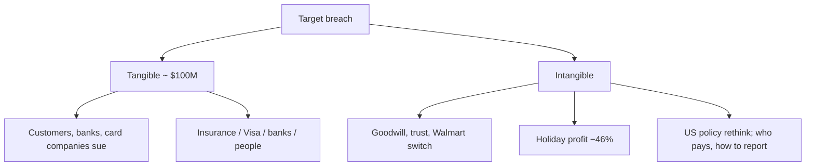
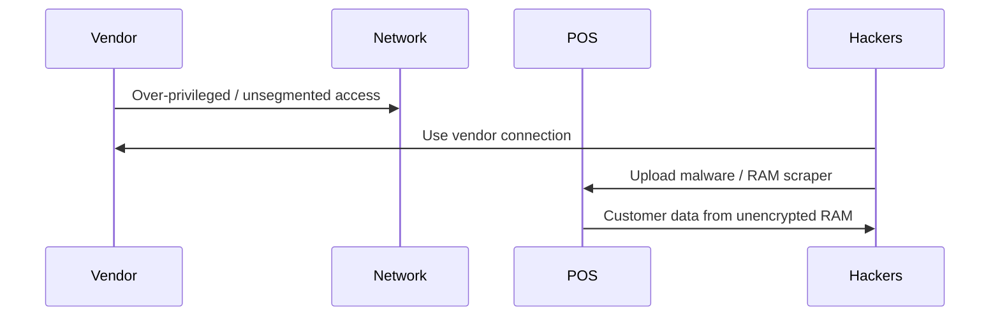
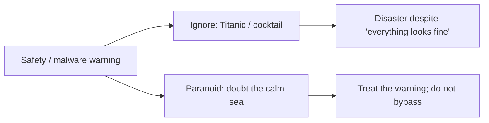

# Lecture T07: Foundations — Part 03

**Playlist index:** 07  
**Transcript:** [07-foundations-part-03.md](../../transcripts/markdown/07-foundations-part-03.md)  
**Video:** https://www.youtube.com/watch?v=QDzGq_taOLM  
**Week / theme:** Foundations — Target impact, Titanic/paranoid managers, regulation and "bare minimum" security

## Learning objectives

- Assess Target's **tangible** and **intangible** impact (money, lawsuits, holiday profit, goodwill, regulation).
- Reconstruct **what really went wrong** despite CIA-agency-grade tools: vendor access, failed segmentation, **RAM scrapers**, ignored alerts.
- Use the **Titanic / Captain Smith** story and **Andrew Grove's** "paranoid" advice as the managerial moral: **do not ignore safety warnings**.
- State the **watershed** regulatory lesson and the provocative industry quote on investing the **bare minimum** and paying fines later.

## What this lecture actually teaches

This session takes Target's **second question — impact** — then the instructor's slide recap, prevention/aftermath, and open management questions.

### Question 2: impact — can you quantify it?

Incidents happened **despite all the company's cybersecurity investments**. How do you assess impact? Is impact **tangible / measurable / quantifiable**?

**Stakeholders named by the class:** monetary impact on banks, credit unions, people, businesses, and government. The instructor **corrects**: **credit card companies / payment providers**, not credit unions (credit unions are different; later). Government: compliance, and a **watershed moment** in cybersecurity.

**How much?** Class figure used in the room: net about **100 million US dollars**. Where it went (student breakdown he accepts as the picture): partly to banks; **about 10 million to people**; insurance payout around **90 million**; **Visa** (credit payment provider) settlement around **20 million**; plus banks. **Individual customers sued**; **banks and credit card companies** went to court. Settlement / fines on the order of **$100 million** — the **tangible** hit.

**Intangible:** **trust** of customers, **reputation**, **opportunity cost** (business lost). Accounting word: **goodwill**. Customers may go to **Walmart**, not Target. "Once your fingers are burned," you may not return for years even if the firm later improves. Retail is **competitive**; shopping experience is substitutable in similar locations — **why go to Target?** Goodwill is a **major** impact.

**Regulation as intangible / downstream impact.** A paragraph in the article: some policies existed but were **not properly framed**. Target even had to **repay customers whose data was breached but not actually "damaged."** Government had to **rethink policy** because a significant share of the population's data sits in such retail chains. After the case, **more policy regulation** on how to address breaches, **who is responsible**, and **how much fine**. If there is **no law** against privacy/data breach, companies can continue as they like; **unless law requires responsible action, there is no redressal**.

**Internal action / reflection:** role of **CTO / CIO** — strategic **training and awareness** of employees about cybersecurity measures. Government policy **and** company policy.

### Instructor wrap-up of the facts

**When / who:** **2013**, Christmas–Thanksgiving season. Target had **1,797 US stores** — a large corporation.

**They were technologically updated.** **$1.6 million** malware-detection tool installed **six months** earlier. Why a problem despite that? They used the **same security system as the CIA** — here meaning the **US intelligence agency**, **not** the CIA triangle. Multiple **layers** of protection; **periodic audits**, external validation, benchmarking; **people and processes** in place; **complied with credit-card industry data security standards**. You can do everything required for **regular compliance** and **still** have incidents — and organizations **still** have breaches after 2013.

**What really went wrong.** Hackers gained access through a **vendor's access which was not defined correctly**. Target **failed to segment its network** so third parties would not reach the **POS**. **Techno-managerial failure** — what was **exploited**. They used that connection to **upload malware**. The malware was programmed to **steal customer data from the point of sale**. The real **technical** vulnerability: **encryption** problem, exploited with **RAM scrapers** — software installed in the POS to tap data from memory.

**Impact numbers on the slides:** customers and banks filed **more than 90 lawsuits**. Target's profit for the **2013 holiday shopping period fell 46%** — immediate revenue loss at peak. In sentiment: lost **goodwill of customers, investors, and lenders**.

### Administrative lens: Titanic and Captain Smith

Cybersecurity leadership is like captaining a ship: the objective is A to B, but **taking people safely** is the real objective. **Safety is critically important.** In this reputed firm, **somebody switched off the malware reporting system** — that **is** safety. Somebody **compromised on safety**.

**Titanic / Captain Smith.** Historical (the film is "very nice," but the error is the point). It was **Captain Smith's last ride**; he was going to retire. Smooth sail, calm blue sea, people having fun. **Warnings from nearby ships** of an **iceberg**. He looked outside: how can there be an iceberg? Everything looks fine. **He did not act on the warning**; the story told here is that he **ignored the warning and went for a cocktail**. If a captain ignores safety warnings, Titanic is the historical example.

Literature: **overconfident**, **too big to fail**. Weather **calm and clear** gave **no perceptible reason** to worry. **The mind can be very deceptive.** Perception of a "fine" class is not knowledge that students are learning — you need an **exam**, something **objective**. **Wrong perception** played a role in Titanic. **Warning for managers:** **attitude does matter**. You are responsible; **any safety warning should not be ignored**.

**Transport safety aside.** What is the safest mechanism — road, train, or flight? **Statistically, flying is the most safe**, because of **strict protocols** that people follow. Rare counter-examples (a pilot flying into a mountain) exist; otherwise safety is thanks to **protocols and mechanisms**. If you **bypass** them, **you are the captain of Titanic**.

### Only the Paranoid Survive

He **strongly suggests** **Andrew Grove's** book ***Only the Paranoid Survive*** for managers. Old, but management talks still use terms Grove coined: **inflection point**, **10× force** (he modified Porter's five forces: if one force is **ten times** the others, what should the manager do?). Key point: **be a paranoid; doubt everything**. You tend to believe everything is fine; **managers just do not do that**. Grove: I worry about plants, people, market. **Paranoid** is a negative word, but it is the **attitude** he tried to build in high competition (Intel leaving the **memory-chip** business, etc.). Dated, but for cybersecurity: **paranoid mindset is a very important mindset**.

### Takeaways from Target

**1. Employees' ability to circumvent security.** Despite **huge investment**, if **managerial processes are not foolproof**, the investment **does not make sense**. Vulnerabilities in **management** dominate. **Importance of management in cybersecurity got more highlighted** after this incident. They had "CIA"-grade **security technologies**; failure was **administrative**.

**2. Watershed moment for cybersecurity regulation.** Several US laws exist (the course will map regional landscapes). Still, **lack of clarity**: what to do on a breach, **how to report**, what **redressal**. **No one comprehensive regulation** for cybersecurity and privacy in the **United States**. The **European Union has it**; the US is **still evolving, even today**.

Tangible **$100 million** versus company **revenues of $72 billion** — like a **pickpocket** taking 100 rupees. In cybersecurity management, firms can take different **positions**. One: **ignore**, face it in court, avoid huge security investment. An **industry observer quote** he puts on the slide: as long as fines do not put the business into **bankruptcy** or even **serious financial peril**, executives and boards may decide they are **better off investing the bare minimum** in security and **saving the rest for possible breach cost and fines**. **Ignore the warning** is another management position.

**Is that a good stand?** Government as regulator / guardian of people's interest may say **no**, but **companies can make that choice in the absence of regulation** — comply with law after the fact, compensate, pay fines, but not build a large security system.

**Competition / signaling.** If some players put in more security, customers **trust** them more and others are **forced** to enhance security. Perhaps Target's huge investment was also to **signal**: your data is safe with us. Shying away may be a **market disadvantage**. Valid point: in a competitive environment, under-investing may not be the right choice.

**Preview of risk management:** options available to decision makers, and how to exercise them. Analogy: choosing not to write an exam **now** but **repeat later** can be an **informed** plan — not closing your eyes to hazards, but having a plan if it goes wrong. That kind of informed step is done in practice; it is a **later discussion**.

### Close of the foundations block

Introduction to cybersecurity at a fundamental level: **CIA** — confidentiality, integrity, availability — and mechanisms to ensure them. A case where **data breach happened despite efforts** to secure cyber assets. Lessons will be **referred to again** as more concepts appear.

## Cases and examples from the lecture

- **Target 2013:** 1,797 US stores; $1.6M malware tool (six months old); same stack as the **CIA (agency)**; PCI-style **card-industry** compliance; vendor path; **no POS segmentation**; **RAM scrapers**; **>90 lawsuits**; holiday profit **−46%**; **~$100M** tangible vs **$72B** revenue; goodwill vs **Walmart**.
- Correction: **credit card companies**, not credit unions, as payment-side stakeholders.
- Customers repaid even when data was **breached but not "damaged"** — a regulatory-design issue.
- **Titanic / Captain Smith:** last voyage, calm sea, iceberg warnings ignored, cocktail; overconfidence / too big to fail; deceptive perception.
- **Aviation** as statistically safest transport because protocols are **not** bypassed.
- **Andrew Grove, *Only the Paranoid Survive*:** inflection point, 10× force, Intel and memory chips, worry about everything.
- **EU vs US** comprehensive privacy/cyber law (EU has it; US does not, still evolving).
- Industry quote: **bare minimum** security + save money for **fines**.

## Key terms

| Term | Meaning in this lecture |
|------|-------------------------|
| Tangible impact | Court settlements / fines / payouts on the order of **$100 million** |
| Intangible impact | Trust, reputation, opportunity cost, **goodwill**, customer switch to rivals |
| Network segmentation | Isolating third parties from POS — Target **failed** this |
| RAM scraper | Malware that taps unencrypted card data from POS memory |
| Watershed moment | Target as a turning point for **how governments frame breach rules** |
| Paranoid mindset | Grove: doubt the appearance that "everything is fine"; do not ignore warnings |
| Bare-minimum position | Invest little in security, treat breaches as a cost of fines if the firm can bear them |

## Formulas / frameworks (if any)

- **Impact split:** tangible (lawsuits, insurance, Visa, customer payouts) + intangible (goodwill, −46% holiday profit, regulatory shock).
- **Scale check:** $100M / $72B ≈ "pickpocket" — used to motivate why some boards **under-invest** unless law or competition says otherwise.
- **Captain's rule:** safety warning → **act**; calm appearance is not evidence.
- **Risk-management preview:** ignore / court / signal / informed deferral — **options**, not yet a full treatment.

## Distinctions the instructor insists on

- **CIA the agency ≠ CIA the triangle.** Target's tools matched intelligence-agency **protection systems**.
- Compliance and expensive tools **do not** equal safety if **vendor authorization, segmentation, and alert handling** fail.
- Credit **unions** ≠ credit **card companies** in this impact story.
- $100M can be **existentially small** for a $72B retailer **and still** be a **national regulatory** event because **people's data** is at stake.
- Bypassing malware reporting is not a clever efficiency hack; it is **Captain Smith**.
- "Paranoid" is taught as a **professional attitude**, not as clinical language.
- Paying fines after the fact is a **possible management position** only where **regulation and competition** allow it; the EU-style comprehensive law changes that calculus.
- Informed risk-taking (have a plan) ≠ **closing your eyes**; the course will return to this under **risk management**.

## Exam-oriented recap

- Target impact: ~$100M tangible, >90 lawsuits, holiday profit −46%, goodwill / Walmart, government rewrite of breach rules.
- Cause recap: vendor access + failed segmentation + RAM scrapers on unencrypted POS memory + malware reporting **switched off**.
- They had $1.6M tools, CIA-agency-like systems, audits, card-industry standards — **administrative failure** still produced the breach.
- Titanic: ignored iceberg warnings; aviation: protocols work when not bypassed; Grove: paranoid managers survive.
- US lacked one comprehensive cyber/privacy law; EU had one; boards may choose bare-minimum security if fines are not fatal — unless markets punish the signal.
