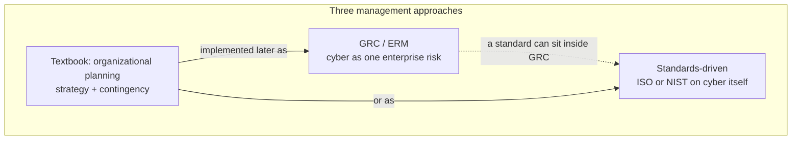
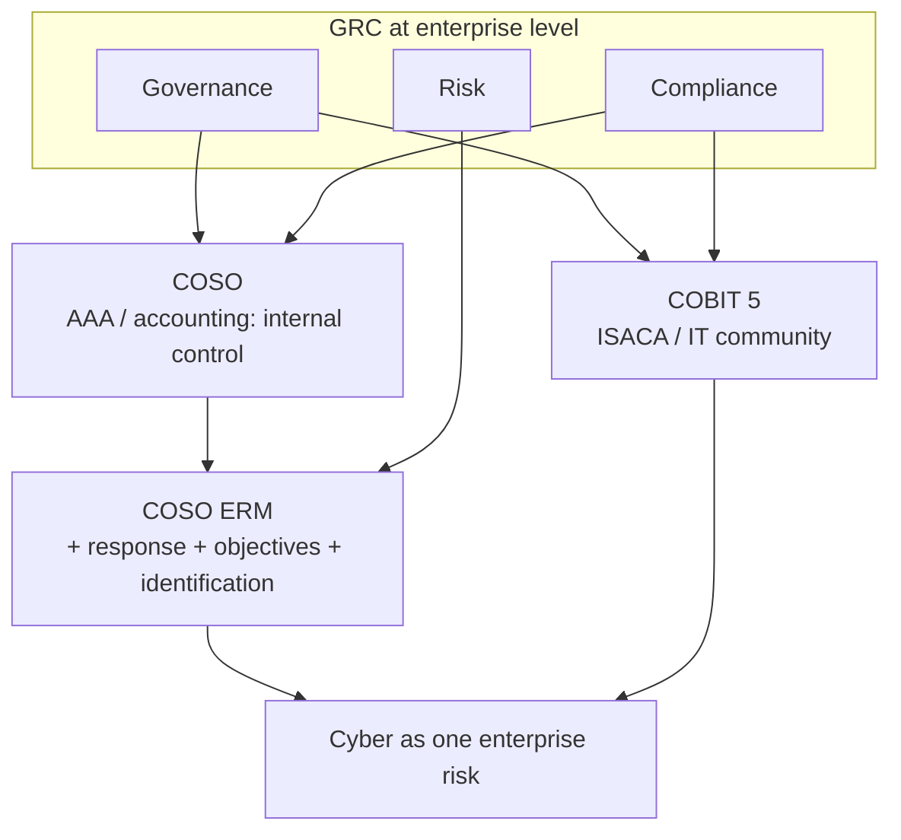
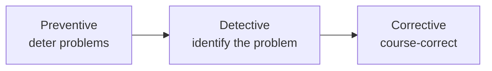
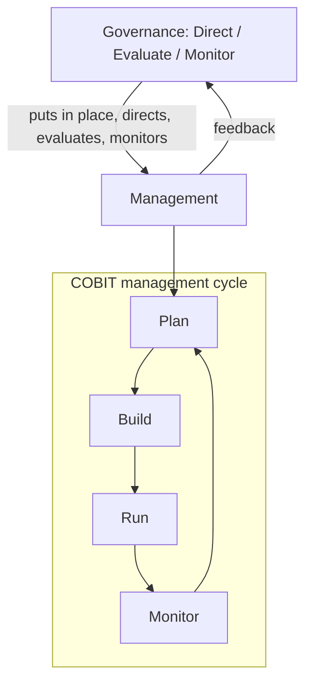

# Lecture T08: Security Management and GRC — Part 01

**Playlist index:** 08  
**Transcript:** [08-security-management-and-grc-part-01.md](../../transcripts/markdown/08-security-management-and-grc-part-01.md)  
**Video:** https://www.youtube.com/watch?v=1okOQCY6Bsk  
**Week / theme:** Week 3 — Governance, Risk and Compliance (GRC)

## Learning objectives

- Place cybersecurity inside a **management** problem (cyber assets as resources), not only a technology problem.
- Name the three broad approaches to cybersecurity management that the instructor constructs: GRC, standards-driven, and textbook / organizational planning.
- Distinguish **governance** from **management**, and say what it means to attach cybersecurity to governance.
- Map the three GRC frameworks taught here: **COBIT**, **COSO**, and **COSO ERM**.
- List what **internal controls** try to control, and the three control types (preventive, detective, corrective).
- Sketch COBIT 5’s split of governance vs management and the Plan–Build–Run–Monitor cycle.

## What this lecture actually teaches

### This course is about security *management*

The session is framed as GRC — Governance, Risk and Compliance — “a common terminology in cybersecurity circles.” The course is about **cybersecurity management, not cybersecurity technology**. Technology is a constituent; the question is how organizations **manage cyber assets** as resources.

Risk (the middle letter of GRC) is flagged for later sessions: cybersecurity is a **source of risk**; cyber threats are sources of risk that must be managed. Today is a **broad** look at frameworks, not assessment, measurement, or control in detail.

### Digital world, growing incidents, “prepare for the worst”

The world is digital; there is a bright side and a dark side (cyber threats). Incidents are growing in **volume and impact**, not shrinking with better technology. The graph shown ends with the **Marriott** breach (December 2019): **500 million** data records compromised — unauthorized access to private data in the hotel chain’s database (credit cards from online booking / Westin stays, and so on). **Air India** is used the same way: if you booked with a saved card, you immediately fear exposure. **Amazon** is the thought experiment: if Amazon is breached, “all of us will be in a soup.” **Target stores** is on the same graph, smaller in extent but part of the same upward trend.

These are treated as thieves entering the premises and stealing assets. Physical security has a cyber counterpart.

Managers **wish for the best, but prepare for the worst**. The quote is Louis Pasteur: **“fortune favors the prepared mind.”** Leaving an unpredictable future to chance, or taking the stance “do nothing because things can still go wrong,” is rejected. The stance is: be prepared.

### Three approaches to cybersecurity management

These three categories are **the instructor’s synthesis** from multiple sources, not a copy of the textbook.

1. **GRC approach (framework-based).** Cybersecurity is **one among many** risk-management initiatives. It sits inside **enterprise risk management (ERM)** alongside operations risk, market risk, and other internal/external threats. You do not treat cyber as an independent island; you manage it as part of overall **governance, risk management, and compliance** with law, regulation, and internal/external standards. This is the **broadest** approach.

2. **Standards-driven approach.** Cybersecurity is treated as a **separate** category. A small or mid-sized firm may have no GRC/ERM stack, but still needs to protect cyber assets. It implements a cybersecurity standard from a body such as **ISO** (described here as European) or **NIST** (American), usually with a consultant, to put practices in place. This can exist **independently** of GRC, or a standard can be **adopted inside** a GRC framework. Size, nature of business, and how much cyber asset you hold decide the mix.

3. **Textbook / organizational planning approach (this course).** Market training exists for ISO/IEC 27001 and for GRC standards; that is **training**. This course is **education**: concepts of cybersecurity management. The textbook’s **organizational planning** approach puts cyber into **strategic planning**, not only operations. **Contingency planning** is a constituent of that approach. Strategic planning + contingency planning together address cyber risk. Practices that appear under GRC or ISO show up in the textbook **without** requiring compliance with any one industrial framework.

### Regulatory pressure is domain-specific

A major **Indian banking** cyber incident (about **2016**, debit cards vulnerable) led the **Reserve Bank of India** to make cybersecurity a **mandatory strategic initiative** for banks, **separate from IT management**. Chip-based cards were also mandated. Education, by contrast, may have **no mandate** for a CSO / CISO. How much you invest in compliance/cyber depends on regulation, global business, and partners who insist on frameworks.

### What “governance” means here

The word in GRC is **governance, not management**. Governance is a **higher-order** term. A governing body (board) **institutes** management structures and procedures and **monitors** them. The board selects the CEO. C-level executives then make the organization function toward strategic priorities.

**Linking cybersecurity to governance** means treating cybersecurity as **strategy**, with **highest organizational priority** — not an operational afterthought.

### Why GRC frameworks exist: scandals, SOX, IT as the control engine

1990s-era governance standards and the **Sarbanes–Oxley Act (SOX)** — an accounting standard in the United States — followed major **accounting scandals**. **Enron** is the example of a large firm bankrupted quickly by fraud when **no body was monitoring organizational health**. Absence of that “guardianship” is absence of governance.

After the scandals, jobs appeared around implementing **accounting and control standards**. IT became the system that could implement compliance at scale (you cannot manually monitor, check, and report). Information-systems communities built GRC-related standards.

### Three GRC frameworks: COBIT, COSO, COSO ERM

| Framework | Source community | Emphasis in this lecture |
|-----------|------------------|--------------------------|
| **COBIT** | **ISACA** (Information Systems Audit and Control Association) — IT / IS audit | IT-based control of the enterprise; cyber as part of assets managed **end to end** |
| **COSO** | **Committee of Sponsoring Organizations**; initiated by the **American Accounting Association (AAA)** | **Enterprise internal controls**; key word is **control**, not risk |
| **COSO ERM** | COSO expanded | **Enterprise risk management**; cyber is **one** enterprise risk |

ISACA is a global body with local chapters (Chennai is mentioned). COBIT is expanded here as **Control Objectives of Information Related Technology**. COBIT can cover cybersecurity **and** other risk/compliance. COSO is accounting-community, not IT-community.

**ERM** is the term large international organizations use. COSO ERM **adds elements** to original COSO so the loop closes: original COSO had **risk assessment**; ERM adds **risk response**. Two further additions named here: **objective setting** (objectives for the **entire organization**, not only risk management — are assets ready to support those objectives?) and **identification**. From accounting/internal controls, COSO grew into enterprise-wide risk management. This is a **risk-based** approach.

These three are **enterprise-level** GRC frameworks. Cyber is a **constituent**. They are not the same grain as ISO or NIST cybersecurity standards.

### What internal controls try to control

Processes (and process control) are put in place to:

- safeguard assets
- maintain sufficient records
- provide accurate and reliable information
- prepare financial reports according to established criteria
- promote and improve operational efficiency
- encourage adherence with management policies
- comply with laws and regulations

### Three aspects of internal control

Analogous to maintenance language (preventive / breakdown / corrective maintenance):

| Type | Role in this lecture |
|------|----------------------|
| **Preventive** | Deter problems from occurring; futuristic |
| **Detective** | Identify / detect, then “firefighting” |
| **Corrective** | After detection, course-correct |

Purpose in the accounting-control reading: no fraud, nothing that can lead the organization to bankruptcy. These are controls for **governance**.

### COBIT 5 in this lecture

What is prevalent is **COBIT version 5**. Implementation is usually an **IT-organization project** because COBIT runs through information systems.

Principles named: **stakeholder needs**; **covering the enterprise end to end**; **applying a single integrated framework**; **enabling a holistic approach**. **End to end** is the point to keep: not cybersecurity alone, but the **health of the enterprise**, monitored and controlled through IT.

COBIT **separates governance and management**:

- **Governance is above management.** Governance puts management in place; it **directs, evaluates, and monitors**. A governance framework needs constant **feedback** from management systems and must be able to **inform** them.
- Management in COBIT runs on **four steps: Plan, Build, Run, Monitor**. Planning has a process set abbreviated **APO**; build, run, and monitor each have their own process sets. The lecture does not unpack the process catalogues.

COBIT therefore **contains** cyber assets among the assets to be managed, inside a higher-level risk/health system.

### COSO → COSO ERM (closed loop)

COSO began as **internal controls**, then expanded to **COSO ERM**. Additions that close the loop:

- **Risk response** (not only assessment). Five options for responding to cyber risk are promised for the risk-management sessions; the textbook also covers them. After detailed risk assessment, some assets are more vulnerable; management must **prioritize** response.
- **Objective setting** at enterprise level: assets exist to reach organizational objectives; are they available/ready?
- **Identification** (the third added item named here).

## Cases and examples from the lecture

- **Marriott (Dec 2019):** ~500 million records; unauthorized access to hotel-chain private data (bookings, cards).
- **Air India / Amazon thought experiments:** saved cards and the fear that follows a breach.
- **Target:** on the same growth chart; smaller extent than Marriott as drawn here.
- **Enron / SOX:** governance failure → bankruptcy-scale scandal → accounting and IT control standards.
- **RBI after ~2016 debit-card incident:** cyber as **strategic**, separate from IT; chip cards; CISO-type structure mandated for banks, not necessarily for education.
- **ISACA Chennai chapter:** where to look for GRC/security training locally.
- **Five cyber-risk responses:** named as coming later, not taught in this hour.

## Key terms

| Term | Meaning in this lecture |
|------|-------------------------|
| GRC | Governance, Risk and Compliance — broad management/governance framework used in cybersecurity circles |
| ERM | Enterprise Risk Management — all organizational risk under one frame; cyber is one category |
| Governance | Higher body than management: institutes management, monitors organizational health, sets direction |
| Management | C-level and structures that make the organization function toward board-set strategy |
| COBIT | ISACA GRC standard; IT-based, enterprise end-to-end control (version 5 here) |
| COSO | Committee of Sponsoring Organizations; accounting-origin **internal control** framework |
| COSO ERM | COSO expanded with response, objective setting, identification — risk-based enterprise frame |
| Internal control | Processes that safeguard assets, records, reporting, efficiency, policy adherence, legal compliance |
| Preventive / detective / corrective | Three aspects of how internal controls work |
| APO | COBIT process set associated with **Plan** |
| SOX | Sarbanes–Oxley — US accounting standard after major scandals |

## Formulas / frameworks

- **Three management approaches:** GRC (cyber inside ERM) · standards-driven (ISO/NIST on cyber) · textbook organizational planning (strategy + contingency).
- **Three GRC frameworks:** COBIT · COSO · COSO ERM.
- **Internal control types:** preventive, detective, corrective.
- **COBIT 5 management cycle:** Plan → Build → Run → Monitor; governance Direct / Evaluate / Monitor above that.
- **COSO ERM additions:** risk **response**, **objective setting**, **identification**.

## Distinctions the instructor insists on

- This course is **management of cyber assets**, not a technology course; technology is a constituent.
- **Governance ≠ management.** Governance is the higher body that installs and monitors management. Saying “cyber governance” means cyber is **strategic**, top priority.
- **GRC ≠ ISO/NIST.** GRC frameworks (COBIT/COSO/ERM) are **enterprise-wide**; ISO/NIST (next lectures) are **cybersecurity-specific** standards. A standard can still be used *inside* GRC.
- **COBIT vs COSO:** IT/ISACA community vs accounting/AAA community. COSO’s keyword is **control**; COSO ERM’s move is **risk** (assessment **plus** response).
- **Cyber as standalone vs cyber as one ERM risk:** GRC does the latter; standards-driven and small-firm practice often do the former.
- **Training vs education:** ISO/COBIT market courses vs this academic organizational-planning path.

## Exam-oriented recap

- Wish for the best, prepare for the worst; Pasteur: fortune favors the prepared mind. Incidents (Marriott 500 million, Target, Air India) are growing.
- Three approaches: GRC/ERM, standards (ISO/NIST), textbook strategic + contingency planning.
- GRC frameworks: COBIT (ISACA, end-to-end IT control, Plan–Build–Run–Monitor), COSO (internal control), COSO ERM (adds response, objectives, identification).
- Internal controls: what they control (assets, records, reporting, efficiency, policy, law) and how (preventive / detective / corrective).
- RBI can force cyber as a C-level strategic function in banks; other sectors may have no such mandate.
- Risk in GRC is postponed: later sessions treat cyber-risk assessment and the **five** response options.
