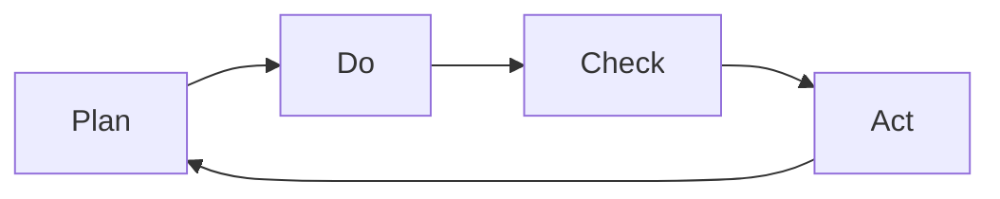
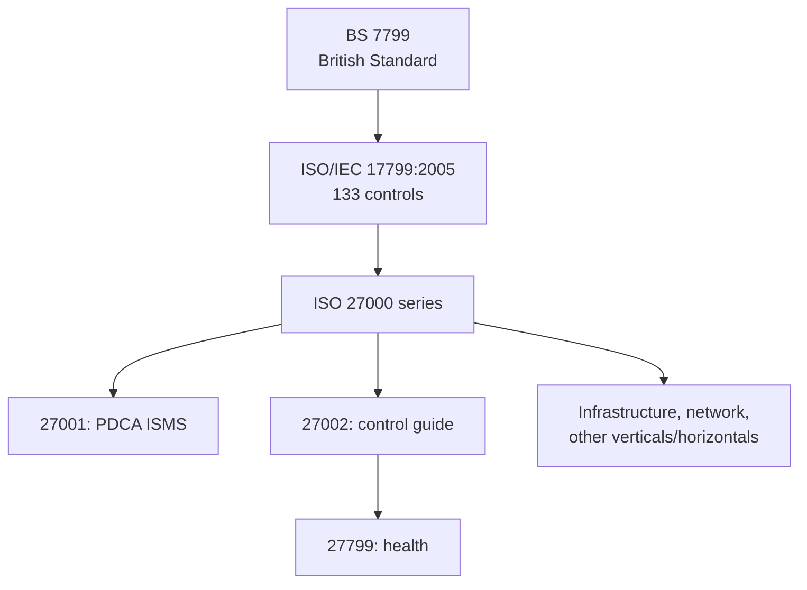

# Lecture T09: Security Management and GRC — Part 02

**Playlist index:** 09  
**Transcript:** [09-security-management-and-grc-part-02.md](../../transcripts/markdown/09-security-management-and-grc-part-02.md)  
**Video:** https://www.youtube.com/watch?v=YE0PooziW-0  
**Week / theme:** Week 3 — GRC continued: ISO 27000, PDCA, NIST vs ISO; iPremier A teed up

## Learning objectives

- Know when **COSO / COSO ERM / COBIT** are the wrong grain (startup, mid-size) and when **cyber-specific standards** still matter.
- Trace **ISO 27000** from **BS 7799** through **ISO/IEC 17799:2005** to **ISO 27001** in **PDCA** form.
- Explain **Plan–Do–Check–Act** as ISO 27001’s improvement cycle (and relate it to COBIT’s Plan–Build–Run–Monitor).
- Contrast **ISO** (European, paid, not open) with **NIST** (US, open standards) as the instructor teaches the politics and the adoption puzzle.
- Recap the class reasons why the world is not “all NIST / all open source”: **service/support** and **reputation**.
- Know that **iPremier** (Harvard, versions A/B/C, 2018 update) is the day’s case; discussion of A continues in T10.

## What this lecture actually teaches

### GRC frameworks are for large organizations

The three GRC approaches named last time (COSO, COSO ERM, COBIT) are “fairly large and very detailed” — aimed at **large** organizations. A startup in IIT Madras Research Park **does not** need to think COSO ERM. Mid-size firms may not either. That does **not** mean they can ignore cybersecurity.

If the business is **e-commerce / online**, customers reach you online; ignoring security is “an issue.” You may skip big ERM audits (those are investments) while still having to **manage cyber assets**. For technology firms, the **major asset category is cyber** — including people. The MIS comparison used here: **Madras Cements vs Infosys** — manufacturing equipment vs cyber assets (and people). Strategy to safeguard assets therefore differs. That is why **standards specific to cyber assets** matter.

### ISO / IEC: standards built *for* cybersecurity management

ISO/IEC standards here are **specifically for cybersecurity management**.

Lineage as taught:

1. Started as **BS 7799** — a **British Standard** for cybersecurity management (not “ISO 1700”; the instructor corrects himself).
2. ISO adopted it. **ISO/IEC 17799:2005** has **133 possible controls** — “a large standard.”
3. Renamed as the **ISO 27000 series**, starting with **ISO 27001**, “the basic standard in the **PDCA** format.”

Whenever you hear **ISO 27000**, it means **ISO’s cybersecurity management standards**. The ISO site has **more than 50** standards in the family; each addresses a specific requirement (e.g. infrastructure management). Consultants will try to sell **many** of them. IIT **administration** (not academics) is cited as an ISO-certified organization.

**Example of specialization:** the **46th** standard mentioned is **ISO 27799** — information security management **in health**, using **ISO/IEC 27002** guides. **27002** is treated as a fundamental/control-guide standard, then customized for **verticals** (healthcare) and **horizontals** (infrastructure, network security). Which standard you adopt depends on the nature of IT use and the nature of the business.

### PDCA: Plan, Do, Check, Act

If you have worked in manufacturing, PDCA is familiar. It is the cycle ISO 27001 uses so cybersecurity systems stay **active and in the improvement cycle**:

1. **Plan** before you do.
2. **Do.**
3. **Check** whether what you did is correct.
4. **Act** on that check.

The instructor maps this to COBIT’s similar process set (Plan–Build–Run–Monitor from T08). PDCA is “very intuitive”: continual improvement wherever you have process and technology.

ISO 27001’s job, in this telling, is to keep cyber security systems **in that loop**, not as a one-time certificate on the wall.

### Standards politics: ISO vs NIST

Managers should not be naive: consulting firms will push ISO; **all of this is investment**; there is **competition among standards**.

- **ISO:** European origin. Criticized in the literature; **not the preferred** US cyber standard even though some US firms still go for ISO.
- **NIST:** **National Institute of Standards and Technology** — a **US** technology standards body (not only cyber). Intense work on cybersecurity; historically tied to **US military** and sensitive IT. Preferred US cyber standard in this lecture’s contrast.

**Open vs paid (the distinction the instructor stresses):**

| | ISO 27000-series | NIST |
|---|------------------|------|
| Access | **Not** open domain; you **pay**; even documentation of how the series is structured is not freely searchable | **Open standards** — downloadable |
| Example given | ISO 27001 series documentation | **NIST SP 800-12** (spoken as “SP 812”) *Computer Security Handbook* — go download it |
| Analogy | Proprietary software (Microsoft, Oracle, licenses → cloud) | Open source |

Having the PDF is not the same as **implementing** a standard; implementation still needs knowledge (and often consultants).

### Why isn’t the whole world NIST / open source?

The instructor poses the puzzle: if NIST is open and ISO is paid, why does ISO still prevail — as with open-source vs Microsoft/Oracle?

**Class answers he accepts:**

1. **Support / service.** “Something is available free but who will implement this and who will continue to support us?” Product vs **service**. Scholars argue you consume **service**, not product; the product exists to deliver services. A proprietor such as Microsoft sells OS **with both**. Open/free can fail on **fulfillment**. Premium/freemium (R / RStudio: basic free, applications paid) is noted as a platform tactic, but some software really has no commercial interest — the support gap still matters.

2. **Reputation.** ISO has market reputation; NIST is reputed as a **standard in abstract form**, but implementation needs **specific expertise**. Consultants cluster around the brand organizations already know.

Nobody in this (non-executive) class volunteers NIST or ISO 27001 implementation experience. NIST’s site is still something “all students should visit.” An assignment (platform logistics skipped here) will force use of NIST — e.g. **how to do contingency planning systematically**; a NIST standard already specifies it. You customize to context; you do not invent the framework from scratch.

### Purpose of the hour; iPremier teed up

Purpose: familiarize with **frameworks and standards at practice / industry level**. Then the first student group takes **iPremier** — a Harvard Business School case from the 2000s, updated around **2018**, versions **A, B, and C**. Today is **A** only. The instructor calls it “a detective story” and hands the next ~30 minutes to the group (the taught case content is T10).

## Cases and examples from the lecture

- **IIT Madras Research Park startup / mid-size firm:** skip COSO ERM; do not skip cyber if you are online.
- **Madras Cements vs Infosys:** plant equipment vs cyber assets (including people).
- **IIT administration ISO certification:** example that ISO is an organizational (admin) investment.
- **ISO 27799:** health ISMS using 27002.
- **R / RStudio freemium:** class analogy for “open but not entirely free.”
- **Microsoft / Oracle vs open-source databases:** world is a mix; proprietary often wins on service.
- **iPremier A/B/C (2018 HBS update):** case discussion starts; substance in T10.

## Key terms

| Term | Meaning in this lecture |
|------|-------------------------|
| BS 7799 | British Standard that originated ISO’s cybersecurity management line |
| ISO/IEC 17799:2005 | Large control catalogue (**133** possible controls) before the 27000 rename |
| ISO 27000 series | ISO family **for cybersecurity management** (>50 standards; verticals and horizontals) |
| ISO 27001 | Basic standard in the family; **PDCA** format; keep the ISMS in an improvement cycle |
| ISO 27002 | “Fundamental” / control-guide standard; 27799 uses it for health |
| ISO 27799 | Information security management **in health** |
| PDCA | Plan, Do, Check, Act — continual improvement cycle |
| NIST | US National Institute of Standards and Technology — open technology/cyber standards |
| Open standard | Freely accessible (NIST as taught here); opposite of paid ISO documents |
| iPremier | HBS e-commerce DDoS case, versions A/B/C |

## Formulas / frameworks

- **PDCA:** Plan → Do → Check → Act → (repeat). ISO 27001’s shape; cousin of COBIT Plan–Build–Run–Monitor.
- **ISO 27000 map (as taught):** BS 7799 → ISO/IEC 17799:2005 (133 controls) → 27000 series (27001 PDCA core; 27002 guides; 27799 health; plus infrastructure, network, etc.).
- **Adoption choice:** GRC/ERM if large; cyber-specific ISO or NIST if the asset base is cyber / the firm is smaller; both can coexist.

## Distinctions the instructor insists on

- **COSO ERM / COBIT vs ISO/NIST:** enterprise GRC vs **cyber-specific** standards. Small/online firms may skip ERM; they may not skip ISO/NIST-type practice.
- **ISO vs NIST:** European vs US; **paid/closed vs open**. Preference follows regional politics and military/sensitive-use history, not only technical merit.
- **Having a standard ≠ implementing it.** Open documents still need expertise; free software still needs **service**.
- **Product vs service:** you consume service; that is why proprietary stacks persist.
- **This hour is industry familiarization**, not a full ISO/NIST implementation course. Contingency-planning *procedure* is deferred to NIST + later lectures.

## Exam-oriented recap

- Large-firm GRC is optional for a startup; **cyber-asset standards are not optional** if you are online / IT-heavy.
- ISO 27000 = ISO’s cyber management family, from **BS 7799**, through **17799:2005 (133 controls)**, to **27001 (PDCA)**.
- PDCA keeps the security system in a live improvement cycle.
- NIST standards are **open** (e.g. computer security handbook); ISO’s 27000 documents are **not**. Class reasons ISO still wins: **support** and **reputation**.
- iPremier A is the case vehicle for “what happens when an e-commerce firm has no working GRC/standard/contingency practice.”
