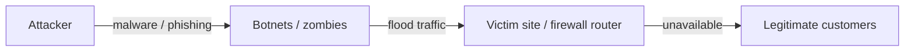

# Lecture T10: Security Management and GRC — Part 03

**Playlist index:** 10  
**Transcript:** [10-security-management-and-grc-part-03.md](../../transcripts/markdown/10-security-management-and-grc-part-03.md)  
**Video:** https://www.youtube.com/watch?v=1sN6NtaRoHE  
**Week / theme:** Week 3 — iPremier Company (A): DDoS, missing GRC, the shut-down dilemma

## Learning objectives

- Reconstruct the **iPremier** A narrative: who is who, 04:30 timeline, Qdata, missing IR/DR/BCP.
- Define **DoS vs DDoS**, botnets / zombie networks, and the **SYN flood** as used in the case.
- Separate **technical** failures from **managerial** failures (stock-option culture, no cyber strategy, no standards).
- State the **four stakeholder pressures** on CIO Bob Turley and why the instructor treats “resume as usual” as the riskier path.
- Carry the teaching verdict: an e-commerce firm that ignores GRC/ISO-type frameworks and **contingency planning** can go out of business; PR and time-to-restore are part of the decision, not extras.

## What this lecture actually teaches

This hour is the **student-led iPremier A** discussion the previous lecture announced. The instructor’s teaching sits in the interventions: this is **not** “just a failed hack”; DDoS **did** happen; shutting down vs staying up is a **business survival** tension; sequels B and C are promised (T12).

### The firm

**iPremier** sells **luxury, rare, and vintage goods** online (hundreds to tens of thousands of dollars). Clientele is **high-end**; **trust** in product and service is existential. By **2017**, **>1 million** regular customers in the database. It is one of the **top two** sites in the niche; rival is **Market Top**. Competitive edge claimed: **user experience** (site, after-sales, seamless purchase) more than the objects themselves.

Culture: younger long-term staff plus experienced lateral hires; **above-average pay**, much of it **stock options**, **performance-linked**; intense atmosphere, **quarterly reviews**, unsuccessful managers **removed**.

### Characters (as the group uses them)

| Person | Role in the case |
|--------|------------------|
| **Bob Turley** | Newly joined **CIO**; CEO has sent him to New York on a high-profile assignment; feels he has the CEO’s confidence |
| **Jack Samuelson** | **CEO** — later: get us **back and running**; PR is not Bob’s job |
| **Tim Mandel** | **CTO**, co-founder; Bob has a good working relationship |
| **Warren Spangler** | **VP Business Development** — stock/PR; later linked to **cashing stock options** |
| **Peter Stewart** | **Legal counsel** — cut the connection; protect personal information |
| **Joanne Ripley** | **Operations team leader** (cyber operations) |
| **Leon Ledbetter** | Operations team; makes the 04:30 call |

### Timeline of the night (Part A)

```mermaid
sequenceDiagram
  participant Leon
  participant Bob as Bob CIO
  participant Joanne
  participant Warren as Warren VP
  participant Tim as Tim CTO
  participant Peter as Legal
  participant Jack as CEO
  Note over Leon,Bob: ~04:30
  Leon->>Bob: Site unreachable; emails saying Ha Ha Ha
  Bob->>Joanne: What is going on?
  Joanne-->>Bob: Not a simple DDoS
  Warren->>Bob: Stock will take a hit; I will handle PR
  Bob->>Joanne: Emergency procedure? IR team? Crisis process?
  Joanne-->>Bob: We have a BCP; not updated; IR never practiced
  Joanne-->>Bob: Going to Qdata to access the web server
  Bob->>Tim: Cut connections?
  Tim-->>Bob: Would not recommend; may need evidence; logs unlikely anyway
  Peter->>Bob: Cut the connection; customer PII at risk
  Joanne->>Bob: Not let into the building; escalate; attack on firewall
  Jack->>Bob: Focus on getting us back running
  Joanne->>Bob: SYN flood from multiple sites on firewall router
  Note over Joanne,Bob: ~05:26 attack stops by itself
  Joanne->>Bob: I did not do anything; site is up; I recommend shut down and search
```

Key operational facts taught in the storyboard:

- **Qdata** hosts the site: long-time provider, **not** seen as competent; chosen for **proximity to the office** (and, later, a founder’s **personal relation**).
- **BCP binder** exists but is **not updated**; **incident response has not been practiced**. Bob expected an updated disaster-response **and** IR plan; he also admits this was **his** CIO responsibility.
- **Detailed logging** had been **removed** to improve customer experience by **~20%** (logging delayed interactions). Evidence/logs are therefore unlikely.
- Joanne is **refused entry** to the Qdata building during the incident.
- Diagnosis: **DDoS**, **SYN flood from multiple sites** directed at the **router that runs the firewall**. Joanne: you cannot cut inbound traffic while they are “spawning the zombies.” **DDoS and intrusion are not mutually exclusive** — customer data **may** still be stealing.
- The attack **stops by itself** (~05:26). Site looks fine. Joanne still recommends **shut down and investigate**.

### Four pressures on Bob (decision frame)

| Voice | Ask |
|-------|-----|
| **CEO (Jack)** | Get business **back up**; also wants customer data protected and no legal backlash |
| **Ops (Joanne)** | **Shut down**; bring expert consultants; hunt ticking bombs / unknown breaches |
| **Biz-dev (Warren)** | Personal motive: **stock options** — keep the site up so price does not crater |
| **Legal (Peter)** | **Cut the connection**; protect PII; avoid legal consequences |

### What DDoS is, in this classroom

**DoS (denial of service):** overwhelm an internet-connected asset so it is **unavailable to the legitimate user**. Analogy: Mumbai local train doors so crowded the person who needs to alight cannot get off.

**DoS vs DDoS:**

| | DoS | DDoS |
|---|-----|------|
| Sources | **Single** source device, fake traffic | **Multiple** systems, real-time traffic |
| Scale | Smaller | Higher-level DoS |
| Attacker ID | Relatively easier | Harder |

**How DDoS is described here:** attacker infects devices with malware (e.g. via phishing mails/messages). Infected machines = **botnets**; the network of botnets = **zombie network**. The attacker uses that network to **flood** the target and crash or disconnect it.



**Motives listed:** hacktivism, cyber vandalism, cyber warfare, **extortion**, **rivalry** (Market Top is in the room). Motive in the case is **unknown**.

### What went wrong (technical and managerial)

The group and class, “in the light of today’s class”:

**Technical**

- Whole technical management parked at **Qdata**, which does not invest in advanced technology.
- Founder **personal relation** with Qdata blocked switching.
- **No detailed logs** — cannot investigate or identify the attacker later.
- **Outdated firewall**; service lacks capacity; no DDoS-protection products in use.
- No simulation / routine checks of security infrastructure.

**Managerial**

- Intense culture; senior pay in **stock options** → focus on **stock price**, sales, and **site always up**, not on consolidating the customer base or cyber risk.
- **BCP outdated**; **no DRP**; **no IRP**; no practiced emergency plan; **no PR strategy** for an attack.
- No security/risk expert; **cybersecurity was not a strategy**.
- As an e-commerce leader they should have followed **some GRC/ISO-type framework**; they did not; they had **no working contingency plan**.
- Bob had not acted on the CEO’s earlier warning about **operating-procedures deficit**.

Classroom correction: this is **not** “a failed attack.” It **is** a DDoS. Whether the **website was “hacked” / data stolen** is **unknown** — that uncertainty is the problem.

**Verdict the presenters tie to the GRC lecture:** iPremier did not treat cybersecurity as strategy; profits/stocks drove them; they lacked a framework. The (bitter) “thanks” is that the attack may **force** cyber onto the strategy agenda.

### Immediate decision the class is asked to take

Attack has **stopped**; site is up. **Resume as usual** vs **shut down**, collect data, forensic audit, find vulnerabilities.

Class / team recommendation taught in the hour:

1. **Shut down** servers; short- and long-term **forensic audit**; understand the attack; close holes before the next one.
2. **PR:** **disclose** (press statement or tweet). Hiding fails governance/ethics and **trust**; if a customer later sues and you hid the fact, damage is worse. Analogies: LinkedIn, Gmail — admit. Suggested wording evolves under instructor pressure (see distinctions).

**Long-term alternatives** (team, descending preference):

| Option | Pros they name | Cons they name |
|--------|----------------|----------------|
| **Replace Qdata** with a major host | State of the art, patches, public trust after the attack | Start from scratch, money, migration time, switching cost, founder’s personal commitment |
| **Insource** internal IT / security | Full control, faster future response, cheaper **in the long run** (not short run) | Hire/build cost and time; outcome not guaranteed as attacks evolve |
| **Stay with Qdata**, recreate architecture | Avoid switching cost, faster “normalcy,” keep the relationship | Qdata already weak; they may not accept new terms; still slow |

### Instructor pushback (the teaching that is not in the slide deck)

- **Shut down and forensics** can be technically right and **still kill the business.** Market Top is waiting; high-end customers who feel data are unsafe **will not come back**. A long IT-maintenance window may be **closing the firm**.
- Students answer: resuming blind is also death; “Ha Ha Ha” mail shows a **targeted** attack; ~75% sure data stolen or bots left behind. Instructor: if you **hide** and the attacker (maybe the competitor) **reveals** later, **high-end trust loss is worse**.
- **Job security / blame:** this firm fires easily; people protect roles. Bob’s private line: “I have been here **three months**.” CEO, on the call, is professional: **get the business running** — no reprimand. Joanne, long-tenured, says the **firewall is so bad** it should have been fixed. Blame is **partially on every senior manager** (binder, firewall, Qdata contract). Cyber as **strategic priority** is a **CEO-level** decision.
- **PR is the critical statement**, not an afterthought. “We shut down because we are under cyber attack” may not work. Team’s later wording: unusual/irregular traffic, shutting down to check vulnerabilities; or “suspicious irregularities” — “play with the words.” Forensic reports at big firms can take **months or years** (LinkedIn **three years** later). Short shutdown of **a few business days** vs that long tail.
- **The core tension:** any option that leads to **bankruptcy** is not “correct for business” even if it is technically correct. Choose among **risky** options. **Business as usual** is **more risky** if you do **not** know why the attack happened.
- Strongest instructor rationale for stopping anyway: they were **at the mercy of the attackers**. The attackers **just stopped**. No diagnosis, no corrective/preventive action. If they run tomorrow, **it can happen the same way**. So they **must** find out.

### Other classroom challenges

- **Most customers never knew** (04:00–05:00, non-business hours). Is a PR announcement that hits the **stock** justified? Counter: if you call it “server maintenance” and later a stolen-data claim appears, PR still owns the lie.
- **CEO’s first question: shut down for how long?** Students say days to weeks depending on scale; they **do not know** the scale. Instructor: **“you want to shut down for how long?”** — uncertainty is **not acceptable** to a CEO, and that is the **real-life dilemma**.
- Wishful “they should have had a **hot / warm / cold site**” is true **and useless tonight**: they had **no cyber strategy**. The case is an **eye-opener**: unprepared + online → you **can go out of business**.

B and C are deferred to a later class (T12).

## Cases and examples from the lecture

- **iPremier A** (full narrative above).
- **Mumbai local** crowding = DoS analogy.
- **LinkedIn / Gmail / Google / YouTube / Amazon:** public admission patterns; LinkedIn’s delayed full report (~three years).
- **Hot / warm / cold site:** named as what a prepared firm would have had; iPremier did not.

## Key terms

| Term | Meaning in this lecture |
|------|-------------------------|
| DDoS | Distributed denial of service — many systems flood a target so legitimate users cannot use it |
| DoS | Same aim, **single** source, smaller scale, easier to attribute |
| Botnet / zombie network | Malware-controlled machines the attacker uses to generate flood traffic |
| SYN flood | The DDoS form identified on iPremier’s **firewall router**, from multiple sites |
| Qdata | Third-party host; proximity (and personal ties) over competence |
| BCP binder | Business continuity document they **have** but have **not updated or practiced** |
| Market Top | Main competitor; switching risk if iPremier goes dark |
| Catch-22 of the night | Diagnose (needs shutdown) vs survive in a niche online market (needs uptime) |

## Formulas / frameworks

- **GRC lesson applied:** e-commerce at this scale should have had a **framework or ISO-type standard** plus **IRP/DRP/BCP**. None were live.
- **Decision frame:** four voices (CEO, ops, stock/PR, legal) → one CIO call.
- **DoS ⊂ DDoS** as taught: DDoS is the distributed, multi-source form of DoS.

## Distinctions the instructor insists on

- This **was** a DDoS, not a “failed attempt.” Unknown = whether **intrusion / data theft** rode along (DDoS ⇏ “no intrusion”).
- **Technical right ≠ business right.** A long shutdown can **end the firm** in a two-player luxury e-commerce market.
- **Hiding vs disclosing:** later revelation (especially if the rival is the attacker) destroys **high-end trust** more than an honest hit now — but the **wording and duration** of any shutdown statement are the live problem.
- They were **at the attackers’ mercy**; the attack **self-stopped**. Without diagnosis you cannot claim corrective/preventive action, so **resume as usual is the more dangerous** operational choice.
- **“How long?”** is the CEO question; “we don’t know” is true and **unacceptable**. That is the case’s dilemma, not a student failure.
- Preparedness fantasies (hot site, updated binder) are **not available options** at 05:26 if you never invested. The case shows what **lack of GRC + contingency** does to an online business.

## Exam-oriented recap

- iPremier: luxury e-commerce, trust-critical, stock-option culture, Qdata, logging traded for 20% UX, BCP stale, no IR practice, Joanne locked out, SYN-flood DDoS, attack stops itself.
- DoS vs DDoS; botnets/zombies; motives include rivalry and extortion.
- Failures: technical (Qdata, firewall, logs) **and** managerial (no cyber strategy, no framework, stock over risk).
- Bob must reconcile CEO uptime, ops shutdown, legal disconnect, and VP stock.
- Instructor: find out why it stopped; PR is part of the decision; B/C will show what happens if you do not shut down.
