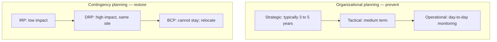
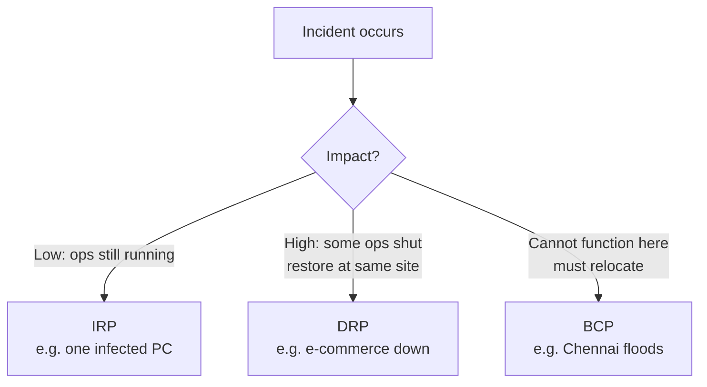
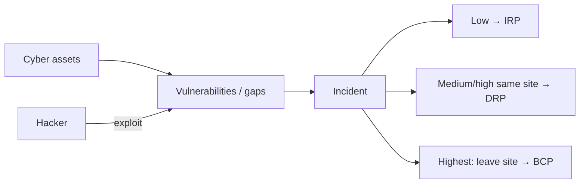

# Lecture T11: Contingency Planning — Part 01

**Playlist index:** 11  
**Transcript:** [11-contingency-planning-part-01.md](../../transcripts/markdown/11-contingency-planning-part-01.md)  
**Video:** https://www.youtube.com/watch?v=j0QxAhDh48E  
**Week / theme:** Week 4 — Contingency planning foundations (reactive path); IRP / DRP / BCP by impact

## Learning objectives

- Split cybersecurity planning into **organizational (preventive)** vs **contingency (reactive)** — different objectives.
- Use **iPremier** (and **IVK**, **Target**, **Saudi drone**) to show what “no plan” does to people and to **ROI arguments** for security spend.
- Align security plans with **strategic / tactical / operational** business plans (and correct the textbook’s order).
- Classify incidents by **impact** into **IRP**, **DRP**, and **BCP**, including the site-shift rule for BCP.
- Trace the instructor’s incident picture: **assets → vulnerabilities → exploit → incident → impact → contingency action**.

## What this lecture actually teaches

### Two planning paths

The course is still building **foundations of cybersecurity management**. Planning as a whole comes first; **contingency planning** is today’s specific topic. **Risk-management planning** is another session.

| Path | Objective | Stance toward the incident |
|------|-----------|----------------------------|
| Organizational / risk-side planning | **Incident should not happen** — protect | **Preventive** |
| Contingency planning | Incident **has happened** — then what? | **Reactive** |

Wish and plan so things do **not** go wrong; **despite that**, they can. Contingency is the **course you take then**.

### Why iPremier is the opening exhibit

Last session’s company was ambitious, professionally managed, and still took a **huge shock** at **~04:30**. A **drone attack on a Saudi refinery** is placed at almost the same clock time (~04:15–04:30). In India that window is called **Saraswati Yamam**: sleep for most of the world, high mental productivity for some, and the hour **hackers choose** to shock organizations.

iPremier had **no plan**. Nobody knew what to do; people asked each other, suggested at random, and **protected their own jobs/roles**. Contingency planning exists to answer **what to do if things go wrong**.

It can happen **anyway**: **Target** invested a lot and was still breached; iPremier did not care and it happened. There must be a **clear plan**, like a **fire drill**: fake incidents, protocols, restore **normalcy**.

**Gilbert** (cartoon) on no plan: you **yell**; theory calls it **emotion-focused coping**. The mind has no clarity, so it goes emotional: call for help, yell, run away, wish nothing is wrong. Managers must not live there.

Two manager duties named:

1. **Protect the assets** of the organization.
2. If an incident happens, **bring operations back to normalcy at the earliest**.

### IVK: why finance rejects security projects

A Harvard case, **IVK** (iPremier-like, established firm, IT department). A newly joined **IT director** wants more cyber investment, specifically an **Intrusion Detection System (IDS)**.

Links the instructor draws:

- iPremier: incident happened; they **do not know** if there was intrusion — **no IDS**.
- Target: there **was** an IDS; it was **turned off**.
- IVK: **no IDS at all**; director proposes one as a **capital-budget** project.

Capital projects go to a **steering committee** that **evaluates and prioritizes** across functions. IVK’s IDS proposal was **dropped two years running**. The **finance / CFO** question: **what is the ROI?** Invest 100 rupees, see 150–200 back in 3–5 years. **Does a security system return money? Then why invest?**

Class attempts the instructor accepts as **directionally right** but incomplete:

- Return is **not a dated cash inflow**; it is intrusion detected, data (cards, bank info) not lost, legal cost avoided, patents not stolen.
- Two scenarios: **no investment** → negative sales + legal; **with investment** → those costs lower — a **less negative** outcome than doing nothing.
- Estimate incidents, time-to-fix, cost-to-fix; peer probability of attack; **revenue lost while the site is down**.

**Teaching point:** you are **not generating revenue** with an IDS; you are **minimizing cost**. Finance still wants **numbers**. Qualitative “goodwill” does not sell. **Consultants** sample data to produce potential-cost figures. The reduction in cost if you invest must be **much higher than the investment**. The IVK director went wrong by getting **disappointed** after qualitative arguments; finance needs **quantitative rationale**.

Further class point: it is not one-shot; it is **dynamic cost** (constant upgrades). As the environment gets more fluid, assessment gets harder. **How much to invest** belongs to **risk management**: spend **proportional to risk**; **exact** risk assessment is “the highest challenge.”

**Cyber insurance** in India is still emerging and **hard to obtain** because of that assessment difficulty (a student’s project is mentioned). Theoretically you quantify; accurately you often cannot. **Doing nothing is not an option**; you need **reasonable safeguards** and **senior-management education**: security **saves cost**, it does **not** create a new revenue stream or “attract more customers.”

Both iPremier and IVK: cyber was **low priority**. IVK: IT could not **articulate savings**; seniors **did not understand** the challenge. Technical people **know** what can go wrong and get disappointed; non-IT managers may not appreciate it (another Gilbert beat).

### What planning is, in this course

A manager **manages resources**. **Proper planning** is fundamental. In cyber, planning must **align with organizational goals**. iPremier wants market success; it also needs cyber to **protect cyber assets so it can attain those goals**. Purpose of cyber planning: **enable the organization to achieve business goals**.

Benefits named from theory: reduce losses, optimize resources, **coordinate** (which needs **structures**).

Quotes/stories:

- **Benjamin Franklin** (class guessed “Franklin Turbolton”): **“If you fail to plan, you are planning to fail.”** (Same Franklin as “time is money.”)
- **JFK, 1961**, university speech: before the 1960s end, America should send a person to the moon **and get him back safely** — not plant a flag and not care. Security/safety is **embedded in the mission**. Realized **July 1969**. Planning at a high level means **security inside the goal**, not bolted on.

### Two types of information-security planning

**Organizational planning** (right side of the slide): operational, tactical, **strategic**. The **textbook order is wrong**; the instructor copied it but corrects: by time range it should be **strategic → tactical → operational**. There should be cyber plans **alongside** each: long-term (3–5 years), medium, and day-to-day. This is where you plan to **protect and prevent** — safeguard against potential incidents. Risk to assets is handled on this path.

**Contingency planning** (left side): different objective. **Restore systems / operations to normalcy in the minimum time.** It **assumes an incident has happened** and asks how to restore with **minimum impact**.

### Three types of contingency planning — classified by **impact**

Short names: **IRP**, **DRP**, **BCP**. (iPremier: “we have a BCP binder but we do not know where it is.”)

**The basis for choosing IRP vs DRP vs BCP is impact.**

| Type | Impact | What it looks like in this lecture |
|------|--------|-------------------------------------|
| **Incident response planning (IRP)** | **Low** | e.g. a potential virus on **one PC**; technical team alerted; **operations still going** |
| **Disaster recovery planning (DRP)** | **Higher** | Some operations **shut** (e.g. e-commerce not running; transactions hit) but you **need not shift site**; restore to normal **after some time** at the **same place** |
| **Business continuity planning (BCP)** | **Highest** | You **cannot continue at this site**. Organization-level, leadership-level move. **Chennai floods:** every IT company **moving out of Chennai**. Could be technology or other reasons. **BCP = shift location.** |

BCP is called a **generic** term for “organization has to shift its location.” Disaster is high severity **without** moving out. Incident is minor; operations continue.

Management must **determine impact, classify, then follow the matching playbook immediately**. iPremier should have had a **basis** to decide incident vs disaster vs BCP at 04:30.

### The instructor’s incident diagram (not from the textbook)

What is an **incident**? An **attack that really happened**.

Why do they happen? Through **vulnerabilities**.

Picture:

- Organization has **assets** (data center, even **people**) — what the negative world **targets**.
- Hackers look for **gaps** in the firewall / walls around the data center (physical or virtual). Those gaps = **vulnerabilities**.
- A hacker uses an **exploit** on a particular gap and **intrudes**.
- Once intrusion happens, it is an **incident**.
- Incidents come in **low / medium / high** impact (damage).
- **Action** follows impact. That action is **contingency planning**.

**Shoe / banana peel:** knurls on the sole (protection / grip). Even with precautions, a peel **plus rain** may still drop you. Protection exists; **vulnerabilities remain**; exploits create incidents; then you **respond**. Contingency **deals with incidents**.

## Cases and examples from the lecture

- **iPremier A:** 04:30 shock, no plan, job-protection behaviour.
- **Saudi refinery drone:** same pre-dawn window.
- **Target:** heavy investment, still breached; IDS present but **off**.
- **IVK:** IDS capital proposal killed two years; ROI vs cost-avoidance.
- **Chennai floods:** BCP as industry-wide **relocation**.
- **Fire drills:** model for rehearsed contingency.
- **Moon mission (JFK 1961 / July 1969):** safety written into the goal.
- **Gilbert** cartoons: emotion-focused coping; technical people who know and cannot get budget.

## Key terms

| Term | Meaning in this lecture |
|------|-------------------------|
| Contingency planning | Reactive: restore to normal **in minimum time** after an incident |
| Organizational planning | Preventive: strategic / tactical / operational plans that **protect** |
| IRP | Incident response plan — **low** impact; operations continue |
| DRP | Disaster recovery plan — **high** impact; restore **without** changing site |
| BCP | Business continuity plan — impact so high you **relocate** |
| IDS | Intrusion detection system — capital item finance wants ROI for |
| Vulnerability | Gap in walls/firewalls that can be exploited |
| Exploit | How a hacker uses a particular gap |
| Incident | Attack that **actually happened** (after intrusion) |
| Emotion-focused coping | Yelling / fleeing / wishing when there is no plan (Gilbert) |

## Formulas / frameworks

- **Preventive vs reactive** planning split.
- **Strategic (3–5 yr) → tactical → operational** (textbook order corrected).
- **Impact → IRP / DRP / BCP.**
- **Investment rationale for controls:** not new revenue; **cost avoided >> spend**. Quantify legal, sales hit, downtime, recovery. Dynamic, not one-time. Proportional to risk (later module).
- **Incident chain:** assets → vulnerabilities → exploit → incident → impact class → plan type.

## Distinctions the instructor insists on

- **Contingency ≠ risk-management planning.** One is **after** the incident (restore); the other is **so the incident does not happen** (protect). Both are required.
- **IRP ≠ DRP ≠ BCP.** Same family, **different impact**. BCP is the one that **moves the organization off site**. DRP is severe but **same location**.
- **Textbook’s planning-level order is wrong**; use time range: strategic, then tactical, then operational.
- Security spend is **cost reduction**, not a new revenue stream. Finance will not buy qualitative fear; IVK shows the **articulation** failure.
- **Doing nothing is not an option** even when numbers are soft (no mature cyber insurance).
- Protection (shoe knurls) does **not** mean zero incidents. Contingency exists **because** residual gaps remain.

## Exam-oriented recap

- Contingency = reactive restore-at-earliest; organizational planning = preventive, aligned to business goals (Franklin; JFK “and back safely”).
- No plan → emotion, blame, job-protection (iPremier, Gilbert).
- IVK: IDS has no classic ROI; quantify **avoided cost**; seniors must learn that.
- IRP / DRP / BCP chosen by **impact**; BCP = cannot operate here (Chennai floods).
- Incident = exploit of a vulnerability against an asset; then classify low/medium/high and act.
