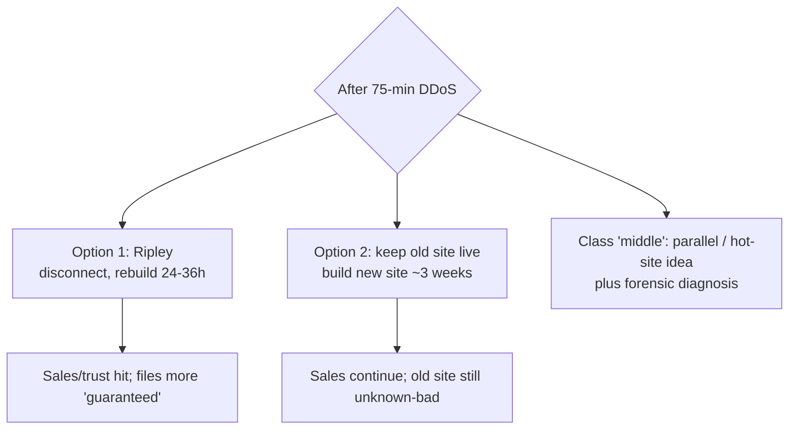

# Lecture T12: Contingency Planning — Part 03

**Playlist index:** 12  
**Transcript:** [12-contingency-planning-part-03.md](../../transcripts/markdown/12-contingency-planning-part-03.md)  
**Video:** https://www.youtube.com/watch?v=IEHL64fnd6A  
**Week / theme:** Week 4 — iPremier B and C; rebuild vs stay up; FBI/Market Top; what “prepared” actually looks like

## Learning objectives

- Carry Part A into **B**: public disclosure, 75-minute DDoS, file-name checks that **do not** prove integrity, Ripley’s 24–36 hour rebuild.
- Explain why **keeping the old site live while building a new one** is the business-friendly option and still **technically unsafe**.
- Follow **Part C**: no comprehensive shutdown → **FBI** call that iPremier is attacking **Market Top** from a production host → firewall **was** penetrated (“fire suppressed during the retreat”).
- Use the instructor’s corrections: do not compare **Google/Microsoft** competence with **Qdata**; a new site without **updated firewall/IDS** repeats the failure.
- List the team’s mitigation map (CDN, scale, DDoS services, CPMT, IRP/DRP/BCP, CIA **availability**) without treating it as a substitute for the case’s **catch-22**.

## What this lecture actually teaches

Student team (Lokesh, Sanjana, Subisha) presents **iPremier B and C**. The instructor’s teaching is in the interruptions: **time vs cost vs unknown integrity**; **hackers are smarter than the CIO**; **apples vs oranges** when citing hyperscalers.

### Recap they are not allowed to skip

iPremier is a top-two luxury e-commerce site; **credit-card** data is why everyone fears leakage. Intense young culture; hosting at **Qdata** (outdated architecture, high **staff attrition**). DDoS; **no detailed logging**; weak firewall; **IRP/DRP/BCP not implemented**. Attack **ended by itself**. Unknown: firewall breach, customer-data leak.

Part A’s live options: shut down and rebuild; disconnect temporarily; continue as usual.

What went wrong, restated:

- **Technical:** no detailed logs → recovery/forensics hard; no DDoS-protection software; outdated firewall; no capacity; internal-IT move never formalized.
- **Managerial:** inexperienced young workforce; Qdata not replaced because of **personal interest**; security under-invested; no firefighting plans, **no simulated attack**, no routine checks; **no PR strategy**; Bob ignored Jack’s warning on **operating-procedures deficit**.

### Part B — what the company actually does

A few hours after the attack they **disclose publicly**: they were a DDoS victim; attack lasted **~75 minutes around midnight**. They then implement **new security measures** — the group flags this as **reactive, not proactive** (today’s lecture contrast).

They still do **not** know if the firewall was breached. Evidence gathering: files on **every production computer** checked by **identity and size** (names present, sizes match). They **did not** check whether **contents were altered or replaced** — and **had no mechanism** to do so.

**Ripley’s recommendation (ops):** shut **all production computers**, disconnect from the internet, **rebuild software from development files** (less likely tampered). Estimate **24–36 hours**.

**Measures they institute (list as taught):**

- Restart production equipment **in phases** (all-at-once would inconvenience customers).
- File-to-file examination (are files **present**?).
- Study of technology solutions (presence **and** whether content changed — the gap remains).
- Project to move to a **more modern hosting facility**; more sophisticated **firewall**; more **disk**; **high levels of logging** (detailed logging had been disabled for a **20% performance penalty** — performance over security).
- Train more staff on monitoring software.
- Create an **incident response team** and **practice a simulated attack** (talked about before; now actually done).
- Retain a **cybersecurity consulting firm**; institute **third-party security audits**.

**Counter-recommendation in the firm:** build a **new site from development files at a new facility**; when it is ready, switch the old site off. Case note: **~3 weeks** to normalcy on that path.

**Classroom split**

- Option 1: minimum **24–36 hours** dark (maybe more).
- Option 2: business continues; switch later with a smaller cutover. **Time and cost** both matter; option 2 looks better **financially** (sales keep coming) but needs extra spend and visibility.
- Moderated idea: start the new site; do **not** wait until it is finished to kill the old one — switch off in the **middle** once you have visibility, to cut residual risk.

Team “middle ground”: a **parallel server** (the **hot site** from today’s theory) until the original is fixed; and they have **still never diagnosed the source** — that must start.

### Instructor on standing at the end of B

The debate in the company is real: shutdown 1–1.5 days vs build separate and run as usual. Advantage of option 2: **nobody knows** the business was disrupted.

**Ripley is not satisfied because you don’t know.** Names/sizes are correct; **contents** may have changed; **new files** may have been installed. **Intrusion is unproven and unruled-out.** The attack **stopped on its own**. A parallel site “in a few months” leaves a window for a **bigger embarrassment tomorrow**.

Choosing option 2 at **this** information set is **ignoring what happened** and hoping a future site will save you. **“Hackers are smarter than the CIO.”** Forensics need **shutdown**, which the other side refuses because **customers leave**. **Catch-22** (“between the sea and the devil”).

### Part C — they do not shut down

Senior management **decides not** to shut down for a comprehensive rebuild of production platforms. They **accelerate** a new site with whatever is available at an **unaffected** location.

**Two weeks later:** an **FBI agent** calls — **iPremier is attacking their competitors**. The **source is a system inside iPremier’s production site**. Only then they find and **kill the file**. **That** is when they accept the **firewall was penetrated**.

They had assumed that because the flood **stopped** and no further requests arrived, the attack was **over**. The group’s phrase: hackers **misdirected attention**; **“suppressing the fire during the retreat.”**

Now three problems at “catastrophic” level:

1. **Ripley’s rebuild now** — initiating it can look like **destroying evidence**; FBI already sees iPremier as the **source of an illegal attack**.
2. **iPremier vs Market Top** — lawsuit likely; how to convince Market Top you are a **victim / zombie**, not the attacker.
3. **Public statement** — database server **compromised**; no identified individual customer harm yet; **still unknown** whether card numbers were stolen; if they were, **credit-card processing agreement** lawsuit as well.

**Student suggestions (Part C):**

- Run from a **parallel Qdata server** rebuilt from development files; let customers **browse** but **no credit-card payments** until fixed; **cash on delivery** for urgent orders.
- Ask **FBI** to diagnose and **share the report with Market Top**; collaborate on security rather than a lawsuit that burns **both** market shares.
- Publish incident report and countermeasures; flash “under maintenance” rather than taking cards.

Audience push: a parallel server **on the same architecture** can die the **same way**. Critical idea from the floor: **segregate financial / card data** from the digital storefront; **human / “analogous” interface** so card data is not sitting on the internet-facing box. Firewalls alone do not save you if the storefront is wired straight into payments.

### Microsoft and Google slides — and the instructor’s brake

Team brings **current** incidents:

- **Microsoft** services outage (Outlook, website, Excel; Indian locations named). Public Twitter updates; isolated to **network configuration**; mitigated in about **two hours** without extra impact. Employee jokes (enforced vacation; “why did you fix it so soon?”). Some users ready to **move to Google**. **Stock down ~USD 20** at report time.
- **Google**, **1 June 2022**: Cloud Armor customer hit by HTTPS floods peaking at **46 million requests/second**. **Cloud Armor Adaptive Protection** detected early and **kept the customer online**. **Rate limiting** (they would accept on the order of **1 million** RPS; 46 million was the tell). Attack described on **layers 3–4 (infrastructure)** vs **6–7 (application)**; **defence in depth** so compromise of 3–4 ≠ all layers. **Threat modelling**; red/blue/purple practice. Framed as **proactive**, not reactive.

**Instructor:** good currency, **wrong comparison**. Microsoft and Google are **world-top technology** firms. iPremier is **retail** whose IT sits at **Qdata**, whose **competence is the question**. Even a **new site** is pointless until they invest in **updated firewall and IDS** and then migrate. Otherwise they remain vulnerable. **Apples and oranges** — useful as a picture of **professional practice**, not as iPremier’s available playbook.

### Recommendations the team closes on

**Technical (preventive / detective / reactive):**

- **Reduce attack surface** (limit options for attackers; vulnerabilities always remain).
- **CDNs** — spread unusual packet floods across many internet servers (Amazon-class e-commerce).
- **Know normal vs abnormal** — 04:30 traffic while the city sleeps should have been raised; Qdata did not.
- **Plan for scale** — load balancers; DDoS protection services. **GitHub 2018** used **Akamai Prolexic**.
- **Firewalls** matched to application attacks: packet, **MAC filtering**, hybrid — spend vs coverage. Need to see **content** change, not only names.

**Management / reactive:**

- **CIA:** **availability** failed first — Ripley **could not enter Qdata**. Suggestion: **move to internal IT**.
- Implement **IRP** (during the incident), **DRP** (recovery steps after disaster), **BCP** (parallel site) — none existed.
- Update hardware/software: UTMs (unified threat management), express data paths, etc.
- **Roles:** nobody knew whom to contact; no conference call of options. **NIST 7-step** contingency management from the textbook: **CPMT**, champion, project manager, members — form this **first**.
- Identify source; keep a **forensic report**; optional parallel server for continuity.

Instructor thanks the team; the comparison caveat above is the last teaching beat.

## Cases and examples from the lecture

- **iPremier B:** disclosure, 75 minutes, name/size file check, 24–36 h rebuild vs ~3-week new site, IR team and tabletop at last, logging turned back on.
- **iPremier C:** no shutdown; two weeks later FBI; production host attacking Market Top; evidence vs rebuild; card-agreement liability.
- **Microsoft** public outage comms vs **Google Cloud Armor** 46M RPS, rate limit, defence in depth.
- **GitHub 2018 / Akamai Prolexic.**
- **Hot site** as the missing parallel server (from T13’s theory, applied here).

## Key terms

| Term | Meaning in this lecture |
|------|-------------------------|
| File identity and size check | Proves names/sizes exist; **does not** prove contents or extra malware files |
| Development files | Build source treated as **less likely tampered** than production |
| “Fire suppressed during the retreat” | Apparent stop of the DDoS hiding a **planted** capability |
| Credit-card processing agreement | Separate lawsuit path if numbers were stolen |
| CDN | Distributes flood traffic so one origin is not the only choke point |
| Defence in depth | Different controls per layer (team’s Google 3–4 vs 6–7 reading) |
| CPMT (NIST 7-step) | Contingency committee the firm should have had **before** 04:30 |
| Catch-22 | Forensics need darkness; the market needs light |

## Formulas / frameworks

- **Reactive vs proactive** (B’s post-attack shopping list vs Google’s pre-built Armor).
- **IRP / DRP / BCP** restated by the team: during / after / parallel-run — matching T11–T13, applied to a firm that had none.
- **CIA:** availability first casualty (ops locked out of the host).
- **Cost vs time** on the rebuild decision (instructor: both, plus **technical viability**).

## Distinctions the instructor insists on

- **Presence of files ≠ integrity of files.** Without content verification you do **not** know there was no intrusion.
- **Option 2 is not “we will be ready next time.”** It is **running the unknown-bad production site until a future date.** Hackers do not wait on your project plan.
- **Shutdown needed for forensics** vs **shutdown as customer suicide** — the case does not dissolve that tension; Part C shows what “no shutdown” **became**.
- **Do not copy hyperscaler playbooks onto Qdata.** New site without **new firewall + IDS** is the same vulnerability with a new label.
- A parallel server **on the same stack** is not by itself a DDoS answer; **separating payment data** is the more serious architectural hint from the floor.

## Exam-oriented recap

- B: public DDoS admission (75 min); name/size audits; Ripley 24–36 h rebuild vs live-old + new-site (~3 weeks); logging had been a 20% UX trade.
- C: they stay up; two weeks later FBI says iPremier is the attacker; planted file on production; Market Top and card-brand legal risk; rebuild now looks like evidence tampering.
- Theory applied: hot site, CPMT, IR/DR/BCP, simulated attacks — all **after** the fact.
- Instructor: diagnose the unknown; don’t pretend Google’s night is iPremier’s night.
