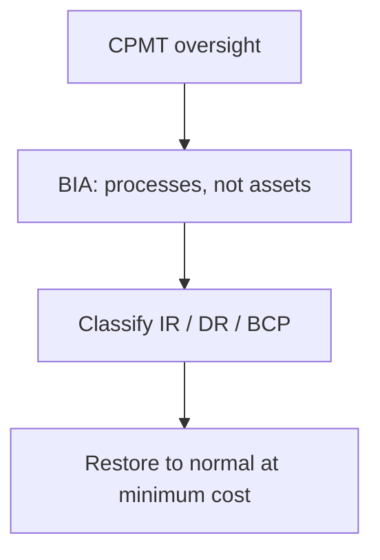
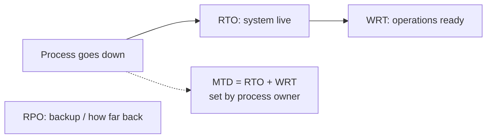
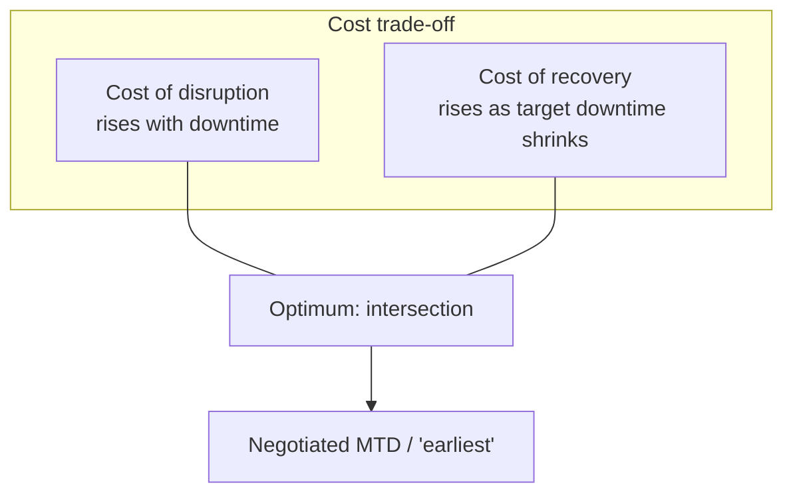

# Lecture T13: Contingency Planning — Part 02

**Playlist index:** 13  
**Transcript:** [13-contingency-planning-part-02.md](../../transcripts/markdown/13-contingency-planning-part-02.md)  
**Video:** https://www.youtube.com/watch?v=bpxDDAT7yE0  
**Week / theme:** Week 4 — CISO and structures; CPMT; BIA clocks; downtime vs restoration cost; IR → DR → BCP switch

## Learning objectives

- Put a **CISO** (and RBI’s separate security role) on the organizational-planning side, then switch to contingency.
- State the **goal of contingency planning** and the job of the **CPMT**.
- Run **business impact analysis (BIA)** on **business processes** (not assets), using **MTD, RTO, WRT, RPO**.
- Use the **cost-of-disruption vs cost-of-recovery** graph; name the intersection as the management negotiation for time.
- Switch **IRP → DRP → BCP** by impact and by **who leads**; keep **DR = same/primary site**, **BCP = change site**.
- Know IR **before / during / after**, Pipkin’s indicators, **GDPR 72-hour** reporting, **hot/warm/cold** (and time-shared) sites, and **red/blue/purple** tests.

## What this lecture actually teaches

### Organizational planning side (brief, then stop)

Senior management / the board write **values** (what you will stick to), **vision** (where you will reach), **mission** (what you will do that aligns with vision). **Strategic planning is top-down** (with bottom inputs). Cybersecurity management planning must run **alongside** those priorities.

Treat cybersecurity as a **sub-organization** with its own structure. Role on the slide: **CISO** — a C-level security officer **in addition to IT**. CISO **reports to the CIO**. CIO understands business, technology, **and** cyber and **builds policies**. (**Next class = cybersecurity policy.**) Policy is **initiated by the CISO** from strategic priorities. Drafting, operationalizing, structuring, and sustaining that needs a **top cyber role**, especially when the firm is large, cyber assets are large, and the business **runs on IT**.

**India / RBI:** every banking institution must have a **top security role** (CISO, director of security, or similar) **in addition to a CIO**.

**CISO job description** (the title does not even contain “cyber”; CI = information): create the **strategic information security plan / policy**; plans in accordance with policy; **budgets**; tactical and operational plans; **monitor**; **comply with law**. After an incident, CISO is critical for **what to do** and **what to communicate to the public**.

Today’s case organization (iPremier sequels) **did not have a CISO**; after a major incident they discover they lack structures, policy, and contingency planning.

Organizational planning + structures resume in **risk management**. The lecture now **switches** to contingency.

### Goal of contingency planning; CPMT

A **contingency** is an unpredicted, unaccounted-for incident — **despite** preparation, things go wrong. (Accounting analogy: a contingencies head for things not planned that still happen.)

**Main goal (slide wording to keep):** **restoration to normal modes of operation with minimum cost.**

The team that owns this in large organizations is the **CPMT — Contingency Plan Management Team** (spoken as Contingency Plan Management Committee). It is an **oversight** team for the contingency-planning process; it institutes **subcommittees** for activities. Higher-level team **for contingency planning alone**.

Contingency planning **classifies incidents into IR / DR / BCP** (by impact, in **money** as far as possible). CPMT **monitors** that.

### BIA: the block the textbook diagram hides

**Business Impact Analysis (BIA)** is assumed **inside** contingency planning, so some textbook diagrams omit it. The instructor insists it is **the most important assessment CPMT initiates**.

BIA looks at **severity of attacks** and, if they happen, **impact on business processes**.

| Planning path | Unit of analysis |
|---------------|------------------|
| **Risk management** (protective, later) | **Assets** — if this asset is attacked, what impact? |
| **Contingency / BIA** | **Business processes** — e.g. if **order fulfillment** is hacked or stalled, what is the loss? |

### Four time parameters in BIA

Contingency looks at processes, then impact **in time**. **Time is money**: downtime of a process → financial impact.

| Clock | Meaning in this lecture |
|-------|-------------------------|
| **MTD** — Maximum Tolerable Downtime | **Process owner’s** (not the technical operator’s) tolerance: how long can this process be down **without substantial business impact**? Ideal answer is **zero** (customers switch). Zero cannot be the working number; there is a **cost of downtime** and a **cost of recovery**. MTD is a **reference** the process will **accept**. |
| **RTO** — Recovery Time Objective | Time to bring the **system live** — server/application **functional** again. Worked by the **technical / BIA team** inside the MTD budget. |
| **WRT** — Work Recovery Time | System ready **≠** operations ready. People sign in, checks, formalities — **operations restore**. |
| **RPO** — Recovery Point Objective | Point in time the system can **go back to**. **Purely backup policy.** Hourly backup → at most ~1 hour of data lost (RPO ≈ 1 hour). Daily backup → less privilege. Set from **criticality**. |

**Identity taught as a formula:** **MTD = RTO + WRT**.

RTO: system goes live. Then WRT: it becomes **operational**. Together they must fit the process owner’s MTD. **RPO** sits on the backup axis, not as a summand of MTD.

**Worked illustration:** process owner is pressed off **zero**; **72 hours** MTD (losses exist but this is maximum tolerable). **RTO = 36 hours** (must be **less than** MTD because WRT also consumes the budget); remaining half for work recovery. Repeat **for each** automated business process (processes are what applications automate; invoicing down → business impact).

**FIPS 199** appears on the same illustration: severity in **confidentiality, integrity, availability** as **low / medium / high** — also used in the course’s incident-analysis assignment.

BIA’s job if clocks **do not exist**: **set them** — MTD, then rational RTO and WRT, and an RPO/backup policy.

### Cost balancing: disruption vs recovery

Downtime is a cost. **Recovery is also a cost**, and it is a **function of time**. If MTD = 1 hour, recovery cost can be **very high**: **hot site** or **warm site** always ready — **redundancy**. Redundancy is how you buy availability.

**X-axis:** length of disruption. **Y-axis:** cost.

- Short disruption (left): disruption cost **low**, but **recovery cost high** (parallel systems, instant switch).
- Long disruption (right): recovery investment **low**, disruption cost **high**.
- Process owner may demand the far left; someone must show the graph: is the **organization willing to invest** that much?

**Optimum = intersection of the two curves.**

**Contingency planning is a negotiation for time.** Objective is restore **at the earliest**; “earliest” is a **management** number that depends on **cost of recovery vs cost of disruption** and **willingness to invest in redundancy**. You cannot do CP without management.

### Switching IRP → DRP → BCP

Impact on **business processes** triggers the plan. Terminology is “not well done”: incident and disaster **name the event**; BCP **names a process**. You can call BCP a **total / highest disaster**. **Disaster recovery restoration is at the primary / same site** — you do **not** switch site.

| Plan | Impact | Typical lead (as taught) |
|------|--------|---------------------------|
| **IRP** | Low; “small incident” | Technical |
| **DRP** | Major incident; restore to normalcy in hours **without** leaving | **CIO** |
| **BCP** | **Cannot continue in the same location**; moving | **CEO** |

Rest of IR/DR/BCP before–during–after checklists is “descriptive,” “self-explanatory,” textbook slides. Still taught:

**IRP** is the **plan** for how you respond; response is **reactive**. Three phases: **before**, **during**, **after**. After: **structured documentation** of every incident. During: if the event requires **shifting site**, **BCP binder** applies (who to contact, etc.). Plan must **exist before** you need it.

**Detection:** IDS must be **active**; **active logs** and reporting. Conceptually **Pipkin** (and others): three categories of **indicators** — **possible**, **probable**, **definite**. iPremier’s oddities may be **probable** indicators of something **worse coming**. **Change to logs** is given as a **definite** indicator. **Threat ≠ incident:** threat **could** happen; incident **has** happened. Threat intelligence is about potential; here the topic is **what indicates that something already happened** (you may still not know without systems).

Response needs **people, process, technology** (alert roster, how you communicate). Document **what, when, where, why, how** on templates. **Carnegie Mellon** IRP example: very detailed — definitions, roles, methodologies, phases, guidelines. Need written rules for **when an incident becomes a disaster** and when a disaster becomes **BCP**. If these are management processes, run **after-action review** (improve or worse?).

**Law enforcement / public reporting:** iPremier had **no clarity** whether to tell government or contain internally. Under **GDPR** (EU), an incident **must be reported** — you cannot hide it. **72 hours / 3 days.** You can argue it was not known, but you need a **clear case**. Cyber management must know **when to report to government and to the public**.

**DRP:** name says severity; **iPremier** is used as a **major disaster** (business down) that they still have to manage **on site** (they have no real BCP).

**BCP strategies:**

| Site | Readiness |
|------|-----------|
| **Hot** | Two sites **running in parallel**; if one is down the other is ready; **very low downtime** for the most critical processes |
| **Warm** | Not immediately ready; can be made ready **within defined timelines** |
| **Cold** | Lowest readiness; bring into operation over a **longer** period |
| Other | **Time-shared** sites and further market options — need **domain/regional** knowledge inside the firm |

### Testing: keep the plan alive

Security organization’s job: periodic checks, **mocks**, preparedness. Link given to explore practice. **Red / blue / purple teams:** red plans a **simulated attack**; blue **defends**; purple **moderates** (how the attack or the defence could have been better). A practicing manager has run such a drill for students in other terms.

The hour closes by calling the next team for **iPremier B and C** (T12).

## Cases and examples from the lecture

- **RBI CISO-beside-CIO** mandate for banks.
- **iPremier:** no CISO; stale BCP; law-enforcement reporting unclear; used as DR-scale event without a real BCP.
- **Order fulfillment / invoicing** as BIA process units.
- **FIPS 199** CIA high/medium/low on the process sheet.
- **Carnegie Mellon** IRP as a specimen of detail.
- **GDPR 72-hour** notification.
- **Red/blue/purple** exercises.

## Key terms

| Term | Meaning in this lecture |
|------|-------------------------|
| CISO | Chief information security officer; reports to CIO; policy, plans, budget, monitor, law, incident comms |
| CPMT | Contingency Plan Management Team/Committee — oversight of CP and subcommittees |
| BIA | Business impact analysis — process-level impact; sets the clocks |
| MTD | Maximum tolerable downtime — **process owner** |
| RTO | Time to **system live** — technical |
| WRT | Time to **operations** after the system is live |
| RPO | How far back you can recover — **backup policy** |
| Redundancy | Extra capacity (hot/warm site) that buys short MTD at high recovery cost |
| Hot / warm / cold site | Parallel-ready / make-ready-in-time / slowest alternate location |
| Pipkin indicators | Possible / probable / definite signs an incident has occurred |
| After-action review | Post-event: did the process improve or worsen? |

## Formulas / frameworks

- **MTD = RTO + WRT** (RPO separate, from backup cadence).
- **BIA unit = business process**; **risk unit = asset**.
- **Cost trade-off:** disruption cost ↑ with downtime; recovery cost ↑ as target downtime ↓; **optimum at intersection**.
- **IRP (tech) → DRP (CIO, same site) → BCP (CEO, new site)** by impact.
- IR: before / during / after; document what–when–where–why–how.
- GDPR: report in **72 hours**.
- Test with red / blue / purple.

## Distinctions the instructor insists on

- **CISO ≠ CIO.** Banks (RBI) must have both; CISO owns the security **policy/plan** track.
- **BIA ≠ risk assessment.** Processes vs assets.
- **MTD is not a tech number.** Process owner sets it; tech fits RTO+WRT inside it. **Zero MTD** is ideal and **unusable** without paying recovery cost.
- **Downtime cost ≠ restoration cost.** Fast restore requires **redundancy spend**. CP is **negotiation for time**.
- **DR vs BCP (site rule):** DR recovers **at the primary site**; BCP is when you **cannot stay** and **move**. Naming is awkward (BCP is a process name, not an event name).
- **Threat vs incident.** Threats are potential; incidents have happened; you still need logs/IDS to **know**.
- **Hide vs law:** GDPR removes the “contain it internally” option on the EU facts.

## Exam-oriented recap

- CISO reports to CIO; writes policy/plans/budgets; RBI wants this role in banks.
- CPMT restores to normal **at minimum cost**; BIA on **processes** sets **MTD, RTO, WRT, RPO** with **MTD = RTO + WRT**.
- Draw the two cost curves; manage at the **intersection**; that is “earliest.”
- IR → DR (same site, CIO) → BCP (relocate, CEO).
- Hot/warm/cold; Pipkin indicators; GDPR 72 hours; red/blue/purple to keep the binder from becoming iPremier’s.
