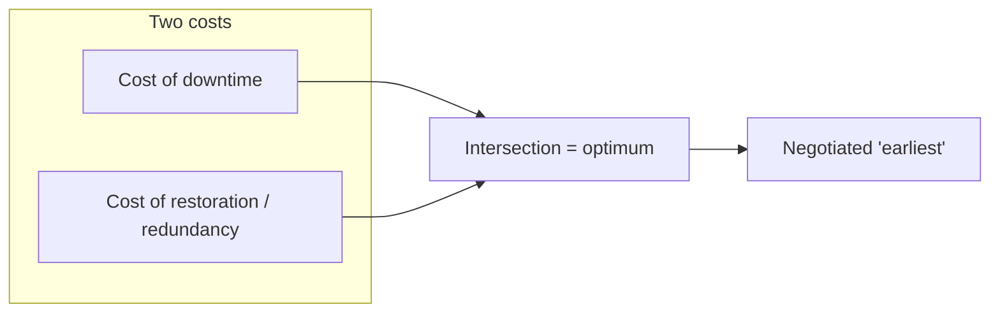
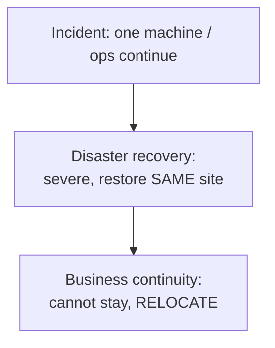
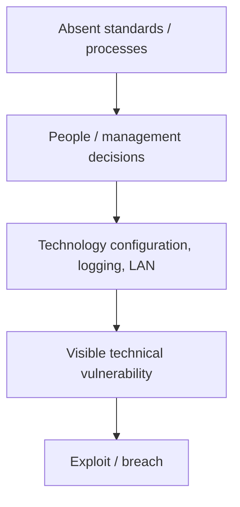

# Lecture T14: Live session — Contingency planning Q&A

**Playlist index:** 14  
**Transcript:** [14-cybersecurity-and-privacy-supplementary-lecture.md](../../transcripts/markdown/14-cybersecurity-and-privacy-supplementary-lecture.md)  
**Video:** https://www.youtube.com/watch?v=ozsxJCM4BGs  
**Week / theme:** Week 4 live session — contingency recap; vishing; data owner / custodian / user; technological vs managerial vulnerability

## Learning objectives

- Restate contingency as **planning for the unexpected**: CPMT restores to **normal operation in minimum time**.
- Hold both costs: **downtime vs restoration/redundancy**; optimum at the **intersection**.
- Use the instructor’s **on-the-spot correction**: **DR = recover at the same location**; **BCP = you must relocate**.
- Distinguish **vishing** (malicious **voice** calls) from **phishing** (malicious **email**).
- Apply textbook roles: **data owner**, **data custodian**, **data user / subject**.
- Treat **technological and managerial vulnerabilities as intertwined** (Target LAN, iPremier logging, Equifax governance).

Platform logistics (assignment deadlines, certificates, how to download videos, where to find reading files already answered in an earlier live session) are omitted. The **teaching** inside those Q&As is kept.

## What this lecture actually teaches

### How to use the week (teaching, not logistics)

Watch the week’s videos **and** read the materials **before** asking. Week 4 topic is **contingency planning** as **managerial planning** for cybersecurity. Textbook **chapter 4** is the reading. The course applies **management principles and frameworks** to environmental risk.

### What “management” is, in one line

A participant asked “what is this management?” Answer kept simple: **management is about managing resources** — what you use for production/creation: **manpower, money, land, materials, technology**. Technology is **one resource**. **Planning** is a core managerial activity. Without planning you can still “do things,” but **losses/costs are higher** — you are inefficient.

### Two types of planning in this course

| Type | When in the course | Stance |
|------|--------------------|--------|
| **Contingency planning** | This week | **Reactive** — incident happens despite preparation; restore |
| **Risk-management planning** | Later | Protective path (not this hour’s detail) |

**Contingency** means **not predictable** — **uncertainty**. Weather metaphor: morning is sunny so you assume the day stays fair; afternoon **clouds and rain**; you get wet because you did not plan. Even if you expect rain, a **tornado** can still arrive. **Unexpected things happen.** Contingency planning is **planning for the unexpected** — “like a paradox.” That is what this week’s lessons teach.

You prepare for **incidents** (events that **could** happen). If they happen **despite** preparations, **restore the organization / business / system to operational, normal running condition**.

### CPMT and “earliest”

Do not lose this principle: the **CPMT** (contingency planning task management group/team) restores systems to **normal operation at the minimum time** — **earliest possible**.

“Earliest” is not one pole:

- **Zero downtime** (no loss of time) is **best** operationally.
- The opposite is restore **at leisure**.

**Zero downtime is possible but introduces another cost.** The **shorter** the downtime target, the **higher** the cost of restoring — you **invest in redundancy** so that if one system fails, another takes over. **Trade-off: cost of downtime vs cost of restoration.** **Optimal point = intersection of the two curves** (as in the recorded lecture).

### Three impact classes — with a live correction

Three types of incidents:

- **“Normal” incident** — does not cost much; e.g. **one machine** affected.
- **Disaster** — entire operations / production / **e-banking** down; impact very high.
- Then a **location** question.

He **first** says a disaster means the place is destroyed, you cannot operate in Adyar/Chennai, you **move the unit**, “that’s called Disaster Recovery” — then **stops and apologizes**:

> **Business continuity.** Disaster Recovery is recovery **to the same location**; you **don’t change the place**. **Business continuity** is when you **cannot operate there anymore** and **need to move out** — **BCP**. DR is recovering the system from a disaster **but to the same location**.

That correction is the distinction to memorize. IR sits **before** disaster on the impact ladder. Before / during / after activities are in the recorded contingency lessons.

### iPremier as the unprepared narrative

**iPremier A** is a young e-commerce firm under **DDoS**. The presentation showed they were **not prepared**; people **blame each other**. Audience is both **technical people and managers** — you need **managerial ability and technology understanding**. End of the case: steps to treat cybersecurity **seriously**.

**Lack of contingency planning** → unexpected, sometimes **serious**, downtime → sometimes disaster → sometimes **BCP (shift location)**. Two reasons things go badly:

1. **Protection mechanisms are not sound enough.**
2. **Despite** that, people **blame each other** or **stare at the walls** because they **do not know what to do**.

**Be prepared** even after full risk-management investment in technology and people. Things can still go wrong. That **is** contingency planning.

### Q&A that teaches substance

#### Smartphones / “is cybersecurity used in phone?”

Smartphones **are** vulnerable — not only servers and PCs. Different attacks hit phones. A **major case of an Israeli firm snooping on Indian politicians** is mentioned **without naming** it (“politically charged, but it did happen”): data in cell phones stolen by **malware**.

Another phone-specific channel: **vishing**.

**Phishing vs vishing** (captions garble the spellings; the teaching is clear):

| | Channel | Content |
|---|---------|---------|
| **Phishing** | **Email** / spam with malicious content | Impersonation, malicious payload, credential/theft mails |
| **Vishing** | **Voice calls** from unknown people | Impostors who sound benevolent, “advise” or “help,” gather information or dangle money |

Vishing = phishing **applied to phones / voice**.

#### Technological vs managerial vulnerability

Cyber risk is **mostly with the technology**, but you **cannot separate people from technology**. One breakup of an information system: **people, process, technology**.

**Target:** clever hackers exploited vulnerabilities. There was a **LAN configuration** error: a **vendor could access a POS**. Was that technological or managerial? **Cause and effect.** What you **see** as the vulnerability is the **LAN misconfiguration** (technology). **Cause** is **human error**. **Fever vs infection:** fever is the symptom; infection causes it. **Managerial faults get reflected in technology**, which then enables attacks. Management/people and technology are **intertwined**; often you cannot separate them. Sometimes the people/management problem is **clear**:

**iPremier logging:** logging **turned off** → hard to trace who accessed the system. Why off? System felt **inefficient**. **Who decided?** A professional. Without **strict management processes**, those decisions happen and systems become “well done” in the wrong sense (caption: **vulnerable**). What prevents such errors: **standards and strong processes** (risk-management procedures and cybersecurity-management standards, later in the course) — incidents can be **minimized**, not wished away.

#### “Did Target fail because they used CIA technology?”

The case says they had **the best technology**, “as good as technology protecting a country” — that was the **investment**. It does **not** say CIA-grade tech **caused** the breach. Vulnerabilities came from **management failures**: **misconfiguration**, **lack of log details** — **human errors**. **Despite the best technology you can still have vulnerabilities because of people.** That has been the **bigger cause of data breaches** in the last decade.

Later case preview: **Equifax** (US) — documented case shows **not only management but governance failure**. Do not “just find fault with the technology.”

#### Data owner, custodian, user (textbook p. 40, chapter 1)

A participant quotes an assignment item: who is responsible for the **security and use** of a particular set of information — options including data users, data exporter, data custodians, data owner — and says the **key was C, data custodians**, “not data owner.” The instructor cannot fully parse the posted wording, so he **teaches the textbook split** and says **definitions matter**; do not use the terms loosely.

As he **reads page 40**:

| Role | Meaning in this lecture / textbook passage |
|------|-----------------------------------------------|
| **Data owners** | Members of **senior management** **responsible for the security and use** of a particular set of information. They usually **determine the level of data classification** and changes to classification when the organization changes. **Higher level.** Example: organization **XY** is the owner. |
| **Data custodians** | Work **directly with data owners**. **Responsible for the information and the systems that process, transmit, and store it.** **Operational** level. Example: a **database administrator** is custodian of data in that database; the **IT department** that manages the database is the custodian. |
| **Data users** | People **whose data is stored** — e.g. **students** in an educational institution. |
| **Data subjects** | Related privacy term, coming later: those **whose data is stored, processed, or transmitted** — overlapping the “user” idea in this answer. |

**Assignment key** in the live session is given as **C — data custodians**. The **teaching point** is the **senior vs operational** split: owners classify and are accountable at management height; custodians run the systems; users/subjects are the people in the data. Read the chapter; these are **technical terms with definitions**.

## Cases and examples from the lecture

- Weather / tornado: you cannot treat a clear morning as a plan.
- **iPremier:** no plan → blame; logging off for performance.
- **Target:** LAN/POS vendor path; “best tech”; still human/config/log failures.
- **Israeli-firm phone malware** against Indian politicians (unnamed).
- **Equifax** (preview): management **and** governance failure.
- Textbook **p. 40**: owner / custodian / user.

## Key terms

| Term | Meaning in this lecture |
|------|-------------------------|
| Management | Managing **resources** (people, money, land, materials, technology) |
| Contingency | Unpredictable incident; plan for the unexpected |
| CPMT | Team whose role is restore to normal **in minimum time** |
| Cost trade-off | Downtime cost vs restoration/redundancy cost; optimum at intersection |
| IR | Lower-impact incident (e.g. one machine) |
| DR | Recover from a severe event **at the same location** |
| BCP | **Cannot** operate here; **move out** |
| Phishing | Malicious **email** |
| Vishing | Malicious **voice call** (phone-channel phishing) |
| Data owner | Senior management; security/use; **classification** |
| Data custodian | Operational; systems that process/transmit/store (e.g. DBA) |
| Data user / subject | Person whose data is stored (students; privacy “subject”) |
| People–process–technology | The IS breakup; all three carry vulnerability |

## Formulas / frameworks

- Planning vs no planning → **higher cost / inefficiency**.
- Contingency **reactive**; risk management **later / protective**.
- **Shorter downtime target ⇒ higher restoration cost** (redundancy).
- **DR same site / BCP relocate** (after the spoken correction).
- **People, process, technology**; managerial cause → technical symptom.

## Distinctions the instructor insists on

- **He misspoke, then corrected:** moving plant because the site is dead is **BCP, not DR**. **DR = same location.** Learn the correction, not the first sentence.
- **Zero downtime ≠ free.** You pay in **redundant systems**.
- **Phishing ≠ vishing.** Email vs **voice**.
- **Owner ≠ custodian ≠ user.** Senior classification vs operational DBA vs the person in the database. Do not use the words loosely.
- **Tech vulnerability vs managerial vulnerability:** often **one event with two layers** (LAN misconfig is what was exploited; **who configured it** is management). Logging off is a **decision**, not a mysterious technical fate.
- **Best technology ≠ no breach** (Target). Later, **governance** can fail too (Equifax).
- Contingency is required **even if** risk management and controls were done.

## Exam-oriented recap

- Management = resources; planning cuts loss. Contingency = paradox of planning the unexpected; CPMT restores **earliest**, subject to the **two-cost** intersection.
- IR small; **DR same site**; **BCP relocate** (instructor’s apology is the rule).
- Phones: malware and **vishing**; email **phishing**.
- Owners (senior, classify), custodians (operational systems), users/subjects (whose data).
- Target/iPremier: people and technology **together**; standards/processes are what reduce those errors.
