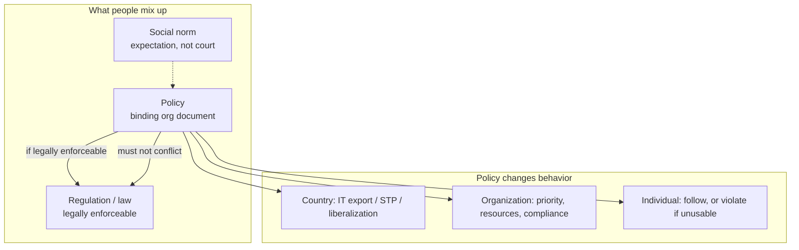

# Lecture T15: Cybersecurity Policy — Part 01

**Playlist index:** 15  
**Transcript:** [15-cybersecurity-policy-part-01.md](../../transcripts/markdown/15-cybersecurity-policy-part-01.md)  
**Video:** https://www.youtube.com/watch?v=8nEpUXaiZns  
**Week / theme:** Week 5 — Cybersecurity policy (what a policy is, and why it must exist)

## Learning objectives
- Treat policy as the **reference document** that planning and day-to-day security decisions go back to.
- Separate **norm**, **policy**, and **regulation** (law).
- See policy as something that can **enable** or **disable** an organization, and that **changes behavior** at country, firm, and individual levels.
- Apply the first formation rule: a policy must **never conflict with the law** and must **stand up in court**.
- Hold both sides of the trade-off the instructor keeps repeating: **protect** without blocking **progress**.

## What this lecture actually teaches

### Why this topic comes after planning
Cybersecurity here is still a **management and governance** problem, not yet information privacy. Without management planning, a business can be shaken or go bankrupt. Planning needs a reference: how important is cybersecurity, is top management committed, and will they fund it?

The IVK incident from the previous session is the foil. The firm did not approve investment in cybersecurity technology because it did not look like a priority. Managers therefore need to know whether the top team's position is **informed** or **arbitrary**. That is what brings the class to **policy**.

### What “policy” is in this course
A cybersecurity policy is a **document that acts as a reference**. It is **binding on everyone**, not written for one person. It exists in the **collective interest** (fairness, equity, course or organizational objectives) while trying not to invade personal space or become unjust.

The instructor’s classroom analogy: the course outline has a policies section (plagiarism, examinations, malpractice). Those clauses reflect the institute’s **code of conduct**. If copying is treated as “okay for you, not okay for him,” the instructor is not being fair. Policy is how you meet the objective without that imbalance.

### Norms, rules, regulation — three different things
When students hear “policy,” three words come up: **rules**, **regulation**, and **norms**. They are not the same.

- A **social norm** is expectation without a written rule. “Come well dressed to class” is the example: nobody can take you to court for dressing otherwise, yet people dress because of social expectation. Society largely functions on norms.
- A **regulation** (the law) is **legally enforceable**. Violate it and someone can take you to court.
- A **policy** is a binding organizational document with objectives. **If it is legally enforceable, it is a regulation; otherwise it is not.** Regulation is “basically a policy,” but policy need not be regulation depending on context.

### Policy can enable or disable
A well-framed policy lets the organization attain its objectives. An ill-framed one, or **no policy at all**, leaves the firm with nothing to refer to when a doubt or a crisis appears. The instructor’s constitutional analogy: without a constitution there is no reference; anyone can “set up their own shops.” IIT Madras itself functions because there is a constitutional provision for it.

Policy is an **essential foundation for effective cybersecurity programs**.

### Policy influences progress — country, organization, individual
**Country.** India’s IT industry did not grow for decades after independence. Growth started when **policy** changed: early computer-software-export policy actually **discouraged foreign investment** (indigenous-technology models of that era). Landmark later moves — **software technology parks**, **economic liberalization**, new economic policy, foreign investment in IT, IT services exports — **allowed** the industry to exist. “Policy influences progress.”

**Organization and individual.** Policy also changes organizational and employee behavior. There is a research literature on **employee compliance** with cybersecurity policies. A policy that makes daily work impossible (no internet, tight deadlines, no access to the sites the job needs) produces **violation**. Compliance is a function of many things, not of writing a document.

The trade-off already discussed for IDS and logging returns here: turn intrusion detection or logging fully on and you gain safety and lose efficiency. One thing is to **protect**; the other is to **progress**.

### The government’s instruction to Justice Srikrishna
The term of reference given to the Justice Srikrishna Commission (personal data protection bill) is quoted as a policy-balance sentence: **protect the privacy of people without inhibiting the potential of digital technologies**. Those two aims sit like parallel lines. **Whenever two things conflict, you need regulation to bring a balance.**

### Well-framed vs fear-framed policy
A well-framed policy can **motivate** people and invite the right behavior. An ill-framed policy makes people **violate**. A policy that only induces **fear** (huge penalties) may produce compliance **for the sake of the regulation**, at the cost of work output and efficiency. The live problem of cybersecurity policy is **how you bring the balance between efficiency and safety**.

### Principle 1: a policy should never conflict with the law
A cybersecurity policy is formulated **for an organization**. Some sectors are **required by regulation** to have one: **RBI requires every bank** to have a cybersecurity policy defining structures and processes. Whatever you write must be **in line with the law of the land**.

**Enron / Arthur Andersen (1990s).** Major accounting fraud; the company was going bankrupt while audit reports said it was healthy. The scandal drove stricter mandatory reporting and accounting standards globally, including the **Sarbanes–Oxley Act**. In the legal fight, Andersen destroyed emails and audit documents. They framed a **shredding (retention) policy**: retain a document **till it is relevant** — not “four years,” not a number. A qualitative phrase is **subject to interpretation**. Once the audit was “over,” they treated the files as not relevant and shredded evidence. That policy was seen as **in conflict with the law** (destruction of evidence). Today retention in telecom and other sectors is specified in **measurable numbers**, not qualitative slogans.

Contrast: IIT Madras’s own retention practice (examination answer scripts kept about **four years**, then collected for shredding). A number can be defended; “till relevant” could not.

**Illegal content / child pornography classroom debate.** Child pornography is illegal by law in any country the instructor is talking about. If an employee uses the office internet to reach illegal sites, **both the individual and the organization** can be responsible. Students first argue that internet is needed for work, so only the employee is at fault. The instructor’s test: **do you have a policy** that internet is for work and employees may not access sites prevented by law? Then it is a **policy violation** and a stronger court argument. Framing is not enough. **Policy must be implemented**: due care means firewalls actually block those sites. New bad sites appear daily, so blocking will never be complete — that is why you still need the written policy. The policy must **stand up in court**.

### Other formation principles named in the slides
- Do not contradict the law; know the related laws and regulations.
- Policy must be **properly supported and administered** (the firewall example).
- Policy should **encourage success** of the organization — blocking all internet is not a serious answer; you still have to “tap the potential of digital technologies” without compromising privacy.
- **Involve end users** of information systems in formulation.

Policy sits in the **outer circle**: it is referred to in all cyber-asset activity — networks, individual systems, specific applications. It is a **binding document**.

## Cases and examples from the lecture
- **IVK:** cybersecurity spend not approved; no documented priority.
- **Course policies** (plagiarism, exams) as a fairness / collective-interest document.
- **Dress code** as social norm, not regulation.
- **India’s IT industry:** early policy that discouraged foreign IT investment; later STP and liberalization that enabled growth.
- **No internet at work** as a security policy that drives violation under tight deadlines.
- **IDS / logging on:** safer, less efficient.
- **Justice Srikrishna Commission TOR:** privacy **and** digital potential.
- **Enron and Arthur Andersen:** “retain till relevant” shredding policy vs destruction of evidence; SOX-era tightening.
- **Institute shredding / retention:** answer scripts ~four years.
- **Illegal sites from office internet:** need a written acceptable-use statement **plus** firewall blocking (due diligence). Both org and employee can be liable.
- **Banking / RBI:** sector required to have a cybersecurity policy.

## Key terms
| Term | Meaning in this lecture |
|------|-------------------------|
| Policy | Binding reference document so the organization can meet objectives with fairness; not only for one person |
| Social norm | Unwritten expectation (dress for class); not court-enforceable |
| Regulation / law | Legally enforceable rule; someone can take you to court |
| Shredding / retention policy | How long documents are kept; must be specific enough to survive court |
| Due diligence (implementation) | Stating the rule is not enough; firewalls and admin must actually carry it out |
| Protect vs progress | Safety controls vs the organization’s ability to work; policy has to balance both |

## Formulas / frameworks (if any)
No numeric formula. The formation checklist taught here:

1. Never conflict with the law; it should stand up in court.
2. Support and administer the policy (technical and managerial).
3. Enable organizational objectives, not only restrict.
4. Involve end users in formulation.

## Distinctions the instructor insists on
- **Norm is not regulation.** Dressing for class is a norm; law is what a court can enforce.
- **Policy is not automatically law.** It becomes regulation only if it is legally enforceable.
- **A convenient policy is not a lawful policy.** Andersen’s “till it is relevant” was a policy that conflicted with the law.
- **Framing ≠ implementation.** “Employees must not visit illegal sites” is weak in court if the firewall still lets them through.
- **Individual fault does not automatically clear the organization.** Without a policy and due care, the org is still in the argument.
- **More restriction is not automatically better policy.** A policy that blocks work will be violated.

## Exam-oriented recap
- Policy is the reference that tells you cybersecurity is a priority and how people must behave; without it there is nothing to refer to in a crisis.
- Policy can enable (India IT) or disable (no document, or a document that makes work impossible).
- Quote-level balance: protect privacy **without inhibiting** digital technologies.
- First principle: **do not contradict the law**; use measurable retention rules, not “till relevant.”
- For internet misuse: written policy **and** blocking/implementation; both employee and organization can be responsible.
- Behavior change is the point: well-framed policy invites compliance; fear-only or unusable policy produces violation or inefficient compliance.
