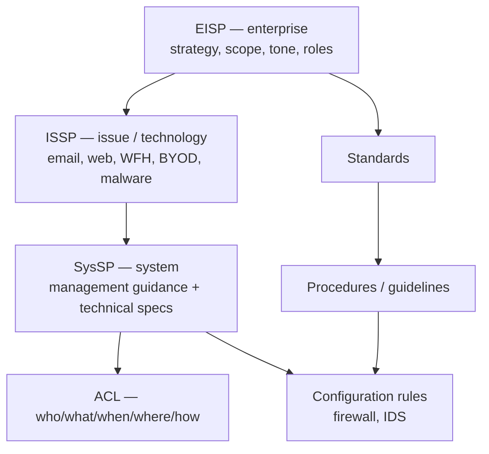

# Lecture T16: Cybersecurity Policy — Part 02

**Playlist index:** 16  
**Transcript:** [16-cybersecurity-policy-part-02.md](../../transcripts/markdown/16-cybersecurity-policy-part-02.md)  
**Video:** https://www.youtube.com/watch?v=snROvNy3wf8  
**Week / theme:** Week 5 — Cybersecurity policy (hierarchy: EISP → ISSP → SysSP)

## Learning objectives
- Separate **policy, standards, procedures, and guidelines**.
- Use the three-level hierarchy the lecture treats as standard terminology: **EISP**, **ISSP**, **SysSP**.
- Treat policy as a **long-term master document**; put changing legal detail in standards/procedures.
- Explain **SETA** and why dissemination is a management duty.
- Map SysSP onto **management guidance** plus **technical specification** (ACL and configuration rules).
- Distinguish **firewall (prevention)** from **IDS (detection)**.

## What this lecture actually teaches

### Policy is not procedure
**Policy** is broader, **abstract**, and tied to strategic purpose: achieve objectives without compromising law and individual freedom. It is a philosophical-level statement.

**Standards** are the next level: more detail on how the policy will be enacted. They always **refer back to the policy**. How strict they are follows how the policy was written.

**Procedures and guidelines** implement the standards. Example used throughout: the **policy statement** is that employees may access legitimate sites and must not access sites prohibited by law. The **procedure** is the **firewall configuration rules**.

Domain and culture change how strict the stack is. Healthcare vs education have different priorities because **sensitivity of data** differs. An Indian academic cybersecurity policy may not be as strict as a healthcare organization’s; Carnegie Mellon’s document is far more detailed because **privacy concerns differ across cultures and countries**, so the law differs too. Sample policies from different domains are uploaded to the module for reading, not lectured item by item.

### Dissemination and SETA
Policy is not a master file locked in the corporate office. If employees have no clue, **that is not policy**. Top management is responsible for making it known.

On joining some firms you get a **code of conduct**. **Tata / TCS**: Tata Code of Conduct, mandatory to know. Other organizations have no such document drawn from policy.

In cybersecurity the dissemination mechanism has a name: **SETA — Security Education, Training and Awareness**.

| Letter | What this course says it is |
|--------|-----------------------------|
| **E** Education | This NPTEL course: concepts and theory, more than “how to do” |
| **T** Training | Immediately prepares you for a practice |
| **A** Awareness | Drills, mock-ups, periodic programs about **new** developments |

If you work in a young, asset-heavy firm like **iPremier** and there are no awareness programs, it is also **your** job to ask: what cyber assets do we have, what are the policies, do we know them? When things go wrong in a place with no clear policy, you may be running for your job.

### Policy does not change every time the law’s numbers change
Policy is **long-term**. It is not operational. You do not rewrite it daily.

Example: if a personal data protection act requires a cyber incident to be reported in **24 hours**, while **GDPR is 72 hours**, you do **not** have to change the policy. The policy already says the organization **complies with the law of the land**. You change the **standard / procedure** that states the number of hours.

### Three levels: EISP, ISSP, SysSP
The instructor presents this as a **hierarchy** and as **standard terminology** (textbooks and research papers). Organizations may **label jobs and documents differently** (Director–Cyber Security, Director–IT instead of CIO) if top management has not had security training. Conceptually the three levels still hold.

**Running example — email**

| Level | What it says |
|-------|----------------|
| **EISP** (enterprise) | Employees will be provided electronic mail; it must be used according to procedures and guidelines |
| **ISSP** (issue / technology) | Detailed email-use policy: storage quota, what you may send/receive, generally **not for personal** mail |
| **SysSP** (system / configuration) | Mail server configured at **5 GB**; you cannot exceed 5 GB — the rule is now technical |

In one sentence: EISP is **organization strategy, mission, vision**; ISSP is the **technology philosophy** (email, file storage, cloud, …); SysSP is **configuration**.

### EISP — Enterprise Information Security Policy
Also named in class **Enterprise Information Security Program Policy**. It sets **strategic direction, scope, and tone**. **Tone is word choice.** “Most important / critical” commits you; “gives due importance” is **subjective** (“what is due?”). Strong words imply you are **committing resources and money**.

EISP **assigns responsibilities** and guides development, implementation, and management of the information security program. Policy is a document **and** a **plan / basis to plan** later technology choices.

**Typical table of contents (as taught):**
- **Statement of purpose** — what you are trying to achieve; tied to organizational objectives.
- **Definitions / scope** — what “information security” covers (only data, or broader cybersecurity? people in or out?). Inclusion/exclusion must be clear because this is the **reference document**.
- **Need for cybersecurity** — why this attention.
- **Roles** — is there a **CISO**? Hiring a CISO is a **salary cost** plus a sub-organization. If the company is not committed, you will not see that post in the policy. **IIT Madras** at the time of the lecture: possibly **no CISO**. **Apollo Hospitals**: CIO, CISO, and a professional structure. Look at the uploaded policy samples.
- **References** to NIST or ISO **without pasting the details**.

### ISSP — Issue-Specific Information Security Policy
**Technology-level** guidance for **secure use** of systems. It does **not** re-argue organizational priorities. It does say how systems are **controlled and monitored** (malware detection; firewall logging **which machine** hit an illegal site). Employees should **know they are monitored** because it is in the document.

**Indemnification.** Legal term: to **absolve someone of responsibility**. The slide’s point is that ISSP **indemnifies the organization** against liability: if an employee does wrong, the **employee** should have to defend themselves; the org should not be automatically drawn into court.

Classroom Q&A:
- Should an **IT** employer indemnify **employees**? Depends on **intention**. Accidental click-through from spam to an illegal site, with evidence it was a mistake, is different from **gross / repeated negligence**.
- **Medicine** is the contrast profession: doctors are **indemnified**; the **hospital** fights the cases, otherwise the job is unlivable (patients die without negligence). Healthcare protects doctors.
- In typical IT resource-misuse cases, **employees abusing resources is the more likely event**, so the ISSP’s indemnifying clauses protect the **organization**. That is the document you take to a legal fight.

**ISSP topics listed:** email; World Wide Web; worms and viruses; hacking; how far security testing may go; **work from home** and **bring your own device** (still evolving post-pandemic). Off the org’s premises there is “absence of a perception of a guardian,” so **non-compliance is potentially high**. You must allow WFH/BYOD without working against the organization — a **policy-reframing** situation.

**ISSP components listed:** statement of purpose; prohibited use; systems management; monitoring; physical security; encryption; violations; policy review and modification; **limitations of liability / indemnification**. Described as a **detailed legal document**.

### SysSP — System-Specific Information Security Policy
Implementation stage. You cannot tell a court “our policy forbade it” if **the firewall allows everything**. Two parts:

1. **Management guidance** — procedure for how you configure (e.g. the firewall). Written to keep **CIA** (confidentiality, integrity, availability) inside policy and law.
2. **Technical specification** — the actual configuration. Operates broadly as **ACL** and **configuration rules**.

**Access control list (ACL):** mapping of **roles** to **what that role can access**. Taught dimensions: **who** can access; **what** they can access; **when** (some places block internet at night; IIT believed to have **no** night restriction); **where** (on-LAN vs anywhere); **how** (biometric vs password); **privileges** (read, write, create a table vs only query, modify, delete, compare, copy). Windows XP ACL screenshot: administrators, backup operators, guests, power users, etc., with different privileges.

**Configuration rules** implement ISSP and the management-guidance document. Examples: **firewall** (which external sites may reach IIT Madras internals; which outside sites insiders may reach) and **IDS** rules.

**Firewall vs IDS** (insisted on):
- **Firewall:** can prevent access **to and from**; **preventive / protective**.
- **IDS:** **detection only** — an **alarming** system. Some access happened; it does **not** prevent.

The lecture “touches the tyre”: policy at the top becomes issue policy and then **firewall / IDS configuration**. Next session is a student group on the HBR series that begins with **internet insecurity** (not security).

## Cases and examples from the lecture
- **Healthcare vs education** policies; **Carnegie Mellon** document vs a typical Indian academic policy.
- **Tata Code of Conduct / TCS** vs organizations with no code-of-conduct document.
- **iPremier:** if there is no SETA, ask for it.
- **Incident reporting 24 hours vs GDPR 72 hours:** change the standard, not the EISP’s “comply with law” sentence.
- **Email + 5 GB mailbox** as the three-level walkthrough.
- **IIT Madras** (no CISO called out) vs **Apollo Hospitals** (CIO and CISO).
- **Spam click** to an illegal site vs gross negligence (indemnify the employee or not).
- **Doctors / hospitals:** profession indemnifies the practitioner; ISSP in IT typically indemnifies the **org**.
- **WFH / BYOD** after the pandemic: missing “guardian” at home.
- **Windows XP ACL** screenshot; **IIT Madras firewall** rules; night internet bans at some institutions.

## Key terms
| Term | Meaning in this lecture |
|------|-------------------------|
| EISP | Enterprise Information Security (Program) Policy — top, strategy, scope, tone, roles |
| ISSP | Issue-Specific Information Security Policy — technology/issue level; can indemnify the organization |
| SysSP | System-Specific Information Security Policy — management guidance + technical specs |
| SETA | Security Education, Training and Awareness |
| Indemnify | Absolve of responsibility; ISSP is written so the **organization** is protected in typical IT abuse cases |
| ACL | Access control list: roles × resources × privileges × when/where/how |
| Firewall | Preventive control of traffic in and out |
| IDS | Intrusion detection — alarm, not prevention |
| Tone | Word choice in EISP (“critical” vs “due importance”) that signals resource commitment |

## Formulas / frameworks (if any)
**Policy stack:** policy → standards → procedures/guidelines.

**Security policy hierarchy:** EISP (enterprise) → ISSP (issue/technology) → SysSP (system: ACL + configuration rules).

**SETA** = Education + Training + Awareness.

## Distinctions the instructor insists on
- **Policy ≠ procedure.** Policy is the long-term reference; firewall rules are procedures.
- **Do not rewrite EISP when a statutory clock changes.** “Comply with the law” stays; the hour-count lives in standards.
- **EISP is not ISSP.** Enterprise document talks mission and roles; ISSP talks email/cloud/WFH and monitoring.
- **Indemnifying the organization is not the same as indemnifying employees.** Medicine often indemnifies doctors; this ISSP discussion is about protecting the firm from employee misuse.
- **Stated policy without SysSP implementation fails in court.**
- **Firewall is not IDS.** One prevents; one detects.
- Job titles on the org chart (**Director–IT**) may be wrong even when the **EISP/ISSP/SysSP** concepts still apply.

## Exam-oriented recap
- Hierarchy to memorize: **EISP → ISSP → SysSP**, with email as the stock example (facility → use rules → 5 GB config).
- SETA is how policy actually reaches people; this course is the **E**.
- ISSP is also a **legal** document (monitoring notice + indemnification).
- SysSP = guidance document + ACL + configuration (firewall/IDS).
- Policy is stable; standards move when regulation’s details move.
