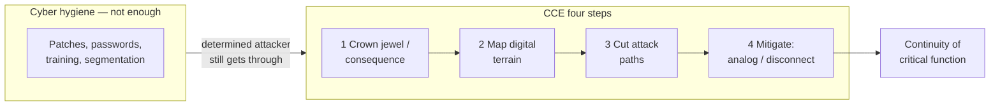

# Lecture T17: Cybersecurity Policy — Part 03

**Playlist index:** 17  
**Transcript:** [17-cybersecurity-policy-part-03.md](../../transcripts/markdown/17-cybersecurity-policy-part-03.md)  
**Video:** https://www.youtube.com/watch?v=MZlDHGdqm3w  
**Week / theme:** Week 5 — Cybersecurity policy (HBR “internet insecurity”; critical infrastructure)

## Learning objectives
- Restate the article’s claim: **spending on cyber defense does not guarantee** you will be shielded.
- Define **critical infrastructure** as the lecture’s student group used it, and why coupling across sectors raises consequence.
- Contrast **cyber hygiene** with what a **determined attacker** can still do.
- Use Idaho National Laboratory’s **CCE** and **CIE** as a policy-relevant alternative to “buy more tools.”
- Carry forward the sentence the instructor underlines at the end: **any system connected to the internet is not secure.**

## What this lecture actually teaches

This session is **Group 3’s presentation** of a Harvard Business Review article on **internet insecurity** (not “internet security”). The instructor’s wrap at the end is short and is treated as the course’s takeaway. The next class is the sequel case **Protecting the Cheddar**.

### The article’s opening bet
Traditional answer: spend on cyber-intensive resources. The article’s question: does investing in the latest cyber defense **guarantee** success against malware? **No.** No amount of spending **guarantees** a shield. A different approach to cyber **defense** is required.

Statistics the group used (to motivate the bet, not as a formula sheet):
- Jump in attacks from 2021 to 2022 in regions including USA / North America and Latin America.
- **Most attacked industries in 2022:** government, healthcare, education, and specifically **critical infrastructures**.
- Global volume in **Q4 2022:** about **1,168 attacks per week** on average.
- Global cybersecurity spending projected about **$460 billion by 2025**, growing ~**15%** a year; Kaspersky-cited spend crossing **$300 billion** in 2022; cumulative **2021–2025** about **$1.5 trillion**.

### What “critical infrastructure” means here
Sectors named: **energy / power plants**, **telecommunication**, some **manufacturing**, **transportation**, **water treatment**. Complexity is growing because these used to be **decoupled** and now form **networks of connected devices** (grids). Example: battery vehicles need charging stations **on the grid**; telecom ties into energy and smart grids. **If one critical infrastructure fails, a chain reaction can take the system down.**

### Attacks on critical infrastructure (as presented)
- **Saudi Aramco:** 2012 **Shamoon** — passwords stolen, **>35,000** systems, data wiped, machines prevented from rebooting, **2–3 weeks** to restart; 2017 attack on a **safety controller** that stopped working and shut the system down; **July 2021** extortion via a **third-party contractor**, **$50 million** demand.
- **RedEcho** malware described as Chinese targeting of the **Indian power grid**.
- South Korean **nuclear** plant (named as a news item).
- **Ukrainian power grid**, including April 2022 during the Russia–Ukraine war: Russian agencies targeting large energy companies to trigger a **blackout** so invasion would be easier; Ukraine “narrowly escaped.”

### Capability versus vulnerability
Industrial control is absorbing **IoT, AI/ML, cloud**. Decision-making is faster; firms handle **terabytes** of data; “data is the new oil.” The same digital transformation that is “indispensable” makes the system **fragile**.

COVID and competition push every industry toward digital tools (automation, IoT, cloud) so employees can be effective. **Vulnerabilities grow at the same rate as capabilities.** Vendors may **not know** the vulnerabilities in new hardware/software. US companies’ information systems were cited as taking **more than 200 days on average** even to **detect** a threat; sometimes a **third party** notifies them.

The cost story: firms digitize to cut labor and error, then spend again on cybersecurity — **cost comes back in as cyber risk**.

### Cyber hygiene — useful, not sufficient
Analogy: seeing a doctor, sanitizing in COVID. **Cyber hygiene** = checking security of data, users, networks. Advanced performance monitoring can scan the IT environment, list assets and vulnerabilities, and produce a **scorecard** (critical / high / medium / low).

Regular practices named: latest software/hardware; employee training; **separating** important information systems from other networks; **complex monthly passwords**; **security patches**; limited access (not everyone sees everything).

**Limits the group stressed:**
- Millions spent still does not stop a **targeted** attack.
- You often **cannot** build a comprehensive inventory in **asset-intensive** industries (transport, energy).
- A large power station’s **dispersed substations**: an upgrade/rollout path can become the path that **collapses the whole grid** if an attacker is on that network.

Conclusion they draw from the article: you cannot avoid attacks by investing in technology alone. One remaining move is to **reduce dependence on digital platforms** for the most sensitive functions.

### Andrew Bochman and Idaho National Laboratory
Author: **Andrew (Andy) Bochman**, senior grid strategist at **Idaho National Laboratory (INL)**; ex-Air Force; IBM and other firms; advises governments and industry. The HBR piece points to his book (shown on the slide, not quoted here).

Headline move: stop talking as if the problem were **cybersecurity**; treat it as **cyber insecurity**. **No system connected to a digital platform is secure**, no matter how many firewalls or detection systems you buy. Aim: **redundancy so critical functions continue even if you are attacked.**

Two related frameworks:

| Framework | Where it sits in the talk |
|-----------|---------------------------|
| **CCE** — Consequence-Driven Cyber-Informed Engineering | Higher / broader: national-security-scale, well-resourced / **state-sponsored** threats. Change how the **hierarchy** perceives cyber threat. |
| **CIE** — Cyber-Informed Engineering | Companion, slightly lower: **cyber-physical / targeted IS** attacks. Bake cyber-risk mitigation into **concept, design, and production**, not after the boiler is already on a digital control system. |

Both refuse the idea that you must **do away with automation**. Both insist on **redundancy, contingency, continuity**. Engineers already think in **modes of failure**; **cyber attack should be one of those modes from the start**. INL treats this as a **philosophy**, not a recipe you sprinkle on after install. Curriculum and traditional engineering often leave cyber as an **afterthought** (then “put a firewall and IDS on it”).

**CCE four-step process** (also restated as “crown jewel” language):

1. **Consequence prioritization** — the greatest loss / most critical function that would jeopardize the whole firm or mission (**identify the crown jewel**).
2. **System-wide analysis / map the digital terrain** — pathways that can produce that consequence; who would target them and from where.
3. **Eliminate likely attack paths** to that consequence.
4. **Mitigation / protection** — as far as possible **analog** or **disconnect from digitalization** so the critical function still runs.

Who was supposed to run CCE: first INL people, then INL-trained people in firms — aimed at **CEOs, CFOs, regulatory/litigation owners, critical supervisors, safety experts, operators, first responders**.

**Wargame** with the people who own risk: each says what is most critical in their domain; you converge on one or a few consequences.

Hygiene still matters, but a **determined, resourced attacker** will **eventually get through**. Hygiene was said to stop only about **10–15%** of attacks in the article’s telling. Need a **cyber safety culture** so a first responder treats a small glitch/trip as the start of a campaign, not as noise.

**Air gap:** keep the **redundant** system off the internet. If the backup is also connected, the contingency plan fails in the same incident.

Cost: **higher cost initially** versus the “potentially devastating price of business as usual.”

### Instructor close
The article is an introduction to modern concerns. The author’s disturbing statement: **any system that is connected to the internet is not secure.** The practical sequel is **Protecting the Cheddar**, next class.

## Cases and examples from the lecture
- **Saudi Aramco** Shamoon (2012), safety-controller shutdown (2017), contractor extortion (2021, $50M).
- **RedEcho** and the Indian power grid; South Korean nuclear plant; **Ukrainian grid** 2022 blackout attempt.
- **EV charging / smart grids** as coupling that turns one failure into a cascade.
- **200+ days** to detect in cited US information systems.
- **INL / Bochman:** CCE vs CIE; crown-jewel analysis; analog / air-gapped redundancy.
- Handoff to **Protecting the Cheddar** (manufacturing / IoT sequel).

## Key terms
| Term | Meaning in this lecture |
|------|-------------------------|
| Internet insecurity | Article’s frame: connected systems are not secure; “cybersecurity spend” is the wrong guarantee |
| Critical infrastructure | Energy, telecom, critical manufacturing, transport, water; now interdependent grids |
| Cyber hygiene | Routine scanning, patching, training, segmentation, password discipline — necessary, not sufficient |
| CCE | Consequence-Driven Cyber-Informed Engineering — start from worst consequence, then cut digital paths |
| CIE | Cyber-Informed Engineering — include cyber as a failure mode from conceptual design |
| Crown jewel | The function whose loss jeopardizes the whole operation |
| Air gap | Keep the redundant / critical path off the internet so backup is not hit with the primary |

## Formulas / frameworks (if any)
**CCE process:** consequence (crown jewel) → map digital terrain → eliminate attack paths → mitigation (reduce digital pathways, analog, contingency).

**CIE vs CCE:** same philosophy; CCE aimed at high-end / state-scale consequence, CIE at engineering-in of cyber during design for cyber-physical systems.

## Distinctions the instructor insists on
- The series title is **insecurity**, not security — that is the point.
- **More spend ≠ guaranteed protection.**
- **Hygiene ≠ survival against a dedicated attacker.**
- **CCE is not “abandon automation.”** It is redundancy and less digital exposure for the crown jewel.
- **Do not air-gap the primary and then network the backup.**
- Cyber should be treated as an engineering **failure mode**, not an IT afterthought (firewall later).
- **Capability and vulnerability rise together** in digital transformation.

## Exam-oriented recap
- Quote-level claim to remember: a system on the internet is **not secure**.
- Critical infrastructure is **coupled**; one failure can cascade.
- Hygiene (patches, training, segmentation) is the floor; INL’s answer is **consequence-first** design and **reduced digital pathways**.
- CCE four steps and the crown-jewel language are the article’s method.
- Next case (**Protecting the Cheddar**) is how this argument looks inside a factory.
