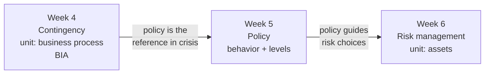

# Lecture T18: Cybersecurity and Privacy — Extended Discussion (live)

**Playlist index:** 18  
**Transcript:** [18-cybersecurity-and-privacy-extended-discussion.md](../../transcripts/markdown/18-cybersecurity-and-privacy-extended-discussion.md)  
**Video:** https://www.youtube.com/watch?v=kZtw4L6LZS8  
**Week / theme:** Week 5 live session — policy as behavior change; BIA named; course arc into risk

## Learning objectives
- Expand **BIA** as asked in chat: **Business Impact Analysis** (Week 4, contingency planning).
- Place **policy** between contingency planning and risk management: policy **guides** risk work.
- Restate policy as the instrument that makes **desired behavior** appear — national, organizational, individual.
- Keep the internet-insecurity claim in decision language: **what you connect and what you don’t**, once you accept that connected systems are insecure.
- Know the Week 5 reading the instructor actually assigned (textbook chapter and the HBR article).

## What this lecture actually teaches

This is a **live Q&A**, not a new slide deck. The instructor answers **course-content** questions and refuses to re-litigate platform rules every week. Platform logistics (assignment misses, certificate rules, how NPTEL will or will not supply PDFs/textbooks) are **out of scope for these notes**.

### What kind of course this is (needed to interpret the materials)
It is a **postgraduate** course, not a typical UG “explain the textbook with extra examples” course. At PG/PhD level the class is **more than the textbook**; reading the book is the student’s job. That is why the course uses **journal articles** and **Harvard Business School cases** — to keep concepts in contact with practice. The live session does not re-teach Live Session 1’s tips on **how** to get those readings.

### BIA — the definition given in this session
Chat: “What is the full form of BIA?”

Answer given here: it relates to **Week 4 contingency planning** — **Business Impact Analysis**. He tells students to **read the textbook** and the chapters already flagged in live interactions. He does **not** re-derive MTD/RTO/RPO in this video. For this live session, **BIA = Business Impact Analysis**.

### Week 5 reading he actually names
- Textbook **Chapter 4**, pages **177–213**: information security policy.
- Lecture + PowerPoints: what policy is and **levels of policy**.
- Additional article: HBR **“Internet Insecurity”** / **“the end of cyber security.”** Access it yourself (method pointed to in Live Interaction 1).

### Policy operates at different levels of abstraction
What changes across the stack is **abstraction**. At organizational level, policy statements connect to **priorities and strategy**. At procedural level the same policy is **embedded in rules**, including **firewall configuration**. It **percolates from the top**: a policy gets implemented at a **rule** level. That is the idea already in the course videos.

### Why the weeks sit in this order
Someone complained that lectures “enter abruptly.” Without a specific timestamp he cannot debug the complaint. He instead teaches the **arc**:

| Week | Theme | What it is for |
|------|--------|----------------|
| 4 | Contingency planning — incident response, disaster recovery, business continuity | Planning for when protection **fails** |
| 5 | **Policy** | The document that **guides** (including later risk management) |
| 6 | **Risk management** | Another kind of plan: planning **to manage risk** |

**iPremier** (Harvard, denial-of-service) is not a random extra video. It is the Week 4 case: an organization **unprepared** to face an incident, people blaming each other while the clock ticks. Contingency planning asks what they should have done **before, during, and after**. Look at the **week’s theme**, then see how the pieces connect.

### Policy as behavior change
Week 5 first spends slides on **why policy matters**. **In the absence of policy, the desired behavior will not evolve.** If you want a desired behavior from an organization or an individual, **policy plus implementation** is what brings it. If **security compliance** is the behavior you expect from people, there must be a policy, it must be **communicated**, and it must be **implemented** — otherwise people will not comply. That is the effort of the policy week, with real-life examples, plus the **internet insecurity** article (the opposite of “security”).

The article is there to push an **informed policy**, especially around **critical infrastructure**.

### Critical infrastructure — “specific meaning”
An industry talk is coming in about two weeks. Examples he gives **for a country:** **health**, **energy**, **finance and banking**. **Inside an organization** you can also identify critical infrastructure. **Unless you know what is critical, you will not prioritize.** Once A/B/C are critical, have you actually planned security **in the era of the internet**?

The author’s observation, repeated: **any system connected to the internet is insecure.** Decision problem: **what do you connect and what don’t you?** Disconnecting costs **output, efficiency, convenience** — it can feel like turning the clock back to a no-internet era. That is a **decision-making** problem, not a slogan.

Week 6 will make this concrete with a **manufacturing company implementing IoT** and walking into **cyber insecurity** (the Cheddar / industrial case sequence).

So the designed sequence is: **contingencies → importance of policy → risk management**.

### Other content questions (kept; logistics dropped)
- **Data owners / data custodians:** already clarified in the **previous week**; watch those videos before re-asking. This session does **not** re-define the pair.
- **How to control smart cars:** internet-connected cars. Same doctrine: connected ⇒ **not fully secure**. There is **no panacea**. “Don’t use smart cars” is the conservative answer, like “don’t use cars if you fear accidents.” If the real question is how to use them **and** be secure, **wait for Week 6** (IoT sensors and controllers in industry — similar threat shape, a broad approach in that case discussion).
- **Career path / CEH, OSCP, CISSP-type certifications:** this offering is an **academic course** (concepts, frameworks, application), **not skill training** and not a substitute for those certificates. Technical certificates vs management-oriented **ISO/NIST** training depend on the job you want. Instructor has **not** personally done an ethical-hacking program; awareness-level only. Practical advice given: talk to people who completed the program (**LinkedIn**). **ISACA** named as a global industry body whose training is valuable and CV-relevant; **PMI** another body; **ISO** does not train directly but other organizations train to ISO cybersecurity standards.

Closing professional habit: before subjective opinions, **the first document you should ask for is the policy.** That matters beyond cybersecurity.

## Cases and examples from the lecture
- **iPremier** DoS case as the planned close of contingency week (unprepared incident).
- **HBR internet insecurity** as required Week 5 reading, not an abrupt extra.
- **Critical infrastructure** examples: health, energy, finance/banking (national); identify the equivalent inside a firm.
- **Smart cars** as internet-connected devices with no single “medicine.”
- Forthcoming **manufacturing + IoT** case as the insecurity sequel.

## Key terms
| Term | Meaning in this lecture |
|------|-------------------------|
| BIA | **Business Impact Analysis** — Week 4 contingency-planning assessment (full form as given in this live session) |
| Policy (behavior) | The document **and its implementation** that produce desired (including compliant) behavior |
| Levels of policy | Same intent at different abstraction: strategy/priorities down to firewall rules |
| Critical infrastructure | What must keep running for a country or a firm (health, energy, finance named) |
| Internet insecurity | Connected ⇒ insecure; policy is choosing what stays on the network |

## Formulas / frameworks (if any)
Course sequence as a framework: **contingency planning (BIA, IR/DR/BCP) → policy (guides) → risk management**.

Policy stack reminder: high abstraction (organization strategy) **percolates** to low abstraction (configuration rules).

## Distinctions the instructor insists on
- **Content questions vs platform rules.** This session is for the former.
- **PG class ≠ UG textbook recitation.** Cases and HBR are mandatory advanced material, not decoration.
- **iPremier is not a topic change**; it is contingency planning in a real incident.
- **Policy on paper is not behavior change** unless communicated and implemented.
- **Disconnecting from the internet is not free** — you trade efficiency for a smaller attack surface.
- This course is **knowledge / concepts**, not CEH-style skill training.
- **BIA** in this Q&A is the **name** of the Week 4 analysis, not a new formula lecture.

## Exam-oriented recap
- **BIA = Business Impact Analysis** (contingency planning, Week 4).
- Policy week sits **between** contingency and risk because policy is the reference that **guides** risk management.
- Desired security behavior does not “evolve” without policy that is **known and implemented**.
- Critical infrastructure must be **identified** before it can be prioritized; connected infrastructure is **insecure** by the article’s observation.
- First professional question: **what is the policy?**
