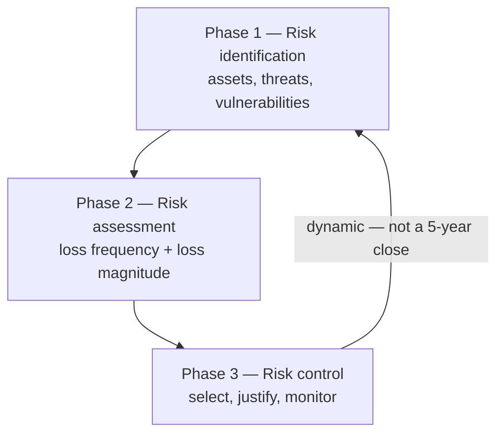

# Lecture T19: Risk Management — Part 01

**Playlist index:** 19  
**Transcript:** [19-risk-management-part-01.md](../../transcripts/markdown/19-risk-management-part-01.md)  
**Video:** https://www.youtube.com/watch?v=v7KtPLhSMkU  
**Week / theme:** Week 6 — Risk management (know yourself: assets; three phases)

## Learning objectives
- Contrast **contingency planning** (reactive; unit = **business process**) with **risk management** (preventive; unit = **assets**).
- State risk management as **identifying, assessing, and reducing** risk — **not eliminating** it.
- Use Sun Tzu’s pair **know the enemy / know yourself** as the frame for threats vs assets and preparedness.
- Explain **residual risk** as leftover risk after base safeguards, extra safeguards, and remaining vulnerabilities.
- Walk **risk identification**: six asset categories, tagging/database, classification, and **business-impact** valuation (not purchase price).

## What this lecture actually teaches

### Two kinds of cybersecurity planning
Management of cybersecurity is the course’s focus. **Planning is the heart of management.** Two categories:

| | Contingency planning (already done) | Risk management (this week) |
|--|-------------------------------------|------------------------------|
| Stance | **Reactive** — how you respond when incidents happen | **Preventive** — stop incidents; protect assets |
| Unit of analysis | **Business processes** (what gets hit) | **Assets** (what you protect) |
| If missing | Shock, unpreparedness, revenue and reputation loss | You never measured what to protect |

The differences are **subtle** and he wants them kept.

### Sun Tzu as the philosophy of risk
Sun Tzu (military philosopher, ~500 BCE; still used in strategy):

1. If you **know the enemy and know yourself**, you need not fear a hundred battles.
2. If you know yourself **but not the enemy**, every victory also costs a defeat.
3. If you know **neither**, you succumb in every battle.

**Know yourself** in cybersecurity = your **assets** and **current preparedness**. **Know the enemy** = intelligence on **external (and internal) threats** that could become attacks. “Enemy” is someone aiming to hurt you or create business losses.

### Definition and the three words
**Risk management is the process of identifying, assessing and reducing risk facing an organization.**

- **Identify:** assets that need protection; **threats**; how well prepared you are.
- **Assess:** current protection mechanisms.
- **Reduce:** close gaps; management decides how much to invest and which options. He uses **reducing**, not “eliminate.” **Mitigate** vs **reduce** are **nuanced**; they will return later. In an internet-connected world there is **no 100% security**.

A threat becomes an **attack** when it exploits **residual / leftover vulnerability**. Risk is the overall assessment of **chance that a threat becomes an attack** and **impact if it does**.

### Attack surface (and “vector”)
Term from talks and literature, **not in the textbook**. Useful visualization of **threats and assets together**.

People say **attack surface** and **attack vector** loosely. **Vector** means a construct with **more than one item** (physics: speed is scalar; speed + direction is vector). An attack surface is not “threats alone.” **Threats along with assets** becomes useful. Plot: **Y = types of threats**, **X = assets**. Every attack aims at an asset; affected assets then hit business processes. A manager can see **which threats materialized, which assets were hit, in what sequence**.

**Equifax (2017)** is flagged as a later case: credit bureau, **hundreds of millions** of individual credential/credit records stolen — not an early-IT-era story. Charted surface: **unpatched vulnerability**, **misconfiguration**, assets such as **storage** and **routers**.

### Residual risk before the process model
The purpose of risk management is to assess **residual risk**, not “raw” risk. Any sensible organization already has some protection (“a security post so thieves do not come in”).

Bar-graph layers he walks:

1. **Asset value protected by (base) safeguards** — e.g. **Windows** has built-in protection even without extra firewall/antivirus.
2. **Threat reduced by additional safeguards** — antivirus, firewall; how much you **choose to invest**.
3. Remaining **vulnerability** — e.g. **not installing Windows updates/patches**. Many recent attacks exploited missing patches. Regular patching **further reduces** risk.
4. After those three, what is left is **residual risk**. **Residue = leftover.**

Identifying and assessing, in this course, are essentially about measuring that leftover.

### Three phases
He repeats a management line: **you cannot manage unless you measure.**

**Phase 1 identification:** know what you have. Identify each **cyber asset**, threats that can impact it, current protection, **existing vulnerabilities**.

**Phase 2 assessment:** two measures for residual risk — **loss frequency** and **loss magnitude**. He says **estimate**, not “compute.” In class, **“risk” means residual risk**. Loss frequency is **probability-driven** (not every threat is equally likely; a threat must also **get through existing protection** — **likelihood of success**). Loss magnitude is **impact**, and it **differs by asset**. An **e-commerce server** that stops the whole business is not valued as “what we paid for the box”; an office PC used for small work may be low-to-medium. Once both parameters exist you can talk **risk** and **risk acceptability** (an **organizational decision**).

**Phase 3 control:** options, **financial justification**, then **monitor** and keep assessing. **Not** like five-year strategic planning you close. **Dynamic.** Practice questions should go to the **industry guest**, not be saved only for the professor.

### Risk identification in practice — know yourself
Sensible organizations **tag** assets. Educational institutions may not; **DOMS** (his department) does. A tag is an **identifier** plus descriptive information. Best store this in an **asset database** (ID as primary key).

**Six asset categories** in the table (cyber context): **people, procedures, data/databases, software, hardware, networking components.** People **are** assets — **cyber bullying** (named as Binod’s research topic) is an attack on an individual. **Policy** is listed among what you have to protect (procedures/policy as assets). Maturity of the IT organization affects how complete the inventory is.

Typical IT-asset attributes: name, IP, MAC, type, serial, manufacturer, etc.

People/procedures/data also need IDs: HR **employee ID / roll number**; ISO-style **procedure numbers**. People attributes include **security clearance** (authorization level: confidential / secret / top secret in military language). Data attributes: **owner, creator, size, online vs offline**. Procedures: purpose, where stored.

### Data classification
Information security cares about **sensitivity classes**, parallel to people’s clearance.

**Business example (four levels):** public; for official use; sensitive; classified. Clearance is defined against those classes.

**US military (classroom discussion):** unclassified (base; accessible); **sensitive but unclassified** (restricted to some extent / limited people); restricted; confidential (access clearly defined); secret (fewer people, level-defined); **top secret** (president / prime minister / commander-in-chief type access). Unclassified and “sensitive” are **not** the same.

### Assessing asset **value** (identification sliding into assessment)
Value is **not purchase price**. It is **impact on business**. Some assets are **critical** to running the business; some are important but not critical.

Usually an **instrument / questionnaire** plus **expert** input. Typical items: which information asset is most **critical to success**; generates most **revenue**; highest **profitability**; most expensive to **replace**; most expensive to **protect**; would cause highest **liability**. Think a **1–5** scale per item.

**Textbook numerical example:** older **EDI** (electronic data interchange) world. Assets include EDI document sets. Three criteria: **impact on revenue, impact on profitability, impact on public image**. Each criterion weighted; score **1–100**. One asset hits **100**: **customer order via SSL** — if customers cannot place orders, **business stops**.

## Cases and examples from the lecture
- **Sun Tzu** three statements as the RM philosophy.
- **Windows** built-in protection vs extra AV/firewall vs **missing patches** as vulnerability.
- **Equifax 2017** attack-surface sketch (unpatched, misconfiguration; storage/routers); full case later.
- **E-commerce server** vs **office PC** for loss magnitude.
- **DOMS asset tags** vs untagged classroom kit.
- **Cyber bullying** as attack on a **person-asset**.
- **US military classification** walkthrough with students.
- **EDI / customer order via SSL = 100** weighted score.

## Key terms
| Term | Meaning in this lecture |
|------|-------------------------|
| Risk management | Identify, assess, **reduce** risk to cyber assets (not eliminate) |
| Know yourself | Assets + current preparedness |
| Know the enemy | Threat intelligence (internal and external) |
| Attack | Threat that has exploited leftover vulnerability |
| Attack surface | Two-dimensional view: threats × assets (sometimes loosely called vector) |
| Residual risk | Leftover risk after base safeguards, extra safeguards, and remaining vulnerabilities |
| Loss frequency | Probability-side measure (introduced here; formula next lecture) |
| Loss magnitude | Impact-side measure; function of **business** value of the asset |
| Asset valuation | Weighted business-impact score, not invoice cost |
| Security clearance | Person’s authorized access class |

## Formulas / frameworks (if any)
**Process:** identification → assessment → control (loop, dynamic).

**Identification contents:** assets + threats + vulnerabilities.

**Assessment targets (named, not yet multiplied):** loss frequency (probability) and loss magnitude (impact).

**Asset value (example):** weighted combination of revenue, profitability, and public-image impact; 1–100.

## Distinctions the instructor insists on
- **Contingency ≠ risk management.** Process unit vs asset unit; reactive vs preventive.
- **Reduce ≠ eliminate.** Internet-connected devices have no 100% guarantee. **Reduce** vs **mitigate** will be nuanced later.
- **Residual risk is what you actually manage**, because some protection already exists.
- **Attack surface is not “list of threats.”** It is threats **with** assets.
- **Vector** implies **more than one dimension** — do not use the word emptily.
- **Asset value ≠ purchase cost.** SSL order channel at 100 is about stopping the business.
- **Unclassified ≠ sensitive-but-unclassified** in the military scheme they discussed.
- Risk management is **not** a five-year plan you finish.

## Exam-oriented recap
- RM = identify, assess, reduce; object is **residual risk**.
- Know yourself (assets, preparedness) and know the enemy (threats).
- Six asset categories include **people and procedures**, not only hardware.
- Classify people and data; value assets with a **business-impact** instrument.
- Next lectures: threats, TVA worksheet, then the residual-risk **formula**.
