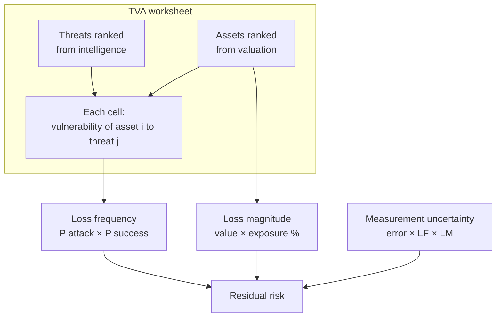
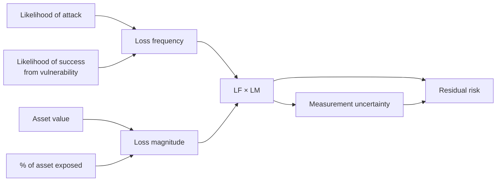

# Lecture T20: Risk Management — Part 02

**Playlist index:** 20  
**Transcript:** [20-risk-management-part-02.md](../../transcripts/markdown/20-risk-management-part-02.md)  
**Video:** https://www.youtube.com/watch?v=WtbyE4GE7Zc  
**Week / theme:** Week 6 — Risk management (threats, TVA, residual-risk formula)

## Learning objectives
- Identify and **classify** threats; treat **threat intelligence** as **external** data.
- Place **vulnerability on the threat–asset pair**, not on “the firm” in the abstract.
- Use the **TVA worksheet** (threat–vulnerability–asset) as the assessment instrument.
- Compute **loss frequency** and **loss magnitude**, then **residual risk**.
- Record the **in-video four-term formula**, the **worked example that dropped current controls**, and the **instructor’s later correction** that removes the mitigated-controls term.

## What this lecture actually teaches

### Threats: identify and assess
There are **hundreds** of cyber threats; the lecture will not walk each one. **Threat intelligence** — what is current, critical, likely, frequent, high-impact — is **dynamic**. It is **not** in the professor’s head or the textbook. Practicing managers **subscribe**. **CERT** (C-E-R-T) provides some of this; richer feeds need **subscriptions or networks** with cyber-intelligence bodies. A more comprehensive threat list is posted on the module; cases later discuss prevalent ones.

**Classification** is how a manager deals with complexity (same reason marketing uses segments). About **12 categories** are shown. Named in class:

- Acts of **human error or failure**
- Compromises to **intellectual property**
- Deliberate acts of **espionage or trespass**
- **Information extortion** (threaten people; get money or assets)
- **Technological obsolescence** — **yes, this is a threat category**. Running critical business on **Windows 8** and refusing to invest is high cyber risk; case after case of machines left un-updated.

**Espionage (Q&A):** someone **inside** (or who was inside) the organization or country **betrays** it by leaking information. US military examples exist; “serious but higher-level.”

A **Communications of the ACM** paper ranks threat severity. They use a **mean** (from data) and a **weight**, plus a **standard deviation**. **Weighted rank ≈ mean × weight** (weights not fully explained on the slide). Point: threat intelligence **quantitatively scores** threats so they can be **sorted**. Low likelihood/low impact → low score; high/high → high score. You **cannot** produce this table internally the way you value **assets**.

| | Assets | Threats |
|--|--------|---------|
| Where the data lives | **Internal** (questionnaire, experts) | **External** (intelligence bodies) |
| What you do | Identify, classify, value | Identify, classify, rank |

### Vulnerability sits between one threat and one asset
Imagine one axis of assets and one of threats. For **each combination** ask: what is the **vulnerability** of **this** asset to **this** threat? That is **expert/judgment** work: leftover holes vs “are we 100%?” **A vulnerability is with respect to a given asset and a given threat.**

**Example:** vulnerability assessment of a **DMZ router** (technical: a **proxy** / shadow in front of the real server). Take **one** asset, walk **each** threat, describe potential vulnerabilities. Repeat for every asset.

### TVA worksheet
**Threat–vulnerability–asset (TVA) worksheet** — a **spreadsheet**, because each **cell** is two-dimensional. One axis threats, one axis assets (e.g. the DMZ router). First column: vulnerabilities of asset 1 against the listed threats.

Because assets are **rank-ordered** (valuation) and threats are **rank-ordered** (intelligence), the **top / first diagonal** can be the **most critical** cells. In practice this is a **very important instrument**. When you hear “I am vulnerable,” hear: **this asset is vulnerable with respect to threats 1…N**.

### Loss frequency and loss magnitude
These two terms are what you use to **calculate risk**.

**Loss frequency** = assessment of the **likelihood of an attack** combined with the **expected probability of success**. Two probabilities:

1. How likely is the attack? (external intelligence — e.g. DDoS vs phishing today)
2. If it happens, chance of **success** given **current vulnerabilities** (updated malware protection/firewalls ⇒ success probability low)

Without those probability values you only have **qualitative** assessment.

**Loss magnitude** is also called **asset exposure**. The asset may not be **100%** exposed. It **combines the value of the information asset with the percentage of asset lost** in a successful attack. Product: **asset value × percentage affected**.

Usual one-line risk talk is **probability × impact**. This course makes that **loss frequency × loss magnitude**, then does not stop there.

### Residual-risk formula as taught in this video
He presents a “magical” textual formula (no Greek letters):

**Residual risk = (loss frequency × loss magnitude) − (percentage of risk mitigated by current controls) + measurement uncertainty**

Four constituents. **LF × LM** is “one aspect of risk” (probability × impact). Then **minus** risk already mitigated by **current controls**. Then **plus measurement uncertainty**, because LF and LM are **estimates**, often **subjective**, so there is **error**. Uncertainty is added to stay on the **worst case** — step the number **up**, not down.

He then runs a textbook problem **without** a current-controls figure, so that term is treated as **absent / zero**.

### Worked example (e-commerce database)
Given:

- **10%** chance of an attack this year (industry; “one attack in 10 years”) → **0.1**
- If attacked, **50%** chance of success (current vulnerabilities) → **0.5**
- Asset valued at **50** on a **0–100** scale
- **80%** of the asset compromised if success → exposure **0.8**
- Estimates are **75% accurate**
- Current controls: **not mentioned**

Work:

| Piece | Calculation | Value |
|-------|-------------|-------|
| Loss frequency | 0.1 × 0.5 | **0.05** |
| Loss magnitude | 50 × 0.8 | **40** |
| LF × LM | 0.05 × 40 | **2** |
| Current controls | not in the question | **omit / 0** |
| Measurement error | 1 − 0.75 = **25%** | |
| Measurement uncertainty | 0.25 × 2 | **0.5** |
| Residual risk | 2 + 0.5 | **2.5** |

He is explicit: the **2** may **under-represent** risk, so **0.5** is added. Real estimation is hard; **practice is often qualitative**. Ask the practitioner how they actually fill a TVA sheet.

Risk **control / mitigation** (options, monitoring) is **phase 3**, next class. This video overran into the case slot.

### Instructor correction (removing the mitigated-controls term)
The four-term formula **confused the class**. In a later live session the instructor **corrects** the video formula and notes that a **newer textbook edition also dropped** “minus percentage of risk mitigated by current controls.”

Reason he gives: if LF and LM are already estimated **with current controls in place**, subtracting “mitigated by current controls” **double-counts**. Extra controls **after** assessment could be subtracted in a very fine-grained model, but that is not how the example works, and it is not needed for this course.

**Exam-facing formula after the correction:**

**Residual risk = (loss frequency × loss magnitude) + measurement uncertainty**

where **measurement uncertainty = (1 − accuracy) × (LF × LM)** in the textbook problem style.

Dropped term (video only, later removed): **− % risk mitigated by current controls**.

## Cases and examples from the lecture
- **Windows 8** left in production as **technological obsolescence**.
- **Espionage** as insider betrayal; US military cases alluded to.
- **CACM** weighted threat ranking (mean × weight).
- **DMZ router / proxy** as the single-asset, all-threats vulnerability write-up.
- **E-commerce database** residual-risk problem → **2.5**.
- Practice: quantitative TVA is the ideal; qualitative is common.

## Key terms
| Term | Meaning in this lecture |
|------|-------------------------|
| Threat intelligence | External, subscribed, dynamic scoring of threats |
| Espionage | Insider (or former insider) leaking against the organization/country |
| Technological obsolescence | A threat class: running critical work on un-updated platforms |
| Vulnerability | Gap **for a specific asset against a specific threat** |
| TVA worksheet | Spreadsheet of threats × assets with vulnerability in each cell |
| Loss frequency | P(attack) × P(success) |
| Loss magnitude / exposure | Asset value × % lost in a successful attack |
| Measurement uncertainty | Worst-case add-on from estimate error |
| Residual risk | Leftover risk after you have combined LF, LM, (and originally current controls,) plus uncertainty |

## Formulas / frameworks (if any)

**Loss frequency** = (chance of attack) × (probability of success)

**Loss magnitude** = (asset value) × (percentage of asset compromised)

**Video formula:** residual risk = (LF × LM) − (risk mitigated by current controls) + measurement uncertainty

**Corrected / exam formula:** residual risk = (LF × LM) + measurement uncertainty

**This problem’s uncertainty:** (1 − 0.75) × (LF × LM) = 0.25 × 2 = 0.5; residual risk = **2.5**

## Distinctions the instructor insists on
- **Asset valuation is internal; threat intelligence is external.**
- **Vulnerability is not a free-floating property of the company.** It is a **cell** in TVA.
- **Likelihood of attack ≠ likelihood of success.** Frequency uses **both**.
- **Exposure is not always 100%** of asset value.
- **LF × LM is not the whole residual-risk story** until you add **measurement uncertainty** (worst case).
- **Minus current controls** was taught, then **removed**: do not treat that subtraction as the working formula after the correction; controls are already inside success-probability / vulnerability if assessment is done in place.
- Quantitative is the textbook method; **qualitative is what many shops actually do** because the numbers are hard.

## Exam-oriented recap
- TVA: threats on one axis, assets on the other, vulnerability in the cell; sort so the **diagonal** is hottest.
- LF = 0.1 × 0.5 = 0.05; LM = 50 × 0.8 = 40; product = 2; +25% uncertainty = **2.5**.
- Remember the **correction**: residual risk = **LF × LM + measurement uncertainty** (no mitigated-controls term).
- Next: what the organization **does** with those numbers (control).
