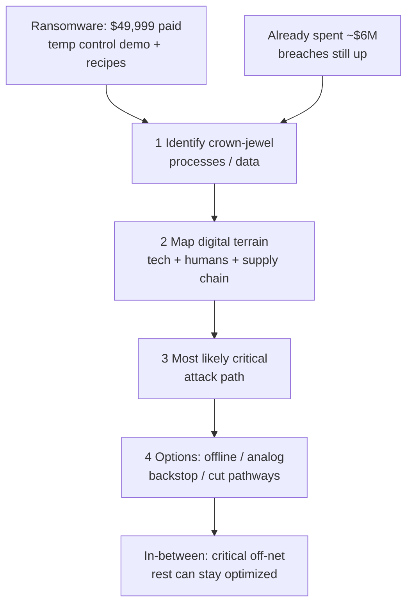

# Lecture T21: Risk Management — Part 03

**Playlist index:** 21  
**Transcript:** [21-risk-management-part-03.md](../../transcripts/markdown/21-risk-management-part-03.md)  
**Video:** https://www.youtube.com/watch?v=2TsAnaO75ck  
**Week / theme:** Week 6 — Risk management (Protecting the Cheddar; CCE in a factory)

## Learning objectives
- Apply the **internet-insecurity / CCE** argument to an industrial plant, not only to “IT.”
- Reconstruct **Protecting the Cheddar** (Newhouse Cheese): ransomware, recipes, temperature control, $6 million already spent.
- Use the consultant’s **four-step** plan as the same crown-jewel method as CCE.
- Hold the class debate: **full rollback vs in-between** (critical functions off the open digital path).
- Hear the instructor’s stakes: **listeria / lives**, **ransomware-as-a-service**, **WannaCry / NotPetya**, and Industry 4.0 / IoT.

## What this lecture actually teaches

Group 4 (including Colonel Jagvir, Prasad Deshmukh, Sanjay Prasanna) presents the case **Protecting the Cheddar**. It is the **sequel** to the HBR insecurity article. Formal “risk control options” from the textbook process are **not** the spine of this video; the case **is**. An industry guest is promised next for practice insight.

### Newhouse Cheese Company
- **1811:** Cole Newhouse emigrates from **Wales**, founds the cheese company.
- Survives the **Great Depression** by tying up with supermarkets; tagline **“From Wales with love.”**
- Early **2000s:** fifth generation **Chadwick “Chad” Newhouse** (CEO) invests heavily in **digitization of precision control** monitors and devices.

**People in the room:**

| Person | Role |
|--------|------|
| Chadwick Robert Newhouse (Chad) | CEO |
| Frank Armen | CISO |
| Bruce Boyle | CFO |
| Jenny Cruickshank | (named among top executives) |
| Sara | Deputy to the CEO |
| Jack Parem | Cybersecurity consultant |

### The opening incident
Chad has just wired **$49,999** to an unknown person. The company is in a **ransomware** attack. Hackers showed they could **shut down a temperature-control critical device** and claim access to **sensitive recipe files**. On **legal advice**, the CEO **paid**.

Crisis meeting: Chad is furious; executives avoid eye contact. Suggestions from the table: buy **new intrusion monitoring**, raise budget, review **incident-response protocol** because **SEC** will “come knocking.” Ask: how much already spent on “the system”? **About $6 million.** Breaches have **still increased**. Uncomfortable silence.

**Sara**, from the back: **why are the systems even online?** Shouldn’t family recipes be **locked up on paper**? Why digitize pasteurization equipment? She briefs a **new risk-management process** she had read: **overly complicated software** and **anywhere/anytime access** to critical systems make firms more vulnerable. Many consultants: **put humans back in** and **reduce digitization**.

### Three weeks later — the plant tour
Chad, Frank, Sara, and Jack at a workstation. Sensors on tanks send **real-time** data: impurities, **temperature**, **bacteria**. “Saved us millions.” **Networked**, otherwise you must stand there in person. Alerts when something is out of order — “crucial to cost savings.” **Who has access?** “Anyone with a login”; usually two or three people, mostly Chad; he even logged in **from a hotel**.

Jack spends three weeks on the factory. **Four-step plan** (same shape as INL CCE):

1. **Identify the most critical information and processes** — walk each process, talk to stakeholders.
2. **Map the digital terrain** those processes sit on — hardware, software, **network structure**, **how humans interact**, **supply chain**.
3. From (1) and (2), identify the **most critical, likely attack path** (criticality × openness). **Called the most important step.**
4. **Generate options** for that likely, critical attack.

The exercise exhausts the executives: they see **how deep** they have sunk into digital networks.

### Three points of failure (consultant)
Sorted into three outcomes:

1. **Four pathways** into the network; a hacker can reach **industrial control systems**.
2. One system **compromised by a bot**.
3. (Grouped with the above in the presentation as three findings / categories.)

**Recommendations:**
- **Thermization** process: take it **completely offline**.
- **Networked temperature controls / automated temperature adjustments:** **remove**, or **keep but backstop with human / manual controls**.
- His **penetration test**: he could take **access-control / control systems** and reach **all recipes** — the shock to Chad, because recipes hit the **bottom line**.

### The heated debate
**CFO Bruce:** the whole point of going digital was to **save money**; going offline would **kill the bottom line**.

**Jack:** not “back to the Stone Age” — **reduce digital pathways**, the most likely **vectors**.

**Frank:** you want to roll the business back **20 years** for a **one-in-a-million** chance.

**Jack’s line the group highlights:** he came because of ransomware, but **ransomware does not scare him — listeria does.** Recent health-hazard catastrophes from companies that fail process control. If industrial controls are wrong, you ship food that can **kill**.

### Ransomware sidebar
Attacker builds ransomware or **buys** it. **RaaS — ransomware as a service** — a **business model** selling the software to criminals. Then social engineering, encrypt IT and data, demand money, sometimes in **cryptocurrency**.

### Should Chad implement the consultant’s recommendation?
The consultant is **not** “move all digitization back 20 years.” It is an **in-between**: take the **most critical parts of the value chain off the digital environment**; keep some optimization.

Class responses:
- Go that way: identify critical assets, **move them offline**.
- Matches **Cyber-Informed Engineering**: critical systems need a mapped **contingency**; keep them **out of the digital connectivity loop**.
- Another student: **not** completely offline — sensors still useful for **IoT / predictive maintenance** and long-term efficiency. Identify **critical** aspects and take **those** offline or restrict to a **local** environment.

**Instructor challenge:** if you roll back to **manual** temperature control, you re-import **human error** — the original reason for automation. Humans created problems in the analog plant **and** in the digital one. Is “going back” the solution?

Group’s mixed-system **pros:** isolation of critical systems (least damage); **least privilege / compartmentalization** so one access is not the whole plant; production may continue on **manual parallel** paths; recipes **more secure offline**; less unauthorized access.

**Cons:** **sunk cost** of automation already spent; **investor/public trust** if they hear “we went backward”; **hiring and training** faithful skilled people; **hindrance** while standing up the parallel system.

### Instructor close
The case is **industrial automation / IoT / Industry 4.0**: real pluses and risk that is not only **financial** but **loss of lives** (**listeria** — composition of a food product off standard).

Ransomware is a **high** present threat in **industrial controls**, including **national-level** operations:
- **WannaCry** — reports often point to **North Korea**.
- **NotPetya** — attributed in reports to **Russia**. Encrypted machines, asked ransom, **did not release even after payment** — “killing your systems.” Newhouse’s $49,999-and-release story is the **optimistic** variant.

Solutions are **still evolving**. Next session: someone from **industry**.

## Cases and examples from the lecture
- **Protecting the Cheddar / Newhouse Cheese** (full plot above).
- Hotel login to plant ICS as “anywhere/anytime” access.
- Pentest reaching **family recipes**.
- **Listeria** as the consequence that outranks ransomware in Jack’s argument.
- **RaaS** market for ransomware.
- **WannaCry** and **NotPetya** as country-scale ransomware; NotPetya as payment-does-not-unlock.
- Link back to **CCE / CIE** from the HBR presentation.

## Key terms
| Term | Meaning in this lecture |
|------|-------------------------|
| Protecting the Cheddar | HBS-style case: cheese manufacturer, ransomware, digitized process control |
| Thermization | Process Jack wants **completely offline** |
| Digital terrain | Hardware, software, network, human interaction, supply chain around a process |
| RaaS | Ransomware as a service — criminals buy the tool |
| Listeria | Food-safety catastrophe if temperature/composition controls are subverted |
| Least privilege / compartmentalization | Mixed-system argument: a breach should not see the whole plant |
| Sunk cost | Digitization money already spent; not a reason the consultant accepts to stay fully online |

## Formulas / frameworks (if any)
**Four-step plant review = CCE in operational clothes:** critical functions → map digital terrain → likely path → options (offline / manual backstop / fewer pathways).

No new residual-risk arithmetic in this video.

## Distinctions the instructor insists on
- **Paying $6 million for tools ≠ fewer breaches.** Same lesson as the HBR spend charts.
- **Jack is not selling the Stone Age.** He is selling **fewer digital pathways** to crown jewels.
- **Ransomware scare vs listeria:** in food ICS, **integrity of the process** can be a **life** issue, not only an IT issue.
- **Manual control ≠ automatically safer** — human error was why they automated.
- **NotPetya ≠ “pay and recover.”** Payment may not restore the machines.
- Industry 4.0 gains and this class of risk **arrive together**.

## Exam-oriented recap
- Cheddar storyline: pay **$49,999**, $6M already spent, recipes + temperature ICS, consultant maps terrain and pulls **critical** processes toward **offline / human backstop**.
- Four steps to memorize with CCE: crown jewel, digital terrain, likely path, mitigation options.
- Class/instructor landing zone: **in-between**, not total disconnect and not “business as usual online.”
- Ransomware (including RaaS, WannaCry, NotPetya) is **high** in threat intelligence for industrial control; consequence can be **lives**, not only coins.
- Formal **risk-control menu** is deferred; **industry session** is next.
