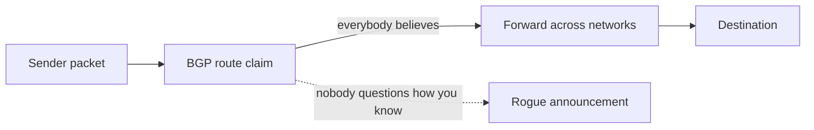
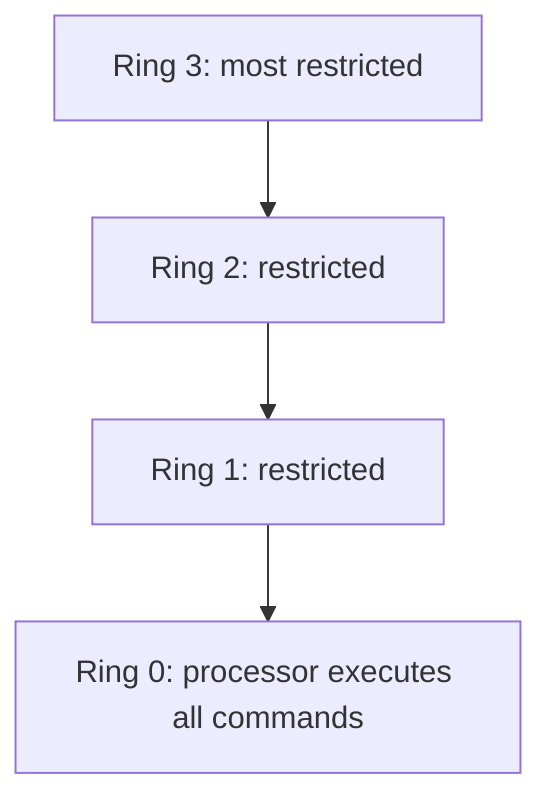
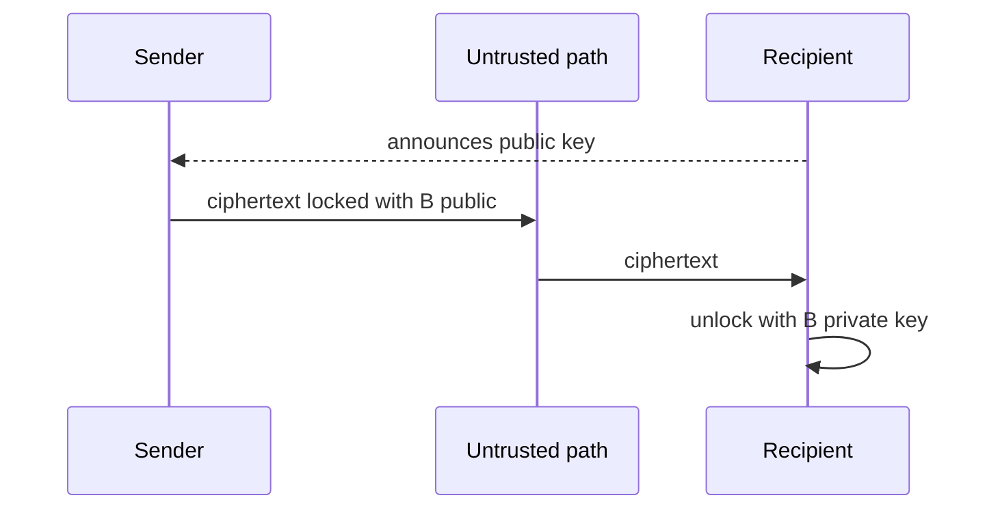
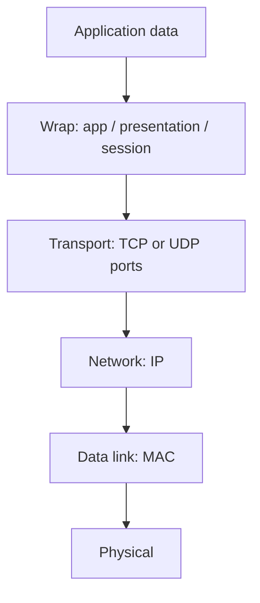
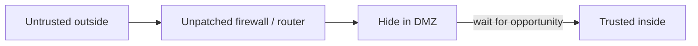

# Lecture T22: Industry Perspective — Part 01

**Playlist index:** 22  
**Transcript:** [22-industry-perspective-part-01.md](../../transcripts/markdown/22-industry-perspective-part-01.md)  
**Video:** https://www.youtube.com/watch?v=F5KwJEVGIxg  
**Week / theme:** Industry exposure — why cyberspace is hard to secure; OS/rings, cryptography, OSI/TCP-UDP, access control, firewalls, DMZ, espionage vs network breach

## Learning objectives

- Explain why a cooperative, trust-based internet makes security structurally hard.
- State the five principles the guest uses for a working cybersecurity system (CIA plus accountability and auditability).
- Describe operating-system rings, symmetric vs public–private cryptography, and hash functions as taught.
- Trace how a packet is unwrapped (MAC → IP → port → application) and why TCP and UDP differ.
- Sketch a corporate perimeter (firewall layers, DMZ, proxy) and the two routes an attacker actually uses.

## What this lecture actually teaches

This is an industry session on **cybersecurity threats, solutions and challenges**. The guest will leave the slide order if the room is talking. The point is realistic problems with realistic solutions, including for students without a technical background.

### Why “truly secure” is a joke

The opening quote: the only system that is truly secure is switched off, unplugged, locked in a titanium safe, buried in a concrete bunker, surrounded by nerve gas and highly paid armed guards — and even then the speaker would not stake a life on it.

The reason is not “hackers are clever.” It is how cyberspace was built.

### Cyberspace is cooperative by design

Anything connected that can interact — over airwaves or other waves — is **fundamentally designed to be cooperative**. Cyberspace is built on cooperation, coordination, and **trust**.

If you send a packet, the other side is welcome to receive it. TCP, IP, and similar protocols do not first ask the OS “do I want this?” Most protocols still do not validate.

**BGP** is the running example. BGP servers decide how packets move between big networks (India to a company in America, crossing multiple BGP routes). A route announces “I know how to go to America”; everybody believes it. Nobody asks “how do you know?” The guest’s claim: **the biggest cyber attacks happen by BGP routes.** That is the type of trust embedded in the network.

If trust is at the root of everything, and everybody is assumed nice, **how do you catch rogues?** That is “the route of all the challenges in cyberspace.”

### Definition and five principles

Cybersecurity is a body of **technologies, processes and practices** involved in protecting individuals and organizations from cyber crime originally, now also **cyber warfare**.

A definition does not illuminate unless it is specific about *what* is protected. The guest uses **five principles**, of which three are the usual triad:

| Principle | Meaning in this lecture |
|-----------|-------------------------|
| **Confidentiality** | Data is given access only to people with rightful access |
| **Integrity** | Data cannot be tampered with; if it is, you will know |
| **Availability** | When you want the data, you always have access |
| **Accountability** | You can identify who made changes |
| **Auditability** | Changes cannot be denied: “you did it at that time” — **non-repudiation** |

When you say a cybersecurity system is in place, you should be able to claim all five.

### Scope: reported crime is the small slice

2021-era projections are shown. Industry experience: such statistics are based on **20–30% of crimes that are actually reported**. A large number of attacks are not reported “for obvious reasons.” Even that slice is staggering.

Why it keeps happening: almost all businesses are moving digital, and **not many thought about security in digital**. Building a house: you first build a compound wall. In digital space it is the opposite — **first the house, then you think of a compound wall.** That is why cybersecurity remains a big issue.

### First cyber attack: Soviet pipeline, logic bomb

Guesses from the room (1970s, 1980s). The story taught: attack on a **Soviet-era pipeline**. Soviets could build pipelines but not the software to control them; they sourced software from a **Canadian company**. Peak of the Cold War. Americans reached the Canadian company, planted a programmer, inserted a **logic bomb**, which triggered and destroyed a pipeline built at huge cost — significant economic impact on Soviet Russia. Now accepted by the Americans too.

Point: **from the beginning, cyberspace was never a space of peace.**

Warfare language: peace vs conflict, and a middle state — **no war, no peace** (constant conflict without declared war). That, the guest says, accurately describes cyberspace today, and it has always been like that.

### Operating system: where the battles are

Without a few concepts, the rest of the class is “significantly impeded.”

An OS is the **interface between the human and the hardware**. Scope: Raspberry Pi to a laptop. Three things: **compute, input devices, output devices**. The human uses inputs; compute talks to devices, does work, shows output. After power-on you interact with the OS; it says the devices are ready.

Double-click feels intuitive; the OS is everywhere and not felt. **All battles are fought in the applications and the operating system space. Nowhere else.**

### Rings: becoming the watchman

To steal location, destroy disk, or steal personal information, the attacker needs **full control**. Approaches include OS-level control. Multiple layers of defense:

- **Kernel** — “the secret room, nobody should enter.”
- **User space** — free to play; crossing into kernel is refused.

Hackers want kernel because: if you become the watchman, can anyone notice you as a thief? Every thief wants the police cap. Attackers **abuse OS powers and hide in plain sight**, pretending to be part of the OS.

Defenses exist in the OS and at **hardware** level. **Not all operating systems use the hardware protections effectively.** Even the then-latest Windows “does not use most of the hardware protections.” That space is still not attended to.

**Rings (hardware concept):**

- **Ring 0:** hardware fully listens; the processor executes all commands you send.
- **Rings 1, 2, 3:** restricted, limited access.
- Kernel / OS largely operates in **ring 1 or ring 0**.

### Cryptography: CIA of the message; why shared keys fail

Cryptography here means **ensuring the CIA of the message** you send: it reaches safely, confidentiality and integrity hold, and it is available to the recipient.

**Home analogy:** siblings share passwords. Distance problem: if you can share the password, you could have used the same channel for the message. The space between you is treated as **compromised**. That is why **shared symmetric encryption will not work** as a complete answer when you cannot meet.

**Symmetric encryption:** both use the **same key**. Further risk: an eavesdropper copies gibberish traffic; later they slap the password out of you and **decrypt the entire history** — complete compromise. These are the World War I / II problems, made critical by **radio waves (open for all)**. **Enigma** is the example; cracking it is “a single reason why the allies have won the war,” and keeping that secret mattered equally.

**Public–private (asymmetric) picture:** two keys — one to lock, one to unlock. You put a message in a trunk, lock it with **the recipient’s public key** (known to everyone, used to lock). Only the recipient has the **private key** to unlock. Everyone announces a public key: encrypt to me with this and only I can read it. Private key stays secret.

### Hash functions

Private keys are generated using **hash functions**. A hash takes any random block and converts it to a sequence of random alphanumerics. Mathematically verified to be **one way**:

1. One unique number for a block; **modify one bit and the whole number changes**.
2. From the number you **cannot reconstruct** the original data.

**MD5** (and similar): a 700 MB file and a 5 MB file still produce a **fixed-length** digest (lecture: 128 characters). Cat-image demo: one missing whisker barely visible, hash output completely different. Forensic use: hash a file you received; match means nobody tampered. Download pages publish an MD5; check after download — mismatch means tampering in transit. One-sided, highly efficient.

### Networking: wrapping, OSI, TCP vs UDP

WhatsApp (call or message) hides many packaging layers. The **OS receives** packets from the network device.

Unwrapping, as taught:

1. **MAC** — is this for my LAN card? (unique to a NIC; **data-link**.)
2. **IP** — is this for my network? (**network layer**; “when we say TCP/IP, IP is the network layer.”)
3. **Port** — unique identifier for a **process** with a network connection (browser, Windows Update, …). **Ports live under the transport layer (TCP).**
4. Further **presentation / application** layers decide user, file, etc.

Each layer resolves further so the packet reaches the right destination. The small message is wrapped many times. Mature model from years of experience: **OSI, 7 layers.**

TCP vs UDP:

- Movie vs “hello” are not the same. A movie is many packets in sequence; miss one and the file is useless. TCP pays extra attention to **order**. Sender waits for acknowledgement. Acknowledgements can be lost, so you may retransmit and the receiver may see duplicates — coordination is built in. The lecture’s three-step picture: send packet 1 → he received packet 1 → I understand you received packet 1, **then** packet 2. **By design slow but reliable.** Not used for video conferencing, audio, streaming: one lost packet is a blurred pixel or a small glitch.
- **UDP:** keep sending 1, 2, 3, 4, 5; receiver may get 1, 5, 7, 8, 9 — still fine for media.

### Access control on the network

Can be implemented at **network** and **hardware**. Question: who are you on my network? Do you have access to printers and other resources? You cannot randomly cable a laptop to an IIT printer without authenticating.

**LDAP, Kerberos, RADIUS** identify every person on the network uniquely. If you cannot identify uniquely, you do not know who they are.

External access: identify yourself to an LDAP or Kerberos authentication server, then you are on the network. These are **gateways**. The guest’s industry punch: **not many people understand how they function**, which is why despite billions of budget, people “screw up on basic things.”

### Firewalls: the guard, the rules, the layers

A firewall is a **security guard at network entry and network exit**. Rule in the lecture’s wording: no ID card, you stay out; ID card but you are B.Tech trying to enter an M.Tech class, stay out; class starts at 9, you arrived at 8, stay out. Rules are framed and implemented strictly.

Same job at different “intelligence” levels (army, gate guard, classroom door): the **layer of data you consume to verify** differs. That is why there are multiple firewall layers:

| Firewall “layer” | What it looks at |
|------------------|------------------|
| **Layer 2** | Lower-level access |
| **Layer 3** | IP level |
| **Application** | Can notice “WhatsApp is not supposed to run here — why did this packet arrive?” |

More intelligence = more data = more processing = **more expensive**. First-level firewalls do basic work; upper ones are “CISF-like” (ID, photo match).

**Packet-filtering firewall:** looks at identity, source, whether there is a TCP/IP session, recognized IP, IP ranges. Splits traffic: **trusted-network packets should not go out wrongly; untrusted should not come in.** Basic rules.

### What a company network actually looks like

- **Router** routes packets between networks.
- **DMZ (demilitarized zone)** — taught here as a zone where some assets sit with controlled access from outside and, via a **simple proxy**, access toward the inside. Proxy records who you are. Separate routers/configurations for internal vs external.

Hacker path the room is asked to see:

Attackers come from the outside. If they break the perimeter, they **hide in the DMZ**, wait, then go in. **Unpatched vulnerabilities in routers and firewalls are the cracks in the wall.** Keep hitting; once in, stay comfortably — nobody notices — then get out. *Dhoom* line: to catch A, think like A.

### Cyber espionage: skip the wall by fooling a person

A different route from “routers and networks”: if you want inner **people dynamics**, you attack people rather than only information assets. Monitor how things work, then act.

**Social engineering** (or whatever you call it) can take you **directly inside** without the struggle of the perimeter — you fooled an employee. Easy way out, but **easily caught**. Pick the wrong person and the whole operation is exposed.

Espionage vs cyber warfare is **a difference of motive**, not necessarily of skill: you sneaked in like a thief; you can also “do murder.” Skill may be the same; motive differs.

## Cases and examples from the lecture

- Titanium-safe / nerve-gas quote as a way to start “why security is never absolute.”
- BGP trust: India → America packets across routes nobody validates.
- House vs compound wall: digital builds the house first.
- Soviet pipeline **logic bomb** via a Canadian vendor at Cold War peak.
- Enigma; radio as an open channel.
- Cat image missing a whisker vs hash avalanche; MD5 next to download links.
- WhatsApp as many wrapping layers; Windows Update as a port destination.
- TCP three-way wait vs UDP streaming.
- IIT printers and LDAP / Kerberos / RADIUS.
- Firewall as ID-card / classroom / time-of-day rules.
- Corporate DMZ + proxy; hide-then-pivot.
- Social-engineering shortcut vs network breach; wrong-target risk.

## Key terms

| Term | Meaning in this lecture |
|------|-------------------------|
| Cyberspace | Connected, interacting systems; built on cooperation and trust |
| BGP | Big internet route servers; trust “I know the path” without challenge |
| CIA + 2 | Confidentiality, integrity, availability, plus accountability and auditability (non-repudiation) |
| Logic bomb | Hidden trigger in software (pipeline story) |
| No war, no peace | Constant conflict without declared war — the guest’s description of cyberspace |
| OS | Interface human ↔ compute / I/O; the space where battles are fought |
| Ring 0 | Hardware executes all commands; kernel wants this |
| Symmetric crypto | Same key to lock and unlock; key distribution and later full-history decrypt |
| Public / private key | Public locks for a recipient; only their private key unlocks |
| Hash | One-way, avalanche on one-bit change; integrity / forensics / download checks |
| MAC / IP / port | NIC identity, network identity, process identity |
| TCP | Reliable, sequenced, slow by design (acks) |
| UDP | Fire-and-forget; OK to lose packets for media |
| LDAP / Kerberos / RADIUS | Unique identification of people on the network |
| Firewall | Guard at entry/exit implementing strict rules at chosen OSI intelligence |
| DMZ | Perimeter zone; in this talk, where an intruder hides after a wall crack |
| Proxy | Records identity; connects networks without treating them as one |
| Social engineering | Fool a person and skip the technical wall |

## Formulas / frameworks (if any)

**Five principles of a “system in place”:** confidentiality, integrity, availability, accountability, auditability.

**Packet delivery (taught unwrap order):** MAC match → IP match → port/process → application/user.

**TCP reliability loop (as sketched):** send → receive ack → confirm the ack was understood → next packet.

**Attacker’s two doors:** (1) unpatched router/firewall → hide in DMZ → inside; (2) social engineering an employee → straight inside, higher exposure if you pick wrong.

## Distinctions the instructor insists on

- Cyberspace insecurity is not only “bad people”; **protocols assume cooperation**.
- A cybersecurity definition is empty unless it names **CIA + accountability + auditability**.
- Published attack statistics are **not the full crime volume** (20–30% reported).
- **Ring 0 vs user space:** thieves want the watchman’s cap, not a noisy user-space crime.
- Symmetric shared-key is not just “weaker math”; **you cannot safely ship the key**, and a later key theft decrypts **old** traffic.
- Hash is **not encryption**: you cannot reconstruct data from the digest.
- TCP vs UDP is **reliability vs loss-tolerance**, not “TCP is always better.”
- Firewall layers differ by **how much of the packet they inspect**, not by the slogan “block bad guys.”
- Cyber espionage vs breaking the router: **same possible skill, different route and motive**; people-path is faster and easier to blow.

## Exam-oriented recap

- Trust is the design of the internet (BGP as the extreme); catching rogues is the core challenge.
- Five principles, not only the triad; auditability = non-repudiation.
- First taught “cyber” strike: Cold War **logic bomb** in pipeline-control software.
- OS + applications are the battlefield; **rings** are hardware privilege; kernel wants ring 0.
- Symmetric key: share problem + later total compromise. Asymmetric: public lock, private unlock.
- Hash: one-way, one-bit avalanche, integrity check (MD5 on downloads).
- OSI unwrap: MAC → IP → port; TCP three-way reliability vs UDP streaming.
- Identify people with LDAP/Kerberos/RADIUS; filter packets with layered firewalls; expect attackers to **sit in the DMZ** after a perimeter hole — or to **phish an employee** and skip the hole.
