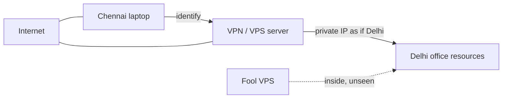
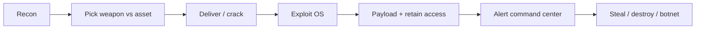
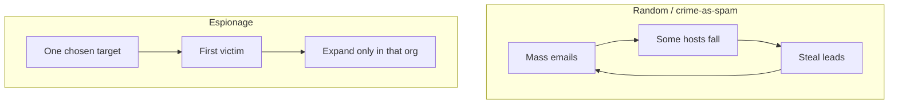
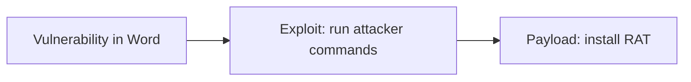
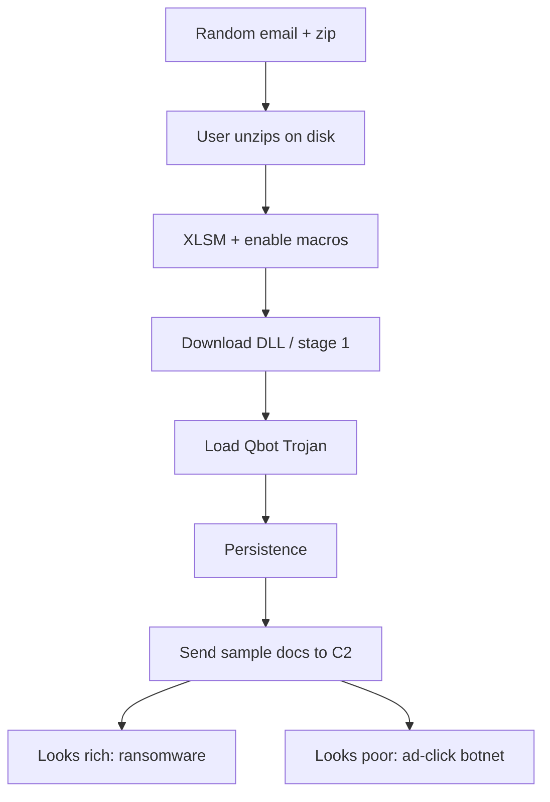

# Lecture T23: Industry Perspective — Part 02

**Playlist index:** 23  
**Transcript:** [23-industry-perspective-part-02.md](../../transcripts/markdown/23-industry-perspective-part-02.md)  
**Video:** https://www.youtube.com/watch?v=ROHhs7PMIGw  
**Week / theme:** Industry exposure — VPN as “key to the kingdom,” kill chain, random vs targeted ops, malware taxonomy, C2, DoS/DDoS, vulnerability–exploit–payload, RATs/stealers, Qbot, APTs and 3 Ds, SideCopy

## Learning objectives

- Explain VPN as a private encrypted tunnel — and why fooling the VPN server is “key to the kingdom.”
- Walk the **cyber kill chain** using the *Uri* commando analogy.
- Separate spray-and-pray crime from focused cyber espionage.
- Define Trojan vs malware, phishing vs spear phishing, C2, DoS vs DDoS, and vulnerability vs exploit vs payload.
- Describe RAT markets, stealers (Vidar), Qbot staging, APTs, the 3 Ds, and the SideCopy / fake `mail-gov.in` campaign.

## What this lecture actually teaches

Continues the industry session. CIA triad is assumed known and not re-taught at length.

### VPN: private network without private wires

A company with four or five branches will not copy the same data and servers everywhere. There is a **central repository**. Other locations must connect.

That is the start of a **private network**: parent-wise one organization, one private network. Laying real lines Hyderabad–Chennai–Mumbai is too expensive. So they use the **internet** but create a **private encrypted tunnel**. That process is a **virtual private network**.

There is a **VPN server** (also called **VPS — virtual private server** in this talk). You identify yourself to the VPS; it assigns a **private IP** and makes you virtually part of the office network. Delhi office, you sit in Chennai: the VPS gives you an IP **as if you were in Delhi**, so you can use Delhi resources. A Chennai member participates in Delhi through VPN.

**Hacker’s view:** VPN is **key to the kingdom**. Fool the VPN / VPS server and you are in; **nobody will even know.**

Real big organizations: multiple VPN servers connecting each other. **The group is as strong as the weakest one in the group.** Visualize where things will be bad.

### How an attacker actually attacks: kill chain as a commando raid

Not different from a movie commando raid. *Uri* is the analogy.

| Movie beat | Cyber language |
|------------|----------------|
| Bird / satellite / tunnels — **reconnaissance** | Homework on the target |
| Night insertion, quiet helicopter, drop away from the field | Choose when and how to arrive without waking the defenders |
| Right weapons | After identifying assets (VPN, server, anything), **pick a weapon that works against that asset** |
| Go and shoot; there is a crack | Get in |
| Exploit | You have OS access |
| Stay, steal or destroy | **Deliver payload and retain access** |
| Alert to command center: “Yes Boss, it is done” | Callback after delivery → installation, **without the hacker watching each step** |
| Then do what you came for | Botnet, copy data, destroy server |

Broad name: **kill chain / cyber kill chain**. Delivery through installation is **not visible** to the operator as a live camera feed; then the alert arrives.

### Two operating models: random spray vs focused espionage

**Unplanned / random (how “most cyber hackers” work):** randomly pick a huge number of email addresses, keep sending payloads, hope some compromise. From those machines collect more data and leads (the box is usually inside a network, or the mailbox yields more addresses), then **spread again**. Over time: a large list of vulnerable machines at your command. Looks like spam. **Nobody specifically targeted your company**; you could be an unfortunate victim. Industry claim: **a lot of big companies fall to this.**

**Specialized / cyber espionage:** hell-bent on **you and only you**. Focused launch, collect from one victim, then expand, expand. They do not spray everyone. **Weapons and tools are different.** The spray model risks exposure — what if you targeted a **cybersecurity researcher**? A two-page report and the operation is gone. Targeted work is **more expensive, dangerous, and tough**.

### Terminology drill (Q&A in the room)

**Trojan vs malware.** Malware is the **general** term; Trojan is **specific**. Trojan takes a **payload within a payload**. Trojans are one type of malware. **Primary objective: give a back door** to the attacker.

**Can a Trojan become ransomware?** Yes. That is the point — do not treat the labels as sealed boxes.

**Phishing vs spear phishing.** Spear phishing is **more targeted**. Phishing: random emails, not a focused effort. Spear example: attacker researches that you have a daughter at Doon School, writes an email to phish you. Conclusion the room is asked to draw: the attacker is **motivated and only wants you** — that itself is an important input.

**C2.** People say **C2** rather than “command and control.” Also **C&C**. If the machine is compromised it is managed through command and control: **another machine** whose job is to keep taking pings — “are you alive?” — then issue commands: fetch images, fetch files, send huge packets to this computer.

**DoS.** A server provides a service; the attacker wants that service **denied** to clients, by **overwhelming** the server.

**When is it distributed?** The same thing from **multiple** sources. These are **volumetric** attacks. A network has limited bandwidth; a computer can handle only so many connections. Overwhelm so legitimate customers are not served. User-visible symptom: **the website is simply not responding** — it is busy serving customers who do not care about it. Taught as a **very common form of cyber warfare** or a crude way of settling accounts.

### Vulnerability, exploit, payload — if you miss this you miss cybersecurity

Bunker-buster bomb picture:

| Term | Bunker picture | Office picture (Microsoft Word) |
|------|----------------|----------------------------------|
| **Vulnerability** | Weak link; thinnest part of the bunker | Word has bugs that can let a hacker **execute arbitrary commands** |
| **Exploit** | Material with enough strength to break through that weak link — you are **not always** able to exploit a weakness | Weaponize the bug so double-click / run **executes the attacker’s commands**, loaded from an internet server |
| **Payload** | What you deliver inside to do the job | Command **downloads a Remote Administration Tool and installs it** |

Deadliest part: **the payload**. Most antiviruses try to identify **payloads**, not exploits. Some now look for exploit signatures; it is rapidly changing.

### What payloads look like: RATs and the dark-web business

Payloads are “pretty simple lower-level software” that give **very good control** of the machine. Bought for **15–20 dollars** on the dark web. If the victim is not cyber-aware, install prompts: flash update, new app, Amazon ₹200 extra, Flipkart 50% sale — **prompts to install RATs**.

**RAT = remote administration tool.** Genuine uses exist: **TeamViewer, Ammy Admin**. Attackers take inspiration and build their own so **nobody can detect them**. Open-source examples named: **Puppy RAT, Qrat**. Markets sell RAT access **not detected by antiviruses**. Names: **DarkComet, Atom Logger**, sold **on license**. Antivirus changes daily, so the RAT author must update constantly — hence **annual subscription**. Keep paying, the RAT stays alive; otherwise it gets caught.

Post-COVID **key logger** use “sky rockets”: many people who do not understand cyberspace suddenly have access; many fell victim. Huge market in India too.

### Stealer demo: Vidar

A special Trojan/malware: **stealer** — job is to **steal passwords**. Panel on screen: **Vidar**. Victims shown: one **Brazil**, one **Lucknow** (IP looks like **Reliance Jio** — mobile, desktop, or broadband unknown). Stolen domains named: redbus.in, grammarly.com, olacabs.com, kesco.co.in, freecharge.in. Delivery: **WinRAR archive / zip**, **0.13 MB**. Panel also shows date/time and command-and-control information.

Dark web: hundreds of supply sources; make once, sell many times; payment in bitcoin etc. Forums push cheaper prices. You might be running one and not know. Plus **daily new vulnerabilities**, and **not everything is patched**.

### Qbot: from random zip to botnet monetization

**Qbot:** first-phase **random emails**, hope for a target, collect into a **botnet**, then think how to **monetize**.

Staging as taught:

1. Attachment is a **zip**. Why zip? **Email scanners cannot scan inside** the way they scan the message. You download and unzip. The file the gateway scanned and the file you now run are **two different things**.
2. Inside: malicious **XLSM**. Opening **executes macros**. Macros are a Microsoft feature to automate tasks; the attacker exploits them to run **his** tasks.
3. Downloads a malicious **DLL** separately, binary separately — **first-stage payload**, then that loads the **actual Trojan**.
4. Stages: first-level download, second-level download, **persistence**.
5. After that, ransomware vs Trojan depends on the **bot manager**. Sample documents/emails go to the master (C2). If the samples look like **a guy with a lot of money** → ransom. If a random person with nothing → **sell the bot** to click ads for advertisement money.

**Real emails shown:** compromised address; “Hello please read this and confirm regards” + zip. If it looks like it is from your boss: “Yes sir, I will do sir” — that is what they count on. Another: “Please familiar yourself with the attached file and reply here, if you have any questions. **Do not call me.** Reply here only” — because a phone call would reveal the sender never said that.

Excel: many **hidden sheets**. On open: looks like a form; “enable content”; “macros have been disabled” — **forces you to enable**. Clever **exploit plus social engineering**.

**Data Pro** is named as a **debugger** to look at source and see the malicious component more easily. Other tool: **Ghidra** (released by US intelligence / NSA). “Good tool but nobody trusts it, but then it is a good tool.”

### Serious players: APTs

How do you define a cyber attack at this level? Serious players are **APTs**. They run this as a **serious business**. Motives: government vs government, or a group in it for money. Building software, finding bugs, exploiting, weaponizing, targeting is **very expensive** — not as cheap as it appears.

Definition taught: attempt to gain **unauthorized access** to a computer, system, or network **with intent to cause damage**. APT difference: **higher motives**; they are **advanced** and **persistent** — after you, they do not give up, they continue to be a threat. A regular hacker leaves and goes after something else; **APTs do not**.

Example: while India was developing COVID vaccines, **healthcare companies were relentlessly targeted** to copy vaccine source code, mixtures, formulations. Advanced and persistent until they get what they want.

### Motives and the 3 Ds

First list of motives: **steal data** (also called **cyber espionage**), **disrupt**, **destroy**.

Then: technically, cyber attacks in **3 Ds**:

1. **Disrupt** — irritate the functioning of a system.
2. **Degrade** — you used to manage 100 customers simultaneously, now only 50 because two servers are destroyed or bandwidth is wasted on the attacker.
3. The “last one” is completed from the earlier triad as **destroy** (the lecture trails off after degrade).

Recent example left as a thought: **Mumbai / Tata Power grid** suddenly came down; nobody had any idea why.

### Types usually seen (top 15 as listed)

Distribution of malware, web-based attacks, phishing, web application attacks, spam, denial of service, identity theft, data breaches, insider threats, botnets, physical manipulation / damage / theft / loss (USB example promised), ransomware, espionage, **cryptojacking**.

**Cryptojacking:** take over other PCs to **mine cryptocurrency**; could also mean **taking over your wallet directly**. (Lecture: crypto mining vs also wallet takeover.)

### Sample APT: SideCopy

**SideCopy:** APT group **probably affiliated with Pakistan**; nowadays seen with **a lot of Chinese help**. Malware modules constantly under development and evolving, but **code remains very same**. Actors track detection and change source so antivirus A or B no longer flags it. They also **copy another (probably Indian) APT group’s tools** to **mislead** attribution.

Campaign: Government of India had an application to **prevent people from illegally accessing email accounts of government officials**. SideCopy distributed a **malicious version**: “you seem to be hacked, please download this application and use it henceforth.” Lookalike of the real app; hostname called out: **mail-gov.in** — “how many will notice it.” Happily distributed; the operation worked.

## Cases and examples from the lecture

- Multi-branch firm: no duplicate data centers; VPN tunnel instead of private fiber.
- *Uri* recon / quiet insert / weapons / payload / command-center ping as kill chain.
- Spray phishing vs researcher-risk of getting published.
- Doon School daughter email = spear phishing (motivation signal).
- Website “not responding” as the civilian view of volumetric DoS.
- Bunker buster; Word arbitrary-command bug → RAT download.
- TeamViewer / Ammy Admin as legitimate remote admin; DarkComet / Atom Logger as paid undetectable RATs.
- Vidar: Brazil + Lucknow/Jio, Redbus/Grammarly/Ola/… via 0.13 MB zip.
- Qbot zip → XLSM macros → staged DLL → C2 decides ransom vs ads.
- “Do not call me, reply here only.”
- Hidden Excel sheets + “enable content.”
- Ghidra (NSA) vs Data Pro debugger.
- COVID vaccine-research targeting of Indian healthcare.
- Tata Power / Mumbai grid unexplained drop.
- SideCopy fake government mail-security app, `mail-gov.in`.

## Key terms

| Term | Meaning in this lecture |
|------|-------------------------|
| VPN / VPS | Encrypted tunnel; VPS assigns a private IP so you look on-LAN |
| Kill chain | Recon → weaponize → deliver → exploit → payload / persist → C2 → act |
| Trojan | Malware type whose primary job is a **back door** (payload in a payload) |
| Spear phishing | Researched, one-target phishing |
| C2 / C&C | Separate machine that pings “alive?” and issues commands |
| DoS / DDoS | Overwhelm a service; distributed = many sources, volumetric |
| Vulnerability | Weak link (not automatically exploitable) |
| Exploit | Weapon that actually breaks through that link |
| Payload | What runs after the break (often a RAT); deadliest piece |
| RAT | Remote administration tool; legitimate or criminal |
| Stealer | Malware that harvests site passwords (Vidar) |
| Qbot | Random-email → zip/macro → staged Trojan → botnet monetization |
| APT | Advanced, persistent, will not walk away; expensive to run |
| 3 Ds | Disrupt, degrade, destroy (plus steal/espionage as motive) |
| Cryptojacking | Hijack machines to mine, or hijack a wallet |
| SideCopy | APT (Pakistan-affiliated in this talk) using lookalike gov mail tools |

## Formulas / frameworks (if any)

**Kill chain (as analogized):** reconnaissance → choose weapon for the identified asset → deliver/exploit → payload and retain access → command-center alert → objective (steal / destroy / botnet).

**Two economies of hacking:** (1) mass email → bots → spread; (2) one-org espionage with custom tools.

**V–E–P:** vulnerability (weakness) → exploit (weapon) → payload (the job, e.g. RAT). Antivirus historically chases payloads.

**Qbot money:** C2 inspects stolen samples → ransom the rich / ad-click the rest.

**APT:** unauthorized access **with intent to cause damage**, plus **will not give up**.

## Distinctions the instructor insists on

- VPN is not “privacy from your ISP” in this lecture; it is **how branches join HQ** — and the **single best impersonation target**.
- Random crime and espionage are **different weapons and different risk of getting caught**, not two names for the same email.
- Malware ⊃ Trojan; a Trojan **can** become ransomware.
- Phishing vs spear phishing is **targeting and research**, which itself tells you motive.
- DoS vs DDoS is **one source vs many**; both are about **capacity**, not clever credentials.
- A vulnerability is not an exploit; an exploit is not the payload. **The payload is the deadliest.**
- Genuine remote-admin tools and criminal RATs share the *idea*; the market sells **undetectable, subscription-updated** variants.
- Zip attachments exist to **desynchronize what the mail scanner saw from what the user runs**.
- APT vs “regular hacker”: **persistence and motive**, not a cooler logo.
- Espionage / warfare: **motive** (steal vs disrupt vs destroy); 3 Ds are the **technical effects**.

## Exam-oriented recap

- Fool the VPN server = sit on the office LAN with a private IP; weakest VPN in the mesh is the mesh.
- Kill chain = commando raid: recon, right weapon, exploit, payload, C2 callback.
- Spray-and-pray builds botnets from spam; espionage is expensive, focused, and allergic to hitting a researcher.
- Learn V–E–P, C2, Trojan-as-backdoor, spear phishing as a motivation signal, volumetric DDoS.
- RATs are cheap, licensed against AV; stealers (Vidar) siphon passwords from zip-sized droppers.
- Qbot: zip → macros → staged DLL → C2 chooses ransom or ads; social engineering says “don’t call, reply here.”
- APTs do not leave; vaccine-theft and SideCopy fake-gov-app are the Indian-facing examples; think disrupt / degrade / destroy plus steal.
