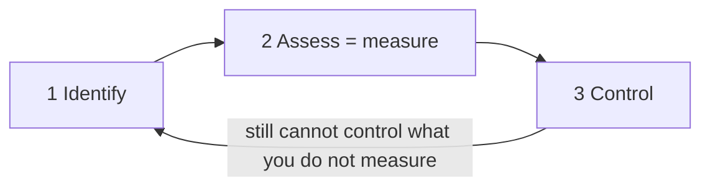
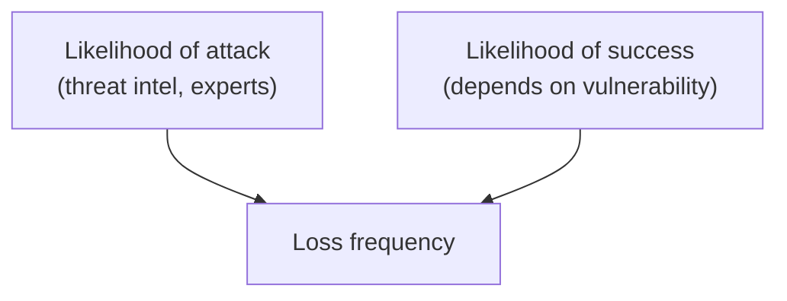
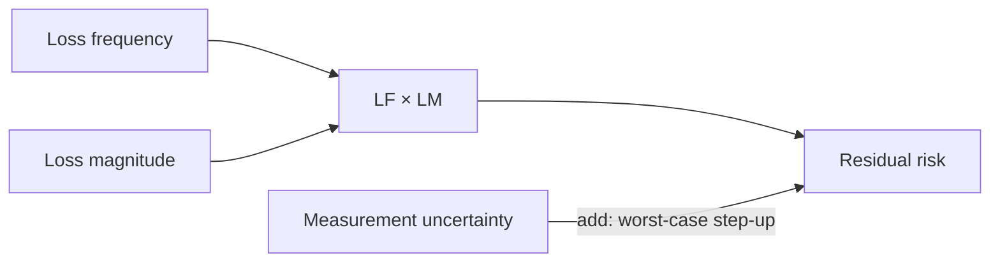
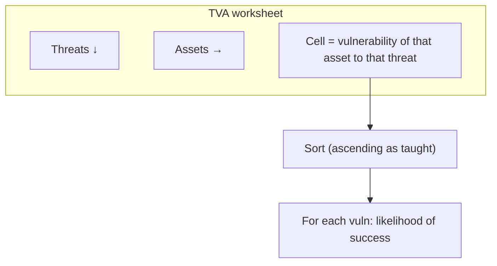

# Lecture T24: Live Session — Residual Risk, TVA, and Technology-Week Readings

**Playlist index:** 24  
**Transcript:** [24-industry-perspective-part-03.md](../../transcripts/markdown/24-industry-perspective-part-03.md)  
**Video:** https://www.youtube.com/watch?v=JPQiuqw6fvw  
**Week / theme:** Live interaction in the risk-management week — corrected residual-risk formula, TVA worksheet, and how to read textbook chapters 5–8 into the technology weeks

## Learning objectives

- Restate the **risk management process** as identify → assess (measure) → control.
- Compute **residual risk** with the **corrected** classroom formula (no “controls subtracted twice”).
- Unpack **loss frequency** and **loss magnitude** into the two probabilities and the impact × exposure story.
- Draw a **TVA** worksheet (threats × assets → vulnerability) and say what you do after you sort it.
- Know that **chapters 6–8 are to be read together** for the cybersecurity-technology weeks, even if the weekly split looks neater on paper.

## What this lecture actually teaches

This is **not** a continuation of the industry guest’s attack/defense slides. It is a **live interaction** in the **risk-management week**. The industry classroom session already exists as video; this hour is Prof. Saji on **risk measurement**, a **formula correction**, the **TVA** template, and **readings that feed the technology weeks**.

### Why risk first

Cybersecurity management depends on how well you understand the risk involved. The textbook’s applied path: **measure** risk, then use that measure as the basis to **control** it. Control mechanisms are discussed **after** assessment.

Process:

1. **Risk identification**
2. **Risk assessment** — here **assessment means measurement**
3. **Risk control** — act on managing, controlling, or reducing risk based on the measures

Classroom slogan: **that which you cannot measure you cannot control.** The first step toward control is measurement. Objective measures let you act.

Analogy used: weekly **assignment scores** are an instrument. The score goes to instructor and student; a low score means act (effort, access to materials, teaching, time). The score is not the point; **learning** is — but the score reflects learning. Risk management works the same way: identify, assess, control.

### Residual risk — the corrected formula

Slide: **final formula for calculating risk**. It looks like an equation.

**Residual risk = (loss frequency × loss magnitude) + measurement uncertainty**

He has **corrected the formula from the pre-recorded video lecture** (the older line sat at the bottom of that slide). The correction is to make it simple.

Risk is assessed primarily from **two factors**: **loss frequency** and **loss magnitude**.

### Loss frequency = two probabilities multiplied

Go back to the lessons: loss frequency emerges from **two probabilities**. He notes a slight difference between **likelihood** and **probability**, then **uses them in a similar sense**.

1. **Probability / likelihood of an attack.** There are many threats, internal and external; they are **not equal** in likelihood. That number has to exist as data. **Threat intelligence** is a very informed activity and often needs **external expertise**. So this probability comes from **experts**.
2. **Likelihood of success of that attack.** That depends on **vulnerability**. For each threat there is a corresponding vulnerability. You have already invested in **people, process, technology**. For some attacks you may be fully prepared, so **likelihood of success is very low** even if likelihood of attack is not.

**Multiply** those two probabilities. That product is **loss frequency**: the likelihood that there will be a **successful** attack. It is itself a probability.

### Loss magnitude = impact × how much of the asset is exposed

If an attack happens, what is your **exposure**? How much loss?

The video lectures already have an **objective measure of impact** (e.g. a 0–100 scale, or another objective scale).

If equipment is attacked, **sometimes it is not the whole equipment** — a part of a server or system may be down. **Exposure** = **what percentage of a particular asset is exposed**. That is what loss magnitude is getting at.

**Loss frequency × loss magnitude** is **probability × impact** in the general sense.

**General formula for risk:** probability of occurrence × impact if it occurs. Cybersecurity risk assessment just names those pieces **loss frequency** and **loss magnitude**.

### Why add measurement uncertainty

These measurements always have **error**. They are not purely objective; they are often **perceptual**. Probability may be an **expert’s judgment** (judgment error). Magnitude and exposure are often perceptual too.

So another item is added to the residual-risk measurement: **measurement uncertainty**.

It is added because you want to **amplify** the risk — go with the **worst case**. Measurement may be inaccurate, so **step it up** and show risk **higher than what is measured**.

### What was removed from the old formula (and from the new textbook)

The previous formula included **minus the percentage of risk mitigated by current controls**. Even the **new edition of the textbook has removed** that minus term.

The fine-grained idea was: after assessment, if extra measures are taken to reduce risk, subtract them so residual risk is very accurate. **In class that term caused confusion.**

**Assumption that makes the simple formula valid:** loss frequency and loss magnitude are assessed **with certain controls already in place**, and **no additional measure** is taken afterward to further minimize risk. Under that assumption, drop the minus term.

The worked example (next slide in the live session) also has **no such factor**. **For all practical purposes:**

> residual risk = loss frequency × loss magnitude + measurement uncertainty

That is the lesson he wanted in this hour: the extra factor is not well understood, and the textbook has corrected it.

### TVA worksheet

Recurring content question: the **TVA** template (he also says “DBA worksheet” once in the caption noise — the object is **TVA**).

- **Threats on the vertical axis**
- **Assets on the horizontal axis**
- **Vulnerability** for **each combination** of asset and threat
- Threat **works against** assets; **asset is one unit, threat is another unit**
- When you **sort** it, it comes in **ascending order**
- **For each vulnerability** you then try to understand **likelihood of success of the attack** — it is **based on vulnerabilities**

Unit of later calculation (picked up again in T25): you still **go by asset**.

### Readings that unlock the technology weeks

He has posted reading for **this week and the next two** (he first says weeks six, seven and eight, then tightens the mapping).

Taught mapping, after the correction in his own wording:

| Textbook | When |
|----------|------|
| **Chapter 5** | **This week — risk management** |
| **Chapters 6, 7 and 8** | **Weeks 7 and 8** — three chapters for **two** weeks of **cybersecurity technologies** |

**Read 6–8 together in advance.** There **will be overlaps**. Concepts **flow**: unless you know the previous one you cannot go to the next. A question from chapter 6 or 7 may appear in week 7; chapter 8 may be **partially** in a week-7 lecture. The weekly chapter split is an **approximation**. **You need all three chapters to understand cybersecurity technologies.**

He also states the **industry invited lecture** was a live classroom with student questions, fully captured on video — it is not supposed to map 1:1 onto a numbered assignment week.

## Cases and examples from the lecture

- Weekly assignment **score** as a measurement instrument that triggers action — the same logic as risk identify / assess / control.
- Expert **threat intelligence** as the source of attack likelihood (not something you invent at the desk).
- Defense already in place → attack may still be **likely** but **success** is low → product (loss frequency) is low.
- Partial server down → **exposure percentage**, not always 100% of asset value.
- Textbook **new edition** dropping “minus % mitigated by current controls,” matching his classroom correction.
- TVA grid: every **asset–threat pair** gets a vulnerability, then sort, then success likelihood.

## Key terms

| Term | Meaning in this lecture |
|------|-------------------------|
| Assessment | **Measurement**, not a vague essay about risk |
| Residual risk | Risk left in the measure: **LF × LM + measurement uncertainty** (corrected) |
| Loss frequency | P(attack) × P(success \| attack); P(success) from **vulnerability** / existing defense |
| Loss magnitude | Impact of a successful attack, including **% of the asset exposed** |
| Measurement uncertainty | Added slack because expert/perceptual measures err; **worst-case step-up** |
| Threat intelligence | Expert (often external) source of likelihood-of-attack data |
| TVA | Threats × assets worksheet; cell = vulnerability; then likelihood of success |
| Chapters 6–8 | Technology weeks; read as **one block**, not three isolated weeks |

## Formulas / frameworks (if any)

**Process:** identify → assess (measure) → control.

**Residual risk (use this, not the video’s older line):**

\[
\text{Residual risk} = (\text{Loss frequency} \times \text{Loss magnitude}) + \text{Measurement uncertainty}
\]

**Loss frequency:**

\[
\text{LF} = (\text{Likelihood of attack}) \times (\text{Likelihood of success})
\]

Likelihood of success is driven by **vulnerability** given people / process / technology already deployed.

**Loss magnitude (as taught):** impact of the event, with **exposure** = percentage of the asset affected — so you are not always multiplying full asset value.

**General risk:** P(occurrence) × impact if it occurs. LF × LM is that idea with cybersecurity names.

**Do not subtract** “% of risk mitigated by current controls” **if** LF and LM were already assessed **with those controls in place** and nothing extra was added after the assessment. That minus term is what confused the pre-recorded lecture and was removed in the new textbook edition.

**TVA:** threat (vertical) × asset (horizontal) → vulnerability per cell → sort ascending → for each vulnerability, likelihood of successful attack.

## Distinctions the instructor insists on

- **Control follows measurement.** No number, no control.
- **Likelihood of attack ≠ likelihood of success.** You can be a popular target and still a hard target.
- **Exposure ≠ “the whole box died.”** Part of a system can be down.
- Residual risk in **this** hour is **not** “LF × LM − current controls + uncertainty.” Current controls are **already inside** LF (via P(success)) and LM if you assessed honestly. Adding a minus term **double-counts** and confused the class.
- Measurement uncertainty is **not** a confession of ignorance to hide; it is a **deliberate conservative add-on**.
- The **industry video** and the **risk-week live session** are different objects. This live hour is formula + TVA + how to read for **technology** weeks.
- Chapter-per-week labels for 6, 7, 8 are **approximate**; **overlaps are expected**.

## Exam-oriented recap

- Risk week mantra: identify, **measure**, then control — because you cannot control what you cannot measure.
- **Residual risk = LF × LM + measurement uncertainty.** Drop the old “minus % mitigated by current controls” when assessment already assumed those controls.
- LF = P(attack) × P(success); P(attack) from threat intel; P(success) from vulnerability / existing defense.
- LM = impact, with exposure as **percent of asset**.
- Add uncertainty to **step risk up** (worst case), because expert judgment is perceptual.
- TVA: threats down, assets across, vulnerability in the cell; sort; then success likelihood **per vulnerability**.
- For the coming **cybersecurity technologies** weeks, **read textbook chapters 6, 7 and 8 together** (chapter 5 is this risk week).
