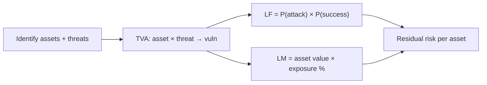
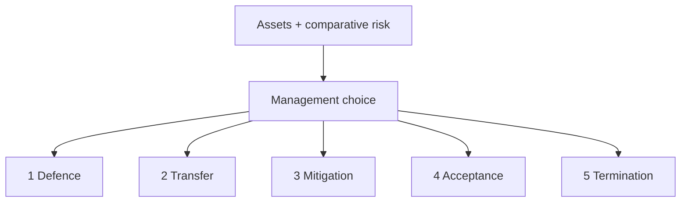
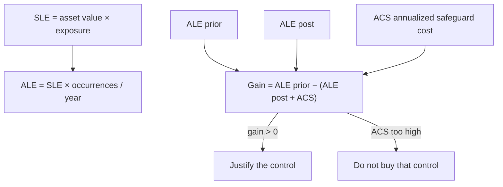

# Lecture T25: Cybersecurity Technologies — Part 01

**Playlist index:** 25  
**Transcript:** [25-cybersecurity-technologies-part-01.md](../../transcripts/markdown/25-cybersecurity-technologies-part-01.md)  
**Video:** https://www.youtube.com/watch?v=3rkIe2ZkkfY  
**Week / theme:** Close quantitative risk management (five options, ALE/ACS) and open the **protection** role of cybersecurity technologies

## Learning objectives

- Close the risk-management loop: identify → quantitative assessment → **management choice** among five strategies.
- Keep **defence** and **mitigation** from collapsing into each other.
- Justify a control with **ALE, SLE, ACS** (cost–benefit), then **monitor** because estimates are not actuals.
- See today’s technology topic as **defence/protection**, complementary to last week’s industry session (Mr. Sai).

## What this lecture actually teaches

Welcome back. Previous sessions were risk as something to address with solutions; last week was **Mr. Sai** — practical handling of cybersecurity issues, complementary to conceptual cybersecurity management.

**Today’s plan:** summarize and **close risk management**, then move to **cybersecurity technologies**. Focus: **overview of technologies used particularly for protection** — the **defence** point of view: how you deploy technology **against attack**. (Different roles of technology exist; this block is protection.)

### Risk management recap: three stages

Risk management is basically a **preventive** measure. You identify **assets** because assets are what are attacked / become the target of enemies.

Three stages:

1. **Identify** — identify yourself and identify your enemies: **assets** and **potential threats**.
2. **Assessment** — quantitative; bring precision. Assets identified, but **how do you value them?** If affected, what is the **financial impact**? Also **threat intelligence**: probability a threat materializes, and if it occurs, **chance it is successful given existing defense**.
3. Then the **final measures** for calculating risk.

Two important assessment measures (already discussed):

| Measure | As restated today |
|---------|-------------------|
| **Loss frequency** | Probability of an attack × probability of a **successful** attack (“actually happening in your system”) |
| **Loss magnitude** | **Exposure of an asset**: asset value × **what percentage** of that asset will be exposed |

Once those exist, you can arrive at the overall measure.

### Residual risk (this lecture’s wording)

Risk as an overall measure is called **residual risk**: the risk **left after implementing certain protection mechanisms**.

At a “very detailed level of quantitative measurement,” today he still writes it as:

**product of loss frequency and loss magnitude, minus the protection from existing systems, plus a measurement error / measurement uncertainty** (uncertainty can be calculated from the error).

Unit is the **asset**. Each asset has vulnerability and value. Vulnerability comes from **mapping each asset to a threat**. **TVA worksheet**, then risk **per asset**.

Compare T24’s live correction: there, the minus-“current controls” term is dropped because LF and LM are already assessed with controls in place. This lecture still **voices the long form**. For the exam, know **both** the live-session simplified formula and this “detailed” statement.

### Place it before management: five options, not “always defend”

The pack goes to management: these assets, these risks. **Risk is something that needs to be managed.** You estimated per asset; asset X has this risk on a relative scale. **So what?** Action is management’s.

**Five options** (textbook language on the slide):

Defence is **not the only option**. In management literature, defence is one option. The path taken has to be **justified**.

#### 1. Defence

E-commerce server has high risk; you will not leave it. Step in, put **safeguards**. Invest more in cybersecurity technologies; recruit a **CISO**; invest in **people** and **technologies** because the decision is to **defend**. If an attack occurs tomorrow, be as prepared as possible. Effort to **reduce risk**: more defence → **reduce exposure** or **reduce chance of success**. **Investment decision**.

#### 2. Transfer

A **smart** option; **many non-IT companies** do this for cyber assets: **transfer risk from the owner to a third party**.

**Outsourcing:** IT asset management to a vendor. Example: **TCS** providing IT services to a US client — responsibility for running systems; **SLAs** (e.g. 99.99% availability). Cyber attack becomes something **the vendor** needs to manage; owner’s risk is passed on.

**Cloud computing** (from the room): storage moved to cloud — another third-party vendor. Cloud is **one** transfer option, not the whole of transfer.

Student point: transfer can look like it “includes” defence, mitigation, acceptance, termination because the vendor then uses those strategies. Reply: **each is a separate strategy**. A company can transfer **or** continue to own. Once risk is transferred, the **vendor** may try each option because *they* must manage risk. The **client can continue to own** the assets and take an option **other than** transfer.

**Managed services** (Wipro or TCS): **assets may still be owned by the client** (material ownership) but **services are managed** — availability is the provider’s job, so **cybersecurity management of the client’s asset becomes the provider’s responsibility**. Different from “we sold you the cloud.”

Why transfer: often **no internal expertise**; give it to a professional.

**iPremier (recalled case):** the company **had transferred** risk to a third party, but the third party was **unprofessional**, not updated, **even worse than the client’s knowledge**. Transfer requires **professional** management.

Classroom worry: you might still be unstable to customers after transfer. Yes — transfer is not magic.

#### 3. Mitigation — not a synonym of defence

People use mitigation and risk management **synonymously with defence**. **Wrong.**

| | Defence | Mitigation |
|--|---------|------------|
| Timing | Build **against** attack (e.g. **firewall**) | Assumes **attack has already happened** (as in **contingency management / planning**) |
| Goal | Reduce chance of success / exposure | **Minimize the impact** of an attack |
| Example investment | Defence technologies, CISO | Contingency **team**, **hot site** |

Investing in a hot site is **not** an investment in defence; it is **reducing impact** — therefore **mitigation**. Separating / allotting resources for contingency planning **is** a mitigation strategy.

**Keep that in mind.** He has heard people use the words synonymously; **it is not correct.** Mitigation is reducing impact.

#### 4. Acceptance

Recall **Target Corporation**. Some experts: you are a **70 billion** company and lost **500 million** — a small tip; **do not over-invest**, do not do more defence or mitigation; **cross the bridge when you come to it**.

These are **informed** management decisions. If you choose acceptance, know the **economic implications** — loss vs gain, economic justification.

Conditions: an organization may be ready to accept. **To a large extent, academic institutions like ours have chosen acceptance** — not too worried; if data is leaked tomorrow, we will face it; not that critical; **not so much investment** in cybersecurity. Sometimes based on **criticality of data and applications**.

#### 5. Termination

Cybersecurity investment would have to be so large that it **does not make economic sense** to keep the business unit. Cash flows / revenues vs cost do not justify the business. **Stop** having those IT assets; **sell them off**. Also an option, based on economic justification.

**Informed, rational management** decides on **economic justification**.

### Standards speak different dialects

Same generic concepts (textbook, first column of a comparison table); **NIST** and **ISO** use slightly different language. NIST example given: a standard for **documenting risk**, **SP 830**. There are standard ways of documenting risk once assessed.

### Controls need a cost–benefit sheet

Students of management already know CBA. For any investment: benefits should be more than cost; how much more often decides go / no-go. **Gains should outweigh the cost** — same principle for cybersecurity risk-management options.

Investment in defence or mitigation puts money into systems. Arrive at a **cost–benefit sheet for each option**.

### ALE, SLE, ACS

**Annualized loss expectancy (ALE)** is used to calculate cost and benefits.

- **SLE (single loss expectancy)** = **loss magnitude** = **asset value × exposure factor** (already seen).
- **ALE** = that loss magnitude **annualized** by **number of occurrences in a year** — estimated loss magnitude over a year.

**Overall gain or loss** (can be positive or negative):

You have **ALE prior** — current expected annualized loss **before** the new action (assessment already done).

Risk people propose an investment (protection or mitigation or whatever). After that you expect **ALE post** — different because better protection is in place.

You also incur **ACS — annualized cost of the safeguard** (cost of implementing the control, annualized).

Classroom trap: who should be **higher**, ALE prior or ALE post? Someone says ALE post. **No** — it is about **loss**. When the system is more vulnerable, expected losses are **more**. After you spend ACS, you expect **ALE to go down**.

Trade-off: look at **ALE post + ACS**. What justifies the investment: **ALE post + ACS should be less than ALE prior**. Then you have a **gain**, a positive cash flow.

If **ACS is very high**, the control **does not justify** — gain goes down. Reasonable investment that **reduces losses enough** justifies itself.

All of this needs **quantification and monetization**. Conceptually: investment should reduce losses **sufficiently** to justify the spend.

### After you choose: monitor

At investment time you have an **estimate** of gains or losses. **Actual can be very different.** Management must see that the investment **delivers the expected gains**. Next effort: **monitoring of the risk-control strategies** you put in place.

Tomorrow’s technology discussion: mechanisms for **defence** and for **mitigation**.

## Cases and examples from the lecture

- Mr. Sai last week: practice complementing theory.
- E-commerce server → invest in tech + CISO (defence).
- TCS / US client SLA 99.99% (transfer by outsourcing).
- Cloud as one transfer path; **managed services** (Wipro/TCS) where **client still owns** boxes.
- **iPremier**: transferred to an **unprofessional** vendor — worse than in-house.
- Firewall = defence; **hot site / contingency team** = mitigation.
- **Target**: $70B firm, $500M loss, some experts say accept.
- **IIT / academic institutions**: largely **acceptance**.
- Terminate a business unit when security cost kills the economics.
- NIST **SP 830** / ISO different labels, same ideas.
- ALE prior vs post vs ACS: do not buy a safeguard whose annualized cost eats the loss reduction.

## Key terms

| Term | Meaning in this lecture |
|------|-------------------------|
| Residual risk | Risk left after protection; detailed form includes minus existing protection + uncertainty |
| TVA | Asset–threat map that yields per-asset vulnerability and then risk |
| Defence | Invest to be ready **before** / **against** attack; cuts P(success) or exposure |
| Transfer | Pass operational cyber risk to vendor (outsource, cloud, managed services) |
| Managed services | Client **owns** assets; provider must keep them available / secure |
| Mitigation | **After** incident logic: spend to **cut impact** (contingency, hot site) |
| Acceptance | Informed choice to live with the number (Target comment; campuses) |
| Termination | Exit the asset or business when security spend cannot be justified |
| SLE | Single loss expectancy = loss magnitude = AV × exposure factor |
| ALE | SLE annualized by yearly frequency |
| ACS | Annualized cost of the safeguard |
| SP 830 | NIST document-risk standard as **named in this lecture** |

## Formulas / frameworks (if any)

**Three stages:** identify (assets + threats) → assess (value, P(attack), P(success), TVA) → manage (five options) → **monitor**.

**Loss frequency** = P(attack) × P(successful attack).

**Loss magnitude** = asset value × % exposed.

**Residual risk (this video’s detailed wording):** (LF × LM) − protection from existing systems + measurement uncertainty.

**Five options:** defence, transfer, mitigation, acceptance, termination — **economically justified**.

**SLE** = asset value × exposure factor (= loss magnitude).

**ALE** = SLE × (annualized number of occurrences).

**Gain from a control:**

\[
\text{Gain} = \text{ALE}_{\text{prior}} - (\text{ALE}_{\text{post}} + \text{ACS})
\]

Invest when gain is positive, i.e. when \(\text{ALE}_{\text{post}} + \text{ACS} < \text{ALE}_{\text{prior}}\).

## Distinctions the instructor insists on

- Technology this week is **protection / defence**, not a full catalogue of every cyber tool.
- **Defence ≠ mitigation.** Firewall vs hot site. Mitigation **assumes the hit** and cuts **impact**. Using the words as synonyms is **incorrect**.
- Transfer ≠ “we no longer have a problem.” **iPremier**. Client can still **own** assets under managed services.
- Cloud is **a** transfer option; transfer also includes classic outsourcing / managed services.
- Acceptance is not laziness if it is an **informed economic** choice; he still says campuses largely **accept**.
- Termination is a real fifth option, not a joke.
- **ALE post should be lower than ALE prior** (losses), even though you added ACS.
- A control with huge ACS can **fail CBA** even if it “improves security.”
- Estimates at decision time are not actuals → **monitor**.
- NIST/ISO **names** differ; textbook **concepts** are the generic column.

## Exam-oriented recap

- Close risk with **five management options**; defence is only one, and it must pay for itself.
- TVA and per-asset residual risk go to management as a **comparative scale**.
- Transfer: outsourcing, cloud, managed services (ownership may stay); vendor must be competent (**iPremier**).
- Mitigation = contingency / hot site / impact reduction, **not** “another word for firewall.”
- Acceptance (Target 70B vs 500M; academia) and termination (kill the unit) are rational when the economics say so.
- **SLE → ALE; compare ALE prior with ALE post + ACS.** Positive gain justifies the safeguard; then monitor.
- Next: what those defence and mitigation **technologies** actually are (managerial overview).
