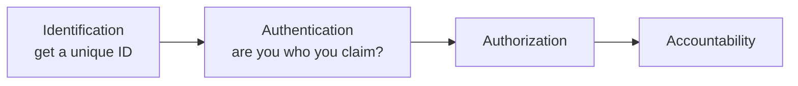
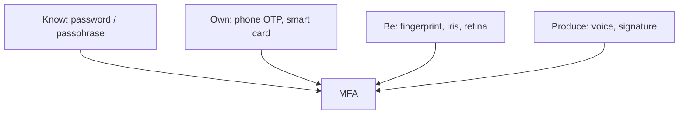
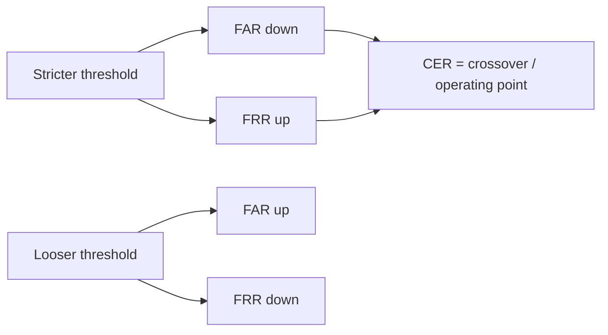
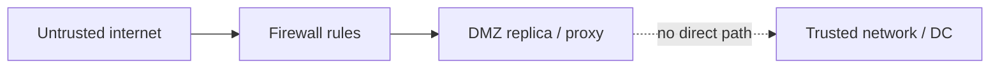
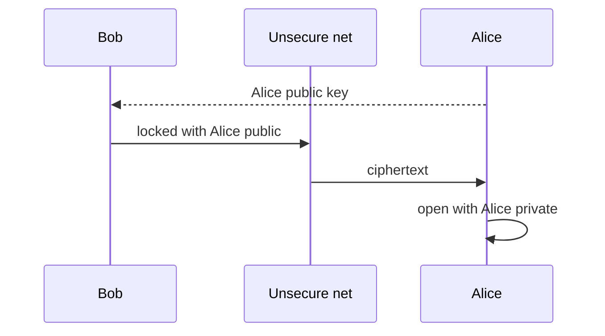
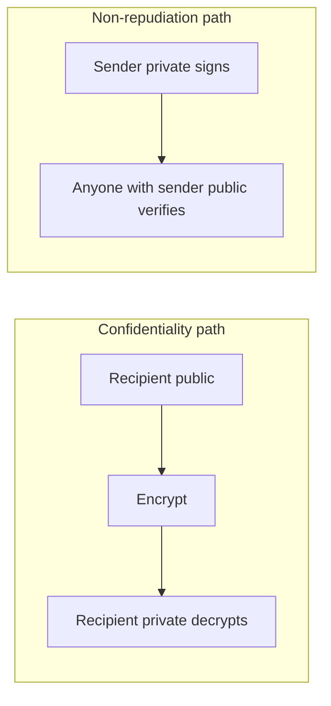

# Lecture T26: Cybersecurity Technologies — Part 02

**Playlist index:** 26  
**Transcript:** [26-cybersecurity-technologies-part-02.md](../../transcripts/markdown/26-cybersecurity-technologies-part-02.md)  
**Video:** https://www.youtube.com/watch?v=ZQSXMurVEXA  
**Week / theme:** Managerial overview of protection tech — *1984* / surveillance, IAAA access control, biometrics (FAR/FRR/CER), firewalls and DMZ, cryptography (symmetric/asymmetric, signatures, Caesar / transposition / XOR)

## Learning objectives

- Place access control, firewalls/DMZ, and cryptography as three **protection** families for CIA.
- Walk **identification → authentication → authorization → accountability** and the authentication factors actually named (password, passphrase, OTP, MFA, biometrics, voice/signature).
- Evaluate biometrics with **FAR, FRR, CER**, using the Andhra ration / worn-ridge case and the CAT-score analogy.
- State what a **firewall rule** does, what **trusted / untrusted / DMZ** mean here, and why cryptography **does not control access** but hides meaning.
- Contrast **symmetric vs asymmetric** key management, **digital signature** (reversed keys, non-repudiation), **digital certificates**, and the three cipher techniques (substitution, transposition, XOR).

## What this lecture actually teaches

As part of cybersecurity **management**, you may **defend** (stronger defence) or invest in **mitigation**. Today: what **technologies** exist to provide better security, reduce cyber risk, feel safer with new safeguards.

**Disclaimer:** this is an **overview**. Each technology is a distinct engineering topic. He will **not** go into design detail. Managerial aim: **awareness** of what the technologies **do**, **where** they are used, and some **functional** “how” (cryptography as the example).

### Culture notes he actually assigns

Watch movies related to cybersecurity (not only recent incident films).

- **1984** — book by **George Orwell (1949)**, predicting a 1984 scenario; a classic. Also recommends **Animal Farm** to understand politics. **1984 is about surveillance**: surveillance technologies as a powerful tool for governments to enter the **private space** of individuals; government decides what citizens do. Not a claim that we fully live there — it is about **potential abuse** by agencies who have power. **Power asymmetry**: you are vulnerable; you do not have much say in what government should do.
- **Minority Report** (Steven Spielberg, 2002, Tom Cruise) — **retinal detection** for access to systems. Access control is a cybersecurity mechanism; the film is the hook.

### CIA again, and four steps of access control

Confidentiality, integrity, availability are the **objectives**. A mechanism for ensuring CIA involves **four steps** (covered before, reused now): **identification, authentication, authorization, accountability**. Today: **how technology** does access control — how access-control tech **serves CIA**.

### Identification

Anyone who wants a system, cyber asset, or service should have an **ID**. Creating ID is first. An **identifier uniquely identifies a user**.

Colonial / school example: no ID card, not biometrics, **not even a photograph**. **Permanent body marks** — “black mole on the right cheek” — recorded as ID. Rudimentary; uniqueness is questionable. Today: advanced techniques.

### Authentication

ID is stored. When you present yourself, what you present is **compared with what is stored**. Authentication: **whether you are the person whom you claim to be.** You say “I am X”; we verify you are X.

Methods shown:

- **Something you know:** **password** (unique, only you know, stored, compared). **Passphrase** — longer expression, a **phrase not a word**; passwords can be cracked; passphrases gaining importance. Password “developed at MIT many decades ago.” **OTP** — we live in the era of **multi-factor authentication**.
- One factor (password/passphrase) vs **multiple factors**.

**SBI example (as walked):**

1. Username = **ID** (who you claim to be).
2. Password compared with store = **first factor**.
3. **CAPTCHA** — “are you a man or an animal?” Ensures **human, not a script**.
4. **OTP** to a **different device** — second factor from **something you own** (phone). India’s tele-density “close to 100%” made phone OTP a national MFA mechanism.

Apple-style **three-factor** and beyond: be very sure it is you. MFA **increases the level of access control**.

Other methods: **smart cards**; **fingerprints**; **retina and iris scans** — eye properties unique to an individual. **Retina:** blood-vessel patterns unique (like fingerprints). **Iris:** pattern **around the pupil**. Capture with camera, store → becomes an ID for authentication.

**Fourth type:** authentication using **what you produce** — **voice, signature**.

Biometric (part of body) and non-biometric can be **combined**.

### Biometrics: limitations, inclusion, FAR / FRR / CER

Because biometric devices are widely used for access control, know **limitations**.

**Digital inclusion** in India: urban users have UPI / cards / cash; a rural farmer may have no card and little awareness — **excluded** from digital benefits. Several states tried fingerprint authentication for **rations**.

**Krishna district, Andhra Pradesh:** he judged a national competition; met the IAS officer. Farmer at ration shop without wallet: show fingerprints. Fingerprints stored; **Aadhaar-linked bank account** linked to the distribution system. Want 2 kg rice, pay from bank by fingerprint — “acting as your credit card.”

**Implementation problem:** **ridges wear out**, especially with **manual labour**. System could not sense them. Fix: not one finger — **combination of all five fingers** so probability of correct identification improves. Then the system was implemented.

**False positives vs false negatives** — trade-off, like controlling entry.

**CAT / DoMS analogy:**

- Make entry extremely strict (CAT 99.99) to ensure no “bad” students: you drive **false positives** down (no bad student admitted) but **false negatives** go up (a 99.8 who is actually better, or someone having a bad exam day, is rejected). CAT is a measurement with error; not an exact aptitude meter.
- Relax to 80%: false negatives fall (you stop rejecting good people) but **false positives go up**.
- Like **Type I / Type II** in hypothesis testing.

On biometric devices that trade-off is **FAR vs FRR**:

| Acronym | Meaning |
|---------|---------|
| **FAR** | False **acceptance** rate (false positive: let the wrong person in) |
| **FRR** | False **rejection** rate (false negative: reject the right person) |
| **CER** | **Crossover error rate** — **optimal point** where the two meet |

When FAR increases, FRR is low; when FRR goes up, FAR goes down. **CER is typically specified** on biometric devices. Check whether CER is **sufficiently low** and acceptable for the problem in hand.

Widely used: fingerprints; retina (blood-vessel pattern); **iris** — “random patterns of freckles, pits, striations, vasculature and coronas” (multiple iris attributes; the combination is unique). Watch the suggested movie for use **and abuse**.

### Firewalls and DMZ

From access control to firewalls: still **protection** technologies.

Access control: who can access; make unauthorized access as impossible as possible. Biometrics raise that bar. Firewalls: widely used, prevent unauthorized access to **data center / servers**. Metaphor: a **burning wall** around the classroom so the enemy cannot enter.

What a firewall **does**: provides access based on **identity**. Example: someone from a particular **IP** tries to reach a **database server**; the firewall **decides** whether that IP may. **Rules are configured**: which IP cannot access a given system. Typical pattern: configure **who cannot**; others can.

**Trusted network** (firewall / cybersecurity literature): **your** network — internal cyber assets, typically the **data center** (servers and applications running org services).

**Untrusted network:** any network **external** to the organization. You do not know it; **do not trust unless we know**.

Because the outside has good, bad, and ugly, you need mechanisms — including **avoid direct access**. You do not want an external agent **directly** into the trusted network. If they want a resource, it is **not provided directly**. A **copy** sits in a **demilitarized zone (DMZ)**. (He misspeaks “dematerialized,” then corrects.)

**DMZ** = **replica** of the trusted network. External agent gets **DMZ, not the trusted network**. Builds a **proxy** — mediator between external systems and trusted network. Campus **proxy servers** insulate the trusted network. Firewall application: configure who cannot access, using firewall rules — **it prevents access**.

### Cryptography: assume they got the bits anyway

Third protection family for CIA. Cryptography ensures data is **not used / not accessed** in the sense of **not understood**. Here **access is not controlled**. Despite firewalls and biometrics, someone can still get at data **in transmission**. Impostor / “evil” gains access to the flow.

Assume somebody **has** access: how do you still prevent the information from leaking **meaning**? **You do not control access; you assume access and hide writing.** Encrypt so they “do not understand what they got.”

**Alice and Bob:** Bob sends a confidential Valentine message; a jealous party must not read it. Encrypt: plaintext vs encrypted version that is not legible. **Kryptos** — hidden writing. Encryption = hiding information.

History: Germans in World War, broken by British scientists; popular movies exist. Everyday: **WhatsApp**. On send, WhatsApp says messages are **end-to-end encrypted**. **End to end** means **sender to receiver**; **no one in between** — **not even WhatsApp** can read. (Caveat: we do not know what government will do; **power asymmetry of technology** again.) Some messaging apps provide this **as of now**.

Vocabulary taught:

- **Plain text** — original message, sent as bit stream, grouped into **blocks** (8 bits, 16 bits, …); **blocks** get encrypted.
- **Cipher** — transformation of characters/bytes/bits of plaintext into encrypted components.
- **Cipher text / cryptogram** — unintelligible encoded message.
- **Decipher** = decrypt. Receiver must read “Hi,” not gibberish. Decryption **always involves a key**. Key locks and unlocks.

Two broad methods: **symmetric key** and **asymmetric key** — two ways to **manage the key**.

### Symmetric vs asymmetric

Message encrypted with a key, like a locker. Recipient needs a key to unlock.

**Symmetric:** **only one key** for encrypt and decrypt. Plus: simple, one key to manage. Minus: **how does Alice learn the key?** If the network is insecure (the assumption of encryption), sending the key on the **same** network means the key can be accessed. **Key management is the challenge / limitation.**

**Asymmetric:** key used to encrypt **differs** from key used to decrypt. **Public key** and **private key**.

Alice wants Bob (and others) to send to her. Alice generates **two** keys. She gives Bob her **public key**: “use this to lock.” Bob encrypts with Alice’s public key. Alice does **not** open with the public key — public **cannot** decrypt. She opens with her **private key**, which **stays with Alice**. Public key may travel the insecure network; it cannot be used to read. **Public encrypts, private decrypts.**

TSA suitcase aside: TSA-marked lock the airport can open — **sort of** two different keys; “not exactly the same” as public-key crypto, but the pedagogical picture of a master key. Lighter note: Alice distributed her public key **not only to Bob**.

### Digital signatures and certificates — reverse the keys

When the **asymmetric process is reversed**, you are in **digital signature / digital certificate** territory. Previously: sender has public, recipient has private. **Now: sender signs with private key; public key opens.**

Purpose: **non-repudiation** — somebody should not refuse “I sent the message.” Important in **blockchains** too.

Bank cheque: you signed; later you refuse the signature = **repudiation**. Blockchains: you cannot refuse if you actually signed. Non-repudiation in business transactions is an important requirement.

**Indian e-governance:** **Passport Seva**; mandatory company filings (annual reports) automated — **TCS** built automatic filing. Problem: how does government know **it was you**, and tomorrow you cannot deny, and you cannot quietly “correct” after send? Done with **digital signature**: each company given a **key to sign** before sending. A student project with **Satyam**: Satyam distributed **private keys through a dongle** obtained from government — **third party as key manager**. Purpose: **along with** information security, **non-repudiation** / ownership of the filed document.

**Digital certificates:** type iitm.ac.in; browser must ensure it **is** IIT Madras. Genuine orgs have a certificate for the browser to verify. Certificates are like **signatures signed by the company, managed by a third party**. Browser checks a stored certificate that **authenticates the site**.

### Three technical methods (textbook)

Encryption in a generic sense: **substitution, transposition, and XOR** (Exclusive OR). Described in the textbook.

**Substitution:** mono-alphabetic vs poly-alphabetic. Very old; **Caesar** to his commander via a messenger who must not read Latin plaintext.

**Caesar’s cipher:** instead of A, shift (lecture walk: advance by a number). Encrypted English that decrypts to **“Meet me after the toga party.”** Formula: **p + k**, **k** the shift. Walk: add **3**. Substitute each character with the letter **k** positions later. When the alphabet ends, **wrap** — that is **mod 26**.

**Mono-alphabetic:** **the same rule for all alphabets**. Key is **k**; if the messenger knows k, “Caesar is gone.”

**Poly-alphabetic:** **different rule per alphabet**. When it is A, which substitute is determined by a **key**. Classroom problem: key **IITM**, encrypt **DOMS**. “D becomes L” in the walk-through; **read the textbook for more examples**.

**Transposition:** bit streams in **blocks of 8**; encryption by **changing positions**. Each bit in the block has a **different rule**; block-wise transposition. Key = **rule for changing positions**. Plaintext → ciphertext by applying the key to each block.

**XOR:** truth table for two inputs. Same inputs → output **0**; different → **1**. (0,0)→0; (1,0)→1; (0,1)→1; (1,1)→0. Encryption: for each bit of the message block, apply a key bit with XOR.

He is **outlining principles**, not claiming real encryption is this simple. Encryption **standards** and a recap move to the **next class**; today they will also hear a presentation on **active defense**.

## Cases and examples from the lecture

- Orwell *1984* / *Animal Farm*; Spielberg *Minority Report* retina gates.
- School ID as a **mole on the cheek**.
- SBI: username → password → CAPTCHA → SMS OTP (something you know + prove human + something you own).
- Krishna district PDS: worn fingerprints, five-finger fusion, Aadhaar-linked bank pay.
- CAT 99.99 vs 80% as FAR/FRR.
- Firewall: IP may / may not hit the database server.
- Campus proxy + DMZ replica so outsiders never touch the trusted DC directly.
- WhatsApp **end-to-end** = not even the company reads in transit.
- Jealous third party vs Bob→Alice.
- TSA lock as a loose “two-key” picture.
- Passport Seva and company e-filing; Satyam **dongle** private keys; non-repudiation not just secrecy.
- Browser warning: site certificate missing/outdated.
- Caesar “toga party,” k=3, mod 26; IITM key on DOMS; XOR 1⊕1=0.

## Key terms

| Term | Meaning in this lecture |
|------|-------------------------|
| Power asymmetry | Surveillance tech in the hands of government vs the governed (*1984*) |
| IAAA | Identify, authenticate, authorize, account |
| Passphrase | Phrase, not a word; harder to crack than a password |
| MFA | More than one factor, often a second **device** (OTP) |
| FAR / FRR / CER | False accept, false reject, crossover (device spec to check) |
| Trusted network | **Your** internal assets / data center |
| Untrusted network | Everything outside the organization |
| DMZ | Demilitarized zone: **replica** offered to outsiders via proxy |
| Cryptography | Hide meaning **assuming** the channel is already accessed |
| End-to-end | Encrypted sender→receiver; intermediary (WhatsApp) cannot read |
| Symmetric | Same key both ways; **key distribution** is the hole |
| Asymmetric | Public locks, private opens (for confidentiality) |
| Digital signature | **Private** signs, **public** verifies — **non-repudiation** |
| Digital certificate | Third-party-managed site identity the browser checks |
| Caesar | Mono-alphabetic shift **p+k mod 26** |
| Transposition | Reorder bits in a block by a position key |
| XOR | Bitwise exclusive-or with a keystream |

## Formulas / frameworks (if any)

**Access-control chain:** identification → authentication → authorization → accountability.

**MFA (SBI walk):** ID (username) + knowledge (password) + human check (CAPTCHA) + possession (OTP on phone).

**Biometric operating point:** trade FAR against FRR; **CER** is the crossover / specified optimum; decide if that CER is low enough for the use case (rations vs MBA admissions vs a data center).

**Perimeter:** untrusted → firewall rules → **DMZ replica** → (no direct) trusted DC.

**Crypto assumption:** access to the **ciphertext** may happen; confidentiality is **incomprehensibility**.

**Symmetric:** one shared key; cannot safely ship it on the same untrusted net.

**Asymmetric (confidentiality):** encrypt with **recipient public**, decrypt with **recipient private**.

**Signature:** sign with **sender private**, verify with **sender public** → non-repudiation.

**Caesar:** \(C = (p + k) \bmod 26\) (wrap when the alphabet ends).

**XOR:** output 1 iff the two bits differ.

## Distinctions the instructor insists on

- This is **managerial awareness**, not crypto course design depth.
- *1984* is **surveillance / private space / power**, not a claim that 2020s India is Oceania.
- Identification is **issuing a unique mark**; authentication is **matching presentation to the store**.
- Password vs passphrase vs OTP vs biometric vs “what you produce” are different **factors**; MFA **combines** them, often across **devices**.
- FAR down **is not free** — FRR goes up (CAT 99.99). CER is the honest spec to read on a device.
- Worn labourers’ fingerprints are a **technology** failure with **inclusion** consequences, not user stupidity; **five-finger** fusion was the local fix.
- Firewall **prevents access** by rule; cryptography **does not prevent access** — it prevents **reading**.
- Trusted = **ours**; untrusted = **not ours**. DMZ is a **replica / proxy**, not “the safe room where we stop monitoring” (contrast the industry guest’s looser DMZ talk in T22).
- End-to-end ≠ “encrypted somewhere in Google”; it means **intermediary cannot read in transit**.
- Symmetric’s fatal issue is **key management**, not “the cipher is weak” in this lecture.
- Confidentiality crypto and **digital signatures use the same two-key idea in opposite directions**.
- Non-repudiation is why e-filing used dongles — **ownership**, not only secrecy.
- Mono-alphabetic = one **k** for every letter; poly = **per-letter rule** from a keyword (IITM / DOMS).

## Exam-oriented recap

- Protection stack taught today: **IAAA access control** (IDs, MFA, biometrics with CER), **firewall + DMZ/proxy**, **cryptography** (hide meaning on an untrusted path).
- *1984* and *Minority Report* frame surveillance power and biometric access.
- SBI MFA and Krishna-district five-finger rations are the Indian working examples; FAR/FRR trade-off is the CAT story.
- Symmetric = one key you cannot safely ship. Asymmetric = public lock / private unlock. Reverse the keys for **signatures and certificates** (Passport Seva, company filings, HTTPS padlock).
- Three primitive techniques: Caesar **p+k mod 26**, transposition of 8-bit blocks, XOR truth table. Standards come next class; active-defense presentation follows this hour.
