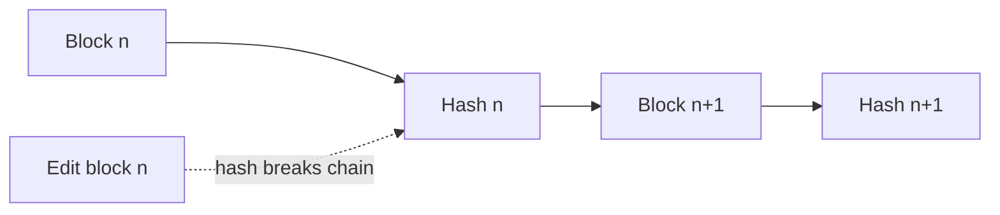
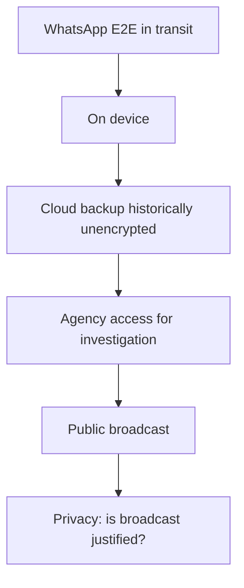
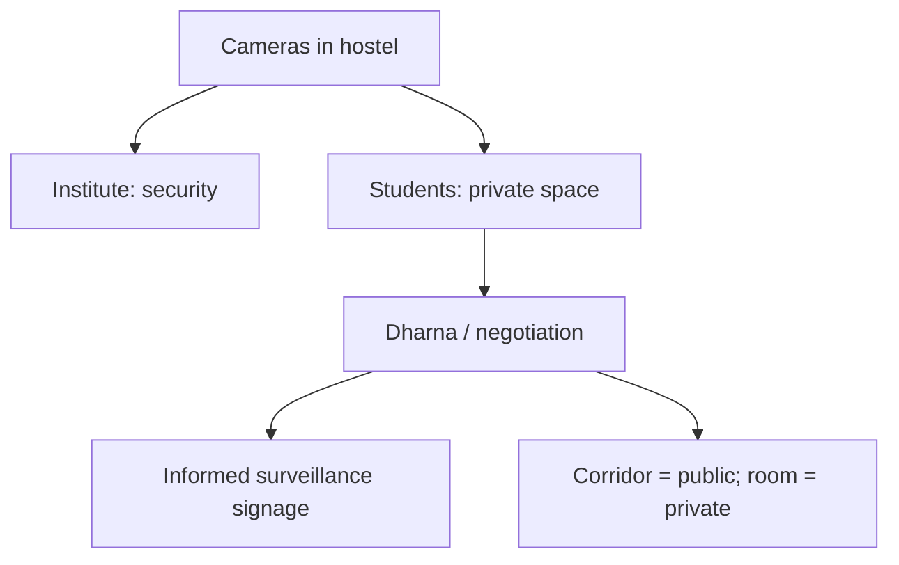
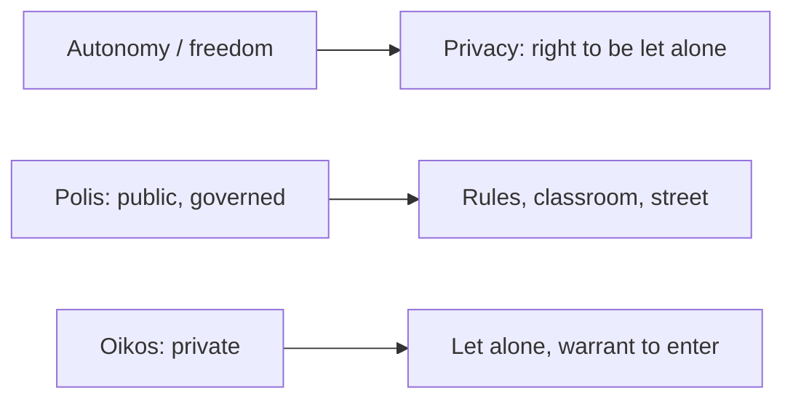

# Lecture T27: Foundations of Privacy — Part 01

**Playlist index:** 27  
**Transcript:** [27-foundations-of-privacy-part-01.md](../../transcripts/markdown/27-foundations-of-privacy-part-01.md)  
**Video:** https://www.youtube.com/watch?v=7-nnLNGBtLM  
**Week / theme:** Close encryption standards / blockchain properties; open **privacy** — WhatsApp leaks, Big Brother, panopticon, Warren & Brandeis, autonomy vs public space

## Learning objectives

- Finish the technology block: why encryption is “the heart of the matter,” blockchain’s CIA/hash story, and the **DES → 3DES / AES / RSA** ladder.
- Separate **“encryption was cracked”** from **backup / storage was in plaintext** (celebrity WhatsApp + NCB).
- State why privacy is **not an absolute right** (public interest, national security, Indian Telegraph Act 1885) and how **party-in-power vs opposition** flip the slogan.
- Use **Big Brother, Foucault, panopticon**, and the **IIT hostel CCD** fight as the surveillance teaching.
- Quote the classical definition: **“the right to be let alone”** (Warren & Brandeis, 1890, Kodak) and the Greek **polis / oikos** split; note reductionism vs coherentism.

## What this lecture actually teaches

Last sessions: technologies plus an industry/practitioner view. Some topics **reaffirm** what the industry talk already covered. He **concludes cybersecurity technologies**, then opens **privacy**.

### Technologies: access control is not enough

You saw technologies for **controlling access** to information stored or transmitted — identification, authentication, authorization. Even when access is controlled in the best way, **unauthorized access can still happen**. Next step: when data moves node A → node B, **encrypt** so an intruder **does not understand** what is transmitted.

Encryption is **very important and very critical**; he would say it is **the heart of the matter** for technology. **If there is no encryption, there is no e-commerce.** You cannot send credit-card information on a public network without security; it would not be trustworthy. **Trust in computerized financial transactions is thanks to cybersecurity using encryption.**

### Blockchain (as already covered in the industry talk)

Blockchains: current, evolving; technically a **linked list** — one block linked to the next.

Security articulation:

| Property | How |
|----------|-----|
| **Confidentiality** | Encryption; unauthorized **reading** prevented |
| **Non-repudiation** | Transaction transmitted with an individual’s **private key**; cannot deny |
| **Integrity** | In blockchain talk: **immutability** (“mutability” is the slip in the caption). Once made, a transaction **cannot change** |

**Hash function** (already discussed): once generated for a block you cannot change that hash. Change the original block and the hash changes. Hash is **permanent**, so the block is **immutable**. He praises a student slide on how hashes ensure immutability.

### Industry encryption standards

Open standard **DES (Data Encryption Standard)** developed by **IBM**: **64 block size, 56-bit key**. **Rivest, Shamir and Adleman** employed people and **cracked** it — DES no more secure; they became popular; **RSA** developed by those three (he thinks one from Israel).

Standards had to become more unbreakable:

- **Triple DES** today as a successor step
- **AES (Advanced Encryption Standard)** — most widely used; **NIST and ISO**
- **RSA** — competing standard from Rivest, Shamir, Adleman

**Key length** 128, 192 or **256** bits. More bits → more complex to break.

Textbook research table: years to break a **128-bit** encrypted message — count the years; **virtually impossible**. To his knowledge he has **not read an incident where a hacker decrypted a standard-encrypted message and read it**. Other ways of hacking exist, but **breaking the key is extremely, extremely difficult**. That is the **assurance encryption technologies provide**. Close the tech topic on that note.

### Opening privacy: not the same as “the crypto failed”

Second course topic: **Privacy**. Linkage with cybersecurity; why the linkage matters. Current happenings, especially **information privacy** (focus as they go). Difference between **privacy** and **information privacy**, and the connection to cybersecurity. Introductory class; **case discussion toward the end** (the case itself is T29; today is the setup plus a TV-chat puzzle).

**WhatsApp** claims **end-to-end encryption**. Yet a few years ago, TV showed a WhatsApp thread between two celebrities — conversation about **substance abuse / weeds**. Popular media chewed it for months.

Two questions he puts:

1. Here is an **encrypted** text **in the public domain**. If cracking encryption is “impossible,” how did a TV channel get it?
2. Even if someone accessed it, **how can a TV channel publicly transmit a private conversation?**

Student reconstruction he accepts: WhatsApp can **back up chats to Google Drive**, which was **initially unencrypted**. Law enforcement could access Google, or **Google-account credentials leaked**, then chats in **plain text**. **Not the encrypted message** — the **backup**. WhatsApp **does not guarantee** that backed-up / stored messages stay unreadable. White paper: WhatsApp encryption standard is **open**; **distinct key for every message**. NCB (**Narcotics Control Bureau**) was the agency in the crackdown.

So question 1 is answered: **do not doubt the encryption**; doubt the **backup layer**.

Question 2 is **privacy**, not crypto: can a private conversation be made public by TV? Channel still operating. During investigation, gathered texts **also became public**.

### Public interest, national security, not 100% privacy

Channels: **public interest**. Government: **national security** — **provided for even by the court**; government **can access private information** for national security. **Caveat** on tall claims that privacy is a fundamental right: **it is not an absolute right**. They will see this in regulation. **No 100% guarantee for privacy**, even with secure technologies.

**Ratan Tata / Niira Radia** conversations leaked onto YouTube; Tata went to **Supreme Court** — intrusion into private space.

**Politics:** ruling party wants control to govern; opposition questions. When opposition becomes ruling party, **they change stance**. His take: **a political party in power stresses national security; in opposition it advocates privacy rights.** Watch as power changes hands. **Grey area.**

### Big Brother, Telegraph Act, Foucault

**Big Brother** coined by Orwell in *1984*: government / the one in power. **Huge power asymmetry** between power centre and governed. Government can use technology for **security and welfare** **or abuse it for political gains**. Both are “hard fights.” Human systems, not a named-party attack.

**Indian Telegraph Act, 1885** (British): gave government access to communication between individuals — tap mails/letters. Many historical cases. You can call it draconian. **Has any government changed this?** Convenient for governance: you need information to decide. Downside: **misuse**. We live with that reality.

Philosophical layer: **Michel Foucault** (French) — first to write about **technology and power** and asymmetry; plus Orwell.

### IIT cameras: security vs privacy, panopticon

Would you agree if IIT Madras installed a **CCD camera in your room**, saying girls must be secure after a theft / incident? Room says **no / uncomfortable**. Two wants: **secure campus** and **privacy**.

**Real case:** institute put CCD cameras in **girls’ hostels** (and later floors of apartments). Girls went on **dharna**: “No CCD camera here.” Outcome as he tells it: **they won** on the room/corridor fight he is pointing at — then he asks whether cameras exist now in hostels (students: yes). Corridor vs room.

**Panopticon:** one point from which you **control the entire infrastructure**; surveillance displayed at one point; **being observed while the subject does not know**. Privacy advocates: if there is a CCD, it should be **written / known** that you are under surveillance — **informed**, mandatory notice; then it is up to you whether to be there. Compromise. Administration may monitor **its space** without entering **rooms**. **Corridor is not private space; it is public space.** Hard negotiation with students.

### “Who cares?” — postcards, collectivism, consciousness of privacy

Is privacy just talk? **Postcards** in the 1980s: you wrote the whole story; the local postman would know everyone. Movies; “Marykutty delivered.” Writers knew the **liability** of an open card.

His observation: society functioned until somebody made us **conscious** — “you are an individual, this is your private space.” **Gen X / 70s–80s:** privacy was not something you talked about; you talked in groups. Connection to a **Western individualistic** world; researchers: India is a **collectivist** society — joint families, religious communities, **information as public property**, everyone knows everything.

Aside he marks as **his observation**: social scientists argue we were not very **caste** conscious as a political category; caste as **work communities** (like engineers grouping). Natural affinities are not per se wrong; **hierarchy** brought abuse. “Everything about caste is wrong” may be a **Western lens**. We became **caste conscious** and **privacy conscious of late**.

### Origin story: 1890, Kodak, “right to be let alone”

When did privacy become prominent in **management and law** literature? **1890.** Two scholars: **Samuel Warren and Louis Brandeis**, paper **“The Right to Privacy,” Harvard Law Review**.

1890 has to do with **technology**. A company that functioned successfully a very long time and closed in the digital era: not Nokia. **Eastman Kodak**, 1890s, **photography**. One of them (entrepreneurs/celebrities) at a **private evening party**, sat close to a woman; **next day’s evening newspaper** ran the picture. Shock: private chat, now public. Photography captures a moment; newspapers make it **public**. **Power of technology to intrude into private space** became clear. Social media today is flooded with pictures we **want** to transmit — until they affect us negatively.

They defined privacy as **the right to be let alone**. Still the **classical definition**. Every individual has a **right to privacy**.

Social-science lens: **freedom**. Democratic constitutions ensure individual freedom; that freedom is part of **autonomy**. **What is at stake in privacy is autonomy of the individual.** Even without food once, you still want control of where you go, what you do, whom you talk to. A private conversation is yours; **nobody, including government, has any right to get into that space** — with the legal caveat.

**William Pitt, 1763:** even the poorest in his hut — **no government has the right to get in there**, unless by **warrant**. Simply entering is intrusion.

Some scholars: why talk about privacy separate from freedom? It is **already embedded** — **no distinct concept**. Others: there **is** a coherent distinct concept — he names the debate **reductionism versus coherentism** (caption also says “coherent delism”). Leave it there for now.

### Greeks: public vs private space

Aristotle: public space **polis**, private space **oikos**. Ever since: separate the two; individual free in private; public needs **governance, rules** — you cannot do whatever you want on the street or in a classroom. That is the public/private debate under the reductionism/coherentism heading.

## Cases and examples from the lecture

- E-commerce / credit cards as **proof you need encryption**.
- DES cracked by the RSA people; AES 128/192/256 “virtually unbreakable.”
- Celebrity WhatsApp + **Google backup** + **NCB** + TV; WhatsApp white paper (per-message keys).
- **Ratan Tata / Niira Radia** leak and Supreme Court.
- Parties swapping **national security** vs **privacy rights** when they enter office.
- **Indian Telegraph Act 1885** still convenient to every government.
- IIT **girls’ hostel CCD**, dharna, panopticon, notice vs room.
- Postcards / Marykutty; collectivist sharing vs imported privacy consciousness.
- **Kodak** party photograph in the evening paper, 1890s.
- Pitt 1763 hut; warrant exception.

## Key terms

| Term | Meaning in this lecture |
|------|-------------------------|
| Heart of the matter | Encryption — without it, no trustworthy e-commerce |
| DES | IBM 64-block / 56-bit; broken; led to RSA fame |
| AES | Widely used NIST/ISO standard; 128/192/256-bit keys |
| Immutability | Blockchain integrity via **hash** of each block |
| Backup gap | E2E in transit ≠ encryption of **cloud chat backup** |
| Public interest / national security | Media and state justifications that **qualify** privacy |
| Big Brother | Orwell’s name for the power centre that watches |
| Panopticon | Observe all from one point; subject may not know |
| Indian Telegraph Act 1885 | Legal tap of communications; not repealed |
| Right to be let alone | Warren & Brandeis 1890 — classical **privacy** |
| Autonomy | The freedom-stake that privacy is about |
| Polis / oikos | Aristotle’s public vs private spaces |
| Reductionism vs coherentism | Privacy already inside “freedom” vs privacy as its own concept |

## Formulas / frameworks (if any)

**Blockchain security mapping:** confidentiality = encryption; non-repudiation = private-key origin; integrity = hash immutability of chained blocks.

**Standards ladder:** DES (broken) → Triple DES; AES (NIST/ISO); RSA (asymmetric competitor). Break-difficulty rises with **key bits**.

**Two-layer failure model (WhatsApp TV case):** (1) transport crypto held; (2) **storage/backup** and then **publication** failed the person.

**Privacy is qualified:** fundamental-right talk **plus** national security / public interest / Telegraph Act.

**Surveillance compromise taught:** **inform** people they are watched; **rooms** ≠ **corridors**.

**Classical definition:** privacy = **right to be let alone** (1890), grounded in **autonomy**, with a **warrant** exception to enter the hut.

## Distinctions the instructor insists on

- **Access control ≠ encryption.** Encryption is what you do **after** someone may still see the bits.
- He has **not** seen a standard-ciphertext broken in the wild; **do not** use the celebrity chats as “WhatsApp crypto failed.”
- Backup / Drive / credentials are a **different surface** from E2E.
- Getting the chats for **investigation** is not the same as **TV broadcasting** them.
- Privacy is **not absolute**; national security is the court’s cave-in; **politics flips** the slogan.
- Security cameras can be **welfare** and **abuse**; panopticon is the name of one-point watch.
- **Corridor vs room** is the live privacy boundary on campus.
- Collectivist postcard culture ≠ “Indians never had privacy”; **consciousness** of the individual right is late and partly **Western-framed**.
- Kodak moment: **technology scaled intrusion**; that is why 1890 is the origin in law reviews.
- Privacy vs freedom: **reductionism** (already inside freedom) vs **coherentism** (distinct).
- **Polis** is ruled; **oikos** is where “let alone” lives.

## Exam-oriented recap

- Close tech: encryption underpins e-commerce; DES died to RSA; AES/RSA key lengths make brute force “virtual” fantasy; blockchain = encrypt + private-key non-repudiation + hash immutability.
- Open privacy with a case where **crypto worked** and **backup + media** did not.
- Big Brother / Foucault / Telegraph Act 1885 / panopticon / IIT cameras: **power asymmetry**, informed surveillance, public vs private **place**.
- Warren & Brandeis 1890, Kodak, **right to be let alone**, Pitt’s hut, Aristotle’s two spaces, reductionism vs coherentism.
- Next lectures move from this general privacy to **information privacy** (T28) and the *We Googled You* case (T29).
