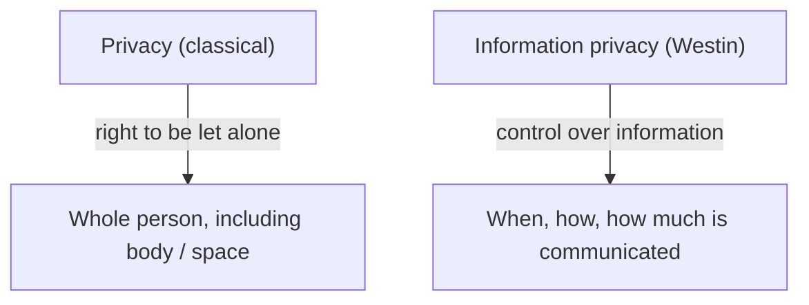
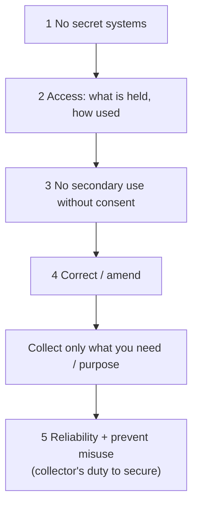
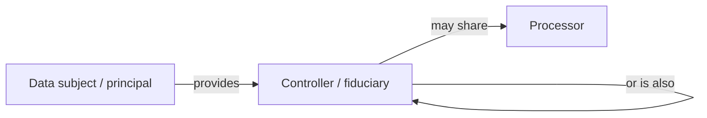
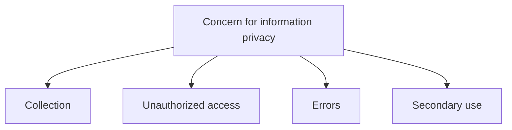

# Lecture T28: Foundations of Privacy — Part 02

**Playlist index:** 28  
**Transcript:** [28-foundations-of-privacy-part-02.md](../../transcripts/markdown/28-foundations-of-privacy-part-02.md)  
**Video:** https://www.youtube.com/watch?v=TOki4KHyVWg  
**Week / theme:** From general privacy to **information privacy** — Posner, feminist critique, Westin, FIPPs, data roles, CFIP four dimensions

## Learning objectives

- Place economic and feminist **views of privacy** beside the “let alone” tradition.
- Quote **Alan Westin’s** definition and use it to split **privacy** from **information privacy**.
- List the **Fair Information Practice Principles (FIPP / FIPPs)** as taught from the 1973 US advisory report — including Aadhaar-style **collect only what you need**.
- Name the three entities **data subject / controller / processor** (and India’s principal / fiduciary / processor).
- Measure **concern for information privacy (CFIP)** on four dimensions: collection, unauthorized access, errors, secondary use.

## What this lecture actually teaches

Continues the privacy opening. Views other than “right to be let alone,” then the shift to **information privacy**, which is this course’s focus.

### Economic view (Posner 1975)

When economists look at privacy, they do not care much. **Posner (1975):** privacy is **not important so long as there is no economic consequence**.

Does it have economic consequence? Room: data leakage of personal information **impacts the entire organization**. Yes — organizations collect and store a lot of personal information; leakage **incurs liability**. **Identity theft** may have economic consequence. There **is** economic consequence; a later session is dedicated to **economics of privacy**. Pointers only, today.

### Feminist view

He is following **Stanford Encyclopedia of Philosophy** for an overview. Feminist take: **private space is not very positive**. Defining **family** as a space nobody else can enter, no mediator, nobody overhears, actually **favours men not women**. In many communities women are vulnerable; **abuse**. With no guardian / third person, violence. Therefore a **strict private boundary is not in favour of females**.

### Alan Westin — father of (information) privacy

**Alan Westin** is often called the **father of privacy / father of information privacy**. He consistently studied the topic, books and papers. A name you cannot miss.

**His definition of privacy** (taught as the definition of **information privacy**):

> the claim of individuals, groups or institutions to determine for themselves **when, how and to what extent** information about them is communicated to others.

In other words: **information privacy is an individual’s control over one’s information.** I will decide what I disclose. That right / autonomy.

### Privacy vs information privacy (the difference he wants)

| | Privacy | Information privacy |
|--|---------|---------------------|
| Classical line | **Right to be let alone** | **Ability to decide for yourself what you share or do not share** |
| Scope | Physical, body, the whole | Control over **information** |

Information privacy became extremely important with **technology**: started with **photography / cameras**, then exploded when organizations (government and business) **collected, stored, and analyzed** individuals’ data in **databases**. Awareness about employee and citizen information in the **computer era**.

### FIPPs — 1973 foundation for later law

US government instituted the **US Secretary’s Advisory Committee on Automated Personal Data Systems**. In **1973** they produced a report — time to make guiding principles or law because data is in databases. That report gave **five principles** known as **Fair Information Practice Principles**, **FIPP / FIPPs**.

**Most fundamental foundation for information privacy.** Later they will review regulations in Europe, India, maybe North America: **FIPP is a guiding principle for all of them**.

As numbered and illustrated in class:

**Principle 1.** There must be **no personal-data record-keeping systems whose very existence is secret**. No company, **including government**, can collect and keep data about an individual **in secret**. If any agency stores my data, **I should know**.

**Principle 2.** There must be a way for a person to find out **what information about the person is in a record and how it is used**. Right to **access**. Aadhaar: can you access and is there a procedure to **change / correct**? Yes.

**Principle 3.** There must be a way for a person to **prevent** information obtained **for one purpose** from being **used or made available for other purposes without the person’s consent**.

Illustration: **Shaadi.com** (matrimonial) — a lot of private information for finding a partner. Do they share with other agencies? **Read the privacy policy.** Sometimes companies take **perpetual rights** to transmit your data anywhere. If an agency shares, it should be **with your consent**. Why regulation is getting stricter.

**Principle 4.** There must be a way for a person to **correct or amend** a record of identifiable information about the person.

**Collect only what you need (taught next, as a basic principle, with Aadhaar):** **Nandan Nilekani** — they collect only the **most basic data required, nothing more**. Purpose-driven: data used **only for that purpose**. You cannot collect extra “just for the sake of it.” If you collect extra, purpose must be clear.

**Fifth principle (as numbered).** Any organization creating, maintaining, using or disseminating records of identifiable personal data must **assure the reliability of the data for their intended use** and must **take precautions to prevent misuse**.

**Onus of securing private data is on the data collector.** Data breach is a **breach of law / of the privacy principle**. Company’s responsibility to **invest in security**. This FIPP principle **became regulation in many countries**.

### Three entities (and the GDPR / India names)

In information privacy you constantly meet **three entities** — very much in **GDPR**:

| Role | Who | What they do |
|------|-----|----------------|
| **Data subject** | Person / individual | Whose data is collected |
| **Data controller** | Agency that collects | Also **takes decisions** about the data: process, store, **share** with another entity |
| **Data processor** | The other entity (or the same) | Processes on behalf; **ICICI** shares with **Fractal Analytics** — data passes controller → processor |

Controller and processor **can be one entity**. Visualize private data **transmitted, stored, processed** across these three.

**Personal Data Protection Act** (he notes it **got dropped recently**; government **reworking**). Original document similar concepts with different words:

| GDPR-style | Indian PDP wording in that draft |
|------------|----------------------------------|
| Data subject | **Data principal** |
| Data controller | **Data fiduciary** (someone you **entrust** data with) |
| Data processor | Data processor |

### Concern for Information Privacy — a measurable scale

Privacy can be talk (rights, regulation). In **research** — consumer research and economic analysis — you need **measurable** concepts. Scholars developed a **scale / measure of privacy** (Likert or similar).

**Four dimensions** of information privacy / **concern for information privacy**:

1. **Collection** — why are they collecting? what purpose?
2. **Unauthorized access** — having collected, **who is accessing** my health data, family data, …?
3. **Errors** — can I correct wrong private data?
4. **Secondary use** — will the entity **pass my data to somebody else**, and then what?

**GATE example (errors):** a student could not log in; password linked to **date of birth**; student had entered a **wrong DOB** in the GATE database. System had the wrong date; student typed the real one. Checked ID; allowed to write because it was an **error**. Student’s concern: **I need to correct that error**.

Keep the four dimensions; that is what you mean when you talk CFIP, even if you later score them on a scale.

### Why the topic exploded; why orgs and people should worry

Historic milestones slide: evolution of information privacy **1960s to 2005 and beyond**. Westin did not live in the social-media era; concerns keep growing; countries regulate flows; **Indian Supreme Court**: privacy is a **fundamental right**. Public debate. Primary reason: **information era / information revolution** — digital life is convenient, but the **dark side** is that **information about you is flowing**, efficiently stored and transmitted, and can be **misused**.

**Why organizations:** several **data-breach** cases and **liabilities**. **Tomorrow / next class:** discussion of a **2017 data breach** (not far in history). Major concern; leadership must take information privacy seriously. Change already happening: besides **CISO**, a **special office for information privacy**.

**Why individuals:** it is my private data; I can be **harmed**; I can be **embarrassed**. Embarrassment is **pain**; can harm career, personal/family life, existence.

When he joined his PhD, he read **Simson Garfinkel, *Database Nation***: in the US, information available to **credit bureaus** that collect, process, and give **spending habits, preferences** to merchants — **profiling**. Positive for merchants, can **harm individuals**. Garfinkel highlighted cases; when they went to court, **decision in favour of the business, not individuals**. Why? Enquire. **Privacy terms and conditions** we all generally **agree**; once you agree, **no legal remedy**. **Beware of matrimonial sites.**

Gen-X aside: they shared a lot but **nobody knows** (no digital record). If **you** put it online, **everybody knows**. Social-media orgs (regulation now changing) often **do not delete** — they **retire** you but do not delete.

Hands over for the case **We Googled You** — privacy involving an **organization and individuals** (full case: T29).

## Cases and examples from the lecture

- Posner: no economic consequence → privacy “not important”; liability and identity theft say otherwise.
- Feminist: family-as-fortress hides **violence against women**.
- Westin control definition vs Warren/Brandeis “let alone.”
- Secret government files vs “I should know the system exists.”
- **Aadhaar** access/correction as FIPP-2 (and Nilekani minimization).
- **Shaadi.com** perpetual-share policies as FIPP-3 failure mode.
- **ICICI → Fractal Analytics** as controller → processor.
- India PDP draft: **principal / fiduciary**.
- **GATE wrong date of birth** as CFIP-errors.
- CISO **plus** a privacy office; 2017 breach teed up.
- Garfinkel *Database Nation*; credit-bureau profiling; courts for business; T&Cs you clicked.

## Key terms

| Term | Meaning in this lecture |
|------|-------------------------|
| Posner 1975 | Privacy matters to economists when it has **economic consequence** |
| Westin | Control over **when, how, to what extent** information is communicated |
| Information privacy | Decide what you share; not the same as physical “let alone” |
| FIPP / FIPPs | 1973 Fair Information Practice Principles — template for later law |
| Secret systems | Forbidden: the **existence** of the file must not be hidden |
| Purpose / consent | No **secondary use** without the person’s consent |
| Data subject | The individual (India draft: **principal**) |
| Data controller | Collects and **decides** (India draft: **fiduciary**) |
| Data processor | Third party (or same org) that **processes** |
| CFIP | Measurable **concern**: collection, unauthorized access, errors, secondary use |
| Profiling | Credit bureaus / merchants building a picture of you |
| Retire vs delete | Platforms may stop showing you and still **keep** the record |

## Formulas / frameworks (if any)

**Westin (information privacy):** individuals, **groups or institutions** claim to determine **when / how / to what extent** information about them is communicated.

**FIPPs as taught:**

1. No secret personal-data systems  
2. Individual can find out what is held and how used  
3. No other-purpose use / sharing without **consent**  
4. Individual can **correct or amend**  
5. (Plus minimization:) collect **only needed**, purpose-driven data  
6. Collector must assure **reliability** and **prevent misuse** — **security is the collector’s job**

(He numbered five FIPP clauses and separately stressed Nilekani-style minimization before the fifth.)

**Three-entity flow:** subject → controller (decides) → processor (optional share).

**CFIP four-factor measure:** collection, unauthorized access, errors, secondary use.

## Distinctions the instructor insists on

- **Privacy** (let alone, body and home) is not **information privacy** (control of **disclosure**).
- Economists ignore privacy **until liability / theft shows up in money**.
- A locked family door can be **protection** or a **cover for abuse** — feminist critique of “private.”
- FIPP-1 is about the **existence** of the system, not only the accuracy of rows.
- Shaadi-style **perpetual license** is exactly the **secondary-use** problem FIPP-3 targets — **read the policy**.
- **Security spend** is not a separate “IT hobby”: under FIPP it is a **privacy duty** of the collector; breach = principle broken.
- Controller **decides**; processor **handles**; they may be the same legal person.
- India’s dropped PDP bill **renamed** the roles (principal / fiduciary) without throwing the triad away.
- CFIP is how researchers **stop hand-waving** and put privacy on a **scale**.
- Clickwrap T&Cs can **kill legal remedy** even when harm is real (*Database Nation*).
- Digital natives leave a **record**; analog sharing did not.

## Exam-oriented recap

- Westin: information privacy = **control over communication of information about you**.
- 1973 FIPPs (no secret files, access, purpose/consent, correction, minimization, collector security) underlie GDPR-style law.
- Subject / controller / processor (principal / fiduciary / processor).
- CFIP = collection + unauthorized access + errors + secondary use (GATE DOB).
- Orgs worry because of **liability**; people worry because of **harm and embarrassment**; credit bureaus show the profiling machine; **We Googled You** is next.
