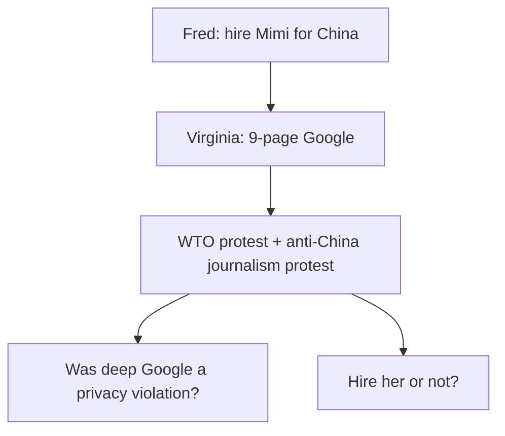
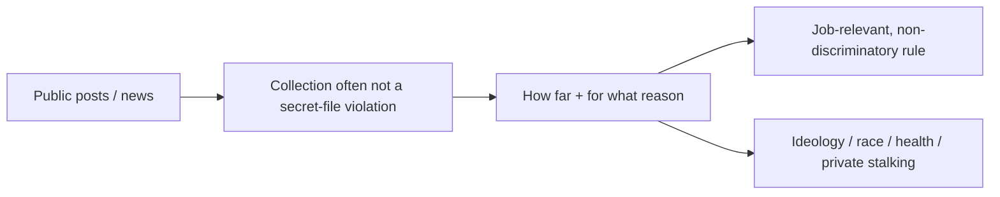
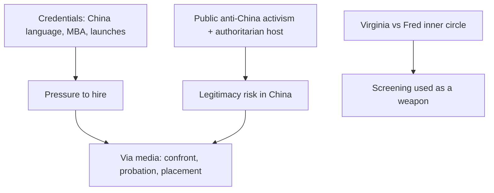

# Lecture T29: Foundations of Privacy — Part 03

**Playlist index:** 29  
**Transcript:** [29-foundations-of-privacy-part-03.md](../../transcripts/markdown/29-foundations-of-privacy-part-03.md)  
**Video:** https://www.youtube.com/watch?v=s2vt-xAbgUk  
**Week / theme:** Case *We Googled You* — employer internet screening, information privacy vs HR judgment, China legitimacy, personal digital footprint

## Learning objectives

- Reconstruct the **Hathaway Jones / Mimi Brewster** case as the lecture actually argued it (facts, stakeholders, two exam questions).
- Separate **“it was public, so not a privacy violation”** from **“on what ground may you reject, and must you disclose the Google search?”**
- List the **policy layers** the student team mapped (FCRA, GDPR consent-to-check, EEOC, NLRA, HIPAA) and the screening hygiene they proposed.
- Hear the instructor’s pushback: **authoritarian China**, Tiananmen, **organizational legitimacy**, inner HR–CEO politics, and why “keep her in the US” may **defeat the hire**.
- Translate the case into **personal** practice: do not vanish online; **Google yourself**; professional vs private accounts.

## What this lecture actually teaches

This hour is a **student case discussion** (Group 1: Shriraam, Nithish, Anna) plus **instructor critique**. The teaching object is *We Googled You* — information privacy **and** HR, in public digital records.

### Frame the students open with

“Privacy is power. What people don’t know, they can’t ruin.” In a social-media world you **cannot fully exercise** that power. Instagram, Twitter, LinkedIn, etc. expose achievements, purchases, viewing, location. Benefits plus **privacy loss**; threats already discussed (**social engineering, spear phishing**).

Companies now use that residue to **assess personality** and **job fit** **before** the interview. Survey cited (**Harris Poll, 2020**): **71%** of companies agree a social profile is an effective screen; **55%** found content that caused them **not to hire**. Another 2020 study: social media as **cheap, fast** hiring intel — free and **beyond the resume**.

**Invasive background check:** collecting more than needed to judge qualification — relationship status, **credit score**, medical history (embarrass / disclose ailment), **race / ethnicity**. In hiring this can mean **bias and discrimination**.

### Case facts: Hathaway Jones and the China bet

**Hathaway Jones:** luxury apparel retailer, sales **over $5 billion**. **Declining sales**; younger customers want **affordable clothing with flair** the firm does not provide. CEO strategy: tap the **“Chinese dream”** / luxury queues — turn around via **China**.

**Characters:**

| Person | Role in the case |
|--------|------------------|
| **Fred Westen** | CEO of the China transition; luxury-brand experience; **does not care much for rules**; wants the **best team**; new, not close to old HR |
| **Virginia Flanders** | VP HR; **lifetime** company; Fred’s “old guard,” **not inner circle**; stickler for rules; thinks Fred **sidelines internal talent**; methodical **background checks**, extra mile |
| **Mimi Brewster** | Candidate: top US colleges, ambitious, **expat from China**, **fluent Chinese**, leadership / product launches, **activist streak** |
| **John Brewster** | Fred’s friend; asks Fred to **interview his daughter** |

**Sequence:** Fred plans stores in **Beijing, Guangzhou, Shanghai**; needs a manager. First impression of Mimi: extremely impressed, **already decided** he will hire, does not want to lose her. Forwards name to HR. Virginia Googles **nine pages** (most people stop at three). **Page nine:** Mimi led a **WTO protest march** and protested **Chinese authorities** over the death of a **dissident journalist**.

Fred: if you search deep enough you get **dirt on anybody**; he remembers his own wild youth; **leadership involves taking risks**; activist history can **be** leadership. He wants a **second interview**. Virginia: Google searching **might not be entirely legal**; asks for **company lawyers**. Case ends on two questions.

### Two questions the case leaves

1. Was the company **right to dig deep** on the internet / is it a **violation of Mimi’s privacy**?
2. **Should the company hire Mimi**, with arguments both ways.

### Business impact the team walks (hire vs don’t)

**If they hire:** years later competitors (or others) surface the protests and **attack the American firm inside China**, in a **US–China** trade-war climate. Reputation / image; **customer acquisition and retention** costs. Mimi herself had said Chinese customers are **high-context**, loyalty, **Confucian**. A “person of their kind” at an American firm who protested **against the Chinese government** could hurt buying. Cost of undoing damage high; **Chinese government regulatory** risk.

**If they do not hire:** excellent candidate may learn she was rejected for **old protests** and **sue** — civil / privacy theories of **bias, discrimination, ideology, favouritism**. Legal exposure the other way.

Two aspects: **information-privacy / individual privacy**, and an **HR** question.

### Room on question 1 — “it’s public”

Students in the audience: **not a violation** because it is already in the **public domain**; she is not hiding it; press coverage she would have known; objection would have been to the **press**, not to a later reader. Company always did **background checks** (references, talking to people); Google is an additional or substitute step. **Long time gap** (about a **decade**) between protests and interview — she may not even remember the digital residue.

Team takeaway: companies have a **right to screen** public social/internet information, but **two lines blur**:

1. **How far** they go to collect  
2. **On what rational** they hire or reject — must be **professional**, not **personal ideology / belief**

Virginia’s actual line: they are still studying **legal and privacy implications** of internet searching; “**It’s a bit risky letting her know that we are considering not hiring her because we Googled her.**” Why the fear if “public is OK”? Room: rejecting **solely** on a decade-old Google hit can still be **discrimination**; personality is **dynamic**. Also: they may **lack a defined screening framework** — she does not cite a checklist, she just conferences Fred.

### Policy stack the team wants in a written screening policy

A well-drafted **background + internet-profile screening policy** should comply with **multiple layers** of information privacy: country data-protection rules, constitutional privacy, **local law of the jurisdiction**.

Acts they put on the slide (Western / US-centric because Hathaway Jones is Western):

| Instrument | Point they stress |
|------------|-------------------|
| **FCRA** (they say Foreign Credit Rule Act / consumer-credit rule) | How orgs use consumer / candidate information, credit history, criminal records; **no bias** in that use |
| **GDPR** | If using information of **EU citizens**, **explicit consent** **before** background check; **make the person aware** the check will happen |
| **EEOC** (Equal Employment Opportunity) | Do not discriminate on protected attributes |
| **NLRA** (National Labor Relations Act) | Protects employees’ **protests / unions**; do not fire or reject **for that protected activity** (more Western-labour than China) |
| **HIPAA** | Personal **health** information off-limits; cases of firms collecting health data, firing for future productivity, then **sued** |

Other hygiene they recommend:

- Limit internet search to **publicly available** information  
- Avoid **private** social spaces (deep stalking of locked Facebook/Instagram)  
- Information must be **relevant to the opening**  
- **Transparent** process; **tell candidates** there will be background + internet screening  

Then they can confront Mimi **without** ad-hoc lawyer panic.

### Question 2 — hire or not

Team’s three options on screen; they and a show of hands prefer **option 3: confront Mimi**, hear her side. **Not everything on the internet is true** (fake / manipulated). Then decide.

Instructor: even after confront, it is still **hire or don’t**. She may say “I was an activist at Stanford; that is what I believe.” Credentials still scream fit for **China**: language, **Stanford MBA**, similar experience, **female** — all positive. If not hired, **competitors hire her**. He does not think the team has fully seen the **other** side: it remains **in the public domain that she did anti-China activism**.

Student add: firms exist that **erase** net dirt and build a good image — if the company **wants** her on performance.

**Inner politics:** HR and CEO **not in good terms**. Virginia may be negative because Mimi is **“Fred’s person.”** “Organization is a complex entity.”

Team branches after confront:

- Try to **remove or edit** news/Facebook posts, or **flood positive / diplomatic** China content so it outranks the old protests  
- **Do not let her go**, but **do not send her to China** — keep her in the **US** overseeing overseas strategy, maybe push later if the climate liberalizes  

Instructor: that **may defeat the purpose** — she is being hired **for China**; **local culture is what she knows**. Via media (hire, train, **probation**) is thinkable, but keep governments in mind.

### Instructor close: governments and legitimacy

Governments can be “very, very, very” negative about individuals who **question their authority**. **Chinese government is authoritarian, not democracy.** **Tiananmen Square:** they **crack down and kill students** who protested. **No place for protest**; anyone who questions authority is **not welcome**.

Analogy: how hard for a **Pakistani** citizen (even a **Pakistani-born German** scholar, parents in Pakistan) to come to **India** for a conference — almost impossible; origins must be informed; delays and near-denials. **This is how governments function.**

Two lenses that both matter:

1. **Credentials** — if the candidate is good, you should select (straightforward)  
2. **Political / legitimacy** — for an organization to **function legitimately in a place**, look at both  

That is the **complexity** of the case.

### Personal digital-footprint advice (Anna’s close)

Assume **almost 100%** of employers will check. If something embarrassing is ten years old, **do not just delete the account**: survey — **one in five** employers, finding **nothing** online, think the person **has something to hide** and are **less likely to hire**.

Do:

- **Clean and have a good presence**; post relevant professional achievements  
- Mantra of the case title: **Google yourself** on a schedule (every few months)  
- Professionals: **Google Alert on yourself**  
- **Two accounts:** public professional vs locked private (close friends/family)  
- **Be mindful** — what is online **remains**, even if you delete  

Instructor: good job bringing facts and three options; his concern is that confront still collides with **China as a political space**.

## Cases and examples from the lecture

- Harris Poll 2020: 71% screen social; 55% rejected because of content.
- Hathaway Jones $5B luxury, China cities Beijing / Guangzhou / Shanghai.
- Virginia’s **nine-page** Google; WTO + dissident-journalist protests.
- Virginia quote: risky to admit “we might not hire you **because we Googled you**.”
- GDPR: **tell EU candidates** before you background-check.
- HIPAA firing-for-illness lawsuits as a warning not to scrape health.
- Reputation-repair vendors; dual social accounts.
- Instructor: **Tiananmen**; Pakistani-origin German scholar vs Indian visa practice.

## Key terms

| Term | Meaning in this lecture |
|------|-------------------------|
| Invasive background check | More personal data than the job needs (status, credit, health, race) |
| *We Googled You* | HBR-style case: luxury firm, China expansion, Google dirt on the hire |
| Public domain argument | If press already published it, reading it is not secret surveillance — **but rejection reason still regulated** |
| Screening policy | Written, layered, job-relevant, transparent — so HR is not improvising with lawyers |
| GDPR (as applied here) | **Awareness / explicit consent** before checking **EU** people |
| EEOC / NLRA / HIPAA / FCRA | Anti-discrimination, protected concerted activity, health data, credit/consumer data |
| Legitimacy | Firm’s ability to operate in a host polity (China) without political blowback |
| Digital vanishing | Empty search can look like **hiding**; worse than a cleaned professional page |
| Google yourself | Recurring self-audit (+ alerts) of what employers will see |

## Formulas / frameworks (if any)

**Two case questions:** (1) privacy of deep Google on **public** traces; (2) hire / don’t / confront, under **China risk** and **discrimination risk**.

**Screening policy layers:** data-protection statute + constitutional privacy + local law + (for this firm) FCRA, GDPR, EEOC, NLRA, HIPAA.

**Collection limits taught:** public, **job-relevant**, no private-profile stalking, **notify** the candidate.

**Decision frame the instructor wants:** credentials **and** host-government politics **and** internal HR–CEO games — not a single “privacy yes/no.”

**Personal hygiene:** visible professional presence, self-search, alerts, split public/private, assume permanence.

## Distinctions the instructor insists on

- **Public ≠ anything-goes rejection.** Reading page nine may not violate secrecy; **rejecting for ideology, race, health, or union-like protest** can still be illegal or illegitimate.
- Telling Mimi “we Googled you” is a **separate** legal/PR risk from doing the search.
- Confronting her does **not** dissolve the **China** problem; the activism **stays Googleable**.
- Parking her in the US **may save face and lose the reason she was uniquely valuable**.
- **Authoritarian** host vs **democratic labour statutes** (NLRA) — the slide stack is Western; **Tiananmen** is the instructor’s correction.
- Inner-circle **politics** can dress up as “privacy diligence.”
- Erasing your whole footprint is not “more private” to employers — it reads as **concealment**.
- Fake internet content exists — **hear the candidate** before treating Google as a court.

## Exam-oriented recap

- *We Googled You*: Fred wants Mimi for China; Virginia’s nine-page search finds old **anti-WTO** and **anti-China-government** protests; lawyers enter.
- Privacy analysis: **public records / press** vs **how far** and **why you use** them; write a **layered screening policy**; GDPR-style **notice**; keep health and protected classes out.
- Business analysis: hire → China legitimacy and competitor attacks; don’t hire → **discrimination** suit and she goes to a rival.
- Instructor’s exam-level complexity: **credentials vs authoritarian politics vs org politics**; via media (confront, probation) without pretending the host state is a liberal campus.
- For you as a candidate: **Google yourself**, keep a **professional** public trail, do not assume delete = gone.
