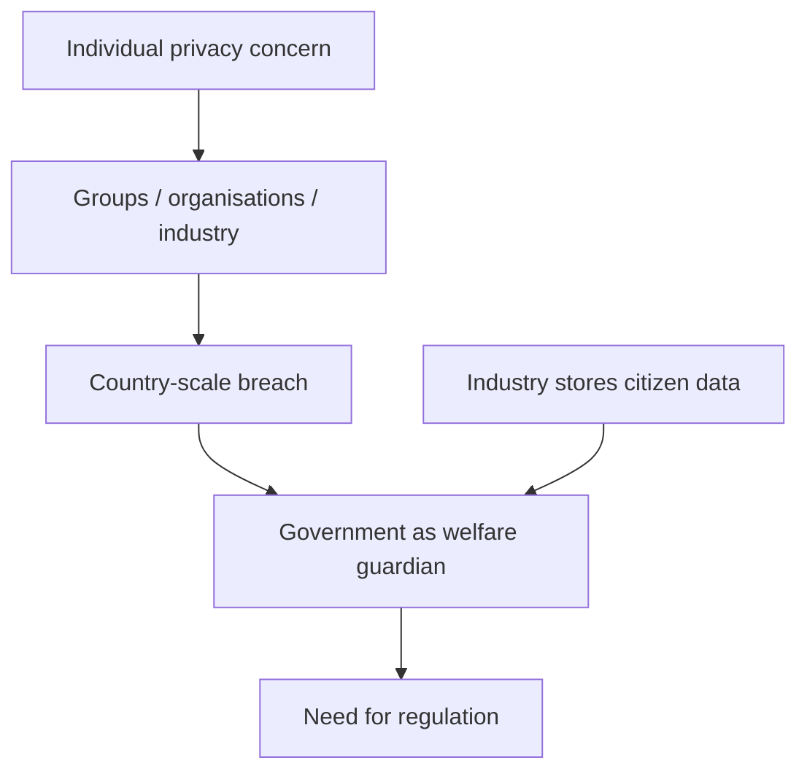
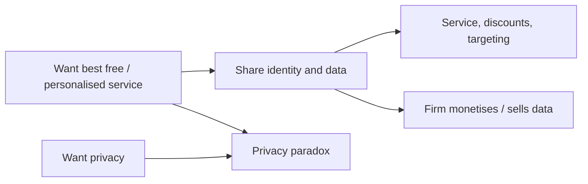
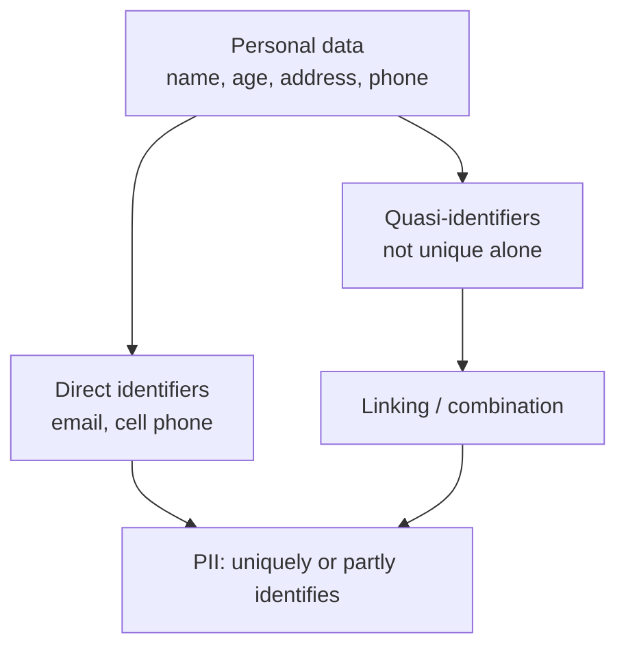

# Lecture T30: Privacy Regulation — Part 01

**Playlist index:** 30  
**Transcript:** [30-privacy-regulation-part-01.md](../../transcripts/markdown/30-privacy-regulation-part-01.md)  
**Video:** https://www.youtube.com/watch?v=g_G2bFrkeHY  
**Week / theme:** Privacy regulation — why law is needed; lock-in, unfair consent, privacy paradox, anonymity vs privacy, PII

## Learning objectives
- Explain why privacy concern, once it is collective, becomes a regulatory problem for the state.
- Show how platform **lock-in**, unread privacy clauses, and immediate gratification produce one-sided data exchanges.
- Define the **privacy paradox** as the clash between wanting a personalised experience and wanting privacy.
- Distinguish **right to privacy** from **right to anonymity**, using Derek Smith / ChoicePoint.
- Separate **personal data**, **personally identifiable information (PII)**, and **quasi-identifiers**.

## What this lecture actually teaches

### From cybersecurity to information privacy
The course has moved from the cybersecurity space into information privacy. Many concepts are shared, but privacy is a distinct concern: individuals, groups, and organisations worry about personal privacy and about **information privacy**. How well (or how badly) an organisation addresses that concern is itself part of the information privacy domain. The two fields are closely related; the session’s case is meant to show what organisations should and should not do, as future managers.

Privacy starts at the individual. When it becomes collective it scales to groups, organisations, industry domains, and then the country. Some breaches affect **millions** of people. That is not one person’s problem; it has a pervasive effect. Organisations store **citizens’ data**. The role of government is the welfare of citizens. If industry is not regulated, people’s welfare is affected. That is the warrant for regulation in this session and in the case.

### Hotel California and lock-in
The instructor opens with the Eagles song *Hotel California*: “you can check out anytime you like but you can never leave.” In management literature that is **lock-in**. You enter a product or service and cannot leave because **switching cost** is inhibitive. Preferred banks, Amazon, mobile operators, operating systems, and social-media graphs all work this way. Lock-in is built into digital-platform strategy: large participation is how the platform is built, and the platform does not want to let you go because connections are strong.

In the digital world people thought they could sign out anytime; they cannot. Disclosed information and connections are effectively forever. One choice is not to go there — to stay **anonymous**. The instructor’s German IS collaborator uses neither WhatsApp nor any social-media account. You can opt out of email and even cell phones; people lived that way for decades. Those “necessities” are created for you. Whether you share data for a service, or give Google a search key, is your choice. Once you do, the search is linked to you and becomes part of your profile.

The cartoon line the instructor likes: “I like privacy but it makes it difficult to enjoy life.” You can still be alive but not “have a life” as businesses define it. Shrewd entrepreneurs have thought through needs and built exchanges around them.

### Unfair privacy agreements and immediate gratification
Yesterday’s matrimonial-site example returns. Users click “I agree” on a long privacy statement they do not read. The Shaadi-style fine print, as read in class: with respect to content submitted on publicly accessible areas of the site, including contact details, the user **unconditionally and irrevocably** grants Shaadi the licence to use, distribute, reproduce, modify, adapt, publicly perform and publicly display that content. It is a **perpetual** agreement. You did not pay them money. The exchange is data for service.

Gmail is “free,” but in business there is no free lunch. These are **non-monetary exchanges** on digital platforms. That is why it is hard to win a data-exchange case in court: you legally agreed, and they have evidence. The other side is design: the legal document is long; you have a need to gratify. Economists call this **immediate gratification**. You are in a hurry, a friend has the service, you click. Platforms exploit that. Luca and Bazerman (Harvard Business School; book on online experiments) report a fact the instructor highlights: it takes **76 working days** to read and understand a typical privacy policy. Even if you read some of it, it is legal language you are not trained to parse. If you want the service, you agree. It is **by design**. Privacy agreements are one-sided. Regulation is trying to accept that this is not fair play. GDPR, later in the course, tries to address this **unfair exchange of information**.

The same scholars report that when you sign into Facebook you are a participant in online experiments almost every day — which profiles you dwell on, which ads you respond to. Research involving human subjects is supposed to take **informed consent**. Platforms do not. They also have legal cover: telling you it is an experiment can defeat the experiment.

### Fairness vs the need to socialise
On the user side, regulation is absent or still evolving, and it favours corporations that exploit desires through platforms. There is a fairness question. On the other side, very few people actually want to be let alone. Privacy is the **right to be let alone**, but people do not want to be let alone; they want others to know about them. That is a social need. Social life has moved from physical to virtual, but the need is human. People make **selective disclosure** — a Facebook profile is an impression or a statement about the self you want to be. Platforms are designed to fulfil that desire, and in that desire you disclose a lot.

### Loyalty programs: bribed to share
In stores, physical or online, loyalty no longer needs a card; a **cell phone number** is the primary key. Retailers insist on it; it is not mandatory. The instructor stops sharing (“I do not have a phone number”) and can still buy. Once the number is shared, they track what you buy: behaviour and preferences become a profile. With a loyalty program (his example: Titan), points, discounts, and money-back come with disclosure — sometimes Aadhaar, phone, descriptive data. Nobody compels you. You sign in for benefits. The cost is monitoring. “You get **bribed** to share your data”: the discount is a small remuneration for letting them know you. One use is targeted service and product recommendation. The other is that **data has monetary value** and can be sold. Many US retailers, the instructor has read, make **more money from data than from their products**. People agree because they need the service. They raise privacy concerns only when they are affected by the trade of data.

### Privacy paradox
This is the **privacy paradox**. People want both: the best free Gmail experience *and* privacy, which obviously cannot happen. Gmail shares what you write with advertisers. An individual may not read your mail, but the **text is scanned**. You want service; they make money with your data. It is a designed exchange. It is conflicting to claim privacy while getting something that is paid for with your data.

Personal experience and privacy are conflicting needs. You want the best personal experience in online services and you also want privacy, which is not possible: “if you have to take something from the top, you raise your hand, something falls off.” Can the paradox be resolved? That is a difficult question. Sharing identity buys privileges; the decision is yours. What is worse is **government**: as a citizen there are **mandatory disclosures**. Government’s view is that to secure you in a country, it needs to know you. You cannot completely hide yourself anywhere in the world.

### Derek Smith, ChoicePoint, and the right to anonymity
Derek Smith, CEO of ChoicePoint, said this when his company — a credit bureau whose breach in **2005** put privacy into public debate and policy — was under fire. Today’s case is a similar 2017 credit-bureau story. Critics said the industry that collects, processes, profiles and sells individual information for credentialing is illegitimate because it cannot protect the data, and that identities should be kept anonymous. Smith’s response, as taught here:

> You have a right to privacy but in this society we can have a right to anonymity.

**Right to privacy** and **right to anonymity** are two different things. You have a right to privacy, but you cannot be anonymous on the planet. You have to belong to some country. Territory is how humanity is organised (the instructor’s colonial aside: the British tried to make most of the world theirs; you still belonged to a colony). To be affiliated and to enjoy the privileges of a country or an organisation, you have to say who you are. Some basic information needs to be with the government. That is the side we fail to see.

### Personal data, PII, and quasi-identifiers
Before privacy / anonymity / secrecy are defined in the next lecture, the class needs **personal data** and **personally identifiable information (PII)**.

**Personal data** is any data related to you that is yours: name, age, place of birth, address, cell phone.

**Personally identifiable data** is data able to **uniquely identify**. Not all attributes uniquely identify (as in databases). Name is not a unique identifier. Combine attributes and they can become one. Identifiers that are not uniquely identifying by themselves are **quasi-identifiers**. Name is a quasi-identifier; add age and address and linking can almost distinctly identify you. There are algorithms that identify people from disclosed data by linking. Email and cell phone are very much identifiable. Data points that have the potential to uniquely identify you, or partly identify you, are identifiable data. More PII concepts come with GDPR.

## Cases and examples from the lecture
- *Hotel California* as the lock-in metaphor; Amazon, banks, mobile operators, OS, Facebook.
- German colleague with no WhatsApp and no social-media accounts — choosing anonymity by opting out.
- Shaadi.com perpetual, irrevocable content licence on click-wrap “I agree.”
- Luca and Bazerman: **76 working days** to read a typical privacy policy; Facebook as daily unconsented experiment.
- Titan loyalty / phone number as primary key; US retailers earning more from data than merchandise.
- Gmail “free” mail scanned for advertising.
- ChoicePoint 2005 (Derek Smith) as predecessor to the 2017 credit-bureau case.

## Key terms
| Term | Meaning in this lecture |
|------|-------------------------|
| Lock-in | Enter a product/service and cannot leave; switching cost prohibits exit. Built into platform strategy. |
| Switching cost | Cost of moving to another product or service; when high, you stay. |
| Immediate gratification | Economist’s name for rushing to the service and clicking agree without reading. |
| Non-monetary exchange | You pay with data, not money; still an exchange (no free lunch). |
| Right to be let alone | Classic privacy formula — which most people do not actually want, because they want to socialise. |
| Selective disclosure | Choosing what a profile shows in order to make an impression. |
| Privacy paradox | Wanting both the best personalised/free service and privacy; the two conflict. |
| Right to privacy vs anonymity | Privacy is not invisibility; Smith: you cannot have a right to anonymity in this society. |
| Personal data | Any data that is yours and related to you. |
| PII / identifiable data | Attributes that uniquely or partly identify you. |
| Quasi-identifier | Not unique alone (e.g. name); combining several can identify. |

## Formulas / frameworks (if any)
- **Regulation warrant:** individual concern → collective/pervasive breach → citizen-data held by industry → government welfare role → regulate.
- **Unfair consent stack:** lock-in + unread legal text + immediate gratification + one-sided click-wrap → need for regulation (GDPR later).
- **PII construction:** quasi-identifiers + linking ≈ identification.

## Distinctions the instructor insists on
- Cybersecurity and information privacy share concepts, but privacy concern is its own domain — how well you address it is the privacy problem.
- Lock-in is not mere preference; it is a designed platform strategy (Hotel California).
- “Free” digital service is not free; it is a non-monetary data exchange, which is why court challenges fail once you clicked agree.
- Privacy agreements are one-sided **by design**; fairness, not just individual carelessness, is the regulatory issue.
- Very few people want to be let alone; the social need and selective disclosure are why platforms harvest so much.
- You raise privacy concerns when the **trade of data affects you**, not when you take the discount — that is the paradox.
- **Right to privacy ≠ right to anonymity.** You cannot be anonymous on the planet and still claim the privileges of a state.
- Name is personal data and a quasi-identifier; it is not, by itself, a unique identifier.

## Exam-oriented recap
- Regulation is needed because breaches are pervasive, organisations store citizen data, and government’s job is welfare.
- Platforms lock users in; privacy policies take ~76 working days to understand; click-wrap is not fair play.
- Privacy paradox: personalised experience vs privacy; both are wanted, both cannot be fully had.
- Mandatory state disclosure is the harder case of the same tension.
- ChoicePoint/Smith: privacy yes, anonymity no.
- Personal data vs PII vs quasi-identifiers; linking can finish the identification GDPR will later regulate.
