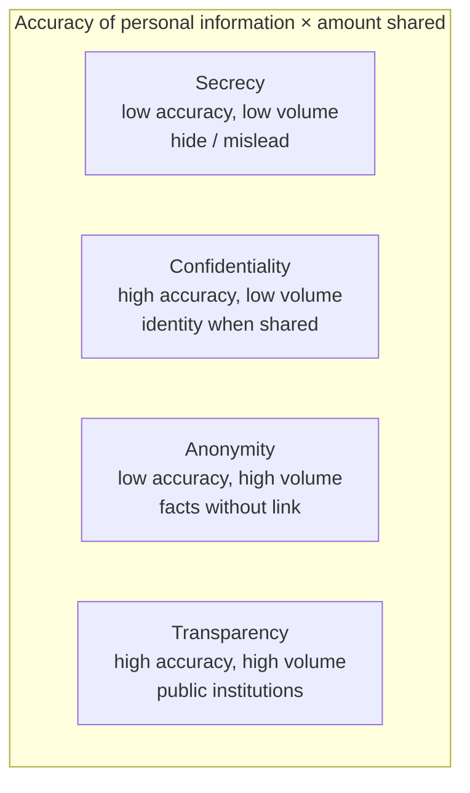
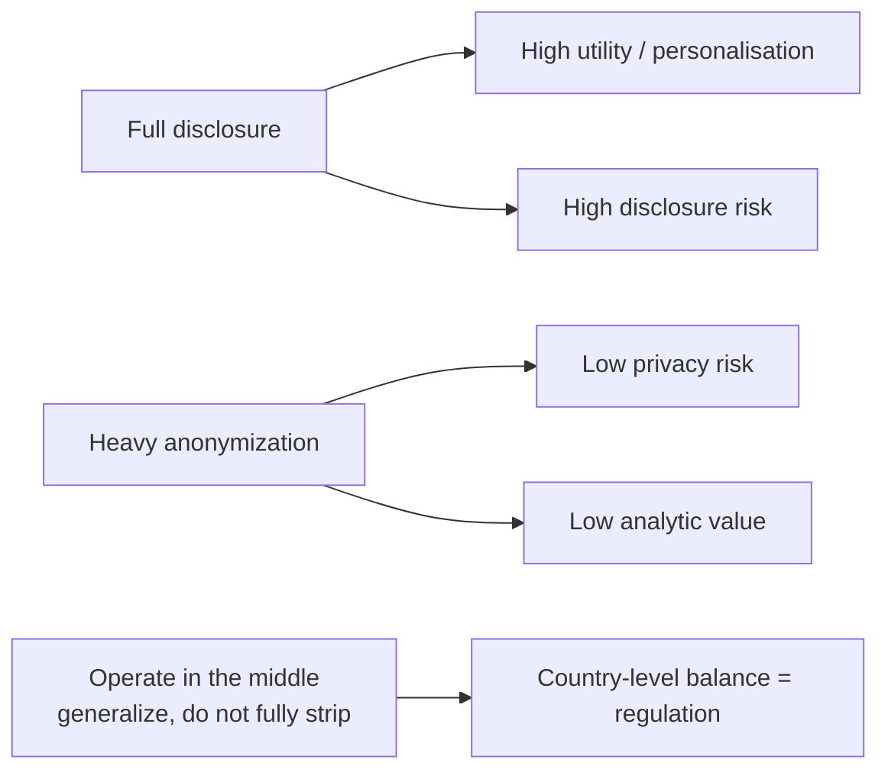

# Lecture T31: Privacy Regulation — Part 02

**Playlist index:** 31  
**Transcript:** [31-privacy-regulation-part-02.md](../../transcripts/markdown/31-privacy-regulation-part-02.md)  
**Video:** https://www.youtube.com/watch?v=nBr733H_xH4  
**Week / theme:** Privacy regulation — anonymity, secrecy, confidentiality, k-anonymity, risk–utility, the regulatory landscape

## Learning objectives
- Separate **anonymity, secrecy, confidentiality, transparency, privacy, and security**, which the instructor says are often confused.
- Place total anonymity, **pseudo-anonymity**, and identifiability on one scale, including Aadhaar’s pseudo identifier.
- Apply three privacy-preserving data-mining techniques: **randomization, anonymization, encryption**.
- State **k-anonymity** (Sweeney), and distinguish **suppression** from **generalization**.
- Use the **risk–utility (R–U) map** as the analytics trade-off that regulation must govern.
- Contrast US sectoral law, FIPPs/OECD principles, the EU **directive**, and the 2018 EU **regulation**.

## What this lecture actually teaches

### Related concepts, from the instructor’s research paper
Anonymity, secrecy, confidentiality, and security get mixed. Definitions used here come from the instructor’s research paper.

**Anonymity** is the ability to conceal a person’s identity. Individuals can choose to be **totally anonymous**, **pseudo-anonymous**, or **identifiable**.

Recent discussion: sharing Aadhaar number with business entities. If you share the Aadhaar number directly, business can misuse it or use it as identification (e.g. a cell-phone service profiling you). Aadhaar’s response is a **pseudo identifier** — a number that is not the Aadhaar number, issued by Aadhaar. Aadhaar can link that number to your number; a business entity cannot. That is **pseudo-anonymity**, not pure anonymity, because **an agency can reconstruct your identity**. Hiding personally identifiable information is anonymization / anonymity.

Classroom example: analysing how well a class is doing. Students refuse identity. Grades can be released numbered 1, 2, 3… without name, roll number, or email. **Grade is not personally identifiable data**; it is a fact / a measure (as in a fact table). You can give the measure and anonymize the person. When a company must share individual data for mining or outsourced analytics, anonymizing to protect identity matters. There are anonymization techniques (next slides).

**Secrecy** is **intentional concealment of information**: you not only want to be anonymous, you do not want to disclose anything, and you can **mislead** people.

Confidentiality and security sit on the 2×2 below. **Confidentiality is typically used in the organisational context; privacy is typically used at the individual level**, generally in the literature.

### Four quadrants: accuracy × amount shared
X-axis: **accuracy of personal information**. Y-axis: **amount of personal information externalized or shared**.

| | Low amount shared | High amount shared |
|---|-------------------|--------------------|
| **High accuracy** | **Confidentiality** — share little, but when you share you share complete information **with identity** | **Transparency** — almost full information, accurately (public institutions “should be transparent”) |
| **Low accuracy** | **Secrecy** — share little volume, and what is shared may be incorrect or misleading | **Anonymity** — share a lot of facts (e.g. all grades) that **cannot be accurately linked** to you |

Transparency is the fourth quadrant: high accuracy and high amount — “100 percent transparent.” The opposite is secrecy (countries; personal secrets; hide or mislead). Anonymity is the first quadrant: accuracy of personal information is low, but you may share a lot. Confidentiality is the other way: extent of sharing is limited, but the share is complete and identified.

### Incognito browsing is not anonymity
Browsers offer “incognito,” “private browsing,” each with its own term. Does it ensure anonymity? The **service provider still knows**. What it does not keep is history on the **local machine**: no history, no stored passwords, no local record after you exit. It is anonymity **to some extent**, when some users want it — not against the site or the provider.

### Privacy-preserving data mining — three techniques
Companies store large personal data. If it is shared with an external entity, or analytics is **outsourced**, it goes to a **data processor**. To protect individuals, hide identity from external providers when the collector/owner is privacy-conscious. Sharing can be totally anonymous, pseudo-anonymous, or identifiable (full information).

Three main techniques:

1. **Randomization**
2. **Anonymization**
3. **Encryption**

**Randomization:** before sending data to the processor, randomize it. If \(x_i\) is the value of a sensitive attribute, add a random term \(e_i\), noise drawn from some distribution. The processor does not receive the same data; it may receive distributional properties, not exact values.

Anonymization is the technique the class spends time on.

### k-anonymity (Sweeney)
Taken from a paper by **Sweeney** (Harvard). Definition, to be looked at carefully — like k-means, there is **k-anonymity**:

> Each release of data must be such that every combination of values of quasi-identifiers can be indistinctly matched to **at least k individuals**.

\(k\) is a value. Roll number uniquely identifies (distinct). Place of birth “Maharashtra” + birth year 1999: if only one such person, you are unique; if two, **k becomes 2**. Blur further to “Maharashtra” only, eight people in a large class — still some identification, anonymized to extent \(k\). **\(k\) is the extent of anonymization.**

Two techniques in k-anonymization:

| Technique | What the lecture shows |
|-----------|------------------------|
| **Suppression** | A column is **completely removed**. Table 2 has no name column. Potential to identify uniquely or closely → drop the column. |
| **Generalization** | Coarsen a value. Birth column: date and month removed, **year only**. Zip code: last digit removed — disclosed, but part removed. |

The instructor slips “separation and generalization,” then corrects: **suppression and generalization**.

Analytics still needs some individual characteristics, so the release tries to share “born in this year” without full date of birth. Generalization strikes a balance between analytic value and identifiability.

**Alice example (the two tables).** Table 1: Alice, race not disclosed, date of birth, sex, zip — together a unique record; the sensitive **measure** is disease = flu. Table 2: first two records share the same identifiable tuple (blank, 1965, M, 0214). Flu can be attributed to record 1 **or** 2. Indistinctly mapped to two people: **k = 2**. Purpose of anonymization: remove unique identification of a fact with an individual.

**Aadhaar / credit-card last 4 digits.** Wallet shows last 4 of Aadhaar or card (e.g. 6709). Is that suppression or generalization? Class gets it wrong if they say suppression. Suppression **removes a column as it is**. Zip and year-of-birth are generalization: you disclose, but remove part. Last-4 is **generalization**.

### Linking — the limitation
Quasi-identifiers plus more collected data can link multiple records and uniquely identify. That is **linking**. Analytics does this; there are algorithms for reverse-tracking identity after anonymization, especially in medical and government contexts. From anonymity you link more data and create identity.

### Risk versus utility — R–U maps
Last-but-one slide: **risk versus utility of data**, R–U maps. Privacy risk / **disclosure risk** is very low when disclosure is less, and goes up when you fully disclose (privacy very low). Utility / analytics insights are then very high. If you anonymize, **value of analytics suffers**: you cannot profile customers or recommend products; individual personalisation is not possible. Operate in the middle so analytics is not completely diluted and privacy is still protected. Generalization is that middle: some identity remains, not complete.

### Why this becomes regulation
Given individuals’ and organisations’ privacy concern, and organisations’ need to deliver services, the balance must be done at **country / governance** level. That is **regulation**. Privacy regulations are still emerging.

- **FIPPs** (Fair Information Practice Principles) in the United States were discussed yesterday. **Guiding principles, not a regulation.** OECD regulations / principles in the same family.
- European Union: **no regulation till 2018**. It was a **directive** — EU data protection directive — **not a law**. **Regulation means it is enforceable by law.** In 2018 the directive’s **D was replaced by R**: it became a regulation.
- The world is changing because of huge digital storage and flow; regulating data has become a necessity.
- **United States:** no one regulation binding or overarching for all personal-data exchanges. **Domain-specific** rules, e.g. **HIPAA** for healthcare. Guidelines and regulations vary **state to state**; states can have their own laws — another dimension of complexity.
- **GDPR** is very broad-based; most countries, including India, and some US states try to emulate it. Next sessions: GDPR, then the Indian context, with cases.
- Today’s case is from the US because the class is focusing on America; the case also shows **limitations because there is no country-wide regulation**.

## Cases and examples from the lecture
- Aadhaar pseudo identifier vs raw Aadhaar number shared with a telco.
- Class grades released as 1…n with names stripped — measure without identity.
- Incognito / private browsing: local machine vs service provider.
- Live k-anonymity drill: Maharashtra + birth year 1999; k = 1 vs k = 2 vs k = 8.
- Sweeney-style tables: Alice, flu, suppression of name, generalization of DOB and zip; k = 2 on the first two rows.
- Last-4 Aadhaar / credit card as generalization, not suppression.
- HIPAA; FIPPs vs GDPR-as-regulation.

## Key terms
| Term | Meaning in this lecture |
|------|-------------------------|
| Anonymity | Ability to conceal identity; share facts that cannot be accurately linked to you. |
| Pseudo-anonymity | Substitute ID (Aadhaar-issued) that an agency can map back; business cannot. Not pure anonymity. |
| Secrecy | Intentional concealment; may mislead; low volume and low accuracy. |
| Confidentiality | Limited sharing; when shared, complete and identified. Organisational word. |
| Privacy | Typically the individual-level counterpart of confidentiality. |
| Transparency | High accuracy and high volume shared (public institutions). |
| Randomization | Share \(x_i + e_i\), not \(x_i\); processor sees noise / distribution, not exact values. |
| k-anonymity | Every quasi-identifier combination matches at least k people. |
| Suppression | Remove a column entirely. |
| Generalization | Coarsen (year not full DOB; truncated zip; last-4 of Aadhaar). |
| Linking | Re-identify anonymized records by joining more data. |
| R–U map | Trade-off of disclosure **risk** vs data **utility**. |
| Directive vs regulation | EU pre-2018 D = not enforceable as such; 2018 R = law. |
| FIPPs | US Fair Information Practice Principles — principles, not a statute. |

## Formulas / frameworks (if any)
- **Randomization:** processor receives \(x_i + e_i\), \(e_i\) random noise from some distribution.
- **k-anonymity:** each released quasi-identifier tuple is indistinctly matched to ≥ k individuals; k is the extent of anonymization.
- **2×2:** accuracy × amount shared → secrecy / anonymity / confidentiality / transparency.
- **R–U:** more disclosure → more risk and more utility; regulation is choosing the operating point for a country.

## Distinctions the instructor insists on
- Pseudo-anonymity is **not** pure anonymity: Aadhaar (or another agency) can reconstruct.
- Grade / a fact-table **measure** is not PII; name, roll, email are.
- Confidentiality ≠ privacy (organisation vs individual, in the literature used here).
- Secrecy is not anonymity: secrecy can be inaccurate and misleading; anonymity can share a lot of true facts without a link.
- Incognito hides the **local machine**, not the service provider.
- Suppression is dropping a column; showing last-4 digits is **generalization**.
- FIPPs and the old EU instrument are **not** regulations; HIPAA is domain-specific; the US has **no omnibus** personal-data law; GDPR is the broad template.

## Exam-oriented recap
- Four-quadrant map is the clean way to keep secrecy, anonymity, confidentiality, and transparency apart.
- PPDM: randomize, anonymize, or encrypt before a processor sees data.
- k-anonymity + suppression + generalization; linking is why they are not enough.
- Last-4 Aadhaar is generalization.
- R–U: personalisation needs identity; privacy needs blur; regulation governs the middle.
- 2018: EU directive becomes regulation. US remains sectoral and state-wise — which the Equifax case will show as a limitation.
