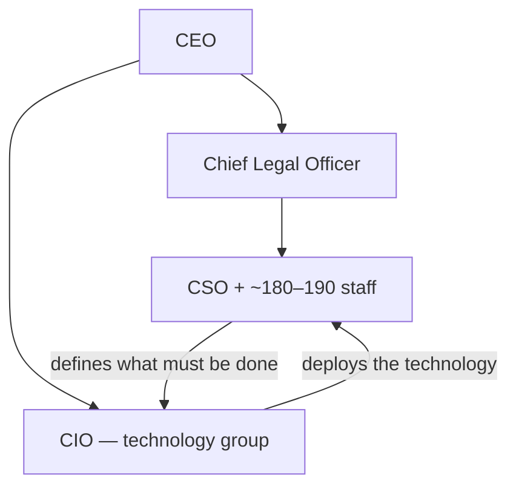
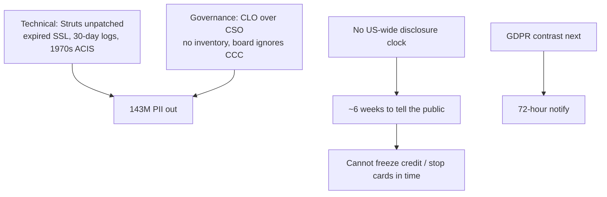

# Lecture T32: Privacy Regulation — Part 03

**Playlist index:** 32  
**Transcript:** [32-privacy-regulation-part-03.md](../../transcripts/markdown/32-privacy-regulation-part-03.md)  
**Video:** https://www.youtube.com/watch?v=IKPp1yc0dnk  
**Week / theme:** Privacy regulation — Equifax 2017 as governance failure and as the argument for mandatory breach notification

## Learning objectives
- Reconstruct the **Equifax 2017** breach: business model, unpatched **Apache Struts**, stolen PII, delayed disclosure.
- List privacy harms of a credit-bureau leak (identity theft, loan fraud, targeting, Aadhaar-scale analog in India).
- Separate **technical** failures (patch, SSL, logs, ACIS) from **governance** failures (CLO over CSO, board silence on public cyber ratings).
- Follow the class debate: **negligence vs unlucky**, then the instructor’s question — where is the **major** problem?
- State why **breach-notification timelines** (US patchwork vs later GDPR **72 hours**) are the regulatory lesson.

## What this lecture actually teaches

This session is Group 2’s Equifax case, then instructor-moderated Q&A. Cybersecurity and information privacy meet in one firm that lives on personal data.

### What Equifax is
Founded **1899**; US-based credit reporting, customers worldwide. Collects income, employment, and related data; produces creditworthiness / ratings. Indian analog: **CIBIL**. Slogan taught in class: “Powering the world with knowledge.” About **90% gross margin**; ~**820 million** consumers and **91 million** businesses.

Three segments:

| Segment | What it does |
|---------|----------------|
| **US Information Services** | Collects customer data; online information, mortgage services; revenue from selling customer and commercial credit reports. |
| **Workforce Solutions** | Uses that data for employment and income history; unemployment claims, employment tax credits. |
| **Global Consumer Solutions** | Credit monitoring and identity-threat protection. |

### Security theatre vs reality
Information-extensive, so cybersecurity is crucial. Invested millions from **2005**; **over 1% of operating revenue** on cybersecurity each year **2014–2017**. A cybersecurity expert as **CSO**, charged with modernising defences; a **crisis-management squad** that rehearses breaches.

Two command chains:



Security **defines what has to be done**; technology **deploys** it. Security engineering configures software.

Named teams:

- **GTVM** — Global Threat and Vulnerability Management: tracks IT threats; monthly meetings on possible cyber threats.
- **VAT** — Vulnerability Assessment Team: runs scans.
- **Countermeasures** — deploys code to obstruct exploitation of vulnerabilities GTVM and VAT identify.

They still had a massive 2017 breach.

### What a credit-bureau leak does to a person
Class answers, which the teaching keeps: ransom; tracking; health/credit expenses used for financial, insurance, and banking threats; **identity theft**; someone with a good score takes a loan in your name and does not repay — you are left indebted; **targeted ads**. In the Indian analog, Experian / Equifax / TransUnion / CIBIL-style pages take **Aadhaar, passport, driving licence** — a grave risk if leaked.

### Red flags before 2017
It did not start in 2017.

- **2013:** hackers could access credit-report data.
- **2015:** software-modification error publicly exposed consumer information.
- **2016:** ~**431,000** employees’ salary and tax data publicly exposed; independent researchers flagged it.
- **2017 (before the big breach):** Equifax Workforce Solutions — employee tax documents freely downloaded by attackers.

Known, not unknown. **Mandiant** warned systems were **unpatched and misconfigured**. **Deloitte** security audit: several unpatched-system issues. **Cyence** quantified breach probability at about **50%**. **FICO** (Fair Isaac) corporate cyber risk **550** on a **300–850** range. **BigSight**: **F** for application security, **D** for software patching. **MSCI**: **0** for privacy; almost lowest **CCC** for privacy and data security.

### Apache Struts and the 2017 timeline
Cause: **Apache Struts** vulnerability. Open-source software for Java applications, widely used in banks and financial institutions. Apache published that a **public exploit** existed: attackers could add their own code to web pages, disable firewalls, install malware, access servers.

**US-CERT** (Department of Homeland Security) alerted vulnerable parties, including Equifax. GTVM got the message. Most monthly meetings were **not even attended** by senior officials or Equifax cybersecurity members. They did not take it seriously. Countermeasures **delayed**. Slide timeline: **7 March** Apache discloses; Equifax takes on the order of **five months** to take corrective action — that is when they come to know about the breach. Class later: CERT said patch within **48 hours**; they did not.

Garbled student chronology, teaching beats that survive:

- ~**8 March:** Cisco and others alert on Struts.
- Fail to patch.
- ~**11 March:** hackers gain access.
- Fail to identify the unpatched hole → PII collection.
- They track some attacker IPs, block one, cannot block multiples; shut systems; law firm and **FBI**.
- **31 July:** CIO informed.
- Smith notifies teams by phone; board meeting; **143 million** consumers affected; public announcement.
- CSO and CIO resign; CEO also resigns.
- Additional **2.5 million** not confirmed at first.
- CEO testifies before US government committees.
- ~**10 million** driver’s licences; ~**700,000** UK customers; IRS contract suspended.

How it actually ran once inside: ~**30 backdoors** using **web shells** Equifax failed to notice, making the open door harder to find. **SSL certificates** should renew every **12–39 months**; Equifax ran **expired** certificates across the network. ACIS blocked an IP; portal stayed open; patch did not hold; attackers (class: from China) returned; **11-day** shutdown.

Stolen fields taught: names, **Social Security numbers**, birth dates, addresses, email, driver’s licence, credit-card numbers, passport numbers, tax IDs, credit-card **dispute documents**.

```mermaid
sequenceDiagram
    participant Apache
    participant CERT as US-CERT
    participant EQ as Equifax GTVM
    participant H as Attackers
    participant Pub as Public
    Apache->>CERT: Struts exploit public (~Mar)
    CERT->>EQ: Alert; patch in hours not months
    Note over EQ: Meetings poorly attended; no patch
    H->>EQ: Access ~11 Mar; 30 web-shell backdoors
    EQ->>EQ: Expired SSL; old ACIS; short logs
    EQ->>EQ: CIO told 31 Jul
    EQ->>Pub: Announce ~Sep: 143M (six-week gap after discovery)
```

### Internal sources of vulnerability
**Patch management.** Roles of **business owner, software owner, and system owner** were ambiguous. **2015 Deloitte audit: ~8,500 unpatched vulnerabilities**; still unresolved into 2017. No comprehensive **IT inventory**. CSO Payne and secretary **unaware ACS ran Apache Struts**. From 2015, patching was **reactive** (when a system went down / on request), not proactive.

Employee reasons: technology **not well integrated**, hard to update; **antiquated** systems and operational risk (Windows-update analogy: you must shut down to patch); not enough people to implement processes that meet internal security goals.

**Accountability gap.** Until 2005, CSO reported to CIO and to CEO. After an **interpersonal conflict (2005)**, CSO and CIO reported **independently to the CEO**. No clear communication. IT and security interaction mainly at monthly / senior meetings. Failed to identify clear lines of accountability for developing and executing IT policy. Security concerns presented by the **CLO**; neither CSO nor CIO had authority to present them. The CLO had **neither experience nor training** in cybersecurity.

**Technological barrier to oversight.** Failed to see malicious activity. **ACIS** described as 1970s-era, not updated. Lacked **file-integrity monitoring**: cannot scan for unauthorised access or suspicious events. **NIST:** log data about **3 months**; Equifax cleared logs within **30 days** — cannot reconstruct past breaches. No process to keep SSL current. January 2017 internal audit: SSL devices missing; unaddressed. **324 expired SSL certificates**, **79** in a critical business domain. Certificates grouped together; **no business segmentation** — once in, hackers moved.

### Announcement and response
Public PR in **September 2017**; breach traffic from **March**. Announced **143 million** Americans exposed; website to check whether you were hit; Mandiant engaged. Free for one year: credit-file monitoring, Equifax credit lock, identity-theft insurance, dark-web scanning — customers had to sign a **controversial clause that they will not sue Equifax**. Stock **$143 → $93 in a week (−35%)**.

Missteps taught: the no-sue clause angered customers; they **started charging for credit freezes**; identity protection only one year then pay; **delayed** announcement; Equifax **Twitter directed customers to a fake website** someone else had started.

11-member board, 9 with 3-year tenure. Only credit-reporting company with a **separate technology committee** (5 members) reviewing technology investment and information-security policy — and the breach still happened.

### Fallout
Stock −35%; **CSO, CIO, CEO, and chairman** resigned. Consideration of **clawing back** compensation, including the CEO’s. Plan to bring director **McGregor** (cyber / information-security experience). Lawsuits and inquiries: **New York Attorney General**, **FTC**. **Freedom from Equifax Exploitation Act**: enhance fraud-alert procedures; **free access to credit freezes**.

Shareholder activism: **Change to Win** (investment advisor / activism group) — **six proposals**, or they would not support re-election of McGregor. Four named in class:

1. Improve governance and hold executives accountable.
2. Remove chairs of **audit and technology** committees.
3. Permanently **separate CEO and chairman**.
4. Consider **legal settlements** when setting executive compensation.

### Breach notification — the regulatory hole
About a **six-week gap** between discovery and public disclosure. **US did not have a proper regulation for disclosure**: one source said **45 days**, others had **no guidelines**. Proposal of a bill for a **unified 30-day** consumer-alert window. New York AG: **72 hours** to **state regulators**.

Scale: **143 million** records vs **254 million** US adults in 2017 — almost half. Profit **−27%**; **$90 million** breach-related cost; **240** customer lawsuits; many separate investigations. Not unique: **3,785** US corporates victims in 2017; Cisco: **55%** of surveyed companies had a breach; large-caps lost ~**$500 million** market cap on average for major attacks that year.

### Debate the instructor insists you have: negligent or unlucky?
Students, majority: **pure negligence** — outdated services, Twitter to a fake site, patches not in, expired certificates that could not detect exfil packets, security issues not reaching the CEO, legal officer without security background, **CSO exits around 2013** as a red flag, CERT 48-hour patch ignored, no log of who attended meetings. Even if an attack still happened, **segmenting the database** could have minimised impact. After the incident: delayed disclosure, charging for freezes — **gross negligence after the fact**, not “unlucky.” Equifax is not ordinary: it hosts about **half of USA’s** information, so likelihood of attack is higher and the duty to defend is higher. Should be treated like **critical infrastructure** (Indian analog: CII-designated organisations). Trust and faith of customers were not honoured.

Instructor’s **counter (to force post-hoc humility):** Equifax is **not a technology company**; its business is **data** — customers are suppliers and customers. Several **acquisitions** bring poorly integrated, outdated tech. Organisations live with old and new systems; upgrades take time. There was a defined CSO and CIO structure, imperfectly functioning. Finding fault is easy **post hoc** with a documented case. He would “just side with Equifax, well they were unlucky” — then invites the opposite.

Then the real exam question: assuming they could have done better, **where lies the major problem?** Failures run from **country-level regulation** to **board, CEO, managers, employees**. Pick one or two things that really caused it.

Class: **governance** — roles unclear after restructure; CLO reports information security without experience, so criticality is not heard. Instructor: two command centres coordinated at CEO is a structure; **board does not run day-to-day**. Did the board have information it should have acted on? Yes: **2015 audit, 8,500 unpatched**, still open two years later; audit **widely shared with board members**; DHS told vulnerable parties to address immediately; no counter-check that employees patched; **April GTVM meeting did not even re-address** the March issue.

Instructor’s striking governance failures:

1. **Directors / board did not even react** to public **security scores** (MSCI CCC etc.). Independent directors exist to **ask questions**: why is the rating so low?
2. **Management was not functioning effectively.**

For large organisations, cybersecurity is something the **board must monitor**. Technology failure → massive loss, reputation, stock. **If structures are not in place, the system will respond accordingly.**

Closing teaching line: cybersecurity is **not just a technical issue but a corporate governance issue**. It also touches **need for regulation** — how many days to report. If reported early, an individual can **stop cards** and tell the bank. If not informed, the loss is the individual’s. There should be **clear government regulation**. That is how **GDPR** is different: it makes notification **mandatory** for EU countries.



## Cases and examples from the lecture
- Equifax as CIBIL analog; 90% margin on other people’s data.
- Pre-2017 leaks (2013, 2015, 2016, Workforce Solutions W-2s).
- External scores: Mandiant, Deloitte, Cyence 50%, FICO 550, BigSight F/D, MSCI 0 / CCC.
- Apache Struts + 30 web shells + expired SSL.
- Forced arbitration / “will not sue”; fake Twitter site; charging for freezes.
- Freedom from Equifax Exploitation Act; Change to Win six proposals.
- 3,785 other US victims in 2017 — still does not make Equifax “ordinary.”
- Indian CII comparison: this class of firm should have been treated as critical.

## Key terms
| Term | Meaning in this lecture |
|------|-------------------------|
| GTVM / VAT / Countermeasures | Equifax threat-tracking, scanning, and blocking functions that still failed. |
| Apache Struts | Open-source Java web framework; public exploit was the entry. |
| Web shell / backdoor | ~30 persistence paths Equifax did not see. |
| ACIS | Old (class: 1970s) control that blocked one IP and could not see the rest. |
| File-integrity monitoring | Missing control: scan for unauthorised access / suspicious events. |
| Credit freeze | Lock the file so new credit cannot be opened — Equifax charged for it after the breach. |
| Clawback | Recovering executive pay after failure. |
| Breach notification | Duty to tell people and regulators in a fixed time so they can act. |
| CCC / FICO cyber | Public cyber ratings the board could have interrogated and did not. |

## Formulas / frameworks (if any)
- **Two-chain model:** security says what; technology deploys; CEO must actually integrate them.
- **Notification comparison taught here:** US mix of 45 days / none → proposed **30-day** consumer notice; NY **72 hours** to regulators; GDPR (preview) **72 hours**.
- **Governance test:** did the board have independent, public evidence (audit, MSCI, CERT) and fail to ask?

## Distinctions the instructor insists on
- Investment and a CSO on the org chart ≠ security. Equifax spent >1% of revenue and still failed.
- **Post-hoc** blame is easy; still, the **major** documented failure is **corporate governance**, not “Equifax was unlucky.”
- Board fault is not micromanaging patches; it is **not reacting to information it had** (2015 audit, public CCC).
- CLO presenting cyber without cyber competence is a structural, not a personality, problem.
- Cybersecurity at this scale is **enterprise risk / governance**, not only IT.
- Delayed disclosure is not a PR issue only: without a legal clock, **the individual cannot freeze credit**. That is why regulation must specify days.
- Equifax is a **data business** and a **high-value target**; “attacks happen every day” is not an excuse.

## Exam-oriented recap
- Vector: unpatched Apache Struts after a public CERT alert; persistence via web shells; expired SSL; 8,500 leftover vulns.
- 143 million Americans (~half of adults); SSN-level PII.
- Disclosure ~six weeks after discovery; no US-wide rule.
- Root cause the class is meant to leave with: **governance** (board + split IT/security under a non-expert CLO) plus **no mandatory notification**.
- Bridge to Europe: GDPR puts the 72-hour clock and processor/controller accountability into law.
