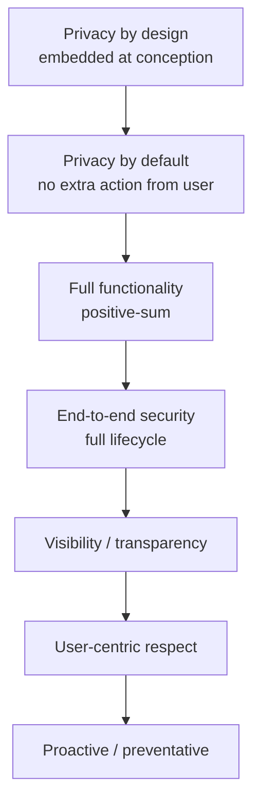
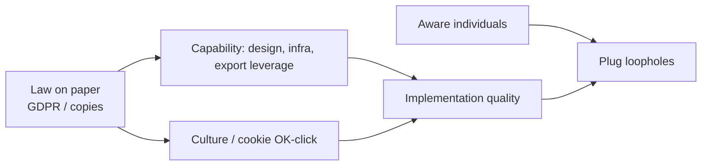

# Lecture T33: GDPR — Part 02

**Playlist index:** 33  
**Transcript:** [33-privacy-regulation-in-europe-part-02.md](../../transcripts/markdown/33-privacy-regulation-in-europe-part-02.md)  
**Video:** https://www.youtube.com/watch?v=gt8j3cUCL-I  
**Week / theme:** Privacy regulation in Europe — Cavoukian / privacy by design, Microsoft operational GDPR, global copycats, implementation gaps

## Learning objectives
- Attribute GDPR’s foundation, as the lecture does, to **Ann Cavoukian** and her **privacy by design / by default** line.
- Turn GDPR into organisational work: **records, DPIA, 72-hour notice, DPO, vendor contracts, third-country safeguards**.
- Explain why **COVID / hybrid work** is used to account for the surge in fines.
- State the lecture’s “way forward”: privacy as **new normal** and **brand differentiator** (~120 country laws; 82% see certifications as a buying factor).
- Take the implementation Q&A seriously: culture, manufacturing capability, import leverage, and **aware people** plug loopholes more than text does.

## What this lecture actually teaches

Continues Group 3 after the introduction and DPD comparison. Also walks a **Microsoft** perspective article.

### Ann Cavoukian as the lecture’s founder
The person who “actually started off with this GDPR,” in the presentation, is **Ann Cavoukian**, former Information and Privacy Commissioner for **Ontario**. Line they quote:

> Privacy knows no borders, we have to protect privacy globally or we protect it nowhere.

She gave **seven principles** on which, they say, GDPR was laid. As spoken in class (order mixed; capture the seven beats):

1. **Full functionality** — **positive-sum, not zero-sum**. You cannot “take some / leave some.” Full privacy; the individual should have **full control** over data.
2. **End-to-end security** — from the start of the technology / application through its **full lifecycle**.
3. **Visibility and transparency** — no ambiguity; the person knows what is taken and required, and stays in control.
4. **Respect for user privacy / user-centric** — even where legitimate/legal access exists (Boya’s bases), stay inside that ambit; only what is required.
5. **Proactive not reactive** — COVID/hybrid produced attacks because measures were remedial. **Preventative** from **inception**, not after the system is online. Antivirus, malware, incident reporting as proactive.
6. **Privacy embedded into design** — not an afterthought. Same idea as isolating critical systems at the **conceptual / engineering** stage.
7. **Privacy as default** — default settings protect the user; whatever is made should protect privacy at all times.

**Privacy by design and as a default** is what the Microsoft article “starts off” with, and the first GDPR requirement they list.

### Microsoft / practitioner requirements
**1. Privacy by design and default.** Every development stage; IT systems, **business practices**, **physical design**, **network architecture** should be privacy-enhancing. Strength **commensurate with sensitivity** (medical, legal). Objective: privacy and **personal control** over one’s data.

**2. Record-keeping.** Accurate, up-to-date record of **processing activities**: purpose, **categories** of data, **third parties** likely to use or access. Also records of **data breaches and responses** and impact — not “leave it at that.”

**3. DPIA.** Any **new processing activity** entails risk. Cover nature, concept, purpose, **likelihood and severity** of harm. Under the DPO’s purview: are design-and-default already incorporated?

**4. After a breach.** Identify **authorities within 72 hours**; **inform affected individuals** — you cannot hide it. Adequate **technical and organisational** measures to **detect, report, and investigate** personal-data breaches.

**5. Data transfer outside the EU.** Recipient country should provide protection **in accordance with GDPR**. Indian **outsourcing** already “gives a lot of heat” to GDPR. If the country does not provide adequate protection (no privacy law, or not technologically ahead), implement **standard contractual clauses**, **binding corporate rules**, and similar safeguards so security is at least “some semblance of or at par.”

**Vendor / processor:** always a **written agreement** — obligations, what is / is not to be done, GDPR and data-protection measures. Microsoft’s pitch in the article: tools for DPIA, data mapping, privacy by design/default, cloud encryption and access control — “perfect for GDPR.”

### How GDPR manifests inside a firm
Technology side (an article they cite): **pseudo-anonymizing** processing — encrypt so **need-to-know** only; not everyone sees data if there is a breach. **Heightened accountability:** ensure and **demonstrate** adherence, e.g. **certification**.

Organisational must-haves already covered, restated as how GDPR “shows up”:

- Immediate notification: 72 hours, **and** tell the individual.
- **Nominate a DPO** — advising, **awareness training**, monitoring compliance. DPIA sits with this officer.
- Heavier fines designed to **deter**; also **seizure of profits**, **injunctions**. Amazon still the largest; Google; British Airways.

**2020–21 figures they put up:** by ~2020 GDPR had been in force ~3 years. **Minimum penalty €2,000**; **306 fines in 2020**; by 2021 **429** fines and a **seven-fold** increase in money. They link the rise to **COVID-19**: organisations unprepared for hybrid; **home environments lacked safeguards**; public networks; business intelligence / counter-intelligence wanting to siphon information. Fault of organisations **and** of people working from unprotected PCs.

### Conclusions / “privacy is the new normal”
People are “very sentimental and very concerned”; privacy is here to stay. It **was not the norm**; going forward it **is the new normal**. Customers will expect it, authorities will check it, corporates will do it. Automation will grow; the requirement is **by design / by default, not afterthought**. Organisations are still in **nascent** compliance. **Almost 120 countries** have enacted privacy laws; severity and penalties likely to increase. Privacy becomes a **brand differentiator**. Study cited: **82% of organisations** view **privacy certifications and privacy shield as a buying factor**. Practical long-term compliance beats debating whether penalties or hybrid work are “fair.”

### Global copycats named in the slides
Not all countries listed; these were:

| Country / region | What they named |
|------------------|-----------------|
| Australia | Privacy amendment to the Privacy Act, effect **February 2018** |
| Brazil | **LGPD**, modelled on GDPR, **lesser penalties** |
| Canada | Digital charter implementation act |
| China | **Personal information protection law** |
| India | **Personal data protection bill**; companies already gearing up |
| Israel / Japan | Japan’s APPI amended; applies to **foreign and domestic** firms processing Japanese citizens’ data |
| Nigeria / African Union | AU **resolution 2014**; members enacting laws even where tech is nascent |

### Q&A the instructor does not treat as logistics
A student: the rules are comprehensive; we fail at **implementation**. People treat rights as **absolute** and do not speak of **responsibilities**. Gaps at organisation, national, international, individual levels; how do you get **uniformity** globally?

Answer taught: **countries are not the same** — culture, population, infrastructure. Privacy by design / default needs **manufacturing capability**. If you **import** the thing, you cannot have your say on design. India is moving penalties toward **~5% of global turnover** (not 4%). Like the **US states**, implementation follows **demography and culture**. EU: smaller populations, developed infrastructure, comparatively easier — and if **majority of your exports go to the EU, they have the say**. A **net importer** does not have that leverage. Broad ramifications.

Indian Facebook/cookie reality: majority just press OK so the site opens. Only now are younger people alive to malware and personal data leaving. Cyber attacks targeting Indian personal data. Laws work when **knowledge starts at school**. Once every country has some law, they will differ but a **common ground** becomes the bulwark. **Continued education**: the main characters who plug loopholes are **aware people, not organisations or businesses**.

## Cases and examples from the lecture
- Cavoukian / Ontario; “privacy knows no borders.”
- Microsoft article as a vendor checklist (records, DPIA, SCCs/BCRs, encryption).
- Indian IT/outsourcing heat under GDPR transfer rules.
- Amazon, Google, BA fines; 306 → 429 fines; seven-fold money; COVID WFH as the explanation they offer.
- 82% buying-factor statistic; ~120 country laws.
- Brazil LGPD, China PIPL, India PDP bill, Japan extra-territorial APPI, AU 2014.
- Cookie “OK” in India vs EU-style default privacy.

## Key terms
| Term | Meaning in this lecture |
|------|-------------------------|
| Privacy by design | Embed protection at conceptual/design stage, not after go-live. |
| Privacy by default | Settings protect the user without extra action; full functionality, not a trade-off. |
| Positive-sum | Cavoukian: not “some privacy vs some function.” |
| SCC / BCR | Standard contractual clauses / binding corporate rules when the destination lacks adequacy. |
| Demonstrate adherence | Accountability is not only doing; it is showing (certification). |
| SASE / hybrid | Remote work makes GDPR compliance “hectic”; security protocols must follow the user. |
| Privacy as differentiator | Certification / shield as a **buying factor** (82%). |

## Formulas / frameworks (if any)
- **Cavoukian seven** (as taught): full functionality, end-to-end, transparency, user-centricity, proactive, embedded design, default.
- **Post-breach triad:** 72h to authority + notify individuals + technical/organisational detect-report-investigate.
- **Third-country fork:** adequacy-like protection **or** SCCs/BCRs/contracts.
- **Fine trajectory they cited:** min €2,000; 306 (2020) → 429 (2021); seven-fold money, blamed on COVID attack surface.

## Distinctions the instructor insists on
- Privacy in the product is **not an afterthought** and not a zero-sum against functionality.
- 72 hours is not only “tell the regulator”; **tell the person**.
- Strength of controls **scales with sensitivity** — medical/legal data is not a cookie banner.
- Processors outside the EU (India included) are in via **contract**, not via geography.
- More fines in 2020–21 are taught as **WFH unpreparedness**, not only “evil Big Tech.”
- Exporting to the EU buys **leverage for EU rules**; importing does not. India’s 5% idea does not erase that.
- Implementation gaps close with **educated users**, not only with stricter text.

## Exam-oriented recap
- Lecture founder figure: Cavoukian; slogans: no borders; by design; by default; positive-sum.
- Operations: processing records, breach logs, DPIA on new processing, DPO, 72h + individual notice, SCCs/BCRs for India-like destinations.
- Privacy is becoming a market factor (82%) and a global template (~120 laws).
- The hard part, in Q&A, is **implementation** given culture, industrial capability, and awareness — not drafting another article.
