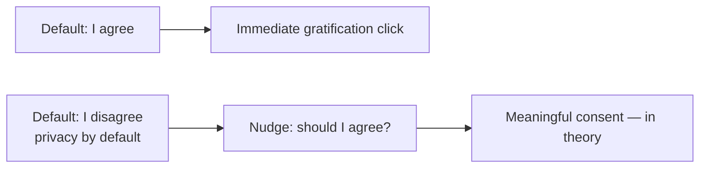
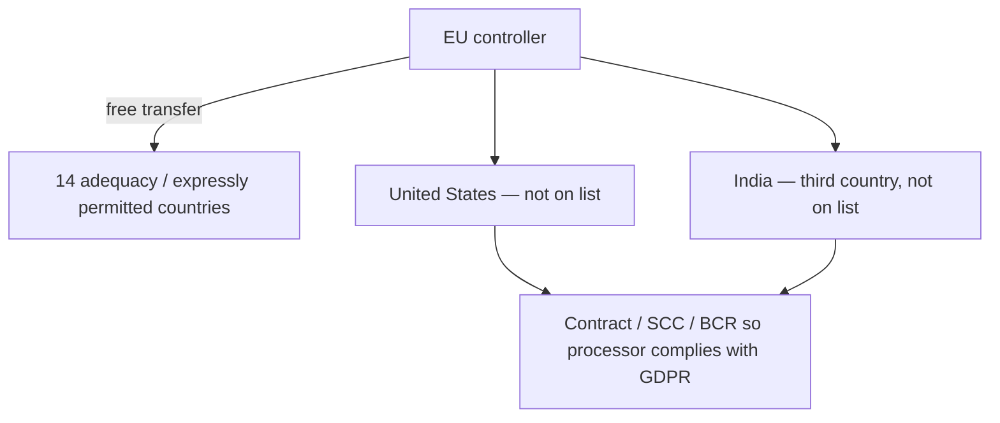
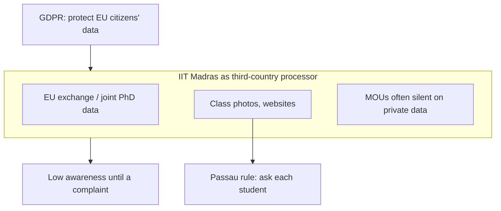

# Lecture T34: GDPR — Part 03

**Playlist index:** 34  
**Transcript:** [34-privacy-regulation-in-europe-part-03.md](../../transcripts/markdown/34-privacy-regulation-in-europe-part-03.md)  
**Video:** https://www.youtube.com/watch?v=TSx88vrSfG0  
**Week / theme:** Privacy regulation in Europe — GDPR’s downside, cookie-consent failure, adequacy / third countries, does IIT Madras need to care?

## Learning objectives
- Argue both sides: GDPR as **accountability** (Equifax lesson) vs GDPR as a **constraint on data-driven business models**.
- Explain **privacy by default as a nudge** (default radio button = I disagree).
- Show why **cookie banners** may not produce real consent (gratification, no time to read).
- Map **third countries** and the lecture’s **14 “secure” / expressly permitted** countries — **USA and India not on the list**.
- Apply GDPR to **IIT Madras**: EU exchange and joint-degree data, MOUs without privacy clauses, photo consent at Passau.

## What this lecture actually teaches

Instructor debrief after the GDPR presentation. Group used the basic document, legal bases, implications inside and outside the EU, and post-GDPR **fines on American firms** (Google, Facebook, Amazon, even Microsoft, whose commentary they presented, “repeatedly fined” though they claim they are ready). Now: **the downside**.

### Does GDPR attack data businesses?
If collection, storage, processing and transfer are strictly regulated, can Google/Facebook-style firms **function at all**? They are among the world’s top technology companies; **business model is data**; revenue is **advertising**; the value they create is telling advertisers **what people need**. Is a very strict regime **against entrepreneurship and innovation**?

Student reply: business can be promoted in *n* ways without using personal data to cold-call and **undermine privacy**. Instructor: that is **simplistic**. He **agrees** that as regulations go stricter they **do stifle business**. Counter-argument from the group (mining / environmental-clearance analogy): a **blanket sanction** (anyone, anywhere) destroys the forest. GDPR says these rules should become a **norm in the greater good**; businesses must **adapt**. Stifling those who will not adapt is the point. Negative of *no* regulation: Facebook/Twitter controversies in their **own** country — **blatant misuse** in the absence of rules.

Instructor takes the argument. Equifax’s major issue was **accountability**. GDPR brings accountability for **firms that collect and firms that process** — clarity on what happens if something goes wrong, **penalty**, **when it has to be reported**. Without clear law, people play around. The other extreme is also bad: the regime should **encourage business**. Data privacy is **not an absolute concept**; people are willing to share data and do not want it **abused**. Both sides.

### Innovative bits: default disagree, privacy by design, nudges
Instructor’s last GDPR point: innovative aspects — **privacy by design, privacy by default**. If you are signing into an account, **by default the radio button should be I disagree, not I agree**. These are **nudges** (he names **“Richard Taylor’s idea of nudge”**). If the default is I agree, you tend to agree. If default is I disagree, you get a point to think. A nudge **in the interest of the user**. By design: privacy thought of **prior**, not an afterthought.

### Cookie banners: consent that does not work
To comply, firms safeguard themselves. Since **2018** the instructor sees “this consent business.” Any website associated with Europe immediately brings up **cookie policy**: agree with all cookies, decline, or **manage** — almost three options. What do people do? **Majority agree.** Going into settings takes time you do not have. Again it **goes against the human need to gratify**. “I agree / use all cookies” is **not serving any purpose**; it is an **annoyance**. Discussed at a recent privacy conference: if every firm takes consent in this format, you **do not have time to read the clauses**. **Consent actually doesn’t practically work.**

Group anecdote: WhatsApp message — a person complains to **IRCTC** that login shows “illegal site pictures.” IRCTC replies it depends on **which sites you have been constantly visiting**; those ads display; not IRCTC’s doing — **your surfing habits**. Difference after GDPR: sites used to take browsing habits silently; now they **show cookies / no cookies / manage cookies**. Instructor still not satisfied that this is real consent.

### Harmonisation vs Irish vs Dutch regulators
Q: GDPR covers many countries; some may interpret strictly, some leniently. How is it harmonised?

A (group): **GDPR is already harmonised.** DPD let members interpret and have their own laws; **not enforced**. GDPR **must be complied**; **uniform across member states**. Breach protocols and penalties are not each country’s private invention.

Follow-up: some companies prefer the **Irish regulator** to the **Dutch** for the same GDPR, to clarify interpretation or prove compliance — so some difference still exists?

Group: after **Brexit**, UK formulated its own law, **more or less compliant** with GDPR, derived from earlier DPD/GDPR. They did not research Ireland vs Netherlands in detail. Instructor restates the student’s possible question: does GDPR **discriminate** among countries, especially for **data transfer**? Group: uniform for members; they did not find a special Irish carve-out. Digital traffic can be monitored from any point; every firm is liable to have a **DPO** (Ireland included). If Ireland under-reports, **somebody in the Union will report**; the company takes a **very big penalty** risk. Early Amazon/Google fines described as a **state of flux** plus **COVID / hybrid / public network**, not always deliberate. GDPR has become the **precursor** for ~**120** countries (Nigeria / AU again).

### Third countries and the list of 14
Instructor: GDPR also mentions **third countries**. On the GDPR site, **14 countries** identified as **secure countries to trade data with** — **express permission**. Other countries do not have that, so corporations need **specific contracts** enabling the third-country organisation to comply with GDPR.

- **United States is not one of them** (you would expect USA to be there).
- **India is not there.**
- Countries with **strict data protection regulation** get the list slot.
- “We are a **third country** in GDPR and we are not in the list of 14, India.”
- Is the regime **skewed** toward certain business models / against others? That was the opening critique.

### Should IIT Madras worry about GDPR?
Instructor’s last question: the organisation he belongs to.

Group first cut: if you **process on behalf of** an organisation, you come under GDPR; else pre-existing Indian law — unless you handle data of EU individuals.

Do we process data of individuals from EU nations? **Exchange** processes. **Research collaborators**. **Speakers**. More importantly: **start-ups**; **joint degree programs with German universities**; **huge inflow of EU exchange students** (six months, sometimes a year, joint doctorates). IIT **collects, stores, and processes** data of EU citizens. GDPR protects **data of its citizens**. As a third country, bound by **MOU** (the contract with the other university). Instructor has **read MOUs with no specific clauses on protection of private data**. **Awareness is very low.** Fine **so long as there is no breach or complaint**. The day there is a breach and somebody goes to court…

Have we had a breach? He is **not aware** of a **formal**, public, declared breach. Studying ransomware: **all IITs have been breached once** somewhere. Informally: during festivals, students access **Dean’s students database**. “We function differently.” **Not so the case with Europeans.**

University of **Passau**, teaching **12 years**: he has seen the change. Today, a class photo: **ask, can I upload this to the website? Only with consent.** If a student says no, he cannot upload. German universities take **every student’s consent** before a picture goes to the site. Incoming students may have given consent on their side; **whether IIT takes explicit consent and records it, he does not know.** Unfamiliar practice. It may come soon because of **PDP** — India going for a similar regulation (next class). We **flip**: we want the law very strict, then find we are **losing opportunities**.

## Cases and examples from the lecture
- Repeated EU fines on Google, Facebook, Amazon, Microsoft after 2018.
- Environmental-clearance / mining analogy for why blanket freedom is not “innovation.”
- Default “I disagree” as Thaler-style **nudge** (said “Richard Taylor”).
- Cookie banners since 2018; majority click agree; conference view that consent does not scale.
- IRCTC ad complaint vs browsing history.
- Irish vs Dutch regulator shopping; UK GDPR after Brexit.
- 14-country express-transfer list; US and India absent.
- IIT–German joint degrees; Passau photo consent; festival access to Dean’s database; rumour of IIT ransomware/breaches.

## Key terms
| Term | Meaning in this lecture |
|------|-------------------------|
| Downside of GDPR | May stifle ad-funded, data-native business models. |
| Accountability | Equifax hole GDPR fills: who is liable, what penalty, when to report — collectors **and** processors. |
| Nudge | Default option steers choice; privacy-by-default = default **disagree**. |
| Cookie consent | Post-2018 banners; lecture conclusion: does **not practically work** as informed consent. |
| Harmonisation | GDPR is a regulation, uniform for members; unlike DPD. |
| Third country | Non-EU destination; India is one. |
| Expressly permitted / 14 | Countries treated as safe for free transfer; **not** US, **not** India. |
| MOU | The contract through which a university relationship should (but often does not) carry GDPR duties. |

## Formulas / frameworks (if any)
- **Balance:** accountability and no-abuse **versus** not killing data businesses; privacy is not absolute.
- **Default test:** radio button on signup = disagree if you are serious about privacy-by-default.
- **Transfer test:** on the 14-list → express permission; else **specific contracts**.
- **University test:** do we store EU persons’ data? Then GDPR awareness is not optional, complaint or no complaint.

## Distinctions the instructor insists on
- “Do business without personal data” is too simple; **stricter law does stifle** some models — and **no law** enables Equifax-style unaccountability and platform misuse.
- Privacy is **not absolute**; people will share; they refuse **abuse**.
- Privacy by default is a **nudge**, not a moral sermon.
- Cookie banners are **compliance theatre** if nobody can read them — same immediate-gratification problem as T30’s 76-day privacy policy.
- GDPR is **harmonised for members**; remaining differences (Ireland/Netherlands) are not a licence to shop for a blind regulator.
- Adequacy is **political/legal**, not “USA is advanced so it must be on the list.”
- IIT is not outside GDPR because it is Indian; **EU student data** is enough. Informal Indian breach culture is **not** the European standard (Passau photos).
- Wanting Indian law to be “very strict” and then complaining about lost opportunities is the same flip the next India lectures will hit.

## Exam-oriented recap
- GDPR’s teeth (fines, 72h, processor liability) are the point of Equifax; the cost is pressure on ad-tech models.
- Default-disagree and privacy-by-design are the innovative ideas; banners mostly fail the human-time test.
- India and the US are **third countries**, not on the 14; contracts must carry GDPR.
- IIT Madras already processes EU data (exchanges, joint degrees); MOUs and photo practice are the awareness gap.
- Next: Indian constitutional privacy, Puttaswamy, Aadhaar, DPDP.
