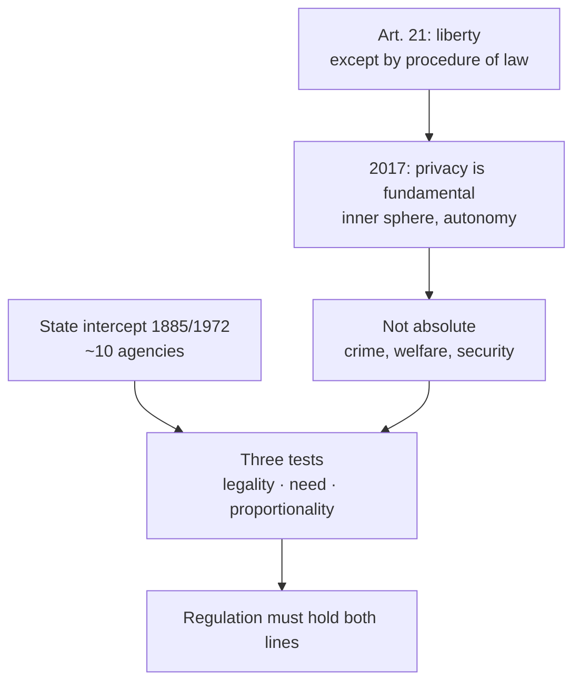

# Lecture T35: Privacy: The Indian Way — Part 01

**Playlist index:** 35  
**Transcript:** [35-privacy-the-indian-way-part-01.md](../../transcripts/markdown/35-privacy-the-indian-way-part-01.md)  
**Video:** https://www.youtube.com/watch?v=fobfwNopJtc  
**Week / theme:** Indian privacy — Constitution Art. 21, Telegraph Act, Puttaswamy, Aadhaar as state fiduciary, PDP → DPDP

## Learning objectives
- Read **Article 21** as personal liberty **with** the clause “except according to procedure established by law.”
- Place the **Indian Telegraph Act 1885** (and **1972** amendment) beside that liberty: the state has interceptive rights.
- Name **Justice K.S. Puttaswamy** as the lecture’s “father of data privacy in India” and state the **24 August 2017** holding.
- Apply the **threefold test** (legality, need / legitimate state aim, proportionality).
- Trace **Srikrishna → PDP bill dropped → DPDP 22 bill**, in parallel with GDPR 2018.
- Hold both lines: privacy is a **fundamental right** and **not absolute**; the state has **no absolute power to snoop**.

## What this lecture actually teaches

### Landing in India
Regulatory frameworks differ by region; cases showed the issues. Data privacy has **many stakeholders and layers** — not you alone, not government alone. Whenever **personal / personally identifiable data** is involved, there is a privacy issue. Today: state of affairs in India, in Indian society and culture (no foreign students in this class to compare). Understanding of privacy here is **dynamic**. The digital world has **exploded** in 20–30 years; administrative systems, including at country level, are **responding**. India is not sleeping: tap digital potential **and** take care of privacy concerns.

Plan: historical perspective, then recent national-level conflict. For decades post-independence the government did not have to worry much; now it is a **national issue**.

### Article 21 — read the whole sentence
The reference document that defines India is the **Constitution**, binding on all states and union territories. What it “enshrines” is a right to freedom. Article 21, as read in class (he flags the gender bias in the old wording):

No person may be deprived of his or her **life or personal liberty except according to procedure established by law**.

Nobody — individual, institution, government — can deprive an individual of personal liberty, **except** that exception. **Read the whole of Article 21**; do not read the first part and leave the second. The constitution is carefully drafted for **all stakeholders**. Personal freedom is assured; it is not unbounded.

### Indian Telegraph Act 1885 — interceptive right
Before and after the Republic (**1950**). Landmark pre-independence legislation: **1885**, still in the newspapers. Enacted by the British. Telegraph was institutional communication in the 19th century. After the British established themselves (he says Plassey **1775**), they built systems and laws. After the 1857–59 “mutiny” / first independence war, they used and **tapped telegraph** and found interceptive powers essential.

**Essential message of the Act:** it gives government **access / interceptive right** over telegraph communication, any communication in the country — power to **rule**. Post-independence the law **did not change**. Indian government put **Posts & Telegraph (P&T)** under government control, like Indian Railways — government control on communications. Article 21 and the Telegraph Act **work together**. Government has certain rights; you have personal right. They **may be in conflict**.

**1972 amendment** (he will not name individuals): 1970s government, notorious for the **Emergency**, further amended the law to make **wiretapping** possible, “especially [of] what opposition leaders were talking to each other.” Access was **made legal**.

### 2017–18: privacy declared a fundamental right
Legislative and executive are “one government”; they make laws convenient to rule. **Judiciary** intervenes. Landmark: Supreme Court of India declared **privacy a fundamental right**. He first says **2018**, then **corrects** when he reaches the judgment text: **24 August 2017**. Earlier, a **Madras High Court** judge had almost said Article 21 already assures privacy as fundamental even if not explicit. In 2018/2017 the Supreme Court said it **explicitly**, in the context of the **Aadhaar Act** and exhaustive Aadhaar deployment.

Government was collecting **biomedical / biometric** data of citizens and storing personally identifiable data digitally. **Government became a data controller** — the **major data fiduciary** of the country today is not private organisations but the **government**, with digital data of about **1.3 billion** people, “the largest database in the world.” Supreme Court: you are in possession of individual data, but it is somebody’s **fundamental right**; you are **guardian** of it — a critical responsibility.

### Legislative trail: Srikrishna, PDP, DPDP
When GDPR was an open draft, GoI started a similar regulation. He is “a bit confused” whether **Justice Srikrishna Commission** got the project in **2016 or 2014**. The commission made **extensive consultations**, was aware of GDPR, presented a final draft in **2018**: **Personal Data Protection bill (PDP)**. An independent committee’s draft is conceptual; government converts it to a bill and **made certain changes**. It sat long in Parliament, went to a parliamentary committee (opposition + ruling), **they never agreed**. Government **dropped PDP** and proposed **DPDP — Digital Personal Data Protection**. He misspells then corrects: **DPDP 22 is a bill now**; watch what happens next.

Broad overview: of late India is responsive; you may disagree with clauses (that is the debate), but we can be proud of being **at par with developed countries** in having a separate personal-data law in the works.

```mermaid
flowchart LR
    T1885["1885 Indian Telegraph Act<br/>state intercept"]
    C1950["1950 Constitution<br/>Art. 21 liberty + exception"]
    T1972["1972 amendment<br/>wiretap / Emergency"]
    PIL2012["2012 Puttaswamy PIL<br/>Aadhaar"]
    SK["~2014/16 Srikrishna<br/>drafting"]
    J2017["24 Aug 2017<br/>privacy = fundamental right"]
    PDP["2018 PDP draft<br/>GDPR year"]
    DROP["PDP dropped"]
    DPDP["DPDP 22 bill"]
    T1885 --> C1950 --> T1972 --> PIL2012 --> SK --> J2017 --> PDP --> DROP --> DPDP
```

### K.S. Puttaswamy
Are you familiar? Retired **Karnataka High Court** judge, “must be 97 now.” In **2012** he filed a **PIL** in the Supreme Court, when the Aadhaar debate was active. If you remember a single person for data privacy in India, the instructor will call him **father of data privacy in India**: it is **against his writ petition** that the Court held privacy a fundamental right. The Court does not make a statement in the air.

Puttaswamy’s concern: every individual goes to a collection centre, gives **biomedical identities** — iris, retina, all fingerprints; “everything about you.” Government getting too much power; **what government would do tomorrow** with this data. Second: making Aadhaar **mandatory for government services**. If you do not trust government and will not give PII, you are deprived of services — **ration (PDS)**, **right to vote**. He challenged that as unfair.

**Judgment key** (open document; long; this is the part taught):

> The right to privacy is a fundamental right. It is a right which protects the **inner sphere** of an individual from interference from both **state and non-state** actors and allows the individuals to make **autonomous life choices**.

Autonomy was discussed earlier in the course. Court upheld the right to be autonomous, to be oneself, to decide, to choose where one can be, **with whom to share data**.

### The conflict the class must sit in
If privacy is fundamental, how can government require **biometric** data for benefits? Is government **intruding** into private space? If you choose not to disclose, autonomy says government **should not deny services**. Student: people who want absolute privacy may also want no benefits. Instructor: if government says **for benefits you must share all your data**, that is **not fair**. One hand: right to decide whether to share. Other hand: you will not get services if you exercise the right. **Some kind of balance**; a **grey area**. (Side chatter about celebrities not wanting privacy is parked.)

Another student: classify and protect information; see **end use**. After Aadhaar, **fraudulent ration entries** removed; benefits were being siphoned. **Assam: over ₹22,000 crore of corruption unearthed in two years** of implementation. Unique-ID social security already exists in the West; citizens there force governments to protect data. End use matters.

Is there an **ultimate guarantee** data will not be compromised? **No guarantee from the government.** That is what **PDP / regulation** is trying to do. Two **parallel lines**; regulation exists to stop the skew and **balance both interests**.

**Privacy paradox, Indian edition:** concern of the **upwardly mobile and educated**; the **lesser educated / majority** want the benefits — “privacy you can keep.” Unaware of privacy, as discussed. Migration, education, “western access” are changing that; otherwise this debate was not in the country. In digital space, people are more privacy-conscious; **upholding privacy as a fundamental right was very important**.

### Threefold test — privacy is not absolute
Back to Article 21’s exception. An invasion of privacy / personal liberty must meet **threefold requirements**:

| Test | Meaning in this lecture |
|------|-------------------------|
| **Legality** | Existence of law |
| **Need** | Defined in terms of **legitimate state aim** |
| **Proportionality** | Rational **extent** of data collection |

Example: Income Tax he thinks is **exempt**; **Narcotics Control Bureau** (a small case earlier in the course) accessed private communication between two people. For many agencies, **Enforcement Directorate (ED)** permission is generally required. About **ten agencies** can tap private communication based on the **1885** law. Government has that right in the Telegraph Act.

**Privacy is a fundamental right but not an absolute right.** You cannot say in all conditions privacy is protected. A criminal cannot refuse to say who he is. Context matters.

Recent clip, not the full judgment: a Supreme Court judge — **no absolute power for the state to snoop into the sacred private space of individuals**. Even for the state to intercept, **legality, need, proportionality**. **No absolute power for government as well.** Grey areas: in what situation, to what extent, can government wiretap, and can that be made public — that is the whole debate.

## Cases and examples from the lecture
- P&T / Railways as lifetime government-controlled communications.
- Emergency-era 1972 wiretap of opposition.
- Aadhaar biometric enrolment; 1.3 billion; government as chief fiduciary.
- Mandatory Aadhaar for PDS and voting as Puttaswamy’s unfairness claim.
- Assam ration fraud / ₹22,000 crore.
- NCB intercept; ~10 agencies; ED gate; IT possibly exempt.
- Privacy paradox: majority wants benefits, urban-educated wants rights.

## Key terms
| Term | Meaning in this lecture |
|------|-------------------------|
| Article 21 | Life and personal liberty except by procedure established by law. |
| Indian Telegraph Act 1885 | Colonial intercept statute; still the legal spine of tapping. |
| 1972 amendment | Emergency-period expansion of wiretap, including opposition. |
| Data fiduciary (here) | Government as custodian of 1.3B Aadhaar records. |
| K.S. Puttaswamy | 2012 PIL; “father of data privacy in India.” |
| Inner sphere / autonomy | Core of the 24 Aug 2017 holding; state **and** non-state actors. |
| Srikrishna Commission | Expert draft of PDP after consultations, GDPR-aware. |
| PDP | 2018 Personal Data Protection bill; government altered; Parliament stalled; **dropped**. |
| DPDP 22 | Digital Personal Data Protection bill that replaced it (still a bill in this lecture). |
| Threefold test | Legality, legitimate aim, proportionality. |

## Formulas / frameworks (if any)
- **Art. 21 structure:** liberty **+** “except according to procedure established by law.”
- **Puttaswamy formula:** fundamental right protecting inner sphere from state and non-state interference → autonomous life choices.
- **Snoop test:** no intercept without legality + need + proportional collection.
- **Two parallel lines:** welfare / unique ID **vs** autonomy to refuse biometrics → **regulation**.

## Distinctions the instructor insists on
- Do not quote Article 21 without the **exception**.
- Telegraph Act and Article 21 **coexist**; conflict is structural, not an accident.
- He **mis-speaks 2018**, then pins the judgment at **24 August 2017** — use the corrected date.
- Puttaswamy is not a slogan; it is a **writ** the Court had to decide.
- Government, not Facebook, is India’s **largest** personal-data controller.
- Mandatory Aadhaar-for-benefits vs fundamental privacy is a **grey area**, not a one-line win for either side.
- End use (fraud reduction in Assam) is relevant **and** there is **no guarantee** against compromise — hence a statute.
- Majority-benefit vs elite-privacy is the **privacy paradox** again, not proof that rights do not matter.
- Privacy is **not absolute**; the state’s snoop power is **also not absolute**.

## Exam-oriented recap
- 1885 intercept + 1950 Art. 21 + 1972 tap + 2012 PIL + **24 Aug 2017** fundamental right + 2018 PDP + dropped + **DPDP 22**.
- Father of Indian data privacy in this course: **Puttaswamy**.
- Three tests for invasion; ~10 agencies still sit on the Telegraph Act.
- Aadhaar made the state the main fiduciary; that is why privacy had to be constitutionalised.
- Next lecture: Aadhaar Act, Nilekani, architecture, weak links.
