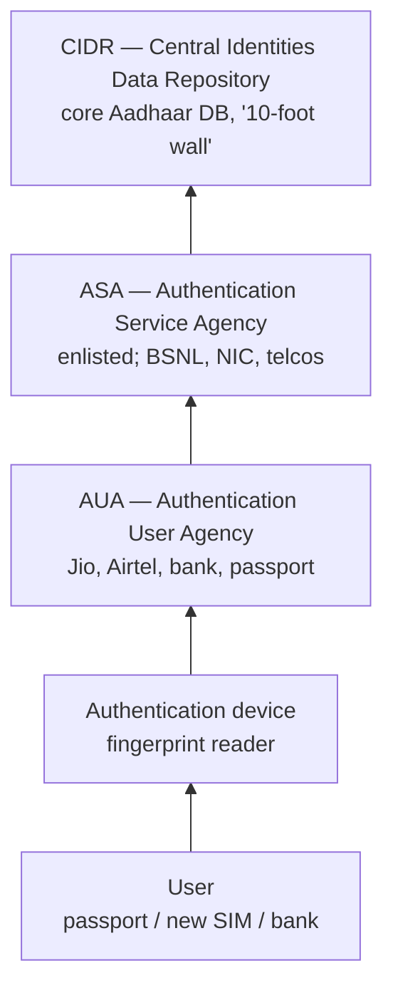
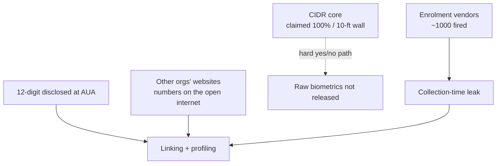

# Lecture T36: Privacy: The Indian Way — Part 02

**Playlist index:** 36  
**Transcript:** [36-privacy-the-indian-way-part-02.md](../../transcripts/markdown/36-privacy-the-indian-way-part-02.md)  
**Video:** https://www.youtube.com/watch?v=oIUjD7JmDoU  
**Week / theme:** Indian privacy — Aadhaar Act, leakage/corruption rationale, Nilekani platform, CIDR–ASA–AUA architecture, weak links

## Learning objectives
- Show that Aadhaar collection is **“according to procedure established by law”** because there was an **Aadhaar Act** first.
- Explain the **welfare / anti-leakage** rationale: multiple identities, **₹1 → 70 paise**, information asymmetry (IRCTC).
- Describe Aadhaar as a **12-digit platform** run by **UIDAI**, designed by **Nandan Nilekani**, with a **minimalist** collection claim.
- Map **CIDR / ASA / AUA / device / user** and the **yes/no** authentication design.
- Locate **weak links**: enrolment vendors, disclosed Aadhaar numbers, **linking**, the “10-foot wall” vs Keshav’s open back door.
- Note Supreme Court **limits on mandatory Aadhaar** and the still-open **DPDP** debate on how safe the database is.

## What this lecture actually teaches

Continues Article 21: no deprivation of life or personal liberty except according to **procedure established by law**. Is Aadhaar that procedure?

### Aadhaar Act — legality is not the debate
**UIDAI** (Unique Identification Authority of India) is the agency in charge of Aadhaar data collection and the Aadhaar database. Is it according to procedure established by law? **Yes — we do not have to debate.** There was an **Aadhaar Act** in Parliament **before** Aadhaar came into existence. Government **can** collect this data; it is legal. Context is the rest of the argument.

Government’s role: **govern**, **welfare of people**, **guardian of the country’s assets**. It must do that job **and** protect privacy.

### Why a unique ID: asymmetry, leakage, multiple identities
As India digitised, **every** government — party does not matter — explored IT. **IRCTC** / online railway reservation is the set-piece: huge cut in **information asymmetry** and corruption. Corruption often stems from **asymmetry of information between two agents**. At a clerk’s window you depend on what the clerk says about whether a seat exists; you cannot see the inventory. Digital access **removes the asymmetry**.

In line with that: an **identity problem**. An Indian could have **multiple identities** — a ration card in Tamil Nadu, another in Kerala, another in UP or Bihar. Fifteen years ago, quite possible; similarly voter IDs. Assessed as a major issue. Economists’ **leakage**: if government gives **₹1, only 70 paise** reached the intended recipient. Unique ID is a “very valid, very rational” response: corruption, inability to deliver **effectively and efficiently**. **Aadhaar from government to government**, not one party’s idea; the country understood the need.

### Nilekani, 12 digits, platform, minimal data
Headed by **Nandan Nilekani** (Infosys), “one of the well-known IT gurus,” given charge of Aadhaar. Two books; instructor read one — excerpts on leading a mega-project: cut across ruling party and opposition, **robust technology** for **more than a billion** people, amid opposition and “privacy as a fundamental right,” and the project **had to move on**.

**12-digit** Aadhaar is unique ID for every individual; **world’s largest ID system**. Every record unique: go a second time for another Aadhaar and the application’s comparisons will not accept it. Built as a **platform** — not one player. A **database on which applications could be built**, other participants connect. Facebook is a platform because multiple **categories** of participants take and give; Google unites advertisers and users whose interests differ. Aadhaar is a database-platform that **unites / synchronises / orchestrates** interests.

Nilekani would assert: **minimum data**, not full demographics — only **basic identification** required. **Minimalist** at collection.

(Aside: **Machiavelli, *The Prince*** — suggested for managers, complexity of politics; **Chanakya** as the Indian familiar; good kings and bad kings, rational guidelines to survive. Context-setting, not the Aadhaar architecture.)

### Why privacy exploded: one database, mandatory use
Privacy became an issue because government needed to collect personal data and store it in a **single database**. Can it be **mandatory for government services**? Aadhaar was **challenged**; debate was public; **Supreme Court restricted where Aadhaar can be used and where it should not be mandatory**. Instructor does not have the list: certain **fundamental services** you need not have Aadhaar — **other identities** will do. Nothing should be so absolute as to gate **basic** government services.

**Cell phone / wireless today: you need Aadhaar.** If you want the service, provide data; if not, sit at home. Banking, insurance, many private services: Aadhaar becomes the unique identifier. Privacy-aware people know they are sharing a **unique ID**; **potential for misuse exists**.

### How safe is the database? 10-foot wall vs weakest link
Country-wide debate from about **2015**, still on, because **PDP / DPDP has not become a law yet**. How safe is Aadhaar? Guarantee data will not pass or leak in the architecture?

**Gulshan Rai**, India’s Cybersecurity Chief, answered that Aadhaar biometric data is **100 percent secure** and there is a **10-foot wall**. Data centre in **Haryana** (instructor’s reading). Claim: infrastructure very well secured. Is a 10-foot wall enough? Looks **trivial**; he is a techie, so there is a reason — the statement is about **physical security**. Student: then someone builds an **11-foot ladder**. Point taken; not the real point.

**Keshav cartoon in *The Hindu***: very secure from the front; **back door open**. Saying on the slide: **no chain is stronger than its weakest link**. Ninety-nine strong links, one weak, the chain breaks.

Reading: research paper by (about) **three IIT Delhi Computer Science** scholars on weaknesses in the Aadhaar system. **Justice Srikrishna commission referred this paper in the draft bill** — instructor: if you are a researcher, policy citing your paper is one of the finest moments. Footnote in the document is why it is a class reading. He is **not sure Aadhaar data ever got leaked from the [core] database**. The **architecture** is the issue.

### Architecture: CIDR, ASA, AUA, device, user
Three constituents in the paper’s picture:

- **CIDR** — Central Identities Data Repository: Aadhaar data lives here; the data centre of the 10-foot wall. Jumping the wall still does not “collect and go” — it is digital; physical wall talk “does not make any sense” as the whole story. Access is **layered**.
- **ASA** — Authentication Service Agency: direct digital (wired) link to the database.
- **AUA** — Authentication User Agency: the **service provider** in front of you.
- **Authentication devices** — fingerprint readers etc.
- **User** — wants a service (passport renewal, new SIM).

Flow as taught: you go to Jio / Airtel / Idea (or bank, passport). The centre has the device. They must **authenticate** (claim vs proof, as earlier in the course). Claim = disclose the **12-digit** ID (3×4). Then fingerprints. The **telecom SP is the AUA**. The device reaches Aadhaar **through ASA**. ASA vendors must show credentials and be **enlisted / approved by UIDAI**. UIDAI **publishes** who the ASA providers are. **All telecom service providers are also ASA providers** (they have the network). **BSNL**, **NIC** named.

Core database may be encrypted, hard to tap by interception. **Where is the weak link?**

Class: a **rogue / malicious service entity**. But biometric **custody** is with **UIDAI**. Authentication is **yes/no**; they are **not releasing** the person’s data. The delivery point **does** get your **Aadhaar number** because you disclosed the ID. Debate: do not give the Aadhaar card; give a **pseudo number** (T31’s pseudo-anonymity). Weak point hard to find in the core; **authentication device** collects data of those authenticating.

Then: newspaper reports of **Aadhaar data open on the public internet**. Where from? Enquiries: **many organisations collect Aadhaar numbers**; leak from **websites and organisations**, not fetched from UIDAI.

### Criticisms summarised
Instructor collected news limitations; summary:

1. **Agencies collect Aadhaar as ID, aggregate, and link** (linking from the anonymization lecture) other data to the unique ID and **profile** the customer. **Potential leakage.** Mitigation: Aadhaar **pseudo ID** if you want; **you decide** whether to give the card; be careful — someone is getting your ID.
2. **Who creates the database.** Once created we believe it is safe. Collection was not Nilekani in person. Aadhaar enlisted **thousands of vendors** across India. Journalistic inquiry into leakages; in a short time UIDAI **fired about a thousand vendors**. If there was no leakage, why fire them? **A lot of leakages happened through vendors.** Government is **dependent on a vendor** to collect; vendors are people. Leakage at **time of collection** was quite possible. Many pitfalls; over time government became aware and has been **correcting its course**.

## Cases and examples from the lecture
- IRCTC vs the clerk: digital vs information asymmetry.
- Multiple state ration cards / voter IDs; ₹1 → 70 paise leakage.
- Nilekani / Infosys; world’s largest ID; second enrolment blocked.
- SC restriction on mandatory Aadhaar vs SIM-card Aadhaar.
- Gulshan Rai “100% secure” and Haryana 10-foot wall.
- Keshav, *The Hindu*: front wall, back door.
- IIT Delhi CS paper cited in Srikrishna draft.
- BSNL, NIC, telcos as published ASAs.
- ~1,000 enrolment vendors fired after journalistic inquiry.
- Pseudo-ID as the individual’s defence against linking.

## Key terms
| Term | Meaning in this lecture |
|------|-------------------------|
| UIDAI | Statutory authority for Aadhaar collection and database. |
| Aadhaar Act | The “procedure established by law” that makes collection legal. |
| Leakage | Share of welfare rupee that does not reach the target (here 30 paise). |
| Platform (Aadhaar) | Base database on which many participant-types connect and build. |
| Minimalist collection | Only basic identification data, not full demographics — Nilekani claim. |
| CIDR | Core identities repository behind the data-centre wall. |
| ASA | Enlisted technical path to CIDR (BSNL, NIC, telcos). |
| AUA | Face-to-face service agency (bank, telco, passport). |
| Yes/no authentication | AUA does not receive the biometric payload; only match result. |
| Weakest link | Cartoon/chain: not the wall; vendors, numbers, other websites. |
| Pseudo ID / VID idea | Substitute number so the raw Aadhaar is not left with every AUA. |

## Formulas / frameworks (if any)
- **Art. 21 applied:** Aadhaar Act ⇒ legality of collection is settled; **use, mandate, and security** remain open.
- **Leakage identity:** multiple IDs ⇒ ₹1 welfare → 70 paise; unique biometric ID is the state’s efficiency answer.
- **Layered access:** User → device → AUA → ASA → CIDR; compare to T31’s processor chain.
- **Weak-link audit:** core encryption ≠ no leak if collection vendors and downstream number-holders are open.

## Distinctions the instructor insists on
- **Legal** collection (Aadhaar Act) does not answer **mandatory use** or **security of the chain**.
- Party politics is the wrong frame; **every** government digitised; Nilekani had to work **across** parties.
- Aadhaar as **platform** is a design claim (orchestration), not “just a government file.”
- **Minimal data at collection** is the official theory; **thousands of vendors** are the practice.
- Supreme Court: Aadhaar not mandatory for all **fundamental** services; **SIM** still requires it in this lecture’s India.
- Gulshan Rai’s wall is **physical security rhetoric**; Keshav’s back door is the analytical point.
- He will **not** assert a proven leak **from CIDR**; he **will** assert vendor firing and public web dumps of numbers collected elsewhere.
- Authentication **yes/no** protects biometrics in transit **and** still leaves the **12-digit ID** and **linking** problem — same quasi-identifier logic as T31.
- DPDP still not law in this lecture; the safety debate is therefore still live.

## Exam-oriented recap
- Aadhaar is lawful (the Act), welfare-rational (70 paise, multiple IDs), and a Nilekani **platform** with a 12-digit unique key.
- Architecture: CIDR behind ASA/AUA; telcos are both.
- Risk is the **chain**: enrolment vendors (~1,000 fired), Aadhaar numbers sitting with AUAs and other websites, linking/profiling; pseudo-ID is the taught mitigation.
- SC cabined mandatory use; SIM/banking still pull the ID.
- “100% secure / 10-foot wall” fails the weakest-link test the cartoon and the IIT Delhi paper (in Srikrishna) were assigned to teach.
