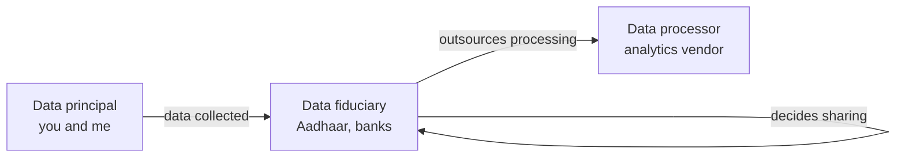
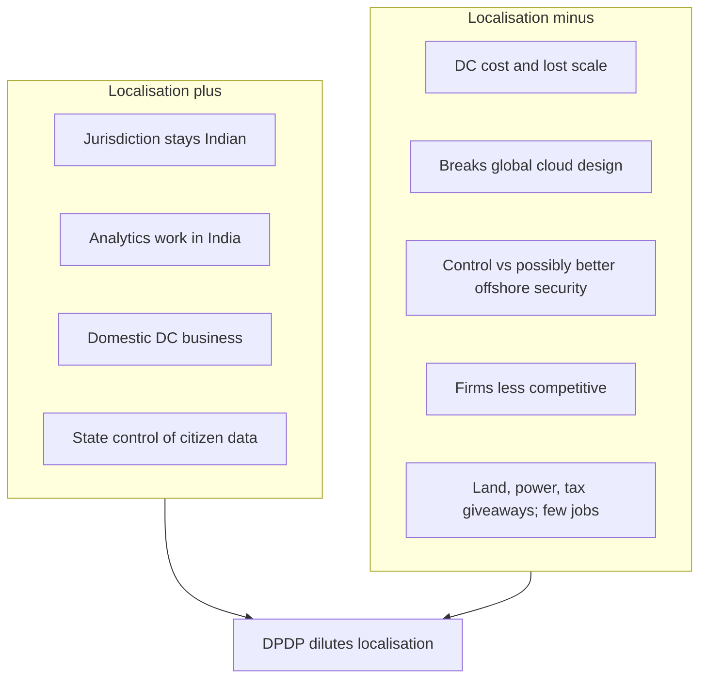

# Lecture T37: Privacy: The Indian Way — Part 03

**Playlist index:** 37  
**Transcript:** [37-privacy-the-indian-way-part-03.md](../../transcripts/markdown/37-privacy-the-indian-way-part-03.md)  
**Video:** https://www.youtube.com/watch?v=8MDW4UP7Quc  
**Week / theme:** Week 12 / Indian data protection — PDP to DPDP, actors, localisation

## Learning objectives
- State the government’s terms of reference for the Justice Srikrishna Commission and why they put the data economy first.
- Map the three data actors in PDP/DPDP against GDPR language.
- Compare the Personal Data Protection (PDP) draft with the Digital Personal Data Protection (DPDP) bill as taught in class.
- Argue both sides of data localisation, including cost, jurisdiction, jobs, and corporate power.

## What this lecture actually teaches

### Privacy and unique identity both need regulation
The lecture opens on a dual need: **privacy** and **unique identity**. Both matter, so the state initiated regulation “well in time.” A bill existed by 2017. The instructor’s judgement of the first Indian personal data protection draft is that the drafters “did excellent job.”

The government’s terms of reference to the **Justice Srikrishna Commission** are described as a difficult order: **unlock the data economy while keeping citizens’ data secure and protected**. The instructor stresses the order of the sentence: **what comes first is unlocking the data economy**.

Digital India is not to be rolled back. The lecture rejects the idea of stopping being digital, returning to manual controls, or cutting internet connectivity in the name of privacy and then “nothing more.” Successful data businesses must not be deterred or destroyed. By the time the TOR was issued, Facebook and Uber were already in India. Uber is used as the extreme case: it does not run on traditional assets; it runs **purely on data**. Google is “right there” and even making cars. That is the new economy: do not destroy it, but take care of citizens’ privacy.

The government is said to recognise the **transformative potential of the digital economy** to improve lives, while upholding individual privacy. That pairing is why a regulatory initiative exists.

### How the 2019 PDP reached Parliament — and why it failed
The Union Cabinet presented the PDP in Parliament in **December 2019**. It did not pass as drafted by the Commission. Government **amendments** were added, mainly to give the state **more power to access personal data**. The instructor calls this, from one view, “undue powers,” while noting that government sees such access as needed for governance.

Justice Srikrishna’s public reaction is taught as a teaching beat, not as partisan commentary: “this is not the draft I drafted”; the amended bill would result in an **Orwellian state** (George Orwell, already referred to earlier in the course). The instructor refuses to “politicise” this as a party issue. Government as an institution feels it needs more control. The history of privacy in India, already covered, **cuts across political parties**.

The 2019 PDP was **dropped** the previous year (relative to the lecture). Government said it would go for an **alternate bill**. The current DPDP is presented as building on PDP: more **concise**, and in the instructor’s phrase more **inclusive**.

### Three actors: principal, fiduciary, processor
A sketch parallel to GDPR is the backbone of the lecture.

| GDPR term | PDP / DPDP term | Meaning in this lecture |
|-----------|-----------------|-------------------------|
| Data subject | **Data principal** | Individuals whose data is collected — “you and me” |
| Data controller | **Data fiduciary** | Guardian trusted with data; collects, stores, **decides** |
| Data processor | Data processor (same word) | Processes data **shared by** the controller |

**Aadhaar** is the instructor’s best example of a data controller/fiduciary.

Controller functions taught here: **collect**, **store**, and **take decisions** about data — with whom it is shared, what analysis is done, who does the processing (in-house or external). Many entities can sit inside “controller,” but decision rights are what make it a controller. “Fiduciary” is taught as someone who can be **trusted** with data.

A processor only processes data the controller shares. If analytics is outsourced, the analytics firm is the processor, **not** the controller.

When GDPR was discussed earlier, the point was that data passes hands and the principal **loses control** of custody and analysis. GDPR therefore made controllers **responsible for contracts** with processors. There must be a clear contract; **penalties apply to processors as well**. Before GDPR that was not the default: some contracts had liability clauses, some did not. GDPR made the domain aware that contracts and **financial implications** are required.

### DPDP 2022 as a public bill, read through experts
The bill under discussion is **Digital Personal Data Protection** — PDP with “digital” added — **DPDP**. It is open for public comments and available in the public domain.

DPDP 2022 has **22 clauses** plus experts’ notes. The instructor is not a lawyer; he is a teacher of information systems. He will not interpret the bill as legal expertise. Observations come from **expert views** and **opinion pieces in business newspapers**, because (as of the lecture) there is no journal article and no highly unbiased opinion. Which newspaper you read changes the side you get. He calls this **tertiary data**: compiling what lawyers said in public.

### Rule-making power and conflict of interest
Out of 22 clauses, the **central government has rule-making power in around 14**. A regulatory body is supposed to be **independent**, free from government influence. **RBI** is the comparison: it should take domain decisions not dictated even by government.

The instructor does **not** claim government should let data go uncontrolled. Government has a **legitimate need** to know people and investigate. The problem is **conflict of interest**: government is itself the fiduciary/controller in several cases (**Aadhaar**; **GST** is mentioned even though GST is not personal data). Government holds huge public data **and** can decide the regulation. “I make the law and I execute it” — both roles together are not correct. The estates should be independent, as judiciary is independent of legislative and executive. This is **an expert opinion quoted**, not a final verdict.

### PDP versus DPDP as compared in class
The first comparison point is the instructor’s own observation of size and scope.

| Feature | PDP (base document) | DPDP 2022 (as taught) |
|---------|---------------------|------------------------|
| Length | 14 chapters, **56 pages**, detailed | 6 chapters, **24 pages**, “very very concise,” about half the size |
| Scope | Trying to regulate **data as a whole** | **Personally identifiable data** only |
| Right to be forgotten | Explicit clause | Brought under **Right to Erasure**; lawyers say they **may not be the same** |
| Penalties | Lower | **Much higher**; **capped at ₹500 crore** for breaches |
| Principal liability | No penalty on principals | Penalty if a principal makes a **wrong claim** |
| Data classes | Three-tier: personal / **SPD** / **CPD** | Classification **done with**; only personally identifiable data |
| Localisation | SPD and CPD stored in India; cross-border **not allowed** | **Diluted**; no strong localisation clause |

**Right to be Forgotten vs Right to Erasure.** Forgotten would also apply to **data sharing among entities**. Erasure may not ensure that. Taught as a “minor issue,” but legally they are not treated as identical.

Higher penalties plus principal-side penalties show **more influence of other stakeholders**, not only the individual’s perspective. The bill also looks from the **corporation / business-entity** point of view. Firms do not want “irritation of complaints all the time.” Principal penalties will **probably reduce the number of complaints**.

### Three-tier classification that DPDP drops
PDP classified data as:

1. **Sensitive personal data (SPD)** — very much linked to individual space: **financial data, health data, passwords, matrimonial / personal-preference data**. Highly sensitive.
2. **Critical personal data (CPD)** — **not defined** in PDP. Government was given the right to decide what is critical for the country; government **did not define it**. The intended use: tell organisations that a category of individuals’ data **must reside in the country**, while other data may be stored elsewhere.
3. **Personal data** — the rest, neither critical nor sensitive.

DPDP has **no such three-tier classification**. It only says personally identifiable data. The instructor flags this as where “the politics or the debate actually comes in.”

In PDP, the last two categories (SPD and CPD) were recommended to be **stored within the country**. Cross-border transfer of SPD and CPD was **not allowed**. That is **data localisation**.

### Data localisation, GDPR parallel, and the classroom debate
Localisation is also called **data residency** or **data sovereignty** in some literature: citizens’ data should be stored in records/archives **within the country**, not go outside.

After PDP, government started “arm wrestling” with **WhatsApp, Facebook, Google, payment banks**: citizens’ data should be within the country.

GDPR’s related idea: cross-border transfer is **expressly permitted with only a few countries**; for the rest it must be **based on contract**.

The lecture then runs a long class debate. The instructor’s own first argument for localisation is **economic value of data**. Without localisation, MNCs can take Indian data home, analyse it, and **develop products for the Indian market from abroad**. Jobs and customised apps on Play Store built in the US from Indian data. Analytics could happen **in India**; results could build apps and digital services **here**. Without localisation, that value is transferred out.

A student notes India already **outsources analytics** — the country has competence. Localisation then becomes a **boost to Indian analytics**: do analytics within India; do not transfer the data out.

A second student argument is **jurisdiction**. If data sits in a US data centre, US law can force Azure (or similar) to share it. If it sits in India, Indian government has protection over it and it is not liable to share with other countries until it is India’s concern. Once citizens’ data go to country X, they come under **X’s jurisdiction**. If that country permits data trade, the data can be shared because it is **no longer within India’s jurisdiction**. For a data regulation to be effective, **data has to be within the country**. Once it leaves, the same laws cannot apply. The instructor accepts this as a **valid point**: localisation tries to ensure citizens’ data are protected **within the law of the country**.

The counter-weight: this can be **over-protecting individuals**. Controllers collect data for a purpose. If they analyse elsewhere they must change contracts — one corporate concern. DPDP **dilutes localisation**. Post-PDP the government wanted complete control; now, the instructor says, **thanks to corporate power**, localisation is not strict.

Another student argument: **security vs control**. Some MNC data centres in India were described (in a remembered article) as less secure than specialised facilities (an island data centre of a multinational). Firms may be willing to store there, but India would **lose control**. The instructor writes this on the board as: **plus = government’s control; minus = corporations losing potential value**.

He then prompts **data-centre economics**. A major negative for firms: **cost of operations goes up**. They previously used clouds whose warehouses were not in each home country. Localisation forces **dedicated data centres in each country**. Google (search “where are Google’s data centres”) has **rationalised** locations globally, often **close to hydroelectric projects** to save energy cost. That investment already exists. Localisation requires building centres **inside India**. They lose **scale advantages**. Storage cost goes up.

Plus side for India: **data-centre and analytics business** can prosper; new prospects for IT. Government has that rationale; corporations do not. If firms become **non-competitive**, they would not like to do business. DPDP rebalances: government now **permits cross-border transfer**. Dropping SPD/CPD classification also weakens the localisation argument, because that classification made the residency case stronger. Now there is only personally identifiable data, and localisation is **not very strict**.

The instructor warns against seeing this as “simply negative.” It **does not make economic sense for corporations**. Consultants also disagree that data centres are a huge job engine: they **do not create many jobs** but **use a lot of domestic resources**. Amazon in Hyderabad (as recounted): conditions of **~100 acres**, **full government security**, **no taxes**, employing perhaps **50–100** people. Storage facility ≠ IT services jobs. The instructor treats these as reasons government **relaxed** the strict localisation condition.

### Closing: watch the debate; data as the new oil
Indian regulation is **on debate**. Beware of newspaper articles that are overly critical of government or overly in favour. There are pluses and minuses. Government must **balance forces**. **Corporate interests are also important**; you cannot neglect them; **privacy is also important**.

Next class: **economics of privacy**. There are different stakeholders in data; none can be neglected. **“Data is the new oil.”** If oil becomes very expensive, manufacturing is not competitive. If privacy laws become very tight and **data becomes very expensive**, those businesses cannot survive or be profitable. Data must be protected, but it should not become **too expensive to do business with**.

## Cases and examples from the lecture
- **Uber** as a business with no traditional assets — purely data.
- **Facebook and Google** already in India when the TOR was written; Google “making car.”
- **Aadhaar** as data fiduciary/controller; **GST** as government holding huge public data (not personal data).
- **RBI** as the model of an independent regulator.
- Justice Srikrishna calling the amended PDP **Orwellian**.
- Post-PDP pressure on **WhatsApp, Facebook, Google, payment banks** for in-country storage.
- **Google data centres near hydroelectric projects**; **Amazon Hyderabad** land/security/tax conditions versus ~50–100 jobs.
- Student example of a specialised **island data centre** versus weaker Indian warehouses.

## Key terms
| Term | Meaning in this lecture |
|------|-------------------------|
| Data principal | Individual whose data is collected (GDPR data subject) |
| Data fiduciary | Controller: collects, stores, decides sharing and processing; “guardian” of data |
| Data processor | Party that only processes data shared by the fiduciary |
| SPD | Sensitive personal data — health, financial, passwords, matrimonial/preference data |
| CPD | Critical personal data — undefined in PDP; government could designate it; meant for in-country storage |
| Data localisation / residency / sovereignty | Citizens’ data stored inside the country so Indian law still applies |
| Right to erasure | DPDP substitute for PDP’s right to be forgotten; may not cover onward sharing |
| Rule-making power | Central government can make rules under ~14 of DPDP’s 22 clauses |
| Conflict of interest | Government as large fiduciary **and** rule-maker |

## Formulas / frameworks
**Three-actor model:** principal → fiduciary (decides) → processor (executes under contract). GDPR lesson reused: **controller–processor contract + processor liability**.

**PDP three-tier stack (dropped in DPDP):** SPD and CPD localised; residual personal data less constrained.

**Localisation ledger taught in class:** plus = control, jurisdiction, domestic analytics/DC business; minus = cost, scale, competitiveness, weak job creation, possible security/control trade-off.

## Distinctions the instructor insists on
- Unlocking the **data economy** is first in the TOR; privacy is to be upheld **without destroying data businesses**.
- **Fiduciary ≠ processor.** Analytics vendors process; they do not decide collection and sharing.
- **Right to be forgotten ≠ right to erasure** if sharing among entities is the issue.
- **Legal jurisdiction follows the data.** Once data is in country X, Indian PDP/DPDP cannot simply follow it.
- Localisation is not only a privacy slogan; it is a fight among **state control, corporate cost, and jobs**. DPDP’s dilution is taught as **corporate interest**, not as simple “privacy loss.”
- Government need for access is **legitimate**; combining **fiduciary + regulator** is the conflict, not the need itself.
- Srikrishna’s “Orwellian” remark is about **the amended bill**, not the original draft, and is not to be reduced to party politics.

## Exam-oriented recap
- TOR: unlock data economy **and** protect citizen data — economy named first.
- PDP 2019: Cabinet bill with extra **government access** powers; Srikrishna disowns it; bill dropped.
- DPDP 2022: 6 chapters / 24 pages vs PDP 14 / 56; PII only; 22 clauses; government rules in ~14; penalty cap **₹500 crore**; principals can be fined for false claims.
- Actors: principal, fiduciary (Aadhaar), processor; GDPR-style contracts and processor liability.
- PDP three-tier data (personal / SPD / CPD) and strict localisation of SPD+CPD **removed** in DPDP.
- Localisation plus/minus: jurisdiction and Indian analytics vs DC cost, scale, few jobs, corporate non-competitiveness.
- Next theme already announced: if privacy law makes data as expensive as scarce oil, data businesses die.
