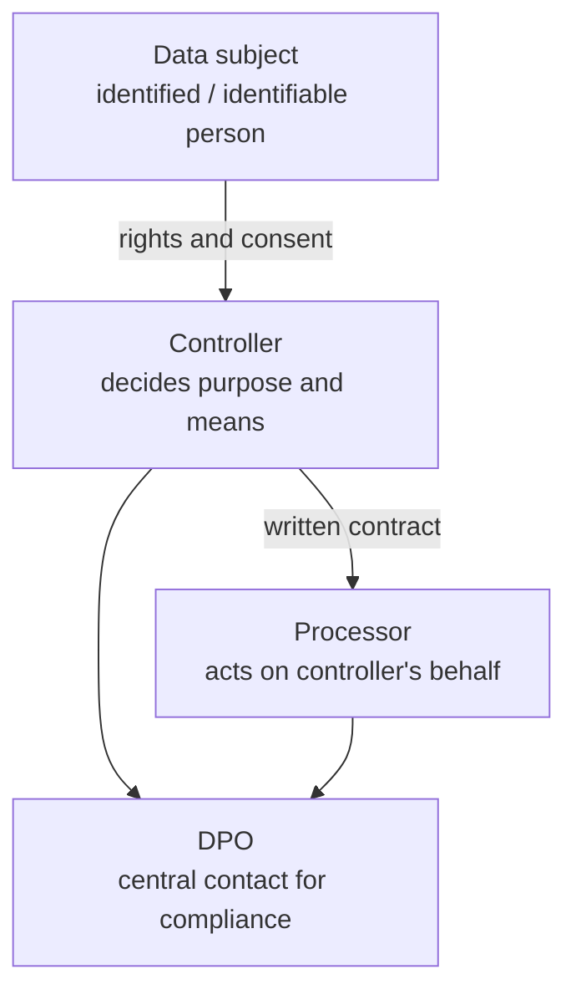
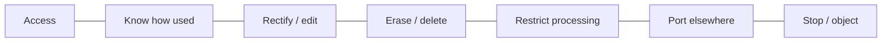

# Lecture T38: GDPR — Part 01

**Playlist index:** 38  
**Transcript:** [38-privacy-regulation-in-europe-part-01.md](../../transcripts/markdown/38-privacy-regulation-in-europe-part-01.md)  
**Video:** https://www.youtube.com/watch?v=qtTFHNVUDBg  
**Week / theme:** Privacy regulation in Europe — why GDPR exists; principles, legal bases, roles, rights, DPD → GDPR

## Learning objectives
- Restate the **need for regulation** as a fair balance among data collectors, processors, and individuals.
- Contrast US **sectoral / toothless** law (Equifax notification gap, no set penalty) with the EU move from **1995 DPD** to **GDPR 2018**.
- Define GDPR **personal data** (direct and in-conjunction identifiers).
- List the **six principles**, **six legal bases**, **controller / processor / DPO** roles, and **data-subject rights**.
- State the fine: **€20 million or 4% of global annual revenue, whichever is higher**, and 72-hour breach notice.

## What this lecture actually teaches

### Why regulation, before Europe
Eleventh session. Data privacy is a basic need: protect private data from exploitation. It is not only the individual. Collectors, storers, and processors have **conflicting objectives**: business and government need data; individuals have information-privacy concern. Without regulation, the balance moves toward **dominant players**. Government has to come in. Cases (Target, *We Googled You*, Equifax) showed the need to tighten rules. Privacy and security are related: organisations must protect data from breach and unauthorised access **because of the privacy value of the data**.

**Meta aside (not the regulatory object today).** A PhD student project: in Meta worlds you do **not** need a real-world identity — not name, email, cell, date of birth. You name yourself, hang around, trade, play. That world is **not regulated yet**, early evolution. This course is about the **real world**, where data is tied to a self. Value of the self and **autonomy of the self** are at the core of data privacy.

### What the US cases showed the law cannot do
North American cases: after a breach, law often **lacked teeth**. FTC guidelines; **HIPAA** for healthcare; child-specific rules. **No overarching end-to-end regulation** covering prevention **and** post-event duties. Two holes Equifax made vivid:

1. **Duration within which a data breach should be reported** — no specific rule.
2. **Penalty** on collectors/processors — no specific guideline.

Enforcement is difficult and **varies by state**.

### From EU directive to GDPR
Today: European Union (UK excepted). Fairly new regulation, **May 2018**. Until then a **directive / guideline**, like US **FIPPs**. Becoming a **law in 2018** is a landmark. Privacy was becoming a global issue around the time this course started. Next class: India’s initiative. Rest of this lecture is Group 3’s GDPR overview.

### Why a law now
January **2023**: **4.76 billion** global social-media users — **59.4%** of world population. 2016: 2.31B → 2021: 4.2B → ~6B projected by 2027. Internet penetration in India also rising fast since 2020. Digital media process large **sensitive personal data**; under globalisation, data is shared **across nation-states**. Digital marketing (email, social, other) spends more and more to get personal data.

### What GDPR is
**General Data Protection Regulation.** Earlier **DPD** (Data Protection Directive), **1995** — a **directive, not a law**. Member states could refer to it and implement **their own** laws; **not uniformly enforced**. Digitalisation made a comprehensive law necessary. Named GDPR in **2016**; **enforced 2018**.

**Where it applies**

- All **EU member states** and establishments there, **and**
- Any organisation **processing data of individuals residing in the EU** (even if the organisation is outside).

Concerned with **storage, processing, and sharing of personal data**.

**Personal data:** any data which can identify an individual **on its own or in conjunction with other data**. Not only name, physical address, email. **Indirect** data — employee information, databases, **biometric**, retina, fingerprint — also in scope if they can identify in conjunction.

### Roles: controller and processor are both in the dock
Two kinds of organisation:

| Role | Lecture definition |
|------|-------------------|
| **Controller** | Person or authority who **determines the means and purposes** of processing personal data. Directly “owns” / directs the personal data. |
| **Processor** | Acts **on behalf of** the controller; does not own the data. |

Under **DPD, only controllers** were held responsible. Under **GDPR, controllers and processors are both responsible** for security of the data. Processors must enter a **contract** with controllers spelling out data-security responsibility.

**Processing:** the kind of operation performed on user data. **Pseudonymization:** original data replaced with **artificial** data. **Security:** GDPR does **not** formulate specific technical measures; organisations choose controls by **severity of the data** (IAM limiting access to job function; DLP; incident-response plan; **SASE** for WFH/hybrid).

If non-compliance, **processor or controller** is liable.

### Six underlying principles
1. **Lawfulness, fairness and transparency** — individuals must have a **very clear idea** how their data is used.
2. **Purpose limitation** — specified, **explicit and legitimate** purpose; purpose limited and known to the individual.
3. **Minimising collection** — only data **adequate and relevant**, not excess.
4. **Data accuracy** — keep data accurate; subjects can get it **modified, corrected, or erased**; failing that, **restrict processing**.
5. **Storage limitation** — when the purpose is served, **delete**; do not retain.
6. **Confidentiality, security and integrity** — **CIA** compliance already studied.

### Six legal bases (you cannot process “because you want to”)
After GDPR, organisations must disclose **why** they process, **how long** stored, **with whom** shared. Six bases:

| Basis | Classroom example |
|-------|-------------------|
| **Consent** | Checkbox to receive marketing mail. |
| **Vital interest** | Car accident; doctors use medical records to save a life. |
| **Contract** | Online purchase; address processed **to deliver the goods**. |
| **Public interest** | Crime witness; investigators use personal details. |
| **Legal obligation** | Banks’ **KYC / AML** on client data. |
| **Legitimate interest** | Job-seeker résumé on a site; recruitment agency sends it to clients. |

### Penalties and early fines
Non-compliance may be intentional or not (unclear policies, or **external cyber threats**). Strict consequences:

- Fine: maximum **€20 million or 4% of total global annual revenue, whichever is higher**.
- Consumers can initiate **civil litigation**.

Examples taught:

- **Amazon** ~**$780 million** for using user data **without consent** — largest fine “till date” in the presentation.
- **WhatsApp** — unclear privacy policies.
- **Google** — did not provide an **easy way of refusing cookies**.
- **British Airways** — **not intentional**; cyber-attack, ~**4 lakh** customer records; still fined.

### Data-subject rights
Beyond being told why data is used, individuals can require organisations to:

- **Delete** personal data
- **Stop** “browsing” / processing personal data
- **Edit / correct** personal data
- **Port** data to some other place
- **Access** the data
- **Know how** it is used
- **Restrict processing**

**Consent** = approval. **DPO** is now **mandatory** (presentation: employ a DPO to meet compliance) — independent executive or firm executive as **central point of contact**. Awareness training sessions. **DPIA** (below) for high-risk work.

### DPD vs GDPR — key changes the group listed
**Personal data redefined.** Earlier: only data that **directly** identifies (name, address, phone, email). Now: anything that **in conjunction** can identify — **IP address, mobile device identifier, geolocation, fingerprints**.

**Opt-in / consent** not enforced that way under DPD. GDPR: explain why you use the data **and** secure **opt-in consent**.

**Rights** listed again: access, know use, erase, restrict processing.

**Joint responsibility** of processor and controller (DPD: controller only), via contract.

**DPO mandated** as central contact for implementation and whether security/compliance is maintained.

**DPIA mandatory for high-risk projects** (not under DPD): sensitive personal data, **large-scale** handling, **profiling a vulnerable** section. DPIA identifies probable risks and mitigation. It is **project-specific**, not a generic organisation evaluation. Ensures GDPR compliance and **data protection / privacy by design** in new projects.

**Penalties and breach protocols uniform.** DPD: member countries adopted **different** breach protocols. GDPR: **all member countries** notify data subjects that a breach happened, **within 72 hours**. Fines heftier: €20M or 4% global turnover, whichever higher.

## Cases and examples from the lecture
- Meta / virtual identity vs real-world autonomy of the self.
- US: Target, We Googled You, Equifax — no report clock, no set penalty, state variation.
- Social-media user counts 2016–2027 as the reason a comprehensive law was felt necessary.
- Consent checkbox; ER vital interest; delivery contract; crime public interest; bank KYC; recruiter legitimate interest.
- Amazon, WhatsApp, Google cookies, British Airways (no intent, still fined).
- WFH / hybrid → SASE as a GDPR-era security pattern.

## Key terms
| Term | Meaning in this lecture |
|------|-------------------------|
| DPD (1995) | Directive: member states write their own laws; not uniform. |
| GDPR | Regulation: law, enforced 2018 (adopted 2016). |
| Personal data | Identifies on its own **or in conjunction** (IP, device ID, geo, biometrics). |
| Controller | Decides purposes and means. |
| Processor | Processes on behalf; now jointly liable; needs a contract. |
| Pseudonymization | Replace original with artificial data. |
| DPO | Mandatory central contact for GDPR compliance. |
| DPIA | Project-specific high-risk impact assessment; privacy by design. |
| 72 hours | Uniform breach notification window under GDPR. |
| 4% / €20M | Ceiling on administrative fine, higher of the two. |

## Formulas / frameworks (if any)
- **Scope test:** EU establishment **or** processing of people residing in the EU.
- **Lawful processing:** one of six bases; not “because we want the data.”
- **Accountability pair:** controller **and** processor; DPO; DPIA for high risk; 72h notice; 4% / €20M.

## Distinctions the instructor / group insist on
- Meta can skip real identity; **real-world** privacy is about the self and autonomy — that is what law is for.
- US has category laws (HIPAA, children, FTC) but **no overarching** end-to-end statute; Equifax showed missing **time** and **penalty**.
- A **directive is not a regulation**; 2018 is the change from D to R.
- Personal data is not only name and email; **in-conjunction** identifiers are in.
- DPD blamed the **controller only**; GDPR puts the **processor** on the contract and in the dock.
- British Airways: **no intent** is not a defence when there is a breach.
- DPIA is **project-specific**, not a one-time org score.
- GDPR does not prescribe a single security stack; measures scale with **severity**, but non-compliance is still liability.

## Exam-oriented recap
- GDPR applies to anyone processing EU residents’ data, not only EU companies.
- Six principles (lawfulness/fairness/transparency through CIA) and six legal bases (consent through legitimate interest).
- Roles: subject, controller, processor, DPO; mermaid above.
- Rights: access, know, rectify, erase, restrict, port, object.
- Uniform 72-hour breach notice and 4% / €20M fines are the “teeth” the US cases lacked.
