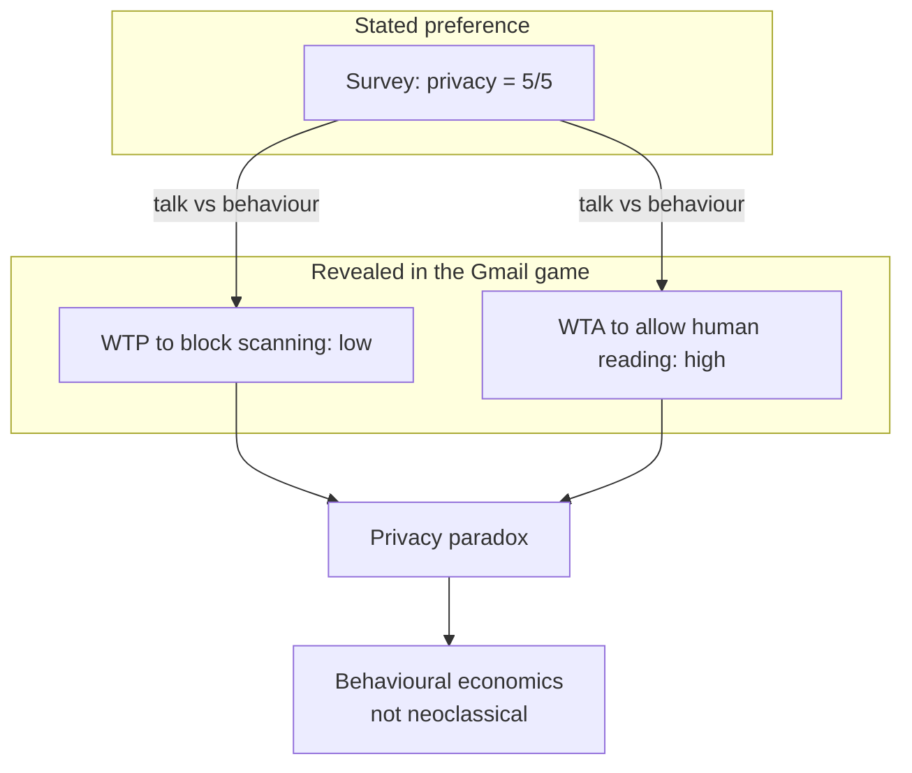
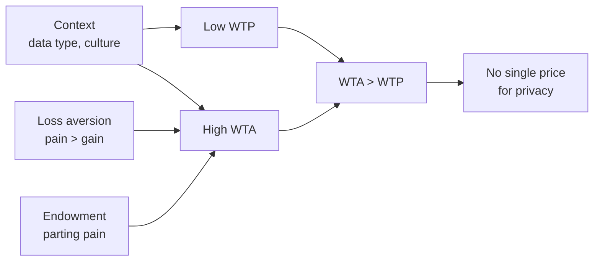

# Lecture T39: Information Privacy — Economics and Strategy — Part 01

**Playlist index:** 39  
**Transcript:** [39-information-privacy-economics-and-strategy-part-01.md](../../transcripts/markdown/39-information-privacy-economics-and-strategy-part-01.md)  
**Video:** https://www.youtube.com/watch?v=qXHNviJSQD8  
**Week / theme:** Week 13 / Economic value of privacy — contracts, WTP/WTA, privacy paradox

## Learning objectives
- Explain why privacy must have an **economic value** if businesses are to spend on it.
- Show why cloud/controller–processor **contracts** still use thumb rules instead of a valuation model.
- Run the Gmail classroom experiment as **WTP vs WTA** and name that gap the **privacy paradox**.
- Apply **loss aversion**, **endowment effect**, and **stated vs revealed preference** to privacy pricing.

## What this lecture actually teaches

### Why economics and strategy at all
The topic is **information privacy: economics and strategy**. Two questions: is there an **economic value** to privacy, and where does it matter? Strategy (core of some firms’ business models, differentiation) is flagged for the next session.

From a **business perspective**, if privacy has no economic or strategic implication, it is “not worth spending much time,” because business is about those aspects.

Platforms built on individuals’ data are part of social life and happiness; they can also take happiness away and bring pain in different forms.

### Valuation is required because contracts are required
When privacy is treated as an **economic good**, some value must be assigned or one cannot speak in economic terms. Valuation is **practically important** in contracts between organisations. In the regulated world, a **data controller and a data processor** exchanging data must have a contract.

**GDPR insists** on a specific contract and on sharing losses/penalties if there is a breach. The contract needs a clause: **what is the penalty if there is a breach?** How do you ascertain that value? The asset exchanged is a **database of personally identifiable data**. How do you attribute a value to that database?

Although the topic is important, a **well-established method for valuation of privacy still remains an open research question**. Some publications are appearing; by and large it is open.

Cloud contracts are especially hard. Regulation requires firms to have contracts; **writing them is not easy**. The first difficulty is ascertaining the value of privacy.

### Industry practice: 5 percent of contract value
An MS scholar of the instructor did an **exploratory study** of how organisations in different domains manage contracts: what the document says, how they treat the value of privacy. They interviewed **CIOs** of leading organisations (names not given).

The instructor sat in on one interview: a **leading healthcare provider** in India. Healthcare data of Indian customers is stored in the cloud via an IT service provider. On data-breach clauses: there are **standard legal terms**, but they **do not do any valuation**. The typical clause is **5 percent**: the penalty is **5 percent of the contract value**. A **thumb rule**, not a model. Actual cost could be much more or less than 5 percent. Industry agrees there is **no clear model** to determine the value and then contract on that model. In the absence of a model, they use thumb rules.

That can cause **major losses** for client or provider if actual breach losses are very high.

Regulation supplies a number when models do not: **DPDP** (as proposed in India) has a penalty **cap of ₹500 crore**. That specific number can anchor a decision. Post-regulation there are **guidelines**, not a valuation model.

### Why a million-record database still has no price
A researcher who tries to price a million-record database hits a difficulty: privacy is **not straightforward**. If you ask an individual how much they value their privacy, the answer is **context specific**. What you feel today in one setting may not be what you feel in another. Privacy scholars have written this.

### Classroom experiment: Gmail WTP then WTA
Students use phones (menti.com; code given in class). Background: most use **Gmail / online email**, **do not pay** for it, no subscription. Emails are read — Google says **not by a human but by software** — for **advertising**, which is the revenue model, and users accept that. Users are still concerned: emails are read by someone; **sometimes humans too**; Google admits that.

**Question 1 — willingness to pay (WTP).** Hypothetical Google premium: pay a **price per month** so that **not even software will scan Gmail**. How much will you pay per month?

**Question 2 — willingness to accept (WTA).** Google will **pay you** per month if you **let humans read** your Gmail. How much will you accept?

The class followed the **expected pattern**. That pattern **is the privacy paradox**.

We **talk** about privacy and want to protect it; we are advocates. When we must **pay to protect** it, amounts go toward the **lowest** option (₹100, and students wanted a **₹0** option that was not offered). When money is **offered** for giving privacy away, we want the **maximum**.

### Privacy paradox = WTA higher than WTP
In economic literature: **WTA** and **WTP**.

- **Willingness to pay** to protect privacy **tends toward the lowest value**.
- **Willingness to accept** (to let privacy be taken) is **higher**.
- Average WTA **>** average WTP. That is **human behaviour**.

The claim that we will protect privacy “at any cost” is **talk**. The **economic man** in you differentiates WTP and WTA. There is a **paradox** among humans, visible even in a small sample. Economists have run several experiments on privacy behaviour; the instructor designed this one and “this has been working.”

### What does **not** explain it, and what does
Students offer: value of Gmail as a medium; whether email is the primary channel; type of data; culture; awareness. The instructor grants **culture-to-culture** differences and that the class is in a fairly homogeneous culture, but the question is **individual behaviour** inside that culture. Gmail **does** hold private communications, yet people still do not feel it is worth paying much.

Theoretically this is **irrational** relative to the **economic man** of **neoclassical economics** (profit-maximising, not carried away by emotions). Here **emotions play a role**. The behaviour falls under **behavioural economics**: economic man is **not very rational**; decisions are carried by **pain or loss**. Humans are **loss averse**. Pain gets **higher priority than gain**. For the same decision with both pain and gain, the focus is on **pain** — “you do not want a pain.” Read **Daniel Kahneman** and others.

### Privacy calculus: loss aversion and endowment effect
In the mind’s **privacy calculus**, two behavioural concepts run:

**1. Loss aversion (prospect theory).** A graph in the slides: **loss is more significant than gain**. Textbook-style example: **100% chance to gain $450** versus **50% chance to gain $1000**. Expected value is higher on the gamble, but people typically take the **certain** $450 because the other option has a **chance of loss**. Loss is a **pain**. **Embarrassment is a pain** (the instructor’s recurring assertion). We try to avoid it. That is loss aversion in **prospect theory**.

**2. Endowment effect.** Subtle idea we all carry. Trophy example: a small trophy from **fourth standard** in the living room. Someone (an “akri” / scrap buyer in the telling) weighs it — 300 grams — and offers **₹500** for the metal. You will not sell at metal cost. Even **₹50,000** may not be enough. It is **your trophy**. There is **parting pain**. For some products and services, price is **not** cost of material + production + margin, because **endowment is built in**. When something is yours and you must part with it, the cost is hard to assert.

Both effects show up in the Gmail experiment. A 15-year Gmail user enjoys service and expects **some privacy**. Taking that privacy away is taking something already owned — **pain**, so **WTA is high**. Private data is yours; there is loss. There may also be **opportunism** in a small sample (take the maximum money). If you enjoy a benefit and must part with it, endowment appears. Potential **embarrassment**, **social cost**, **loss of face** are pains; imagining them raises perceived cost/value.

### Privacy is a personal product, so one price does not exist
Privacy is a **very personal product**, not a physical tangible good. It is about you, what you feel about yourself and your data. That is why behavioural pricing enters. WTA and WTP **themselves** assign **different values** depending on whether the question is **protect** or **sell**. Valuation cannot assign **one value to privacy at all times independent of context**. **Privacy is context specific**.

Scholars still attempt WTA/WTP and surveys; all are **subject to variation by context**.

### Stated preference vs revealed preference
The last teaching beat, previously “not touched”: economists use a **contingent valuation** technique for privacy and related evaluations.

| Concept | How it is obtained | What the lecture shows |
|---------|--------------------|------------------------|
| **Stated preference** | Public statement / survey: “How important is privacy?” 1 to 5 | Answer is **5** — very important |
| **Revealed preference** | Cannot get it from that survey; **observe**, or change questions, or run **games** like Gmail | Although 5 was available, behaviour goes to **option 1** |

**What people think and what people actually behave** differ for privacy and privacy evaluation.

### Close of the economics block
Economic value of privacy — especially of **databases** — is important; valuation is important; **models are still evolving**. Guiding theories are **behavioural economics**, especially **WTA and WTP**. Next: a case at **organisational / aggregate** level on factors that influence the **trade of private data**.

## Cases and examples from the lecture
- GDPR controller–processor contract and shared breach losses.
- DPDP penalty cap **₹500 crore** as a decision number when no model exists.
- Indian **healthcare CIO**: cloud-stored patient data; breach penalty = **5% of contract value**; no valuation model.
- **Gmail** free account; software scanning for ads; hypothetical premium vs pay-to-scan.
- **$450 certain vs $1000 at 50%** — loss aversion / certainty effect.
- **School trophy** vs scrap-metal price — endowment / parting pain.
- Instructor’s own **15 years of Gmail** as endowment.

## Key terms
| Term | Meaning in this lecture |
|------|-------------------------|
| Valuation of privacy | Assigning economic value to PII databases so contracts can set breach penalties |
| Thumb rule | Industry substitute for a model — here **5% of contract value** |
| WTP | Willingness to pay to **protect** privacy (tends low) |
| WTA | Willingness to accept money to **give up** privacy (tends high) |
| Privacy paradox | Advocate privacy in talk; cheap to buy protection, expensive to sell it |
| Loss aversion | Pain of loss weighted above equivalent gain; prospect theory |
| Endowment effect | Extra value because the thing is already yours; parting pain |
| Privacy calculus | Mental trade-off when deciding about privacy |
| Stated preference | What you say in a survey |
| Revealed preference | What you do in a game or in the market |
| Contingent valuation | Economist’s tool using those two preference types |

## Formulas / frameworks
**Contract problem:** no model → thumb rule (5%) or statutory cap (DPDP ₹500 crore).

**Behavioural privacy model taught in class:**

**Prospect-theory illustration:** certain $450 preferred to 50% of $1000 even though EV is higher on the gamble.

## Distinctions the instructor insists on
- Privacy without **economic or strategic** implication is not a business topic.
- **Regulation requires contracts**; contracts require a number; **research has not supplied a stable model**.
- **5% of contract value is not valuation** — it is a thumb rule that can under- or over-shoot real loss.
- **WTA is not WTP.** The paradox is that gap, not that people “don’t care.”
- This is **not** neoclassical rational man; it is **behavioural economics** (Kahneman): loss aversion and endowment.
- **Stated 5/5 on a survey is not revealed behaviour.** Contingent valuation exists because those two split.
- Privacy value is **context specific**; there is no all-weather unit price for a database.

## Exam-oriented recap
- Why value privacy: controller–processor contracts, cloud, GDPR-style shared breach liability.
- Industry: **5% of contract value**; DPDP cap ₹500 crore as a guideline number.
- Gmail quiz: low pay-to-block-scan, high accept-to-allow-human-read → **privacy paradox**.
- Explain with **loss aversion** (pain, embarrassment, certainty over gambles) and **endowment** (trophy / 15-year inbox).
- Stated vs revealed preference; contingent valuation.
- Next case moves from the individual to **organisations trading private data**.
