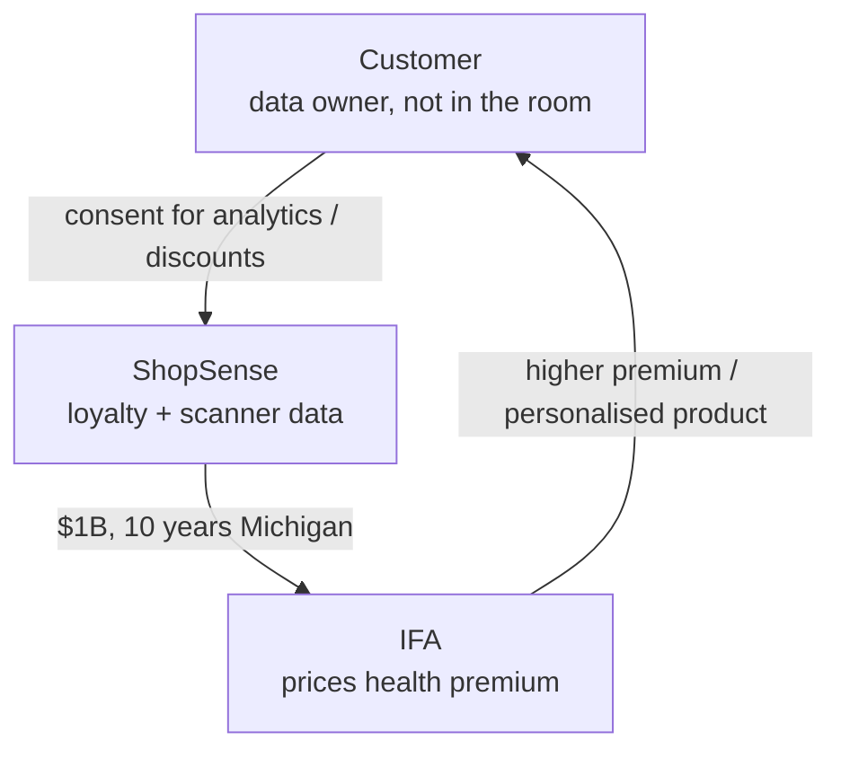

# Lecture T40: Information Privacy — Economics and Strategy — Part 02

**Playlist index:** 40  
**Transcript:** [40-information-privacy-economics-and-strategy-part-02.md](../../transcripts/markdown/40-information-privacy-economics-and-strategy-part-02.md)  
**Video:** https://www.youtube.com/watch?v=LwARGPiu2oc  
**Week / theme:** Week 13 / Aggregate data trade — ShopSense × IFA case

## Learning objectives
- Reconstruct the HBR discussion case *The Dark Side of Custom Analytics* (Davenport and Harris) as presented in class.
- Judge the proposed grocery–insurer data deal from **ShopSense** and **IFA** sides: money, law, trust, strategy.
- Separate **legal consent** in a loyalty programme from **ethical** use of grocery data to set health premiums.
- Contrast **Progressive**’s transparent driving logger with covert supermarket-to-insurer sharing.

## What this lecture actually teaches

This session is a **student-led case** (Group 5: Manu and Bhuvan) plus instructor steering. The article is presented as **Thomas Davenport and Jeanne Harris**, *The Dark Side of Custom Analytics* — an HBR-style discussion of a supermarket sharing loyalty data with an insurer.

### The two firms
**ShopSense** — Dallas-based US supermarket chain. Large loyalty programme. Collects personal information and, in some cases, **medical-related** information to suggest products and discounts. **In-house analytics** on loyalty data; **pattern-based coupons** (e.g. milk / health products). Scanner information has already been shared **without customer knowledge**; the **CFO** line taught in class is that the company is **making more money from selling the data than from selling more meat**.

**IFA** — founded 1972; one of the largest US **life and health** insurers. Collects customer data from multiple agencies to set **premiums**. Health-related inference example: heavy **meat** or **alcohol** purchase → higher chance of cholesterol / BP issues → **charge more premium**.

ShopSense has already shared **10 years of Michigan** data with IFA as the proposed deal’s factual backdrop.

### Cast (as named in the presentation)
| Side | People |
|------|--------|
| IFA | Laura Brickman (Regional Manager, West Coast), Archie Stetter (senior analyst), Geneva Hendrickson (SVP ethics and corporate responsibility), O.Z. Cooper (general counsel), Jason Walter (CEO), Rusty Ware (analyst; other data sources) |
| ShopSense | Steve Worthington (chief analyst), Alan Atkins (COO), Denise Baldwin (HR), Donna Greer (CEO) |
| Four outside experts on “responsible” use | George Jones (CEO, Borders), Katherine Lemon (Boston College), David Norton (Harrah’s relationship marketing), Michael McCallister (CEO, Humana) |

### The scene that opens the case
Laura shops, remembers the **acquisition / data-sharing agreement 14 months earlier**, looks at receipts and coupons. At checkout she had been thinking about **sunscreen**; the back of the receipt prints a **sunscreen / disease benefit and a coupon** — climate-aware targeting. She realises grocery data shows **household food and health-related buying**, which an insurer could use to **assign premiums**. She flies to discuss with Steve; they obtain the Michigan extract.

### IFA internal debate (as presented)
- Laura: ShopSense loyalty data is worth getting.
- Archie: rich **household** insight; upcoming disease / premium impact.
- Rusty: IFA already buys **credit, financial, drug and product** data from other sources.
- O.Z. Cooper: if customers pay **higher premiums**, possible **legal problem** for ShopSense’s side.
- Jason Walter (CEO): if IFA builds **proprietary health indicators**, that is a **huge hurdle for competitors**. **Exclusive rights** to this dataset would be a hurdle competitors cannot easily get over.

### ShopSense internal debate (as presented)
- Steve: share data, gain economic output.
- Alan Atkins: if customers find out data is **sold to an insurer**, they may **stop using the loyalty card**, which **stops the data inflow** ShopSense needs to customise.
- CFO: more money from **selling data than meat**.
- Denise Baldwin (HR / privacy): if IFA uses data, could it identify **individual customers as employees** of particular companies? How will IFA use it?
- Donna Greer: should we **charge more**, because selling may **dilute customer relationship**; insurers can price more accurately with this data.

### Instructor restatement of the deal
ShopSense invested in analytics to **personalise marketing, coupons, discounts**. It already shares some scanner data without customer knowledge. IFA wants more data for **risk analysis** so it can **price premium more accurately**.

**Should ShopSense go ahead?** Class: revenue model, but **without customer knowledge** → legal and ethical problems.

### ShopSense: pros, cons, expert tone
**Pros taught:**
- The deal is **legal in all states where the company operates**. At the time of writing, **none of the states IFA did business in** had laws prohibiting this exchange. US **state-wise** regulation: **California** stricter; other operating states were not blocking this.
- About **$1 billion additional annual profit**; **no cost** to produce the data they already have.
- Insurer might build **wellness programmes** / personalised offerings — management considers this a plus.

**Cons taught:**
- Done **without customer knowledge**; customers may **opt out of loyalty**, stopping data and harming customisation.
- Expert opinion: **high risk, short-sighted**, not keeping customers at the core; **trust** may be lost.
- **Transparency** is very important.
- ShopSense would **lose control** of how data is used.
- Suggestion: a **combined programme with transparency**.

### Legal versus ethical — the instructor forces the distinction
If it is legal in the US and they comply, why a customer problem?

Answer developed in class: loyalty enrolment includes **acknowledgement / consent** that data is used for **analytics**, in return for extra discount. ShopSense then has a **contract** with IFA for **specific** data IFA needs — not sharing with “everyone.” **Legally** they stand.

The **con** is relationship harm: meat / cholesterol-related buying could **raise insurance premium**. When the customer learns grocery receipts affected life-insurance price, even after analytics consent, the **economic hit** feels like betrayal. They may leave the shop. **What is legal need not be ethical.**

Data **belongs to the customer** (third party). Sharing can always be **challenged**. Instructor: you are highlighting **consequence of sharing**. Individual data with the insurer, not only ShopSense; insurer monitors **what you eat and drink** through a grocer. That is the ethical problem. A **new model**.

### Progressive: personalised insurance the customer can see
The case refers to **Progressive** (auto). Instructor’s US memory: ads — **if you drive safe, you get money back**. Model: everyone starts from the same premium; a **data logger / sensor in the car** monitors acceleration and speed; safe driver → **lower premium**, rash driver → **higher**. **Differentiated / personalised insurance**. **Money back** means charging less for safe driving.

Laura is pursuing the **same idea** with grocery data: **personalised health insurance** — a product for each individual. Difference stressed later: Progressive’s logger is **in the open**; the ShopSense path is **without the shopper knowing** the insurer is watching the trolley.

### “If you do not pay, data is what they use”
A student asks about **Google Pay / PhonePe / Paytm** charging nothing. Instructor: if you do not pay, **data is what they actually use**. The case throws light on **data trade** customers do not see, and how they may **pay for it or be adversely affected** without knowing. Many contexts.

### IFA side: a very good deal — with noise
Class consensus: **extremely valuable** data; habits → premium and product design quickly. IFA would be “too happy.”

Instructor / presenters add:
- Public **understands** insurers analyse risk.
- Possible **positive spin**: wellness programmes, discounts, Progressive-style rewards.
- **Accuracy may not be high**: people buy for **family** (father buying sweets for children). Should that raise **his** premium? **Outliers / noise**, but **patterns still exist**.
- **Battered customer syndrome**: once you profile, you focus on the **top 10–15%**; the remaining **85–90%** get worse service and may leave. A student suggests **family bundling** to absorb household buying noise.

Expert tone: can be good for the customer **if drafted as win-win**, with **transparency**. Hidden multi-source collection makes people **inhibited** about buying more products. **Public backlash** risk. Both companies’ managements are thinking “**what will be disclosed**” and deciding from that — experts say that must change; **ethical behaviour across the organisation**, any industry.

### Evidence, not a hypothetical: the pilot
Laura and ShopSense analytics ran a **pilot before formalising**. It was **successful**. **Correlation** between **purchase** (not proven consumption) of **trans-fat** products and **insurance claims**. Noise exists; **patterns nevertheless exist despite the noise**. The proposal is **evidence-based**. Strong argument for the deal.

### Data for competitive strategy
The instructor’s own addition, aimed at the strategy module: IFA can offer a product **competitors cannot**, because of data. **Personalised health insurance** rolled out **first** is **differentiation**. Subtle in the case; it is a **competitive strategy with a data partner**. “Data is also for strategy.”

If IFA does not buy, **anyone** can — ShopSense is ready to sell. The **CEO of IFA** says **exclusive rights** would be a hurdle competitors cannot get over. That is an important IFA consideration.

## Cases and examples from the lecture
- ShopSense loyalty coupons (milk, health, **sunscreen on a sunny day**).
- IFA inferences from **meat / alcohol** to cholesterol and BP.
- **10 years of Michigan** data already shared in the story.
- CFO: **more money from data than from meat**.
- **$1 billion** extra annual profit, zero marginal cost.
- **California** vs other states’ privacy law.
- **Progressive** in-car logger; “drive safe, money back.”
- **Google Pay / PhonePe / Paytm** as “free” services that live on data.
- Pilot: **trans-fat purchases ↔ claims**.
- Exclusive dataset as a **competitive hurdle**.

## Key terms
| Term | Meaning in this lecture |
|------|-------------------------|
| Loyalty programme | Legal hook: customer consents to analytics in exchange for discounts |
| Scanner information | Item-level purchase data already traded without shopper knowledge |
| Personalised insurance | Premium/product fitted to **individual** behaviour (driving or grocery) |
| Legal vs ethical | No prohibiting statute ≠ no trust/relationship harm |
| Battered customer syndrome | After profiling, service concentrates on the top slice; the rest leave |
| Pilot / evidence-based deal | Trans-fat–claims correlation shown **before** the contract |
| Exclusive data rights | IFA’s hoped-for hurdle against rival insurers |

## Formulas / frameworks
**Two-firm ledger**

| | ShopSense | IFA |
|--|-----------|-----|
| Gain | ~$1B; already-paid analytics asset | Risk insight; new product; exclusive moat |
| Legal story | Loyalty T&Cs; state law silent | Insurers are expected to underwrite |
| Break | Loyalty opt-out; lost control; PR | Noisy household baskets; backlash; ethics |

**Progressive vs ShopSense–IFA:** same personalisation idea; Progressive **shows the sensor**; grocer-to-insurer path **hides the sensor**.

## Distinctions the instructor insists on
- **Legal in the United States at the time of the case** does not cancel an **ethical** and **relationship** problem.
- Loyalty consent for **analytics / coupons** is not the same, in customers’ minds, as **selling to an insurer who raises premiums**.
- The customer is the **third party** whose data is traded while they are **not in the negotiation**.
- Purchase ≠ consumption; data has **noise**, but the pilot still found **real patterns**.
- This is not only a privacy case: it is **data as competitive strategy** (personalised product, exclusive rights).
- Free consumer apps that “do not charge” are in the same family: **data is the price**.

## Exam-oriented recap
- ShopSense: loyalty + analytics + covert scanner sales; IFA wants grocery data to **personalise health premiums**.
- Legal in operating states then; **~$1B**; wellness spin; **trust, opt-out, loss of control** on the con side.
- Ethical core: **eating and drinking monitored by an insurer through a grocer**.
- Progressive = transparent personalised auto insurance; IFA path = same logic, weaker notice.
- Pilot correlation (trans fats ↔ claims) + exclusive data as **strategy**.
- Next session continues the case: trust survey, GDPR principles, RBV dependence, joint product.
