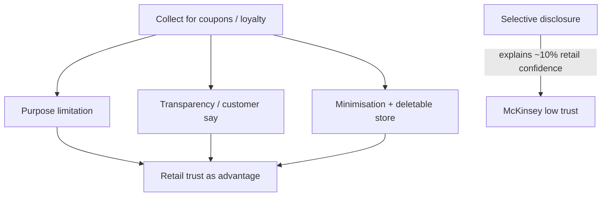
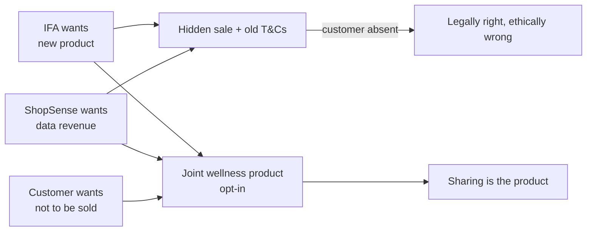

# Lecture T41: Information Privacy — Economics and Strategy — Part 03

**Playlist index:** 41  
**Transcript:** [41-information-privacy-economics-and-strategy-part-03.md](../../transcripts/markdown/41-information-privacy-economics-and-strategy-part-03.md)  
**Video:** https://www.youtube.com/watch?v=EjOF_cVzvNE  
**Week / theme:** Week 13 / From data trade to privacy strategy — trust, RBV, joint product

## Learning objectives
- Use the **McKinsey 2019** confidence numbers to explain why retail trust is a **strategic** asset.
- Apply **purpose limitation, transparency, and data minimisation** to the ShopSense–IFA decision.
- Show why IFA’s analytics strategy fails a strict **resource-based view** test (data not owned).
- Explain why **notice + old consent** is weak, and why a **joint product** is the smarter ethical design.

## What this lecture actually teaches

The session continues the ShopSense / IFA case and turns it from economics toward **privacy as strategy** (next class).

### McKinsey 2019: who is trusted with data
A **McKinsey 2019** survey of how industries are perceived on privacy. **Healthcare and financial services** (IFA’s sector) tend to have a **better image** of how they handle data than other sectors. **Consumer packaged goods, automotive, public sector / government** are weak. **As low as 10 percent** of respondents have confidence in the **retailer** handling the data.

That is why **trust** is even more important for a grocer. If a retail company establishes that data will be handled **responsibly**, that can become **competitive advantage from a strategy perspective** for retail as well.

### Three pointers for ethical data decisions
GDPR is “one set of law” with high standards, being copied or implemented in different countries. Three pointers for organisational decisions:

1. **Purpose limitation** — personal data processed **only for the purpose for which it is collected**, and that purpose is **disclosed**. Grocery data for coupons is **not** for determining insurance premiums.
2. **Transparency** — customers get a **say** on whether data is shared with an **external partner**.
3. **Data minimisation** — in the age of big data, collect **only what is necessary** (e.g. to personalise coupons). Store so that if the customer later wants **deletion**, the organisation can delete from **one place**.

With these, the organisation takes a **responsible** approach and **builds trust**.

### Selective disclosure is not transparency
Instructor: the “disclosure” we see is often **not 100% transparent transfer of information**. It is **selective disclosure** suiting the organisation. That practice **plays into the McKinsey survey** — low confidence because firms disclose only what they want about use and sharing. More strictness would raise confidence.

A student: under purpose limitation, customers still **lack control** over processing and where data is used. Presenter agrees: loyalty sign-up, we **assume** a purpose or **do not fully understand** sharing. Disclosing that would **increase trust**.

### Amazon in the case: loyalty as a chance to charge more
The case refers indirectly to **Amazon** (called “a company”). Amazon **charges customers differently** — **price discrimination**. Same product, different price for you and me. In India Amazon is more a **marketplace**, but the US story taught here: they actually **charge loyal customers more**. Loyal customers may pay more than **new** customers; **they were sued**.

Logic: if you are loyal, Amazon knows you are **locked in** and will come back, so it can charge more. **Very opportunistic**. At some point they did that and were sued.

How firms make you loyal, sign you into a loyalty programme, **track you**, then see that you always return — an opportunity to **charge more**. They have all the data. Classic Bezos line taught: **“We do not throw away any data.”**

Data trade can be **very good or profitable** for organisations and can **hurt individuals** directly and indirectly. This case: you may **pay more premium** or **pay more prices for the same product** if your data is shared. The customer can be a **victim** and can **agree to sharing without knowing consequences**. That is why **GDPR-like regulation** has come. Existing agreements/law often **protect data trade but not customers**. New regulation is meant to close that. **Limiting purpose**: collected for better products and services, **not** for insurance premiums.

### Strategy based on analytics: future challenges
For IFA, ability to offer a **new product based on analytics** is a **differentiation strategy**. Is a business strategy based on **customers’ data** a good idea? Future challenges?

Class: **new regulations** (GDPR hit marketing agencies); **government / surveillance** (Snowden, next case) can shock a whole industry, not only the US.

Instructor’s own challenge: **dependence**. This strategy is based on a **resource**. In **Resource Based View (RBV)** of business strategy: **valuable, rare, inimitable** resources. Data is valuable and rare; they are building a strategy. **But is the data always in IFA’s control?** **Data is not their own.** It is **bought from somebody else**. They depend on another entity.

If ShopSense later sees IFA’s successful strategy, it can **charge more**. **Dependence and opportunism** in business: every company can become opportunistic. Competitors do not have ShopSense; ShopSense has it — classic **VRIO / RBV** story — **but the resource is not in IFA’s control**.

Contrast **Amazon**: recommender strategy on **historical data they fully control**, rare, valuable, inimitable because others do not have that history.

Tomorrow ShopSense says IFA will not pay enough, or **someone else will pay more**, and sells to IFA’s **competitor**. Sustaining the strategy depends on a **third-party data vendor**. They **do not possess** the resource; they **buy it**. That is the future-challenge proposition.

A student: **banks** already have spend analysis; if they sell insurance they **own** the resource and could beat IFA. Instructor: those who have access to data, as far as this case is concerned, yes.

Another student: **Knowledge Based View (KBV)** versus RBV — raw data not owned, but **upgraded to knowledge** that the company owns. Instructor: **absolutely**, but continuing the product still needs the **raw material**; **dependence remains**.

### The ethical problem restated
The broader question from the first slide: it is **the customer’s data** that is exchanged; the customer is the **affected party** but **not in the scene**. Two parties stand there **selling “you and me”** and making money or strategy; **I am not involved**. That is the ethical problem.

If this becomes public (social media less prevalent at the time of writing, but it can blow up), **ShopSense’s image** is hit because ShopSense shared.

### Can all three get what they want?
Wanted outcome: ShopSense gets **money**, IFA gets **new products / strategy**, customer is **not affected**.

Student proposal: **option** with **benefits** if they share; opt into a programme; based on purchase pattern, **lower premium or discounts**. Highlight benefits; let them choose.

Another student: in **car insurance**, third-party cover is **mandatory**; first- and second-party are not. Here it is **opposite**: the **third party is affected** and not highlighted.

Instructor shapes this: take consent **again**, draft as a **programme** — not IFA’s product alone but a **joint product** of retailer and insurer. Then it is clear both jointly offer it; **you can expect they will share resources**. That is a **major decision**; both must agree.

Further student: ShopSense should **inform** loyal customers that data is shared with IFA, with a **positive** frame (better insurance benefits).

Two different ideas: (1) **inform** that data will be shared; (2) **consent**. Instructor: **how many will give consent?** People do not have time. “**It is not working anyway.**”

Compromise suggested: notify, allow **opt-out** (maybe 10 in 100). Instructor’s challenge: **companies are already doing that**. They have consent for sharing; **no legal issue**. **Mandatory notice is difficult**: so many notices, **we do not pay attention**, especially from a grocer. Deals still happen. **Attention problem**. Legally right; **ethical issues continue**.

So the **joint product** — not “IFA product” but **“IFA–ShopSense insurance product”** — is **clear communication**. **One entity** as far as this product is concerned. Then you **do not question data sharing** in the same way. **Smarter solution if they can agree**. Otherwise: **legally right, ethically wrong**.

## Cases and examples from the lecture
- McKinsey 2019: healthcare / financial services trusted; retail confidence **~10%**.
- GDPR as the high-standard template other countries copy.
- **Amazon** loyalty / lock-in **price discrimination**; sued; Bezos: do not throw data away.
- Snowden flagged as the **next** shock to industry (preview of T42).
- Amazon recommenders as RBV **owned** data vs IFA **bought** data.
- Banks’ spend data as a rival resource for insurance products.
- Motor insurance: **third-party cover mandatory** — inverted here, because the data subject is the neglected third party.
- Notice fatigue: grocer emails nobody reads.

## Key terms
| Term | Meaning in this lecture |
|------|-------------------------|
| Purpose limitation | Use only for the disclosed collection purpose |
| Transparency | Customer say on external sharing; not selective disclosure |
| Data minimisation | Only necessary fields; deletable from one store |
| Selective disclosure | Organisations telling only convenient uses — drives low trust |
| RBV / VRIO | Strategy on valuable, rare, inimitable resources you **control** |
| Dependence / opportunism | Vendor can raise price or sell the same data to a rival |
| KBV | Insights/knowledge may be owned even if raw data is not; raw-material dependence remains |
| Joint product | Co-branded ShopSense–IFA insurance so sharing is visible in the offer |
| Attention problem | Notices exist; customers do not read them, so ethics are not fixed |

## Formulas / frameworks
**Ethical decision triad:** purpose limitation + transparency + minimisation → responsible handling → **trust as retail advantage**.

**RBV test on IFA:** data is valuable and rare, **not inimitable-in-possession**, because **ShopSense can resell**. Amazon passes the test; IFA does not.

**Remedy ladder taught:** more disclosure < extra consent (low uptake) < notices (no attention) < **joint product** (sharing is the product).

## Distinctions the instructor insists on
- **Financial services look more trusted than retail** in McKinsey 2019; a grocer selling to an insurer is therefore **especially** dangerous for ShopSense.
- Disclosure as practised is often **selective**, which **is** the confidence problem.
- **Purpose limitation** forbids using coupon data to **set premiums**.
- **RBV fails** if the strategic resource is **rented**. KBV does not erase that dependence.
- The ethical scandal is not only misuse; it is that **the person is not in the deal**.
- **Legal consent + notices** already exist and **do not solve ethics**, because of **attention**.
- **Joint product** is offered as clearer than another T&C checkbox.

## Exam-oriented recap
- ~10% retail data-handling confidence vs better healthcare/finance image.
- Three GDPR-style pointers: purpose, transparency, minimisation (and one-place deletion).
- Amazon: loyal customers charged **more**; sued; never throw data away.
- IFA strategy = differentiation on **un-owned** data → vendor opportunism.
- Customer absent from two-party trade = ethical core.
- Notices fail; **IFA–ShopSense insurance** as the design that puts the customer in the loop.
- Bridge to next class: **privacy as strategy** (Apple vs safety / Snowden).
