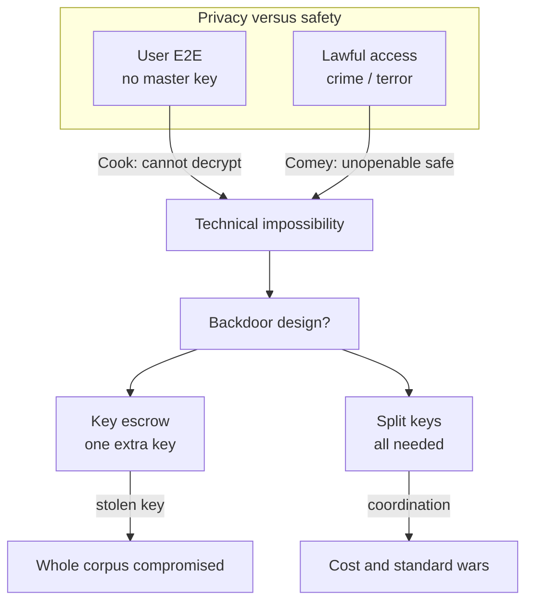

# Lecture T42: Privacy — Strategy and Safety — Part 01

**Playlist index:** 42  
**Transcript:** [42-privacy-strategy-and-safety-part-01.md](../../transcripts/markdown/42-privacy-strategy-and-safety-part-01.md)  
**Video:** https://www.youtube.com/watch?v=All1JR-Avjw  
**Week / theme:** Week 14 capstone / Apple, Snowden, encryption, backdoors

## Learning objectives
- Recap why privacy is **individual, economic, and strategic**, then add **safety vs privacy**.
- Reconstruct **PRISM / Snowden** and the **Snowden effect** on Cisco, cloud, and “NSA-resistant” marketing.
- Walk Apple’s encryption path: optional FDE → **default FDE (iOS 8)** → **iMessage E2E with no master key**.
- Compare **no encryption, E2E, key escrow, and split keys** as government-access designs.

## What this lecture actually teaches

### Course recap the instructor wants in the room
Last classroom day of a long arc: CIA triangle, management frameworks and standards, governance, recent examples where **data protection failed as corporate governance**. Storage and processing keep growing; the challenge is **dynamic**, not static.

On privacy they have already seen:
- Individual **concern**.
- **Economic** value — valuation is hard because **context specific**; people **advocate** privacy but are **not willing to pay much** (paradox).
- Behavioural tools: if you **enjoy** privacy and someone proposes to **remove** it, **loss aversion** (higher pain) and **endowment** (hard to part with). Pain and gain are **emotional**, not only rational; people can be “very irrational when we ask for money, when we are in pain.”
- At **aggregate** level, organisations **freely trade** private data for **strategy, profiling, positioning**. Ethical challenge: individuals **are not in the negotiation**.

Privacy is **pervasive**: personal, economic, strategic. Today’s cases are a **capstone**: they summarise privacy **and** security and link them to **safety**. Topic: **privacy versus safety**.

Complex mix: business models tied to privacy; **government as big brother** that thinks **no law should prevent access or interception**; a decade of **espionage** charges when collection became public. **No laws apply to government** in that image — they can aggregate, analyse, profile. Two Apple cases (A then B). Apple has risen to the top in **market valuation / capitalisation**. Analyse **why** the firm takes the positions it takes. It can look as if the **company** protects privacy “like God or like what government should be doing,” while government says privacy is **not very important**.

### The case: Apple — Privacy versus Safety
Group 4 (Colonel Jagvir, Prasad Deshmukh, Sanjay). Apple: founded **1 April 1976** by Steve Jobs, Steve Wozniak, Ronald Wayne; HQ California; iPad, iPhone, watches, earbuds, cloud services.

One side: **right to privacy** — fundamental, **not absolute**. Other side: surveillance agencies, **national security**, **front door and back door**. Privacy paradox already studied; also prospect theory, endowment, WTP/WTA.

**9 September 2015:** Tim Cook launches **iPhone 6S** (upgrade of 6) with **enhanced security, default encryption**. Cook’s statement: concern for customers’ **fundamental right to privacy**. **Cyrus** (district attorney) states the law-enforcement concern: **national security**, justice for victims and families.

### Why upgrade default encryption? Snowden
**Edward Snowden**, NSA contractor, **5 June 2013**, leaked the clandestine US programme **PRISM**: NSA collecting emails, chats, social posts, **phone tapping** from companies. Users and firms **shocked**; **foreign leaders outraged** that phones were tapped. Agencies **defended** it as a **key weapon against crime**.

**James Comey** (FBI director): internet and telecom firms treat privacy protection as a **business strategic advantage**. Encryption is “a **closet that cannot be opened**” or a “**safe that cannot be cracked**” — **at what cost?**

Hypothetical taught: a **murder** victim; proof is in email/phone; device **encrypted**; how do you give **justice** to the family?

**iOS 9 / new model:** **two-factor authentication**, upgraded encryption, passcode **four digits → six**. Agencies **displeased** — harder to crack; national-security concern.

### Tim Cook’s three issues
1. Users’ right to privacy **and** agencies’ national-security / case-cracking needs — both are “right.” **Find a balance midway.**
2. If Apple gives **limited access to US authorities**, **similar requests come from other governments**, including **notorious governments with human-rights violations**.
3. If Apple **cooperates** with law enforcement, does it **lose customer trust** and **market share**?

Class on (2): if Apple gives access to one country and not another, **Apple is deciding which country is a good country** — a company playing **moral judge**. They do business globally; they **cannot discriminate**; they would have to comply with **other countries too**. So: **one policy for all countries**.

Instructor on (3) and China: Cook looks like an **evangelist**, ideological. **Didn’t the same company let the Chinese government audit its data centre** for Chinese individuals’ data? If China got access, how can they refuse a **US backdoor**? Presenters agree they cannot have **different policies for themselves and for others**. The case will return to all three issues.

### PRISM, MUSCULAR, charges, asylum
NSA collected phone calls and data **within the USA and between the USA and other countries**. Telecoms **AT&T and Verizon**. **Nine internet companies compelled legally** to share. **Yahoo and others went to court** and challenged. Joint operation with the UK: **MUSCULAR**. Mixed public reaction: Snowden as **hero** (privacy) or **traitor**. US filed **criminal charges** for theft of government property and **Espionage Act** (spying against the government). Snowden sought countries; **Russia** gave **temporary asylum**; by the lecture, **permanent residency**.

### Snowden effect on industry
- **Cisco**: drop in customers / sales in **China**.
- **Qualcomm and HP**: sales declined.
- Chinese media/government **accused Apple of sharing secret data with US agencies**.
- **Brazil**: **data localisation** (as studied); shifted from **Microsoft Outlook to a domestic email** company.
- **American cloud** firms lost business as customers shifted away.
- **Non-US companies exploited** the moment: **“NSA-resistant”** services; claim they will not share with other companies or governments.

### 2015 survey beats taught in class
- Majority of Americans **not confident** about security of communication, landline, cell, email.
- **25%** changed technology (mobiles or other services) after the incident.
- **74%** gave more priority to **privacy and freedom** than to **national safety** (as presented).
- Only **55%** still satisfied with security/safety of mobiles and email.
- Prospect theory / endowment / WTP–WTA recalled: some will **disclose data for financial rewards or better services** yet still fear government/company **exploitation**.
- **Asia vs Europe/Canada:** Asians **more willing** to trade data for improved services or money; **Germans and Canadians less willing**.
- Cross-country chart (USA, Europe, China, India, Brazil) on what is “slightly/not private” vs “moderately/very private”: **financial** data highly private in USA; **India** has a **larger share** treating some categories as only slightly private. **Age/sex** often “not private” in USA, varies in India. **Web visits** differ by country.
- “Only you and whom you authorise”: **email content 68%** very important (13% somewhat, 15% not too); **location when using internet 54%** very / 16% somewhat / **26% not**; **times of day online** only **33%** very important, **45%** not that important.
- Still **50%** claimed they had been a **victim of data breach**.
- Most think **government or companies** (not themselves) must ensure safety.
- **62%** never change passwords regularly; **39%** used **no password** on mobile.

### Industry response after a December 2013 Obama meeting
Senior telecom and internet executives met **President Obama** on consequences of NSA surveillance. Then:
- More investment in **privacy controls and encryption**.
- **Google**: encrypt **traffic between data centres**.
- **IBM**: build data centres **outside the USA** so US government cannot monitor as easily.
- **Apple**: planned to go **out of USA, in Europe**.
- Companies started **telling users when government asks for data** (transparency reports).

### Technical path: how Apple encrypted
Old web: **HTTP**, anyone who intercepts can snoop. Then encryption. **Symmetric** encryption “not very secure” in this telling. Then **public/private**: **public key locks**, data in transit cannot be read; **private key** (recipient) decrypts.

Apple developed **encrypted hardware and software** early.

- **iOS 3 / iPhone 3GS (2009):** **full disk encryption (FDE)**. Problems: if adversary has **physical access**, early tools were **breakable**; **before iOS 8** the user had to **opt in** — not default.
- **iOS 8** (iPhone **4S** or later): FDE **default**, so even non-tech users get it if data leaks.
- Then **end-to-end** on **iMessage**. Keys generated and stored on **sender and recipient devices**. **Apple has no master key**; **even Apple cannot decrypt** by technical means.
- **Internal encryption:** user **passcode combined with a unique key** per user and device. **No common master key** that unlocks every iPhone.
- Robust algorithms; a hacker could try to find a **bug**, but the design **absolved Apple of liability**: if government forces Apple to decrypt, **it cannot**, as Tim Cook explained.

What the phone / Apple **can** see (as tabled):
- iPhone can access email, calendars, contacts from **outside providers**; health and usage.
- Some categories Apple can see but **anonymised** (search, etc.).
- Revenue streams (**iTunes / Apple Music**) use data for **personalisation / recommendations**.
- Technically readable but Apple **promises not to read**: emails, calendars, contacts, photos, bookmarks, passwords, **backups**.

**Google follow-on:** Gmail encryption **2010**, searches **2011**, cloud storage **2013**; **FDE** in Android from **Lollipop**. Android’s problem: **low-capability hardware** — encryption **performance penalty**. Google added FDE but **gave users a choice**; **not default**. Encryption tools exist but the public is barely aware; they are **not user-friendly**, reserved for “techie people,” and avoided on cheap devices.

### Lawful access: CALEA, UK, China, EU
Many countries press big tech for **backdoor** access for crime and counter-terrorism. US wanted **technology embedded in the product** for backdoor **anytime**. Government argument: existing law already set a precedent — **CALEA (Communications Assistance for Law Enforcement Act), 1994**: intercept / **wiretap**; later amended to include **VoIP**.

**UK:** PM **David Cameron** — in extreme situations (terror) they already intercept; why full privacy when **lives** are involved?

**China (2015):** mandated backdoor for counter-terrorism.

**EU block:** opposite stance — **promoted encryption**, including in **government services**.

### Four designs: who can read the data
| Design | Who can access | Problem taught |
|--------|----------------|----------------|
| **No encryption** | User, firms, government, “bad guys” | Accidental leaks; default unprotected |
| **End-to-end (user key only)** | User | Government says it **protects criminals**; Apple locked out too |
| **Key escrow** | User + holder of extra key (government) | Must **secure that key**; if stolen, **all data** under that key is gone; Apple can be locked out; associated with **hostile** agencies in the discussion |
| **Split keys / secret sharing** | Need **multiple keys in sequence** to unlock | Better if one key leaks; **hard to coordinate** across governments, firms, devices |

## Cases and examples from the lecture
- iPhone **6S**, 9 Sep 2015, Cook vs DA Cyrus.
- Snowden, **PRISM**, **MUSCULAR**, AT&T/Verizon, nine companies, Espionage Act, Russian residency.
- Comey: closet/safe that cannot be opened.
- Murder-victim phone hypothetical.
- Cisco/Qualcomm/HP China; Brazil localisation; NSA-resistant vendors.
- 2015 surveys: 25%, 74%, 55%, 50% breach victims, 62% stale passwords, 39% no phone PIN.
- Obama Dec 2013 meeting; Google DC links; IBM offshore DCs.
- HTTP → public-key crypto; FDE 2009 → default iOS 8; iMessage E2E.
- Android Lollipop FDE optional because of **slow hardware**.
- CALEA 1994 + VoIP; Cameron; China 2015; EU pro-encryption.
- Key escrow vs split keys.

## Key terms
| Term | Meaning in this lecture |
|------|-------------------------|
| Privacy vs safety | Capstone tension: E2E privacy vs national/victim justice |
| PRISM | NSA collection from firms, revealed 5 June 2013 |
| MUSCULAR | NSA–UK joint collection |
| Snowden effect | Lost US tech sales, localisation, NSA-resistant marketing |
| FDE | Full disk encryption; default from iOS 8 |
| Master key | What Apple claims **not** to have after passcode+device UID |
| CALEA | 1994 US lawful intercept statute, later VoIP |
| Key escrow | Extra government-held key |
| Split keys / secret sharing | Several keys required in sequence |

## Formulas / frameworks
**Cook’s triad:** balance privacy/safety; **one global policy** or become a moral judge of states; cooperation vs **trust/market share**.

**Encryption timeline:** optional breakable FDE (iOS 3) → default FDE (iOS 8) → E2E messaging with keys only on devices.

**Access ladder:** none / E2E / escrow / split keys — security of the **extra key** is the government’s hidden cost.

## Distinctions the instructor insists on
- Privacy is already **paradoxical and behavioural**; this case adds **state power** that does not play by the same law.
- Apple’s stance looks **ideological** but must be read as **strategy** (developed in later parts).
- **Giving the US a special door** forces the same door for **repressive** states — or Apple becomes a **judge of countries**.
- **China audit** is already on the table as a **consistency** problem.
- Default encryption matters because **most people will never turn optional crypto on**, especially on slow Androids.
- “Apple cannot decrypt” is a **technical** claim that **shifts liability**, not only a slogan.

## Exam-oriented recap
- Capstone: individual paradox + data trade ethics + **government as big brother**.
- Snowden/PRISM/MUSCULAR; hero vs traitor; industry **Snowden effect**.
- Cook’s three dilemmas; Comey’s unopenable safe; 6-digit passcode / 2FA / default crypto.
- iOS 8 default FDE; iMessage E2E; **no master key** (passcode + device-unique key).
- CALEA vs EU encryption policy; escrow vs split keys.
- Next: why governments want backdoors **now**, and Apple’s **business model** versus Google’s.
