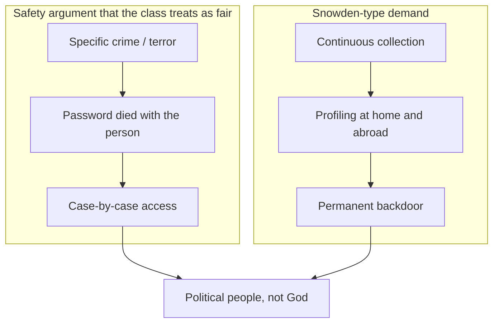
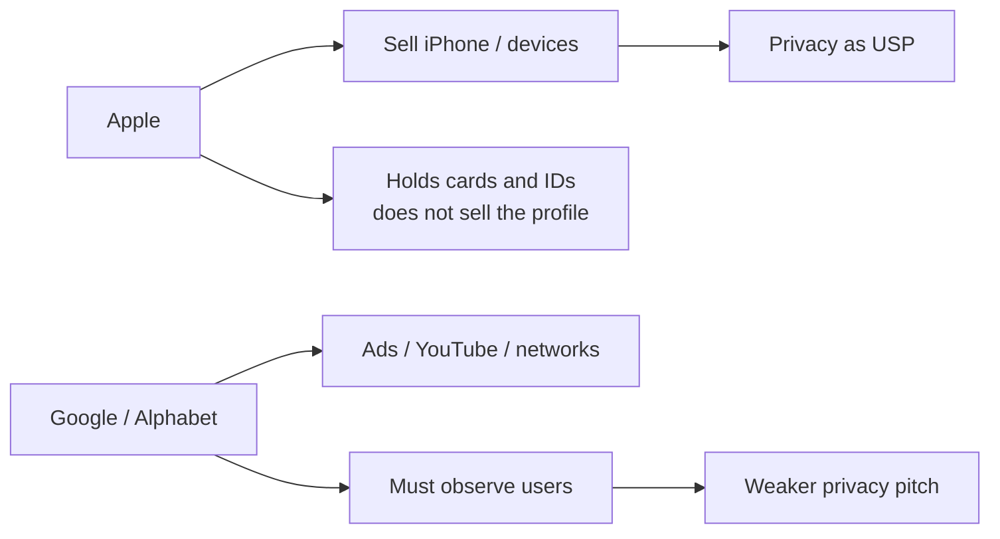

# Lecture T43: Privacy — Strategy and Safety — Part 02

**Playlist index:** 43  
**Transcript:** [43-privacy-strategy-and-safety-part-02.md](../../transcripts/markdown/43-privacy-strategy-and-safety-part-02.md)  
**Video:** https://www.youtube.com/watch?v=MlYAd9Ip6Nw  
**Week / theme:** Week 14 capstone / Backdoors, investigation vs monitoring, Apple vs Google models

## Learning objectives
- Explain why default iOS 8 FDE changed **criminal investigation** (Manhattan DA: **74 of 92** phones dark).
- Separate **post-incident investigation** from **continuous government monitoring** (instructor’s distinction).
- Compare **key-disclosure law**: US (no forced self-incrimination) vs UK/Australia vs **India IT Act s.69 (up to 7 years)**.
- Tie Apple’s privacy **USP** to a business model that **does not sell ads**, and flag the **China data-centre** contradiction.

## What this lecture actually teaches

Part 02 continues the backdoor debate from T42’s escrow/split-key table.

### Why government is in a hurry: evidence now lives on the phone
Life used to be letters and paper in cabinets; now “each and every day of our life” is on a device. **October 2014–June 2015**, Manhattan District Attorney: could not access potential evidence from **74 of 92** iPhone **iOS 8** cases — the first iOS with **default FDE**. **James Comey** quote: encryption **hinders** solving cases; it **shields criminals**; the phone may be the difference between **conviction and letting them go**. Politicians: technology that **prevents government access should not exist**. They want a **default backdoor** in whatever firms ship.

**Do you agree with this limit on personal privacy?** A student: mandating keys/backdoors will **stifle innovation** — backdoors would have to track changing tech; government **cannot keep up**; mismatch. Presenters: many stakeholders; **hard to coordinate** how a backdoor is implemented.

### Geopolitics vs “privacy as a misnomer”
Colonel Vijay (class): almost no serious system lacks backdoors; **geopolitics**. Snowden showed NSA branches in **cyber warfare**, including **infiltration of Huawei**. “**Personal privacy is a fallacy**” for the public fight; in open corporate life some semblance is needed (yesterday’s **supermarket** case, medical records), but **states will always demand access**. Firms that want to stay in a country **cooperate**.

**Five Eyes (“5 I” in captions):** foundation **1941**; **US, UK, New Zealand, Australia, Canada** cooperate on **signals intelligence**. **Stuxnet** (Iran) attributed to **TAO — Tailored Access Operations**, NSA cyber-espionage unit; also active “in our country,” hush-hush. Internet itself from defence. **Ransomware as a service** deliberately placed on the **dark web** so malware reaches OnePlus, iPhone, etc. For day-to-day life, limit spread of information; in the larger world, governments **limit privacy** for national interest. Presenter: **100% privacy cannot be ensured**; states use this as a **warfare tool**; users **should not be kept in the dark**.

### Instructor: investigation is not the same as monitoring
Two sides:

**A. After an incident.** FBI/investigation; militant or criminal **died**, **password died with them**; without Apple decrypting, **no justice**; **safety** (national and individual) needs access.

**B. What the Snowden material actually shows.** Not response to an incident — **continuous monitoring**, extensive collection **inside and outside** the country, **profiling**. A backdoor then is **continuously open**. Government wants a backdoor **not for investigation but for monitoring**. That **makes the case very different**.

“Government” sounds like **God** or an extraterrestrial agent; it is **people**, in **political parties**, with **individual and political interests**. Sensitive territory.

Agencies also argue they already have **telecom metadata** (AT&T, Verizon) and **cloud backups**. The hard case remains the **smoking-gun** evidence on a dead victim’s phone — **unsolvable** without the device.

### Who can be forced to hand over a password
**US:** law enforcement **cannot make a person witness against himself** — cannot force **self-incrimination**. **Key disclosure** only if **voluntary**.

**UK and Australia:** can **legally force** disclosure of password / encryption key.

**India:** **IT Act 2000, section 69**, amended **2008** — if you do not comply with law enforcement to **decrypt**, **up to 7 years** in prison.

National-security argument: after Apple E2E, **terror groups hide** in the technology, recruit, kill; intercepting to **prevent attacks** becomes impossible.

### Implications of a designed-in backdoor
If Apple (or any firm) **designs a backdoor from the start**, it is not only for “the” government:
- **Repressive regimes** monitor citizens and **dissidents**, prosecute, harm.
- **Hackers** who know a backdoor exists will try to **exploit** it.
- **Cybersecurity of the key:** creating a backdoor may not be hard; **protecting the key** is. Master key must be **stored, transferred, accessed** — many **threat vectors**, **high cost**. Over years you amass huge data; **one incident leaks all**. If **escrow keys** are compromised, **all data created with that key is permanently compromised**.
- **Greece:** lawful-interception **backdoor in national telephone switches**; someone listened to **parliament and the prime minister** during a sensitive **Olympic bid**. Intentional backbone can hit **governments themselves**.

Business: hard for tech firms to **coordinate a standard**. After Snowden, some considered **two product lines** — with backbone and without. Raises **cost**; **foreign customers** leave for vendors advertising **privacy protection**. After a terror attack, Apple could be **sued** for not complying after warnings. **July 2015:** a US senator proposed that **crime victims sue** a company if **encrypted devices allowed the user to commit a crime**.

### Apple’s privacy rating and the business-model contrast
Privacy became a **USP and marketing** line. An independent digital-privacy organisation gave Apple a **top rating in 2015** — only **9 of 24** tech giants. Experts: Apple is more focused on privacy / less tracking **because of its business model**, unlike ShopSense living on customer data.

**Apple revenue:** mainly **iPhone manufacturing and sales**; rest services, iPads, Macs. Global split: America, Europe, Greater China, rest of Asia. **None of that revenue is generated from data analytics or selling user data.** That does **not** mean Apple stores nothing: about **400 million iTunes accounts** (App Store purchases) → **credit-card data** of ~400 million; Apple ID takes **name and demographics**. Apple **has** user data; it **does not use it to generate revenue**.

**Google / Alphabet:** **major chunk from marketing**; YouTube ads and networks. **Reliant on user data.** That is why Apple-like firms need not track, and why they get top privacy ratings.

### China: localisation, audit, alleged code share
**2014:** more Apple sales in **China than in the US**. Lawsuits and regulation: Apple **stored Chinese citizens’ data in China** (third-largest data centre). Chinese government **did not allow transfer outside China**.

**2015:** China accused Apple of **backdoors / US tracking**. Demanded a **security audit**. Apple initially refused (fear officials would seek a backdoor). Many said Apple **eventually agreed** and **might have shared code** — heavy criticism. Tim Cook press release: **never compromised privacy, never allowed backdoor for any government**.

Privacy was **compromised for safety or for law** not only with China but with the US government as well. That contradiction carries into Part 03.

## Cases and examples from the lecture
- Manhattan DA: **74 / 92** iOS 8 phones inaccessible (Oct 2014–Jun 2015).
- Snowden: Huawei infiltration; **Five Eyes**; **TAO / Stuxnet**; dark-web malware.
- Dead suspect, password gone, smoking-gun phone.
- US Fifth-Amendment-style limit vs UK/Australia compelled keys vs **India s.69, 7 years**.
- Terror recruitment behind E2E.
- Greek switch backdoor, Olympic-bid eavesdropping.
- Dual-product idea after Snowden; senator’s **victim-lawsuit** bill (July 2015).
- 2015 privacy ranking 9/24; **400 million** iTunes accounts.
- Google ads vs Apple hardware.
- China DC + audit + Cook’s “never a backdoor” letter.

## Key terms
| Term | Meaning in this lecture |
|------|-------------------------|
| Default FDE effect | Lawful devices go dark (74 of 92) |
| Investigation vs monitoring | After a crime vs always-on collection/profiling |
| Five Eyes | US–UK–Canada–Australia–NZ SIGINT pact (1941) |
| TAO | NSA Tailored Access Operations |
| Key disclosure law | Whether you can be jailed for not decrypting |
| IT Act s.69 | India: refuse to decrypt → up to 7 years (2008 amendment) |
| Escrow compromise | One stolen master key burns the whole corpus |
| Privacy USP | Marketing rating enabled by **not** living on ads |
| China audit | Local storage + alleged code review vs “no backdoor” claim |

## Formulas / frameworks
**Access-law comparison**

| Jurisdiction | Can the state force the password? |
|--------------|-----------------------------------|
| US | No compelled self-incrimination; voluntary disclosure |
| UK, Australia | Yes, legally force key disclosure |
| India | s.69 IT Act: non-compliance up to **7 years** |

**Backdoor risk chain:** repressive use → hacker use → key-management cost → **single leak of all history** → even **state victims** (Greece).

## Distinctions the instructor insists on
- **74/92** is about **default** encryption, not about criminals being especially clever.
- **Safety after a death** is a serious argument; **Snowden-style bulk monitoring** is a **different** demand. Do not mix them.
- Government is **not God**; it is **partisan people**.
- A backdoor for “good” US agencies is a backdoor for **hostile regimes and hackers**.
- Apple “does not sell data” ≠ Apple “has no data.” It has **cards and IDs**; it does not **monetise** them like Google.
- **China audit** undercuts a simple moral reading of the US encryption fight.

## Exam-oriented recap
- iOS 8 default FDE: Manhattan **74 of 92** dark phones; Comey: unopenable evidence.
- Instructor split: **case investigation** vs **permanent monitoring**.
- US vs UK/Australia vs **India s.69 / 7 years**.
- Backdoor costs: dissidents, hackers, master-key leak, Greek parliament.
- Apple = devices revenue, privacy ratings; Google = ads; 400M iTunes records still held.
- China: in-country DC, audit, possible code share, Cook denial.
- Next: moral obligation, COVID apps, ATT, CSAM, San Bernardino.
