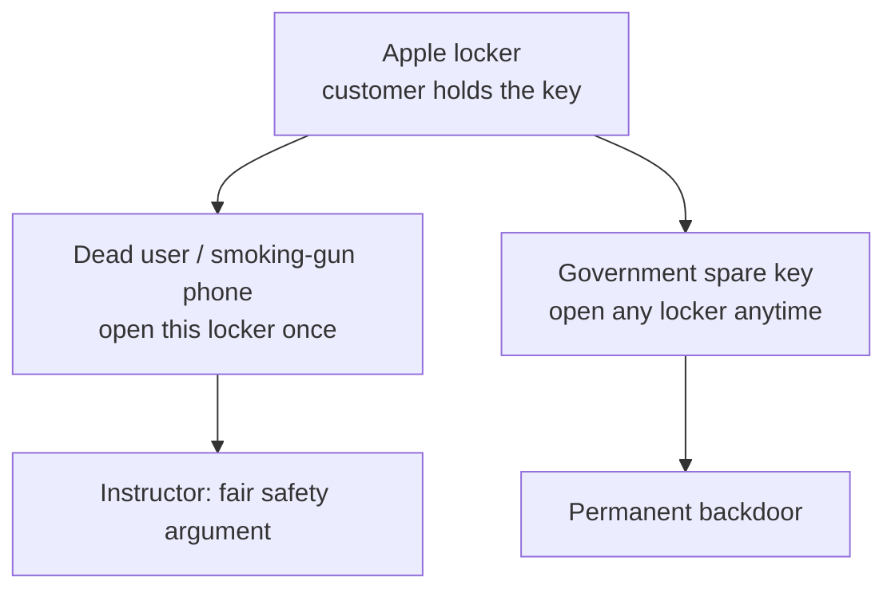
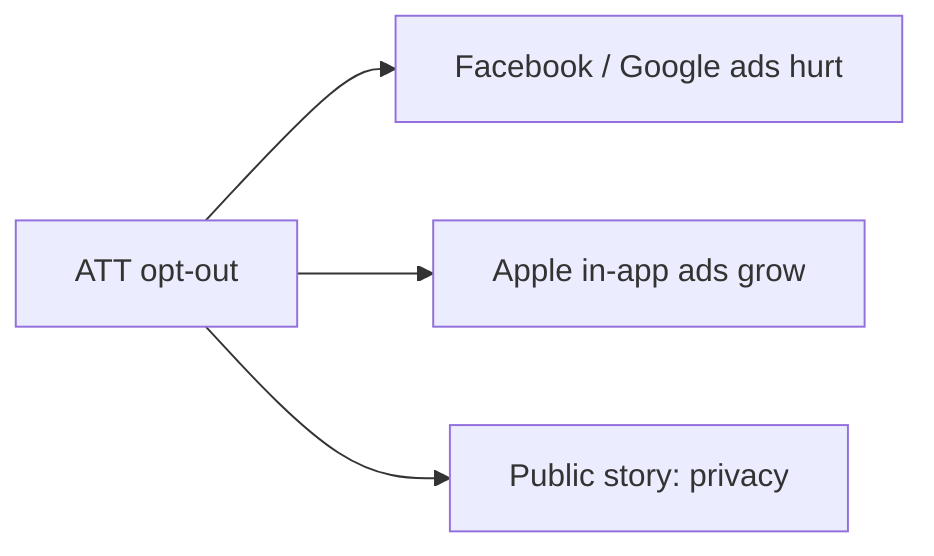

# Lecture T44: Privacy — Strategy and Safety — Part 03

**Playlist index:** 44  
**Transcript:** [44-privacy-strategy-and-safety-part-03.md](../../transcripts/markdown/44-privacy-strategy-and-safety-part-03.md)  
**Video:** https://www.youtube.com/watch?v=y93i1XbphTM  
**Week / theme:** Week 14 capstone / Locker metaphor, COVID apps, ATT, CSAM, San Bernardino

## Learning objectives
- Use the **locker** metaphor to split **case-by-case opening** from a **permanent government key**.
- Compare **Apple–Google exposure notification** with **Aarogya Setu / StopCOVID** (location vs Bluetooth random IDs).
- Explain **ATT**, **CSAM neural hash**, and why Google’s toddler-photo false alarm is the cautionary tale.
- Read Apple’s privacy fights as **strategy**: San Bernardino, Israel crack, and **advertising share** versus Facebook/Google.

## What this lecture actually teaches

US opinion was **split**: some backed Apple never giving user data to government; others wanted **compliance for safety** — **family safety over privacy**. Question: does **any** organisation have a **moral obligation** to help government **or** to protect customer privacy?

### Culture, law of the land, and Apple’s China exception
A student: **collectivist** cultures emphasise **collective good** and share more easily; **individualist** cultures prioritise personal privacy even at a cost. Apple operates in both. An **extreme global privacy position** is hard, especially when privacy is also a **strategic motive**. In **China**, when **profits can take a hit**, the company **modifies**. Moral obligation to help government is **driven by the law of the land**, and law is **influenced by culture**. No absolute answer. Matches the earlier **cross-country survey**.

Another student: trade-off, but **continuous snooping** of everyone is not the way; if there is a **terror link**, use **shared keys** (from the three methods), and Apple bears the cost.

Another: Apple’s moral obligation is to **customer safety**. Safety = **privacy** plus **bodily harm**. Apple cannot stop a bomb; it must **help government** which can. If a bomb goes off in an **Apple store** by a terrorist who used an Apple phone, Apple **loses more customers to save one**. Helping government is **indirectly helping customers**. Presenter: that is a common online-debate line.

### Instructor: the locker, and two kinds of access
Apple’s claim: we manufacture a **locker**, sell it **with the keys** to the customer; **we do not hold the key**; locker belongs to the customer. Government asks what is inside; Apple: **we do not have the keys; ask the user**.

**Weakness:** when a person **dies**, the password **does not exist**. Then there should be **a way to open the locker**. The instructor calls that a **fair argument for national safety / security** — otherwise how do you catch criminals and ensure justice?

**Different demand:** a **separate key created for government**, kept always, so government can open the locker **anytime**. That is the **permanent backdoor** governments want: **anytime access** to citizens’ phones.

**These two are mixed in the case.** FBI/government: is it **case to case** or **continuous**? Creating a backdoor **permanently** is the matter of concern.

### COVID contact tracing: Apple–Google vs governments
Not only national security: **pandemic safety**. **Aarogya Setu** in India (encouraged by government). A similar stack from **Google and Apple together** for **contact tracing**.

**How the Apple–Google Exposure Notification system was taught (video in class):**
- Public-health apps work only if **many people download**; privacy fear blocks uptake.
- Engineers’ pitch: people should **never choose between privacy and community health**.
- Apps using the system **cannot track location**.
- System **does not share identity** with Google, Apple, or other users.
- Opted-in phones generate a **random number sequence that changes every few minutes**.
- **Bluetooth:** nearby opted-in phones **exchange random numbers**.
- If someone later tests positive and **reports in the app**, phones that exchanged numbers in the **last 14 days** get an **exposure notification** — **without revealing identity**.
- Health authorities can then help with testing/treatment.

**Controversies:**
- Government wanted **more control**: track **who was contacted and locations**. Apple and Google **refused**.
- **France:** major backlash; health minister: Apple/Google, never in a “good situation of economy,” not helping. France built **StopCOVID**, like Aarogya Setu.
- **Germany, Italy, Saudi Arabia** used the Apple–Google model.
- Apple/Google: **no location**, keep it **private to the user**. Governments/health orgs wanted **locations of contacted patients**.
- **Loopholes:** user must **self-notify** a positive result; **fake reporting** could cause chaos if a group did it together.

**Aarogya Setu (instructor close):** not very successful; opposition said **surveillance / abuse**. IIM Bangalore workshop on transparency: government said the app is **open source** — **user-end code open**, **server-side code not open**. Once data goes to the server, that part was **not** open source. **Lack of clarity** for users.

### ATT, Facebook’s $10 billion, and copycats
Companies that **depend on Apple and Google** (and Facebook) to collect data were hit when Apple changed policy.

**iOS 14 App Tracking Transparency (ATT):** user can see **what an app is tracking** and **opt out**. **Facebook** suffered about **$10 billion** revenue hit. **~16 marketing agencies** wrote to Apple in displeasure.

Positive copy: **Android 11** similar feature; **Zoom** added encryption; privacy-positioned products **DuckDuckGo** (search without tracking, vs Google’s UX-from-data), **Signal**, **Brave**.

Class: who uses these for privacy? One student uses DuckDuckGo and **Tor**; privacy especially for information-seeking; **Tor fails for banking** because apps demand **location**.

Survey taught: **89%** care more about data privacy; **40%** willing to spend **time and money** to protect data; **29%** **switched apps/services** for privacy; **90%** somewhat-to-very concerned. **WhatsApp** privacy-policy update after **Facebook acquisition** (data for marketing) → a **small fraction** moved to **Signal**.

### CSAM detection: neural hash on device
Recent Apple development: **CSAM — Child Sexual Abuse Materials**. Aim: **middle ground** — find CSAM **without compromising** user privacy.

**Neural hash** (not ordinary file hash):
- Ordinary hash: **one-bit change → different hash**.
- Neural hash is **context specific**: two images a **human** sees as the **same photo without colour** get the **same hash**; a **different** picture gets a different hash.

**On-device**, **before upload**. Not on Apple servers. Hash compared to **NCMEC** (National Center for Missing and Exploited Children) and other independent CSAM databases (e.g. dark web sources) when a photo is uploaded to **iCloud**.

Two technologies:
1. **Private set intersection** — check membership in the database; Apple designed it **doubly encrypted** so matching does not casually expose users.
2. **Threshold secret sharing** — **not** report on a **single** match. A **threshold** of CSAM flags must be crossed; **both layers decrypt** only then; images revealed; then **manual review** before law enforcement.

If no CSAM, Apple **learns nothing**; does not report entire usage. **Safety voucher** created on device, then upload; PSI compares; threshold; manual review. Multiple checks.

**Google cautionary case:** similar tech **falsely triggered** on a father photographing his **toddler**; reported to law enforcement **without manual review**; **embarrassment**; police filed **no charges**; Google **locked the account and did not restore** — history and photos **destroyed**.

Instructor cuts off further recent CSAM news: stay **in the scope of the case**.

### San Bernardino: the actual climax of Case A
**San Bernardino:** militants killed **14 people**. FBI investigating; **Apple refused to create a backdoor**. Incident **blew up**. Agencies believed Apple was **not cooperating** with a **national-safety** investigation. FBI blamed encryption as a **marketing pitch**. Several indications in the case: the position is **not purely** people’s privacy — it is to **position the product** as privacy-preserving and to **protect that position**.

Larger view: in **that particular case**, a company **should cooperate** — **only for that case**, **not** a permanent backdoor. The case was very serious.

**What happened:** FBI **cracked it**. They went to **Israel**. Apple did not disclose. **Israeli hackers proved** Apple’s “nobody can access” claim wrong. That **opened the vulnerability** of Apple devices in public. **Embarrassment**: not even government, but a **hacker**, can. Ending **not in Apple’s favour**. Hard stance of privacy vs safety in **extreme cases** was **perhaps not justified**. Takeaway from Case A.

### Privacy as marketing, and who needs personal data
Apple revenues (as already shown) come from **high-end products**, not databases or ads. **Google and Facebook** live on **online advertising**, which **requires data**. If privacy were complete — **no access to personal data** — **that industry cannot exist**. **Hard reality.** A **sales / marketing pitch** is “quite visible” in these cases.

### ATT again: not charity — advertising strategy
**2017 / ATT:** other apps on iPhone can track activity across apps (pages browsed, etc.). User can **switch it off**, which **hurts advertising**. Facebook/Google revenues “substantially got affected.” Apple says it brings **transparency**. It also **hugely affects other businesses**.

Are Apple and Google competitors? One sells **products**, one sells **ads**. Why **kill Facebook’s revenues** (~$10B) if Facebook is not an OS rival?

Student theories: millennials; bargaining power of Google/Facebook apps on iPhone; ATT also against **malicious apps**; India has banned apps on Android; iOS-specific apps and tracking.

Instructor’s read: **Apple is also into advertising**. ATT **kills advertising competitors**. Digital ads have **exceeded traditional ads**. Apple wants **its share**. ATT encourages ads **through Apple apps on iPhone**, not through **search or Facebook**. Hurting Facebook and Google **increases Apple’s advertising share**. **Smart positioning:** (1) we protect your privacy; (2) we increase our ad revenues. Users hear **gods interested in our welfare**; these are **carefully crafted business strategies**.

Related: **Apple Pay only** — other card options disconnected; people may think privacy; **every transaction, other banks pay commission**.

### Closing debate the instructor leaves open
Real debate: governments’ **outright backdoor to all devices for governance** versus citizens’ fear that **private data can be abused**. **Continuous monitoring vs case-to-case investigation**; **permanent backdoor** as a government need. Ongoing. Firms that **thrive on privacy as strategy** (Apple) **like these cases in the media**.

## Cases and examples from the lecture
- Split US public after FBI fight; collectivist vs individualist answer to moral obligation.
- Bomb-in-Apple-store hypothetical.
- Locker sold with keys; dead user’s missing password.
- Apple–Google Bluetooth random IDs, 14-day window, no location/identity.
- France **StopCOVID**; Germany/Italy/Saudi on Apple–Google model; **Aarogya Setu** client open / server closed.
- Fake-positive COVID reports.
- iOS 14 ATT; Facebook **$10B**; 16 agencies’ letter; Android 11; Zoom; DuckDuckGo, Signal, Brave, Tor vs banking apps.
- WhatsApp policy after Facebook buy.
- CSAM neural hash, NCMEC, PSI, threshold secret sharing, manual review vs Google toddler false positive and account wipe.
- **San Bernardino 14 dead**; Apple refusal; **Israel** crack; marketing-pitch critique.
- Apple Pay commissions.

## Key terms
| Term | Meaning in this lecture |
|------|-------------------------|
| Locker metaphor | Customer holds the only key; Apple claims it cannot open |
| Case-by-case vs permanent | Fair opening of a dead user’s device vs always-on spare key |
| Exposure notification | Bluetooth random IDs; no location; user-reported positive |
| StopCOVID / Aarogya Setu | State apps that wanted more location/control than Apple–Google |
| ATT | App Tracking Transparency — per-app tracking switch |
| CSAM | Child Sexual Abuse Material detection |
| Neural hash | Perceptual hash: same scene, same hash; unlike SHA-style file hash |
| Private set intersection | Match against CSAM DB without Apple learning non-matches |
| Threshold secret sharing | Do not decrypt/report until many hits; then humans review |
| San Bernardino | 14 killed; Apple refused backdoor; FBI cracked via Israel |

## Formulas / frameworks
**Safety–privacy strategy map**

| Move | Public story | Instructor’s extra reading |
|------|----------------|----------------------------|
| Refuse FBI OS for one phone | Privacy principle | Also **protect the marketing position** |
| Exposure Notification | Privacy **and** health | Governments still wanted **location** |
| ATT | User transparency | **Shift digital ad share** to Apple |
| CSAM on-device hash | Middle ground | Threshold + humans vs Google’s false positive |

## Distinctions the instructor insists on
- **Culture and profit** explain Apple-in-China better than pure ethics.
- **Dead-user locker** ≠ **government spare key for every locker**. The case **mixes** them; unmix them.
- Aarogya Setu “open source” was **client only**; **server side closed** — that is the transparency gap.
- CSAM neural hash is **not** cryptographic file hashing; **on-device + threshold + manual review** is the privacy story; Google’s toddler case is what you get **without** those brakes.
- San Bernardino: cooperate **for that case**; do **not** build a **permanent** door — and Apple still **lost face** when Israel cracked the phone.
- ATT is **privacy theatre and ad strategy at once**.
- Complete privacy would **end the ad industry**; that is a **hard reality**, not a slogan.

## Exam-oriented recap
- Moral duty: culture + law of the land; Apple bends in China when profit is at risk.
- Locker: customer key; **fair** to open if the key died with the user; **unfair** permanent government key.
- Apple–Google: Bluetooth randoms, 14 days, no GPS/identity; France/India wanted more state control; fake reports; Aarogya Setu server not open.
- ATT → Facebook ~$10B; Apple also chasing **in-app ads**.
- CSAM: neural hash on device, NCMEC, PSI, threshold, manual review.
- San Bernardino 14 dead; Israel crack; encryption as **USP**; privacy vs safety remains an **open political** fight.
