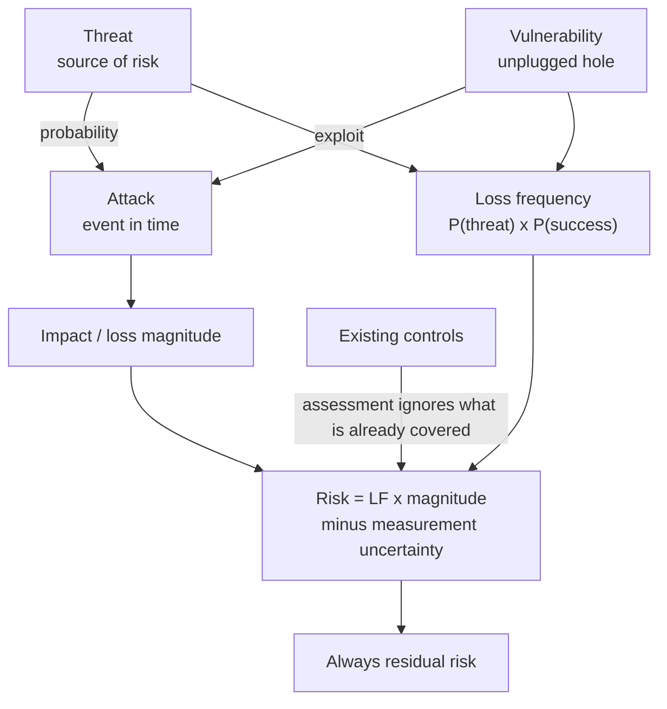
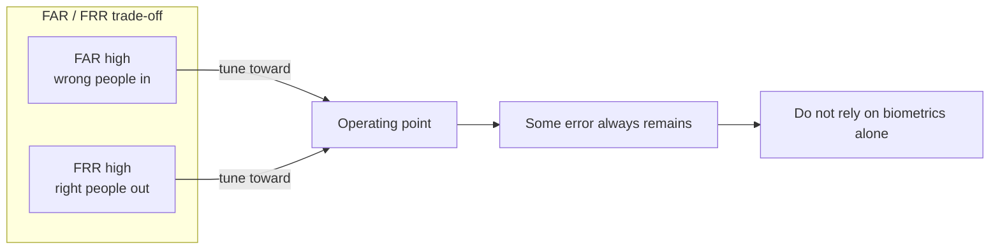
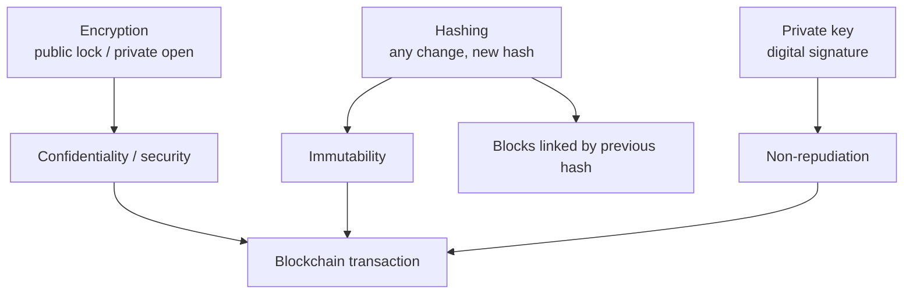

# Lecture T45: Cyber Security and Privacy — Capstone Discussion A

**Playlist index:** 45  
**Transcript:** [45-cyber-security-and-privacy-capstone-discussion-a.md](../../transcripts/markdown/45-cyber-security-and-privacy-capstone-discussion-a.md)  
**Video:** https://www.youtube.com/watch?v=HXt6GvYxSqQ  
**Week / theme:** Live interaction / Threat–attack–vulnerability–risk, biometrics, blockchain, ransomware reporting

## Learning objectives
- Stop treating **threat, attack, vulnerability, and risk** as synonyms; write **risk as residual risk**.
- Tune biometrics on the **FAR / FRR** trade-off; know why biometrics cannot be the only authenticator.
- Map blockchain **confidentiality, immutability, and non-repudiation** onto **encryption + hashing + private-key signature**.
- State the taught order for **ransomware**: **report** (DPDP / GDPR window), then restore operations (often **crypto** payment).

This is a **live Q&A**, not a new recorded chapter. Career advice, assignment logistics, copyrighted-case access, previous-year papers, and “which commercial tool to buy” are omitted. Teaching content is kept.

## What this lecture actually teaches

Students have almost finished **cyber security management and policy** (administrative / techno-managerial). This is **not a technical course**; technology is **one resource**. Stakeholders, **people, policies, processes, standards, frameworks** matter. Next module: **information privacy**. The live session drills **concepts** that were already in the slides.

### Threat, attack, vulnerability, risk — and residual risk
People use these words **interchangeably**. They do not mean the same.

| Term | Meaning in this session |
|------|-------------------------|
| **Threat** | A **source of risk**, not risk itself. Threats **lead to** a state of risk. |
| **Risk** | A **state**. **Composite**: something adverse that can happen, **with what probability**, and **if it happens, what impact**. Not identical to threat, attack, or vulnerability. **Combination of all of these**. |
| **Attack** | An **event at a point in time**. It happens because there is a threat with a **probability**. |
| **Vulnerability** | **Holes you have not plugged** despite threats and **preparation**. Hackers **exploit** vulnerability. **Exploit** is a technical word already taught. |
| **Residual risk** | What is **left over despite current preparation**. Rain ≠ flood if you are prepared; a still-worse event can exceed capability. |
| **Impact** | Also a **determinant of risk**. An **attempted** attack may have **no impact**. |

Weather analogy: **going to rain** does not mean **flood**. Heavy rain plus **preparedness** may mean water causes no major risk.

**Risk formula taught:**

**Risk = loss frequency × loss magnitude − measurement uncertainty**

An older textbook factor, **minus risk already covered by existing measures**, was **removed in the new edition**. It confused people. In **risk management** you already have **identification, assessment, control**. **Assessment evaluates only vulnerabilities that exist despite current controls**, so subtracting “already covered” risk is **not meaningful**.

**The number this formula produces is always residual risk.** The assessment process only captures risk that **currently exists after measures are in place**. Despite those measures there are still vulnerabilities — that is what you look at.

### Banana peel, TVA worksheet, and “risk vs vulnerability”
A student asks the difference between **risk and vulnerability**. Instructor: after the whole Mahabharata, asking how Draupadi relates to Sita — still a **genuine** confusion.

Diagram: a man walks on a **well-maintained road**, wearing shoes; someone dropped a **banana peel**. Road protected, **peel is the point of vulnerability**. Asset (computer, network, infrastructure) has a **physical wall**, **firewalls**, other tech, but **holes unfixed** — e.g. **Windows / OS not updated** because updates need **downtime**, while the vendor issued a **security update** for a **new threat**. **Hole in the wall = vulnerability.** Vulnerability paves the way for an **attack**; attack leads to **impact / losses**.

**TVA worksheet** (Threat–Vulnerability–Asset): risk is calculated **for every asset and every threat**. An asset has vulnerabilities 1, 2, 3, …; the rest is protected; there is also protection against **external threats**, but **holes remain**. That is the basis of **loss frequency**.

**Loss frequency** is a function of:
- **probability of threat**, and
- **probability of success of attack**.

Success of attack depends on **how protected you are**. If you are **not vulnerable at all**, success of attack is **very very low**.

So: **risk is a function of vulnerability, but not only of vulnerability**. Risk also depends on **impact**. **Risk = loss frequency × loss magnitude**. Loss magnitude comes from impact. Vulnerability is **a probability input**, not the whole measure. Also subtract **measurement error**. **Risk and vulnerability are related but not the same.**

### Biometrics: FAR vs FRR
Slide on **biometric devices for authentication** and their **limitations**. **False positives and false negatives**.

| Metric | Also called | Meaning |
|--------|-------------|---------|
| **FAR** | False **acceptance** rate; **false positive** | **Wrong person accepted** as the right person |
| **FRR** | False **rejection** ratio; **false negative** | **Right person rejected** |

When **false positive is very high, false negative is low**, and **vice versa**. There is an **optimal meeting point** where you typically **tune** the device. **Despite that**, every device has **some** FAR and **some** FRR. Sensitivity can **allow a wrong person** (false positive) or **reject you** (false negative). **Any calibrated device has error on both sides.** Therefore biometrics **cannot be the only foolproof authentication**. Know **at what range** the device is operating.

### Blockchain: three properties from two technologies
Not covered in the recorded lecture; added because blockchains matter for **crypto** and for **automating organisations with secure technologies**. Three keywords: **immutability**, **security**, **non-repudiation**.

**1. Confidentiality / security via encryption** (already taught: symmetric and asymmetric). Generate **two keys**. **Public key encrypts**; over the channel an interceptor gets ciphertext they **cannot read**. **Private key** (recipient) decrypts. **Only a valid recipient** has the private key. That is **confidentiality** — the security encryption provides for a transaction. Digital example: **credit card, username/password, CVV, date of birth** encrypted from sender to recipient. **Crypto transactions provide security thanks to encryption.**

**2. Immutability via hashing.** Hashing is a **mathematical function**. Content in → **hash output** (e.g. **256-bit**). Hash ≠ the content. Once transaction data is hashed, **even a small change** yields a **totally different hash**. If you transact **$100,000** and try to drop a zero, the hash changes → **manipulation detected**. The hash becomes a **permanent ID** for the transaction. Nobody can make an acceptable new hash for altered content. Transaction is **closed, permanent, locked** with a hash key. That is **immutability**.

**Linked-list structure:** each block **refers to the previous block through the hash key** the previous block generated. **Chained through keys.** Each block has **standard fields** for the transaction; the **block as a whole is hashed**; that hash is the block’s **permanent, immutable identifier**.

**3. Non-repudiation via private key / digital signature.** **Non-repudiation is a legal term.** Cheque example: account number, payee, name, **signature**. Bank **compares** with stored signature (often **manually** in traditional banking). Clever fraud: sign **slightly differently**, later claim **“I did not issue that cheque; somebody stole the chequebook.”** That refusal is **repudiation**. If people keep refusing transactions, **financial systems break**. Need **non-repudiation**.

In a blockchain transaction you need your **private key**; it is your **digital signature**. You **sign / encrypt the transaction with your private key**, so you **cannot refuse** that somebody else made it — the transaction **accompanies your private key**.

**Three characteristics — immutability, security, non-repudiation — are ensured through two technologies: encryption and hash.**

Chat Q&A: **collision-resistant** hash functions (vs “normal” hashes) — **collision resistance** protects **integrity** against hackers; underlying tech for blockchain security. Instructor will **not** pick a “most common” algorithm (**SHA-256** vs **512**, etc.); he is **not updated** as a crypto instructor; take a **separate NPTEL blockchain course**; hash functions have **mathematical foundations** not in this course.

**Non-repudiation restated** for a student: you appear as Niharika, leave, come back as someone else, deny you asked a question — **repudiation**. In **online banking / formal exchange**, if the giver **refuses “I gave,”** integrity of the transaction fails. **Non-repudiation:** once you transact, you should **not be able to repudiate even if you want to**. No fake transaction, no fake identity, no refusal. Essential in finance.

### Tools that detect threats (generic, not vendors)
Detection vs **detection + prevention** (costlier). Examples already in the course: **malware detection and prevention**; **IDS** vs **IDPS** (intrusion detection vs detection **and** prevention); **firewalls** as **gatekeepers** between inside and outside; **integrated threat management** platforms that combine tools. **No vendor names** — the course does not promote companies; the **external expert** lecture is the place for industry flavour.

### Ransomware: how you pay, and what you must do first
Hacker **encrypts the machine**; **key is with the hacker**. Like someone locking your house and standing with the key. Business is down; e-commerce down; **losing revenues**; the attack is **illegal**.

**Policy point (privacy/security incident):** a hacker attack / cyber incident **must be reported to a competent authority**. In India, **Digital Personal Data Protection (DPDP)** requires an attack to be reported in a **stipulated period**. In **GDPR** the instructor states **74 hours** — incident should be reported within that window.

**Order taught:** **report first** — proper report to **police / competent authority** — **then** you are in a safer position to **restore operations**. You are **paying a thief**; if someone “places a barrel on your head,” you may pay to **protect your life / business**. The instructor is **not a legal expert**; to the best of his knowledge, **paying a hacker to save the business after reporting** should not be the thing the law punishes; **create evidence, report, then protect yourself**. **Accounting treatment** is for experts. You often **have no choice of rail**: the hacker says **cryptocurrency only**, or you **do not get the key**.

### DPDP vs GDPR — teaser only
A student asks for a document comparing India’s draft data-protection policy with GDPR. Instructor: **discussion of both is coming**. India’s **DPDP** (Digital Personal Data Protection) **became an Act last year** (relative to this live session) **and GDPR**. **Student groups will discuss** in upcoming sessions. **Wait for the privacy module**; do not jump the gun on “privacy techniques in banking” either — that module starts **next week**.

## Cases and examples from the lecture
- Rain vs flood vs residual flood despite sandbags.
- **Banana peel** on an otherwise good road; **unpatched Windows** as hole in the wall.
- TVA worksheet per asset × threat.
- Biometric false accept / false reject; tune to the intersection, never zero error.
- Credit-card / CVV / password in transit; **$100,000** hash change if a zero is dropped.
- Cheque signature mismatch as **repudiation**.
- Chat replay: change name and deny you asked a question.
- House locked by ransomware; **crypto-only** ransom.
- GDPR **74-hour** report window (as spoken); DPDP stipulated reporting.

## Key terms
| Term | Meaning in this lecture |
|------|-------------------------|
| Threat | Source of risk |
| Attack | Point-in-time event |
| Vulnerability | Unplugged hole; what exploits target |
| Risk | State combining probability and impact; formula output is residual |
| Residual risk | Risk left after current measures |
| Loss frequency | f(P(threat), P(attack success)) |
| Loss magnitude | From impact |
| FAR / FRR | False accept (false +) / false reject (false −) |
| Immutability | Hash as permanent transaction ID |
| Non-repudiation | Cannot deny you signed; private key / digital signature |
| Collision resistance | Hash property against two inputs, one digest (integrity) |
| DPDP reporting | Indian duty to report an incident in a set time |

## Formulas / frameworks
**Risk = (loss frequency) × (loss magnitude) − (measurement uncertainty)**  
= **residual risk** in this course’s assessment process.

**Loss frequency** ← P(threat) and P(success of attack); success falls as vulnerability falls.

**Blockchain:** encryption → confidentiality; hashing → immutability + chain links; private key → non-repudiation.

**Incident order:** evidence + report to competent authority (GDPR window / DPDP) → then restore (pay if that is the only key).

## Distinctions the instructor insists on
- **Risk ≠ threat ≠ attack ≠ vulnerability.** Risk is the **composite state**.
- **Always residual:** assessment does not re-count risk already covered by controls; that is why the extra “minus existing measures” term was **dropped**.
- Vulnerability is an **input to loss frequency**, not the whole of risk; **impact** still required.
- FAR and FRR **move opposite**; the meeting point still has **error** → biometrics **not sufficient alone**.
- Blockchain **security** here means **confidentiality from encryption**, not a vague “blockchain is safe.”
- **Hash ≠ encryption.** Hash locks **integrity/immutability**; encryption locks **secrecy**; **private key** locks **who signed**.
- **Repudiation** is refusing the act; **non-repudiation** is a **system property**, not a moral hope.
- **Pay the ransomer only after reporting**; payment rail is often **crypto** because the thief chooses it.
- DPDP vs GDPR **comparison is later**; this session only **teases** reporting clocks and the Act’s name.

## Exam-oriented recap
- Threat sources risk; attack is an event; vulnerability is the hole; risk combines frequency, magnitude, uncertainty — **and is residual**.
- Banana peel / unpatched OS; TVA; P(success) depends on remaining holes.
- FAR up ⇔ FRR down; tune; never zero; not sole authentication.
- Blockchain: public-key confidentiality, hash immutability (and previous-hash links), private-key non-repudiation; collision resistance; skip algorithm trivia.
- Ransomware: **report under DPDP / GDPR (74h as taught)**, then pay if needed, often in cryptocurrency.
- Full DPDP–GDPR table comes in the privacy module / student discussions.
