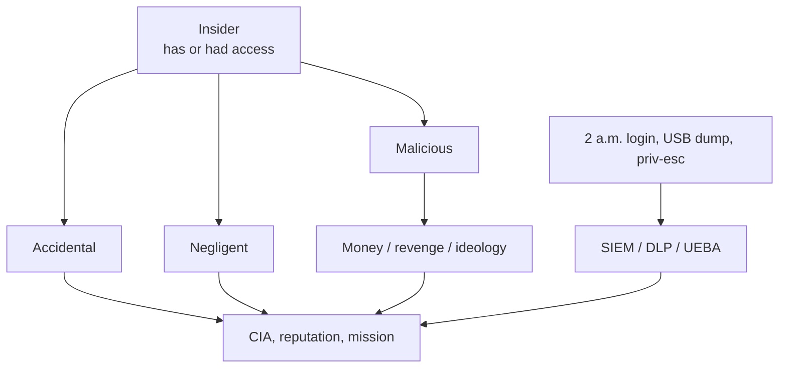

# Lecture T46: Cyber Security and Privacy — Capstone Discussion B

**Playlist index:** 46  
**Transcript:** [46-cyber-security-and-privacy-capstone-discussion-b.md](../../transcripts/markdown/46-cyber-security-and-privacy-capstone-discussion-b.md)  
**Video:** https://www.youtube.com/watch?v=nlsz8MggiAU  
**Week / theme:** Live interaction / Insider threats — definitions, cases, controls, theories

## Learning objectives
- Define **insider** and **insider threat** (CISA and SEI) including **former staff** and **unwitting** harm.
- Separate **malicious, accidental, and negligent** insiders; list **motives** (money, grievance, ideology).
- Recognise **technical indicators** (odd hours, failed logins, exfiltration) and **controls** (SIEM, DLP, UEBA).
- Apply **routine activity, neutralization, and deterrence** theories to **policy violation**.
- Outline **NITF** programme building blocks: senior official, working group, policy, continuous training, programme office.

Live session led by **Bala Gopal** (TA) with Prof. Saji closing. **Career advice, exam format, assignment scores, textbook shopping, and “solve my company’s incident-response” questions are omitted.** Teaching on insiders is kept. Application still “depends on context,” as the professor restates at the end.

## What this lecture actually teaches

People imagine cyber incidents as **external hackers**. Headlines in the slides use the word **insider**: Verizon insider breach affecting **more than 60,000 employees**; insider threats **increasing in the UAE**; Trustwave **2024** financial-services report — insider threat an **alarming trend**. Attacks come from **external and internal**.

### Who is an insider
An insider is a person who **has or had authorised access or knowledge** of an organisation’s resources: **information, networks, systems, equipment, facilities**.

Examples:
- Someone who **developed** the organisation’s products/services.
- Someone given **computers, laptops, or network access**.
- Someone who knows **fundamentals, strengths and weaknesses, strategies and goals**.
- In **government**: access to **protected information** whose compromise could damage **national security and public safety**.

### Two definitions of insider threat
**CISA** (US Cybersecurity and Infrastructure Security Agency, presented as the US national security agency in the slide voice): a threat that an insider will use **authorised access, wittingly or unwittingly**, to **harm** the mission, resources, personnel, facilities, information, equipment, networks, or systems.

**SEI, Carnegie Mellon:** the **potential** for an individual who **has or had** authorised access to **critical assets** to use that access **maliciously or unintentionally** in a way that could **negatively affect** the organisation.

Four key terms in the SEI framing: **individual**, **organisation’s asset**, **unintentionally or intentionally/maliciously**, **negatively affect**.

| Key | Scope taught |
|-----|----------------|
| Individual | Current or **former** employees; full-time, part-time, **temporary**; **contractors**; **trusted business partners** |
| Assets | **People**, information, technology, facilities |
| Intent | Fraud, espionage, social engineering — **or accident** |
| Harm | Employees, customers, **reputation**, **C/I/A**, ability to meet **mission** |

Example: a full-time employee **accidentally discloses** information → reputation and CIA damage **without malice**.

### Three types of insider
| Type | Intent | Typical behaviour |
|------|--------|-------------------|
| **Malicious** | Yes | Intentional **theft** or **destruction** of data |
| **Accidental** | No | **Careless** handling; **unknowing** policy violation |
| **Negligent** | No malice, but they **ignore** policy | Do not care about the rules |

All three can **create problems**.

**2019–2024:** organisations reporting insider threats/attacks rose from **66% to 76%**. **COVID-19** made **remote/hybrid** work normal: flexibility for staff, **security concern** for the firm; research ongoing on WFH insider risk.

### Two case studies
**Edward Snowden** — famous insider. **Contractor** for NSA; **legitimate access** to databases; gathered and leaked classified documents on **secret, controversial surveillance** in the US and abroad. Highlights vulnerability in systems that rely on **user permissions** without **adequate monitoring of user behaviour**. Need **robust insider-threat detection**.

**Tesla, 2023** — two **former** employees leaked almost **75,000** personal records of current and former staff. **Policy violation**; Tesla **filed lawsuits**. Trusted people **inside** can exploit access **or** be negligent. **Ex-employees** still matter: **remove access when someone leaves**; keep **least privilege** while they are in.

### Technical indicators (examples)
1. **Unusual access patterns** — deviation from the person’s or group’s **baseline**. Login at **2 a.m.** when hours are 9–5; login from an **unfamiliar location**. **Multiple failed logins then a success** — possibly a **compromised insider** (stolen credentials).
2. **Access-control violation** — reaching **restricted** systems; repeated failed logins; **privilege escalation** or **role change** without authorisation.
3. **Data exfiltration** — unauthorised transfer **out**. **Large** downloads/uploads **not typical of the role**; **USB / pen drive** to personal devices.

### Motives
**Financial gain** (top): sell confidential data on the **dark web** or to **competitors**; sales fraud; **manipulate financials** for bonuses; **inflate expense reports**.

**Dissatisfaction / revenge:** bad conditions, colleagues, supervisor, management policy; no expected **hike or promotion**; leak as revenge; **destroy data or projects** to show frustration.

**Ideology:** company seen as **unethical**; leak to **expose** practices “in the public interest”; leak to **activists** (social justice, “greater cause”).

**Verizon DBIR 2023** figure: top motives of insider actors **misusing privileges** (shown on slide; policy violation is the through-line).

### Why people violate security policy: three theories
Borrowed from **criminology and psychology**.

**1. Routine activity theory (1970s).** Crime at a time and place when three things **converge**:
- **Motivated offender**
- **Suitable target**
- **Absence of capable guardianship**

Used in the information-security policy domain the same way.

**2. Neutralization theory (1957, Sykes and Matza).** Techniques that **rationalise** breaking norms. Original five include **denial of responsibility, denial of injury, denial of victim** (others added later by scholars).

**3. Deterrence theory.** People break rules when **perceived benefit outweighs consequences**. They weigh **severity, celerity (swiftness), and certainty** of punishment. If benefit wins, they offend.

### Detection / prevention technologies
| Tool | Role taught |
|------|-------------|
| **SIEM** (Security Information and Event Management) | Aggregate and analyse security data **in real time**; **correlate** logs (firewall, servers); **anomalies** → **alerts** from rules and **machine learning** |
| **DLP** (data leak / loss prevention) | After pandemic laptops, stop **USB** and **sensitive email attachments**; monitor endpoints/networks; **block** and alert admins |
| **UBA / UEBA** (user [and entity] behaviour analytics) | **Baseline** each user; **deviation** → insider alert; ML **adapts** as behaviour changes |

These tools always have **false positives and false negatives**.

### Management controls: NITF programme
**National Insider Threat Task Force (NITF)** (US): every organisation / MNC should have an **insider threat programme**. Five guidelines taught:

1. **Designate a senior official** accountable for the programme; policies complied with and **promoted**.
2. **Insider threat working group** — **multidisciplinary governance** (HR, sales, other domains). Review **policies, procedures, standards**.
3. **Establish governance and publish the insider threat policy** — aligned to **business and culture**, grounded in **legal authorities**.
4. **Formal training and awareness** — **all personnel**, reporting procedures, **key indicators**. **Not one-time** (not only week-one induction). **Continuous**; **every level**.
5. **Insider threat programme office** — formal process to **review and revise** policies, procedures, standards.

### Conclusion the TA wants remembered
Insiders include **current and former** staff using **legitimate access** — revenge, money, or **accident**. Security teams must watch **internal** threats, not only external hackers. Combine **technical controls** with **behavioural** understanding of **why** people do not comply. Insider **behaviour** is a **significant source of data breach**.

Cited line: even **progressive companies that can afford the best cyber security protection can be taken down by one malicious insider**. If an insider has the **skills and access**, they can. Reduce insider risk by **security culture**, **awareness**, and **monitoring security behaviour**.

Professor’s only teaching add-on in the remaining Q&A (not exam logistics): the course is a **map** of concepts and frameworks. **Application depends on context** (organisation size, criticality, willingness to invest, people’s time). **NIST** resources include **incident-response templates** — use those to see **what information planning needs**, rather than jumping to a random tool. Tools are an **aid**, not the application. Working professionals should not expect the classroom to **solve a named company’s problem** without that context.

## Cases and examples from the lecture
- Verizon: insider breach, **>60,000** employees’ data.
- UAE / Trustwave 2024 financial services: insider trend up.
- Reporting rate **66% → 76%** (2019–2024).
- Snowden (NSA contractor, permissions without behaviour monitoring).
- Tesla 2023: two former employees, **~75,000** HR records, lawsuits.
- 2 a.m. login; USB to a personal stick; expense-report fraud; dark-web sale.
- WFH laptops after COVID as a DLP driver.
- NITF five-part programme vs one-shot induction training.

## Key terms
| Term | Meaning in this lecture |
|------|-------------------------|
| Insider | Has **or had** authorised access/knowledge of resources |
| Witting / unwitting | CISA: harm can be deliberate or not |
| Malicious / accidental / negligent | Steal-or-destroy / careless / ignores policy |
| Compromised insider | Their **credentials** were taken (failed then successful login) |
| Exfiltration | Unauthorised data leaving the organisation |
| Routine activity | Offender + target + **no guardian** |
| Neutralization | Talking yourself into the violation |
| Deterrence | Benefit vs certainty/severity/speed of punishment |
| SIEM / DLP / UEBA | Correlate logs / block leaks / score behaviour |
| NITF | US model for an insider-threat **programme**, not a gadget |

## Formulas / frameworks
**Insider-threat potential (SEI):** authorised (ex-)person × critical asset × (malicious **or** unintentional) act → negative organisational effect.

**Routine activity:** P(crime) rises when motivated offender, suitable target, and **lack of guardianship** coincide.

**Deterrence calculus:** offend if benefit > f(severity, celerity, certainty).

**NITF stack:** senior owner → multidisciplinary group → published policy → **continuous** training → programme office that **revises**.

## Distinctions the instructor/TA insist on
- **Internal** is as real as **external**; trusted people have **power**.
- **Former** employees and **contractors** are insiders until access is **dead**.
- **Unwitting** harm still counts (CISA/SEI).
- Accidental ≠ negligent: one **doesn’t notice**; the other **doesn’t care**.
- Indicators are **deviations from baseline**, not “login exists.”
- SIEM/DLP/UEBA **err both ways** (false +/−) — same lesson as biometric FAR/FRR in T45.
- **One induction video is not an insider programme.** Training must be **continuous and for every rank**.
- Best **external** defences still fall to **one skilled malicious insider** (quoted CEO line).
- **Tools ≠ application**; incident response needs **context + templates + funded people**.

## Exam-oriented recap
- Insider = authorised access **now or in the past**; threat = use of that access to harm, **on purpose or not**.
- Types: malicious, accidental, negligent. Motives: **money, grievance, ideology** (Verizon DBIR).
- Snowden (contractor, no behaviour monitoring); Tesla 2023 leavers and 75k HR rows — **joiners and leavers**.
- Watch 2 a.m. logins, priv-esc, USB dumps; detect with SIEM, DLP, UEBA.
- Theories: routine activity, neutralization (Sykes & Matza), deterrence.
- NITF: named official, cross-functional group, policy, **ongoing** awareness, office that updates rules.
- Culture + monitoring + tech together; one insider can still take the firm down.
