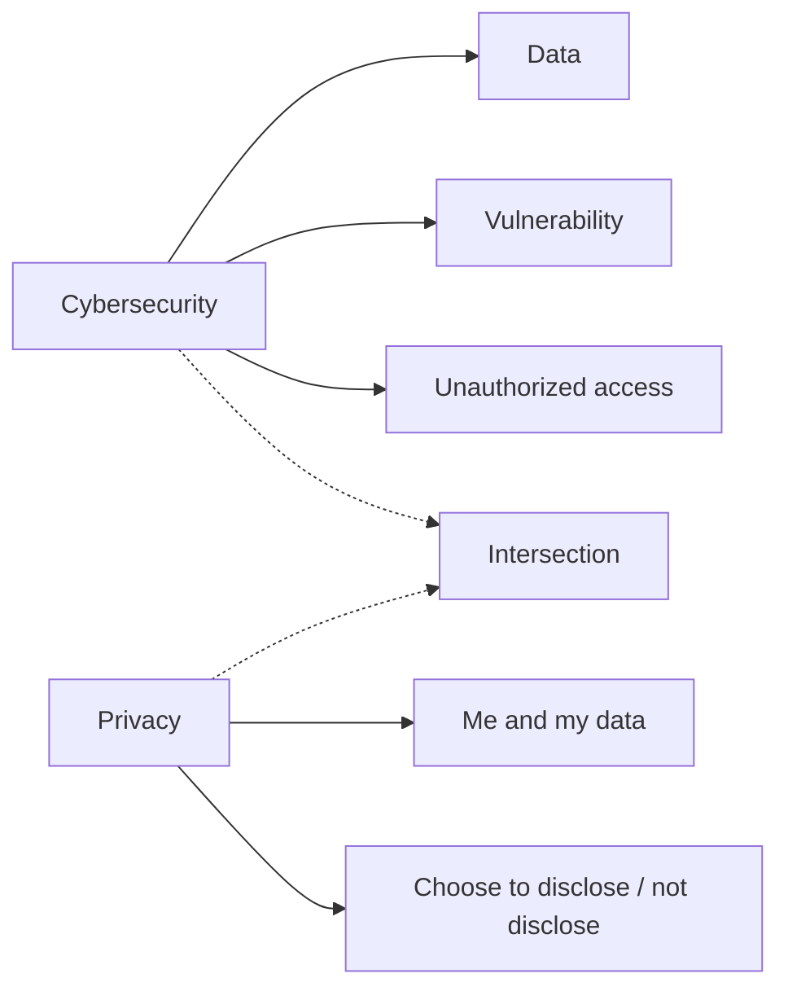
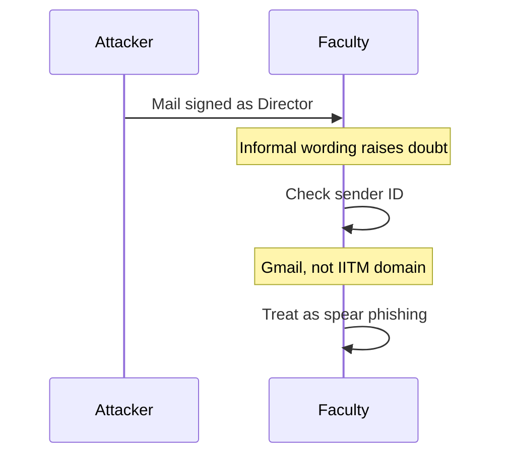
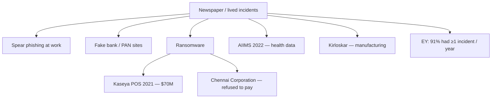

# Lecture T48: Introduction — Part 01

**Playlist index:** 48  
**Transcript:** [48-introduction-part-01.md](../../transcripts/markdown/48-introduction-part-01.md)  
**Video:** https://www.youtube.com/watch?v=rMXMwrPaF0I  
**Week / theme:** Introduction — ice-breaking, definitions, and why managers should care

## Learning objectives

- Give working meanings of **cybersecurity** and **privacy**, and say why their intersection matters.
- Explain why a manager, not only an IT person, should treat cybersecurity as a live concern.
- Distinguish **phishing**, **social engineering**, and **spear phishing** using the instructor's own mailbox examples.
- Contrast **ransomware** with **denial of service**, and say why healthcare data (AIIMS, HIPAA) is treated as especially sensitive.

## What this lecture actually teaches

### Why start with motivation

This is the classroom introduction: breaking the ice, previewing what the instructor will deliver and what students must do, and — most of all — **motivating the topic**. The driving questions: Is cybersecurity important? Should it bother **practicing managers**, irrespective of what they manage? Why spend the time on a six-credit course?

### Student keywords the instructor keeps

Asked what "cybersecurity" means, a student offers: vulnerability management of computers and network systems so that data is protected, plus unauthorized use of data without the owner's knowledge. The instructor extracts **three keywords**: **data**, **vulnerability**, **unauthorized access**.

Asked about **privacy**, a student says it is about **me and my data** — what I choose to disclose and what I choose not to disclose — while a **security layer** exists at some **system level**. The instructor accepts both, then adds that the **interface or intersection** of cybersecurity and privacy is itself an aspect of the course.

### The director's email: phishing that looks like work

To show that the topic is current, relevant, and managerial, the instructor walks through an email that appeared to come from the **Director of IIT Madras** (named as Professor Bhaskar Ramamurthi, later called the former director). It is a request to meet, signed with name and designation. Students debate the right response.

Teaching beats from the discussion:

- **Check the sender email ID** — even when you would not normally check a colleague or area-head mail.
- One student argues there is no need to be suspicious because the mail does not demand sensitive information, only a reply. The instructor **did** check; he had become suspicious.
- The mail is **internal-looking** (address, signature) but **informal**. The instructor does not expect the director to write "Can I have a quick moment with you?" That **choice of words** is not typical professional correspondence with a colleague.
- The mail came from **Gmail, not the IITM domain**. That made it obviously suspicious.

He labels this a **phishing** mail, then immediately tightens the label. Ordinary phishing (junk asking for bank details, or "someone from Africa" offering funds) is recognized at once. This one takes time to resolve because it pretends to be a **colleague / the director**, uses the real name and designation, and shows that the sender **knows who is who** in the organization. Collecting that background is **social engineering**.

This is **social-engineering-based phishing**. The chance of a response is much higher. The more specific name he gives is **spear phishing** (the transcript writes "spear fishing"): very specific, based on social engineering, where the people behind it have done a **background study**.

Professor Ramamurthi later sent a follow-up to colleagues because he knew the phishing mail was circulating. A couple of weeks before this class, the **head of department** wrote a similar mail ("can you do something for me?") with proper title, name, and full signature — the kind of mail you tend to reply to immediately.

### The SBI PAN-card SMS: look at the website address

A second personal sample: a text message asking him to **verify his PAN card**, with a link to an "SBI" site. Because it appears to be a bank request, people tend to respond. The login page **looks exactly the same** — logo, fields, font, format, CAPTCHA. The taught check: when a message asks you to sign in, look at **whether the website address is real or fake**. This was **not** the real online-SBI address. Even on regular bank logins he checks the address, because a wrong address may pop in and **username and password may go elsewhere**.

These samples are meant as **individual** experience; the director phishing mail also hit the **group / organization**.

### Newspaper climate: ransomware, POS, hospitals

Clips from leading Indian newspapers report an increasing number of cyber attacks. The last piece is about **ransomware**.

**Ransomware versus denial of service.** DoS is different; a DoS case will come later. Ransomware: the attacker takes control of your machine, **encrypts** it, and asks for money to release it. House analogy: you lock your house, come back, and find **another lock** on it; you cannot enter. The hacker is "quite fair" in a grim sense: give money, get the key. **Ransom** is paying to release someone (or here, the machine). In threat intelligence today, ransomware is one of the **most frequent** attacks, and a global concern.

**Kaseya (2021), Western retail POS.** Point-of-sale machines in retail stores handle checkout and payment. If POS stops on a busy day, operations stop; automated companies often have **no manual fallback**, so shops effectively close. In 2021, retail stores using POS software built by **Kaseya** (an IT company providing POS solutions) stopped because of ransomware. The hacker wanted **70 million dollars** to restore the machines. The instructor's reading: the attacker is often a "good thief" — pay, and the machine is released; if you do not pay, becoming operational is very difficult. **Companies generally pay** and restart, because **per-hour loss** can exceed the ransom.

**Exception: Chennai Corporation.** Species/systems were hit by ransomware. The Corporation **refused to pay**. Machines were **very outdated** (running **Windows 8**); outdated OS machines are easy to take over. They said, in effect, let it be locked forever. For **critical business operations**, that choice is usually not available.

**AIIMS, November–December 2022.** Five servers hacked; criminals took control. A hospital data center is a different type of data: **healthcare data**. Unauthorized access to personal health data has huge implications. In the US there is **HIPAA**, a regulation for healthcare data alone. Why the world is so concerned: healthcare data is **super sensitive**. Leakage can mean **huge embarrassment**, losses in an organization, or higher consequences. Attack on the country's top hospital became a **national concern**.

The same newspapers also cover **Kirloskar** (manufacturing). The point: attacks happen in **all spheres / domains**, almost every day you open a paper. Digital India has a **very bright side** (enabling growth) and a **dark side** that develops alongside — that is the concern of cybersecurity. The world has good people and bad people; bad people understand **vulnerabilities** and exploit them, with high impact.

**EY report (as summarized in a newspaper):** **91% of organizations** reported at least one cyber incident in a year. Cybersecurity is becoming a **top priority for CEOs / leaders**. The lecture then turns toward **changes in transportation** — that thread is picked up in Introduction Part 02.

## Cases and examples from the lecture

- **IIT Madras director spear-phishing email** (Gmail, informal "quick moment," social engineering; later institute-wide warning).
- **HOD follow-up phishing** with full signature, recent to the class.
- **SBI PAN-card SMS** leading to a lookalike login page with the wrong URL.
- **Kaseya 2021** ransomware against retail POS; **$70 million** demand; shops cannot fall back to manual checkout.
- **Chennai Corporation** ransomware on outdated **Windows 8** machines; **refused to pay**.
- **AIIMS (Nov–Dec 2022)**: five servers; healthcare data; **HIPAA** as the US analogue; embarrassment and organizational harm.
- **Kirloskar** as a manufacturing-domain headline.
- **EY**: 91% of organizations, at least one incident a year; CEO-level priority.

## Key terms

| Term | Meaning in this lecture |
|------|-------------------------|
| Data / vulnerability / unauthorized access | The three student keywords the instructor keeps for "cybersecurity" |
| Privacy (working sense) | Me and my data; I choose what to disclose; distinct from a system-level security layer |
| Phishing | Fraudulent mail/message; everyday junk asking for bank or personal details |
| Social engineering | Collecting background on who is who so a fake mail is believable |
| Spear phishing | Specific, social-engineering-based phishing with a background study; higher response chance |
| Ransomware | Attacker encrypts / takes control of a machine and demands money for the key |
| Denial of service | Named only as **different** from ransomware; a DoS case is promised later |
| POS | Point of sale — checkout/payment machines in retail; if they stop, automated shops stop |
| HIPAA | US healthcare-data regulation, cited to explain why health records are treated as super sensitive |

## Formulas / frameworks (if any)

- **Check-the-sender / check-the-URL hygiene:** suspicious professional mail → inspect sender domain; sign-in SMS → inspect the real website address, not the lookalike page.
- **Bright side / dark side of digital:** more digitization, more reported attacks; cybersecurity is the dark-side concern.
- **Pay-versus-refuse ransomware:** per-hour business loss often dwarfs ransom (Kaseya pattern); refusal is illustrated only where systems were already obsolete (Chennai Corporation).

## Distinctions the instructor insists on

- Cybersecurity and privacy are **two terms in the title**; their **intersection** is part of the course, not a merge of the two words.
- A mail that does **not** ask for passwords can still be spear phishing; **tone and domain** can be the giveaway.
- Everyday phishing is obvious; **spear phishing** is dangerous because it impersonates someone inside your circle after reconnaissance.
- **DoS ≠ ransomware.** Ransomware is control + encryption + payment to release.
- Healthcare data is not "just another database": embarrassment, organizational harm, and dedicated law (HIPAA) explain why AIIMS was a national story.
- Paying ransom is common for **critical operations**; Chennai Corporation is taught as an **exception**, not the default.

## Exam-oriented recap

- Managers should care because attacks already arrive as official-looking mail, fake bank pages, POS shutdowns, and hospital-server takeovers.
- Keep: data, vulnerability, unauthorized access; privacy as control over disclosure; intersection of the two.
- Spear phishing = phishing + social engineering + target-specific background.
- Ransomware lock-and-key analogy; Kaseya $70M; Chennai refusal on Windows 8.
- AIIMS + HIPAA: health data is super sensitive.
- EY 91% / CEO priority: this is not a niche IT problem.
