# Cyber Security and Privacy — Volume 01 — Introduction and Foundations

**Course:** NPTEL 106106248 · **Instructor:** Prof. Saji K. Mathew, IIT Madras  
**Series:** notes-2 (transcript-grounded)  
**Scope:** Course welcome, introduction parts 1–3, CIA and Target case

These notes follow the lecture videos and public captions. They are study material, not official NPTEL transcripts.

---

# Lecture T01: Course Welcome

**Playlist index:** 01  
**Transcript:** [01-introduction-course-welcome.md](../transcripts/markdown/01-introduction-course-welcome.md)  
**Video:** https://www.youtube.com/watch?v=OYsY5B9pqYU  
**Week / theme:** Introduction — why this course exists (managerial welcome)

## Learning objectives

- State why the course treats the cyber world as having a bright side and a dark side.
- Explain why cybersecurity is a management and governance issue, not a technology issue alone.
- Name the two kinds of cybersecurity planning this course will teach: contingency planning and risk-management planning.
- Trace the path from cybersecurity into information privacy, including why data, regulation, and stakeholders matter.

## What this lecture actually teaches

### The dark side of a useful digital world

The course is about **the dark side of the cyber world**. Digital technologies have emerged extensively; people use them as individuals, in groups, in organizations, and in government. Technology eases life and raises efficiency and effectiveness of work. At the same time, as adoption grows, so do the challenges from what the instructor calls the dark world.

Hackers update themselves on new technologies. They try to disrupt, attack, and cause damage for various reasons. Unless you secure technology and digital assets, an entire business or organization may collapse if it is highly dependent on digital technologies. Recent incidents show the potential of cyber attacks to disrupt and destroy the digital world.

The lecture flags **drones** as a current example: they destroy not only physical assets but even human beings. Other kinds of cyber attacks and threats are also increasing. That is the motivational frame for the whole course.

### Two purposes of the course

The purpose is manifold:

1. **Awareness** of the dark side of the digital world, especially for **practicing managers** and **cybersecurity professionals**. They need to understand the cybersecurity challenges.
2. **Not technology alone.** The course treats cybersecurity and privacy as a **management issue** and a **governance issue**.

From a managerial perspective, three words are critical: **governance, risk, and compliance (GRC)**. The course takes an administrative or managerial perspective. It also looks at technology that can be challenged or destroyed, and at technology as a source for **protecting** technologies. That is the **twofold role of technology** promised in this welcome (later lectures expand it to a triple role).

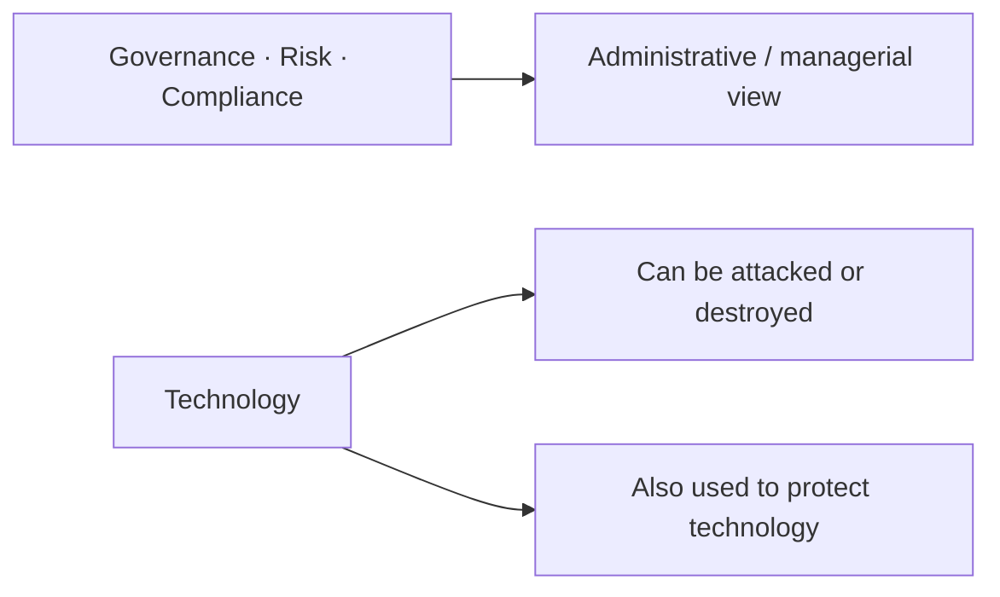

### Cybersecurity as management of cyber assets

A third strand is **pure management of cyber assets** and the work of securing them. That takes the course back to a fundamental lesson of management: **planning**. Cybersecurity planning is taught from two perspectives.

**Contingency planning.** The basic assumption is that things can go wrong. Incidents can happen. A cyber attack can happen. Someone can take control of a machine and ask for money — **ransomware**, which the instructor says is growing. When an attack happens, how can an organization restore technology to a normal condition, and how fast can it recover? That bundle includes contingency planning and **impact analysis**.

**Risk-management planning.** Here cyber assets are treated as assets to be protected. You evaluate the value of each asset, the potential threats, and the probabilities, and you arrive at a quantitative or qualitative estimate of **residual risk**. Then you plan management action for each asset. This is **not** an assumption that something has already happened. It is not reactive; it is **preventive**.

The course deals with **both** aspects of cybersecurity planning, and it covers **standards** that are useful in implementing such plans.

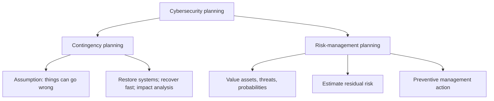

### Protection technologies, then privacy

Subsequently the course deals with **cybersecurity technologies**, especially from a **protection** point of view: what technologies exist to protect cyber assets. In that context it will discuss **cryptography** and recent developments, and it will bring in an **industry expert** to share current technologies in use.

Alongside that track, the course moves from cybersecurity to **information privacy**. Often what is at risk is **data**: that is what hackers often steal. Individual data has value. The course builds privacy from fundamentals: what is privacy, what is information privacy, and what current developments worldwide are related to it.

### Regulation, rights, and who should take the course

As individuals, organizations, and governments use more IT, **regulations** are being enacted in different parts of the world. In India, the lecture points to an expected **Digital Personal Data Protection Act (DPDP)**, which the instructor describes as waiting to become law. The Indian government is conscious of individuals' information privacy. The **Supreme Court of India** has upheld privacy as a **fundamental right**.

As technology becomes pervasive, vulnerability of individuals grows, and it becomes a **government responsibility** to protect it. How do you protect privacy? **Using technology.** So a role of cybersecurity is also to protect information privacy. The course then asks who is responsible, who the **stakeholders** are, and what regulation does in different parts of the world — from Europe's **GDPR** to India's **DPDP**.

It also looks at cybersecurity and technology from **managerial, economic, and strategy** perspectives.

**Who should take the course?** Those who **use** technology, those who are **responsible** for technology, and those who **over-use** technology today.

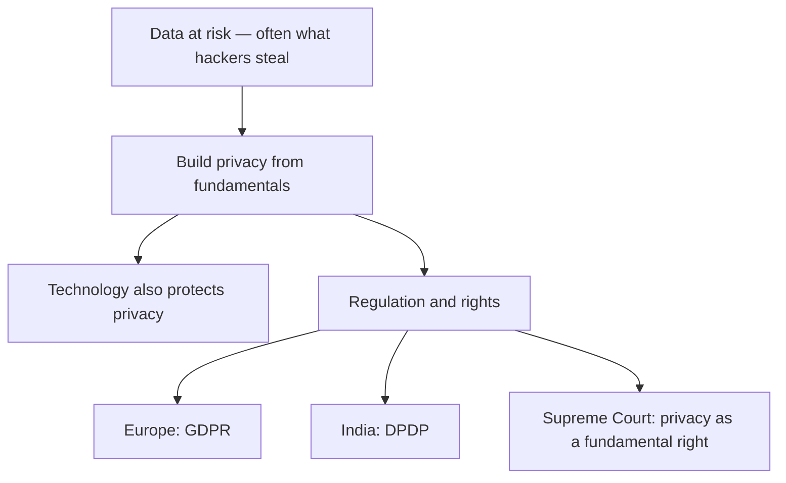

## Cases and examples from the lecture

- **Drones** used to destroy physical assets and even human beings — cited as a current form of cyber-related threat, not as a full incident write-up.
- **Ransomware** as the running example of an attack that takes control of a machine and demands money; this is the hook for contingency planning (restore and recover).
- **India's DPDP** (then pending) and **Europe's GDPR** as the regulatory pair the privacy half of the course will use.
- **Supreme Court of India** holding privacy to be a fundamental right.

No named corporate breach (Target, AIIMS, Aramco) is taught in this welcome video; those appear in later introduction and foundations lectures.

## Key terms

| Term | Meaning in this lecture |
|------|-------------------------|
| Dark side / dark world | The growing set of attacks, disruptions, and damages that travel with digital adoption |
| Digital assets | The technology and data on which a business or organization may wholly depend |
| GRC | Governance, risk, and compliance — the managerial frame for cybersecurity |
| Twofold role of technology | Technology can be attacked or destroyed; technology is also a source of protection |
| Contingency planning | Planning that assumes incidents (including ransomware) can happen, then restore and recover |
| Residual risk | The quantitative or qualitative leftover risk after valuing assets, threats, and probabilities |
| Risk-management planning | Preventive planning of management action per asset; not an assumption that harm has already occurred |
| DPDP | Digital Personal Data Protection Act — India's then-pending privacy law |
| GDPR | European data-protection regulation, named as a global counterpart to DPDP |

## Formulas / frameworks (if any)

- **GRC triad (managerial):** governance + risk + compliance.
- **Two-track planning:** contingency (reactive recovery after incidents) versus risk management (preventive residual-risk action).
- **Course arc:** awareness → GRC/planning/standards → protection technologies (including cryptography and a guest practitioner) → information privacy (fundamentals, stakeholders, GDPR/DPDP, managerial–economic–strategy view).

## Distinctions the instructor insists on

- Technology's usefulness (ease, efficiency, effectiveness) is not the whole story; **adoption and dark-world challenges grow together**.
- This is **not** a technology-only course. Cybersecurity is also administration: GRC.
- Contingency planning **assumes something can already have gone wrong**; risk-management planning **does not** assume an incident has happened — it is preventive.
- Privacy is not a side topic bolted on at the end: **data is often what is at risk**, and cybersecurity technology is also a tool for protecting information privacy.

## Exam-oriented recap

- Course thesis: digital technology eases work **and** creates a dark side that can collapse a digitally dependent organization.
- Audience: practicing managers and cybersecurity professionals; anyone who uses or is responsible for technology.
- Managerial core: GRC; planning of two kinds (contingency / residual-risk); standards.
- Technology: both target and protection; later, cryptography plus an industry guest.
- Privacy track: data value → fundamentals of privacy → DPDP, GDPR, Supreme Court right to privacy → stakeholders and strategy.

---

# Lecture T48: Introduction — Part 01

**Playlist index:** 48  
**Transcript:** [48-introduction-part-01.md](../transcripts/markdown/48-introduction-part-01.md)  
**Video:** https://www.youtube.com/watch?v=rMXMwrPaF0I  
**Week / theme:** Introduction — ice-breaking, definitions, and why managers should care

## Learning objectives

- Give working meanings of **cybersecurity** and **privacy**, and say why their intersection matters.
- Explain why a manager, not only an IT person, should treat cybersecurity as a live concern.
- Distinguish **phishing**, **social engineering**, and **spear phishing** using the instructor's own mailbox examples.
- Contrast **ransomware** with **denial of service**, and say why healthcare data (AIIMS, HIPAA) is treated as especially sensitive.

## What this lecture actually teaches

### Why start with motivation

This is the classroom introduction: breaking the ice, previewing what the instructor will deliver and what students must do, and — most of all — **motivating the topic**. The driving questions: Is cybersecurity important? Should it bother **practicing managers**, irrespective of what they manage? Why spend the time on a six-credit course?

### Student keywords the instructor keeps

Asked what "cybersecurity" means, a student offers: vulnerability management of computers and network systems so that data is protected, plus unauthorized use of data without the owner's knowledge. The instructor extracts **three keywords**: **data**, **vulnerability**, **unauthorized access**.

Asked about **privacy**, a student says it is about **me and my data** — what I choose to disclose and what I choose not to disclose — while a **security layer** exists at some **system level**. The instructor accepts both, then adds that the **interface or intersection** of cybersecurity and privacy is itself an aspect of the course.

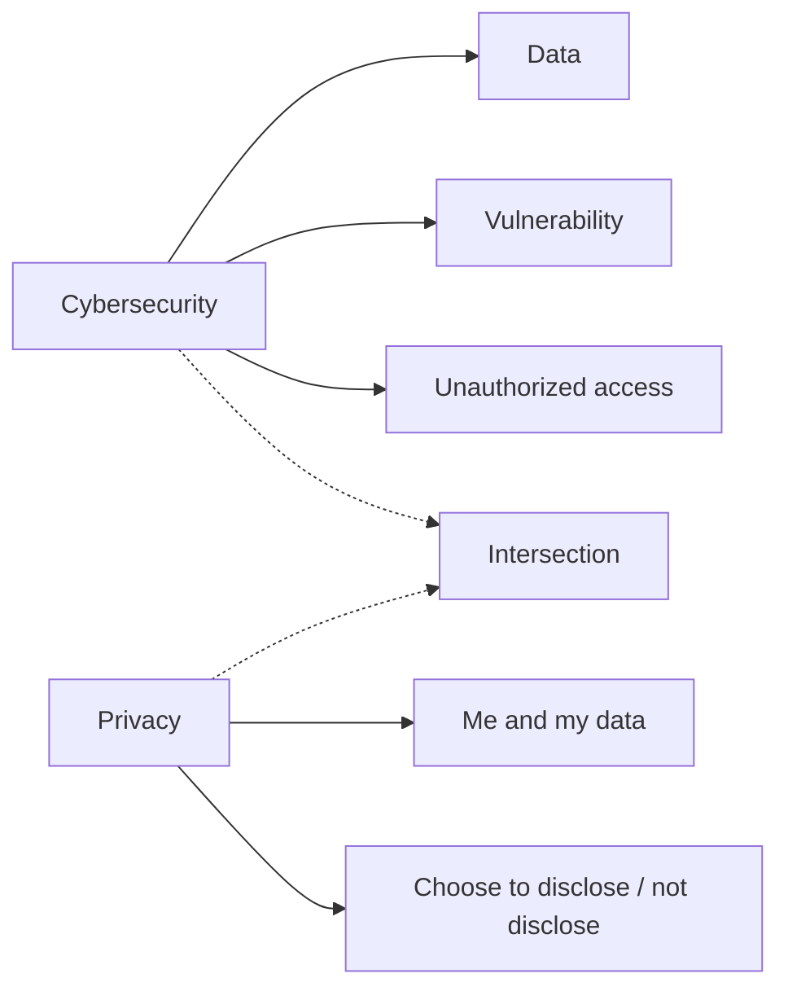

### The director's email: phishing that looks like work

To show that the topic is current, relevant, and managerial, the instructor walks through an email that appeared to come from the **Director of IIT Madras** (named as Professor Bhaskar Ramamurthi, later called the former director). It is a request to meet, signed with name and designation. Students debate the right response.

Teaching beats from the discussion:

- **Check the sender email ID** — even when you would not normally check a colleague or area-head mail.
- One student argues there is no need to be suspicious because the mail does not demand sensitive information, only a reply. The instructor **did** check; he had become suspicious.
- The mail is **internal-looking** (address, signature) but **informal**. The instructor does not expect the director to write "Can I have a quick moment with you?" That **choice of words** is not typical professional correspondence with a colleague.
- The mail came from **Gmail, not the IITM domain**. That made it obviously suspicious.

He labels this a **phishing** mail, then immediately tightens the label. Ordinary phishing (junk asking for bank details, or "someone from Africa" offering funds) is recognized at once. This one takes time to resolve because it pretends to be a **colleague / the director**, uses the real name and designation, and shows that the sender **knows who is who** in the organization. Collecting that background is **social engineering**.

This is **social-engineering-based phishing**. The chance of a response is much higher. The more specific name he gives is **spear phishing** (the transcript writes "spear fishing"): very specific, based on social engineering, where the people behind it have done a **background study**.

Professor Ramamurthi later sent a follow-up to colleagues because he knew the phishing mail was circulating. A couple of weeks before this class, the **head of department** wrote a similar mail ("can you do something for me?") with proper title, name, and full signature — the kind of mail you tend to reply to immediately.

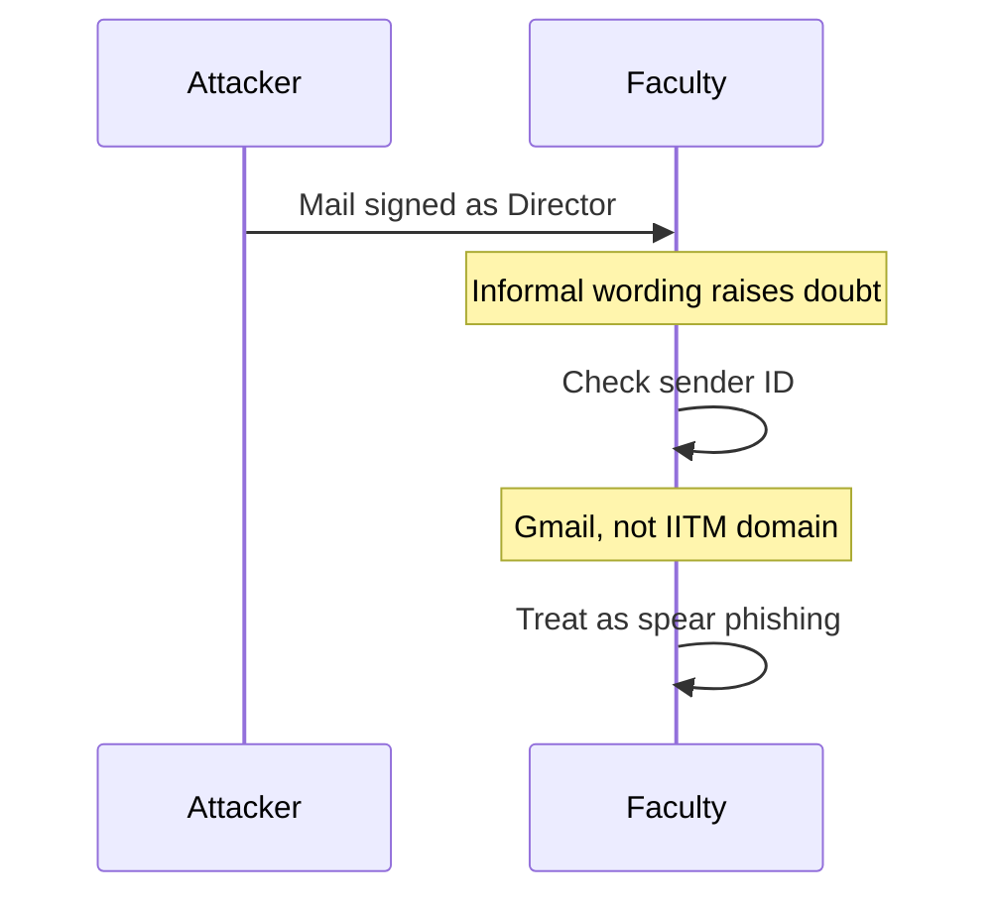

### The SBI PAN-card SMS: look at the website address

A second personal sample: a text message asking him to **verify his PAN card**, with a link to an "SBI" site. Because it appears to be a bank request, people tend to respond. The login page **looks exactly the same** — logo, fields, font, format, CAPTCHA. The taught check: when a message asks you to sign in, look at **whether the website address is real or fake**. This was **not** the real online-SBI address. Even on regular bank logins he checks the address, because a wrong address may pop in and **username and password may go elsewhere**.

These samples are meant as **individual** experience; the director phishing mail also hit the **group / organization**.

### Newspaper climate: ransomware, POS, hospitals

Clips from leading Indian newspapers report an increasing number of cyber attacks. The last piece is about **ransomware**.

**Ransomware versus denial of service.** DoS is different; a DoS case will come later. Ransomware: the attacker takes control of your machine, **encrypts** it, and asks for money to release it. House analogy: you lock your house, come back, and find **another lock** on it; you cannot enter. The hacker is "quite fair" in a grim sense: give money, get the key. **Ransom** is paying to release someone (or here, the machine). In threat intelligence today, ransomware is one of the **most frequent** attacks, and a global concern.

**Kaseya (2021), Western retail POS.** Point-of-sale machines in retail stores handle checkout and payment. If POS stops on a busy day, operations stop; automated companies often have **no manual fallback**, so shops effectively close. In 2021, retail stores using POS software built by **Kaseya** (an IT company providing POS solutions) stopped because of ransomware. The hacker wanted **70 million dollars** to restore the machines. The instructor's reading: the attacker is often a "good thief" — pay, and the machine is released; if you do not pay, becoming operational is very difficult. **Companies generally pay** and restart, because **per-hour loss** can exceed the ransom.

**Exception: Chennai Corporation.** Species/systems were hit by ransomware. The Corporation **refused to pay**. Machines were **very outdated** (running **Windows 8**); outdated OS machines are easy to take over. They said, in effect, let it be locked forever. For **critical business operations**, that choice is usually not available.

**AIIMS, November–December 2022.** Five servers hacked; criminals took control. A hospital data center is a different type of data: **healthcare data**. Unauthorized access to personal health data has huge implications. In the US there is **HIPAA**, a regulation for healthcare data alone. Why the world is so concerned: healthcare data is **super sensitive**. Leakage can mean **huge embarrassment**, losses in an organization, or higher consequences. Attack on the country's top hospital became a **national concern**.

The same newspapers also cover **Kirloskar** (manufacturing). The point: attacks happen in **all spheres / domains**, almost every day you open a paper. Digital India has a **very bright side** (enabling growth) and a **dark side** that develops alongside — that is the concern of cybersecurity. The world has good people and bad people; bad people understand **vulnerabilities** and exploit them, with high impact.

**EY report (as summarized in a newspaper):** **91% of organizations** reported at least one cyber incident in a year. Cybersecurity is becoming a **top priority for CEOs / leaders**. The lecture then turns toward **changes in transportation** — that thread is picked up in Introduction Part 02.

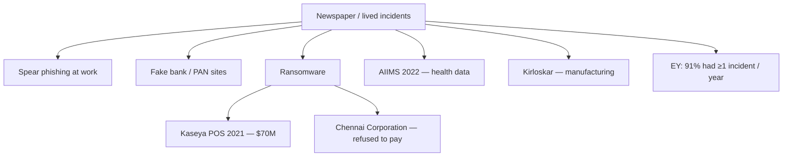

## Cases and examples from the lecture

- **IIT Madras director spear-phishing email** (Gmail, informal "quick moment," social engineering; later institute-wide warning).
- **HOD follow-up phishing** with full signature, recent to the class.
- **SBI PAN-card SMS** leading to a lookalike login page with the wrong URL.
- **Kaseya 2021** ransomware against retail POS; **$70 million** demand; shops cannot fall back to manual checkout.
- **Chennai Corporation** ransomware on outdated **Windows 8** machines; **refused to pay**.
- **AIIMS (Nov–Dec 2022)**: five servers; healthcare data; **HIPAA** as the US analogue; embarrassment and organizational harm.
- **Kirloskar** as a manufacturing-domain headline.
- **EY**: 91% of organizations, at least one incident a year; CEO-level priority.

## Key terms

| Term | Meaning in this lecture |
|------|-------------------------|
| Data / vulnerability / unauthorized access | The three student keywords the instructor keeps for "cybersecurity" |
| Privacy (working sense) | Me and my data; I choose what to disclose; distinct from a system-level security layer |
| Phishing | Fraudulent mail/message; everyday junk asking for bank or personal details |
| Social engineering | Collecting background on who is who so a fake mail is believable |
| Spear phishing | Specific, social-engineering-based phishing with a background study; higher response chance |
| Ransomware | Attacker encrypts / takes control of a machine and demands money for the key |
| Denial of service | Named only as **different** from ransomware; a DoS case is promised later |
| POS | Point of sale — checkout/payment machines in retail; if they stop, automated shops stop |
| HIPAA | US healthcare-data regulation, cited to explain why health records are treated as super sensitive |

## Formulas / frameworks (if any)

- **Check-the-sender / check-the-URL hygiene:** suspicious professional mail → inspect sender domain; sign-in SMS → inspect the real website address, not the lookalike page.
- **Bright side / dark side of digital:** more digitization, more reported attacks; cybersecurity is the dark-side concern.
- **Pay-versus-refuse ransomware:** per-hour business loss often dwarfs ransom (Kaseya pattern); refusal is illustrated only where systems were already obsolete (Chennai Corporation).

## Distinctions the instructor insists on

- Cybersecurity and privacy are **two terms in the title**; their **intersection** is part of the course, not a merge of the two words.
- A mail that does **not** ask for passwords can still be spear phishing; **tone and domain** can be the giveaway.
- Everyday phishing is obvious; **spear phishing** is dangerous because it impersonates someone inside your circle after reconnaissance.
- **DoS ≠ ransomware.** Ransomware is control + encryption + payment to release.
- Healthcare data is not "just another database": embarrassment, organizational harm, and dedicated law (HIPAA) explain why AIIMS was a national story.
- Paying ransom is common for **critical operations**; Chennai Corporation is taught as an **exception**, not the default.

## Exam-oriented recap

- Managers should care because attacks already arrive as official-looking mail, fake bank pages, POS shutdowns, and hospital-server takeovers.
- Keep: data, vulnerability, unauthorized access; privacy as control over disclosure; intersection of the two.
- Spear phishing = phishing + social engineering + target-specific background.
- Ransomware lock-and-key analogy; Kaseya $70M; Chennai refusal on Windows 8.
- AIIMS + HIPAA: health data is super sensitive.
- EY 91% / CEO priority: this is not a niche IT problem.

---

# Lecture T03: Introduction — Part 02

**Playlist index:** 03  
**Transcript:** [03-introduction-part-02.md](../transcripts/markdown/03-introduction-part-02.md)  
**Video:** https://www.youtube.com/watch?v=nadHKp3egDY  
**Week / theme:** Introduction — digital dependency, drones/IoT, stakeholder units, technology's triple role

## Learning objectives

- Explain how internet-connected cars, IoT sensors, and drones move cyber risk from "lost data" to **halted systems and harm to people**.
- State the instructor's basic principle: **any device connected to the internet is not safe**.
- List the **units** cybersecurity affects: individuals, organizations, society, and government — including government's dual role.
- Articulate technology's **triple role**: source of threat, asset to protect, and defense weapon.

## What this lecture actually teaches

This session continues the motivation that ended Part 01 on **transportation**.

### Internet-connected cars: updates and takeover

Suppose you are riding a **digital car** at high speed, with speed itself computer-controlled. Cars are now internet-connected; they get updates through the internet. **Tesla** is the example: you wake up, enter the car, and it may already be newer than yesterday. That is the exciting digital world.

The dark scenario: a hacker takes control of **your** car at high speed — and not just one car, **the whole traffic**. These are potential future scenarios in transportation. That is why the **International Centre for Automotive Technology (ICAT)**, which tests cars before they are released, has made **cybersecurity testing much more stringent**. Every car is tested for cybersecurity because damage can be not just to the car but to **human life**.

The digital world can **enable** human life and also **destroy** it. It is no longer only a computer attack where you lose some data; it can bring systems to a halt and **damage people**.

### Saudi oil refinery, 16 September 2019 — drones

On **16 September 2019** the instructor recalls faculty stopping on an evening walk to talk about an attack on a **Saudi oil refinery** (he names it **Ramco**). It happened at **4 a.m.** The company was **going public**. The refinery shut down — not for lack of raw materials, not because workers failed to report, not because of power failure, not for any commonly understood cause of shutdown, but because of a **cyber attack**. The tool: **drones**. The seriousness is the point.

IIT Madras, he jokes, can still teach if power and digital support fail. **By and large**, industry and government are **overly dependent on computers** for day-to-day operations, especially with **ERP systems**. Long ago **Citibank** said it was a **branchless bank**: it runs on computers, networked computers, and ERP. If software or the computer network stops, **the bank stops**, even if people are present. Criticality of information systems — and of **internet connectivity** — is very high. That is what the Saudi refinery illustrates.

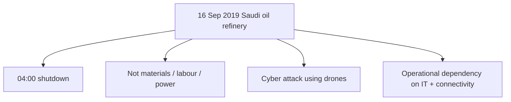

### IoT and the unsafe-if-connected principle

A further development: **smart connected devices**. **IoT (Internet of Things)** is the example. These are devices other than ordinary PCs/laptops: computers with processing units that **connect to the internet and transmit data**.

Example: a **temperature sensor** in a refinery — maybe no display, cabled or wireless — sensing and transmitting temperature. Experts' **basic principle** in this lecture: **any device, any system that is internet-connected is not safe**. If an IoT sensor of a process-control parameter is hacked, imagine temperature actually **500°C** reported as **5°C**: the wrong signal can **totally damage the system**.

**Manufacturing 4.0** is the bright side: high-end / smart connected devices, hyped in literature and trade magazines. The instructor's own past: **ten years in process control** with mostly **analog** technologies. A sensor was **wired** to a controller; a standard signal ran between them; there was **no way** for someone to access and manipulate it remotely in the same way. The same sensor, once **digital and internet-connected**, raises the potential for unauthorized access. When the world relies on internet-connected digital technologies, incidents like the refinery become **eye-openers** about a vulnerable world.

### Drones after the refinery: Soleimani

After the Saudi attack there was politics: the US said **Iran** was behind it. A few months later, a **US drone strike on Baghdad airport** killed **Qasem Soleimani**, described here as a commander highly respected in Iran. He was not killed by a soldier or a gunshot; **a drone** killed a military leader. **Drones have come into the picture of the cyber world.** That is a starting point for this course.

### From information security to cybersecurity

Cybersecurity used to be called **information security**; the two topics still sit side by side. Cybersecurity is the **more recent** term for security of computer systems in the modern world. The older belief: what matters most in computer systems is **data**. Information systems **create, store, transmit, process, and present** data (data → information → knowledge), plus process automation.

The **scope is widening**: from security of information to security of **infrastructure** and security of **people**. What has become more insecure is not just machines and data but **people**. The potential to cause damage to people is **real**, not science fiction. It has actually happened.

### Embarrassment cases: Air India, Twitter, TCS

From the instructor's collection:

- **Air India's data breach** (a few years before the lecture) caused huge embarrassment.
- **Twitter**, a technology company, came under cyber attack. Celebrity handles (**Bill Gates**; a **US election contestant**) were hacked. Twitter had to explain **in public**. You do not expect a tech firm to be outsmarted; when you work for a reputed technology organization, that public explanation is part of the risk.
- **TCS** website was hacked years ago. Newspapers treated it as a headline joke: an IT company's website hacked. TCS had to explain that **it does not maintain its own website; it is outsourced**.

The instructor says he is **not** going to teach a catalogue of incidents, politics, or popular media. The purpose was an **overview of cybersecurity in the current world**.

### Four summary points (motivation)

**1. Current and serious.** Cybersecurity is happening. **More digital invites more cybersecurity problems.** Newspapers of the 1950s–60s did not talk about cyber attack or information security; there was probably no such course. With more adoption, concern grows about protecting technology against the dark world.

**2. Pervasiveness.** All of us use digital technology daily. How often do you look at your phone? Scholars say **frequent information is a need**; use is not necessarily addiction, even if elders scold. The world is **not walking back** to the 1950s–60s. We have to **learn to manage the cyber threats we live with**.

Cars can have accidents. Solution one: **stop using cars**. Solution two: **increase safety**. Route two is sensible. We cannot throw away phones or stop using the internet (some people do: IT faculty who refuse WhatsApp, households without television, people with no social-media accounts). That is one way to protect yourself, but **to protect yourself you lose something**. Generally people are **not willing to lose the privileges** of the digital world. Autonomous cars may make transport efficient and personalized; it comes at a cost, and **safety should not be compromised**. **Due attention** to cybersecurity at different levels.

**3. Different units, different domains.** Cybersecurity affects **individuals** (your bank account or individual data — not only because you are an employee), **organizations**, **society**, and **government**. The landscape is wide. Healthcare versus manufacturing have **different implications**. It is not restricted to one domain.

Government should be concerned in **two ways**:

- Government **systems can be attacked** and **government data can be leaked**. Government possesses a lot of data. **Aadhaar** will be a case study later: a load of personal data; if it goes to the wrong hands, **people's privacy** is compromised.
- Government's role is **safety and welfare of citizens**, so it must **formulate policies and regulations**, regulate the cyber world so the country is safe, progresses, and taps digital technologies **without compromising security**. That is a big order, a challenge every government faces. No government wants to discontinue digital technologies; India is described as tech-savvy, which is good, but there are huge **privacy and data-protection** challenges — a **close cousin of cybersecurity**. The two are interrelated and getting national attention. Later: regulation across the globe, developed countries and India. Related to technology, privacy, **and politics**. The instructor will try to stay **government / political-party neutral**; parties change their stance from opposition to ruling, but **privacy is an important issue of the day**.

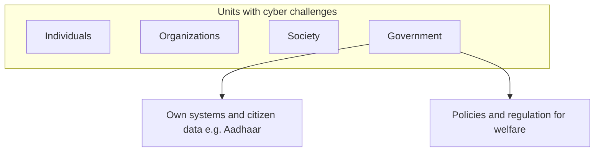

**4. Technology's triple role.** The instructor's articulation: technology plays **three** roles in cybersecurity.

1. **Source of threat.** Example already raised in class: **denial of service** — an attack on a network or computer **using another computer**; a script on one machine stalls another. Technology used for cyber attack. Scripts are **available in public** if someone wants to try DoS.
2. **Asset to be protected.** Data centers, databases, important devices. In ransomware, **the computer is the asset** that gets attacked.
3. **Defense weapon.** Protection mechanisms predominantly **deploy technology**. Example: **firewall** technology to defend or protect assets.

When you use the word "technology" in cybersecurity, keep in mind **which** of the three you mean. People generally think "cybersecurity technologies" means **protection** technologies. **Not necessarily.** You need the nuances.

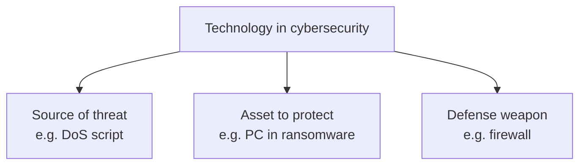

## Cases and examples from the lecture

- **Tesla / internet-connected cars** and **ICAT** tightening cybersecurity tests because life is at stake.
- **16 September 2019 Saudi oil refinery** (named Ramco): 4 a.m. shutdown, drones, company going public.
- **IoT temperature sensor**: 500°C vs 5°C; analog wired control vs internet-connected digital sensors; **Manufacturing 4.0** as the bright side.
- **US drone strike** killing **Qasem Soleimani** at Baghdad airport — drone as the killing instrument, not a soldier's gun.
- **Air India** data breach (embarrassment).
- **Twitter** celebrity-handle hacks (Bill Gates; election contestant) and public explanation.
- **TCS** website hack; newspapers as "fun" headline; defense that the site was **outsourced**.
- **Citibank** "branchless bank" as extreme IT dependency.
- **Aadhaar** flagged as a coming case of government-held personal data.

## Key terms

| Term | Meaning in this lecture |
|------|-------------------------|
| Smart connected devices / IoT | Devices with processing that connect to the internet and transmit data, not only PCs |
| "Any internet-connected device is not safe" | The basic principle stated for IoT / connected systems |
| Manufacturing 4.0 | New generation of digital / smart manufacturing — taught as the bright side of the same sensors |
| Information security vs cybersecurity | Older focus on data in IS; cybersecurity is the more recent, wider term |
| Scope widening | From information → infrastructure → people; damage to people is real |
| Units | Individuals, organizations, society, government — all have cyber challenges |
| Government's dual concern | Protect own systems/data **and** regulate for citizen welfare |
| Privacy as close cousin | Privacy / data protection interrelated with cybersecurity |
| Triple role of technology | Threat source, asset, defense weapon |

## Formulas / frameworks (if any)

- **Cars analogy:** do not ban the useful technology; **increase safety** (same logic as not abandoning digital tools).
- **Trade of privileges:** refusing WhatsApp / TV / social media can reduce exposure, but you **lose** digital privileges; most people will not take that path.
- **Triple-role test:** whenever "technology" is mentioned in a cybersecurity sentence, name whether it is the **attack tool**, the **asset**, or the **control**.

## Distinctions the instructor insists on

- Losing data on a computer is **not** the ceiling of harm; connected cars, refineries, and drones show **halted operations and harm to people**.
- Analog wired sensors were hard to manipulate remotely; **digital + internet** is what opens unauthorized access.
- Cybersecurity is **not** just a new name for information security; **people and infrastructure** are in scope.
- A hacked **IT company** (Twitter, TCS) is taught as **embarrassment and public explanation**, including the outsourcing excuse — not as proof that "tech firms cannot be hacked."
- "Cybersecurity technologies" **does not automatically mean defensive products**.
- Government is both a **potential victim** (Aadhaar-scale data) and a **regulator**; privacy will be discussed with a claim of party-neutrality.

## Exam-oriented recap

- Connected cars + ICAT: cybersecurity testing because lives can be destroyed, not only data lost.
- Saudi refinery 16 Sep 2019, 4 a.m., drones; Citibank/ERP as "if IT stops, the organization stops."
- IoT principle: internet-connected ⇒ not safe; false temperature can wreck process control.
- Drones also kill (Soleimani); people are now in the security perimeter.
- Units: individual / organization / society / government; government = own systems + regulation.
- Technology = threat + asset + defense; DoS scripts and firewalls are both "technology."

---

# Lecture T04: Introduction — Part 03

**Playlist index:** 04  
**Transcript:** [04-introduction-part-03.md](../transcripts/markdown/04-introduction-part-03.md)  
**Video:** https://www.youtube.com/watch?v=ZmCtYgj9kSo  
**Week / theme:** Introduction — what "security" and "cyber" mean, CIA preview, course philosophy

## Learning objectives

- Define **security** as a state (and a psychological sense) of being safe, then scale it from the individual to the organization.
- Distinguish **information security** from the wider **cybersecurity**, including the ITU 2008 definition and the spelling conventions.
- State the **CIA** triangle as the three elements cybersecurity/information security seeks to ensure, and quote the Whitman and Mattord definition of information security.
- Explain why this course is **management and governance first**, with technology in a threefold role, and preview GRC, two kinds of planning, Target/Sony, and privacy regulation.

## What this lecture actually teaches

### What "security" means before "cyber"

The instructor opens with a plain question: what do you mean by **security**, leaving "cyber" aside? Class answers include protection from threats and protecting what is important. He also wants the **general** meaning: when do you **feel** secure?

He includes **physical security**, not only information security. Security is a **psychological sense** as well. Information security also has an **emotional dimension**, but as a student pointed out, it is a **quality or state**. In a general sense, security is a **state of being safe** or a **state of feeling secure**: no miscreants trying to attack, intrude, or damage your property, assets, information, or yourself.

These are constant concerns for **survival**. Change the unit from **individual** to **organization** and organizations also have assets to protect.

- **Individual:** the most important asset is **my body / my life**; next is **information I carry in my mind**.
- **Organization:** plenty of assets — **physical** and **informational**. That used to be the scope of cybersecurity / information security in the past.

### Information security versus cybersecurity

When people said cybersecurity, the **general understanding** was: securing **information**, **computers**, **computer networks** — nothing beyond that. Today the scope is also about securing **what is added**.

**Information security:** protect information as an asset — data and information. Example: **AIIMS** database servers — people got access; that should not happen; it is a **data breach**, hence information security.

**Cybersecurity:** information security is **a part of** cybersecurity, but cyber adds much more. Organizational security includes **physical security** of infrastructure, **personal** security, **operations**, **communications**, **network**, **information**, and so on.

**IIT Madras gate.** Before you enter, there is a **security gate** and personnel **24×7**. The institute invested in the gate to ensure security of organizational assets. What does that security **do**? It ensures that people who enter are **authorized**: those who have the right to enter **only** enter, and others do not — and conversely, those who have the right **should be able to enter** (they should not be denied). **False positives and false negatives** can happen. To do this they must know **who is who** — **verification**. How cybersecurity is ensured will be treated more systematically later.

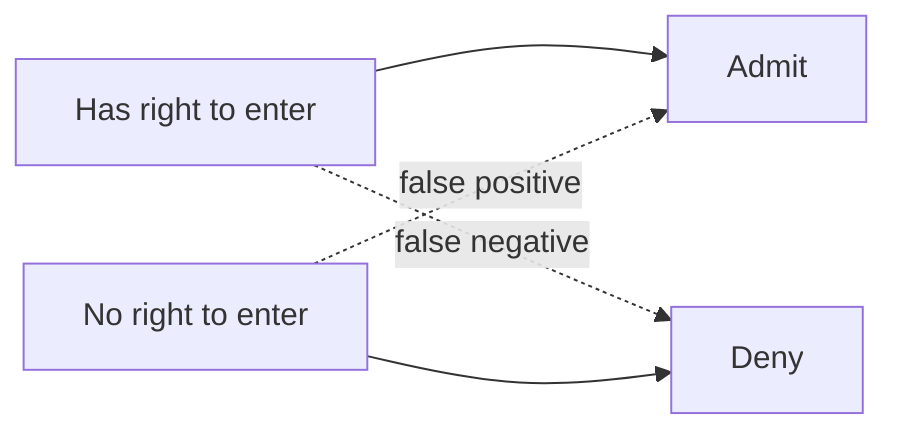

### How to write the words "cyber" and "security"

Three written forms: **cyber security** (space), **cyber-security** (hyphen), **cybersecurity** (one word). **All three are correct**, with one condition: **pick a convention and follow it consistently** in the same paper.

- **Europe:** typically two words — `cyber security`.
- **United States:** one word — `cybersecurity`.
- **India:** a **compromise** — hyphen `cyber-security`, so as not to displease anyone.

Journals from the US will show one word; European writing will show two.

### Where "cyber" comes from

From the **1990s** onward, **cyber** became associated with computers, networked computers, predominantly the **internet** — the cyber world. It is a prefix: **cyberspace**, **cyber coolie**, **cyber world**.

The word comes from **cybernetics**, a **Greek** word. Cybernetics means someone **steering a ship or vehicle** — the **steersman**, someone in **control**. Cybernetics means **control**. Someone pulled **cyber** out to represent the internet. **Internet-connected world / systems** = cyber systems / cyber world. **Cybersecurity** then denotes security of the **computer-networked / internet world**. That is the word-meaning basis for differentiating it from information security.

### ITU 2008 definition (all-inclusive, "kilometre long")

The **International Telecommunication Union (ITU)**, a global body for telecommunications and digital technologies, gave a definition of cybersecurity in **2008** (not from a textbook). It tries to include every aspect of computing: **tools, policies, security concepts, security safeguards, guidelines, risk management approaches, actions, training, best practices, assurance, technologies**. Many items correlate; **definitional clarity is an issue**, but cybersecurity is **all-inclusive** — security of everything under the cyber world.

Therefore cybersecurity **involves users / human beings**, not just information. On **Facebook**, keeping a profile free of unauthorized access is an **information-security** concern. There are **other** concerns: **your own security in the cyber world**. There are cyber attacks on individuals, bullying, **cyber crimes** (the TA Binod's research is related to cyber crimes). Criminals can cause **physical damage** through these channels. Security of individuals from cyber crimes is part of cybersecurity; it **may not** be information security — **bigger scope**.

The instructor's definitional slogan: **cybersecurity is information security plus individuals**. Drone example: the drone has surveyed premises (intelligence / leak of information) but it can **attack and kill me**. **My safety through the use of information technology** is under cybersecurity. Cybersecurity covers **users and systems**. Information security is more about **systems** and their security.

Because this is emerging, the course **borrows concepts from information security**, where the literature is well developed. The **textbook is titled Information Security** (predominantly that field); other aspects of cybersecurity come through **extra reading materials**.

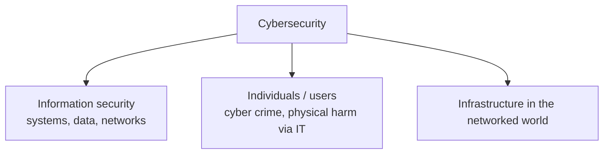

### CIA triangle (preview; details next class)

Cybersecurity seeks to ensure three aspects, generally known as **CIA**, the **CIA triangle**: **confidentiality, integrity, availability**. Three dimensions of **information** security: confidentiality, integrity, and availability **of information**. That is the purpose of **information security management**. Parsing of each term is promised for the next class.

**Whitman and Mattord definition of information security** (2018 textbook — a leading text in information security **management**):

> the protection of information and its critical elements, including the systems and hardware that use, store and transmit that information.

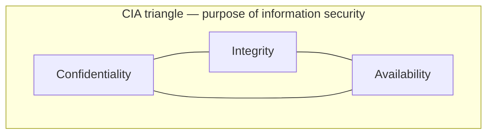

### This course is not a CS cryptography course

**Caution on expectations.** Information security can be taught as a **technology / computer-science** course, or from a **managerial / management and governance** perspective, where technology is **one** aspect. We need to understand technology's role in cybersecurity management, but **it is not a study of technology**. Cybersecurity is **much more than cybersecurity technologies**.

The 2018 textbook covers **management and governance**: what managers should know about security of **information assets** and **other assets including people**. That is the predominant focus.

**Cryptography example.** A CS course may dwell on cryptography for many sessions because it is an underlying technology for **confidentiality**: information from node A to node B should be read only by the intended person. You **cannot always prevent access**. Classroom analogy: everyone **hears** the lecture because of a **shared language** (words + grammar). If the instructor spoke **Greek**, students still have **access** (they are listening) but **do not understand**. In computer transmission there is no body language — only the information. **Encryption** is that other language: even if you gain access, you cannot understand ("deep encryption" in his phrasing). Important as technology, but this course takes the **application** perspective: **what encryption does**, not **how encryption algorithms work**.

### Technology problem or administrative problem?

He will use a case next class to make this sharp. Quick class views: **both**; or **more administrative**; or (because technology is attacked and used to attack) **focus on technology**; or administration as the **overarching framework that deploys techies**.

A counter-view **techies** may like: movement toward **zero trust** — **no trust in human beings, trust none**. Deploy technology so you are not dependent on anyone's credibility; humans become less important, technology more important. He flags this as a **debate** to revisit, and has articles on it.

Big **data-breach cases** will show a **more complex problem**: not only technology issues but **huge administrative issues** and **regulatory implications**. Government wakes up after breaches. If data protection is **not regulated**, there is no one to question you — why would a company invest so much? **Law of the land** matters. India was then **debating a personal data protection** law/bill (politics included). **GDPR** is named; students have heard of it. The issue has gone **beyond administration to policy and regulation at national levels**.

Seeing cybersecurity as **narrowly** putting up **firewalls** or **intrusion detection systems** is an important **element**, but there also need to be **administrative and government systems and standards**, and **policies and regulation** to govern at country level. **That is what cybersecurity and privacy today are.**

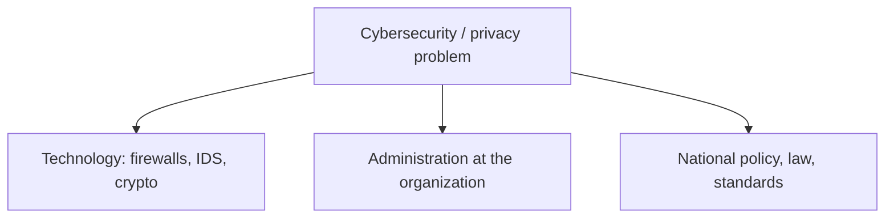

### Course philosophy, CLO1, and the map of topics

(Platform logistics — Moodle posting, extra videos as files — are omitted.) The **philosophy** is what he outlines. **Four** course learning objectives; he fully states the first:

**CLO1.** Recognize cybersecurity from **technological and administrative** perspectives. See that it is **both**. He will not ignore technology or make it "just a management talk." Technology will be covered as **threat, asset, and protection** — the **threefold role**. He is **not** the expert on protection mechanisms in depth; that needs technical knowledge and experience. **Pedagogy:** a **guest from industry**, a practitioner; technical doubts should go to that guest.

**Session map he actually walks through:**

- **Foundations** of cybersecurity, information security, and related concepts (textbook + research articles).
- **Principles of information security management:** confidentiality, integrity, availability — **next session**.
- **Case: Target Corporation** — a defining breach (he also places **Sony** around **2014**; the two together shook industry **and government**). Target is the representative case they will analyze. (He also says 2016 alongside Sony in passing; the Target discussion in later lectures is dated **2013**.)
- **Security management, GRC** — frameworks, an **ISO** standard, GRC as a practice rather than buying technology in bits and pieces; becoming **compliant** with standards.
- **Two types of planning** (management = planning and managing resources):
  - **Contingency planning:** despite all protective steps, **things can go wrong**. Human brains cannot predict the future completely. **Reactive / firefighting**; restore to normal operation.
  - **Risk management:** no assumption that something **has** gone wrong; what **can** go wrong, and how do you protect against that. **Proactive / preventive.**
- **Cybersecurity policy** as a top reference document for priority and resources.
- **Technologies:** guest lecture; one session on **cryptography** from a **confidentiality** point of view; **passive defense versus active defense**. Passive = building walls to protect. "Offense is the best defense" — can you attack hackers? **Active defense** goes beyond walls to "shooting." **Legal sides** are not trivial.
- Then the course **moves to privacy**: information-privacy landscape and **regulation** in **North America, Europe, and India**, with several cases.

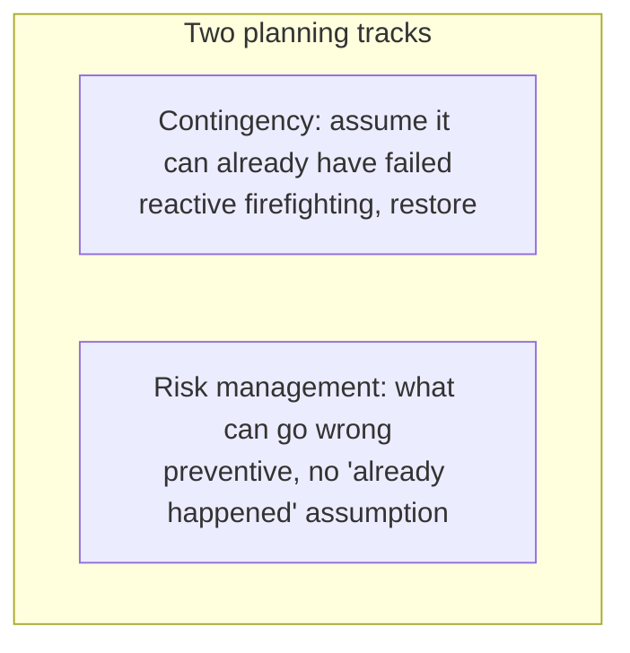

## Cases and examples from the lecture

- **AIIMS servers** as the information-security (data-breach) illustration while defining the narrower term.
- **IIT Madras security gate:** authorized entry, false positives/negatives, verification.
- **Facebook profile:** unauthorized access = information security; bullying / cyber crime / physical harm = the extra cybersecurity layer.
- **Drone** that can kill after surveying premises — users, not only systems.
- **Encryption as Greek:** access without understanding.
- **Zero trust** named as a technology-heavy counter-argument to "administration first."
- **Target** (representative case next) and **Sony (c. 2014)** as world-shaking breaches.
- **GDPR** and India's then-debated personal data protection bill as evidence that the problem is **regulatory**, not only local admin or firewalls.

## Key terms

| Term | Meaning in this lecture |
|------|-------------------------|
| Security (general) | A state of being safe / feeling secure; also psychological / emotional |
| Information security | Protect information as an asset (data, databases, systems that use/store/transmit it) |
| Cybersecurity | Information security **plus** individuals (and the networked world's users and systems); ITU 2008 is all-inclusive |
| Cybernetics | Greek origin: steersman / control; source of the prefix "cyber" |
| CIA triangle | Confidentiality, integrity, availability of information |
| False positive / false negative | Wrongly admitting someone without right, or wrongly denying someone with right (gate analogy) |
| Zero trust | "Trust none" — reduce dependence on human credibility |
| Contingency vs risk planning | Reactive restoration after failure vs preventive treatment of what *can* go wrong |
| Passive vs active defense | Walls / protection vs going beyond, including "shooting" / offending attackers (legal issues flagged) |

## Formulas / frameworks (if any)

- **Spelling rule:** any of the three written forms, **one convention per document**.
- **Whitman & Mattord (2018):** protection of information **and its critical elements**, including systems and hardware that **use, store, and transmit** that information.
- **ITU (2008):** long list (tools, policies, concepts, safeguards, guidelines, risk-management approaches, actions, training, best practices, assurance, technologies) — taught as **breadth**, not as a definition to memorize word-for-word.
- **Course stack:** foundations / CIA → Target (and Sony as twin shock) → GRC/ISO → contingency + risk → policy → crypto & defense (guest) → privacy regulation (NA, EU, India).

## Distinctions the instructor insists on

- Feeling secure is real, but organizational security is about **authorized vs unauthorized** entry and **verification**, including gate errors.
- **Information security ⊂ cybersecurity.** Adding "cyber" is not a synonym swap; **people** (cyber crime, drones, safety) enter the scope.
- US vs European **spelling** is a consistency issue, not a meaning issue.
- This course studies **what encryption does**, not **how the algorithms work**.
- Firewalls/IDS are **an** element; without **administration, standards, and national regulation**, investment incentives collapse.
- Contingency planning is **firefighting after failure**; risk management is **preventive** and does **not** assume the incident has already happened.
- Active defense is **not** a casual suggestion — **legal sides** matter.

## Exam-oriented recap

- Security = state of safety (and a feeling); orgs protect physical + informational assets; gates implement authorized access with possible false +/−.
- Cyber from cybernetics (control / steersman) → internet-connected world.
- Cybersecurity = IS + individuals; ITU 2008 is deliberately all-inclusive.
- CIA is the purpose of information security management; Whitman–Mattord 2018 is the textbook definition.
- Managerial course: GRC, two planning types, policy, Target/Sony cases, guest on protection tech, then privacy law (GDPR and India).
- Technology's threefold role remains in force; "cybersecurity technologies" ≠ only products you buy to defend.

---

# Lecture T05: Foundations — Part 01

**Playlist index:** 05  
**Transcript:** [05-foundations-part-01.md](../transcripts/markdown/05-foundations-part-01.md)  
**Video:** https://www.youtube.com/watch?v=WAImfXGwhOs  
**Week / theme:** Foundations — information-security dimensions, McCumber cube, CIA in detail

## Learning objectives

- Read information security as three constituents (**network; computer and data; management**) with **policy** at the intersection, mapped onto storage, processing, and transmission.
- Use the **McCumber cube** (NSTISSC / John McCumber) so that no cell of cybersecurity is missed.
- Define **confidentiality, integrity, and availability** the way this lecture defines them, with the Alice–Bob–Eve, CV, and IRCTC examples.
- Recall CIA as the **purpose** of information security even if everything else is forgotten.

## What this lecture actually teaches

Privacy as a full topic waits until several cybersecurity sessions are done; connections to data privacy come later. This session is **foundation for cybersecurity**, with the course still treating cybersecurity as an **administrative issue**: managers administer human, technological, tangible, and intangible resources. It is not a technological issue alone; it is governance and management. Frameworks and **standards** for cybersecurity management in practice were promised earlier.

Technology is still seen in **three dimensions**: **source of threat**, **asset to be protected**, and **tool / firewall** for protecting cyber assets. Challenges are emerging (previous class).

### A holistic diagram: three constituents plus policy

One diagram is titled **information security**. Cybersecurity and information security are closely related; **information security is a part of cybersecurity** and "the most important part." Three **concentric circles** / constituents:

1. **Network security**
2. **Computer and data security**
3. **Management of information security**

A **shaded intersection**, from the management perspective, is **policy**. Policy is the **reference** for security-related practice and decisions — for example, **how much an organization should invest**. Today's case (developed in the next parts) is an organization that invested **as much as the Pentagon** invests in security. Policies **differ** by organization with the **criticality of cyber assets** and other choices. Organizations **make choices** on cybersecurity investments. Policy **guides decisions**.

Another way to slice the same idea: in data and information there are three computing aspects —

- **data storage**
- **data transmission**
- **data processing**

Computer and data security covers **data, databases**, and **computers as processing** (applications that process data) — storage and processing. **Network security** is about data moving **from node A to node B**, where breach / unauthorized access can occur. All three need protection.

To do that you need **management practices and policies**: human resources, protection technology, and decisions on **how much to protect and how much to leave** — management may **not over-invest**. That is the administrative dimension. Cybersecurity is **not one thing**; it is an **integrated effort** to protect cyber assets.

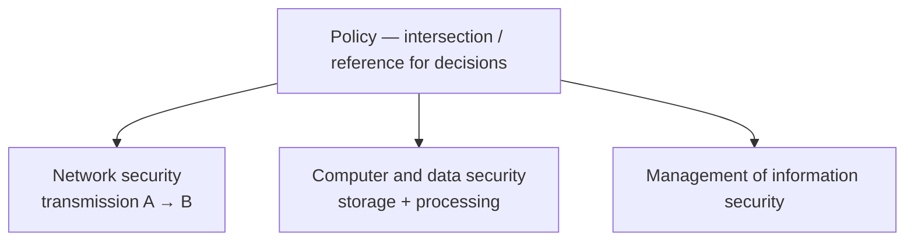

### CIA triangle: the purpose of cybersecurity

Any cybersecurity course — technology or management — shares three fundamental concepts: **Confidentiality, Integrity, Availability**, often called the **CIA triangle**. One way to understand it: CIA is the **purpose** of cybersecurity. What does cybersecurity **do**? It ensures that confidentiality, integrity, and availability of information are secured. That is the aim for information in the cyber world.

The cyber world **goes beyond information** today; those aspects will be integrated slowly. At a fundamental level, the purpose of information security is these three, which matter for **secured storage, processing, and transmission**. Related concepts exist (example named: **accountability**); they will be discussed one by one. For now he uses cybersecurity and information security **synonymously**.


### McCumber cube (NSTISSC security model)

Also known as the **McCumber cube**; **John McCumber** proposed it. It makes understanding **holistic** so a practitioner **does not miss any aspect**. Three dimensions in cubical form:

| Dimension | The three cells |
|-----------|-----------------|
| **Computing** | Storage, processing, transmission — where information/data reside; the devices involved |
| **Objectives / purpose** | Confidentiality, integrity, availability |
| **Methods to ensure security** | **Policy**, **education**, **technology** |

When systems store, process, and transmit, they should be secure — meaning CIA. How? Policy, education, and technology, applied to CIA for storage, processing, and transmission.

**Lesson of a single cell.** Example: an **application** (data **processing**). For that cell, look at all three dimensions. Processing **integrity** must be ensured **with respect to policy, education, and technology**. Count: **3 × 3 × 3** cells. Each cell is holistic. Practicing managers can ask: have **all cells** been considered? Due attention across all three dimensions?

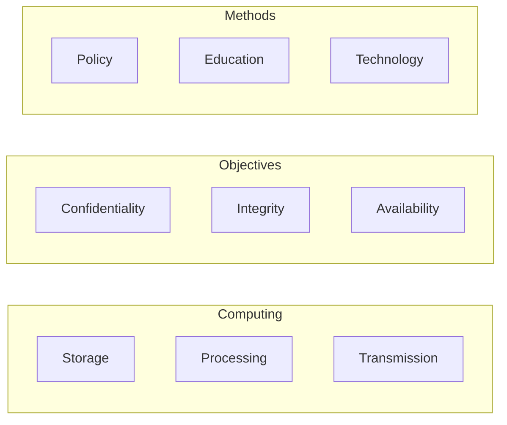

### Confidentiality

Office joke: if you want gossip, stamp a document **confidential** and give it to a clerk — it will be the talk of the town. The word makes people **curious**. People tap data that is not theirs for malice, evil, fun, or **mistake** (human error).

**Definition in this lecture:** if person A sends information to person B and wants it read **only by B, not by any C**, the system must ensure that transmission is confidential.

**Alice, Bob, and Eve.** Rivest, Shamir, and Adleman — entrepreneurs as well as names you will meet in encryption — published in **1978** in **IBM Systems Journal** a diagram: **Alice** sends a confidential message to **Bob**; evil **Eve** wants to intercept and know what is going on. Confidential data should be read **only by the intended recipient**.

Applications: who accesses your **private information**, **credits**, **academic performance**. The institute can grant access to those who should have it; others must not. Best example: **Aadhaar** — biometric, personal identity; the country must ensure it is not accessed by just anyone. "**It is my data.**" That is where **privacy** enters. When I share it, the **data processor** should use it only for those I have **permission / consent** to share with. There is always a **consent** between **data collector / data processor** and **data subject**. That **contract** should be maintained.

**Confidentiality is the responsibility of the data collector** to ensure data is shared only with intended recipients, not unintended ones.

**How to ensure it:** **information classification**. Example: **salary data** in HR — accessible maybe to certain superiors, **not** to peers or subordinates. Policy must be implemented in database access. Classification (including US military **top secret**) comes later. Documents need secured storage; security policies applied; **people trained**.

Even if jealous Eve **intersects** the data, she should not make it out. **Caesar cipher:** Caesar communicated with commanders through someone; if a messenger on the way reads it, they understand nothing. That is **encryption** (details later).

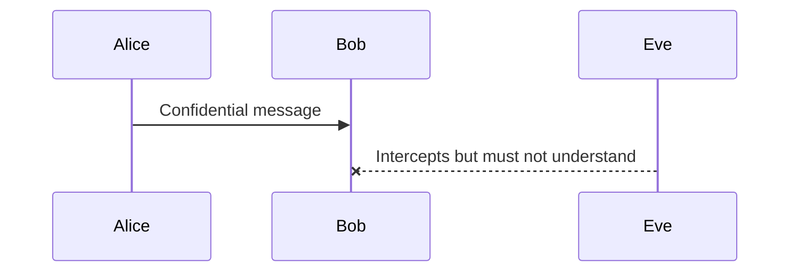

### Integrity

Class associations: **completeness**, **purity**, **no compromise on quality**. Of people we say high or low integrity: **whole / full**; if part is missing (good at the job but into malpractices), integrity is questionable.

**In data:** information transmitted from A to B is whole at A; at B **part is missing**, or it is **changed**.

**CV example.** You share a complete CV with placement; someone jealous **removes work experience**, or changes **10 years to 2 years**. Data is passed but **integrity** is the problem: stolen, missing, or **manipulated**. When data goes A to B it should reach B **intact** — no damage, manipulation, or change.

**Practical / privacy-linked integrity.** If an employer will not let you access your stored bio-data, you cannot **update** a new certificate. **By regulation**, when a subject shares data with a controller/collector, the **subject should have access** wherever it is stored and should be able to **make changes** — "it is my data." That is a **privacy right** and also about integrity (data otherwise incomplete).

**Date of birth** entered as **2010** instead of **2000**: promotions and more can be affected. The **user** is the affected party and must have access. So: **who has access** (confidentiality) and **protecting data without damage** (integrity).

### Availability

**The other side of confidentiality.** Data should **not** be available to the unintended audience, **but should be available when required by the intended party**. Accessible **as per contract**. Critical in some business contexts.

**IRCTC / airline ticket.** You log in, about to reserve, or you want past reservations — **database down**. You have signed in; you have the privilege; it is **your** data (still inside confidentiality); the system should allow access **when you need it**. Reservation time with no data is an **availability** problem.

Cybersecurity management must make **provisions** so intended recipients can get the data. Availability is related to **reliability**: reliable systems are available. In computer systems, **reliability engineering** uses **redundancy**: if one system is down, processing/access continues from others. **Availability by redundancy.**

**How much:** the **number of nines** after the decimal (**99.9999…**) is a sort of **contract** in B2B IT, via **service level agreements**. More availability ⇒ more investment in redundancy ⇒ **higher cost**. You can ask for **100%** availability; **100% comes at a sometimes infinite cost**.

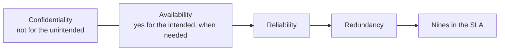

### Straight recall

Even if you forget everything else, **CIA should be by heart**. Woken in the middle of the night: what is cybersecurity doing? **Confidentiality, integrity, and availability.**

The lecture then puts up a **retinal / biometric eye-scan** image (Aadhaar identification) as the bridge into the next part — identification as a first step toward confidentiality.

## Cases and examples from the lecture

- Organization investing in security **on the scale of the Pentagon** (the Target-level investment teaser).
- **Alice–Bob–Eve** (Rivest, Shamir, Adleman, 1978, *IBM Systems Journal*).
- **Aadhaar** as confidentiality / consent / "my data."
- **HR salary** classification: superiors vs peers/subordinates.
- **Caesar cipher** as encryption the messenger cannot read.
- **CV** stripped or altered in transit — integrity.
- Wrong **date of birth** in an employee database — integrity plus the right to access and correct.
- **IRCTC / airline booking** outage after a valid login — availability.
- **Biometric / retinal scan** image as the lead-in to identification (developed in Part 02).

## Key terms

| Term | Meaning in this lecture |
|------|-------------------------|
| Policy (in the diagram) | Intersection/reference that guides security practice and investment decisions |
| Storage / processing / transmission | The three computing aspects that must be secured |
| CIA triangle | Purpose of information security: confidentiality, integrity, availability |
| McCumber cube | 3×3×3 model: computing × CIA × (policy, education, technology) |
| Confidentiality | Intended recipient only (A→B, not C); data collector's duty given consent |
| Integrity | Data arrives intact: whole, unmanipulated; includes subject's ability to keep it complete/correct |
| Availability | Intended party can access when needed, as per contract; other side of confidentiality |
| Redundancy | Extra systems so availability survives a failure |
| Nines | Contractual availability target (e.g. 99.9999…); more nines cost more |

## Formulas / frameworks (if any)

- **McCumber cells = 3 × 3 × 3.** A manager's checklist: for each combination of (storage|processing|transmission) × (C|I|A), are policy, education, **and** technology in place?
- **Availability vs cost:** higher contracted nines ⇒ more redundancy ⇒ higher cost; **100% ≈ unbounded cost**.
- **Consent chain:** data subject ↔ collector/processor; confidentiality = honour that contract about **who** may see the data.

## Distinctions the instructor insists on

- Information security is **part of** cybersecurity but, in this foundations block, the two terms are used **synonymously** while CIA is taught.
- Policy is not a poster on the wall: it is the **decision reference** for **how much to invest** and **how much to leave unprotected**.
- Confidentiality is **not** "hide everything"; it is **intended vs unintended** readers, including after interception (encryption).
- Integrity is **not** only "no hacker edited it"; missing updates and **wrong data entry** (DOB) are integrity failures, tied to **access rights of the subject**.
- Availability is **the other side of confidentiality**, not a third unrelated slogan. Unauthorized people must **not** see it; authorized people **must** be able to.
- Reliability engineering's contribution here is specifically **redundancy**, not a new CIA letter.

## Exam-oriented recap

- Three constituents of IS: network, computer/data, management; **policy** at the centre; map onto store / process / transmit.
- McCumber cube: computing × CIA × (policy, education, technology); do not miss a cell.
- Confidentiality: Alice–Bob–Eve; Aadhaar/consent; classification; encryption so intercept ≠ understand.
- Integrity: intact, complete, unaltered; CV and DOB; subject access to correct "my data."
- Availability: IRCTC; redundancy; SLA nines; 100% can be infinitely expensive.
- Midnight recall: cybersecurity does **CIA**.

---

# Lecture T06: Foundations — Part 02

**Playlist index:** 06  
**Transcript:** [06-foundations-part-02.md](../transcripts/markdown/06-foundations-part-02.md)  
**Video:** https://www.youtube.com/watch?v=9oQb5DIuNKg  
**Week / theme:** Foundations — identification / authentication / authorization / accountability; Target case (what happened and why)

## Learning objectives

- Sequence **identification → authentication → authorization**, and place **accountability** when incidents happen.
- Explain why confidentiality needs a **credible identity** before access rights can mean anything (gate, Aadhaar, SIM, email).
- Tell the **Target** story (US retail, Thanksgiving/Christmas **2013**, HVAC vendor, POS) without jumping to solutions.
- Separate **technological** from **managerial** vulnerabilities, then show why the case **ties them together** (authorization, turned-off malware tools, false positives, efficiency vs security).

## What this lecture actually teaches

The session continues straight from the CIA recap and the **biometric / retinal** image.

### Identification: first step toward confidentiality

To ensure confidentiality, one of the first steps is **identification**. Back to the **security gate**: staff decide who may enter, but they cannot decide by smile, dress, or face alone. There must be a **credible mechanism**.

**Without identity, you cannot ensure confidentiality.** "Who is who?" Whether someone has a right to access is based on identification. In government or organizational data collection, the **first step is to create identity**.

**IIT Madras enrollment:** you provide data and supporting documents; administration runs processes; you receive an **identity card**. At the gate: "here is my identity." A student card identifies a **student**; the instructor's card identifies a **faculty** member — **different role**. **Dates matter** (not an old card). Without an ID card, the gate cannot decide.

**Identification** is the process of creating **credible identity** for individuals who can access computing resources.

**Aadhaar** is the national-scale illustration. The most difficult stage is identification. Government used **vendors**, verified their credibility, **outsourced** collection of identity information, and finally assigned an **Aadhaar number**. Creating an **employee ID**, **roll number**, **Aadhaar number**, or **account number** is all identification. **First step in security: who is who?**

### Authentication: verification of the claim

After identification comes **authentication**. Only if you have **valid identities** will authentication work.

**SIM card / passport.** A telecom operator (Airtel, Jio, anyone) must, by **government regulation**, identify you. An **IIT ID card is not a valid ID** for that purpose. They need proof you are a **citizen of India** with a unique government number. You may **claim** to be Saji; they **want to verify** that claim. **Authentication is nothing but verification.**

At the IIT gate you claim to be a student; **evidence** is the already-created ID card. At a passport office or telecom counter they ask for **fingerprints**. Biometric data stored in **Aadhaar** is checked against the person who claims to be X. If biometrics match the record for X, authentication is done: you claim to be X and you **are** X.

**Authentication** is verification ensuring a person is **who he or she claims to be**. It is the **gateway / entry** into a computing system or organization. Show the ID, you are in. **Creating** the ID was identification; **producing** it at need is authentication.

**Email login.** Two fields: **user ID** (e.g. `saji@iitm.ac.in`) is the **claim**. Anyone could claim to be the instructor to read mail. Then **password**: tell me something **only I am supposed to know**. **Password** is a long-standing authentication method — **something I know**. **Biometric** is **something I have**. Secrecy of the password is the point. The system cross-checks; you are authenticated. If the password has **leaked**, someone can become you — a weakness, hence **multi-factor authentication** (promised later). Authentication tightness tracks the **criticality** of the service.

### Authorization: level of access after you are in

Together, three key concepts **particularly for confidentiality**: identification, authentication, **authorization**.

**Authorization** defines **the level of access** — what you can and cannot access. A student may go to an allotted **hostel room** but **not** a **faculty room**. On **Moodle**: student login vs faculty login — different **authority** to access information, by **role**.

After authentication, the system provides resources based on **access rights**. For authorization to work, those rights must be **predefined**: roles and rights.

**Summary of the management job:** (1) **classify information**, (2) **classify people**, (3) **map** people to information. That mapping is the level of authority. Standard practices in industry and **military** come in later sessions.

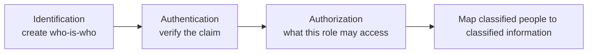

### Accountability: after something goes wrong

**Accountability** is related to **incidents**. Example: someone who is not student/faculty/staff enters the **ladies hostel** at night — **no authority**; a problem of **authentication** (the person who should not enter, entered). Then: **what action to take?** Who is to be **held responsible**? Who was on the security post — sleeping? How did the person get in? **Who is responsible for breaches** must be ascertained **in order to take action**. That is accountability.

Any data breach: **who accessed** and **how** should be assigned to **someone / some role**. If nobody takes responsibility, it will happen again. Administration must act on the **vulnerability**. Therefore **sign-in and log data** must be maintained strictly: complete history of who signed in and out, **for accountability**.

```mermaid
flowchart TB
    Incident["Incident / data breach"]
    Incident --> Who["Who accessed, how?"]
    Who --> Role["Assign to a role"]
    Role --> Logs["Logs: sign-in / sign-out history"]
    Role --> Action["Action on the vulnerability"]
```

### Target Corporation — reading R3, three questions

The class then spends 15–20 minutes on the case (slide still said R4; instructor corrects: **R3**). He calls it **major** because it had implications for **industry and government**. Government is responsible for **welfare**; large incidents that affect many people may reflect missing **regulations, laws, and enforcement**.

Three questions on the slide; this lecture works mainly the **first** (what happened, then technological and managerial vulnerabilities). Impact is Part 03.

**Question 1.** Identify **technological and managerial vulnerabilities** that led to the data breach at Target.

### What happened (class summary, before why)

**Target** is a **US retail chain**, close competitor of **Walmart** in North America. Retail is a major experience-driven business. The incident is in the **Thanksgiving / Christmas** season — peak sale. It looks **pre-planned** to hurt the company when it expects huge sales.

A student summary: around Thanksgiving **2013**, Target had to maintain payment systems. Responsibility related to **climate / infrastructure** went to a third party (named in class as **Faisal Mechanical Services**). That access path let hackers reach **payment systems** and leak **customer payment / credit-card information**, which they **commoditized**.

Headline: **data breach** at peak season — **embarrassment and major crisis**. Year taught here: **2013** (he discards a 2016 slip). Several case studies exist; it is a **dominant** data breach.

Investing in cybersecurity technologies is one thing; **practicing** them is another. Target had **multiple firewalls**, data-protection systems, **automatic deletion of malware** — but that **function was off**, and employees were **not trained / not aware**.

### Vulnerability versus exploit (classroom lock)

**Every hacker exploits vulnerabilities.** These are **technical terms**. This classroom is meant for course participants; **the room is not locked** — that is a **vulnerability**. Not everyone outside wants to come in. If someone wants to disrupt the class, they can. A passer-by who only sees a closed door may not enter; someone who **knows the door is unlocked** exploits that vulnerability. That act is an **exploit**. **Not all vulnerabilities are exploited.**

### Technological vulnerabilities named in class

Stay on the technical side first:

1. **POS memory unencrypted.** Credit-card data was stored / captured at the **POS terminal**. Transmission to centralized systems **was encrypted**, but **inside the terminal (RAM / memory of the billing computer) data was not encrypted** and was accessible. Technology vulnerability.
2. **Malware detection turned off.** The team shut down / turned off malware-detection software, so they could not detect injection. (A student adds they wanted email and internet access.) Another student: they used internal and external assessment; tools were **up to date**, but **off**, so injection went unseen. The instructor notes: if **somebody turned it off**, that is already a **human failure** — crossing into management.
3. **Third-party access to payment / POS.** The vendor should have had **limited** access. The vendor's role was **infrastructure maintenance / climate control**, **not** POS data. **Configuration** let the vendor reach POS. Hard to put in one bucket: technical **and** oversight. Not necessarily deliberate — an **error**. **Authorization issue:** that vendor had **no authority** to access POS; authorization was **not clearly configured**.

So "identify technological issues" immediately shows **technical and human roles tied together**.

### Purely administrative failures

Did they have **audit** processes? The case: **multiple firewalls**, **intrusion detection**, malware **detection and reporting** (not detection alone). There was even **automatic deletion** of detected malware. They **turned it off**, citing **many false positives** — hundreds of emails a day.

**False positives in malware / alarms.** In every alarm there can be **false positives and false negatives**.

- The system's job is to flag malicious software. Sometimes it highlights **genuine** activity as incorrect — that is the **false positive** (a student first says "true positive"; the discussion treats the operational pain as **false positives**).
- False positives **hamper day-to-day operations**, so the tendency is to **switch the tool off** if it cries wolf too often.
- **False negative:** unauthorized / malicious activity **not** flagged — **very dangerous**.
- With **no** malware protection at all, **everyone is in**.

**Multiple layers failed in series:** (1) **authorization** mis-configured; (2) the next layer (monitoring) **did not work because it was switched off**; (3) switched off because of **false positives** — doubts reported as problems, alarms every hour, many of them false.

**Efficiency vs security.** If the POS **stalls** on a malware alarm while customers queue, complaint goes to IT ("no problem, we are clearing it"). If frequent, **smooth retail operation** dies. **Tight security can trade off with efficiency.** The easy shortcut: **switch it off / bypass**. Engineers do this in planned operations too. False positive / false negative are like **type 1 and type 2 errors**; **no system is 100% reliable or precise**. Bypassing **removes the filter**. Relating security to **safety**: bypassing is easiest — and **that is what was done**.

**Logs.** Complete logging can also make systems inefficient, so engineers **bypass** logging too. Another managerial/technical shortcut.

**Close of this part:** technical issues **and** managerial issues — **a combination** led to the incident.

```mermaid
flowchart TB
    Vendor["HVAC / climate vendor access"]
    Vendor --> AuthZfail["Authorization / network config failure"]
    AuthZfail --> POS["Reach POS"]
    POS --> RAM["Card data in RAM unencrypted"]
    RAM --> Steal["Customer payment data stolen"]
    Detect["Malware detect / auto-delete / reporting"]
    Detect --> Off["Turned off: false positives vs efficiency"]
    Off --> Miss["Exploit not seen"]
```

## Cases and examples from the lecture

- **IIT gate / student vs faculty ID / card dates** — identification and authentication.
- **Aadhaar** enrollment via vendors; later fingerprint match for SIM/passport — identification then authentication.
- **Password vs biometric:** something I know vs something I have; leaked password ⇒ MFA needed.
- **Moodle roles; hostel vs faculty room** — authorization.
- **Ladies hostel incident** thought-experiment — authentication failure then accountability and logs.
- **Target, Thanksgiving/Christmas 2013:** US retail vs Walmart; third-party climate vendor; POS/credit cards commoditized; firewalls present but practice failed.
- **Unlocked classroom** as vulnerability vs exploit.

## Key terms

| Term | Meaning in this lecture |
|------|-------------------------|
| Identification | Creating credible identity (ID card, Aadhaar number, employee ID, account number) |
| Authentication | Verification that a person is who they **claim** to be (ID shown, fingerprint, password) |
| Authorization | Predefined **level of access** by role after authentication |
| Accountability | After an incident, assign **who is responsible** so action can be taken; needs **logs** |
| Vulnerability | A weakness (unlocked door, unencrypted RAM, vendor over-privilege) |
| Exploit | Using a known vulnerability; not every vulnerability is exploited |
| False positive | Benign activity flagged as malicious; eats efficiency; tempts people to disable tools |
| False negative | Malicious activity not flagged; "very dangerous" |
| Efficiency–security conflict | Tight controls stall operations (POS queues); bypass is the shortcut |

## Formulas / frameworks (if any)

- **Confidentiality stack:** identify people → authenticate claims → authorize by mapped roles ↔ classified information.
- **Accountability loop:** incident → logs → responsible role → fix the vulnerability (or it repeats).
- **Defense in depth (as it failed at Target):** authorization/configuration **then** malware detect/report/auto-delete **then** (ideally) logging — each layer bypassed or mis-set.
- **Type 1 / type 2:** false positive vs false negative; **no 100% precise** detector.

## Distinctions the instructor insists on

- Identification **creates** identity; authentication **checks a claim** using that identity. You cannot authenticate well without valid identities (IIT card will not get you a SIM).
- Password leak means authentication **fails open**; that is why MFA is coming later — not taught in depth here.
- Authorization is **not** "are you in the building?"; it is **what this role may touch** (vendor vs POS).
- Accountability is **not** a fourth CIA letter in this talk; it is **incident responsibility** and **logs**.
- Target is **not** "they had no security." They had Pentagon-scale tools (spelled out more in Part 03); **practice, configuration, and bypass** failed.
- Turning off malware tools because of false positives is **managerial**, even when the box is a technical product.
- Do not dump all vendor access into "a tech bug": it is **authorization**, hence **techno-managerial**.

## Exam-oriented recap

- ID → AuthN → AuthZ, then accountability with logs when incidents happen.
- Aadhaar: hard identification (vendors, number); later biometric authentication.
- Target 2013, US retail, holiday peak, HVAC vendor, unencrypted POS RAM, encrypted transmission, malware tools off, false positives, efficiency vs security, incomplete logging.
- Vulnerability ≠ exploit; unlocked classroom.
- Breach = combination of technical and managerial failures, especially **authorization** plus **disabled monitoring**.

---

# Lecture T07: Foundations — Part 03

**Playlist index:** 07  
**Transcript:** [07-foundations-part-03.md](../transcripts/markdown/07-foundations-part-03.md)  
**Video:** https://www.youtube.com/watch?v=QDzGq_taOLM  
**Week / theme:** Foundations — Target impact, Titanic/paranoid managers, regulation and "bare minimum" security

## Learning objectives

- Assess Target's **tangible** and **intangible** impact (money, lawsuits, holiday profit, goodwill, regulation).
- Reconstruct **what really went wrong** despite CIA-agency-grade tools: vendor access, failed segmentation, **RAM scrapers**, ignored alerts.
- Use the **Titanic / Captain Smith** story and **Andrew Grove's** "paranoid" advice as the managerial moral: **do not ignore safety warnings**.
- State the **watershed** regulatory lesson and the provocative industry quote on investing the **bare minimum** and paying fines later.

## What this lecture actually teaches

This session takes Target's **second question — impact** — then the instructor's slide recap, prevention/aftermath, and open management questions.

### Question 2: impact — can you quantify it?

Incidents happened **despite all the company's cybersecurity investments**. How do you assess impact? Is impact **tangible / measurable / quantifiable**?

**Stakeholders named by the class:** monetary impact on banks, credit unions, people, businesses, and government. The instructor **corrects**: **credit card companies / payment providers**, not credit unions (credit unions are different; later). Government: compliance, and a **watershed moment** in cybersecurity.

**How much?** Class figure used in the room: net about **100 million US dollars**. Where it went (student breakdown he accepts as the picture): partly to banks; **about 10 million to people**; insurance payout around **90 million**; **Visa** (credit payment provider) settlement around **20 million**; plus banks. **Individual customers sued**; **banks and credit card companies** went to court. Settlement / fines on the order of **$100 million** — the **tangible** hit.

**Intangible:** **trust** of customers, **reputation**, **opportunity cost** (business lost). Accounting word: **goodwill**. Customers may go to **Walmart**, not Target. "Once your fingers are burned," you may not return for years even if the firm later improves. Retail is **competitive**; shopping experience is substitutable in similar locations — **why go to Target?** Goodwill is a **major** impact.

**Regulation as intangible / downstream impact.** A paragraph in the article: some policies existed but were **not properly framed**. Target even had to **repay customers whose data was breached but not actually "damaged."** Government had to **rethink policy** because a significant share of the population's data sits in such retail chains. After the case, **more policy regulation** on how to address breaches, **who is responsible**, and **how much fine**. If there is **no law** against privacy/data breach, companies can continue as they like; **unless law requires responsible action, there is no redressal**.

**Internal action / reflection:** role of **CTO / CIO** — strategic **training and awareness** of employees about cybersecurity measures. Government policy **and** company policy.

```mermaid
flowchart TB
    Breach["Target breach"]
    Breach --> Tang["Tangible ~ $100M"]
    Tang --> Courts["Customers, banks, card companies sue"]
    Tang --> Ins["Insurance / Visa / banks / people"]
    Breach --> Intang["Intangible"]
    Intang --> GW["Goodwill, trust, Walmart switch"]
    Intang --> Hol["Holiday profit −46%"]
    Intang --> Law["US policy rethink; who pays, how to report"]
```

### Instructor wrap-up of the facts

**When / who:** **2013**, Christmas–Thanksgiving season. Target had **1,797 US stores** — a large corporation.

**They were technologically updated.** **$1.6 million** malware-detection tool installed **six months** earlier. Why a problem despite that? They used the **same security system as the CIA** — here meaning the **US intelligence agency**, **not** the CIA triangle. Multiple **layers** of protection; **periodic audits**, external validation, benchmarking; **people and processes** in place; **complied with credit-card industry data security standards**. You can do everything required for **regular compliance** and **still** have incidents — and organizations **still** have breaches after 2013.

**What really went wrong.** Hackers gained access through a **vendor's access which was not defined correctly**. Target **failed to segment its network** so third parties would not reach the **POS**. **Techno-managerial failure** — what was **exploited**. They used that connection to **upload malware**. The malware was programmed to **steal customer data from the point of sale**. The real **technical** vulnerability: **encryption** problem, exploited with **RAM scrapers** — software installed in the POS to tap data from memory.

**Impact numbers on the slides:** customers and banks filed **more than 90 lawsuits**. Target's profit for the **2013 holiday shopping period fell 46%** — immediate revenue loss at peak. In sentiment: lost **goodwill of customers, investors, and lenders**.

```mermaid
sequenceDiagram
    participant Vendor
    participant Network
    participant POS
    participant Hackers
    Vendor->>Network: Over-privileged / unsegmented access
    Hackers->>Vendor: Use vendor connection
    Hackers->>POS: Upload malware / RAM scraper
    POS->>Hackers: Customer data from unencrypted RAM
```

### Administrative lens: Titanic and Captain Smith

Cybersecurity leadership is like captaining a ship: the objective is A to B, but **taking people safely** is the real objective. **Safety is critically important.** In this reputed firm, **somebody switched off the malware reporting system** — that **is** safety. Somebody **compromised on safety**.

**Titanic / Captain Smith.** Historical (the film is "very nice," but the error is the point). It was **Captain Smith's last ride**; he was going to retire. Smooth sail, calm blue sea, people having fun. **Warnings from nearby ships** of an **iceberg**. He looked outside: how can there be an iceberg? Everything looks fine. **He did not act on the warning**; the story told here is that he **ignored the warning and went for a cocktail**. If a captain ignores safety warnings, Titanic is the historical example.

Literature: **overconfident**, **too big to fail**. Weather **calm and clear** gave **no perceptible reason** to worry. **The mind can be very deceptive.** Perception of a "fine" class is not knowledge that students are learning — you need an **exam**, something **objective**. **Wrong perception** played a role in Titanic. **Warning for managers:** **attitude does matter**. You are responsible; **any safety warning should not be ignored**.

**Transport safety aside.** What is the safest mechanism — road, train, or flight? **Statistically, flying is the most safe**, because of **strict protocols** that people follow. Rare counter-examples (a pilot flying into a mountain) exist; otherwise safety is thanks to **protocols and mechanisms**. If you **bypass** them, **you are the captain of Titanic**.

### Only the Paranoid Survive

He **strongly suggests** **Andrew Grove's** book ***Only the Paranoid Survive*** for managers. Old, but management talks still use terms Grove coined: **inflection point**, **10× force** (he modified Porter's five forces: if one force is **ten times** the others, what should the manager do?). Key point: **be a paranoid; doubt everything**. You tend to believe everything is fine; **managers just do not do that**. Grove: I worry about plants, people, market. **Paranoid** is a negative word, but it is the **attitude** he tried to build in high competition (Intel leaving the **memory-chip** business, etc.). Dated, but for cybersecurity: **paranoid mindset is a very important mindset**.

```mermaid
flowchart LR
    Warn["Safety / malware warning"]
    Warn --> Smith["Ignore: Titanic / cocktail"]
    Warn --> Grove["Paranoid: doubt the calm sea"]
    Smith --> Hit["Disaster despite 'everything looks fine'"]
    Grove --> Act["Treat the warning; do not bypass"]
```

### Takeaways from Target

**1. Employees' ability to circumvent security.** Despite **huge investment**, if **managerial processes are not foolproof**, the investment **does not make sense**. Vulnerabilities in **management** dominate. **Importance of management in cybersecurity got more highlighted** after this incident. They had "CIA"-grade **security technologies**; failure was **administrative**.

**2. Watershed moment for cybersecurity regulation.** Several US laws exist (the course will map regional landscapes). Still, **lack of clarity**: what to do on a breach, **how to report**, what **redressal**. **No one comprehensive regulation** for cybersecurity and privacy in the **United States**. The **European Union has it**; the US is **still evolving, even today**.

Tangible **$100 million** versus company **revenues of $72 billion** — like a **pickpocket** taking 100 rupees. In cybersecurity management, firms can take different **positions**. One: **ignore**, face it in court, avoid huge security investment. An **industry observer quote** he puts on the slide: as long as fines do not put the business into **bankruptcy** or even **serious financial peril**, executives and boards may decide they are **better off investing the bare minimum** in security and **saving the rest for possible breach cost and fines**. **Ignore the warning** is another management position.

**Is that a good stand?** Government as regulator / guardian of people's interest may say **no**, but **companies can make that choice in the absence of regulation** — comply with law after the fact, compensate, pay fines, but not build a large security system.

**Competition / signaling.** If some players put in more security, customers **trust** them more and others are **forced** to enhance security. Perhaps Target's huge investment was also to **signal**: your data is safe with us. Shying away may be a **market disadvantage**. Valid point: in a competitive environment, under-investing may not be the right choice.

**Preview of risk management:** options available to decision makers, and how to exercise them. Analogy: choosing not to write an exam **now** but **repeat later** can be an **informed** plan — not closing your eyes to hazards, but having a plan if it goes wrong. That kind of informed step is done in practice; it is a **later discussion**.

### Close of the foundations block

Introduction to cybersecurity at a fundamental level: **CIA** — confidentiality, integrity, availability — and mechanisms to ensure them. A case where **data breach happened despite efforts** to secure cyber assets. Lessons will be **referred to again** as more concepts appear.

## Cases and examples from the lecture

- **Target 2013:** 1,797 US stores; $1.6M malware tool (six months old); same stack as the **CIA (agency)**; PCI-style **card-industry** compliance; vendor path; **no POS segmentation**; **RAM scrapers**; **>90 lawsuits**; holiday profit **−46%**; **~$100M** tangible vs **$72B** revenue; goodwill vs **Walmart**.
- Correction: **credit card companies**, not credit unions, as payment-side stakeholders.
- Customers repaid even when data was **breached but not "damaged"** — a regulatory-design issue.
- **Titanic / Captain Smith:** last voyage, calm sea, iceberg warnings ignored, cocktail; overconfidence / too big to fail; deceptive perception.
- **Aviation** as statistically safest transport because protocols are **not** bypassed.
- **Andrew Grove, *Only the Paranoid Survive*:** inflection point, 10× force, Intel and memory chips, worry about everything.
- **EU vs US** comprehensive privacy/cyber law (EU has it; US does not, still evolving).
- Industry quote: **bare minimum** security + save money for **fines**.

## Key terms

| Term | Meaning in this lecture |
|------|-------------------------|
| Tangible impact | Court settlements / fines / payouts on the order of **$100 million** |
| Intangible impact | Trust, reputation, opportunity cost, **goodwill**, customer switch to rivals |
| Network segmentation | Isolating third parties from POS — Target **failed** this |
| RAM scraper | Malware that taps unencrypted card data from POS memory |
| Watershed moment | Target as a turning point for **how governments frame breach rules** |
| Paranoid mindset | Grove: doubt the appearance that "everything is fine"; do not ignore warnings |
| Bare-minimum position | Invest little in security, treat breaches as a cost of fines if the firm can bear them |

## Formulas / frameworks (if any)

- **Impact split:** tangible (lawsuits, insurance, Visa, customer payouts) + intangible (goodwill, −46% holiday profit, regulatory shock).
- **Scale check:** $100M / $72B ≈ "pickpocket" — used to motivate why some boards **under-invest** unless law or competition says otherwise.
- **Captain's rule:** safety warning → **act**; calm appearance is not evidence.
- **Risk-management preview:** ignore / court / signal / informed deferral — **options**, not yet a full treatment.

## Distinctions the instructor insists on

- **CIA the agency ≠ CIA the triangle.** Target's tools matched intelligence-agency **protection systems**.
- Compliance and expensive tools **do not** equal safety if **vendor authorization, segmentation, and alert handling** fail.
- Credit **unions** ≠ credit **card companies** in this impact story.
- $100M can be **existentially small** for a $72B retailer **and still** be a **national regulatory** event because **people's data** is at stake.
- Bypassing malware reporting is not a clever efficiency hack; it is **Captain Smith**.
- "Paranoid" is taught as a **professional attitude**, not as clinical language.
- Paying fines after the fact is a **possible management position** only where **regulation and competition** allow it; the EU-style comprehensive law changes that calculus.
- Informed risk-taking (have a plan) ≠ **closing your eyes**; the course will return to this under **risk management**.

## Exam-oriented recap

- Target impact: ~$100M tangible, >90 lawsuits, holiday profit −46%, goodwill / Walmart, government rewrite of breach rules.
- Cause recap: vendor access + failed segmentation + RAM scrapers on unencrypted POS memory + malware reporting **switched off**.
- They had $1.6M tools, CIA-agency-like systems, audits, card-industry standards — **administrative failure** still produced the breach.
- Titanic: ignored iceberg warnings; aviation: protocols work when not bypassed; Grove: paranoid managers survive.
- US lacked one comprehensive cyber/privacy law; EU had one; boards may choose bare-minimum security if fines are not fatal — unless markets punish the signal.

---
