# Cyber Security and Privacy — Volume 02 — GRC and Contingency Planning

**Course:** NPTEL 106106248 · **Instructor:** Prof. Saji K. Mathew, IIT Madras  
**Series:** notes-2 (transcript-grounded)  
**Scope:** Governance, risk and compliance; IR / DR / BCP; live Q&A

These notes follow the lecture videos and public captions. They are study material, not official NPTEL transcripts.

---

# Lecture T08: Security Management and GRC — Part 01

**Playlist index:** 08  
**Transcript:** [08-security-management-and-grc-part-01.md](../transcripts/markdown/08-security-management-and-grc-part-01.md)  
**Video:** https://www.youtube.com/watch?v=1okOQCY6Bsk  
**Week / theme:** Week 3 — Governance, Risk and Compliance (GRC)

## Learning objectives

- Place cybersecurity inside a **management** problem (cyber assets as resources), not only a technology problem.
- Name the three broad approaches to cybersecurity management that the instructor constructs: GRC, standards-driven, and textbook / organizational planning.
- Distinguish **governance** from **management**, and say what it means to attach cybersecurity to governance.
- Map the three GRC frameworks taught here: **COBIT**, **COSO**, and **COSO ERM**.
- List what **internal controls** try to control, and the three control types (preventive, detective, corrective).
- Sketch COBIT 5’s split of governance vs management and the Plan–Build–Run–Monitor cycle.

## What this lecture actually teaches

### This course is about security *management*

The session is framed as GRC — Governance, Risk and Compliance — “a common terminology in cybersecurity circles.” The course is about **cybersecurity management, not cybersecurity technology**. Technology is a constituent; the question is how organizations **manage cyber assets** as resources.

Risk (the middle letter of GRC) is flagged for later sessions: cybersecurity is a **source of risk**; cyber threats are sources of risk that must be managed. Today is a **broad** look at frameworks, not assessment, measurement, or control in detail.

### Digital world, growing incidents, “prepare for the worst”

The world is digital; there is a bright side and a dark side (cyber threats). Incidents are growing in **volume and impact**, not shrinking with better technology. The graph shown ends with the **Marriott** breach (December 2019): **500 million** data records compromised — unauthorized access to private data in the hotel chain’s database (credit cards from online booking / Westin stays, and so on). **Air India** is used the same way: if you booked with a saved card, you immediately fear exposure. **Amazon** is the thought experiment: if Amazon is breached, “all of us will be in a soup.” **Target stores** is on the same graph, smaller in extent but part of the same upward trend.

These are treated as thieves entering the premises and stealing assets. Physical security has a cyber counterpart.

Managers **wish for the best, but prepare for the worst**. The quote is Louis Pasteur: **“fortune favors the prepared mind.”** Leaving an unpredictable future to chance, or taking the stance “do nothing because things can still go wrong,” is rejected. The stance is: be prepared.

### Three approaches to cybersecurity management

These three categories are **the instructor’s synthesis** from multiple sources, not a copy of the textbook.

1. **GRC approach (framework-based).** Cybersecurity is **one among many** risk-management initiatives. It sits inside **enterprise risk management (ERM)** alongside operations risk, market risk, and other internal/external threats. You do not treat cyber as an independent island; you manage it as part of overall **governance, risk management, and compliance** with law, regulation, and internal/external standards. This is the **broadest** approach.

2. **Standards-driven approach.** Cybersecurity is treated as a **separate** category. A small or mid-sized firm may have no GRC/ERM stack, but still needs to protect cyber assets. It implements a cybersecurity standard from a body such as **ISO** (described here as European) or **NIST** (American), usually with a consultant, to put practices in place. This can exist **independently** of GRC, or a standard can be **adopted inside** a GRC framework. Size, nature of business, and how much cyber asset you hold decide the mix.

3. **Textbook / organizational planning approach (this course).** Market training exists for ISO/IEC 27001 and for GRC standards; that is **training**. This course is **education**: concepts of cybersecurity management. The textbook’s **organizational planning** approach puts cyber into **strategic planning**, not only operations. **Contingency planning** is a constituent of that approach. Strategic planning + contingency planning together address cyber risk. Practices that appear under GRC or ISO show up in the textbook **without** requiring compliance with any one industrial framework.

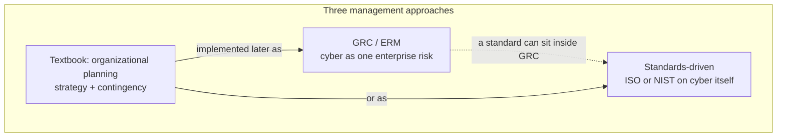

### Regulatory pressure is domain-specific

A major **Indian banking** cyber incident (about **2016**, debit cards vulnerable) led the **Reserve Bank of India** to make cybersecurity a **mandatory strategic initiative** for banks, **separate from IT management**. Chip-based cards were also mandated. Education, by contrast, may have **no mandate** for a CSO / CISO. How much you invest in compliance/cyber depends on regulation, global business, and partners who insist on frameworks.

### What “governance” means here

The word in GRC is **governance, not management**. Governance is a **higher-order** term. A governing body (board) **institutes** management structures and procedures and **monitors** them. The board selects the CEO. C-level executives then make the organization function toward strategic priorities.

**Linking cybersecurity to governance** means treating cybersecurity as **strategy**, with **highest organizational priority** — not an operational afterthought.

### Why GRC frameworks exist: scandals, SOX, IT as the control engine

1990s-era governance standards and the **Sarbanes–Oxley Act (SOX)** — an accounting standard in the United States — followed major **accounting scandals**. **Enron** is the example of a large firm bankrupted quickly by fraud when **no body was monitoring organizational health**. Absence of that “guardianship” is absence of governance.

After the scandals, jobs appeared around implementing **accounting and control standards**. IT became the system that could implement compliance at scale (you cannot manually monitor, check, and report). Information-systems communities built GRC-related standards.

### Three GRC frameworks: COBIT, COSO, COSO ERM

| Framework | Source community | Emphasis in this lecture |
|-----------|------------------|--------------------------|
| **COBIT** | **ISACA** (Information Systems Audit and Control Association) — IT / IS audit | IT-based control of the enterprise; cyber as part of assets managed **end to end** |
| **COSO** | **Committee of Sponsoring Organizations**; initiated by the **American Accounting Association (AAA)** | **Enterprise internal controls**; key word is **control**, not risk |
| **COSO ERM** | COSO expanded | **Enterprise risk management**; cyber is **one** enterprise risk |

ISACA is a global body with local chapters (Chennai is mentioned). COBIT is expanded here as **Control Objectives of Information Related Technology**. COBIT can cover cybersecurity **and** other risk/compliance. COSO is accounting-community, not IT-community.

**ERM** is the term large international organizations use. COSO ERM **adds elements** to original COSO so the loop closes: original COSO had **risk assessment**; ERM adds **risk response**. Two further additions named here: **objective setting** (objectives for the **entire organization**, not only risk management — are assets ready to support those objectives?) and **identification**. From accounting/internal controls, COSO grew into enterprise-wide risk management. This is a **risk-based** approach.

These three are **enterprise-level** GRC frameworks. Cyber is a **constituent**. They are not the same grain as ISO or NIST cybersecurity standards.

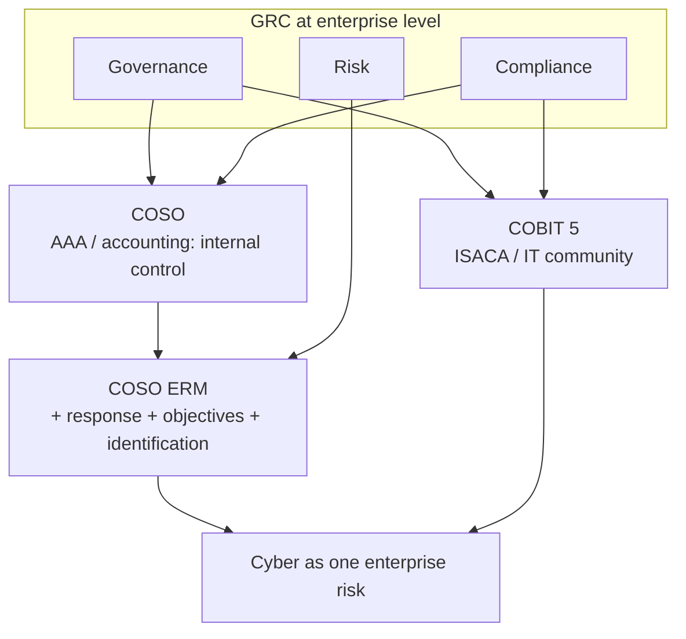

### What internal controls try to control

Processes (and process control) are put in place to:

- safeguard assets
- maintain sufficient records
- provide accurate and reliable information
- prepare financial reports according to established criteria
- promote and improve operational efficiency
- encourage adherence with management policies
- comply with laws and regulations

### Three aspects of internal control

Analogous to maintenance language (preventive / breakdown / corrective maintenance):

| Type | Role in this lecture |
|------|----------------------|
| **Preventive** | Deter problems from occurring; futuristic |
| **Detective** | Identify / detect, then “firefighting” |
| **Corrective** | After detection, course-correct |

Purpose in the accounting-control reading: no fraud, nothing that can lead the organization to bankruptcy. These are controls for **governance**.

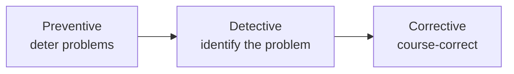

### COBIT 5 in this lecture

What is prevalent is **COBIT version 5**. Implementation is usually an **IT-organization project** because COBIT runs through information systems.

Principles named: **stakeholder needs**; **covering the enterprise end to end**; **applying a single integrated framework**; **enabling a holistic approach**. **End to end** is the point to keep: not cybersecurity alone, but the **health of the enterprise**, monitored and controlled through IT.

COBIT **separates governance and management**:

- **Governance is above management.** Governance puts management in place; it **directs, evaluates, and monitors**. A governance framework needs constant **feedback** from management systems and must be able to **inform** them.
- Management in COBIT runs on **four steps: Plan, Build, Run, Monitor**. Planning has a process set abbreviated **APO**; build, run, and monitor each have their own process sets. The lecture does not unpack the process catalogues.

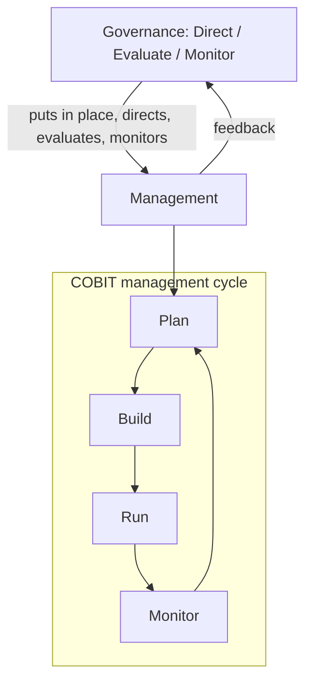

COBIT therefore **contains** cyber assets among the assets to be managed, inside a higher-level risk/health system.

### COSO → COSO ERM (closed loop)

COSO began as **internal controls**, then expanded to **COSO ERM**. Additions that close the loop:

- **Risk response** (not only assessment). Five options for responding to cyber risk are promised for the risk-management sessions; the textbook also covers them. After detailed risk assessment, some assets are more vulnerable; management must **prioritize** response.
- **Objective setting** at enterprise level: assets exist to reach organizational objectives; are they available/ready?
- **Identification** (the third added item named here).

## Cases and examples from the lecture

- **Marriott (Dec 2019):** ~500 million records; unauthorized access to hotel-chain private data (bookings, cards).
- **Air India / Amazon thought experiments:** saved cards and the fear that follows a breach.
- **Target:** on the same growth chart; smaller extent than Marriott as drawn here.
- **Enron / SOX:** governance failure → bankruptcy-scale scandal → accounting and IT control standards.
- **RBI after ~2016 debit-card incident:** cyber as **strategic**, separate from IT; chip cards; CISO-type structure mandated for banks, not necessarily for education.
- **ISACA Chennai chapter:** where to look for GRC/security training locally.
- **Five cyber-risk responses:** named as coming later, not taught in this hour.

## Key terms

| Term | Meaning in this lecture |
|------|-------------------------|
| GRC | Governance, Risk and Compliance — broad management/governance framework used in cybersecurity circles |
| ERM | Enterprise Risk Management — all organizational risk under one frame; cyber is one category |
| Governance | Higher body than management: institutes management, monitors organizational health, sets direction |
| Management | C-level and structures that make the organization function toward board-set strategy |
| COBIT | ISACA GRC standard; IT-based, enterprise end-to-end control (version 5 here) |
| COSO | Committee of Sponsoring Organizations; accounting-origin **internal control** framework |
| COSO ERM | COSO expanded with response, objective setting, identification — risk-based enterprise frame |
| Internal control | Processes that safeguard assets, records, reporting, efficiency, policy adherence, legal compliance |
| Preventive / detective / corrective | Three aspects of how internal controls work |
| APO | COBIT process set associated with **Plan** |
| SOX | Sarbanes–Oxley — US accounting standard after major scandals |

## Formulas / frameworks

- **Three management approaches:** GRC (cyber inside ERM) · standards-driven (ISO/NIST on cyber) · textbook organizational planning (strategy + contingency).
- **Three GRC frameworks:** COBIT · COSO · COSO ERM.
- **Internal control types:** preventive, detective, corrective.
- **COBIT 5 management cycle:** Plan → Build → Run → Monitor; governance Direct / Evaluate / Monitor above that.
- **COSO ERM additions:** risk **response**, **objective setting**, **identification**.

## Distinctions the instructor insists on

- This course is **management of cyber assets**, not a technology course; technology is a constituent.
- **Governance ≠ management.** Governance is the higher body that installs and monitors management. Saying “cyber governance” means cyber is **strategic**, top priority.
- **GRC ≠ ISO/NIST.** GRC frameworks (COBIT/COSO/ERM) are **enterprise-wide**; ISO/NIST (next lectures) are **cybersecurity-specific** standards. A standard can still be used *inside* GRC.
- **COBIT vs COSO:** IT/ISACA community vs accounting/AAA community. COSO’s keyword is **control**; COSO ERM’s move is **risk** (assessment **plus** response).
- **Cyber as standalone vs cyber as one ERM risk:** GRC does the latter; standards-driven and small-firm practice often do the former.
- **Training vs education:** ISO/COBIT market courses vs this academic organizational-planning path.

## Exam-oriented recap

- Wish for the best, prepare for the worst; Pasteur: fortune favors the prepared mind. Incidents (Marriott 500 million, Target, Air India) are growing.
- Three approaches: GRC/ERM, standards (ISO/NIST), textbook strategic + contingency planning.
- GRC frameworks: COBIT (ISACA, end-to-end IT control, Plan–Build–Run–Monitor), COSO (internal control), COSO ERM (adds response, objectives, identification).
- Internal controls: what they control (assets, records, reporting, efficiency, policy, law) and how (preventive / detective / corrective).
- RBI can force cyber as a C-level strategic function in banks; other sectors may have no such mandate.
- Risk in GRC is postponed: later sessions treat cyber-risk assessment and the **five** response options.

---

# Lecture T09: Security Management and GRC — Part 02

**Playlist index:** 09  
**Transcript:** [09-security-management-and-grc-part-02.md](../transcripts/markdown/09-security-management-and-grc-part-02.md)  
**Video:** https://www.youtube.com/watch?v=YE0PooziW-0  
**Week / theme:** Week 3 — GRC continued: ISO 27000, PDCA, NIST vs ISO; iPremier A teed up

## Learning objectives

- Know when **COSO / COSO ERM / COBIT** are the wrong grain (startup, mid-size) and when **cyber-specific standards** still matter.
- Trace **ISO 27000** from **BS 7799** through **ISO/IEC 17799:2005** to **ISO 27001** in **PDCA** form.
- Explain **Plan–Do–Check–Act** as ISO 27001’s improvement cycle (and relate it to COBIT’s Plan–Build–Run–Monitor).
- Contrast **ISO** (European, paid, not open) with **NIST** (US, open standards) as the instructor teaches the politics and the adoption puzzle.
- Recap the class reasons why the world is not “all NIST / all open source”: **service/support** and **reputation**.
- Know that **iPremier** (Harvard, versions A/B/C, 2018 update) is the day’s case; discussion of A continues in T10.

## What this lecture actually teaches

### GRC frameworks are for large organizations

The three GRC approaches named last time (COSO, COSO ERM, COBIT) are “fairly large and very detailed” — aimed at **large** organizations. A startup in IIT Madras Research Park **does not** need to think COSO ERM. Mid-size firms may not either. That does **not** mean they can ignore cybersecurity.

If the business is **e-commerce / online**, customers reach you online; ignoring security is “an issue.” You may skip big ERM audits (those are investments) while still having to **manage cyber assets**. For technology firms, the **major asset category is cyber** — including people. The MIS comparison used here: **Madras Cements vs Infosys** — manufacturing equipment vs cyber assets (and people). Strategy to safeguard assets therefore differs. That is why **standards specific to cyber assets** matter.

### ISO / IEC: standards built *for* cybersecurity management

ISO/IEC standards here are **specifically for cybersecurity management**.

Lineage as taught:

1. Started as **BS 7799** — a **British Standard** for cybersecurity management (not “ISO 1700”; the instructor corrects himself).
2. ISO adopted it. **ISO/IEC 17799:2005** has **133 possible controls** — “a large standard.”
3. Renamed as the **ISO 27000 series**, starting with **ISO 27001**, “the basic standard in the **PDCA** format.”

Whenever you hear **ISO 27000**, it means **ISO’s cybersecurity management standards**. The ISO site has **more than 50** standards in the family; each addresses a specific requirement (e.g. infrastructure management). Consultants will try to sell **many** of them. IIT **administration** (not academics) is cited as an ISO-certified organization.

**Example of specialization:** the **46th** standard mentioned is **ISO 27799** — information security management **in health**, using **ISO/IEC 27002** guides. **27002** is treated as a fundamental/control-guide standard, then customized for **verticals** (healthcare) and **horizontals** (infrastructure, network security). Which standard you adopt depends on the nature of IT use and the nature of the business.

### PDCA: Plan, Do, Check, Act

If you have worked in manufacturing, PDCA is familiar. It is the cycle ISO 27001 uses so cybersecurity systems stay **active and in the improvement cycle**:

1. **Plan** before you do.
2. **Do.**
3. **Check** whether what you did is correct.
4. **Act** on that check.

The instructor maps this to COBIT’s similar process set (Plan–Build–Run–Monitor from T08). PDCA is “very intuitive”: continual improvement wherever you have process and technology.

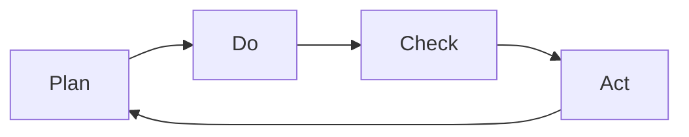

ISO 27001’s job, in this telling, is to keep cyber security systems **in that loop**, not as a one-time certificate on the wall.

### Standards politics: ISO vs NIST

Managers should not be naive: consulting firms will push ISO; **all of this is investment**; there is **competition among standards**.

- **ISO:** European origin. Criticized in the literature; **not the preferred** US cyber standard even though some US firms still go for ISO.
- **NIST:** **National Institute of Standards and Technology** — a **US** technology standards body (not only cyber). Intense work on cybersecurity; historically tied to **US military** and sensitive IT. Preferred US cyber standard in this lecture’s contrast.

**Open vs paid (the distinction the instructor stresses):**

| | ISO 27000-series | NIST |
|---|------------------|------|
| Access | **Not** open domain; you **pay**; even documentation of how the series is structured is not freely searchable | **Open standards** — downloadable |
| Example given | ISO 27001 series documentation | **NIST SP 800-12** (spoken as “SP 812”) *Computer Security Handbook* — go download it |
| Analogy | Proprietary software (Microsoft, Oracle, licenses → cloud) | Open source |

Having the PDF is not the same as **implementing** a standard; implementation still needs knowledge (and often consultants).

### Why isn’t the whole world NIST / open source?

The instructor poses the puzzle: if NIST is open and ISO is paid, why does ISO still prevail — as with open-source vs Microsoft/Oracle?

**Class answers he accepts:**

1. **Support / service.** “Something is available free but who will implement this and who will continue to support us?” Product vs **service**. Scholars argue you consume **service**, not product; the product exists to deliver services. A proprietor such as Microsoft sells OS **with both**. Open/free can fail on **fulfillment**. Premium/freemium (R / RStudio: basic free, applications paid) is noted as a platform tactic, but some software really has no commercial interest — the support gap still matters.

2. **Reputation.** ISO has market reputation; NIST is reputed as a **standard in abstract form**, but implementation needs **specific expertise**. Consultants cluster around the brand organizations already know.

Nobody in this (non-executive) class volunteers NIST or ISO 27001 implementation experience. NIST’s site is still something “all students should visit.” An assignment (platform logistics skipped here) will force use of NIST — e.g. **how to do contingency planning systematically**; a NIST standard already specifies it. You customize to context; you do not invent the framework from scratch.

### Purpose of the hour; iPremier teed up

Purpose: familiarize with **frameworks and standards at practice / industry level**. Then the first student group takes **iPremier** — a Harvard Business School case from the 2000s, updated around **2018**, versions **A, B, and C**. Today is **A** only. The instructor calls it “a detective story” and hands the next ~30 minutes to the group (the taught case content is T10).

## Cases and examples from the lecture

- **IIT Madras Research Park startup / mid-size firm:** skip COSO ERM; do not skip cyber if you are online.
- **Madras Cements vs Infosys:** plant equipment vs cyber assets (including people).
- **IIT administration ISO certification:** example that ISO is an organizational (admin) investment.
- **ISO 27799:** health ISMS using 27002.
- **R / RStudio freemium:** class analogy for “open but not entirely free.”
- **Microsoft / Oracle vs open-source databases:** world is a mix; proprietary often wins on service.
- **iPremier A/B/C (2018 HBS update):** case discussion starts; substance in T10.

## Key terms

| Term | Meaning in this lecture |
|------|-------------------------|
| BS 7799 | British Standard that originated ISO’s cybersecurity management line |
| ISO/IEC 17799:2005 | Large control catalogue (**133** possible controls) before the 27000 rename |
| ISO 27000 series | ISO family **for cybersecurity management** (>50 standards; verticals and horizontals) |
| ISO 27001 | Basic standard in the family; **PDCA** format; keep the ISMS in an improvement cycle |
| ISO 27002 | “Fundamental” / control-guide standard; 27799 uses it for health |
| ISO 27799 | Information security management **in health** |
| PDCA | Plan, Do, Check, Act — continual improvement cycle |
| NIST | US National Institute of Standards and Technology — open technology/cyber standards |
| Open standard | Freely accessible (NIST as taught here); opposite of paid ISO documents |
| iPremier | HBS e-commerce DDoS case, versions A/B/C |

## Formulas / frameworks

- **PDCA:** Plan → Do → Check → Act → (repeat). ISO 27001’s shape; cousin of COBIT Plan–Build–Run–Monitor.
- **ISO 27000 map (as taught):** BS 7799 → ISO/IEC 17799:2005 (133 controls) → 27000 series (27001 PDCA core; 27002 guides; 27799 health; plus infrastructure, network, etc.).
- **Adoption choice:** GRC/ERM if large; cyber-specific ISO or NIST if the asset base is cyber / the firm is smaller; both can coexist.

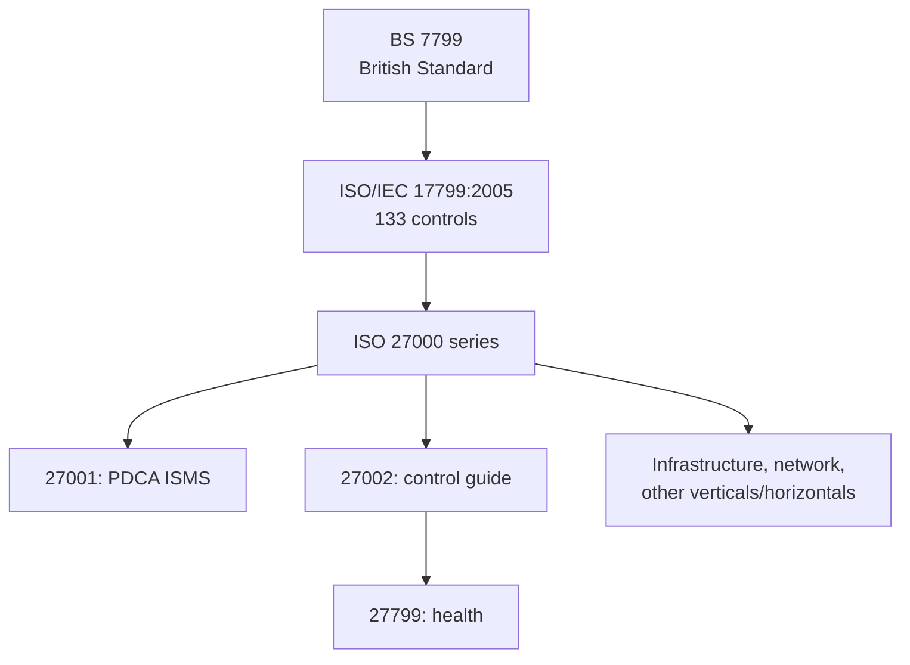

## Distinctions the instructor insists on

- **COSO ERM / COBIT vs ISO/NIST:** enterprise GRC vs **cyber-specific** standards. Small/online firms may skip ERM; they may not skip ISO/NIST-type practice.
- **ISO vs NIST:** European vs US; **paid/closed vs open**. Preference follows regional politics and military/sensitive-use history, not only technical merit.
- **Having a standard ≠ implementing it.** Open documents still need expertise; free software still needs **service**.
- **Product vs service:** you consume service; that is why proprietary stacks persist.
- **This hour is industry familiarization**, not a full ISO/NIST implementation course. Contingency-planning *procedure* is deferred to NIST + later lectures.

## Exam-oriented recap

- Large-firm GRC is optional for a startup; **cyber-asset standards are not optional** if you are online / IT-heavy.
- ISO 27000 = ISO’s cyber management family, from **BS 7799**, through **17799:2005 (133 controls)**, to **27001 (PDCA)**.
- PDCA keeps the security system in a live improvement cycle.
- NIST standards are **open** (e.g. computer security handbook); ISO’s 27000 documents are **not**. Class reasons ISO still wins: **support** and **reputation**.
- iPremier A is the case vehicle for “what happens when an e-commerce firm has no working GRC/standard/contingency practice.”

---

# Lecture T10: Security Management and GRC — Part 03

**Playlist index:** 10  
**Transcript:** [10-security-management-and-grc-part-03.md](../transcripts/markdown/10-security-management-and-grc-part-03.md)  
**Video:** https://www.youtube.com/watch?v=1sN6NtaRoHE  
**Week / theme:** Week 3 — iPremier Company (A): DDoS, missing GRC, the shut-down dilemma

## Learning objectives

- Reconstruct the **iPremier** A narrative: who is who, 04:30 timeline, Qdata, missing IR/DR/BCP.
- Define **DoS vs DDoS**, botnets / zombie networks, and the **SYN flood** as used in the case.
- Separate **technical** failures from **managerial** failures (stock-option culture, no cyber strategy, no standards).
- State the **four stakeholder pressures** on CIO Bob Turley and why the instructor treats “resume as usual” as the riskier path.
- Carry the teaching verdict: an e-commerce firm that ignores GRC/ISO-type frameworks and **contingency planning** can go out of business; PR and time-to-restore are part of the decision, not extras.

## What this lecture actually teaches

This hour is the **student-led iPremier A** discussion the previous lecture announced. The instructor’s teaching sits in the interventions: this is **not** “just a failed hack”; DDoS **did** happen; shutting down vs staying up is a **business survival** tension; sequels B and C are promised (T12).

### The firm

**iPremier** sells **luxury, rare, and vintage goods** online (hundreds to tens of thousands of dollars). Clientele is **high-end**; **trust** in product and service is existential. By **2017**, **>1 million** regular customers in the database. It is one of the **top two** sites in the niche; rival is **Market Top**. Competitive edge claimed: **user experience** (site, after-sales, seamless purchase) more than the objects themselves.

Culture: younger long-term staff plus experienced lateral hires; **above-average pay**, much of it **stock options**, **performance-linked**; intense atmosphere, **quarterly reviews**, unsuccessful managers **removed**.

### Characters (as the group uses them)

| Person | Role in the case |
|--------|------------------|
| **Bob Turley** | Newly joined **CIO**; CEO has sent him to New York on a high-profile assignment; feels he has the CEO’s confidence |
| **Jack Samuelson** | **CEO** — later: get us **back and running**; PR is not Bob’s job |
| **Tim Mandel** | **CTO**, co-founder; Bob has a good working relationship |
| **Warren Spangler** | **VP Business Development** — stock/PR; later linked to **cashing stock options** |
| **Peter Stewart** | **Legal counsel** — cut the connection; protect personal information |
| **Joanne Ripley** | **Operations team leader** (cyber operations) |
| **Leon Ledbetter** | Operations team; makes the 04:30 call |

### Timeline of the night (Part A)

```mermaid
sequenceDiagram
  participant Leon
  participant Bob as Bob CIO
  participant Joanne
  participant Warren as Warren VP
  participant Tim as Tim CTO
  participant Peter as Legal
  participant Jack as CEO
  Note over Leon,Bob: ~04:30
  Leon->>Bob: Site unreachable; emails saying Ha Ha Ha
  Bob->>Joanne: What is going on?
  Joanne-->>Bob: Not a simple DDoS
  Warren->>Bob: Stock will take a hit; I will handle PR
  Bob->>Joanne: Emergency procedure? IR team? Crisis process?
  Joanne-->>Bob: We have a BCP; not updated; IR never practiced
  Joanne-->>Bob: Going to Qdata to access the web server
  Bob->>Tim: Cut connections?
  Tim-->>Bob: Would not recommend; may need evidence; logs unlikely anyway
  Peter->>Bob: Cut the connection; customer PII at risk
  Joanne->>Bob: Not let into the building; escalate; attack on firewall
  Jack->>Bob: Focus on getting us back running
  Joanne->>Bob: SYN flood from multiple sites on firewall router
  Note over Joanne,Bob: ~05:26 attack stops by itself
  Joanne->>Bob: I did not do anything; site is up; I recommend shut down and search
```

Key operational facts taught in the storyboard:

- **Qdata** hosts the site: long-time provider, **not** seen as competent; chosen for **proximity to the office** (and, later, a founder’s **personal relation**).
- **BCP binder** exists but is **not updated**; **incident response has not been practiced**. Bob expected an updated disaster-response **and** IR plan; he also admits this was **his** CIO responsibility.
- **Detailed logging** had been **removed** to improve customer experience by **~20%** (logging delayed interactions). Evidence/logs are therefore unlikely.
- Joanne is **refused entry** to the Qdata building during the incident.
- Diagnosis: **DDoS**, **SYN flood from multiple sites** directed at the **router that runs the firewall**. Joanne: you cannot cut inbound traffic while they are “spawning the zombies.” **DDoS and intrusion are not mutually exclusive** — customer data **may** still be stealing.
- The attack **stops by itself** (~05:26). Site looks fine. Joanne still recommends **shut down and investigate**.

### Four pressures on Bob (decision frame)

| Voice | Ask |
|-------|-----|
| **CEO (Jack)** | Get business **back up**; also wants customer data protected and no legal backlash |
| **Ops (Joanne)** | **Shut down**; bring expert consultants; hunt ticking bombs / unknown breaches |
| **Biz-dev (Warren)** | Personal motive: **stock options** — keep the site up so price does not crater |
| **Legal (Peter)** | **Cut the connection**; protect PII; avoid legal consequences |

### What DDoS is, in this classroom

**DoS (denial of service):** overwhelm an internet-connected asset so it is **unavailable to the legitimate user**. Analogy: Mumbai local train doors so crowded the person who needs to alight cannot get off.

**DoS vs DDoS:**

| | DoS | DDoS |
|---|-----|------|
| Sources | **Single** source device, fake traffic | **Multiple** systems, real-time traffic |
| Scale | Smaller | Higher-level DoS |
| Attacker ID | Relatively easier | Harder |

**How DDoS is described here:** attacker infects devices with malware (e.g. via phishing mails/messages). Infected machines = **botnets**; the network of botnets = **zombie network**. The attacker uses that network to **flood** the target and crash or disconnect it.

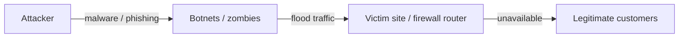

**Motives listed:** hacktivism, cyber vandalism, cyber warfare, **extortion**, **rivalry** (Market Top is in the room). Motive in the case is **unknown**.

### What went wrong (technical and managerial)

The group and class, “in the light of today’s class”:

**Technical**

- Whole technical management parked at **Qdata**, which does not invest in advanced technology.
- Founder **personal relation** with Qdata blocked switching.
- **No detailed logs** — cannot investigate or identify the attacker later.
- **Outdated firewall**; service lacks capacity; no DDoS-protection products in use.
- No simulation / routine checks of security infrastructure.

**Managerial**

- Intense culture; senior pay in **stock options** → focus on **stock price**, sales, and **site always up**, not on consolidating the customer base or cyber risk.
- **BCP outdated**; **no DRP**; **no IRP**; no practiced emergency plan; **no PR strategy** for an attack.
- No security/risk expert; **cybersecurity was not a strategy**.
- As an e-commerce leader they should have followed **some GRC/ISO-type framework**; they did not; they had **no working contingency plan**.
- Bob had not acted on the CEO’s earlier warning about **operating-procedures deficit**.

Classroom correction: this is **not** “a failed attack.” It **is** a DDoS. Whether the **website was “hacked” / data stolen** is **unknown** — that uncertainty is the problem.

**Verdict the presenters tie to the GRC lecture:** iPremier did not treat cybersecurity as strategy; profits/stocks drove them; they lacked a framework. The (bitter) “thanks” is that the attack may **force** cyber onto the strategy agenda.

### Immediate decision the class is asked to take

Attack has **stopped**; site is up. **Resume as usual** vs **shut down**, collect data, forensic audit, find vulnerabilities.

Class / team recommendation taught in the hour:

1. **Shut down** servers; short- and long-term **forensic audit**; understand the attack; close holes before the next one.
2. **PR:** **disclose** (press statement or tweet). Hiding fails governance/ethics and **trust**; if a customer later sues and you hid the fact, damage is worse. Analogies: LinkedIn, Gmail — admit. Suggested wording evolves under instructor pressure (see distinctions).

**Long-term alternatives** (team, descending preference):

| Option | Pros they name | Cons they name |
|--------|----------------|----------------|
| **Replace Qdata** with a major host | State of the art, patches, public trust after the attack | Start from scratch, money, migration time, switching cost, founder’s personal commitment |
| **Insource** internal IT / security | Full control, faster future response, cheaper **in the long run** (not short run) | Hire/build cost and time; outcome not guaranteed as attacks evolve |
| **Stay with Qdata**, recreate architecture | Avoid switching cost, faster “normalcy,” keep the relationship | Qdata already weak; they may not accept new terms; still slow |

### Instructor pushback (the teaching that is not in the slide deck)

- **Shut down and forensics** can be technically right and **still kill the business.** Market Top is waiting; high-end customers who feel data are unsafe **will not come back**. A long IT-maintenance window may be **closing the firm**.
- Students answer: resuming blind is also death; “Ha Ha Ha” mail shows a **targeted** attack; ~75% sure data stolen or bots left behind. Instructor: if you **hide** and the attacker (maybe the competitor) **reveals** later, **high-end trust loss is worse**.
- **Job security / blame:** this firm fires easily; people protect roles. Bob’s private line: “I have been here **three months**.” CEO, on the call, is professional: **get the business running** — no reprimand. Joanne, long-tenured, says the **firewall is so bad** it should have been fixed. Blame is **partially on every senior manager** (binder, firewall, Qdata contract). Cyber as **strategic priority** is a **CEO-level** decision.
- **PR is the critical statement**, not an afterthought. “We shut down because we are under cyber attack” may not work. Team’s later wording: unusual/irregular traffic, shutting down to check vulnerabilities; or “suspicious irregularities” — “play with the words.” Forensic reports at big firms can take **months or years** (LinkedIn **three years** later). Short shutdown of **a few business days** vs that long tail.
- **The core tension:** any option that leads to **bankruptcy** is not “correct for business” even if it is technically correct. Choose among **risky** options. **Business as usual** is **more risky** if you do **not** know why the attack happened.
- Strongest instructor rationale for stopping anyway: they were **at the mercy of the attackers**. The attackers **just stopped**. No diagnosis, no corrective/preventive action. If they run tomorrow, **it can happen the same way**. So they **must** find out.

### Other classroom challenges

- **Most customers never knew** (04:00–05:00, non-business hours). Is a PR announcement that hits the **stock** justified? Counter: if you call it “server maintenance” and later a stolen-data claim appears, PR still owns the lie.
- **CEO’s first question: shut down for how long?** Students say days to weeks depending on scale; they **do not know** the scale. Instructor: **“you want to shut down for how long?”** — uncertainty is **not acceptable** to a CEO, and that is the **real-life dilemma**.
- Wishful “they should have had a **hot / warm / cold site**” is true **and useless tonight**: they had **no cyber strategy**. The case is an **eye-opener**: unprepared + online → you **can go out of business**.

B and C are deferred to a later class (T12).

## Cases and examples from the lecture

- **iPremier A** (full narrative above).
- **Mumbai local** crowding = DoS analogy.
- **LinkedIn / Gmail / Google / YouTube / Amazon:** public admission patterns; LinkedIn’s delayed full report (~three years).
- **Hot / warm / cold site:** named as what a prepared firm would have had; iPremier did not.

## Key terms

| Term | Meaning in this lecture |
|------|-------------------------|
| DDoS | Distributed denial of service — many systems flood a target so legitimate users cannot use it |
| DoS | Same aim, **single** source, smaller scale, easier to attribute |
| Botnet / zombie network | Malware-controlled machines the attacker uses to generate flood traffic |
| SYN flood | The DDoS form identified on iPremier’s **firewall router**, from multiple sites |
| Qdata | Third-party host; proximity (and personal ties) over competence |
| BCP binder | Business continuity document they **have** but have **not updated or practiced** |
| Market Top | Main competitor; switching risk if iPremier goes dark |
| Catch-22 of the night | Diagnose (needs shutdown) vs survive in a niche online market (needs uptime) |

## Formulas / frameworks

- **GRC lesson applied:** e-commerce at this scale should have had a **framework or ISO-type standard** plus **IRP/DRP/BCP**. None were live.
- **Decision frame:** four voices (CEO, ops, stock/PR, legal) → one CIO call.
- **DoS ⊂ DDoS** as taught: DDoS is the distributed, multi-source form of DoS.

## Distinctions the instructor insists on

- This **was** a DDoS, not a “failed attempt.” Unknown = whether **intrusion / data theft** rode along (DDoS ⇏ “no intrusion”).
- **Technical right ≠ business right.** A long shutdown can **end the firm** in a two-player luxury e-commerce market.
- **Hiding vs disclosing:** later revelation (especially if the rival is the attacker) destroys **high-end trust** more than an honest hit now — but the **wording and duration** of any shutdown statement are the live problem.
- They were **at the attackers’ mercy**; the attack **self-stopped**. Without diagnosis you cannot claim corrective/preventive action, so **resume as usual is the more dangerous** operational choice.
- **“How long?”** is the CEO question; “we don’t know” is true and **unacceptable**. That is the case’s dilemma, not a student failure.
- Preparedness fantasies (hot site, updated binder) are **not available options** at 05:26 if you never invested. The case shows what **lack of GRC + contingency** does to an online business.

## Exam-oriented recap

- iPremier: luxury e-commerce, trust-critical, stock-option culture, Qdata, logging traded for 20% UX, BCP stale, no IR practice, Joanne locked out, SYN-flood DDoS, attack stops itself.
- DoS vs DDoS; botnets/zombies; motives include rivalry and extortion.
- Failures: technical (Qdata, firewall, logs) **and** managerial (no cyber strategy, no framework, stock over risk).
- Bob must reconcile CEO uptime, ops shutdown, legal disconnect, and VP stock.
- Instructor: find out why it stopped; PR is part of the decision; B/C will show what happens if you do not shut down.

---

# Lecture T11: Contingency Planning — Part 01

**Playlist index:** 11  
**Transcript:** [11-contingency-planning-part-01.md](../transcripts/markdown/11-contingency-planning-part-01.md)  
**Video:** https://www.youtube.com/watch?v=j0QxAhDh48E  
**Week / theme:** Week 4 — Contingency planning foundations (reactive path); IRP / DRP / BCP by impact

## Learning objectives

- Split cybersecurity planning into **organizational (preventive)** vs **contingency (reactive)** — different objectives.
- Use **iPremier** (and **IVK**, **Target**, **Saudi drone**) to show what “no plan” does to people and to **ROI arguments** for security spend.
- Align security plans with **strategic / tactical / operational** business plans (and correct the textbook’s order).
- Classify incidents by **impact** into **IRP**, **DRP**, and **BCP**, including the site-shift rule for BCP.
- Trace the instructor’s incident picture: **assets → vulnerabilities → exploit → incident → impact → contingency action**.

## What this lecture actually teaches

### Two planning paths

The course is still building **foundations of cybersecurity management**. Planning as a whole comes first; **contingency planning** is today’s specific topic. **Risk-management planning** is another session.

| Path | Objective | Stance toward the incident |
|------|-----------|----------------------------|
| Organizational / risk-side planning | **Incident should not happen** — protect | **Preventive** |
| Contingency planning | Incident **has happened** — then what? | **Reactive** |

Wish and plan so things do **not** go wrong; **despite that**, they can. Contingency is the **course you take then**.

### Why iPremier is the opening exhibit

Last session’s company was ambitious, professionally managed, and still took a **huge shock** at **~04:30**. A **drone attack on a Saudi refinery** is placed at almost the same clock time (~04:15–04:30). In India that window is called **Saraswati Yamam**: sleep for most of the world, high mental productivity for some, and the hour **hackers choose** to shock organizations.

iPremier had **no plan**. Nobody knew what to do; people asked each other, suggested at random, and **protected their own jobs/roles**. Contingency planning exists to answer **what to do if things go wrong**.

It can happen **anyway**: **Target** invested a lot and was still breached; iPremier did not care and it happened. There must be a **clear plan**, like a **fire drill**: fake incidents, protocols, restore **normalcy**.

**Gilbert** (cartoon) on no plan: you **yell**; theory calls it **emotion-focused coping**. The mind has no clarity, so it goes emotional: call for help, yell, run away, wish nothing is wrong. Managers must not live there.

Two manager duties named:

1. **Protect the assets** of the organization.
2. If an incident happens, **bring operations back to normalcy at the earliest**.

### IVK: why finance rejects security projects

A Harvard case, **IVK** (iPremier-like, established firm, IT department). A newly joined **IT director** wants more cyber investment, specifically an **Intrusion Detection System (IDS)**.

Links the instructor draws:

- iPremier: incident happened; they **do not know** if there was intrusion — **no IDS**.
- Target: there **was** an IDS; it was **turned off**.
- IVK: **no IDS at all**; director proposes one as a **capital-budget** project.

Capital projects go to a **steering committee** that **evaluates and prioritizes** across functions. IVK’s IDS proposal was **dropped two years running**. The **finance / CFO** question: **what is the ROI?** Invest 100 rupees, see 150–200 back in 3–5 years. **Does a security system return money? Then why invest?**

Class attempts the instructor accepts as **directionally right** but incomplete:

- Return is **not a dated cash inflow**; it is intrusion detected, data (cards, bank info) not lost, legal cost avoided, patents not stolen.
- Two scenarios: **no investment** → negative sales + legal; **with investment** → those costs lower — a **less negative** outcome than doing nothing.
- Estimate incidents, time-to-fix, cost-to-fix; peer probability of attack; **revenue lost while the site is down**.

**Teaching point:** you are **not generating revenue** with an IDS; you are **minimizing cost**. Finance still wants **numbers**. Qualitative “goodwill” does not sell. **Consultants** sample data to produce potential-cost figures. The reduction in cost if you invest must be **much higher than the investment**. The IVK director went wrong by getting **disappointed** after qualitative arguments; finance needs **quantitative rationale**.

Further class point: it is not one-shot; it is **dynamic cost** (constant upgrades). As the environment gets more fluid, assessment gets harder. **How much to invest** belongs to **risk management**: spend **proportional to risk**; **exact** risk assessment is “the highest challenge.”

**Cyber insurance** in India is still emerging and **hard to obtain** because of that assessment difficulty (a student’s project is mentioned). Theoretically you quantify; accurately you often cannot. **Doing nothing is not an option**; you need **reasonable safeguards** and **senior-management education**: security **saves cost**, it does **not** create a new revenue stream or “attract more customers.”

Both iPremier and IVK: cyber was **low priority**. IVK: IT could not **articulate savings**; seniors **did not understand** the challenge. Technical people **know** what can go wrong and get disappointed; non-IT managers may not appreciate it (another Gilbert beat).

### What planning is, in this course

A manager **manages resources**. **Proper planning** is fundamental. In cyber, planning must **align with organizational goals**. iPremier wants market success; it also needs cyber to **protect cyber assets so it can attain those goals**. Purpose of cyber planning: **enable the organization to achieve business goals**.

Benefits named from theory: reduce losses, optimize resources, **coordinate** (which needs **structures**).

Quotes/stories:

- **Benjamin Franklin** (class guessed “Franklin Turbolton”): **“If you fail to plan, you are planning to fail.”** (Same Franklin as “time is money.”)
- **JFK, 1961**, university speech: before the 1960s end, America should send a person to the moon **and get him back safely** — not plant a flag and not care. Security/safety is **embedded in the mission**. Realized **July 1969**. Planning at a high level means **security inside the goal**, not bolted on.

### Two types of information-security planning

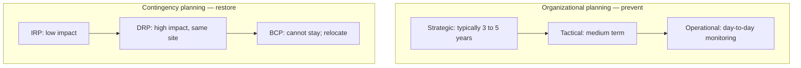

**Organizational planning** (right side of the slide): operational, tactical, **strategic**. The **textbook order is wrong**; the instructor copied it but corrects: by time range it should be **strategic → tactical → operational**. There should be cyber plans **alongside** each: long-term (3–5 years), medium, and day-to-day. This is where you plan to **protect and prevent** — safeguard against potential incidents. Risk to assets is handled on this path.

**Contingency planning** (left side): different objective. **Restore systems / operations to normalcy in the minimum time.** It **assumes an incident has happened** and asks how to restore with **minimum impact**.

### Three types of contingency planning — classified by **impact**

Short names: **IRP**, **DRP**, **BCP**. (iPremier: “we have a BCP binder but we do not know where it is.”)

**The basis for choosing IRP vs DRP vs BCP is impact.**

| Type | Impact | What it looks like in this lecture |
|------|--------|-------------------------------------|
| **Incident response planning (IRP)** | **Low** | e.g. a potential virus on **one PC**; technical team alerted; **operations still going** |
| **Disaster recovery planning (DRP)** | **Higher** | Some operations **shut** (e.g. e-commerce not running; transactions hit) but you **need not shift site**; restore to normal **after some time** at the **same place** |
| **Business continuity planning (BCP)** | **Highest** | You **cannot continue at this site**. Organization-level, leadership-level move. **Chennai floods:** every IT company **moving out of Chennai**. Could be technology or other reasons. **BCP = shift location.** |

BCP is called a **generic** term for “organization has to shift its location.” Disaster is high severity **without** moving out. Incident is minor; operations continue.

Management must **determine impact, classify, then follow the matching playbook immediately**. iPremier should have had a **basis** to decide incident vs disaster vs BCP at 04:30.

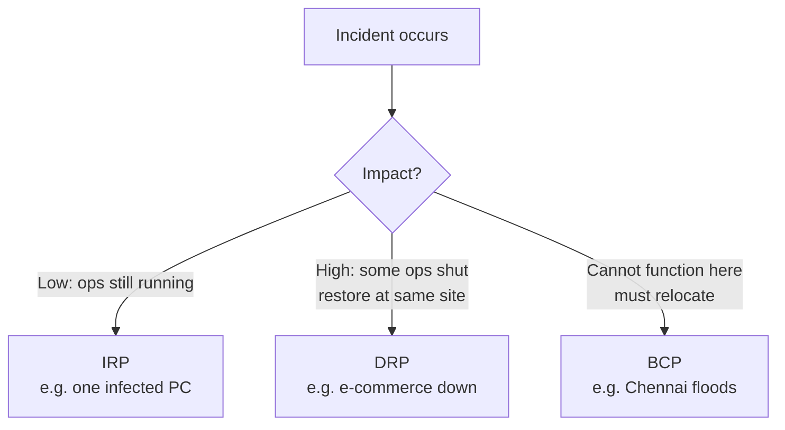

### The instructor’s incident diagram (not from the textbook)

What is an **incident**? An **attack that really happened**.

Why do they happen? Through **vulnerabilities**.

Picture:

- Organization has **assets** (data center, even **people**) — what the negative world **targets**.
- Hackers look for **gaps** in the firewall / walls around the data center (physical or virtual). Those gaps = **vulnerabilities**.
- A hacker uses an **exploit** on a particular gap and **intrudes**.
- Once intrusion happens, it is an **incident**.
- Incidents come in **low / medium / high** impact (damage).
- **Action** follows impact. That action is **contingency planning**.

**Shoe / banana peel:** knurls on the sole (protection / grip). Even with precautions, a peel **plus rain** may still drop you. Protection exists; **vulnerabilities remain**; exploits create incidents; then you **respond**. Contingency **deals with incidents**.

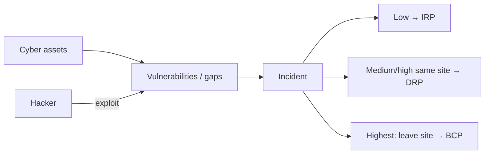

## Cases and examples from the lecture

- **iPremier A:** 04:30 shock, no plan, job-protection behaviour.
- **Saudi refinery drone:** same pre-dawn window.
- **Target:** heavy investment, still breached; IDS present but **off**.
- **IVK:** IDS capital proposal killed two years; ROI vs cost-avoidance.
- **Chennai floods:** BCP as industry-wide **relocation**.
- **Fire drills:** model for rehearsed contingency.
- **Moon mission (JFK 1961 / July 1969):** safety written into the goal.
- **Gilbert** cartoons: emotion-focused coping; technical people who know and cannot get budget.

## Key terms

| Term | Meaning in this lecture |
|------|-------------------------|
| Contingency planning | Reactive: restore to normal **in minimum time** after an incident |
| Organizational planning | Preventive: strategic / tactical / operational plans that **protect** |
| IRP | Incident response plan — **low** impact; operations continue |
| DRP | Disaster recovery plan — **high** impact; restore **without** changing site |
| BCP | Business continuity plan — impact so high you **relocate** |
| IDS | Intrusion detection system — capital item finance wants ROI for |
| Vulnerability | Gap in walls/firewalls that can be exploited |
| Exploit | How a hacker uses a particular gap |
| Incident | Attack that **actually happened** (after intrusion) |
| Emotion-focused coping | Yelling / fleeing / wishing when there is no plan (Gilbert) |

## Formulas / frameworks

- **Preventive vs reactive** planning split.
- **Strategic (3–5 yr) → tactical → operational** (textbook order corrected).
- **Impact → IRP / DRP / BCP.**
- **Investment rationale for controls:** not new revenue; **cost avoided >> spend**. Quantify legal, sales hit, downtime, recovery. Dynamic, not one-time. Proportional to risk (later module).
- **Incident chain:** assets → vulnerabilities → exploit → incident → impact class → plan type.

## Distinctions the instructor insists on

- **Contingency ≠ risk-management planning.** One is **after** the incident (restore); the other is **so the incident does not happen** (protect). Both are required.
- **IRP ≠ DRP ≠ BCP.** Same family, **different impact**. BCP is the one that **moves the organization off site**. DRP is severe but **same location**.
- **Textbook’s planning-level order is wrong**; use time range: strategic, then tactical, then operational.
- Security spend is **cost reduction**, not a new revenue stream. Finance will not buy qualitative fear; IVK shows the **articulation** failure.
- **Doing nothing is not an option** even when numbers are soft (no mature cyber insurance).
- Protection (shoe knurls) does **not** mean zero incidents. Contingency exists **because** residual gaps remain.

## Exam-oriented recap

- Contingency = reactive restore-at-earliest; organizational planning = preventive, aligned to business goals (Franklin; JFK “and back safely”).
- No plan → emotion, blame, job-protection (iPremier, Gilbert).
- IVK: IDS has no classic ROI; quantify **avoided cost**; seniors must learn that.
- IRP / DRP / BCP chosen by **impact**; BCP = cannot operate here (Chennai floods).
- Incident = exploit of a vulnerability against an asset; then classify low/medium/high and act.

---

# Lecture T13: Contingency Planning — Part 02

**Playlist index:** 13  
**Transcript:** [13-contingency-planning-part-02.md](../transcripts/markdown/13-contingency-planning-part-02.md)  
**Video:** https://www.youtube.com/watch?v=bpxDDAT7yE0  
**Week / theme:** Week 4 — CISO and structures; CPMT; BIA clocks; downtime vs restoration cost; IR → DR → BCP switch

## Learning objectives

- Put a **CISO** (and RBI’s separate security role) on the organizational-planning side, then switch to contingency.
- State the **goal of contingency planning** and the job of the **CPMT**.
- Run **business impact analysis (BIA)** on **business processes** (not assets), using **MTD, RTO, WRT, RPO**.
- Use the **cost-of-disruption vs cost-of-recovery** graph; name the intersection as the management negotiation for time.
- Switch **IRP → DRP → BCP** by impact and by **who leads**; keep **DR = same/primary site**, **BCP = change site**.
- Know IR **before / during / after**, Pipkin’s indicators, **GDPR 72-hour** reporting, **hot/warm/cold** (and time-shared) sites, and **red/blue/purple** tests.

## What this lecture actually teaches

### Organizational planning side (brief, then stop)

Senior management / the board write **values** (what you will stick to), **vision** (where you will reach), **mission** (what you will do that aligns with vision). **Strategic planning is top-down** (with bottom inputs). Cybersecurity management planning must run **alongside** those priorities.

Treat cybersecurity as a **sub-organization** with its own structure. Role on the slide: **CISO** — a C-level security officer **in addition to IT**. CISO **reports to the CIO**. CIO understands business, technology, **and** cyber and **builds policies**. (**Next class = cybersecurity policy.**) Policy is **initiated by the CISO** from strategic priorities. Drafting, operationalizing, structuring, and sustaining that needs a **top cyber role**, especially when the firm is large, cyber assets are large, and the business **runs on IT**.

**India / RBI:** every banking institution must have a **top security role** (CISO, director of security, or similar) **in addition to a CIO**.

**CISO job description** (the title does not even contain “cyber”; CI = information): create the **strategic information security plan / policy**; plans in accordance with policy; **budgets**; tactical and operational plans; **monitor**; **comply with law**. After an incident, CISO is critical for **what to do** and **what to communicate to the public**.

Today’s case organization (iPremier sequels) **did not have a CISO**; after a major incident they discover they lack structures, policy, and contingency planning.

Organizational planning + structures resume in **risk management**. The lecture now **switches** to contingency.

### Goal of contingency planning; CPMT

A **contingency** is an unpredicted, unaccounted-for incident — **despite** preparation, things go wrong. (Accounting analogy: a contingencies head for things not planned that still happen.)

**Main goal (slide wording to keep):** **restoration to normal modes of operation with minimum cost.**

The team that owns this in large organizations is the **CPMT — Contingency Plan Management Team** (spoken as Contingency Plan Management Committee). It is an **oversight** team for the contingency-planning process; it institutes **subcommittees** for activities. Higher-level team **for contingency planning alone**.

Contingency planning **classifies incidents into IR / DR / BCP** (by impact, in **money** as far as possible). CPMT **monitors** that.

### BIA: the block the textbook diagram hides

**Business Impact Analysis (BIA)** is assumed **inside** contingency planning, so some textbook diagrams omit it. The instructor insists it is **the most important assessment CPMT initiates**.

BIA looks at **severity of attacks** and, if they happen, **impact on business processes**.

| Planning path | Unit of analysis |
|---------------|------------------|
| **Risk management** (protective, later) | **Assets** — if this asset is attacked, what impact? |
| **Contingency / BIA** | **Business processes** — e.g. if **order fulfillment** is hacked or stalled, what is the loss? |

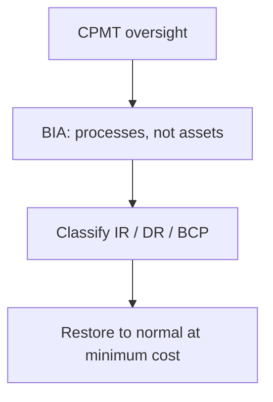

### Four time parameters in BIA

Contingency looks at processes, then impact **in time**. **Time is money**: downtime of a process → financial impact.

| Clock | Meaning in this lecture |
|-------|-------------------------|
| **MTD** — Maximum Tolerable Downtime | **Process owner’s** (not the technical operator’s) tolerance: how long can this process be down **without substantial business impact**? Ideal answer is **zero** (customers switch). Zero cannot be the working number; there is a **cost of downtime** and a **cost of recovery**. MTD is a **reference** the process will **accept**. |
| **RTO** — Recovery Time Objective | Time to bring the **system live** — server/application **functional** again. Worked by the **technical / BIA team** inside the MTD budget. |
| **WRT** — Work Recovery Time | System ready **≠** operations ready. People sign in, checks, formalities — **operations restore**. |
| **RPO** — Recovery Point Objective | Point in time the system can **go back to**. **Purely backup policy.** Hourly backup → at most ~1 hour of data lost (RPO ≈ 1 hour). Daily backup → less privilege. Set from **criticality**. |

**Identity taught as a formula:** **MTD = RTO + WRT**.

RTO: system goes live. Then WRT: it becomes **operational**. Together they must fit the process owner’s MTD. **RPO** sits on the backup axis, not as a summand of MTD.

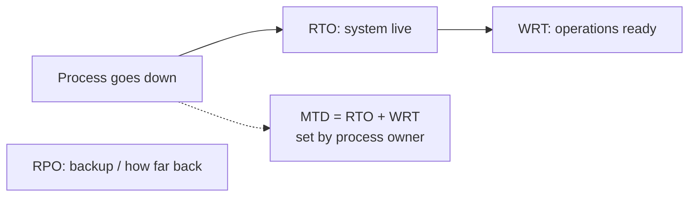

**Worked illustration:** process owner is pressed off **zero**; **72 hours** MTD (losses exist but this is maximum tolerable). **RTO = 36 hours** (must be **less than** MTD because WRT also consumes the budget); remaining half for work recovery. Repeat **for each** automated business process (processes are what applications automate; invoicing down → business impact).

**FIPS 199** appears on the same illustration: severity in **confidentiality, integrity, availability** as **low / medium / high** — also used in the course’s incident-analysis assignment.

BIA’s job if clocks **do not exist**: **set them** — MTD, then rational RTO and WRT, and an RPO/backup policy.

### Cost balancing: disruption vs recovery

Downtime is a cost. **Recovery is also a cost**, and it is a **function of time**. If MTD = 1 hour, recovery cost can be **very high**: **hot site** or **warm site** always ready — **redundancy**. Redundancy is how you buy availability.

**X-axis:** length of disruption. **Y-axis:** cost.

- Short disruption (left): disruption cost **low**, but **recovery cost high** (parallel systems, instant switch).
- Long disruption (right): recovery investment **low**, disruption cost **high**.
- Process owner may demand the far left; someone must show the graph: is the **organization willing to invest** that much?

**Optimum = intersection of the two curves.**

**Contingency planning is a negotiation for time.** Objective is restore **at the earliest**; “earliest” is a **management** number that depends on **cost of recovery vs cost of disruption** and **willingness to invest in redundancy**. You cannot do CP without management.

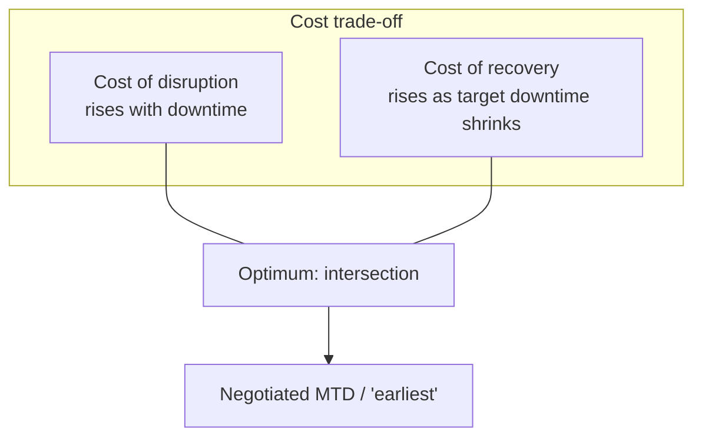

### Switching IRP → DRP → BCP

Impact on **business processes** triggers the plan. Terminology is “not well done”: incident and disaster **name the event**; BCP **names a process**. You can call BCP a **total / highest disaster**. **Disaster recovery restoration is at the primary / same site** — you do **not** switch site.

| Plan | Impact | Typical lead (as taught) |
|------|--------|---------------------------|
| **IRP** | Low; “small incident” | Technical |
| **DRP** | Major incident; restore to normalcy in hours **without** leaving | **CIO** |
| **BCP** | **Cannot continue in the same location**; moving | **CEO** |

Rest of IR/DR/BCP before–during–after checklists is “descriptive,” “self-explanatory,” textbook slides. Still taught:

**IRP** is the **plan** for how you respond; response is **reactive**. Three phases: **before**, **during**, **after**. After: **structured documentation** of every incident. During: if the event requires **shifting site**, **BCP binder** applies (who to contact, etc.). Plan must **exist before** you need it.

**Detection:** IDS must be **active**; **active logs** and reporting. Conceptually **Pipkin** (and others): three categories of **indicators** — **possible**, **probable**, **definite**. iPremier’s oddities may be **probable** indicators of something **worse coming**. **Change to logs** is given as a **definite** indicator. **Threat ≠ incident:** threat **could** happen; incident **has** happened. Threat intelligence is about potential; here the topic is **what indicates that something already happened** (you may still not know without systems).

Response needs **people, process, technology** (alert roster, how you communicate). Document **what, when, where, why, how** on templates. **Carnegie Mellon** IRP example: very detailed — definitions, roles, methodologies, phases, guidelines. Need written rules for **when an incident becomes a disaster** and when a disaster becomes **BCP**. If these are management processes, run **after-action review** (improve or worse?).

**Law enforcement / public reporting:** iPremier had **no clarity** whether to tell government or contain internally. Under **GDPR** (EU), an incident **must be reported** — you cannot hide it. **72 hours / 3 days.** You can argue it was not known, but you need a **clear case**. Cyber management must know **when to report to government and to the public**.

**DRP:** name says severity; **iPremier** is used as a **major disaster** (business down) that they still have to manage **on site** (they have no real BCP).

**BCP strategies:**

| Site | Readiness |
|------|-----------|
| **Hot** | Two sites **running in parallel**; if one is down the other is ready; **very low downtime** for the most critical processes |
| **Warm** | Not immediately ready; can be made ready **within defined timelines** |
| **Cold** | Lowest readiness; bring into operation over a **longer** period |
| Other | **Time-shared** sites and further market options — need **domain/regional** knowledge inside the firm |

### Testing: keep the plan alive

Security organization’s job: periodic checks, **mocks**, preparedness. Link given to explore practice. **Red / blue / purple teams:** red plans a **simulated attack**; blue **defends**; purple **moderates** (how the attack or the defence could have been better). A practicing manager has run such a drill for students in other terms.

The hour closes by calling the next team for **iPremier B and C** (T12).

## Cases and examples from the lecture

- **RBI CISO-beside-CIO** mandate for banks.
- **iPremier:** no CISO; stale BCP; law-enforcement reporting unclear; used as DR-scale event without a real BCP.
- **Order fulfillment / invoicing** as BIA process units.
- **FIPS 199** CIA high/medium/low on the process sheet.
- **Carnegie Mellon** IRP as a specimen of detail.
- **GDPR 72-hour** notification.
- **Red/blue/purple** exercises.

## Key terms

| Term | Meaning in this lecture |
|------|-------------------------|
| CISO | Chief information security officer; reports to CIO; policy, plans, budget, monitor, law, incident comms |
| CPMT | Contingency Plan Management Team/Committee — oversight of CP and subcommittees |
| BIA | Business impact analysis — process-level impact; sets the clocks |
| MTD | Maximum tolerable downtime — **process owner** |
| RTO | Time to **system live** — technical |
| WRT | Time to **operations** after the system is live |
| RPO | How far back you can recover — **backup policy** |
| Redundancy | Extra capacity (hot/warm site) that buys short MTD at high recovery cost |
| Hot / warm / cold site | Parallel-ready / make-ready-in-time / slowest alternate location |
| Pipkin indicators | Possible / probable / definite signs an incident has occurred |
| After-action review | Post-event: did the process improve or worsen? |

## Formulas / frameworks

- **MTD = RTO + WRT** (RPO separate, from backup cadence).
- **BIA unit = business process**; **risk unit = asset**.
- **Cost trade-off:** disruption cost ↑ with downtime; recovery cost ↑ as target downtime ↓; **optimum at intersection**.
- **IRP (tech) → DRP (CIO, same site) → BCP (CEO, new site)** by impact.
- IR: before / during / after; document what–when–where–why–how.
- GDPR: report in **72 hours**.
- Test with red / blue / purple.

## Distinctions the instructor insists on

- **CISO ≠ CIO.** Banks (RBI) must have both; CISO owns the security **policy/plan** track.
- **BIA ≠ risk assessment.** Processes vs assets.
- **MTD is not a tech number.** Process owner sets it; tech fits RTO+WRT inside it. **Zero MTD** is ideal and **unusable** without paying recovery cost.
- **Downtime cost ≠ restoration cost.** Fast restore requires **redundancy spend**. CP is **negotiation for time**.
- **DR vs BCP (site rule):** DR recovers **at the primary site**; BCP is when you **cannot stay** and **move**. Naming is awkward (BCP is a process name, not an event name).
- **Threat vs incident.** Threats are potential; incidents have happened; you still need logs/IDS to **know**.
- **Hide vs law:** GDPR removes the “contain it internally” option on the EU facts.

## Exam-oriented recap

- CISO reports to CIO; writes policy/plans/budgets; RBI wants this role in banks.
- CPMT restores to normal **at minimum cost**; BIA on **processes** sets **MTD, RTO, WRT, RPO** with **MTD = RTO + WRT**.
- Draw the two cost curves; manage at the **intersection**; that is “earliest.”
- IR → DR (same site, CIO) → BCP (relocate, CEO).
- Hot/warm/cold; Pipkin indicators; GDPR 72 hours; red/blue/purple to keep the binder from becoming iPremier’s.

---

# Lecture T12: Contingency Planning — Part 03

**Playlist index:** 12  
**Transcript:** [12-contingency-planning-part-03.md](../transcripts/markdown/12-contingency-planning-part-03.md)  
**Video:** https://www.youtube.com/watch?v=IEHL64fnd6A  
**Week / theme:** Week 4 — iPremier B and C; rebuild vs stay up; FBI/Market Top; what “prepared” actually looks like

## Learning objectives

- Carry Part A into **B**: public disclosure, 75-minute DDoS, file-name checks that **do not** prove integrity, Ripley’s 24–36 hour rebuild.
- Explain why **keeping the old site live while building a new one** is the business-friendly option and still **technically unsafe**.
- Follow **Part C**: no comprehensive shutdown → **FBI** call that iPremier is attacking **Market Top** from a production host → firewall **was** penetrated (“fire suppressed during the retreat”).
- Use the instructor’s corrections: do not compare **Google/Microsoft** competence with **Qdata**; a new site without **updated firewall/IDS** repeats the failure.
- List the team’s mitigation map (CDN, scale, DDoS services, CPMT, IRP/DRP/BCP, CIA **availability**) without treating it as a substitute for the case’s **catch-22**.

## What this lecture actually teaches

Student team (Lokesh, Sanjana, Subisha) presents **iPremier B and C**. The instructor’s teaching is in the interruptions: **time vs cost vs unknown integrity**; **hackers are smarter than the CIO**; **apples vs oranges** when citing hyperscalers.

### Recap they are not allowed to skip

iPremier is a top-two luxury e-commerce site; **credit-card** data is why everyone fears leakage. Intense young culture; hosting at **Qdata** (outdated architecture, high **staff attrition**). DDoS; **no detailed logging**; weak firewall; **IRP/DRP/BCP not implemented**. Attack **ended by itself**. Unknown: firewall breach, customer-data leak.

Part A’s live options: shut down and rebuild; disconnect temporarily; continue as usual.

What went wrong, restated:

- **Technical:** no detailed logs → recovery/forensics hard; no DDoS-protection software; outdated firewall; no capacity; internal-IT move never formalized.
- **Managerial:** inexperienced young workforce; Qdata not replaced because of **personal interest**; security under-invested; no firefighting plans, **no simulated attack**, no routine checks; **no PR strategy**; Bob ignored Jack’s warning on **operating-procedures deficit**.

### Part B — what the company actually does

A few hours after the attack they **disclose publicly**: they were a DDoS victim; attack lasted **~75 minutes around midnight**. They then implement **new security measures** — the group flags this as **reactive, not proactive** (today’s lecture contrast).

They still do **not** know if the firewall was breached. Evidence gathering: files on **every production computer** checked by **identity and size** (names present, sizes match). They **did not** check whether **contents were altered or replaced** — and **had no mechanism** to do so.

**Ripley’s recommendation (ops):** shut **all production computers**, disconnect from the internet, **rebuild software from development files** (less likely tampered). Estimate **24–36 hours**.

**Measures they institute (list as taught):**

- Restart production equipment **in phases** (all-at-once would inconvenience customers).
- File-to-file examination (are files **present**?).
- Study of technology solutions (presence **and** whether content changed — the gap remains).
- Project to move to a **more modern hosting facility**; more sophisticated **firewall**; more **disk**; **high levels of logging** (detailed logging had been disabled for a **20% performance penalty** — performance over security).
- Train more staff on monitoring software.
- Create an **incident response team** and **practice a simulated attack** (talked about before; now actually done).
- Retain a **cybersecurity consulting firm**; institute **third-party security audits**.

**Counter-recommendation in the firm:** build a **new site from development files at a new facility**; when it is ready, switch the old site off. Case note: **~3 weeks** to normalcy on that path.

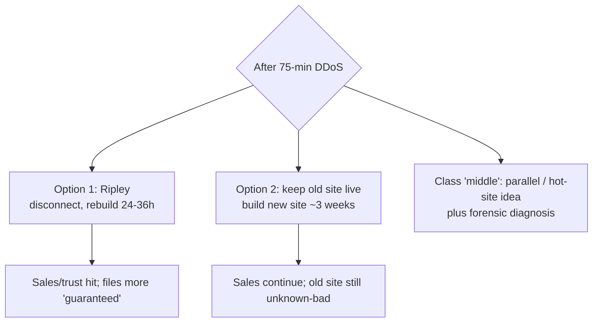

**Classroom split**

- Option 1: minimum **24–36 hours** dark (maybe more).
- Option 2: business continues; switch later with a smaller cutover. **Time and cost** both matter; option 2 looks better **financially** (sales keep coming) but needs extra spend and visibility.
- Moderated idea: start the new site; do **not** wait until it is finished to kill the old one — switch off in the **middle** once you have visibility, to cut residual risk.

Team “middle ground”: a **parallel server** (the **hot site** from today’s theory) until the original is fixed; and they have **still never diagnosed the source** — that must start.

### Instructor on standing at the end of B

The debate in the company is real: shutdown 1–1.5 days vs build separate and run as usual. Advantage of option 2: **nobody knows** the business was disrupted.

**Ripley is not satisfied because you don’t know.** Names/sizes are correct; **contents** may have changed; **new files** may have been installed. **Intrusion is unproven and unruled-out.** The attack **stopped on its own**. A parallel site “in a few months” leaves a window for a **bigger embarrassment tomorrow**.

Choosing option 2 at **this** information set is **ignoring what happened** and hoping a future site will save you. **“Hackers are smarter than the CIO.”** Forensics need **shutdown**, which the other side refuses because **customers leave**. **Catch-22** (“between the sea and the devil”).

### Part C — they do not shut down

Senior management **decides not** to shut down for a comprehensive rebuild of production platforms. They **accelerate** a new site with whatever is available at an **unaffected** location.

**Two weeks later:** an **FBI agent** calls — **iPremier is attacking their competitors**. The **source is a system inside iPremier’s production site**. Only then they find and **kill the file**. **That** is when they accept the **firewall was penetrated**.

They had assumed that because the flood **stopped** and no further requests arrived, the attack was **over**. The group’s phrase: hackers **misdirected attention**; **“suppressing the fire during the retreat.”**

Now three problems at “catastrophic” level:

1. **Ripley’s rebuild now** — initiating it can look like **destroying evidence**; FBI already sees iPremier as the **source of an illegal attack**.
2. **iPremier vs Market Top** — lawsuit likely; how to convince Market Top you are a **victim / zombie**, not the attacker.
3. **Public statement** — database server **compromised**; no identified individual customer harm yet; **still unknown** whether card numbers were stolen; if they were, **credit-card processing agreement** lawsuit as well.

**Student suggestions (Part C):**

- Run from a **parallel Qdata server** rebuilt from development files; let customers **browse** but **no credit-card payments** until fixed; **cash on delivery** for urgent orders.
- Ask **FBI** to diagnose and **share the report with Market Top**; collaborate on security rather than a lawsuit that burns **both** market shares.
- Publish incident report and countermeasures; flash “under maintenance” rather than taking cards.

Audience push: a parallel server **on the same architecture** can die the **same way**. Critical idea from the floor: **segregate financial / card data** from the digital storefront; **human / “analogous” interface** so card data is not sitting on the internet-facing box. Firewalls alone do not save you if the storefront is wired straight into payments.

### Microsoft and Google slides — and the instructor’s brake

Team brings **current** incidents:

- **Microsoft** services outage (Outlook, website, Excel; Indian locations named). Public Twitter updates; isolated to **network configuration**; mitigated in about **two hours** without extra impact. Employee jokes (enforced vacation; “why did you fix it so soon?”). Some users ready to **move to Google**. **Stock down ~USD 20** at report time.
- **Google**, **1 June 2022**: Cloud Armor customer hit by HTTPS floods peaking at **46 million requests/second**. **Cloud Armor Adaptive Protection** detected early and **kept the customer online**. **Rate limiting** (they would accept on the order of **1 million** RPS; 46 million was the tell). Attack described on **layers 3–4 (infrastructure)** vs **6–7 (application)**; **defence in depth** so compromise of 3–4 ≠ all layers. **Threat modelling**; red/blue/purple practice. Framed as **proactive**, not reactive.

**Instructor:** good currency, **wrong comparison**. Microsoft and Google are **world-top technology** firms. iPremier is **retail** whose IT sits at **Qdata**, whose **competence is the question**. Even a **new site** is pointless until they invest in **updated firewall and IDS** and then migrate. Otherwise they remain vulnerable. **Apples and oranges** — useful as a picture of **professional practice**, not as iPremier’s available playbook.

### Recommendations the team closes on

**Technical (preventive / detective / reactive):**

- **Reduce attack surface** (limit options for attackers; vulnerabilities always remain).
- **CDNs** — spread unusual packet floods across many internet servers (Amazon-class e-commerce).
- **Know normal vs abnormal** — 04:30 traffic while the city sleeps should have been raised; Qdata did not.
- **Plan for scale** — load balancers; DDoS protection services. **GitHub 2018** used **Akamai Prolexic**.
- **Firewalls** matched to application attacks: packet, **MAC filtering**, hybrid — spend vs coverage. Need to see **content** change, not only names.

**Management / reactive:**

- **CIA:** **availability** failed first — Ripley **could not enter Qdata**. Suggestion: **move to internal IT**.
- Implement **IRP** (during the incident), **DRP** (recovery steps after disaster), **BCP** (parallel site) — none existed.
- Update hardware/software: UTMs (unified threat management), express data paths, etc.
- **Roles:** nobody knew whom to contact; no conference call of options. **NIST 7-step** contingency management from the textbook: **CPMT**, champion, project manager, members — form this **first**.
- Identify source; keep a **forensic report**; optional parallel server for continuity.

Instructor thanks the team; the comparison caveat above is the last teaching beat.

## Cases and examples from the lecture

- **iPremier B:** disclosure, 75 minutes, name/size file check, 24–36 h rebuild vs ~3-week new site, IR team and tabletop at last, logging turned back on.
- **iPremier C:** no shutdown; two weeks later FBI; production host attacking Market Top; evidence vs rebuild; card-agreement liability.
- **Microsoft** public outage comms vs **Google Cloud Armor** 46M RPS, rate limit, defence in depth.
- **GitHub 2018 / Akamai Prolexic.**
- **Hot site** as the missing parallel server (from T13’s theory, applied here).

## Key terms

| Term | Meaning in this lecture |
|------|-------------------------|
| File identity and size check | Proves names/sizes exist; **does not** prove contents or extra malware files |
| Development files | Build source treated as **less likely tampered** than production |
| “Fire suppressed during the retreat” | Apparent stop of the DDoS hiding a **planted** capability |
| Credit-card processing agreement | Separate lawsuit path if numbers were stolen |
| CDN | Distributes flood traffic so one origin is not the only choke point |
| Defence in depth | Different controls per layer (team’s Google 3–4 vs 6–7 reading) |
| CPMT (NIST 7-step) | Contingency committee the firm should have had **before** 04:30 |
| Catch-22 | Forensics need darkness; the market needs light |

## Formulas / frameworks

- **Reactive vs proactive** (B’s post-attack shopping list vs Google’s pre-built Armor).
- **IRP / DRP / BCP** restated by the team: during / after / parallel-run — matching T11–T13, applied to a firm that had none.
- **CIA:** availability first casualty (ops locked out of the host).
- **Cost vs time** on the rebuild decision (instructor: both, plus **technical viability**).

## Distinctions the instructor insists on

- **Presence of files ≠ integrity of files.** Without content verification you do **not** know there was no intrusion.
- **Option 2 is not “we will be ready next time.”** It is **running the unknown-bad production site until a future date.** Hackers do not wait on your project plan.
- **Shutdown needed for forensics** vs **shutdown as customer suicide** — the case does not dissolve that tension; Part C shows what “no shutdown” **became**.
- **Do not copy hyperscaler playbooks onto Qdata.** New site without **new firewall + IDS** is the same vulnerability with a new label.
- A parallel server **on the same stack** is not by itself a DDoS answer; **separating payment data** is the more serious architectural hint from the floor.

## Exam-oriented recap

- B: public DDoS admission (75 min); name/size audits; Ripley 24–36 h rebuild vs live-old + new-site (~3 weeks); logging had been a 20% UX trade.
- C: they stay up; two weeks later FBI says iPremier is the attacker; planted file on production; Market Top and card-brand legal risk; rebuild now looks like evidence tampering.
- Theory applied: hot site, CPMT, IR/DR/BCP, simulated attacks — all **after** the fact.
- Instructor: diagnose the unknown; don’t pretend Google’s night is iPremier’s night.

---

# Lecture T14: Live session — Contingency planning Q&A

**Playlist index:** 14  
**Transcript:** [14-cybersecurity-and-privacy-supplementary-lecture.md](../transcripts/markdown/14-cybersecurity-and-privacy-supplementary-lecture.md)  
**Video:** https://www.youtube.com/watch?v=ozsxJCM4BGs  
**Week / theme:** Week 4 live session — contingency recap; vishing; data owner / custodian / user; technological vs managerial vulnerability

## Learning objectives

- Restate contingency as **planning for the unexpected**: CPMT restores to **normal operation in minimum time**.
- Hold both costs: **downtime vs restoration/redundancy**; optimum at the **intersection**.
- Use the instructor’s **on-the-spot correction**: **DR = recover at the same location**; **BCP = you must relocate**.
- Distinguish **vishing** (malicious **voice** calls) from **phishing** (malicious **email**).
- Apply textbook roles: **data owner**, **data custodian**, **data user / subject**.
- Treat **technological and managerial vulnerabilities as intertwined** (Target LAN, iPremier logging, Equifax governance).

Platform logistics (assignment deadlines, certificates, how to download videos, where to find reading files already answered in an earlier live session) are omitted. The **teaching** inside those Q&As is kept.

## What this lecture actually teaches

### How to use the week (teaching, not logistics)

Watch the week’s videos **and** read the materials **before** asking. Week 4 topic is **contingency planning** as **managerial planning** for cybersecurity. Textbook **chapter 4** is the reading. The course applies **management principles and frameworks** to environmental risk.

### What “management” is, in one line

A participant asked “what is this management?” Answer kept simple: **management is about managing resources** — what you use for production/creation: **manpower, money, land, materials, technology**. Technology is **one resource**. **Planning** is a core managerial activity. Without planning you can still “do things,” but **losses/costs are higher** — you are inefficient.

### Two types of planning in this course

| Type | When in the course | Stance |
|------|--------------------|--------|
| **Contingency planning** | This week | **Reactive** — incident happens despite preparation; restore |
| **Risk-management planning** | Later | Protective path (not this hour’s detail) |

**Contingency** means **not predictable** — **uncertainty**. Weather metaphor: morning is sunny so you assume the day stays fair; afternoon **clouds and rain**; you get wet because you did not plan. Even if you expect rain, a **tornado** can still arrive. **Unexpected things happen.** Contingency planning is **planning for the unexpected** — “like a paradox.” That is what this week’s lessons teach.

You prepare for **incidents** (events that **could** happen). If they happen **despite** preparations, **restore the organization / business / system to operational, normal running condition**.

### CPMT and “earliest”

Do not lose this principle: the **CPMT** (contingency planning task management group/team) restores systems to **normal operation at the minimum time** — **earliest possible**.

“Earliest” is not one pole:

- **Zero downtime** (no loss of time) is **best** operationally.
- The opposite is restore **at leisure**.

**Zero downtime is possible but introduces another cost.** The **shorter** the downtime target, the **higher** the cost of restoring — you **invest in redundancy** so that if one system fails, another takes over. **Trade-off: cost of downtime vs cost of restoration.** **Optimal point = intersection of the two curves** (as in the recorded lecture).

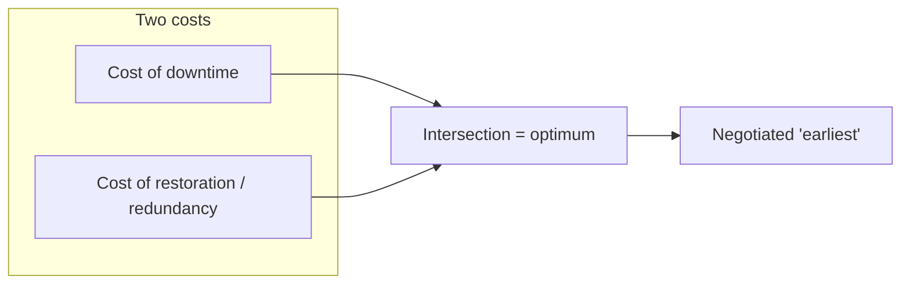

### Three impact classes — with a live correction

Three types of incidents:

- **“Normal” incident** — does not cost much; e.g. **one machine** affected.
- **Disaster** — entire operations / production / **e-banking** down; impact very high.
- Then a **location** question.

He **first** says a disaster means the place is destroyed, you cannot operate in Adyar/Chennai, you **move the unit**, “that’s called Disaster Recovery” — then **stops and apologizes**:

> **Business continuity.** Disaster Recovery is recovery **to the same location**; you **don’t change the place**. **Business continuity** is when you **cannot operate there anymore** and **need to move out** — **BCP**. DR is recovering the system from a disaster **but to the same location**.

That correction is the distinction to memorize. IR sits **before** disaster on the impact ladder. Before / during / after activities are in the recorded contingency lessons.

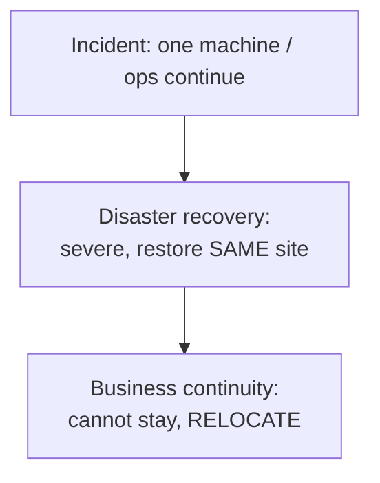

### iPremier as the unprepared narrative

**iPremier A** is a young e-commerce firm under **DDoS**. The presentation showed they were **not prepared**; people **blame each other**. Audience is both **technical people and managers** — you need **managerial ability and technology understanding**. End of the case: steps to treat cybersecurity **seriously**.

**Lack of contingency planning** → unexpected, sometimes **serious**, downtime → sometimes disaster → sometimes **BCP (shift location)**. Two reasons things go badly:

1. **Protection mechanisms are not sound enough.**
2. **Despite** that, people **blame each other** or **stare at the walls** because they **do not know what to do**.

**Be prepared** even after full risk-management investment in technology and people. Things can still go wrong. That **is** contingency planning.

### Q&A that teaches substance

#### Smartphones / “is cybersecurity used in phone?”

Smartphones **are** vulnerable — not only servers and PCs. Different attacks hit phones. A **major case of an Israeli firm snooping on Indian politicians** is mentioned **without naming** it (“politically charged, but it did happen”): data in cell phones stolen by **malware**.

Another phone-specific channel: **vishing**.

**Phishing vs vishing** (captions garble the spellings; the teaching is clear):

| | Channel | Content |
|---|---------|---------|
| **Phishing** | **Email** / spam with malicious content | Impersonation, malicious payload, credential/theft mails |
| **Vishing** | **Voice calls** from unknown people | Impostors who sound benevolent, “advise” or “help,” gather information or dangle money |

Vishing = phishing **applied to phones / voice**.

#### Technological vs managerial vulnerability

Cyber risk is **mostly with the technology**, but you **cannot separate people from technology**. One breakup of an information system: **people, process, technology**.

**Target:** clever hackers exploited vulnerabilities. There was a **LAN configuration** error: a **vendor could access a POS**. Was that technological or managerial? **Cause and effect.** What you **see** as the vulnerability is the **LAN misconfiguration** (technology). **Cause** is **human error**. **Fever vs infection:** fever is the symptom; infection causes it. **Managerial faults get reflected in technology**, which then enables attacks. Management/people and technology are **intertwined**; often you cannot separate them. Sometimes the people/management problem is **clear**:

**iPremier logging:** logging **turned off** → hard to trace who accessed the system. Why off? System felt **inefficient**. **Who decided?** A professional. Without **strict management processes**, those decisions happen and systems become “well done” in the wrong sense (caption: **vulnerable**). What prevents such errors: **standards and strong processes** (risk-management procedures and cybersecurity-management standards, later in the course) — incidents can be **minimized**, not wished away.

#### “Did Target fail because they used CIA technology?”

The case says they had **the best technology**, “as good as technology protecting a country” — that was the **investment**. It does **not** say CIA-grade tech **caused** the breach. Vulnerabilities came from **management failures**: **misconfiguration**, **lack of log details** — **human errors**. **Despite the best technology you can still have vulnerabilities because of people.** That has been the **bigger cause of data breaches** in the last decade.

Later case preview: **Equifax** (US) — documented case shows **not only management but governance failure**. Do not “just find fault with the technology.”

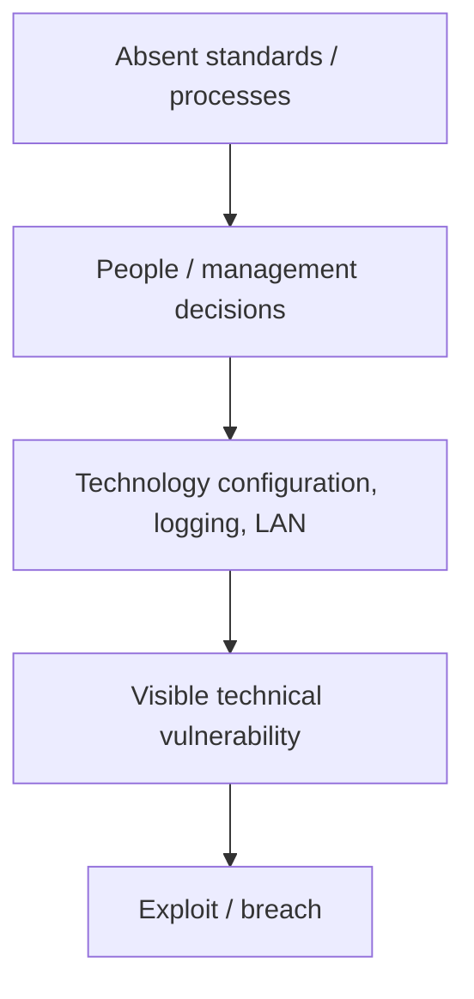

#### Data owner, custodian, user (textbook p. 40, chapter 1)

A participant quotes an assignment item: who is responsible for the **security and use** of a particular set of information — options including data users, data exporter, data custodians, data owner — and says the **key was C, data custodians**, “not data owner.” The instructor cannot fully parse the posted wording, so he **teaches the textbook split** and says **definitions matter**; do not use the terms loosely.

As he **reads page 40**:

| Role | Meaning in this lecture / textbook passage |
|------|-----------------------------------------------|
| **Data owners** | Members of **senior management** **responsible for the security and use** of a particular set of information. They usually **determine the level of data classification** and changes to classification when the organization changes. **Higher level.** Example: organization **XY** is the owner. |
| **Data custodians** | Work **directly with data owners**. **Responsible for the information and the systems that process, transmit, and store it.** **Operational** level. Example: a **database administrator** is custodian of data in that database; the **IT department** that manages the database is the custodian. |
| **Data users** | People **whose data is stored** — e.g. **students** in an educational institution. |
| **Data subjects** | Related privacy term, coming later: those **whose data is stored, processed, or transmitted** — overlapping the “user” idea in this answer. |

**Assignment key** in the live session is given as **C — data custodians**. The **teaching point** is the **senior vs operational** split: owners classify and are accountable at management height; custodians run the systems; users/subjects are the people in the data. Read the chapter; these are **technical terms with definitions**.

## Cases and examples from the lecture

- Weather / tornado: you cannot treat a clear morning as a plan.
- **iPremier:** no plan → blame; logging off for performance.
- **Target:** LAN/POS vendor path; “best tech”; still human/config/log failures.
- **Israeli-firm phone malware** against Indian politicians (unnamed).
- **Equifax** (preview): management **and** governance failure.
- Textbook **p. 40**: owner / custodian / user.

## Key terms

| Term | Meaning in this lecture |
|------|-------------------------|
| Management | Managing **resources** (people, money, land, materials, technology) |
| Contingency | Unpredictable incident; plan for the unexpected |
| CPMT | Team whose role is restore to normal **in minimum time** |
| Cost trade-off | Downtime cost vs restoration/redundancy cost; optimum at intersection |
| IR | Lower-impact incident (e.g. one machine) |
| DR | Recover from a severe event **at the same location** |
| BCP | **Cannot** operate here; **move out** |
| Phishing | Malicious **email** |
| Vishing | Malicious **voice call** (phone-channel phishing) |
| Data owner | Senior management; security/use; **classification** |
| Data custodian | Operational; systems that process/transmit/store (e.g. DBA) |
| Data user / subject | Person whose data is stored (students; privacy “subject”) |
| People–process–technology | The IS breakup; all three carry vulnerability |

## Formulas / frameworks

- Planning vs no planning → **higher cost / inefficiency**.
- Contingency **reactive**; risk management **later / protective**.
- **Shorter downtime target ⇒ higher restoration cost** (redundancy).
- **DR same site / BCP relocate** (after the spoken correction).
- **People, process, technology**; managerial cause → technical symptom.

## Distinctions the instructor insists on

- **He misspoke, then corrected:** moving plant because the site is dead is **BCP, not DR**. **DR = same location.** Learn the correction, not the first sentence.
- **Zero downtime ≠ free.** You pay in **redundant systems**.
- **Phishing ≠ vishing.** Email vs **voice**.
- **Owner ≠ custodian ≠ user.** Senior classification vs operational DBA vs the person in the database. Do not use the words loosely.
- **Tech vulnerability vs managerial vulnerability:** often **one event with two layers** (LAN misconfig is what was exploited; **who configured it** is management). Logging off is a **decision**, not a mysterious technical fate.
- **Best technology ≠ no breach** (Target). Later, **governance** can fail too (Equifax).
- Contingency is required **even if** risk management and controls were done.

## Exam-oriented recap

- Management = resources; planning cuts loss. Contingency = paradox of planning the unexpected; CPMT restores **earliest**, subject to the **two-cost** intersection.
- IR small; **DR same site**; **BCP relocate** (instructor’s apology is the rule).
- Phones: malware and **vishing**; email **phishing**.
- Owners (senior, classify), custodians (operational systems), users/subjects (whose data).
- Target/iPremier: people and technology **together**; standards/processes are what reduce those errors.

---
