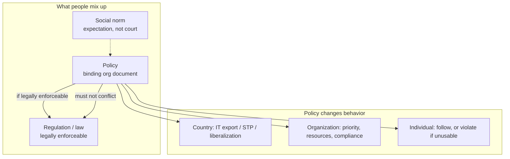
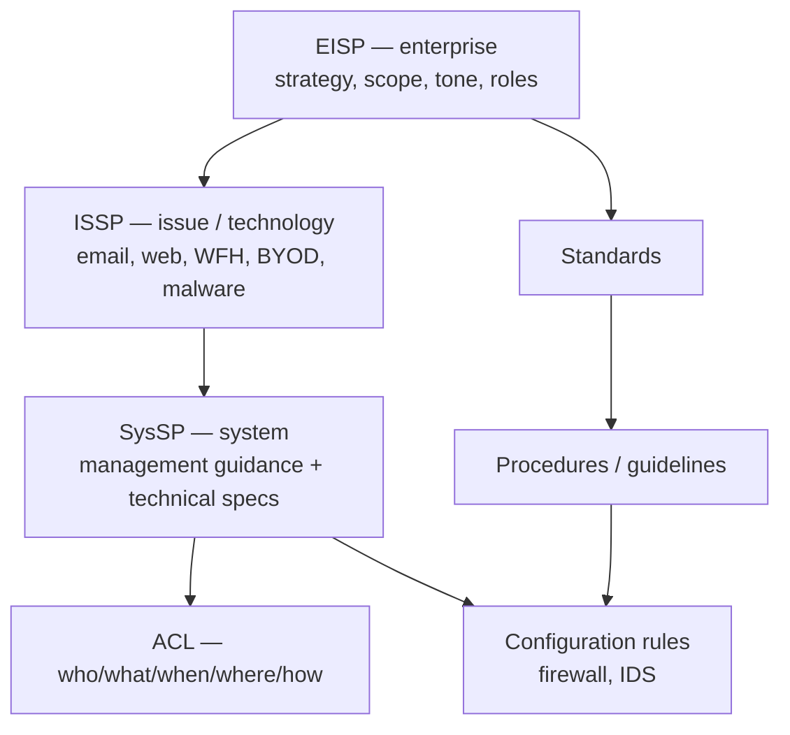
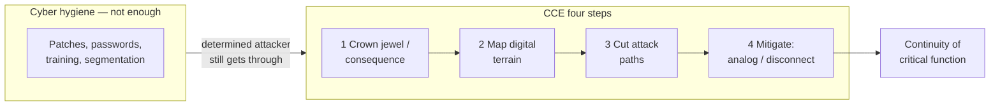
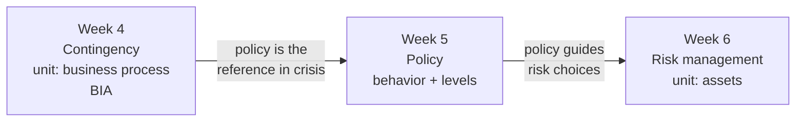
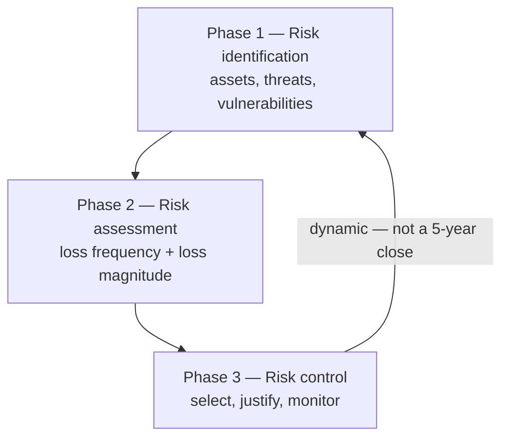
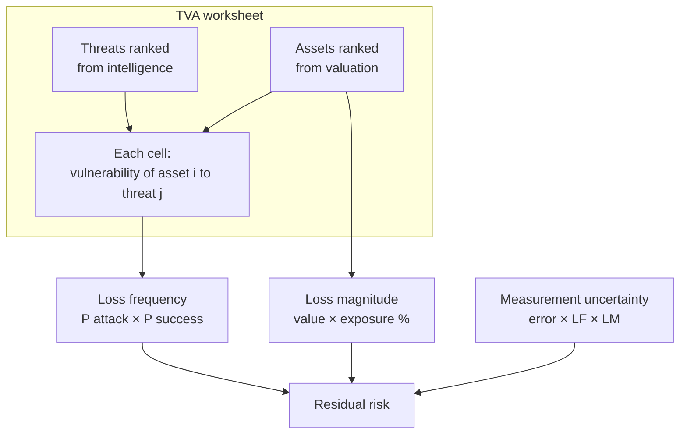
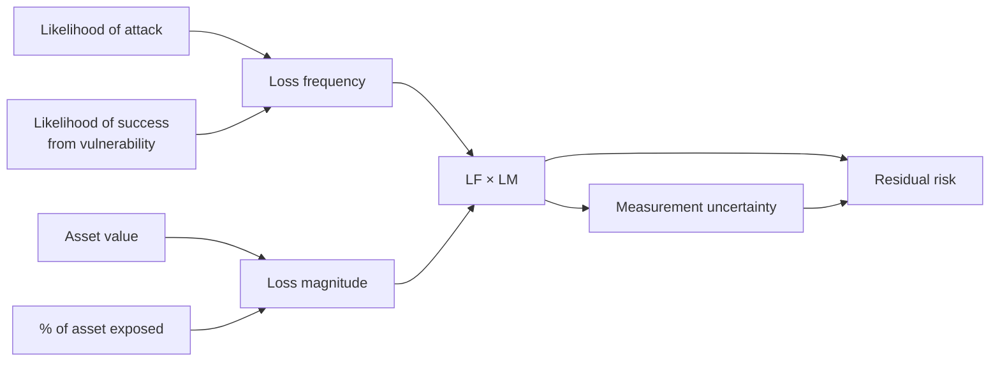
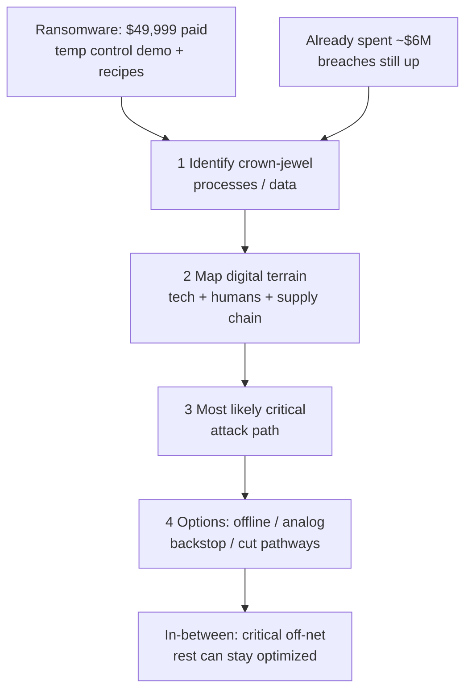

# Cyber Security and Privacy — Volume 03 — Policy and Risk Management

**Course:** NPTEL 106106248 · **Instructor:** Prof. Saji K. Mathew, IIT Madras  
**Series:** notes-2 (transcript-grounded)  
**Scope:** EISP / ISSP / SysSP; residual risk; TVA worksheet

These notes follow the lecture videos and public captions. They are study material, not official NPTEL transcripts.

---

# Lecture T15: Cybersecurity Policy — Part 01

**Playlist index:** 15  
**Transcript:** [15-cybersecurity-policy-part-01.md](../transcripts/markdown/15-cybersecurity-policy-part-01.md)  
**Video:** https://www.youtube.com/watch?v=8nEpUXaiZns  
**Week / theme:** Week 5 — Cybersecurity policy (what a policy is, and why it must exist)

## Learning objectives
- Treat policy as the **reference document** that planning and day-to-day security decisions go back to.
- Separate **norm**, **policy**, and **regulation** (law).
- See policy as something that can **enable** or **disable** an organization, and that **changes behavior** at country, firm, and individual levels.
- Apply the first formation rule: a policy must **never conflict with the law** and must **stand up in court**.
- Hold both sides of the trade-off the instructor keeps repeating: **protect** without blocking **progress**.

## What this lecture actually teaches

### Why this topic comes after planning
Cybersecurity here is still a **management and governance** problem, not yet information privacy. Without management planning, a business can be shaken or go bankrupt. Planning needs a reference: how important is cybersecurity, is top management committed, and will they fund it?

The IVK incident from the previous session is the foil. The firm did not approve investment in cybersecurity technology because it did not look like a priority. Managers therefore need to know whether the top team's position is **informed** or **arbitrary**. That is what brings the class to **policy**.

### What “policy” is in this course
A cybersecurity policy is a **document that acts as a reference**. It is **binding on everyone**, not written for one person. It exists in the **collective interest** (fairness, equity, course or organizational objectives) while trying not to invade personal space or become unjust.

The instructor’s classroom analogy: the course outline has a policies section (plagiarism, examinations, malpractice). Those clauses reflect the institute’s **code of conduct**. If copying is treated as “okay for you, not okay for him,” the instructor is not being fair. Policy is how you meet the objective without that imbalance.

### Norms, rules, regulation — three different things
When students hear “policy,” three words come up: **rules**, **regulation**, and **norms**. They are not the same.

- A **social norm** is expectation without a written rule. “Come well dressed to class” is the example: nobody can take you to court for dressing otherwise, yet people dress because of social expectation. Society largely functions on norms.
- A **regulation** (the law) is **legally enforceable**. Violate it and someone can take you to court.
- A **policy** is a binding organizational document with objectives. **If it is legally enforceable, it is a regulation; otherwise it is not.** Regulation is “basically a policy,” but policy need not be regulation depending on context.

### Policy can enable or disable
A well-framed policy lets the organization attain its objectives. An ill-framed one, or **no policy at all**, leaves the firm with nothing to refer to when a doubt or a crisis appears. The instructor’s constitutional analogy: without a constitution there is no reference; anyone can “set up their own shops.” IIT Madras itself functions because there is a constitutional provision for it.

Policy is an **essential foundation for effective cybersecurity programs**.

### Policy influences progress — country, organization, individual
**Country.** India’s IT industry did not grow for decades after independence. Growth started when **policy** changed: early computer-software-export policy actually **discouraged foreign investment** (indigenous-technology models of that era). Landmark later moves — **software technology parks**, **economic liberalization**, new economic policy, foreign investment in IT, IT services exports — **allowed** the industry to exist. “Policy influences progress.”

**Organization and individual.** Policy also changes organizational and employee behavior. There is a research literature on **employee compliance** with cybersecurity policies. A policy that makes daily work impossible (no internet, tight deadlines, no access to the sites the job needs) produces **violation**. Compliance is a function of many things, not of writing a document.

The trade-off already discussed for IDS and logging returns here: turn intrusion detection or logging fully on and you gain safety and lose efficiency. One thing is to **protect**; the other is to **progress**.

### The government’s instruction to Justice Srikrishna
The term of reference given to the Justice Srikrishna Commission (personal data protection bill) is quoted as a policy-balance sentence: **protect the privacy of people without inhibiting the potential of digital technologies**. Those two aims sit like parallel lines. **Whenever two things conflict, you need regulation to bring a balance.**

### Well-framed vs fear-framed policy
A well-framed policy can **motivate** people and invite the right behavior. An ill-framed policy makes people **violate**. A policy that only induces **fear** (huge penalties) may produce compliance **for the sake of the regulation**, at the cost of work output and efficiency. The live problem of cybersecurity policy is **how you bring the balance between efficiency and safety**.

### Principle 1: a policy should never conflict with the law
A cybersecurity policy is formulated **for an organization**. Some sectors are **required by regulation** to have one: **RBI requires every bank** to have a cybersecurity policy defining structures and processes. Whatever you write must be **in line with the law of the land**.

**Enron / Arthur Andersen (1990s).** Major accounting fraud; the company was going bankrupt while audit reports said it was healthy. The scandal drove stricter mandatory reporting and accounting standards globally, including the **Sarbanes–Oxley Act**. In the legal fight, Andersen destroyed emails and audit documents. They framed a **shredding (retention) policy**: retain a document **till it is relevant** — not “four years,” not a number. A qualitative phrase is **subject to interpretation**. Once the audit was “over,” they treated the files as not relevant and shredded evidence. That policy was seen as **in conflict with the law** (destruction of evidence). Today retention in telecom and other sectors is specified in **measurable numbers**, not qualitative slogans.

Contrast: IIT Madras’s own retention practice (examination answer scripts kept about **four years**, then collected for shredding). A number can be defended; “till relevant” could not.

**Illegal content / child pornography classroom debate.** Child pornography is illegal by law in any country the instructor is talking about. If an employee uses the office internet to reach illegal sites, **both the individual and the organization** can be responsible. Students first argue that internet is needed for work, so only the employee is at fault. The instructor’s test: **do you have a policy** that internet is for work and employees may not access sites prevented by law? Then it is a **policy violation** and a stronger court argument. Framing is not enough. **Policy must be implemented**: due care means firewalls actually block those sites. New bad sites appear daily, so blocking will never be complete — that is why you still need the written policy. The policy must **stand up in court**.

### Other formation principles named in the slides
- Do not contradict the law; know the related laws and regulations.
- Policy must be **properly supported and administered** (the firewall example).
- Policy should **encourage success** of the organization — blocking all internet is not a serious answer; you still have to “tap the potential of digital technologies” without compromising privacy.
- **Involve end users** of information systems in formulation.

Policy sits in the **outer circle**: it is referred to in all cyber-asset activity — networks, individual systems, specific applications. It is a **binding document**.

## Cases and examples from the lecture
- **IVK:** cybersecurity spend not approved; no documented priority.
- **Course policies** (plagiarism, exams) as a fairness / collective-interest document.
- **Dress code** as social norm, not regulation.
- **India’s IT industry:** early policy that discouraged foreign IT investment; later STP and liberalization that enabled growth.
- **No internet at work** as a security policy that drives violation under tight deadlines.
- **IDS / logging on:** safer, less efficient.
- **Justice Srikrishna Commission TOR:** privacy **and** digital potential.
- **Enron and Arthur Andersen:** “retain till relevant” shredding policy vs destruction of evidence; SOX-era tightening.
- **Institute shredding / retention:** answer scripts ~four years.
- **Illegal sites from office internet:** need a written acceptable-use statement **plus** firewall blocking (due diligence). Both org and employee can be liable.
- **Banking / RBI:** sector required to have a cybersecurity policy.

## Key terms
| Term | Meaning in this lecture |
|------|-------------------------|
| Policy | Binding reference document so the organization can meet objectives with fairness; not only for one person |
| Social norm | Unwritten expectation (dress for class); not court-enforceable |
| Regulation / law | Legally enforceable rule; someone can take you to court |
| Shredding / retention policy | How long documents are kept; must be specific enough to survive court |
| Due diligence (implementation) | Stating the rule is not enough; firewalls and admin must actually carry it out |
| Protect vs progress | Safety controls vs the organization’s ability to work; policy has to balance both |

## Formulas / frameworks (if any)
No numeric formula. The formation checklist taught here:

1. Never conflict with the law; it should stand up in court.
2. Support and administer the policy (technical and managerial).
3. Enable organizational objectives, not only restrict.
4. Involve end users in formulation.

## Distinctions the instructor insists on
- **Norm is not regulation.** Dressing for class is a norm; law is what a court can enforce.
- **Policy is not automatically law.** It becomes regulation only if it is legally enforceable.
- **A convenient policy is not a lawful policy.** Andersen’s “till it is relevant” was a policy that conflicted with the law.
- **Framing ≠ implementation.** “Employees must not visit illegal sites” is weak in court if the firewall still lets them through.
- **Individual fault does not automatically clear the organization.** Without a policy and due care, the org is still in the argument.
- **More restriction is not automatically better policy.** A policy that blocks work will be violated.

## Exam-oriented recap
- Policy is the reference that tells you cybersecurity is a priority and how people must behave; without it there is nothing to refer to in a crisis.
- Policy can enable (India IT) or disable (no document, or a document that makes work impossible).
- Quote-level balance: protect privacy **without inhibiting** digital technologies.
- First principle: **do not contradict the law**; use measurable retention rules, not “till relevant.”
- For internet misuse: written policy **and** blocking/implementation; both employee and organization can be responsible.
- Behavior change is the point: well-framed policy invites compliance; fear-only or unusable policy produces violation or inefficient compliance.

---

# Lecture T16: Cybersecurity Policy — Part 02

**Playlist index:** 16  
**Transcript:** [16-cybersecurity-policy-part-02.md](../transcripts/markdown/16-cybersecurity-policy-part-02.md)  
**Video:** https://www.youtube.com/watch?v=snROvNy3wf8  
**Week / theme:** Week 5 — Cybersecurity policy (hierarchy: EISP → ISSP → SysSP)

## Learning objectives
- Separate **policy, standards, procedures, and guidelines**.
- Use the three-level hierarchy the lecture treats as standard terminology: **EISP**, **ISSP**, **SysSP**.
- Treat policy as a **long-term master document**; put changing legal detail in standards/procedures.
- Explain **SETA** and why dissemination is a management duty.
- Map SysSP onto **management guidance** plus **technical specification** (ACL and configuration rules).
- Distinguish **firewall (prevention)** from **IDS (detection)**.

## What this lecture actually teaches

### Policy is not procedure
**Policy** is broader, **abstract**, and tied to strategic purpose: achieve objectives without compromising law and individual freedom. It is a philosophical-level statement.

**Standards** are the next level: more detail on how the policy will be enacted. They always **refer back to the policy**. How strict they are follows how the policy was written.

**Procedures and guidelines** implement the standards. Example used throughout: the **policy statement** is that employees may access legitimate sites and must not access sites prohibited by law. The **procedure** is the **firewall configuration rules**.

Domain and culture change how strict the stack is. Healthcare vs education have different priorities because **sensitivity of data** differs. An Indian academic cybersecurity policy may not be as strict as a healthcare organization’s; Carnegie Mellon’s document is far more detailed because **privacy concerns differ across cultures and countries**, so the law differs too. Sample policies from different domains are uploaded to the module for reading, not lectured item by item.

### Dissemination and SETA
Policy is not a master file locked in the corporate office. If employees have no clue, **that is not policy**. Top management is responsible for making it known.

On joining some firms you get a **code of conduct**. **Tata / TCS**: Tata Code of Conduct, mandatory to know. Other organizations have no such document drawn from policy.

In cybersecurity the dissemination mechanism has a name: **SETA — Security Education, Training and Awareness**.

| Letter | What this course says it is |
|--------|-----------------------------|
| **E** Education | This NPTEL course: concepts and theory, more than “how to do” |
| **T** Training | Immediately prepares you for a practice |
| **A** Awareness | Drills, mock-ups, periodic programs about **new** developments |

If you work in a young, asset-heavy firm like **iPremier** and there are no awareness programs, it is also **your** job to ask: what cyber assets do we have, what are the policies, do we know them? When things go wrong in a place with no clear policy, you may be running for your job.

### Policy does not change every time the law’s numbers change
Policy is **long-term**. It is not operational. You do not rewrite it daily.

Example: if a personal data protection act requires a cyber incident to be reported in **24 hours**, while **GDPR is 72 hours**, you do **not** have to change the policy. The policy already says the organization **complies with the law of the land**. You change the **standard / procedure** that states the number of hours.

### Three levels: EISP, ISSP, SysSP
The instructor presents this as a **hierarchy** and as **standard terminology** (textbooks and research papers). Organizations may **label jobs and documents differently** (Director–Cyber Security, Director–IT instead of CIO) if top management has not had security training. Conceptually the three levels still hold.

**Running example — email**

| Level | What it says |
|-------|----------------|
| **EISP** (enterprise) | Employees will be provided electronic mail; it must be used according to procedures and guidelines |
| **ISSP** (issue / technology) | Detailed email-use policy: storage quota, what you may send/receive, generally **not for personal** mail |
| **SysSP** (system / configuration) | Mail server configured at **5 GB**; you cannot exceed 5 GB — the rule is now technical |

In one sentence: EISP is **organization strategy, mission, vision**; ISSP is the **technology philosophy** (email, file storage, cloud, …); SysSP is **configuration**.

### EISP — Enterprise Information Security Policy
Also named in class **Enterprise Information Security Program Policy**. It sets **strategic direction, scope, and tone**. **Tone is word choice.** “Most important / critical” commits you; “gives due importance” is **subjective** (“what is due?”). Strong words imply you are **committing resources and money**.

EISP **assigns responsibilities** and guides development, implementation, and management of the information security program. Policy is a document **and** a **plan / basis to plan** later technology choices.

**Typical table of contents (as taught):**
- **Statement of purpose** — what you are trying to achieve; tied to organizational objectives.
- **Definitions / scope** — what “information security” covers (only data, or broader cybersecurity? people in or out?). Inclusion/exclusion must be clear because this is the **reference document**.
- **Need for cybersecurity** — why this attention.
- **Roles** — is there a **CISO**? Hiring a CISO is a **salary cost** plus a sub-organization. If the company is not committed, you will not see that post in the policy. **IIT Madras** at the time of the lecture: possibly **no CISO**. **Apollo Hospitals**: CIO, CISO, and a professional structure. Look at the uploaded policy samples.
- **References** to NIST or ISO **without pasting the details**.

### ISSP — Issue-Specific Information Security Policy
**Technology-level** guidance for **secure use** of systems. It does **not** re-argue organizational priorities. It does say how systems are **controlled and monitored** (malware detection; firewall logging **which machine** hit an illegal site). Employees should **know they are monitored** because it is in the document.

**Indemnification.** Legal term: to **absolve someone of responsibility**. The slide’s point is that ISSP **indemnifies the organization** against liability: if an employee does wrong, the **employee** should have to defend themselves; the org should not be automatically drawn into court.

Classroom Q&A:
- Should an **IT** employer indemnify **employees**? Depends on **intention**. Accidental click-through from spam to an illegal site, with evidence it was a mistake, is different from **gross / repeated negligence**.
- **Medicine** is the contrast profession: doctors are **indemnified**; the **hospital** fights the cases, otherwise the job is unlivable (patients die without negligence). Healthcare protects doctors.
- In typical IT resource-misuse cases, **employees abusing resources is the more likely event**, so the ISSP’s indemnifying clauses protect the **organization**. That is the document you take to a legal fight.

**ISSP topics listed:** email; World Wide Web; worms and viruses; hacking; how far security testing may go; **work from home** and **bring your own device** (still evolving post-pandemic). Off the org’s premises there is “absence of a perception of a guardian,” so **non-compliance is potentially high**. You must allow WFH/BYOD without working against the organization — a **policy-reframing** situation.

**ISSP components listed:** statement of purpose; prohibited use; systems management; monitoring; physical security; encryption; violations; policy review and modification; **limitations of liability / indemnification**. Described as a **detailed legal document**.

### SysSP — System-Specific Information Security Policy
Implementation stage. You cannot tell a court “our policy forbade it” if **the firewall allows everything**. Two parts:

1. **Management guidance** — procedure for how you configure (e.g. the firewall). Written to keep **CIA** (confidentiality, integrity, availability) inside policy and law.
2. **Technical specification** — the actual configuration. Operates broadly as **ACL** and **configuration rules**.

**Access control list (ACL):** mapping of **roles** to **what that role can access**. Taught dimensions: **who** can access; **what** they can access; **when** (some places block internet at night; IIT believed to have **no** night restriction); **where** (on-LAN vs anywhere); **how** (biometric vs password); **privileges** (read, write, create a table vs only query, modify, delete, compare, copy). Windows XP ACL screenshot: administrators, backup operators, guests, power users, etc., with different privileges.

**Configuration rules** implement ISSP and the management-guidance document. Examples: **firewall** (which external sites may reach IIT Madras internals; which outside sites insiders may reach) and **IDS** rules.

**Firewall vs IDS** (insisted on):
- **Firewall:** can prevent access **to and from**; **preventive / protective**.
- **IDS:** **detection only** — an **alarming** system. Some access happened; it does **not** prevent.

The lecture “touches the tyre”: policy at the top becomes issue policy and then **firewall / IDS configuration**. Next session is a student group on the HBR series that begins with **internet insecurity** (not security).

## Cases and examples from the lecture
- **Healthcare vs education** policies; **Carnegie Mellon** document vs a typical Indian academic policy.
- **Tata Code of Conduct / TCS** vs organizations with no code-of-conduct document.
- **iPremier:** if there is no SETA, ask for it.
- **Incident reporting 24 hours vs GDPR 72 hours:** change the standard, not the EISP’s “comply with law” sentence.
- **Email + 5 GB mailbox** as the three-level walkthrough.
- **IIT Madras** (no CISO called out) vs **Apollo Hospitals** (CIO and CISO).
- **Spam click** to an illegal site vs gross negligence (indemnify the employee or not).
- **Doctors / hospitals:** profession indemnifies the practitioner; ISSP in IT typically indemnifies the **org**.
- **WFH / BYOD** after the pandemic: missing “guardian” at home.
- **Windows XP ACL** screenshot; **IIT Madras firewall** rules; night internet bans at some institutions.

## Key terms
| Term | Meaning in this lecture |
|------|-------------------------|
| EISP | Enterprise Information Security (Program) Policy — top, strategy, scope, tone, roles |
| ISSP | Issue-Specific Information Security Policy — technology/issue level; can indemnify the organization |
| SysSP | System-Specific Information Security Policy — management guidance + technical specs |
| SETA | Security Education, Training and Awareness |
| Indemnify | Absolve of responsibility; ISSP is written so the **organization** is protected in typical IT abuse cases |
| ACL | Access control list: roles × resources × privileges × when/where/how |
| Firewall | Preventive control of traffic in and out |
| IDS | Intrusion detection — alarm, not prevention |
| Tone | Word choice in EISP (“critical” vs “due importance”) that signals resource commitment |

## Formulas / frameworks (if any)
**Policy stack:** policy → standards → procedures/guidelines.

**Security policy hierarchy:** EISP (enterprise) → ISSP (issue/technology) → SysSP (system: ACL + configuration rules).

**SETA** = Education + Training + Awareness.

## Distinctions the instructor insists on
- **Policy ≠ procedure.** Policy is the long-term reference; firewall rules are procedures.
- **Do not rewrite EISP when a statutory clock changes.** “Comply with the law” stays; the hour-count lives in standards.
- **EISP is not ISSP.** Enterprise document talks mission and roles; ISSP talks email/cloud/WFH and monitoring.
- **Indemnifying the organization is not the same as indemnifying employees.** Medicine often indemnifies doctors; this ISSP discussion is about protecting the firm from employee misuse.
- **Stated policy without SysSP implementation fails in court.**
- **Firewall is not IDS.** One prevents; one detects.
- Job titles on the org chart (**Director–IT**) may be wrong even when the **EISP/ISSP/SysSP** concepts still apply.

## Exam-oriented recap
- Hierarchy to memorize: **EISP → ISSP → SysSP**, with email as the stock example (facility → use rules → 5 GB config).
- SETA is how policy actually reaches people; this course is the **E**.
- ISSP is also a **legal** document (monitoring notice + indemnification).
- SysSP = guidance document + ACL + configuration (firewall/IDS).
- Policy is stable; standards move when regulation’s details move.

---

# Lecture T17: Cybersecurity Policy — Part 03

**Playlist index:** 17  
**Transcript:** [17-cybersecurity-policy-part-03.md](../transcripts/markdown/17-cybersecurity-policy-part-03.md)  
**Video:** https://www.youtube.com/watch?v=MZlDHGdqm3w  
**Week / theme:** Week 5 — Cybersecurity policy (HBR “internet insecurity”; critical infrastructure)

## Learning objectives
- Restate the article’s claim: **spending on cyber defense does not guarantee** you will be shielded.
- Define **critical infrastructure** as the lecture’s student group used it, and why coupling across sectors raises consequence.
- Contrast **cyber hygiene** with what a **determined attacker** can still do.
- Use Idaho National Laboratory’s **CCE** and **CIE** as a policy-relevant alternative to “buy more tools.”
- Carry forward the sentence the instructor underlines at the end: **any system connected to the internet is not secure.**

## What this lecture actually teaches

This session is **Group 3’s presentation** of a Harvard Business Review article on **internet insecurity** (not “internet security”). The instructor’s wrap at the end is short and is treated as the course’s takeaway. The next class is the sequel case **Protecting the Cheddar**.

### The article’s opening bet
Traditional answer: spend on cyber-intensive resources. The article’s question: does investing in the latest cyber defense **guarantee** success against malware? **No.** No amount of spending **guarantees** a shield. A different approach to cyber **defense** is required.

Statistics the group used (to motivate the bet, not as a formula sheet):
- Jump in attacks from 2021 to 2022 in regions including USA / North America and Latin America.
- **Most attacked industries in 2022:** government, healthcare, education, and specifically **critical infrastructures**.
- Global volume in **Q4 2022:** about **1,168 attacks per week** on average.
- Global cybersecurity spending projected about **$460 billion by 2025**, growing ~**15%** a year; Kaspersky-cited spend crossing **$300 billion** in 2022; cumulative **2021–2025** about **$1.5 trillion**.

### What “critical infrastructure” means here
Sectors named: **energy / power plants**, **telecommunication**, some **manufacturing**, **transportation**, **water treatment**. Complexity is growing because these used to be **decoupled** and now form **networks of connected devices** (grids). Example: battery vehicles need charging stations **on the grid**; telecom ties into energy and smart grids. **If one critical infrastructure fails, a chain reaction can take the system down.**

### Attacks on critical infrastructure (as presented)
- **Saudi Aramco:** 2012 **Shamoon** — passwords stolen, **>35,000** systems, data wiped, machines prevented from rebooting, **2–3 weeks** to restart; 2017 attack on a **safety controller** that stopped working and shut the system down; **July 2021** extortion via a **third-party contractor**, **$50 million** demand.
- **RedEcho** malware described as Chinese targeting of the **Indian power grid**.
- South Korean **nuclear** plant (named as a news item).
- **Ukrainian power grid**, including April 2022 during the Russia–Ukraine war: Russian agencies targeting large energy companies to trigger a **blackout** so invasion would be easier; Ukraine “narrowly escaped.”

### Capability versus vulnerability
Industrial control is absorbing **IoT, AI/ML, cloud**. Decision-making is faster; firms handle **terabytes** of data; “data is the new oil.” The same digital transformation that is “indispensable” makes the system **fragile**.

COVID and competition push every industry toward digital tools (automation, IoT, cloud) so employees can be effective. **Vulnerabilities grow at the same rate as capabilities.** Vendors may **not know** the vulnerabilities in new hardware/software. US companies’ information systems were cited as taking **more than 200 days on average** even to **detect** a threat; sometimes a **third party** notifies them.

The cost story: firms digitize to cut labor and error, then spend again on cybersecurity — **cost comes back in as cyber risk**.

### Cyber hygiene — useful, not sufficient
Analogy: seeing a doctor, sanitizing in COVID. **Cyber hygiene** = checking security of data, users, networks. Advanced performance monitoring can scan the IT environment, list assets and vulnerabilities, and produce a **scorecard** (critical / high / medium / low).

Regular practices named: latest software/hardware; employee training; **separating** important information systems from other networks; **complex monthly passwords**; **security patches**; limited access (not everyone sees everything).

**Limits the group stressed:**
- Millions spent still does not stop a **targeted** attack.
- You often **cannot** build a comprehensive inventory in **asset-intensive** industries (transport, energy).
- A large power station’s **dispersed substations**: an upgrade/rollout path can become the path that **collapses the whole grid** if an attacker is on that network.

Conclusion they draw from the article: you cannot avoid attacks by investing in technology alone. One remaining move is to **reduce dependence on digital platforms** for the most sensitive functions.

### Andrew Bochman and Idaho National Laboratory
Author: **Andrew (Andy) Bochman**, senior grid strategist at **Idaho National Laboratory (INL)**; ex-Air Force; IBM and other firms; advises governments and industry. The HBR piece points to his book (shown on the slide, not quoted here).

Headline move: stop talking as if the problem were **cybersecurity**; treat it as **cyber insecurity**. **No system connected to a digital platform is secure**, no matter how many firewalls or detection systems you buy. Aim: **redundancy so critical functions continue even if you are attacked.**

Two related frameworks:

| Framework | Where it sits in the talk |
|-----------|---------------------------|
| **CCE** — Consequence-Driven Cyber-Informed Engineering | Higher / broader: national-security-scale, well-resourced / **state-sponsored** threats. Change how the **hierarchy** perceives cyber threat. |
| **CIE** — Cyber-Informed Engineering | Companion, slightly lower: **cyber-physical / targeted IS** attacks. Bake cyber-risk mitigation into **concept, design, and production**, not after the boiler is already on a digital control system. |

Both refuse the idea that you must **do away with automation**. Both insist on **redundancy, contingency, continuity**. Engineers already think in **modes of failure**; **cyber attack should be one of those modes from the start**. INL treats this as a **philosophy**, not a recipe you sprinkle on after install. Curriculum and traditional engineering often leave cyber as an **afterthought** (then “put a firewall and IDS on it”).

**CCE four-step process** (also restated as “crown jewel” language):

1. **Consequence prioritization** — the greatest loss / most critical function that would jeopardize the whole firm or mission (**identify the crown jewel**).
2. **System-wide analysis / map the digital terrain** — pathways that can produce that consequence; who would target them and from where.
3. **Eliminate likely attack paths** to that consequence.
4. **Mitigation / protection** — as far as possible **analog** or **disconnect from digitalization** so the critical function still runs.

Who was supposed to run CCE: first INL people, then INL-trained people in firms — aimed at **CEOs, CFOs, regulatory/litigation owners, critical supervisors, safety experts, operators, first responders**.

**Wargame** with the people who own risk: each says what is most critical in their domain; you converge on one or a few consequences.

Hygiene still matters, but a **determined, resourced attacker** will **eventually get through**. Hygiene was said to stop only about **10–15%** of attacks in the article’s telling. Need a **cyber safety culture** so a first responder treats a small glitch/trip as the start of a campaign, not as noise.

**Air gap:** keep the **redundant** system off the internet. If the backup is also connected, the contingency plan fails in the same incident.

Cost: **higher cost initially** versus the “potentially devastating price of business as usual.”

### Instructor close
The article is an introduction to modern concerns. The author’s disturbing statement: **any system that is connected to the internet is not secure.** The practical sequel is **Protecting the Cheddar**, next class.

## Cases and examples from the lecture
- **Saudi Aramco** Shamoon (2012), safety-controller shutdown (2017), contractor extortion (2021, $50M).
- **RedEcho** and the Indian power grid; South Korean nuclear plant; **Ukrainian grid** 2022 blackout attempt.
- **EV charging / smart grids** as coupling that turns one failure into a cascade.
- **200+ days** to detect in cited US information systems.
- **INL / Bochman:** CCE vs CIE; crown-jewel analysis; analog / air-gapped redundancy.
- Handoff to **Protecting the Cheddar** (manufacturing / IoT sequel).

## Key terms
| Term | Meaning in this lecture |
|------|-------------------------|
| Internet insecurity | Article’s frame: connected systems are not secure; “cybersecurity spend” is the wrong guarantee |
| Critical infrastructure | Energy, telecom, critical manufacturing, transport, water; now interdependent grids |
| Cyber hygiene | Routine scanning, patching, training, segmentation, password discipline — necessary, not sufficient |
| CCE | Consequence-Driven Cyber-Informed Engineering — start from worst consequence, then cut digital paths |
| CIE | Cyber-Informed Engineering — include cyber as a failure mode from conceptual design |
| Crown jewel | The function whose loss jeopardizes the whole operation |
| Air gap | Keep the redundant / critical path off the internet so backup is not hit with the primary |

## Formulas / frameworks (if any)
**CCE process:** consequence (crown jewel) → map digital terrain → eliminate attack paths → mitigation (reduce digital pathways, analog, contingency).

**CIE vs CCE:** same philosophy; CCE aimed at high-end / state-scale consequence, CIE at engineering-in of cyber during design for cyber-physical systems.

## Distinctions the instructor insists on
- The series title is **insecurity**, not security — that is the point.
- **More spend ≠ guaranteed protection.**
- **Hygiene ≠ survival against a dedicated attacker.**
- **CCE is not “abandon automation.”** It is redundancy and less digital exposure for the crown jewel.
- **Do not air-gap the primary and then network the backup.**
- Cyber should be treated as an engineering **failure mode**, not an IT afterthought (firewall later).
- **Capability and vulnerability rise together** in digital transformation.

## Exam-oriented recap
- Quote-level claim to remember: a system on the internet is **not secure**.
- Critical infrastructure is **coupled**; one failure can cascade.
- Hygiene (patches, training, segmentation) is the floor; INL’s answer is **consequence-first** design and **reduced digital pathways**.
- CCE four steps and the crown-jewel language are the article’s method.
- Next case (**Protecting the Cheddar**) is how this argument looks inside a factory.

---

# Lecture T18: Cybersecurity and Privacy — Extended Discussion (live)

**Playlist index:** 18  
**Transcript:** [18-cybersecurity-and-privacy-extended-discussion.md](../transcripts/markdown/18-cybersecurity-and-privacy-extended-discussion.md)  
**Video:** https://www.youtube.com/watch?v=kZtw4L6LZS8  
**Week / theme:** Week 5 live session — policy as behavior change; BIA named; course arc into risk

## Learning objectives
- Expand **BIA** as asked in chat: **Business Impact Analysis** (Week 4, contingency planning).
- Place **policy** between contingency planning and risk management: policy **guides** risk work.
- Restate policy as the instrument that makes **desired behavior** appear — national, organizational, individual.
- Keep the internet-insecurity claim in decision language: **what you connect and what you don’t**, once you accept that connected systems are insecure.
- Know the Week 5 reading the instructor actually assigned (textbook chapter and the HBR article).

## What this lecture actually teaches

This is a **live Q&A**, not a new slide deck. The instructor answers **course-content** questions and refuses to re-litigate platform rules every week. Platform logistics (assignment misses, certificate rules, how NPTEL will or will not supply PDFs/textbooks) are **out of scope for these notes**.

### What kind of course this is (needed to interpret the materials)
It is a **postgraduate** course, not a typical UG “explain the textbook with extra examples” course. At PG/PhD level the class is **more than the textbook**; reading the book is the student’s job. That is why the course uses **journal articles** and **Harvard Business School cases** — to keep concepts in contact with practice. The live session does not re-teach Live Session 1’s tips on **how** to get those readings.

### BIA — the definition given in this session
Chat: “What is the full form of BIA?”

Answer given here: it relates to **Week 4 contingency planning** — **Business Impact Analysis**. He tells students to **read the textbook** and the chapters already flagged in live interactions. He does **not** re-derive MTD/RTO/RPO in this video. For this live session, **BIA = Business Impact Analysis**.

### Week 5 reading he actually names
- Textbook **Chapter 4**, pages **177–213**: information security policy.
- Lecture + PowerPoints: what policy is and **levels of policy**.
- Additional article: HBR **“Internet Insecurity”** / **“the end of cyber security.”** Access it yourself (method pointed to in Live Interaction 1).

### Policy operates at different levels of abstraction
What changes across the stack is **abstraction**. At organizational level, policy statements connect to **priorities and strategy**. At procedural level the same policy is **embedded in rules**, including **firewall configuration**. It **percolates from the top**: a policy gets implemented at a **rule** level. That is the idea already in the course videos.

### Why the weeks sit in this order
Someone complained that lectures “enter abruptly.” Without a specific timestamp he cannot debug the complaint. He instead teaches the **arc**:

| Week | Theme | What it is for |
|------|--------|----------------|
| 4 | Contingency planning — incident response, disaster recovery, business continuity | Planning for when protection **fails** |
| 5 | **Policy** | The document that **guides** (including later risk management) |
| 6 | **Risk management** | Another kind of plan: planning **to manage risk** |

**iPremier** (Harvard, denial-of-service) is not a random extra video. It is the Week 4 case: an organization **unprepared** to face an incident, people blaming each other while the clock ticks. Contingency planning asks what they should have done **before, during, and after**. Look at the **week’s theme**, then see how the pieces connect.

### Policy as behavior change
Week 5 first spends slides on **why policy matters**. **In the absence of policy, the desired behavior will not evolve.** If you want a desired behavior from an organization or an individual, **policy plus implementation** is what brings it. If **security compliance** is the behavior you expect from people, there must be a policy, it must be **communicated**, and it must be **implemented** — otherwise people will not comply. That is the effort of the policy week, with real-life examples, plus the **internet insecurity** article (the opposite of “security”).

The article is there to push an **informed policy**, especially around **critical infrastructure**.

### Critical infrastructure — “specific meaning”
An industry talk is coming in about two weeks. Examples he gives **for a country:** **health**, **energy**, **finance and banking**. **Inside an organization** you can also identify critical infrastructure. **Unless you know what is critical, you will not prioritize.** Once A/B/C are critical, have you actually planned security **in the era of the internet**?

The author’s observation, repeated: **any system connected to the internet is insecure.** Decision problem: **what do you connect and what don’t you?** Disconnecting costs **output, efficiency, convenience** — it can feel like turning the clock back to a no-internet era. That is a **decision-making** problem, not a slogan.

Week 6 will make this concrete with a **manufacturing company implementing IoT** and walking into **cyber insecurity** (the Cheddar / industrial case sequence).

So the designed sequence is: **contingencies → importance of policy → risk management**.

### Other content questions (kept; logistics dropped)
- **Data owners / data custodians:** already clarified in the **previous week**; watch those videos before re-asking. This session does **not** re-define the pair.
- **How to control smart cars:** internet-connected cars. Same doctrine: connected ⇒ **not fully secure**. There is **no panacea**. “Don’t use smart cars” is the conservative answer, like “don’t use cars if you fear accidents.” If the real question is how to use them **and** be secure, **wait for Week 6** (IoT sensors and controllers in industry — similar threat shape, a broad approach in that case discussion).
- **Career path / CEH, OSCP, CISSP-type certifications:** this offering is an **academic course** (concepts, frameworks, application), **not skill training** and not a substitute for those certificates. Technical certificates vs management-oriented **ISO/NIST** training depend on the job you want. Instructor has **not** personally done an ethical-hacking program; awareness-level only. Practical advice given: talk to people who completed the program (**LinkedIn**). **ISACA** named as a global industry body whose training is valuable and CV-relevant; **PMI** another body; **ISO** does not train directly but other organizations train to ISO cybersecurity standards.

Closing professional habit: before subjective opinions, **the first document you should ask for is the policy.** That matters beyond cybersecurity.

## Cases and examples from the lecture
- **iPremier** DoS case as the planned close of contingency week (unprepared incident).
- **HBR internet insecurity** as required Week 5 reading, not an abrupt extra.
- **Critical infrastructure** examples: health, energy, finance/banking (national); identify the equivalent inside a firm.
- **Smart cars** as internet-connected devices with no single “medicine.”
- Forthcoming **manufacturing + IoT** case as the insecurity sequel.

## Key terms
| Term | Meaning in this lecture |
|------|-------------------------|
| BIA | **Business Impact Analysis** — Week 4 contingency-planning assessment (full form as given in this live session) |
| Policy (behavior) | The document **and its implementation** that produce desired (including compliant) behavior |
| Levels of policy | Same intent at different abstraction: strategy/priorities down to firewall rules |
| Critical infrastructure | What must keep running for a country or a firm (health, energy, finance named) |
| Internet insecurity | Connected ⇒ insecure; policy is choosing what stays on the network |

## Formulas / frameworks (if any)
Course sequence as a framework: **contingency planning (BIA, IR/DR/BCP) → policy (guides) → risk management**.

Policy stack reminder: high abstraction (organization strategy) **percolates** to low abstraction (configuration rules).

## Distinctions the instructor insists on
- **Content questions vs platform rules.** This session is for the former.
- **PG class ≠ UG textbook recitation.** Cases and HBR are mandatory advanced material, not decoration.
- **iPremier is not a topic change**; it is contingency planning in a real incident.
- **Policy on paper is not behavior change** unless communicated and implemented.
- **Disconnecting from the internet is not free** — you trade efficiency for a smaller attack surface.
- This course is **knowledge / concepts**, not CEH-style skill training.
- **BIA** in this Q&A is the **name** of the Week 4 analysis, not a new formula lecture.

## Exam-oriented recap
- **BIA = Business Impact Analysis** (contingency planning, Week 4).
- Policy week sits **between** contingency and risk because policy is the reference that **guides** risk management.
- Desired security behavior does not “evolve” without policy that is **known and implemented**.
- Critical infrastructure must be **identified** before it can be prioritized; connected infrastructure is **insecure** by the article’s observation.
- First professional question: **what is the policy?**

---

# Lecture T19: Risk Management — Part 01

**Playlist index:** 19  
**Transcript:** [19-risk-management-part-01.md](../transcripts/markdown/19-risk-management-part-01.md)  
**Video:** https://www.youtube.com/watch?v=v7KtPLhSMkU  
**Week / theme:** Week 6 — Risk management (know yourself: assets; three phases)

## Learning objectives
- Contrast **contingency planning** (reactive; unit = **business process**) with **risk management** (preventive; unit = **assets**).
- State risk management as **identifying, assessing, and reducing** risk — **not eliminating** it.
- Use Sun Tzu’s pair **know the enemy / know yourself** as the frame for threats vs assets and preparedness.
- Explain **residual risk** as leftover risk after base safeguards, extra safeguards, and remaining vulnerabilities.
- Walk **risk identification**: six asset categories, tagging/database, classification, and **business-impact** valuation (not purchase price).

## What this lecture actually teaches

### Two kinds of cybersecurity planning
Management of cybersecurity is the course’s focus. **Planning is the heart of management.** Two categories:

| | Contingency planning (already done) | Risk management (this week) |
|--|-------------------------------------|------------------------------|
| Stance | **Reactive** — how you respond when incidents happen | **Preventive** — stop incidents; protect assets |
| Unit of analysis | **Business processes** (what gets hit) | **Assets** (what you protect) |
| If missing | Shock, unpreparedness, revenue and reputation loss | You never measured what to protect |

The differences are **subtle** and he wants them kept.

### Sun Tzu as the philosophy of risk
Sun Tzu (military philosopher, ~500 BCE; still used in strategy):

1. If you **know the enemy and know yourself**, you need not fear a hundred battles.
2. If you know yourself **but not the enemy**, every victory also costs a defeat.
3. If you know **neither**, you succumb in every battle.

**Know yourself** in cybersecurity = your **assets** and **current preparedness**. **Know the enemy** = intelligence on **external (and internal) threats** that could become attacks. “Enemy” is someone aiming to hurt you or create business losses.

### Definition and the three words
**Risk management is the process of identifying, assessing and reducing risk facing an organization.**

- **Identify:** assets that need protection; **threats**; how well prepared you are.
- **Assess:** current protection mechanisms.
- **Reduce:** close gaps; management decides how much to invest and which options. He uses **reducing**, not “eliminate.” **Mitigate** vs **reduce** are **nuanced**; they will return later. In an internet-connected world there is **no 100% security**.

A threat becomes an **attack** when it exploits **residual / leftover vulnerability**. Risk is the overall assessment of **chance that a threat becomes an attack** and **impact if it does**.

### Attack surface (and “vector”)
Term from talks and literature, **not in the textbook**. Useful visualization of **threats and assets together**.

People say **attack surface** and **attack vector** loosely. **Vector** means a construct with **more than one item** (physics: speed is scalar; speed + direction is vector). An attack surface is not “threats alone.” **Threats along with assets** becomes useful. Plot: **Y = types of threats**, **X = assets**. Every attack aims at an asset; affected assets then hit business processes. A manager can see **which threats materialized, which assets were hit, in what sequence**.

**Equifax (2017)** is flagged as a later case: credit bureau, **hundreds of millions** of individual credential/credit records stolen — not an early-IT-era story. Charted surface: **unpatched vulnerability**, **misconfiguration**, assets such as **storage** and **routers**.

### Residual risk before the process model
The purpose of risk management is to assess **residual risk**, not “raw” risk. Any sensible organization already has some protection (“a security post so thieves do not come in”).

Bar-graph layers he walks:

1. **Asset value protected by (base) safeguards** — e.g. **Windows** has built-in protection even without extra firewall/antivirus.
2. **Threat reduced by additional safeguards** — antivirus, firewall; how much you **choose to invest**.
3. Remaining **vulnerability** — e.g. **not installing Windows updates/patches**. Many recent attacks exploited missing patches. Regular patching **further reduces** risk.
4. After those three, what is left is **residual risk**. **Residue = leftover.**

Identifying and assessing, in this course, are essentially about measuring that leftover.

### Three phases
He repeats a management line: **you cannot manage unless you measure.**

**Phase 1 identification:** know what you have. Identify each **cyber asset**, threats that can impact it, current protection, **existing vulnerabilities**.

**Phase 2 assessment:** two measures for residual risk — **loss frequency** and **loss magnitude**. He says **estimate**, not “compute.” In class, **“risk” means residual risk**. Loss frequency is **probability-driven** (not every threat is equally likely; a threat must also **get through existing protection** — **likelihood of success**). Loss magnitude is **impact**, and it **differs by asset**. An **e-commerce server** that stops the whole business is not valued as “what we paid for the box”; an office PC used for small work may be low-to-medium. Once both parameters exist you can talk **risk** and **risk acceptability** (an **organizational decision**).

**Phase 3 control:** options, **financial justification**, then **monitor** and keep assessing. **Not** like five-year strategic planning you close. **Dynamic.** Practice questions should go to the **industry guest**, not be saved only for the professor.

### Risk identification in practice — know yourself
Sensible organizations **tag** assets. Educational institutions may not; **DOMS** (his department) does. A tag is an **identifier** plus descriptive information. Best store this in an **asset database** (ID as primary key).

**Six asset categories** in the table (cyber context): **people, procedures, data/databases, software, hardware, networking components.** People **are** assets — **cyber bullying** (named as Binod’s research topic) is an attack on an individual. **Policy** is listed among what you have to protect (procedures/policy as assets). Maturity of the IT organization affects how complete the inventory is.

Typical IT-asset attributes: name, IP, MAC, type, serial, manufacturer, etc.

People/procedures/data also need IDs: HR **employee ID / roll number**; ISO-style **procedure numbers**. People attributes include **security clearance** (authorization level: confidential / secret / top secret in military language). Data attributes: **owner, creator, size, online vs offline**. Procedures: purpose, where stored.

### Data classification
Information security cares about **sensitivity classes**, parallel to people’s clearance.

**Business example (four levels):** public; for official use; sensitive; classified. Clearance is defined against those classes.

**US military (classroom discussion):** unclassified (base; accessible); **sensitive but unclassified** (restricted to some extent / limited people); restricted; confidential (access clearly defined); secret (fewer people, level-defined); **top secret** (president / prime minister / commander-in-chief type access). Unclassified and “sensitive” are **not** the same.

### Assessing asset **value** (identification sliding into assessment)
Value is **not purchase price**. It is **impact on business**. Some assets are **critical** to running the business; some are important but not critical.

Usually an **instrument / questionnaire** plus **expert** input. Typical items: which information asset is most **critical to success**; generates most **revenue**; highest **profitability**; most expensive to **replace**; most expensive to **protect**; would cause highest **liability**. Think a **1–5** scale per item.

**Textbook numerical example:** older **EDI** (electronic data interchange) world. Assets include EDI document sets. Three criteria: **impact on revenue, impact on profitability, impact on public image**. Each criterion weighted; score **1–100**. One asset hits **100**: **customer order via SSL** — if customers cannot place orders, **business stops**.

## Cases and examples from the lecture
- **Sun Tzu** three statements as the RM philosophy.
- **Windows** built-in protection vs extra AV/firewall vs **missing patches** as vulnerability.
- **Equifax 2017** attack-surface sketch (unpatched, misconfiguration; storage/routers); full case later.
- **E-commerce server** vs **office PC** for loss magnitude.
- **DOMS asset tags** vs untagged classroom kit.
- **Cyber bullying** as attack on a **person-asset**.
- **US military classification** walkthrough with students.
- **EDI / customer order via SSL = 100** weighted score.

## Key terms
| Term | Meaning in this lecture |
|------|-------------------------|
| Risk management | Identify, assess, **reduce** risk to cyber assets (not eliminate) |
| Know yourself | Assets + current preparedness |
| Know the enemy | Threat intelligence (internal and external) |
| Attack | Threat that has exploited leftover vulnerability |
| Attack surface | Two-dimensional view: threats × assets (sometimes loosely called vector) |
| Residual risk | Leftover risk after base safeguards, extra safeguards, and remaining vulnerabilities |
| Loss frequency | Probability-side measure (introduced here; formula next lecture) |
| Loss magnitude | Impact-side measure; function of **business** value of the asset |
| Asset valuation | Weighted business-impact score, not invoice cost |
| Security clearance | Person’s authorized access class |

## Formulas / frameworks (if any)
**Process:** identification → assessment → control (loop, dynamic).

**Identification contents:** assets + threats + vulnerabilities.

**Assessment targets (named, not yet multiplied):** loss frequency (probability) and loss magnitude (impact).

**Asset value (example):** weighted combination of revenue, profitability, and public-image impact; 1–100.

## Distinctions the instructor insists on
- **Contingency ≠ risk management.** Process unit vs asset unit; reactive vs preventive.
- **Reduce ≠ eliminate.** Internet-connected devices have no 100% guarantee. **Reduce** vs **mitigate** will be nuanced later.
- **Residual risk is what you actually manage**, because some protection already exists.
- **Attack surface is not “list of threats.”** It is threats **with** assets.
- **Vector** implies **more than one dimension** — do not use the word emptily.
- **Asset value ≠ purchase cost.** SSL order channel at 100 is about stopping the business.
- **Unclassified ≠ sensitive-but-unclassified** in the military scheme they discussed.
- Risk management is **not** a five-year plan you finish.

## Exam-oriented recap
- RM = identify, assess, reduce; object is **residual risk**.
- Know yourself (assets, preparedness) and know the enemy (threats).
- Six asset categories include **people and procedures**, not only hardware.
- Classify people and data; value assets with a **business-impact** instrument.
- Next lectures: threats, TVA worksheet, then the residual-risk **formula**.

---

# Lecture T20: Risk Management — Part 02

**Playlist index:** 20  
**Transcript:** [20-risk-management-part-02.md](../transcripts/markdown/20-risk-management-part-02.md)  
**Video:** https://www.youtube.com/watch?v=WtbyE4GE7Zc  
**Week / theme:** Week 6 — Risk management (threats, TVA, residual-risk formula)

## Learning objectives
- Identify and **classify** threats; treat **threat intelligence** as **external** data.
- Place **vulnerability on the threat–asset pair**, not on “the firm” in the abstract.
- Use the **TVA worksheet** (threat–vulnerability–asset) as the assessment instrument.
- Compute **loss frequency** and **loss magnitude**, then **residual risk**.
- Record the **in-video four-term formula**, the **worked example that dropped current controls**, and the **instructor’s later correction** that removes the mitigated-controls term.

## What this lecture actually teaches

### Threats: identify and assess
There are **hundreds** of cyber threats; the lecture will not walk each one. **Threat intelligence** — what is current, critical, likely, frequent, high-impact — is **dynamic**. It is **not** in the professor’s head or the textbook. Practicing managers **subscribe**. **CERT** (C-E-R-T) provides some of this; richer feeds need **subscriptions or networks** with cyber-intelligence bodies. A more comprehensive threat list is posted on the module; cases later discuss prevalent ones.

**Classification** is how a manager deals with complexity (same reason marketing uses segments). About **12 categories** are shown. Named in class:

- Acts of **human error or failure**
- Compromises to **intellectual property**
- Deliberate acts of **espionage or trespass**
- **Information extortion** (threaten people; get money or assets)
- **Technological obsolescence** — **yes, this is a threat category**. Running critical business on **Windows 8** and refusing to invest is high cyber risk; case after case of machines left un-updated.

**Espionage (Q&A):** someone **inside** (or who was inside) the organization or country **betrays** it by leaking information. US military examples exist; “serious but higher-level.”

A **Communications of the ACM** paper ranks threat severity. They use a **mean** (from data) and a **weight**, plus a **standard deviation**. **Weighted rank ≈ mean × weight** (weights not fully explained on the slide). Point: threat intelligence **quantitatively scores** threats so they can be **sorted**. Low likelihood/low impact → low score; high/high → high score. You **cannot** produce this table internally the way you value **assets**.

| | Assets | Threats |
|--|--------|---------|
| Where the data lives | **Internal** (questionnaire, experts) | **External** (intelligence bodies) |
| What you do | Identify, classify, value | Identify, classify, rank |

### Vulnerability sits between one threat and one asset
Imagine one axis of assets and one of threats. For **each combination** ask: what is the **vulnerability** of **this** asset to **this** threat? That is **expert/judgment** work: leftover holes vs “are we 100%?” **A vulnerability is with respect to a given asset and a given threat.**

**Example:** vulnerability assessment of a **DMZ router** (technical: a **proxy** / shadow in front of the real server). Take **one** asset, walk **each** threat, describe potential vulnerabilities. Repeat for every asset.

### TVA worksheet
**Threat–vulnerability–asset (TVA) worksheet** — a **spreadsheet**, because each **cell** is two-dimensional. One axis threats, one axis assets (e.g. the DMZ router). First column: vulnerabilities of asset 1 against the listed threats.

Because assets are **rank-ordered** (valuation) and threats are **rank-ordered** (intelligence), the **top / first diagonal** can be the **most critical** cells. In practice this is a **very important instrument**. When you hear “I am vulnerable,” hear: **this asset is vulnerable with respect to threats 1…N**.

### Loss frequency and loss magnitude
These two terms are what you use to **calculate risk**.

**Loss frequency** = assessment of the **likelihood of an attack** combined with the **expected probability of success**. Two probabilities:

1. How likely is the attack? (external intelligence — e.g. DDoS vs phishing today)
2. If it happens, chance of **success** given **current vulnerabilities** (updated malware protection/firewalls ⇒ success probability low)

Without those probability values you only have **qualitative** assessment.

**Loss magnitude** is also called **asset exposure**. The asset may not be **100%** exposed. It **combines the value of the information asset with the percentage of asset lost** in a successful attack. Product: **asset value × percentage affected**.

Usual one-line risk talk is **probability × impact**. This course makes that **loss frequency × loss magnitude**, then does not stop there.

### Residual-risk formula as taught in this video
He presents a “magical” textual formula (no Greek letters):

**Residual risk = (loss frequency × loss magnitude) − (percentage of risk mitigated by current controls) + measurement uncertainty**

Four constituents. **LF × LM** is “one aspect of risk” (probability × impact). Then **minus** risk already mitigated by **current controls**. Then **plus measurement uncertainty**, because LF and LM are **estimates**, often **subjective**, so there is **error**. Uncertainty is added to stay on the **worst case** — step the number **up**, not down.

He then runs a textbook problem **without** a current-controls figure, so that term is treated as **absent / zero**.

### Worked example (e-commerce database)
Given:

- **10%** chance of an attack this year (industry; “one attack in 10 years”) → **0.1**
- If attacked, **50%** chance of success (current vulnerabilities) → **0.5**
- Asset valued at **50** on a **0–100** scale
- **80%** of the asset compromised if success → exposure **0.8**
- Estimates are **75% accurate**
- Current controls: **not mentioned**

Work:

| Piece | Calculation | Value |
|-------|-------------|-------|
| Loss frequency | 0.1 × 0.5 | **0.05** |
| Loss magnitude | 50 × 0.8 | **40** |
| LF × LM | 0.05 × 40 | **2** |
| Current controls | not in the question | **omit / 0** |
| Measurement error | 1 − 0.75 = **25%** | |
| Measurement uncertainty | 0.25 × 2 | **0.5** |
| Residual risk | 2 + 0.5 | **2.5** |

He is explicit: the **2** may **under-represent** risk, so **0.5** is added. Real estimation is hard; **practice is often qualitative**. Ask the practitioner how they actually fill a TVA sheet.

Risk **control / mitigation** (options, monitoring) is **phase 3**, next class. This video overran into the case slot.

### Instructor correction (removing the mitigated-controls term)
The four-term formula **confused the class**. In a later live session the instructor **corrects** the video formula and notes that a **newer textbook edition also dropped** “minus percentage of risk mitigated by current controls.”

Reason he gives: if LF and LM are already estimated **with current controls in place**, subtracting “mitigated by current controls” **double-counts**. Extra controls **after** assessment could be subtracted in a very fine-grained model, but that is not how the example works, and it is not needed for this course.

**Exam-facing formula after the correction:**

**Residual risk = (loss frequency × loss magnitude) + measurement uncertainty**

where **measurement uncertainty = (1 − accuracy) × (LF × LM)** in the textbook problem style.

Dropped term (video only, later removed): **− % risk mitigated by current controls**.

## Cases and examples from the lecture
- **Windows 8** left in production as **technological obsolescence**.
- **Espionage** as insider betrayal; US military cases alluded to.
- **CACM** weighted threat ranking (mean × weight).
- **DMZ router / proxy** as the single-asset, all-threats vulnerability write-up.
- **E-commerce database** residual-risk problem → **2.5**.
- Practice: quantitative TVA is the ideal; qualitative is common.

## Key terms
| Term | Meaning in this lecture |
|------|-------------------------|
| Threat intelligence | External, subscribed, dynamic scoring of threats |
| Espionage | Insider (or former insider) leaking against the organization/country |
| Technological obsolescence | A threat class: running critical work on un-updated platforms |
| Vulnerability | Gap **for a specific asset against a specific threat** |
| TVA worksheet | Spreadsheet of threats × assets with vulnerability in each cell |
| Loss frequency | P(attack) × P(success) |
| Loss magnitude / exposure | Asset value × % lost in a successful attack |
| Measurement uncertainty | Worst-case add-on from estimate error |
| Residual risk | Leftover risk after you have combined LF, LM, (and originally current controls,) plus uncertainty |

## Formulas / frameworks (if any)

**Loss frequency** = (chance of attack) × (probability of success)

**Loss magnitude** = (asset value) × (percentage of asset compromised)

**Video formula:** residual risk = (LF × LM) − (risk mitigated by current controls) + measurement uncertainty

**Corrected / exam formula:** residual risk = (LF × LM) + measurement uncertainty

**This problem’s uncertainty:** (1 − 0.75) × (LF × LM) = 0.25 × 2 = 0.5; residual risk = **2.5**

## Distinctions the instructor insists on
- **Asset valuation is internal; threat intelligence is external.**
- **Vulnerability is not a free-floating property of the company.** It is a **cell** in TVA.
- **Likelihood of attack ≠ likelihood of success.** Frequency uses **both**.
- **Exposure is not always 100%** of asset value.
- **LF × LM is not the whole residual-risk story** until you add **measurement uncertainty** (worst case).
- **Minus current controls** was taught, then **removed**: do not treat that subtraction as the working formula after the correction; controls are already inside success-probability / vulnerability if assessment is done in place.
- Quantitative is the textbook method; **qualitative is what many shops actually do** because the numbers are hard.

## Exam-oriented recap
- TVA: threats on one axis, assets on the other, vulnerability in the cell; sort so the **diagonal** is hottest.
- LF = 0.1 × 0.5 = 0.05; LM = 50 × 0.8 = 40; product = 2; +25% uncertainty = **2.5**.
- Remember the **correction**: residual risk = **LF × LM + measurement uncertainty** (no mitigated-controls term).
- Next: what the organization **does** with those numbers (control).

---

# Lecture T21: Risk Management — Part 03

**Playlist index:** 21  
**Transcript:** [21-risk-management-part-03.md](../transcripts/markdown/21-risk-management-part-03.md)  
**Video:** https://www.youtube.com/watch?v=2TsAnaO75ck  
**Week / theme:** Week 6 — Risk management (Protecting the Cheddar; CCE in a factory)

## Learning objectives
- Apply the **internet-insecurity / CCE** argument to an industrial plant, not only to “IT.”
- Reconstruct **Protecting the Cheddar** (Newhouse Cheese): ransomware, recipes, temperature control, $6 million already spent.
- Use the consultant’s **four-step** plan as the same crown-jewel method as CCE.
- Hold the class debate: **full rollback vs in-between** (critical functions off the open digital path).
- Hear the instructor’s stakes: **listeria / lives**, **ransomware-as-a-service**, **WannaCry / NotPetya**, and Industry 4.0 / IoT.

## What this lecture actually teaches

Group 4 (including Colonel Jagvir, Prasad Deshmukh, Sanjay Prasanna) presents the case **Protecting the Cheddar**. It is the **sequel** to the HBR insecurity article. Formal “risk control options” from the textbook process are **not** the spine of this video; the case **is**. An industry guest is promised next for practice insight.

### Newhouse Cheese Company
- **1811:** Cole Newhouse emigrates from **Wales**, founds the cheese company.
- Survives the **Great Depression** by tying up with supermarkets; tagline **“From Wales with love.”**
- Early **2000s:** fifth generation **Chadwick “Chad” Newhouse** (CEO) invests heavily in **digitization of precision control** monitors and devices.

**People in the room:**

| Person | Role |
|--------|------|
| Chadwick Robert Newhouse (Chad) | CEO |
| Frank Armen | CISO |
| Bruce Boyle | CFO |
| Jenny Cruickshank | (named among top executives) |
| Sara | Deputy to the CEO |
| Jack Parem | Cybersecurity consultant |

### The opening incident
Chad has just wired **$49,999** to an unknown person. The company is in a **ransomware** attack. Hackers showed they could **shut down a temperature-control critical device** and claim access to **sensitive recipe files**. On **legal advice**, the CEO **paid**.

Crisis meeting: Chad is furious; executives avoid eye contact. Suggestions from the table: buy **new intrusion monitoring**, raise budget, review **incident-response protocol** because **SEC** will “come knocking.” Ask: how much already spent on “the system”? **About $6 million.** Breaches have **still increased**. Uncomfortable silence.

**Sara**, from the back: **why are the systems even online?** Shouldn’t family recipes be **locked up on paper**? Why digitize pasteurization equipment? She briefs a **new risk-management process** she had read: **overly complicated software** and **anywhere/anytime access** to critical systems make firms more vulnerable. Many consultants: **put humans back in** and **reduce digitization**.

### Three weeks later — the plant tour
Chad, Frank, Sara, and Jack at a workstation. Sensors on tanks send **real-time** data: impurities, **temperature**, **bacteria**. “Saved us millions.” **Networked**, otherwise you must stand there in person. Alerts when something is out of order — “crucial to cost savings.” **Who has access?** “Anyone with a login”; usually two or three people, mostly Chad; he even logged in **from a hotel**.

Jack spends three weeks on the factory. **Four-step plan** (same shape as INL CCE):

1. **Identify the most critical information and processes** — walk each process, talk to stakeholders.
2. **Map the digital terrain** those processes sit on — hardware, software, **network structure**, **how humans interact**, **supply chain**.
3. From (1) and (2), identify the **most critical, likely attack path** (criticality × openness). **Called the most important step.**
4. **Generate options** for that likely, critical attack.

The exercise exhausts the executives: they see **how deep** they have sunk into digital networks.

### Three points of failure (consultant)
Sorted into three outcomes:

1. **Four pathways** into the network; a hacker can reach **industrial control systems**.
2. One system **compromised by a bot**.
3. (Grouped with the above in the presentation as three findings / categories.)

**Recommendations:**
- **Thermization** process: take it **completely offline**.
- **Networked temperature controls / automated temperature adjustments:** **remove**, or **keep but backstop with human / manual controls**.
- His **penetration test**: he could take **access-control / control systems** and reach **all recipes** — the shock to Chad, because recipes hit the **bottom line**.

### The heated debate
**CFO Bruce:** the whole point of going digital was to **save money**; going offline would **kill the bottom line**.

**Jack:** not “back to the Stone Age” — **reduce digital pathways**, the most likely **vectors**.

**Frank:** you want to roll the business back **20 years** for a **one-in-a-million** chance.

**Jack’s line the group highlights:** he came because of ransomware, but **ransomware does not scare him — listeria does.** Recent health-hazard catastrophes from companies that fail process control. If industrial controls are wrong, you ship food that can **kill**.

### Ransomware sidebar
Attacker builds ransomware or **buys** it. **RaaS — ransomware as a service** — a **business model** selling the software to criminals. Then social engineering, encrypt IT and data, demand money, sometimes in **cryptocurrency**.

### Should Chad implement the consultant’s recommendation?
The consultant is **not** “move all digitization back 20 years.” It is an **in-between**: take the **most critical parts of the value chain off the digital environment**; keep some optimization.

Class responses:
- Go that way: identify critical assets, **move them offline**.
- Matches **Cyber-Informed Engineering**: critical systems need a mapped **contingency**; keep them **out of the digital connectivity loop**.
- Another student: **not** completely offline — sensors still useful for **IoT / predictive maintenance** and long-term efficiency. Identify **critical** aspects and take **those** offline or restrict to a **local** environment.

**Instructor challenge:** if you roll back to **manual** temperature control, you re-import **human error** — the original reason for automation. Humans created problems in the analog plant **and** in the digital one. Is “going back” the solution?

Group’s mixed-system **pros:** isolation of critical systems (least damage); **least privilege / compartmentalization** so one access is not the whole plant; production may continue on **manual parallel** paths; recipes **more secure offline**; less unauthorized access.

**Cons:** **sunk cost** of automation already spent; **investor/public trust** if they hear “we went backward”; **hiring and training** faithful skilled people; **hindrance** while standing up the parallel system.

### Instructor close
The case is **industrial automation / IoT / Industry 4.0**: real pluses and risk that is not only **financial** but **loss of lives** (**listeria** — composition of a food product off standard).

Ransomware is a **high** present threat in **industrial controls**, including **national-level** operations:
- **WannaCry** — reports often point to **North Korea**.
- **NotPetya** — attributed in reports to **Russia**. Encrypted machines, asked ransom, **did not release even after payment** — “killing your systems.” Newhouse’s $49,999-and-release story is the **optimistic** variant.

Solutions are **still evolving**. Next session: someone from **industry**.

## Cases and examples from the lecture
- **Protecting the Cheddar / Newhouse Cheese** (full plot above).
- Hotel login to plant ICS as “anywhere/anytime” access.
- Pentest reaching **family recipes**.
- **Listeria** as the consequence that outranks ransomware in Jack’s argument.
- **RaaS** market for ransomware.
- **WannaCry** and **NotPetya** as country-scale ransomware; NotPetya as payment-does-not-unlock.
- Link back to **CCE / CIE** from the HBR presentation.

## Key terms
| Term | Meaning in this lecture |
|------|-------------------------|
| Protecting the Cheddar | HBS-style case: cheese manufacturer, ransomware, digitized process control |
| Thermization | Process Jack wants **completely offline** |
| Digital terrain | Hardware, software, network, human interaction, supply chain around a process |
| RaaS | Ransomware as a service — criminals buy the tool |
| Listeria | Food-safety catastrophe if temperature/composition controls are subverted |
| Least privilege / compartmentalization | Mixed-system argument: a breach should not see the whole plant |
| Sunk cost | Digitization money already spent; not a reason the consultant accepts to stay fully online |

## Formulas / frameworks (if any)
**Four-step plant review = CCE in operational clothes:** critical functions → map digital terrain → likely path → options (offline / manual backstop / fewer pathways).

No new residual-risk arithmetic in this video.

## Distinctions the instructor insists on
- **Paying $6 million for tools ≠ fewer breaches.** Same lesson as the HBR spend charts.
- **Jack is not selling the Stone Age.** He is selling **fewer digital pathways** to crown jewels.
- **Ransomware scare vs listeria:** in food ICS, **integrity of the process** can be a **life** issue, not only an IT issue.
- **Manual control ≠ automatically safer** — human error was why they automated.
- **NotPetya ≠ “pay and recover.”** Payment may not restore the machines.
- Industry 4.0 gains and this class of risk **arrive together**.

## Exam-oriented recap
- Cheddar storyline: pay **$49,999**, $6M already spent, recipes + temperature ICS, consultant maps terrain and pulls **critical** processes toward **offline / human backstop**.
- Four steps to memorize with CCE: crown jewel, digital terrain, likely path, mitigation options.
- Class/instructor landing zone: **in-between**, not total disconnect and not “business as usual online.”
- Ransomware (including RaaS, WannaCry, NotPetya) is **high** in threat intelligence for industrial control; consequence can be **lives**, not only coins.
- Formal **risk-control menu** is deferred; **industry session** is next.

---
